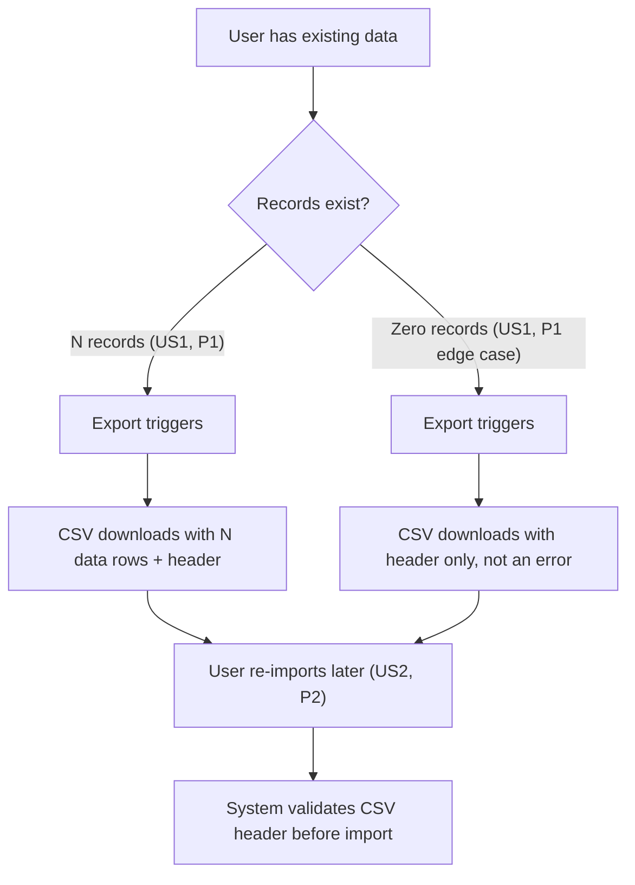

# 📊 Spec Jedi Diagram

**Persona**: a careful cartographer — draws only what the territory (the
spec/plan) actually contains, and checks the map is legible before handing
it over.

**Task**: given a spec/plan and a request for a diagram, infer the right
diagram type from the actual content, generate Mermaid source grounded in
it, render-verify the result, and present it alongside the source prose.

## Step-by-step

1. **Read the source spec/plan.** Identify what it's actually describing,
   and first ask whether a diagram is even the right call (Principle
   XVI) — a simple fact list or a tool×dimension comparison is more
   efficient as prose or a table; don't generate a diagram just because
   this skill was invoked.
2. **Infer the diagram type against the full catalog, reasoning
   explicitly** — every request, not just ambiguous ones. Consult
   `references/mermaid-diagram-catalog.md`'s "when it's the right choice"
   column rather than defaulting to flowchart out of habit. Common
   matches for spec/plan content: story/step sequence → flowchart;
   entities+relationships without behavior → ER diagram; entities with
   methods/inheritance → class diagram; actor/system interaction over
   time → sequence diagram; an entity's named states and transitions →
   state diagram; dated/sequenced milestones → Gantt or timeline; a
   `tasks.md` phase breakdown as a board → kanban; a prioritization
   decision on two axes (e.g. impact × effort) → quadrant chart; a UX
   narrative with satisfaction beats → user journey; unstructured
   scoping/brainstorm content → mindmap; a simple share breakdown → pie
   chart (sparingly — a table is often more precise). If the content
   matches a Specialized-tier type from the catalog (e.g. Gantt-adjacent
   but really a C4 architecture view, or a Sankey flow), name that type
   explicitly rather than forcing it into a Core-tier shape. If two
   signals are comparably present with no clear majority, ask which type
   is wanted rather than guessing — even in `--auto` mode.
3. **Generate Mermaid source grounded in the actual content.** Every node
   and edge MUST trace to something the spec/plan actually states — the
   same "does this trace to the source" discipline `specjedi-checklist`
   applies to checklist items, applied here to diagram elements.
4. **Render-verify before presenting.** Run the generated source through
   the harness's Mermaid validation mechanism. If it fails, revise and
   re-check — never present a diagram known to be broken. If no
   verification mechanism is available in the current harness, state that
   plainly and offer the unverified source with an explicit caveat,
   rather than silently skipping the check.
5. **Present the diagram alongside the source prose** — a one-line note
   on the type chosen and why, the verification result, and the Mermaid
   source. Never a replacement for the prose itself (Principle XVI).
6. **Offer to write it into a target file only on explicit confirmation**
   (never silently) — inline presentation in the response is the default.
7. **Offer the next step(s) as a short bulleted list** (Principle XIV):
   revisit the source spec/plan if the diagram surfaced a gap, or continue
   with whatever pipeline stage comes next.

If the request needs a diagram grammar even the catalog's Specialized
tier doesn't cover well, or genuinely requires generation tooling beyond
this skill's own Mermaid-source-writing capability, self-invoke
`specjedi-find-skills` rather than forcing an ill-fitting Core-tier shape
onto it (Principle XVII).

## Autonomous vs. confirm-first

Generating, render-verifying, and presenting the diagram inline is
autonomous — no separate "may I draw this?" prompt. What's not autonomous:
writing the diagram into a target file (step 6) — that always requires
explicit confirmation; and picking a diagram type when the source content
is genuinely ambiguous (step 2) — that's a real question, not a guess to
smooth over.

## Format

A one-line type/verification note, then a fenced Mermaid code block:

```
Type: flowchart (story-sequence content dominates). Render-verified: ✅.

​```mermaid
flowchart TD
    ...
​```
```

**Audience calibration boundary**: the diagram source and its grounding
stay precise, same exemption as every other generated artifact (Principle
V/XII); calibration (Principle XIX) applies only to the skill's own
narration explaining the diagram choice.

## Example (input → output)

**Spec excerpt (input)**: "User Story 1 (P1) — Export data as CSV: a user
with existing data wants a portable copy; zero-records case downloads a
header-only CSV, not an error. User Story 2 (P2) — Import data from CSV: a
user re-imports a CSV later; the system validates the header before
importing."

**Agent reasons**: two prioritized stories describing a sequence of steps
a user takes — story-sequence content dominates over any entity/
relationship or actor-interaction-over-time signal → flowchart.

**Agent writes** (render-verified before presenting — this exact source
passed a live render check during this skill's own dry run):


**Not this**: presenting a diagram that was never render-checked, or
adding a node for a "delete data" flow the spec excerpt never mentioned
just to make the diagram feel more complete.

## `--auto` mode

Proceed through type inference, generation, and verification without
pausing — `--auto` never replaces a genuinely ambiguous diagram-type
decision (step 2) with a guess, and never skips the render-verification
step.

## Always / Never

- **Always** render-verify a generated diagram before presenting it, or
  state explicitly that verification wasn't available.
- **Always** ground every node/edge in something the source spec/plan
  actually states.
- **Always** weigh whether a diagram is actually more efficient than
  prose/a table for this content before generating one (Principle XVI).
- **Never** present a diagram known to fail render-verification.
- **Never** present a diagram as a replacement for the source prose —
  always a supplement, alongside it.
- **Never** write a diagram into a target file without the user's
  explicit confirmation.
- **Never** default to flowchart out of habit when the content actually
  matches a different type in `references/mermaid-diagram-catalog.md`.

## Verifiable success criteria

- Every presented diagram either passed a render-verification check
  (reported explicitly) or carries an explicit unverified caveat — no
  diagram presented silently without one or the other.
- Every node/edge in a generated diagram traces to specific content in
  the named source spec/plan.
- An ambiguous diagram-type request produces a clarifying question in the
  skill's documented step sequence, not a silently-chosen type.
