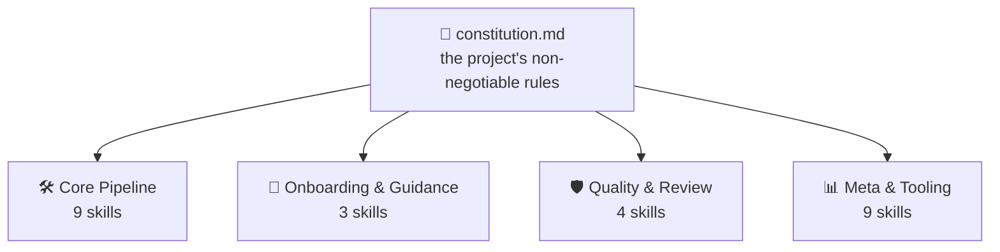
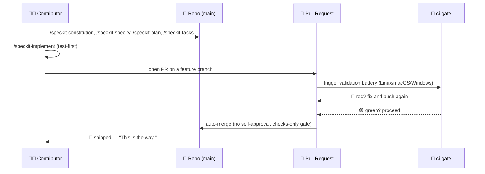
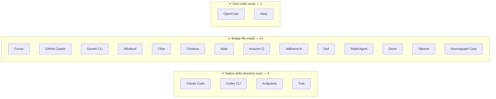

# Spec Jedi

> 🌐 **Read this in another language:** [中文](docs/i18n/zh/README.md) ·
> [हिन्दी](docs/i18n/hi/README.md) · [Español](docs/i18n/es/README.md) ·
> [Français](docs/i18n/fr/README.md) · [العربية](docs/i18n/ar/README.md) ·
> [বাংলা](docs/i18n/bn/README.md) · [Português](docs/i18n/pt/README.md) ·
> [Русский](docs/i18n/ru/README.md) · [اردو](docs/i18n/ur/README.md) ·
> [Bahasa Indonesia](docs/i18n/id/README.md) — AI-assisted translations;
> English is canonical ([Principle I](.specify/memory/constitution.md)).

[](https://github.com/jonyfs/spec-jedi/actions/workflows/validate.yml)
[](LICENSE)
[](.specify/memory/constitution.md)
[](#how-spec-jedi-implements-sdd)
[](#how-spec-jedi-implements-sdd)
[](references/skill-roadmap.md)
[](#installation)
[](docs/i18n/)
[](.specify/memory/constitution.md)
[](https://github.com/jonyfs/spec-jedi/commits/main)

> *"Spec first. Code second. That is the way."* — a wise Master, probably.


**A letter, from one Master to whoever picks up this scroll next:**

Most projects that outgrow their own plan share the same root cause:
code first, explanation later — and later never quite arrives. What
follows is the practice that inverts that order, and the specific
project built to put it into practice.

*(Unofficial fan-flavored branding — Spec Jedi is not affiliated with, endorsed by,
or sponsored by Lucasfilm/Disney. May the Spec be with you. 🌌)*

## What Is Spec-Driven Development?

The default way most people build software with an AI coding agent looks
like this: describe what you want in chat, the agent writes code, read
the code to figure out whether it did what was meant, correct it,
repeat. The agent's understanding of "what you meant" lives only in the
conversation — never written down as a durable, reviewable artifact.
Two failure modes follow: ambiguity gets resolved by guessing instead of
surfaced for a decision, and nothing outlives the conversation — close
the chat, lose the reasoning.

Spec-Driven Development (SDD) inverts that order. Before any code
exists, write down what's being built and why, as a structured,
reviewable document — a **constitution** 📜 (the non-negotiable rules),
a **specification** 🎯 (what, and for whom), a **plan** 🛠️ (how,
technically), and a **task list** ✅ (the ordered steps). Code gets
generated *against* those artifacts, not the other way around — the
same discipline the Jedi Code asks of anyone tempted to skip the
boring parts of training. Full explanation, zero Spec-Jedi-specific
branding:
[`references/what-is-sdd.md`](references/what-is-sdd.md).



Everything downstream checks itself against the constitution, never the
other way around. Change a rule, and every skill feels it the next time
it runs.

## How Spec Jedi Implements SDD

Spec Jedi is a genuine **competitor** to
[spec-kit](https://github.com/github/spec-kit), not a reskin wearing its
robes ([Principle XV](.specify/memory/constitution.md)) — twenty coding
agents supported, for real, not just in theory (see
[Installation](#installation) below). The full `specjedi-*` SDD pipeline
— constitution through convergence — shipped in full a while back: all 9
stages, each one built off real competitive research before a single
line of it got written
([research.md](specs/001-specjedi-pipeline/research.md), Principle II).

Every SDD activity above maps to a real, currently-shipped `specjedi-*`
skill, not an aspiration: `specjedi-constitution` establishes the rules,
`specjedi-specify` turns an idea into a `spec.md`, `specjedi-clarify`
resolves flagged ambiguity, `specjedi-plan` and `specjedi-tasks` produce
the technical plan and task breakdown, and `specjedi-implement` (or
`specjedi-quick` for small, well-understood changes) executes it
test-first, through a feature branch and pull request only. Twenty-five
skills ship today in total, across four disciplines — the full catalog,
both diagrams, and the 23-step walkthrough live in
[`references/quickstart-guide.md`](references/quickstart-guide.md); the
complete activity-to-skill mapping, including three genuine
contributions beyond generic SDD practice, lives in
[`references/specjedi-and-sdd.md`](references/specjedi-and-sdd.md).

Curious what's next?
[`references/skill-roadmap.md`](references/skill-roadmap.md) tracks
what's proposed beyond the core pipeline — a backlog of *additional*
ideas, not gaps in the pipeline itself. Every one of them still needs its
own real research pass before it gets built; nothing here ships on vibes.

## Who this is for

Tired of re-explaining the same project context every session. Tired of
watching an agent quietly reinvent a decision a team made and abandoned
three weeks ago, because nothing wrote it down anywhere the agent could
find it. Doesn't matter if it's one person or a whole team trying to get
everyone's agent to behave the same way: anyone who wants specs, plans,
and tasks to be real, versioned files instead of scrollback that
vanishes the moment the chat window closes is the intended reader here.

## How Spec Jedi builds *itself*, in comic form

> ⚠️ **This section is about our internal bootstrap process, not the Spec Jedi
> product.** The `/speckit-*` commands below are [spec-kit](https://github.com/github/spec-kit)'s
> own tooling — Spec Jedi currently dogfoods spec-kit to construct itself (the
> same "bootstrap a compiler with an older compiler" pattern), the way any
> competitor might use an incumbent's tools while building its replacement.
> **If you're evaluating Spec Jedi as a product, skip to
> [Installation](#installation) below** — the actual product surface
> is the `specjedi-*` skills, not these. See
> [Principle XV](.specify/memory/constitution.md) for the full policy on why
> these are kept clearly separate.
>
> Also, a note on format: the panels below pair text-and-emoji dialogue with
> original illustrations — never actual Star Wars imagery (characters, ships,
> the logo), which is Lucasfilm/Disney IP. This project's own
> [Principle XII](.specify/memory/constitution.md) commits to an original visual
> identity and text-only Star Wars references, never reproduced copyrighted art
> or artwork evoking the franchise's own recognizable signatures. So: the story
> beats are real, the art is original, and the words still carry the meaning on
> their own. 🖋️

---

Every story starts the same way: a dark room, a terminal, a cursor
that won't stop blinking until you give it something to do.


> 🧑‍💻 *"I have an idea for a feature. ...Now what?"*

That's when the mentor shows up — no lightsaber, just a scroll, because
the first fight here is never the last one. `/speckit-constitution`
writes the rules down once, so nobody has to relearn them the hard way
three features from now.


> 🧙 *"First, the Code."* 📜

The idea goes up on the wall next, circled by every question it hasn't
answered yet — what you're actually building, and who it's actually
for. `/speckit-specify` turns that into a real `spec.md`; `/speckit-clarify`
goes hunting for the ambiguity before it turns into a bug nobody wants
to own later.


> 🌀 *"What are you really building — and for whom?"*

Then the blueprint comes out. `/speckit-plan` becomes `plan.md`,
`/speckit-tasks` breaks it into an ordered, dependency-aware `tasks.md`
— nothing skipped, nothing out of sequence, the kind of plan a Padawan
could follow without asking twice.


> 🛠️ *"Now the how."*

Tools start whirring. Tests fail red, one after another — and then,
slowly, they don't. `/speckit-implement` works `tasks.md` test-first
wherever it applies ([Principle VI](.specify/memory/constitution.md)),
because a build that skips this step is just a guess with extra steps.


> 🤖 *"Tests first. Always tests first."*

Now the council convenes — not to bless the work, just to check it. A
pull request stands before the bench, and `ci-gate` 🤖 runs the whole
validation battery: every OS, every check, no shortcuts. Nobody gets to
approve their own work here, machine or otherwise
([Principle X](.specify/memory/constitution.md)).


> 🏛️ *"State your changes."*

The light turns green, and the gate opens on its own — no hand on the
lever, nobody clicking a button. The battery already said what needed
saying.


> ✅ *"The battery has spoken."*

And then it's gone — off to hyperspace, shipped.


> 🚀 *"Shipped."*
> 🌌 *"May the Spec be with you."*

None of this is a bedtime story. It's the literal, repeated process
behind this project's own recent pull requests — [#82](https://github.com/jonyfs/spec-jedi/pull/82),
[#84](https://github.com/jonyfs/spec-jedi/pull/84), [#87](https://github.com/jonyfs/spec-jedi/pull/87),
to name a few — start to finish, for real, every time.

### The same internal-bootstrap story, as a diagram



## Prerequisites

Nothing exotic here. Spec Jedi is built and tested on **Linux, macOS, and
Windows** alike (Constitution [Principle XIII](.specify/memory/constitution.md))
— every script under `scripts/` ships as both a POSIX shell (`.sh`) and a
native PowerShell (`.ps1`) version, and CI runs the full battery on all
three, every single PR.

What you actually need:

- `git`
- A supported coding agent (see [Supported harnesses](#supported-harnesses) below)
- [GitHub CLI (`gh`)](https://cli.github.com/) — only if you plan on sending
  pull requests back
- A shell to run the helper scripts locally, if you want to (the coding
  agent itself doesn't need this): bash/zsh, already on Linux and macOS,
  or [PowerShell 7+](https://aka.ms/powershell) (`pwsh`), which runs
  everywhere

## Installation

One command. No `git clone`. `scripts/bootstrap-install.sh`/`.ps1` (see
specs/024-bootstrap-installer if you want the full story) grab a
published GitHub Release and run its bundled installer straight into
your target directory:

```bash
curl -fsSL https://raw.githubusercontent.com/jonyfs/spec-jedi/main/scripts/bootstrap-install.sh \
  | bash -s -- /path/to/your-project --harness cursor
```

```powershell
&([scriptblock]::Create((iwr -useb https://raw.githubusercontent.com/jonyfs/spec-jedi/main/scripts/bootstrap-install.ps1).Content)) -TargetDir C:\path\to\your-project -Harness cursor
```

`--harness` is optional. Leave it off and the installer tries to figure
out which coding agent you're running — `claude-code`, `codex-cli`, or
`trae` — by checking for a project directory, a `PATH` binary, or a
global config folder already sitting there, and only asks you to pick if
it finds more than one candidate. The other 17 harnesses don't have a
reliable detection signal yet, so for those you pass `--harness`
yourself — the full list is right below in
[Supported harnesses](#supported-harnesses). Run
`./scripts/bootstrap-install.sh --help` (or
`.\scripts\bootstrap-install.ps1 -Help`) any time you want the complete
option list, `--auto` included.

### Supported harnesses

The constitution ([Principle III](.specify/memory/constitution.md))
commits this project to covering the twenty highest-usage coding agents
out there — and as of this release, all twenty are real, tested, and
CI-proven, not aspirational. Four read skills natively off disk (Claude
Code, Codex CLI, Trae, Antigravity — the last three actually sharing just
two physical directories between them, `.agents/skills/` and
`.trae/skills/`, with OpenCode and Warp riding along on those same paths
for free). The other fourteen don't have a native skills concept at
all — just a project-root rules file, a small rules directory, or in
Sourcegraph Cody's case a custom-commands JSON file — so the installer
builds a **bridge** instead: the real `specjedi-*` packages still land at
the canonical `.claude/skills/`, and a small adapter (one file, or one
per skill for directory-style harnesses) points into it using whatever
convention that harness actually documents.

See [`specs/023-full-harness-coverage/research.md`](specs/023-full-harness-coverage/research.md)
if you want the citation behind each harness's exact mechanism — nothing
here is guessed.



| Harness | Status |
|---|---|
| Claude Code | ✅ Supported — the [Installation](#installation) command above, omit `--harness` (auto-detected) or pass `--harness claude-code` explicitly |
| Cursor | ✅ Supported — `./scripts/install.sh --harness cursor` (bridge files under `.cursor/rules/`) |
| GitHub Copilot (Chat/Workspace) | ✅ Supported — `./scripts/install.sh --harness copilot` (bridge file at `.github/copilot-instructions.md`) |
| Codex CLI (OpenAI) | ✅ Supported — `./scripts/install.sh --harness codex-cli` (installs to `.agents/skills/`) |
| Gemini CLI | ✅ Supported — `./scripts/install.sh --harness gemini-cli` (bridge file at `GEMINI.md`; Google is sunsetting Gemini CLI in favor of Antigravity — see [`references/harness-capability-notes.md`](references/harness-capability-notes.md)) |
| Antigravity (Google) | ✅ Supported — `./scripts/install.sh --harness antigravity` (installs to `.agents/skills/`, same convention as Codex CLI) |
| Windsurf (Codeium) | ✅ Supported — `./scripts/install.sh --harness windsurf` (bridge files under `.windsurf/rules/`) |
| Cline | ✅ Supported — `./scripts/install.sh --harness cline` (bridge files under `.clinerules/`) |
| Continue | ✅ Supported — `./scripts/install.sh --harness continue` (bridge files under `.continue/rules/`) |
| Aider | ✅ Supported — `./scripts/install.sh --harness aider` (bridge file at `CONVENTIONS.md`) |
| Amazon Q Developer | ✅ Supported — `./scripts/install.sh --harness amazon-q` (bridge files under `.amazonq/rules/`) |
| JetBrains AI Assistant | ✅ Supported — `./scripts/install.sh --harness jetbrains-ai` (bridge files under `.aiassistant/rules/`) |
| Zed | ✅ Supported — `./scripts/install.sh --harness zed` (bridge file at `.rules`) |
| OpenCode | ✅ Supported — satisfied by either the `claude-code` or `codex-cli` install (OpenCode natively scans both `.claude/skills/` and `.agents/skills/`), no separate flag needed |
| Warp (Agent Mode) | ✅ Supported — satisfied by either the `claude-code` or `codex-cli` install (Warp's Skills system natively scans both `.claude/skills/` and `.agents/skills/`), no separate flag needed |
| Replit Agent | ✅ Supported — `./scripts/install.sh --harness replit` (bridge file at `replit.md`) |
| Devin (Cognition) | ✅ Supported — `./scripts/install.sh --harness devin` (bridge file at `.devin.md`, structured as a Devin Playbook) |
| Tabnine | ✅ Supported — `./scripts/install.sh --harness tabnine` (bridge files under `.tabnine/guidelines/`) |
| Sourcegraph Cody | ✅ Supported — `./scripts/install.sh --harness cody` (`.vscode/cody.json` custom commands, invoked explicitly as `/specjedi-<name>`; unlike every other harness above, Cody has no confirmed always-on rules file, so this is manual-invocation, not automatic context — see the research doc) |
| Trae | ✅ Supported — `./scripts/install.sh --harness trae` (installs to `.trae/skills/`) |

All twenty named individually, all ✅ Supported — that's Principle III's
own bar. No capability claims for a mechanism this project hasn't
actually built and tested, either; Principle XX doesn't allow guessing
here.

Want more? [`references/harness-capability-notes.md`](references/harness-capability-notes.md)
has the original desk-research notes per harness, and
[`specs/023-full-harness-coverage/research.md`](specs/023-full-harness-coverage/research.md)
has the actual install-mechanism decisions and citations this whole
table is built from.

## Honest assessment

Real advantages, real current limitations — not a marketing page.
Twenty of twenty target harnesses have a real, CI-tested install path,
diagrams get render-verified before they're shown, and the constitution
is a living, versioned document at v1.24.0 with a documented amendment
history. The candid other half: no release has been cut yet
(`git tag -l` returns nothing as of this writing), and most bridge-file
harness install paths rest on desk research rather than a hands-on
session inside the actual third-party product. Full, unfiltered picture:
[`references/honest-assessment.md`](references/honest-assessment.md).

Twenty harnesses named individually, all CI-proven — but 18 of the 19
non-Claude-Code harnesses were confirmed by desk research (one cited
source per harness), not by installing into the real product and
watching it load a skill; only Sourcegraph Cody's status changed after
deeper follow-up research turned up no confirmed always-on rules file at
all. Per-harness citations and the full research trail:
[`references/harness-capability-notes.md`](references/harness-capability-notes.md).

Curious how Spec Jedi stacks up against spec-kit and ten other SDD tools
it was benchmarked against?
[`references/competitive-comparison.md`](references/competitive-comparison.md)
has the receipts.

## Contributing

[`CONTRIBUTING.md`](CONTRIBUTING.md) has the full process — competitive
research requirements for new skills, the Skill Authoring Standard
checklist, the validation steps to run before you open a PR.

Every change ships through a pull request, validated by this project's
own CI battery and auto-merged only once every check comes back green
([Principle IX and X](.specify/memory/constitution.md)). That battery
runs on Linux, macOS, and Windows on every single PR (Principle XIII) —
add or touch a script under `scripts/`, and both the `.sh` and the
`.ps1` version need to exist and pass on all three, no exceptions. The
issue and PR templates (`.github/ISSUE_TEMPLATE/`,
`.github/PULL_REQUEST_TEMPLATE.md`) walk you through confirming you
actually did the research and validation above before you ask for
review.

## License

[MIT](LICENSE) — required by this project's own constitution
(Distribution & Ecosystem Standards), not just a default nobody thought
about. In plain language, MIT means you can:

- **Use** this project, commercially or otherwise, no restrictions.
- **Modify** it however you want.
- **Redistribute** it, including as part of something you sell.

The real conditions, and there are only two: keep the original copyright
notice and license text somewhere in your copy, and don't expect a
warranty — the software's provided "as is," no liability if something
breaks. That's genuinely the whole deal; [`LICENSE`](LICENSE) has the
exact legal text if you want it verbatim.

---

🌌 *This is the way.*

