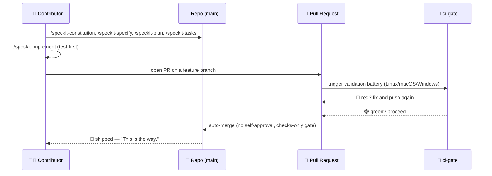
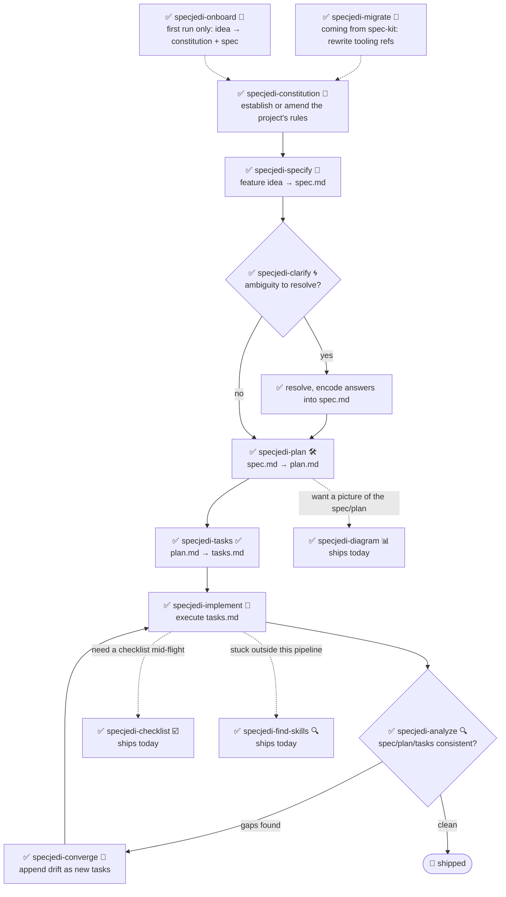

# 🗡️ Spec Jedi

[](https://github.com/jonyfs/spec-jedi/actions/workflows/validate.yml)
[](LICENSE)
[](.specify/memory/constitution.md)
[](#what-you-get-today)
[](references/skill-roadmap.md)
[](#installation)
[](.specify/memory/constitution.md)
[](https://github.com/jonyfs/spec-jedi/commits/main)

> *"Spec first. Code second. That is the way."* — a wise Master, probably.

Spec Jedi is a set of Spec-Driven Development (SDD) skills you install into your
coding agent of choice. Instead of writing code first and documenting it later, you
write a **constitution** 📜 (your project's non-negotiable rules), a
**specification** 🎯 (what you're building and why), a **plan** 🛠️ (how,
technically), and a **task list** ✅ (the ordered steps) — and your agent implements
against those artifacts instead of improvising like a Padawan who skipped training.

This repository is itself built with the same discipline it ships: its own
[constitution](.specify/memory/constitution.md) is the authoritative source for how
the project behaves, including how releases are versioned and how pull requests are
validated and merged. No shortcuts to the Dark Side of vibe-coding here. 🚫🖤

*(Unofficial fan-flavored branding — Spec Jedi is not affiliated with, endorsed by,
or sponsored by Lucasfilm/Disney. May the Spec be with you. 🌌)*

## Who this is for

Anyone using an AI coding agent who wants specs, plans, and tasks to be first-class,
versioned artifacts instead of throwaway chat messages — solo developers, teams
standardizing how their agents work, and anyone tired of re-explaining project
context every session.

## What you get today

Spec Jedi is a genuine **competitor** to [spec-kit](https://github.com/github/spec-kit),
not a themed wrapper around it ([Principle XV](.specify/memory/constitution.md)).
The full `specjedi-*` SDD pipeline — constitution through convergence — is
**complete and shipped**: all 9 stages, built one rigorous story at a time
per [research.md](specs/001-specjedi-pipeline/research.md)'s competitive
research discipline (Principle II), never rushed.

**Ships today, install and use now:**

| Skill | What it does |
|---|---|
| `specjedi-onboard` 🌱 | First-run walkthrough for a brand-new project — produces a real first `constitution.md` and `spec.md` together, teaching each SDD concept exactly when it's needed. Steps aside instantly if onboarding already happened |
| `specjedi-constitution` 📜 | Establishes or amends a project's non-negotiable rules — the foundation every other `specjedi-*` skill checks against. See [spec](specs/001-specjedi-pipeline/spec.md) |
| `specjedi-specify` 🎯 | Turns a feature idea — one sentence is enough — into a prioritized, independently-testable `spec.md`, marking real ambiguity instead of guessing |
| `specjedi-clarify` 🌀 | Scans a spec for real ambiguity and asks up to 5 prioritized questions — each with a Recommended answer so a beginner gets guidance and an expert can reply in one word — before you plan against a guess |
| `specjedi-plan` 🛠️ | Turns a clarified spec into a technical `plan.md` — scans the actual codebase for existing conventions first, so implementation never has to stop and search for one |
| `specjedi-tasks` ✅ | Breaks a plan into an ordered, dependency-aware `tasks.md` grouped by user story — sequences a failing test before its implementation task wherever the plan calls for code |
| `specjedi-implement` 🔨 | Executes `tasks.md` in dependency order, test-first where the plan calls for code — commits only through a feature branch and pull request, never directly to `main` |
| `specjedi-analyze` 🔍 | Strictly read-only cross-check of `spec.md`/`plan.md`/`tasks.md` (and the constitution) for gaps, duplication, and contradictions — reports findings, never edits a file |
| `specjedi-checklist` ☑️ | Generates a custom checklist for a named focus area (security, accessibility, performance...) grounded entirely in this feature's own `spec.md`/`plan.md` — never generic boilerplate |
| `specjedi-converge` 🔁 | Detects drift between the actual codebase and `tasks.md` after manual changes, appending any gap as a new task instead of silently ignoring it — closes the loop back to `specjedi-implement` |
| `specjedi-find-skills` 🔍 | Suggests a specific, verified skill when your request touches a domain nothing installed covers well — never installs without asking first ([Principle XVII](.specify/memory/constitution.md)) |
| `specjedi-explain` 🎓 | Explains any SDD concept or command, calibrated to how experienced you sound — total beginner through daily practitioner, never the same canned answer either way ([Principle XIX](.specify/memory/constitution.md)) |
| `specjedi-migrate` 🔄 | Rewrites literal `/speckit-*` tooling references in your own constitution/spec/plan/tasks to their `specjedi-*` equivalents — never touches principle or requirement content, explicit request only |
| `specjedi-diagram` 📊 | Generates a render-verified Mermaid diagram (flowchart, sequence, or ER — inferred from content) from an existing `spec.md`/`plan.md` — always a supplement to the source prose, never a replacement |
| `specjedi-status` 🧭 | Project-wide dashboard showing every feature's status, derived entirely from on-disk `spec.md`/`plan.md`/`tasks.md` artifacts — zero separately-maintained tracking system, never asserts "stalled" as a fact |
| `specjedi-retro` 🪞 | Strictly read-only retrospective comparing a completed feature's actual implementation against its `plan.md` — grounds any deviation's cause in real git history, never invents one, logs a durable dated entry |
| `specjedi-security` 🛡️ | Lightweight, proactive "did we think about X" prompt for auth/input validation/secrets/data-privacy gaps — self-invoked by `specjedi-plan`, never claims to be a full security review |
| `specjedi-docs` 📚 | Drafts a README skill-table row, Quickstart step, and `CHANGELOG.md` entry from a shipped feature's spec/plan — grounded in actual content, always shown for confirmation before writing |
| `specjedi-new-skill` 🌟 | Scaffolds a new `specjedi-*` skill's file structure — placeholders only, never invented content — following this project's own Skill Authoring Standard and baking in the Principle II research checklist |
| `specjedi-release` 🚀 | Wraps `scripts/suggest-release.sh` with Spec Jedi's own voice — narrates the last tag, suggested next version, and contributing commits; declines and names the manual command if asked to actually cut a release |
| `specjedi-skill-review` 🎓 | Strictly read-only audit of a `specjedi-*` skill's `SKILL.md` against the Skill Authoring Standard — checks section content, not just headings, cross-references the matching `plan.md` for legitimate exemptions, reports findings or a clean pass, never edits the reviewed file |
| `specjedi-tokencheck` 🎒 | Proactively checks whether `rtk` and `graphify` are installed, explains what's missing and its expected token savings, and offers an install walkthrough — self-invoked by `specjedi-onboard`'s first-run flow, also runs standalone; never installs anything without explicit confirmation |

See [`references/skill-roadmap.md`](references/skill-roadmap.md) for what's
proposed beyond the core pipeline (diagrams,
and more) — a backlog of *additional* skills, not core-pipeline gaps; each
still needs its own research pass before it gets built.

## How Spec Jedi builds *itself*, in comic form

> ⚠️ **This section is about our internal bootstrap process, not the Spec Jedi
> product.** The `/speckit-*` commands below are [spec-kit](https://github.com/github/spec-kit)'s
> own tooling — Spec Jedi currently dogfoods spec-kit to construct itself (the
> same "bootstrap a compiler with an older compiler" pattern), the way any
> competitor might use an incumbent's tools while building its replacement.
> **If you're evaluating Spec Jedi as a product, skip to
> [What you get today](#what-you-get-today) below** — the actual product surface
> is the `specjedi-*` skills, not these. See
> [Principle XV](.specify/memory/constitution.md) for the full policy on why
> these are kept clearly separate.
>
> Also, a note on format: these are text-and-emoji comic panels, not generated
> artwork. Actual Star Wars imagery (characters, ships, the logo) is Lucasfilm/
> Disney IP — this project's own [Principle XII](.specify/memory/constitution.md)
> commits to text references only, never reproduced copyrighted art. So: the story
> beats are real, the panels are Markdown. 🖋️

---

**PANEL 1 — A lone terminal, blinking cursor.**
> 🧑‍💻 *"I have an idea for a feature. ...Now what?"*

**PANEL 2 — A hooded figure steps out of the shadows, holding a scroll.**
> 🧙 *"First, the Code."* 📜
> `/speckit-constitution` — the project's non-negotiable rules, written down once,
> checked forever after.

**PANEL 3 — The idea, pinned to a wall, question marks circling it.**
> 🌀 *"What are you really building — and for whom?"*
> `/speckit-specify` turns the idea into `spec.md`. `/speckit-clarify` hunts down
> the ambiguity before it becomes a bug.

**PANEL 4 — A blueprint unrolls across a workbench.**
> 🛠️ *"Now the how."*
> `/speckit-plan` → `plan.md`. `/speckit-tasks` → an ordered, dependency-aware
> `tasks.md`. No step skipped, no step out of order.

**PANEL 5 — Tools whirring, tests failing red, then turning green one by one.**
> 🤖 *"Tests first. Always tests first."*
> `/speckit-implement` executes `tasks.md`, test-first where it applies
> ([Principle VI](.specify/memory/constitution.md)).

**PANEL 6 — A council chamber. A pull request stands before the bench.**
> 🏛️ *"State your changes."*
> A PR opens. `ci-gate` 🤖 runs the full validation battery — every OS, every
> check. No self-approval allowed; the machine can't pardon itself, and neither
> can you ([Principle X](.specify/memory/constitution.md)).

**PANEL 7 — Green light. The gate opens on its own.**
> ✅ *"The battery has spoken."*
> All checks pass → auto-merge, no human had to click a button.

**PANEL 8 — A ship leaps to hyperspace.**
> 🚀 *"Shipped."*
> 🌌 *"May the Spec be with you."*

### The same internal-bootstrap story, as a diagram



## Prerequisites

Spec Jedi is developed and validated on **Linux, macOS, and Windows**
(Constitution [Principle XIII](.specify/memory/constitution.md)) — every script under
`scripts/` ships as both a POSIX shell (`.sh`) and a native PowerShell (`.ps1`)
version, and CI runs the battery on all three operating systems on every PR.

- `git`
- A supported coding agent (see [Supported harnesses](#supported-harnesses) below)
- [GitHub CLI (`gh`)](https://cli.github.com/), only if you plan to contribute changes
  back via pull request
- Only if you want to run the helper scripts locally (optional — the coding agent
  itself doesn't require them): a POSIX shell (bash/zsh, present by default on Linux
  and macOS) **or** [PowerShell 7+](https://aka.ms/powershell) (`pwsh`), which runs
  on all three operating systems

## Installation

### Claude Code (fully supported today)

The clone step differs slightly by OS; everything after that is identical.

**Linux / macOS** (Terminal):

```bash
git clone https://github.com/jonyfs/spec-jedi.git
cd spec-jedi
```

**Windows — native PowerShell** (no WSL required):

```powershell
git clone https://github.com/jonyfs/spec-jedi.git
cd spec-jedi
```

**Windows — WSL or Git Bash** (if you prefer a Unix-like shell on Windows):

```bash
git clone https://github.com/jonyfs/spec-jedi.git
cd spec-jedi
```

Both Windows paths work equally well — pick whichever shell you already use daily.
The only place it matters going forward is which helper script you run
(`scripts/*.sh` in a POSIX shell, `scripts/*.ps1` in native PowerShell); the
skills themselves work identically either way.

1. Clone the repository using the block above for your OS.

2. Open the folder in [Claude Code](https://claude.com/claude-code). Claude Code
   auto-discovers every skill under `.claude/skills/*/SKILL.md` — there is no
   separate install step or build process, and this step is identical on all three
   operating systems.

3. Confirm the skills loaded by typing `/` in the Claude Code prompt. You'll see
   all 12 `specjedi-*` product skills and the `speckit-*` commands (this repo's
   own internal bootstrap tooling — see [What you get today](#what-you-get-today))
   listed together, since Claude Code discovers every skill under
   `.claude/skills/` without distinguishing the two.

4. That's it — you're ready to run `specjedi-onboard` for a guided first run,
   ask `specjedi-explain` anything if you're not sure where to start, or read
   the constitution to understand where the rest of the pipeline is headed.

**Using Spec Jedi in a project other than this one?** Run the installer
(Constitution [Principle XVIII](.specify/memory/constitution.md)) — it copies
only the `specjedi-*` product skills, never the `speckit-*` bootstrap tooling,
plus the four `.specify/templates/*.md` files those skills need, and validates
the result before finishing:

```bash
# from a Spec Jedi checkout, targeting another project on disk
./scripts/install.sh /path/to/your-project
```

```powershell
# Windows native PowerShell
.\scripts\install.ps1 -TargetDir C:\path\to\your-project
```

Only `-harness claude-code` (the default) is built and tested today; any
other value is reported as not-yet-supported rather than silently attempted
— see [Supported harnesses](#supported-harnesses) below. Run `./scripts/install.sh --help`
(or `.\scripts\install.ps1 -Help`) for the full option list.

### Supported harnesses

Spec Jedi's constitution ([Principle III](.specify/memory/constitution.md)) commits
this project to eventually supporting the twenty highest-usage LLM coding
tools/harnesses in the market. Today, only the path above (Claude Code) has been
built, tested, and documented end to end.

| Harness | Status |
|---|---|
| Claude Code | ✅ Supported — see steps above |
| Cursor, Windsurf, GitHub Copilot, Codex CLI, Gemini CLI/Antigravity, Cline, Continue, Aider, and others | 📋 Planned — tracked as future work, not yet installable |

If your harness isn't listed as supported yet, the `SKILL.md` files are plain
Markdown with YAML frontmatter — many harnesses that support custom
instructions/prompts can already read them directly even without a dedicated
install path, but this hasn't been verified or documented per-harness yet.

## Quickstart

Twenty-two product skills ship today ([What you get today](#what-you-get-today))
— the full `specjedi-*` pipeline is complete. Never used an SDD tool
before? Start with step 0.

0. **Not sure what any of this means?** Just ask — "what is a spec and why
   would I need one," "what does this project actually do." `specjedi-explain`
   🎓 answers at whatever depth you need, beginner or advanced, and always
   points you to what to run next ([Principle XIX](.specify/memory/constitution.md)).
1. Install (see [Installation](#installation) above).
2. Brand-new project, no idea where to start? `specjedi-onboard` 🌱 walks
   you through producing a real first `constitution.md` and `spec.md`
   together from a one-sentence idea, explaining each concept only when
   you actually need it — never a wall of docs up front. (Steps 3-4 below
   are exactly what it orchestrates for you; skip straight to them if
   you'd rather run each stage yourself.)
3. Establish your project's rules: describe your non-negotiables in plain
   language and `specjedi-constitution` 📜 produces a versioned
   `.specify/memory/constitution.md` — every other `specjedi-*` skill checks
   its own output against it.
4. Spec a feature: describe what you want to build — a rough one-sentence idea
   is enough — and `specjedi-specify` 🎯 turns it into a prioritized,
   independently-testable `spec.md`, marking real ambiguity instead of
   guessing at it.
5. Not sure the spec is solid yet? `specjedi-clarify` 🌀 scans it for real
   ambiguity and asks up to 5 prioritized questions — each with a
   Recommended answer, so you can accept it in one word or read the
   reasoning if you want it — before anything gets planned against a guess.
6. Ready to design the "how"? `specjedi-plan` 🛠️ scans your actual codebase
   for existing conventions first, then turns the clarified spec into a
   technical `plan.md` — so implementation never has to stop and search
   for a pattern that already exists elsewhere in your project. If your
   spec touches auth, external input, secrets, or data handling,
   `specjedi-security` 🛡️ triggers automatically with a few targeted
   "did we think about X" questions — a lightweight prompt, never a full
   security review.
7. Ready to break it into work? `specjedi-tasks` ✅ turns the plan into an
   ordered, dependency-aware `tasks.md` grouped by user story — a failing
   test task sequenced before its implementation task wherever the plan
   calls for code.
8. Ready to build it? `specjedi-implement` 🔨 executes `tasks.md` in
   dependency order, test-first where the plan calls for code — every
   commit lands on a feature branch and a pull request, never directly on
   `main`.
9. Want a safety net? `specjedi-analyze` 🔍 cross-checks `spec.md`,
   `plan.md`, and `tasks.md` (and your constitution) for gaps, duplication,
   or contradictions — strictly read-only, runnable any time, never edits
   a file.
10. Need a targeted review? `specjedi-checklist` ☑️ generates a checklist
    for a named focus area — security, accessibility, performance, whatever
    you name — grounded entirely in this feature's own spec/plan, never
    generic boilerplate.
11. Changed code by hand since your last `tasks.md`? `specjedi-converge`
    🔁 scans the actual codebase, detects any capability with no
    corresponding task, and appends it as new work instead of letting it
    silently drift out of sync — the pipeline's final stage, closing the
    loop back to `specjedi-implement`.
12. Stuck on something outside this set? Just describe it — "how do I do X,"
    "is there a skill for X" — and `specjedi-find-skills` 🔍 triggers
    automatically, searches the open agent-skills ecosystem, and suggests a
    specific, verified skill. Never installs anything without asking first
    ([Principle VIII](.specify/memory/constitution.md)).
13. Coming from an existing spec-kit project? `specjedi-migrate` 🔄
    rewrites your project's own `/speckit-*` tooling references to their
    `specjedi-*` equivalents — never touches a principle or requirement,
    explicit request only.
14. Want a picture instead of a wall of prose? `specjedi-diagram` 📊 turns
    a spec or plan into a render-verified Mermaid diagram — flowchart,
    sequence, or ER, whichever the actual content calls for — always
    alongside the source prose, never in place of it.
15. Juggling more than one or two features? `specjedi-status` 🧭 shows a
    project-wide dashboard — which features are specified, planned, in
    progress, or complete — derived entirely from what's actually on
    disk, no separate tracking system to keep in sync.
16. Just finished a feature? `specjedi-retro` 🪞 compares what actually
    shipped against what `plan.md` said, grounds any deviation's cause in
    real git history — never invents one — and logs a durable entry so
    the signal survives past this conversation.
17. Shipped something and need it documented? `specjedi-docs` 📚 drafts
    the README row, Quickstart step, and `CHANGELOG.md` entry for you —
    grounded in your actual spec/plan, always shown for confirmation
    before anything is written.
18. Extending Spec Jedi itself with a new skill? `specjedi-new-skill` 🌟
    scaffolds the file structure — `specs/`, `SKILL.md` skeleton, every
    section a labeled placeholder — never invented research findings or
    behavior on your behalf.
19. Wondering if a release is due? `specjedi-release` 🚀 narrates
    `scripts/suggest-release.sh`'s own suggestion — last tag, next
    version, contributing commits — and declines with the exact manual
    command if you ask it to actually cut one; it never tags or
    publishes itself.
20. Wrote or changed a `specjedi-*` skill by hand? `specjedi-skill-review`
    🎓 checks its `SKILL.md` against the Skill Authoring Standard — section
    content, not just headings, cross-referenced against the matching
    `plan.md` for legitimate exemptions — and reports findings or a clean
    pass; it never edits the file itself.
21. `specjedi-onboard` already runs this once for you on first use, but
    `specjedi-tokencheck` 🎒 works standalone too — checks whether `rtk`
    and `graphify` are installed, explains what's missing and its expected
    token savings, and offers to walk through installing it; never
    installs anything without your explicit yes.

Per [Principle XIV](.specify/memory/constitution.md), whatever you just ran
should tell you what to run next — you shouldn't need to come back to this
list to figure it out. The full chain runs `specjedi-onboard` (first run
only) → `specjedi-constitution` → `specjedi-specify` → `specjedi-clarify` →
`specjedi-plan` → `specjedi-tasks` → `specjedi-implement` →
`specjedi-analyze` → `specjedi-checklist` → `specjedi-converge`, looping
back to `specjedi-implement` whenever `specjedi-converge` finds drift to
work through.

### The pipeline, end to end

Onboarding through convergence — every stage below is live:



✅ = ships today — the full 9-stage `specjedi-*` pipeline is complete, plus
`specjedi-onboard` as the guided first-run entry point.

## Recommended companions

This project's constitution ([Principle VIII](.specify/memory/constitution.md))
directs every Spec Jedi session to proactively suggest, but never silently install,
two token-saving companions:

- [`rtk`](https://github.com/rtk-ai/rtk) — a token-optimized CLI proxy for common dev
  operations.
- [`graphify`](https://graphify.net/) — turns a codebase into a queryable knowledge
  graph.

If your agent offers to install or configure either, that's this policy in action —
you're always asked first.

**graphify is already wired into this repo** (with maintainer confirmation): a
`## graphify` section in `CLAUDE.md` tells Claude Code to consult the knowledge graph
before browsing source and to refresh it after code changes, and `.claude/settings.json`
registers hooks that nudge tool calls toward `graphify query`/`explain`/`path` instead
of raw grep/read once the graph exists. The graph itself
(`graphify-out/`) is not committed — it's a derived cache, regenerated per clone.

To get the same auto-updating behavior locally after cloning:

```bash
pip install graphifyy   # or: uv tool install graphifyy
graphify .               # first build (only needed once; also runs on first use anyway)
graphify hook install    # auto-rebuild graph.json after every commit (code changes)
```

Doc/content changes aren't picked up by the commit hook — run `graphify update .`
(or just ask your agent to) after editing non-code files.

## Versioning & releases

Spec Jedi follows [Semantic Versioning](https://semver.org/) for its own releases,
scoped to the public skill-package contract (breaking skill behavior = MAJOR, new
skills or additive capability = MINOR, fixes/docs = PATCH). See
[Principle XI](.specify/memory/constitution.md) for the full policy.

The project suggests when a release is warranted rather than cutting one silently:

```bash
# Linux / macOS / Windows (WSL or Git Bash)
./scripts/suggest-release.sh
```

```powershell
# Windows (native PowerShell)
./scripts/suggest-release.ps1
```

This inspects commits since the last tag and recommends a next version — it never
tags or publishes anything itself. Actually cutting a release is always a deliberate,
maintainer-driven step.

## Contributing

See [`CONTRIBUTING.md`](CONTRIBUTING.md) for the full contribution process —
competitive research requirements for new skills, the Skill Authoring
Standard checklist, and validation steps to run before opening a PR.

Every change ships through a pull request validated by this project's own CI battery
and auto-merged only once every check is green (see
[Principle IX and X](.specify/memory/constitution.md)). That battery runs on Linux,
macOS, and Windows on every PR (Principle XIII) — if you add or change a script under
`scripts/`, both the `.sh` and `.ps1` versions must exist and pass on all three.
Issue and PR templates (`.github/ISSUE_TEMPLATE/`,
`.github/PULL_REQUEST_TEMPLATE.md`) walk contributors through confirming they
performed the research and validation steps above before requesting review.

## License

[MIT](LICENSE) — chosen and required by this project's own constitution
(Distribution & Ecosystem Standards). In plain language, MIT means you can:

- **Use** this project, commercially or otherwise, no restrictions.
- **Modify** it however you want.
- **Redistribute** it, including as part of something you sell.

The only real conditions: keep the original copyright notice and license text
somewhere in your copy, and don't expect a warranty — the software is provided
"as is," with no liability if something breaks. That's the whole deal; see
[`LICENSE`](LICENSE) for the exact legal text.

---

🌌 *This is the way.*
