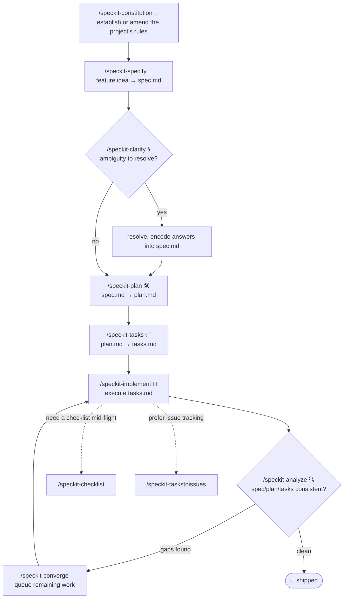

# 🗡️ Spec Jedi

[](https://github.com/jonyfs/spec-jedi/actions/workflows/validate.yml)
[](LICENSE)
[](.specify/memory/constitution.md)
[](.specify/memory/constitution.md)

> *"Spec first. Code second. That is the way."* — a wise Master, probably.

Spec Jedi is a set of Spec-Driven Development (SDD) skills you install into your
coding agent of choice. Instead of writing code first and documenting it later, you
write a **constitution** 📜 (your project's non-negotiable rules), a
**specification** 🎯 (what you're building and why), a **plan** 🛠️ (how,
technically), and a **task list** ✅ (the ordered steps) — and your agent implements
against those artifacts instead of improvising like a Padawan who skipped training.

This repository is itself built with the same discipline it ships: its own
[constitution](.specify/memory/constitution.md) is the authoritative source for how
the project behaves, including how releases are versioned and how pull requests are
validated and merged. No shortcuts to the Dark Side of vibe-coding here. 🚫🖤

*(Unofficial fan-flavored branding — Spec Jedi is not affiliated with, endorsed by,
or sponsored by Lucasfilm/Disney. May the Spec be with you. 🌌)*

## Who this is for

Anyone using an AI coding agent who wants specs, plans, and tasks to be first-class,
versioned artifacts instead of throwaway chat messages — solo developers, teams
standardizing how their agents work, and anyone tired of re-explaining project
context every session.

## Prerequisites

Spec Jedi is developed and validated on **Linux, macOS, and Windows**
(Constitution [Principle XIII](.specify/memory/constitution.md)) — every script under
`scripts/` ships as both a POSIX shell (`.sh`) and a native PowerShell (`.ps1`)
version, and CI runs the battery on all three operating systems on every PR.

- `git`
- A supported coding agent (see [Supported harnesses](#supported-harnesses) below)
- [GitHub CLI (`gh`)](https://cli.github.com/), only if you plan to contribute changes
  back via pull request
- Only if you want to run the helper scripts locally (optional — the coding agent
  itself doesn't require them): a POSIX shell (bash/zsh, present by default on Linux
  and macOS) **or** [PowerShell 7+](https://aka.ms/powershell) (`pwsh`), which runs
  on all three operating systems

## Installation

### Claude Code (fully supported today)

The clone step differs slightly by OS; everything after that is identical.

**Linux / macOS** (Terminal):

```bash
git clone https://github.com/jonyfs/spec-jedi.git
cd spec-jedi
```

**Windows — native PowerShell** (no WSL required):

```powershell
git clone https://github.com/jonyfs/spec-jedi.git
cd spec-jedi
```

**Windows — WSL or Git Bash** (if you prefer a Unix-like shell on Windows):

```bash
git clone https://github.com/jonyfs/spec-jedi.git
cd spec-jedi
```

Both Windows paths work equally well — pick whichever shell you already use daily.
The only place it matters going forward is which helper script you run
(`scripts/*.sh` in a POSIX shell, `scripts/*.ps1` in native PowerShell); the
skills themselves work identically either way.

1. Clone the repository using the block above for your OS.

2. Open the folder in [Claude Code](https://claude.com/claude-code). Claude Code
   auto-discovers every skill under `.claude/skills/*/SKILL.md` — there is no
   separate install step or build process, and this step is identical on all three
   operating systems.

3. Confirm the skills loaded by typing `/` in the Claude Code prompt. You should see
   the `speckit-*` commands listed (see [Quickstart](#quickstart) for what each one
   does).

4. That's it — you're ready to run the workflow below.

**Using Spec Jedi in a project other than this one?** Copy the `.claude/skills/`
directory (and `.specify/` if you want the full spec-kit scaffolding, templates, and
scripts) into your target repository, then follow steps 2–4 above from that repo.

### Supported harnesses

Spec Jedi's constitution ([Principle III](.specify/memory/constitution.md)) commits
this project to eventually supporting the twenty highest-usage LLM coding
tools/harnesses in the market. Today, only the path above (Claude Code) has been
built, tested, and documented end to end.

| Harness | Status |
|---|---|
| Claude Code | ✅ Supported — see steps above |
| Cursor, Windsurf, GitHub Copilot, Codex CLI, Gemini CLI/Antigravity, Cline, Continue, Aider, and others | 📋 Planned — tracked as future work, not yet installable |

If your harness isn't listed as supported yet, the `SKILL.md` files are plain
Markdown with YAML frontmatter — many harnesses that support custom
instructions/prompts can already read them directly even without a dedicated
install path, but this hasn't been verified or documented per-harness yet.

## Quickstart

The SDD workflow this project ships runs in this order (Principle XVI: process
explanations here use Mermaid first, prose as backup for surfaces that don't render
it):



Plain-text equivalent, if Mermaid isn't rendering for you:

```text
/speckit-constitution   → establish or amend the project's non-negotiable rules
/speckit-specify        → turn a feature idea into a spec.md
/speckit-clarify        → resolve ambiguity in the spec before planning (optional but recommended)
/speckit-plan           → turn the spec into a technical plan.md
/speckit-tasks          → break the plan into an ordered, dependency-aware tasks.md
/speckit-implement      → execute tasks.md
/speckit-analyze        → cross-check spec/plan/tasks for consistency at any point
/speckit-checklist      → generate a custom checklist for the current feature
/speckit-converge       → diff the codebase against spec/plan/tasks and queue any remaining work
/speckit-taskstoissues  → turn tasks.md into GitHub issues, if you prefer issue-tracker-driven work
```

Start every new project or repository with `/speckit-constitution` — every other
skill checks its output against whatever the constitution says. And per Principle
XIV: whatever you just ran, your agent should tell you what to run next — you
shouldn't have to come back to this table to figure it out.

## Recommended companions

This project's constitution ([Principle VIII](.specify/memory/constitution.md))
directs every Spec Jedi session to proactively suggest, but never silently install,
two token-saving companions:

- [`rtk`](https://github.com/rtk-ai/rtk) — a token-optimized CLI proxy for common dev
  operations.
- [`graphify`](https://graphify.net/) — turns a codebase into a queryable knowledge
  graph.

If your agent offers to install or configure either, that's this policy in action —
you're always asked first.

**graphify is already wired into this repo** (with maintainer confirmation): a
`## graphify` section in `CLAUDE.md` tells Claude Code to consult the knowledge graph
before browsing source and to refresh it after code changes, and `.claude/settings.json`
registers hooks that nudge tool calls toward `graphify query`/`explain`/`path` instead
of raw grep/read once the graph exists. The graph itself
(`graphify-out/`) is not committed — it's a derived cache, regenerated per clone.

To get the same auto-updating behavior locally after cloning:

```bash
pip install graphifyy   # or: uv tool install graphifyy
graphify .               # first build (only needed once; also runs on first use anyway)
graphify hook install    # auto-rebuild graph.json after every commit (code changes)
```

Doc/content changes aren't picked up by the commit hook — run `graphify update .`
(or just ask your agent to) after editing non-code files.

## Versioning & releases

Spec Jedi follows [Semantic Versioning](https://semver.org/) for its own releases,
scoped to the public skill-package contract (breaking skill behavior = MAJOR, new
skills or additive capability = MINOR, fixes/docs = PATCH). See
[Principle XI](.specify/memory/constitution.md) for the full policy.

The project suggests when a release is warranted rather than cutting one silently:

```bash
# Linux / macOS / Windows (WSL or Git Bash)
./scripts/suggest-release.sh
```

```powershell
# Windows (native PowerShell)
./scripts/suggest-release.ps1
```

This inspects commits since the last tag and recommends a next version — it never
tags or publishes anything itself. Actually cutting a release is always a deliberate,
maintainer-driven step.

## Contributing

Every change ships through a pull request validated by this project's own CI battery
and auto-merged only once every check is green (see
[Principle IX and X](.specify/memory/constitution.md)). That battery runs on Linux,
macOS, and Windows on every PR (Principle XIII) — if you add or change a script under
`scripts/`, both the `.sh` and `.ps1` versions must exist and pass on all three. A
full `CONTRIBUTING.md` with the step-by-step contribution process is on the roadmap;
until it lands, read the constitution first — it's the definitive statement of how
this project expects changes to be made.

## License

[MIT](LICENSE) — chosen and required by this project's own constitution
(Distribution & Ecosystem Standards). In plain language, MIT means you can:

- **Use** this project, commercially or otherwise, no restrictions.
- **Modify** it however you want.
- **Redistribute** it, including as part of something you sell.

The only real conditions: keep the original copyright notice and license text
somewhere in your copy, and don't expect a warranty — the software is provided
"as is," with no liability if something breaks. That's the whole deal; see
[`LICENSE`](LICENSE) for the exact legal text.

---

🌌 *This is the way.*
