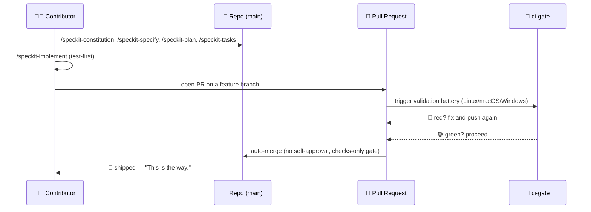
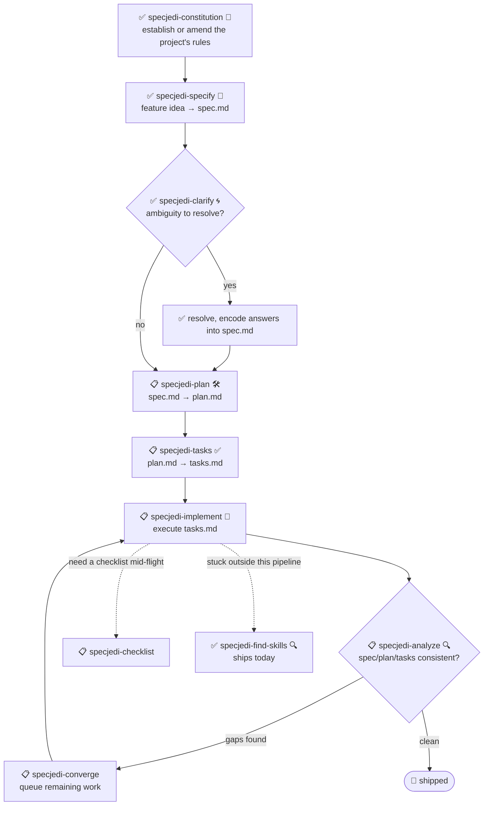

# 🗡️ Spec Jedi

[](https://github.com/jonyfs/spec-jedi/actions/workflows/validate.yml)
[](LICENSE)
[](.specify/memory/constitution.md)
[](.specify/memory/constitution.md)
[](https://github.com/jonyfs/spec-jedi/commits/main)

> *"Spec first. Code second. That is the way."* — a wise Master, probably.

Spec Jedi is a set of Spec-Driven Development (SDD) skills you install into your
coding agent of choice. Instead of writing code first and documenting it later, you
write a **constitution** 📜 (your project's non-negotiable rules), a
**specification** 🎯 (what you're building and why), a **plan** 🛠️ (how,
technically), and a **task list** ✅ (the ordered steps) — and your agent implements
against those artifacts instead of improvising like a Padawan who skipped training.

This repository is itself built with the same discipline it ships: its own
[constitution](.specify/memory/constitution.md) is the authoritative source for how
the project behaves, including how releases are versioned and how pull requests are
validated and merged. No shortcuts to the Dark Side of vibe-coding here. 🚫🖤

*(Unofficial fan-flavored branding — Spec Jedi is not affiliated with, endorsed by,
or sponsored by Lucasfilm/Disney. May the Spec be with you. 🌌)*

## Who this is for

Anyone using an AI coding agent who wants specs, plans, and tasks to be first-class,
versioned artifacts instead of throwaway chat messages — solo developers, teams
standardizing how their agents work, and anyone tired of re-explaining project
context every session.

## What you get today

Spec Jedi is being built as a genuine **competitor** to
[spec-kit](https://github.com/github/spec-kit), not a themed wrapper around it
([Principle XV](.specify/memory/constitution.md)) — so it's worth being upfront
about what's actually shipped versus what's still roadmap.

**Ships today, install and use now:**

| Skill | What it does |
|---|---|
| `specjedi-constitution` 📜 | Establishes or amends a project's non-negotiable rules — the foundation every other `specjedi-*` skill checks against. See [spec](specs/001-specjedi-pipeline/spec.md) |
| `specjedi-specify` 🎯 | Turns a feature idea — one sentence is enough — into a prioritized, independently-testable `spec.md`, marking real ambiguity instead of guessing |
| `specjedi-find-skills` 🔍 | Suggests a specific, verified skill when your request touches a domain nothing installed covers well — never installs without asking first ([Principle XVII](.specify/memory/constitution.md)) |
| `specjedi-explain` 🎓 | Explains any SDD concept or command, calibrated to how experienced you sound — total beginner through daily practitioner, never the same canned answer either way ([Principle XIX](.specify/memory/constitution.md)) |
| `specjedi-clarify` 🌀 | Scans a spec for real ambiguity and asks up to 5 prioritized questions — each with a Recommended answer so a beginner gets guidance and an expert can reply in one word — before you plan against a guess |

See [`references/skill-roadmap.md`](references/skill-roadmap.md) for what's
proposed beyond the core pipeline (onboarding, migration from spec-kit, diagrams,
and more) — a backlog, not a promise; each still needs its own research pass
before it gets built.

**Roadmap — the rest of the `specjedi-*` SDD pipeline** (each will mirror, and
eventually replace for end users, spec-kit's own command surface, with Spec Jedi's
own added principles — guided next steps, prompt-engineering discipline, Star Wars
voice, and the rest — already baked into the skills shipped above):

| Planned skill | Will replace |
|---|---|
| `specjedi-plan` 🛠️ | `speckit-plan` |
| `specjedi-tasks` ✅ | `speckit-tasks` |
| `specjedi-implement` 🤖 | `speckit-implement` |
| `specjedi-analyze` 🔍 | `speckit-analyze` |
| `specjedi-checklist` | `speckit-checklist` |
| `specjedi-converge` | `speckit-converge` |

The shipped skills prove the pattern, one story at a time; building the rest is
real, competitive-research-gated work (Principle II) — tracked in
[research.md](specs/001-specjedi-pipeline/research.md), not rushed. Until they
land, this repository's own development still uses spec-kit's `speckit-*`
commands as internal bootstrap tooling (see below) for anything past
constitution/spec/clarify — that's this project dogfooding the incumbent to
build its replacement, not the product you'd install elsewhere.

## How Spec Jedi builds *itself*, in comic form

> ⚠️ **This section is about our internal bootstrap process, not the Spec Jedi
> product.** The `/speckit-*` commands below are [spec-kit](https://github.com/github/spec-kit)'s
> own tooling — Spec Jedi currently dogfoods spec-kit to construct itself (the
> same "bootstrap a compiler with an older compiler" pattern), the way any
> competitor might use an incumbent's tools while building its replacement.
> **If you're evaluating Spec Jedi as a product, skip to
> [What you get today](#what-you-get-today) below** — the actual product surface
> is the `specjedi-*` skills, not these. See
> [Principle XV](.specify/memory/constitution.md) for the full policy on why
> these are kept clearly separate.
>
> Also, a note on format: these are text-and-emoji comic panels, not generated
> artwork. Actual Star Wars imagery (characters, ships, the logo) is Lucasfilm/
> Disney IP — this project's own [Principle XII](.specify/memory/constitution.md)
> commits to text references only, never reproduced copyrighted art. So: the story
> beats are real, the panels are Markdown. 🖋️

---

**PANEL 1 — A lone terminal, blinking cursor.**
> 🧑‍💻 *"I have an idea for a feature. ...Now what?"*

**PANEL 2 — A hooded figure steps out of the shadows, holding a scroll.**
> 🧙 *"First, the Code."* 📜
> `/speckit-constitution` — the project's non-negotiable rules, written down once,
> checked forever after.

**PANEL 3 — The idea, pinned to a wall, question marks circling it.**
> 🌀 *"What are you really building — and for whom?"*
> `/speckit-specify` turns the idea into `spec.md`. `/speckit-clarify` hunts down
> the ambiguity before it becomes a bug.

**PANEL 4 — A blueprint unrolls across a workbench.**
> 🛠️ *"Now the how."*
> `/speckit-plan` → `plan.md`. `/speckit-tasks` → an ordered, dependency-aware
> `tasks.md`. No step skipped, no step out of order.

**PANEL 5 — Tools whirring, tests failing red, then turning green one by one.**
> 🤖 *"Tests first. Always tests first."*
> `/speckit-implement` executes `tasks.md`, test-first where it applies
> ([Principle VI](.specify/memory/constitution.md)).

**PANEL 6 — A council chamber. A pull request stands before the bench.**
> 🏛️ *"State your changes."*
> A PR opens. `ci-gate` 🤖 runs the full validation battery — every OS, every
> check. No self-approval allowed; the machine can't pardon itself, and neither
> can you ([Principle X](.specify/memory/constitution.md)).

**PANEL 7 — Green light. The gate opens on its own.**
> ✅ *"The battery has spoken."*
> All checks pass → auto-merge, no human had to click a button.

**PANEL 8 — A ship leaps to hyperspace.**
> 🚀 *"Shipped."*
> 🌌 *"May the Spec be with you."*

### The same internal-bootstrap story, as a diagram



## Prerequisites

Spec Jedi is developed and validated on **Linux, macOS, and Windows**
(Constitution [Principle XIII](.specify/memory/constitution.md)) — every script under
`scripts/` ships as both a POSIX shell (`.sh`) and a native PowerShell (`.ps1`)
version, and CI runs the battery on all three operating systems on every PR.

- `git`
- A supported coding agent (see [Supported harnesses](#supported-harnesses) below)
- [GitHub CLI (`gh`)](https://cli.github.com/), only if you plan to contribute changes
  back via pull request
- Only if you want to run the helper scripts locally (optional — the coding agent
  itself doesn't require them): a POSIX shell (bash/zsh, present by default on Linux
  and macOS) **or** [PowerShell 7+](https://aka.ms/powershell) (`pwsh`), which runs
  on all three operating systems

## Installation

### Claude Code (fully supported today)

The clone step differs slightly by OS; everything after that is identical.

**Linux / macOS** (Terminal):

```bash
git clone https://github.com/jonyfs/spec-jedi.git
cd spec-jedi
```

**Windows — native PowerShell** (no WSL required):

```powershell
git clone https://github.com/jonyfs/spec-jedi.git
cd spec-jedi
```

**Windows — WSL or Git Bash** (if you prefer a Unix-like shell on Windows):

```bash
git clone https://github.com/jonyfs/spec-jedi.git
cd spec-jedi
```

Both Windows paths work equally well — pick whichever shell you already use daily.
The only place it matters going forward is which helper script you run
(`scripts/*.sh` in a POSIX shell, `scripts/*.ps1` in native PowerShell); the
skills themselves work identically either way.

1. Clone the repository using the block above for your OS.

2. Open the folder in [Claude Code](https://claude.com/claude-code). Claude Code
   auto-discovers every skill under `.claude/skills/*/SKILL.md` — there is no
   separate install step or build process, and this step is identical on all three
   operating systems.

3. Confirm the skills loaded by typing `/` in the Claude Code prompt. You'll see
   the five `specjedi-*` product skills (`constitution`, `specify`, `clarify`,
   `find-skills`, `explain`) and the `speckit-*` commands (this repo's own
   internal bootstrap tooling — see [What you get today](#what-you-get-today))
   listed together, since Claude Code discovers every skill under
   `.claude/skills/` without distinguishing the two.

4. That's it — you're ready to run `specjedi-constitution` on a project, ask
   `specjedi-explain` anything if you're not sure where to start, or read the
   constitution to understand where the rest of the pipeline is headed.

**Using Spec Jedi in a project other than this one?** Today, copying the whole
`.claude/skills/` directory brings the `speckit-*` bootstrap tooling along with the
actual `specjedi-*` product — there's no separation yet. If you only want the
product skills, copy `.claude/skills/specjedi-constitution/`,
`.claude/skills/specjedi-specify/`, `.claude/skills/specjedi-clarify/`,
`.claude/skills/specjedi-find-skills/`, and `.claude/skills/specjedi-explain/`
individually. A proper installer that installs product-only by default is tracked
([Principle XVIII](.specify/memory/constitution.md)) but doesn't exist yet.

### Supported harnesses

Spec Jedi's constitution ([Principle III](.specify/memory/constitution.md)) commits
this project to eventually supporting the twenty highest-usage LLM coding
tools/harnesses in the market. Today, only the path above (Claude Code) has been
built, tested, and documented end to end.

| Harness | Status |
|---|---|
| Claude Code | ✅ Supported — see steps above |
| Cursor, Windsurf, GitHub Copilot, Codex CLI, Gemini CLI/Antigravity, Cline, Continue, Aider, and others | 📋 Planned — tracked as future work, not yet installable |

If your harness isn't listed as supported yet, the `SKILL.md` files are plain
Markdown with YAML frontmatter — many harnesses that support custom
instructions/prompts can already read them directly even without a dedicated
install path, but this hasn't been verified or documented per-harness yet.

## Quickstart

Four product skills ship today ([What you get today](#what-you-get-today)).
Never used an SDD tool before? Start with step 0.

0. **Not sure what any of this means?** Just ask — "what is a spec and why
   would I need one," "what does this project actually do." `specjedi-explain`
   🎓 answers at whatever depth you need, beginner or advanced, and always
   points you to what to run next ([Principle XIX](.specify/memory/constitution.md)).
1. Install (see [Installation](#installation) above).
2. Establish your project's rules: describe your non-negotiables in plain
   language and `specjedi-constitution` 📜 produces a versioned
   `.specify/memory/constitution.md` — every other `specjedi-*` skill checks
   its own output against it.
3. Spec a feature: describe what you want to build — a rough one-sentence idea
   is enough — and `specjedi-specify` 🎯 turns it into a prioritized,
   independently-testable `spec.md`, marking real ambiguity instead of
   guessing at it.
4. Not sure the spec is solid yet? `specjedi-clarify` 🌀 scans it for real
   ambiguity and asks up to 5 prioritized questions — each with a
   Recommended answer, so you can accept it in one word or read the
   reasoning if you want it — before anything gets planned against a guess.
5. Stuck on something outside this set? Just describe it — "how do I do X,"
   "is there a skill for X" — and `specjedi-find-skills` 🔍 triggers
   automatically, searches the open agent-skills ecosystem, and suggests a
   specific, verified skill. Never installs anything without asking first
   ([Principle VIII](.specify/memory/constitution.md)).

Per [Principle XIV](.specify/memory/constitution.md), whatever you just ran
should tell you what to run next — you shouldn't need to come back to this
list to figure it out. Today that chain runs `specjedi-constitution` →
`specjedi-specify` → `specjedi-clarify`; the step after that
(`specjedi-plan`) is still roadmap.

### The vision (roadmap — plan onward isn't real yet)

Constitution, specify, and clarify (steps 2-4 above) are live. The rest of
the pipeline below is shown now so contributors and early adopters know what
"done" looks like, not because you can run all of it yet:



✅ = ships today · 📋 = roadmap

## Recommended companions

This project's constitution ([Principle VIII](.specify/memory/constitution.md))
directs every Spec Jedi session to proactively suggest, but never silently install,
two token-saving companions:

- [`rtk`](https://github.com/rtk-ai/rtk) — a token-optimized CLI proxy for common dev
  operations.
- [`graphify`](https://graphify.net/) — turns a codebase into a queryable knowledge
  graph.

If your agent offers to install or configure either, that's this policy in action —
you're always asked first.

**graphify is already wired into this repo** (with maintainer confirmation): a
`## graphify` section in `CLAUDE.md` tells Claude Code to consult the knowledge graph
before browsing source and to refresh it after code changes, and `.claude/settings.json`
registers hooks that nudge tool calls toward `graphify query`/`explain`/`path` instead
of raw grep/read once the graph exists. The graph itself
(`graphify-out/`) is not committed — it's a derived cache, regenerated per clone.

To get the same auto-updating behavior locally after cloning:

```bash
pip install graphifyy   # or: uv tool install graphifyy
graphify .               # first build (only needed once; also runs on first use anyway)
graphify hook install    # auto-rebuild graph.json after every commit (code changes)
```

Doc/content changes aren't picked up by the commit hook — run `graphify update .`
(or just ask your agent to) after editing non-code files.

## Versioning & releases

Spec Jedi follows [Semantic Versioning](https://semver.org/) for its own releases,
scoped to the public skill-package contract (breaking skill behavior = MAJOR, new
skills or additive capability = MINOR, fixes/docs = PATCH). See
[Principle XI](.specify/memory/constitution.md) for the full policy.

The project suggests when a release is warranted rather than cutting one silently:

```bash
# Linux / macOS / Windows (WSL or Git Bash)
./scripts/suggest-release.sh
```

```powershell
# Windows (native PowerShell)
./scripts/suggest-release.ps1
```

This inspects commits since the last tag and recommends a next version — it never
tags or publishes anything itself. Actually cutting a release is always a deliberate,
maintainer-driven step.

## Contributing

Every change ships through a pull request validated by this project's own CI battery
and auto-merged only once every check is green (see
[Principle IX and X](.specify/memory/constitution.md)). That battery runs on Linux,
macOS, and Windows on every PR (Principle XIII) — if you add or change a script under
`scripts/`, both the `.sh` and `.ps1` versions must exist and pass on all three. A
full `CONTRIBUTING.md` with the step-by-step contribution process is on the roadmap;
until it lands, read the constitution first — it's the definitive statement of how
this project expects changes to be made.

## License

[MIT](LICENSE) — chosen and required by this project's own constitution
(Distribution & Ecosystem Standards). In plain language, MIT means you can:

- **Use** this project, commercially or otherwise, no restrictions.
- **Modify** it however you want.
- **Redistribute** it, including as part of something you sell.

The only real conditions: keep the original copyright notice and license text
somewhere in your copy, and don't expect a warranty — the software is provided
"as is," with no liability if something breaks. That's the whole deal; see
[`LICENSE`](LICENSE) for the exact legal text.

---

🌌 *This is the way.*
