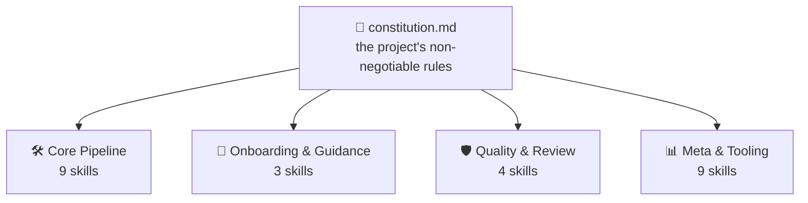
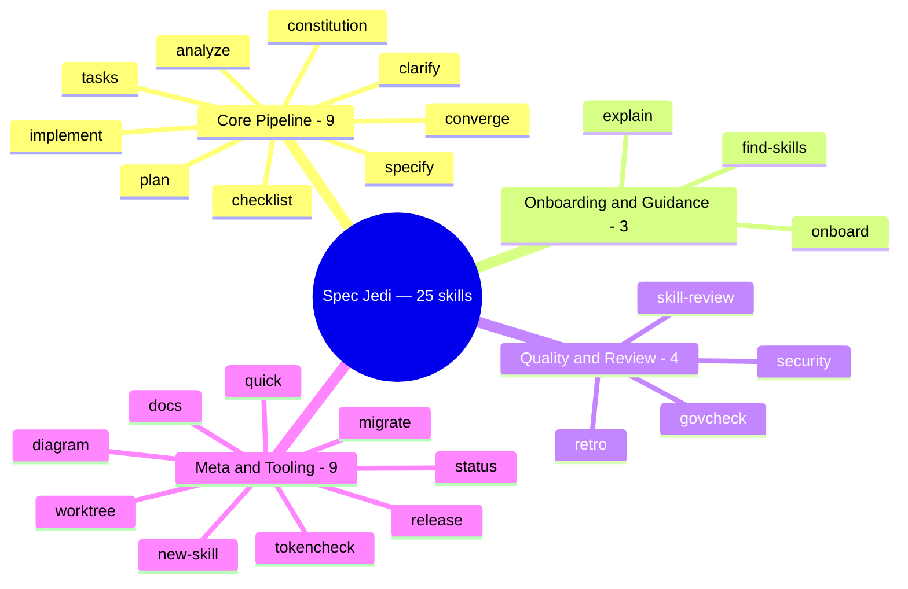
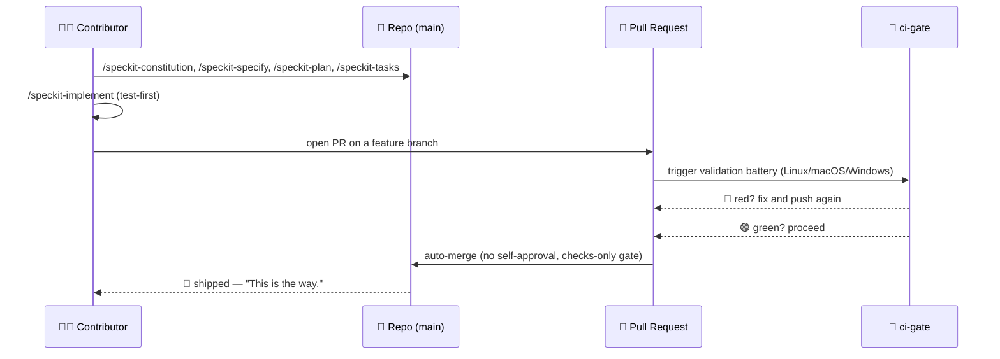
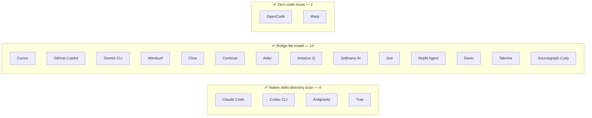

#  Spec Jedi

> 🌐 **Read this in another language:** [中文](docs/i18n/zh/README.md) ·
> [हिन्दी](docs/i18n/hi/README.md) · [Español](docs/i18n/es/README.md) ·
> [Français](docs/i18n/fr/README.md) · [العربية](docs/i18n/ar/README.md) ·
> [বাংলা](docs/i18n/bn/README.md) · [Português](docs/i18n/pt/README.md) ·
> [Русский](docs/i18n/ru/README.md) · [اردو](docs/i18n/ur/README.md) ·
> [Bahasa Indonesia](docs/i18n/id/README.md) — AI-assisted translations;
> English is canonical ([Principle I](.specify/memory/constitution.md)).

[](https://github.com/jonyfs/spec-jedi/actions/workflows/validate.yml)
[](LICENSE)
[](.specify/memory/constitution.md)
[](#what-you-get-today)
[](#what-you-get-today)
[](references/skill-roadmap.md)
[](#installation)
[](docs/i18n/)
[](.specify/memory/constitution.md)
[](https://github.com/jonyfs/spec-jedi/commits/main)

> *"Spec first. Code second. That is the way."* — a wise Master, probably.

Here's the pitch in one breath: instead of writing code and explaining it
after the fact, you write four things first — a **constitution** 📜 (the
rules nobody gets to quietly break), a **specification** 🎯 (what you're
building, and for whom), a **plan** 🛠️ (how, technically, in enough detail
nobody has to guess), and a **task list** ✅ (the actual ordered steps).
Then your coding agent builds against those artifacts instead of
improvising its way through your codebase like a Padawan who skipped
training.

Spec Jedi is the set of skills that makes that workflow real inside
whatever coding agent you already use — twenty of them, supported for
real (more on that below).

This repo holds itself to the exact same standard it ships. Its own
[constitution](.specify/memory/constitution.md) decides how releases get
versioned and how pull requests get merged — no exceptions carved out for
the maintainers. No shortcuts to the Dark Side of vibe-coding here. 🚫🖤

*(Unofficial fan-flavored branding — Spec Jedi is not affiliated with, endorsed by,
or sponsored by Lucasfilm/Disney. May the Spec be with you. 🌌 "Lightsaber" icon by
Carlos von Dessauer, from [Noun Project](https://thenounproject.com), used under
CC BY 3.0.)*



Everything downstream checks itself against the constitution, never the
other way around. Change a rule, and every skill feels it the next time
it runs.

## Who this is for

You, probably, if you're using an AI coding agent and you're tired of
re-explaining the same project context every session — or if you've ever
watched an agent quietly reinvent a decision your team already made and
abandoned three weeks ago. Solo developer, small team standardizing how
everyone's agent behaves, doesn't matter: if you want specs, plans, and
tasks to be real, versioned files instead of scrollback that vanishes
when the chat closes, this is for you.

## What you get today

Let's be clear about what this actually is: Spec Jedi is a genuine
**competitor** to [spec-kit](https://github.com/github/spec-kit), not a
reskin of it ([Principle XV](.specify/memory/constitution.md)). The full
`specjedi-*` SDD pipeline — constitution through convergence — shipped in
full a while back: all 9 stages, each one built off real competitive
research before a line of it got written
([research.md](specs/001-specjedi-pipeline/research.md), Principle II),
never rushed out the door.

> *"A Jedi's strength flows from the Force. So too does a project's, from
> its skills."* — a wise Master, probably.

Twenty-five skills deep at this point — trained not for combat, but for
Spec-Driven Development, across four disciplines:



**Ships today, install and use now:**

| Skill | What it does |
|---|---|
| `specjedi-onboard` 🌱 | First-run walkthrough for a brand-new project — produces a real first `constitution.md` and `spec.md` together, teaching each SDD concept exactly when it's needed. Steps aside instantly if onboarding already happened |
| `specjedi-constitution` 📜 | Establishes or amends a project's non-negotiable rules — the foundation every other `specjedi-*` skill checks against. See [spec](specs/001-specjedi-pipeline/spec.md) |
| `specjedi-specify` 🎯 | Turns a feature idea — one sentence is enough — into a prioritized, independently-testable `spec.md`, marking real ambiguity instead of guessing |
| `specjedi-clarify` 🌀 | Scans a spec for real ambiguity and asks up to 5 prioritized questions — each with a Recommended answer so a beginner gets guidance and an expert can reply in one word — before you plan against a guess |
| `specjedi-plan` 🛠️ | Turns a clarified spec into a technical `plan.md` — scans the actual codebase for existing conventions first, so implementation never has to stop and search for one |
| `specjedi-tasks` ✅ | Breaks a plan into an ordered, dependency-aware `tasks.md` grouped by user story — sequences a failing test before its implementation task wherever the plan calls for code |
| `specjedi-implement` 🔨 | Executes `tasks.md` in dependency order, test-first where the plan calls for code — commits only through a feature branch and pull request, never directly to `main` |
| `specjedi-quick` ⚡ | The lightweight path for small, well-understood changes — one `quick.md` instead of `spec.md`+`research.md`+`plan.md`+`tasks.md`, straight to implementation. Quality gates (test-first, `specjedi-govcheck`, PR-only) never shorten, only planning ceremony does. Declines and redirects to `specjedi-specify` for anything bigger, ambiguous, or a new skill — see [Which path should I use?](#which-path-should-i-use) |
| `specjedi-analyze` 🔍 | Strictly read-only cross-check of `spec.md`/`plan.md`/`tasks.md` (and the constitution) for gaps, duplication, and contradictions — reports findings, never edits a file |
| `specjedi-checklist` ☑️ | Generates a custom checklist for a named focus area (security, accessibility, performance...) grounded entirely in this feature's own `spec.md`/`plan.md` — never generic boilerplate |
| `specjedi-converge` 🔁 | Detects drift between the actual codebase and `tasks.md` after manual changes, appending any gap as a new task instead of silently ignoring it — closes the loop back to `specjedi-implement` |
| `specjedi-find-skills` 🔍 | Suggests a specific, verified skill when your request touches a domain nothing installed covers well — never installs without asking first ([Principle XVII](.specify/memory/constitution.md)) |
| `specjedi-explain` 🎓 | Explains any SDD concept or command, calibrated to how experienced you sound — total beginner through daily practitioner, never the same canned answer either way ([Principle XIX](.specify/memory/constitution.md)) |
| `specjedi-migrate` 🔄 | Rewrites literal `/speckit-*` tooling references in your own constitution/spec/plan/tasks to their `specjedi-*` equivalents — never touches principle or requirement content, explicit request only |
| `specjedi-diagram` 📊 | Generates a render-verified Mermaid diagram — the right type inferred from content across the full Mermaid catalog (flowchart, sequence, ER, class, state, Gantt, timeline, user journey, kanban, mindmap, quadrant, pie, and more) — from an existing `spec.md`/`plan.md` — always a supplement to the source prose, never a replacement |
| `specjedi-status` 🧭 | Project-wide dashboard showing every feature's status, derived entirely from on-disk `spec.md`/`plan.md`/`tasks.md` artifacts — zero separately-maintained tracking system, never asserts "stalled" as a fact |
| `specjedi-retro` 🪞 | Strictly read-only retrospective comparing a completed feature's actual implementation against its `plan.md` — grounds any deviation's cause in real git history, never invents one, logs a durable dated entry |
| `specjedi-security` 🛡️ | Lightweight, proactive "did we think about X" prompt for auth/input validation/secrets/data-privacy gaps — self-invoked by `specjedi-plan`, never claims to be a full security review |
| `specjedi-docs` 📚 | Drafts a README skill-table row, Quickstart step, and `CHANGELOG.md` entry from a shipped feature's spec/plan — grounded in actual content, always shown for confirmation before writing |
| `specjedi-new-skill` 🌟 | Scaffolds a new `specjedi-*` skill's file structure — placeholders only, never invented content — following this project's own Skill Authoring Standard and baking in the Principle II research checklist |
| `specjedi-release` 🚀 | Wraps `scripts/suggest-release.sh` with Spec Jedi's own voice — narrates the last tag, suggested next version, and contributing commits; declines and names the manual command if asked to actually cut a release |
| `specjedi-skill-review` 🎓 | Strictly read-only audit of a `specjedi-*` skill's `SKILL.md` against the Skill Authoring Standard — checks section content, not just headings, cross-references the matching `plan.md` for legitimate exemptions, reports findings or a clean pass, never edits the reviewed file |
| `specjedi-tokencheck` 🎒 | Proactively checks whether `rtk` and `graphify` are installed, explains what's missing and its expected token savings, and offers an install walkthrough — self-invoked by `specjedi-onboard`'s first-run flow, also runs standalone; never installs anything without explicit confirmation |
| `specjedi-govcheck` ⚖️ | Strictly read-only per-PR/per-branch governance checklist against all 20 constitution principles — three-state report (N/A / Compliant / Non-Compliant), any conflict CRITICAL — self-invoked by `specjedi-implement` before opening a PR (never blocks it), also runs standalone against the current branch or a named PR |
| `specjedi-worktree` 🌳 | Mechanizes git-worktree-based parallel development — creates a real worktree for a named feature on demand, preferring a native harness relocation tool (e.g. Claude Code's `EnterWorktree`/`ExitWorktree`) and falling back to a project-local, `.gitignore`-verified `.worktrees/` directory otherwise. Self-invoked by `specjedi-specify`/`specjedi-quick` to proactively offer a worktree before real uncommitted work on another branch would collide; paired with a `specjedi-status` extension that unifies status reporting across every worktree in one report |

Curious what's next?
[`references/skill-roadmap.md`](references/skill-roadmap.md) tracks
what's proposed beyond the core pipeline — a backlog of *additional*
ideas, not gaps in the pipeline itself. Every one of them still needs its
own real research pass before it gets built; nothing here ships on vibes.

## How Spec Jedi builds *itself*, in comic form

> ⚠️ **This section is about our internal bootstrap process, not the Spec Jedi
> product.** The `/speckit-*` commands below are [spec-kit](https://github.com/github/spec-kit)'s
> own tooling — Spec Jedi currently dogfoods spec-kit to construct itself (the
> same "bootstrap a compiler with an older compiler" pattern), the way any
> competitor might use an incumbent's tools while building its replacement.
> **If you're evaluating Spec Jedi as a product, skip to
> [What you get today](#what-you-get-today) below** — the actual product surface
> is the `specjedi-*` skills, not these. See
> [Principle XV](.specify/memory/constitution.md) for the full policy on why
> these are kept clearly separate.
>
> Also, a note on format: the panels below pair text-and-emoji dialogue with
> original illustrations — never actual Star Wars imagery (characters, ships,
> the logo), which is Lucasfilm/Disney IP. This project's own
> [Principle XII](.specify/memory/constitution.md) commits to an original visual
> identity and text-only Star Wars references, never reproduced copyrighted art
> or artwork evoking the franchise's own recognizable signatures. So: the story
> beats are real, the art is original, and the words still carry the meaning on
> their own. 🖋️

---

Every story starts the same way: a dark room, a terminal, a cursor
that won't stop blinking until you give it something to do.


> 🧑‍💻 *"I have an idea for a feature. ...Now what?"*

That's when the mentor shows up — no lightsaber, just a scroll, because
the first fight here is never the last one. `/speckit-constitution`
writes the rules down once, so nobody has to relearn them the hard way
three features from now.


> 🧙 *"First, the Code."* 📜

The idea goes up on the wall next, circled by every question it hasn't
answered yet — what you're actually building, and who it's actually
for. `/speckit-specify` turns that into a real `spec.md`; `/speckit-clarify`
goes hunting for the ambiguity before it turns into a bug nobody wants
to own later.


> 🌀 *"What are you really building — and for whom?"*

Then the blueprint comes out. `/speckit-plan` becomes `plan.md`,
`/speckit-tasks` breaks it into an ordered, dependency-aware `tasks.md`
— nothing skipped, nothing out of sequence, the kind of plan a Padawan
could follow without asking twice.


> 🛠️ *"Now the how."*

Tools start whirring. Tests fail red, one after another — and then,
slowly, they don't. `/speckit-implement` works `tasks.md` test-first
wherever it applies ([Principle VI](.specify/memory/constitution.md)),
because a build that skips this step is just a guess with extra steps.


> 🤖 *"Tests first. Always tests first."*

Now the council convenes — not to bless the work, just to check it. A
pull request stands before the bench, and `ci-gate` 🤖 runs the whole
validation battery: every OS, every check, no shortcuts. Nobody gets to
approve their own work here, machine or otherwise
([Principle X](.specify/memory/constitution.md)).


> 🏛️ *"State your changes."*

The light turns green, and the gate opens on its own — no hand on the
lever, nobody clicking a button. The battery already said what needed
saying.


> ✅ *"The battery has spoken."*

And then it's gone — off to hyperspace, shipped.


> 🚀 *"Shipped."*
> 🌌 *"May the Spec be with you."*

None of this is a bedtime story. It's the literal, repeated process
behind this project's own recent pull requests — [#82](https://github.com/jonyfs/spec-jedi/pull/82),
[#84](https://github.com/jonyfs/spec-jedi/pull/84), [#87](https://github.com/jonyfs/spec-jedi/pull/87),
to name a few — start to finish, for real, every time.

### The same internal-bootstrap story, as a diagram



## Prerequisites

Nothing exotic here. Spec Jedi is built and tested on **Linux, macOS, and
Windows** alike (Constitution [Principle XIII](.specify/memory/constitution.md))
— every script under `scripts/` ships as both a POSIX shell (`.sh`) and a
native PowerShell (`.ps1`) version, and CI runs the full battery on all
three, every single PR.

What you actually need:

- `git`
- A supported coding agent (see [Supported harnesses](#supported-harnesses) below)
- [GitHub CLI (`gh`)](https://cli.github.com/) — only if you plan on sending
  pull requests back
- A shell to run the helper scripts locally, if you want to (the coding
  agent itself doesn't need this): bash/zsh, already on Linux and macOS,
  or [PowerShell 7+](https://aka.ms/powershell) (`pwsh`), which runs
  everywhere

## Installation

One command. No `git clone`. `scripts/bootstrap-install.sh`/`.ps1` (see
specs/024-bootstrap-installer if you want the full story) grab a
published GitHub Release and run its bundled installer straight into
your target directory:

```bash
curl -fsSL https://raw.githubusercontent.com/jonyfs/spec-jedi/main/scripts/bootstrap-install.sh \
  | bash -s -- /path/to/your-project --harness cursor
```

```powershell
&([scriptblock]::Create((iwr -useb https://raw.githubusercontent.com/jonyfs/spec-jedi/main/scripts/bootstrap-install.ps1).Content)) -TargetDir C:\path\to\your-project -Harness cursor
```

`--harness` is optional. Leave it off and the installer tries to figure
out which coding agent you're running — `claude-code`, `codex-cli`, or
`trae` — by checking for a project directory, a `PATH` binary, or a
global config folder already sitting there, and only asks you to pick if
it finds more than one candidate. The other 17 harnesses don't have a
reliable detection signal yet, so for those you pass `--harness`
yourself — the full list is right below in
[Supported harnesses](#supported-harnesses). Run
`./scripts/bootstrap-install.sh --help` (or
`.\scripts\bootstrap-install.ps1 -Help`) any time you want the complete
option list, `--auto` included.

### Supported harnesses

The constitution ([Principle III](.specify/memory/constitution.md))
commits this project to covering the twenty highest-usage coding agents
out there — and as of this release, all twenty are real, tested, and
CI-proven, not aspirational. Four read skills natively off disk (Claude
Code, Codex CLI, Trae, Antigravity — the last three actually sharing just
two physical directories between them, `.agents/skills/` and
`.trae/skills/`, with OpenCode and Warp riding along on those same paths
for free). The other fourteen don't have a native skills concept at
all — just a project-root rules file, a small rules directory, or in
Sourcegraph Cody's case a custom-commands JSON file — so the installer
builds a **bridge** instead: the real `specjedi-*` packages still land at
the canonical `.claude/skills/`, and a small adapter (one file, or one
per skill for directory-style harnesses) points into it using whatever
convention that harness actually documents.

See [`specs/023-full-harness-coverage/research.md`](specs/023-full-harness-coverage/research.md)
if you want the citation behind each harness's exact mechanism — nothing
here is guessed.



| Harness | Status |
|---|---|
| Claude Code | ✅ Supported — the [Installation](#installation) command above, omit `--harness` (auto-detected) or pass `--harness claude-code` explicitly |
| Cursor | ✅ Supported — `./scripts/install.sh --harness cursor` (bridge files under `.cursor/rules/`) |
| GitHub Copilot (Chat/Workspace) | ✅ Supported — `./scripts/install.sh --harness copilot` (bridge file at `.github/copilot-instructions.md`) |
| Codex CLI (OpenAI) | ✅ Supported — `./scripts/install.sh --harness codex-cli` (installs to `.agents/skills/`) |
| Gemini CLI | ✅ Supported — `./scripts/install.sh --harness gemini-cli` (bridge file at `GEMINI.md`; Google is sunsetting Gemini CLI in favor of Antigravity — see [`references/harness-capability-notes.md`](references/harness-capability-notes.md)) |
| Antigravity (Google) | ✅ Supported — `./scripts/install.sh --harness antigravity` (installs to `.agents/skills/`, same convention as Codex CLI) |
| Windsurf (Codeium) | ✅ Supported — `./scripts/install.sh --harness windsurf` (bridge files under `.windsurf/rules/`) |
| Cline | ✅ Supported — `./scripts/install.sh --harness cline` (bridge files under `.clinerules/`) |
| Continue | ✅ Supported — `./scripts/install.sh --harness continue` (bridge files under `.continue/rules/`) |
| Aider | ✅ Supported — `./scripts/install.sh --harness aider` (bridge file at `CONVENTIONS.md`) |
| Amazon Q Developer | ✅ Supported — `./scripts/install.sh --harness amazon-q` (bridge files under `.amazonq/rules/`) |
| JetBrains AI Assistant | ✅ Supported — `./scripts/install.sh --harness jetbrains-ai` (bridge files under `.aiassistant/rules/`) |
| Zed | ✅ Supported — `./scripts/install.sh --harness zed` (bridge file at `.rules`) |
| OpenCode | ✅ Supported — satisfied by either the `claude-code` or `codex-cli` install (OpenCode natively scans both `.claude/skills/` and `.agents/skills/`), no separate flag needed |
| Warp (Agent Mode) | ✅ Supported — satisfied by either the `claude-code` or `codex-cli` install (Warp's Skills system natively scans both `.claude/skills/` and `.agents/skills/`), no separate flag needed |
| Replit Agent | ✅ Supported — `./scripts/install.sh --harness replit` (bridge file at `replit.md`) |
| Devin (Cognition) | ✅ Supported — `./scripts/install.sh --harness devin` (bridge file at `.devin.md`, structured as a Devin Playbook) |
| Tabnine | ✅ Supported — `./scripts/install.sh --harness tabnine` (bridge files under `.tabnine/guidelines/`) |
| Sourcegraph Cody | ✅ Supported — `./scripts/install.sh --harness cody` (`.vscode/cody.json` custom commands, invoked explicitly as `/specjedi-<name>`; unlike every other harness above, Cody has no confirmed always-on rules file, so this is manual-invocation, not automatic context — see the research doc) |
| Trae | ✅ Supported — `./scripts/install.sh --harness trae` (installs to `.trae/skills/`) |

All twenty named individually, all ✅ Supported — that's Principle III's
own bar. No capability claims for a mechanism this project hasn't
actually built and tested, either; Principle XX doesn't allow guessing
here.

Want more? [`references/harness-capability-notes.md`](references/harness-capability-notes.md)
has the original desk-research notes per harness, and
[`specs/023-full-harness-coverage/research.md`](specs/023-full-harness-coverage/research.md)
has the actual install-mechanism decisions and citations this whole
table is built from.

Curious how Spec Jedi actually stacks up against spec-kit and the ten
other SDD tools it was benchmarked against?
[`references/competitive-comparison.md`](references/competitive-comparison.md)
has the receipts.

Want the version with no marketing gloss — real advantages, real current
limitations, concrete competitor-grounded improvement points?
[`references/honest-assessment.md`](references/honest-assessment.md) is
that document.

New to Spec-Driven Development itself, not just this project? Start with
[`references/what-is-sdd.md`](references/what-is-sdd.md) — a from-scratch
explanation with zero Spec Jedi branding in it — then
[`references/specjedi-and-sdd.md`](references/specjedi-and-sdd.md) maps
exactly which skill handles which part of the practice.

## Quickstart

Twenty-five product skills, all live ([What you get today](#what-you-get-today))
— the full `specjedi-*` pipeline is done, not partial. If you've never
touched an SDD tool before, start at step 0 and don't skip it.

### Which path should I use?

| Change size | Use | Produces |
|---|---|---|
| Small, well-understood — a typo, a one-file fix, a tightly-scoped tweak | `specjedi-quick` ⚡ | One `quick.md`, straight to shipped code |
| Anything bigger, ambiguous, touching more than one subsystem, or a new `specjedi-*` skill | The full pipeline (steps 3-11 below) | `spec.md` → `plan.md` → `tasks.md` → shipped code |

`specjedi-quick` doesn't just take your word for it, either — it checks
your request against five explicit eligibility criteria before it
writes anything. Doesn't fit on about a page of notes? It declines and
hands you off to `specjedi-specify` instead of forcing a bad fit
through. Both paths run the exact same quality gates — test-first where
there's code, `specjedi-govcheck` before any PR opens. "Quick" shortens
the planning ceremony. It never shortens verification.

0. **Genuinely not sure what any of this means yet?** Good — just ask.
   "What is a spec and why would I need one," "what does this project
   actually do," whatever's actually confusing you. `specjedi-explain`
   🎓 answers at whatever depth fits — total beginner or seasoned
   practitioner — and always tells you what to run next
   ([Principle XIX](.specify/memory/constitution.md)).
1. Install it (see [Installation](#installation) above).
2. Brand-new project and no idea where to even start? `specjedi-onboard`
   🌱 walks you from a one-sentence idea to a real first
   `constitution.md` and `spec.md`, explaining each concept only when
   it's actually relevant — no wall of documentation dumped on you up
   front. (It's really just orchestrating steps 3-4 below on your
   behalf; skip straight there if you'd rather drive each stage
   yourself.)
3. Lay down your project's rules. Describe your non-negotiables in
   plain language, and `specjedi-constitution` 📜 turns them into a
   versioned `.specify/memory/constitution.md` — the document every
   other `specjedi-*` skill checks its own work against.
4. Spec out a feature. A rough one-sentence idea is genuinely enough —
   `specjedi-specify` 🎯 turns it into a prioritized,
   independently-testable `spec.md`, and flags real ambiguity instead
   of quietly guessing past it.
5. Not convinced the spec is solid yet? `specjedi-clarify` 🌀 scans it
   for real gaps and asks up to 5 prioritized questions, each with a
   Recommended answer already attached — accept it in one word, or read
   the reasoning if you actually want to think it through — before
   anything downstream gets planned against a guess.
6. Ready for the "how"? `specjedi-plan` 🛠️ scans your actual codebase
   for existing conventions first, then turns the clarified spec into a
   technical `plan.md` — so implementation never has to stop mid-build
   and go hunting for a pattern that already exists three files over.
   Touches auth, external input, secrets, or data handling?
   `specjedi-security` 🛡️ triggers on its own with a handful of
   targeted "did we think about X" questions — a nudge, not a full
   audit.
7. Ready to break it into actual work? `specjedi-tasks` ✅ turns the
   plan into an ordered, dependency-aware `tasks.md`, grouped by user
   story — a failing test lands before its implementation task, every
   time the plan calls for code.
8. Ready to build? `specjedi-implement` 🔨 works `tasks.md` in
   dependency order, test-first wherever the plan calls for code. Every
   commit lands on a feature branch and a pull request — `main` never
   sees a direct push.
9. Want a safety net at any point? `specjedi-analyze` 🔍 cross-checks
   `spec.md`, `plan.md`, and `tasks.md` (plus your constitution) for
   gaps, duplication, contradictions — strictly read-only, run it
   whenever, it never touches a file.
10. Need a review focused on one specific thing? `specjedi-checklist`
    ☑️ generates a checklist for whatever focus area you name —
    security, accessibility, performance, anything — grounded entirely
    in this feature's own spec/plan. No generic boilerplate items.
11. Changed code by hand since your last `tasks.md` update?
    `specjedi-converge` 🔁 scans the actual codebase, finds any
    capability with no matching task, and appends it as new work rather
    than letting the two silently drift apart. The pipeline's last
    stage — it closes the loop straight back to `specjedi-implement`.
12. Stuck on something outside this whole set? Just say so — "how do I
    do X," "is there a skill for X" — and `specjedi-find-skills` 🔍
    kicks in on its own, searches the wider agent-skills ecosystem, and
    points you at one specific, verified skill. It never installs
    anything without asking you first
    ([Principle VIII](.specify/memory/constitution.md)).
13. Coming over from an existing spec-kit project? `specjedi-migrate`
    🔄 rewrites your project's own `/speckit-*` tooling references to
    their `specjedi-*` equivalents — it never touches a principle or a
    requirement, and it only runs when you explicitly ask for it.
14. Rather have a picture than another wall of prose? `specjedi-diagram`
    📊 turns a spec or plan into a render-verified Mermaid diagram,
    picking whichever type the actual content calls for from Mermaid's
    full catalog (see
    [`references/mermaid-diagram-catalog.md`](references/mermaid-diagram-catalog.md))
    — always sitting alongside the source prose, never replacing it.
15. Juggling more than a feature or two? `specjedi-status` 🧭 gives you
    a project-wide dashboard — specified, planned, in progress,
    complete — derived entirely from what's actually sitting on disk.
    No separate tracking system to fall out of sync with reality.
16. Just wrapped up a feature? `specjedi-retro` 🪞 compares what
    actually shipped against what `plan.md` promised, traces any
    deviation back to real git history — never invents a cause — and
    logs a durable entry, so the signal outlives this one conversation.
17. Shipped something and it needs documenting? `specjedi-docs` 📚
    drafts the README row, the Quickstart step, and the
    `CHANGELOG.md` entry for you, grounded in your actual spec/plan —
    and always shows you the draft before writing a word of it.
18. Extending Spec Jedi itself with a brand-new skill?
    `specjedi-new-skill` 🌟 scaffolds the whole file structure —
    `specs/`, the `SKILL.md` skeleton, every section a labeled
    placeholder — and never invents research findings or behavior on
    your behalf. You still have to do the actual thinking.
19. Wondering if a release is due? `specjedi-release` 🚀 narrates
    whatever `scripts/suggest-release.sh` already figured out — last
    tag, next version, the commits that got you there — and if you ask
    it to actually cut one, it declines and hands you the exact manual
    command instead. It never tags or publishes anything itself.
20. Wrote or hand-edited a `specjedi-*` skill? `specjedi-skill-review`
    🎓 checks its `SKILL.md` against the Skill Authoring Standard —
    actual section content, not just whether the headings exist,
    cross-referenced against the matching `plan.md` for any legitimate
    exemption — and reports findings or a clean pass. It never touches
    the file itself.
21. `specjedi-onboard` already runs this once automatically on first
    use, but `specjedi-tokencheck` 🎒 works fine standalone too —
    checks whether `rtk` and `graphify` are installed, explains what's
    missing and roughly how many tokens it'd save you, and offers to
    walk through installing it. Never without your explicit yes.
22. `specjedi-implement` already runs this before every PR it opens,
    but `specjedi-govcheck` ⚖️ works standalone too — a per-branch or
    per-PR checklist against all 20 constitution principles, each one
    reported as not applicable, compliant, or non-compliant, with any
    real conflict marked CRITICAL. Strictly read-only — it never edits
    anything, and it never blocks a PR from opening on its own.

Per [Principle XIV](.specify/memory/constitution.md), whatever you just
ran should already be telling you what comes next — you genuinely
shouldn't need to keep scrolling back up to this list. Full chain:
`specjedi-onboard` (first run only) → `specjedi-constitution` →
`specjedi-specify` → `specjedi-clarify` → `specjedi-plan` →
`specjedi-tasks` → `specjedi-implement` → `specjedi-analyze` →
`specjedi-checklist` → `specjedi-converge`, looping back to
`specjedi-implement` any time `specjedi-converge` turns up drift worth
working through.

### The pipeline, end to end

Onboarding through convergence, laid out as one picture — every stage
below is live, nothing dotted-in as a someday:


✅ = ships today. The full 9-stage `specjedi-*` pipeline is done, plus
`specjedi-onboard` sitting in front of it as the guided first-run entry
point.

## Recommended companions

The constitution ([Principle VIII](.specify/memory/constitution.md)) has
every Spec Jedi session proactively suggest — but never silently
install — two token-saving tools:

- [`rtk`](https://github.com/rtk-ai/rtk) — a token-optimized CLI proxy
  for the dev operations you run constantly.
- [`graphify`](https://graphify.net/) — turns your codebase into a
  queryable knowledge graph instead of something an agent has to re-read
  from scratch every time.

If your agent ever offers to install or configure either one, that's
this policy doing its job — you're always asked first, no exceptions.

**graphify is already wired into this repo**, with maintainer sign-off:
a `## graphify` section in `CLAUDE.md` tells Claude Code to check the
knowledge graph before browsing source and to refresh it after code
changes, and `.claude/settings.json` registers hooks nudging tool calls
toward `graphify query`/`explain`/`path` instead of raw grep/read, once
the graph exists. The graph itself (`graphify-out/`) isn't committed —
it's a derived cache, rebuilt fresh per clone.

Want the same auto-updating behavior locally after you clone this repo?

```bash
pip install graphifyy   # or: uv tool install graphifyy
graphify .               # first build (only needed once; also runs on first use anyway)
graphify hook install    # auto-rebuild graph.json after every commit (code changes)
```

One catch: doc/content edits don't trigger the commit hook the way code
changes do — run `graphify update .` yourself (or just ask your agent
to) after editing anything that isn't code.

## Versioning & releases

Spec Jedi follows [Semantic Versioning](https://semver.org/), scoped to
the public skill-package contract: breaking a skill's behavior is MAJOR,
a new skill or additive capability is MINOR, fixes and docs are PATCH.
Full policy lives at [Principle XI](.specify/memory/constitution.md).

Nobody cuts a release silently around here — the project just suggests
when one's warranted and leaves the actual call to a human:

```bash
# Linux / macOS / Windows (WSL or Git Bash)
./scripts/suggest-release.sh
```

```powershell
# Windows (native PowerShell)
./scripts/suggest-release.ps1
```

That inspects the commits since the last tag and recommends a next
version. It never tags, never publishes — cutting an actual release
stays a deliberate, maintainer-driven step, every time.

## Contributing

[`CONTRIBUTING.md`](CONTRIBUTING.md) has the full process — competitive
research requirements for new skills, the Skill Authoring Standard
checklist, the validation steps to run before you open a PR.

Every change ships through a pull request, validated by this project's
own CI battery and auto-merged only once every check comes back green
([Principle IX and X](.specify/memory/constitution.md)). That battery
runs on Linux, macOS, and Windows on every single PR (Principle XIII) —
add or touch a script under `scripts/`, and both the `.sh` and the
`.ps1` version need to exist and pass on all three, no exceptions. The
issue and PR templates (`.github/ISSUE_TEMPLATE/`,
`.github/PULL_REQUEST_TEMPLATE.md`) walk you through confirming you
actually did the research and validation above before you ask for
review.

## License

[MIT](LICENSE) — required by this project's own constitution
(Distribution & Ecosystem Standards), not just a default nobody thought
about. In plain language, MIT means you can:

- **Use** this project, commercially or otherwise, no restrictions.
- **Modify** it however you want.
- **Redistribute** it, including as part of something you sell.

The real conditions, and there are only two: keep the original copyright
notice and license text somewhere in your copy, and don't expect a
warranty — the software's provided "as is," no liability if something
breaks. That's genuinely the whole deal; [`LICENSE`](LICENSE) has the
exact legal text if you want it verbatim.

---

🌌 *This is the way.*

