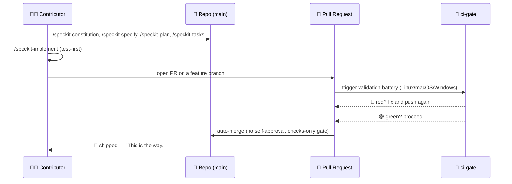
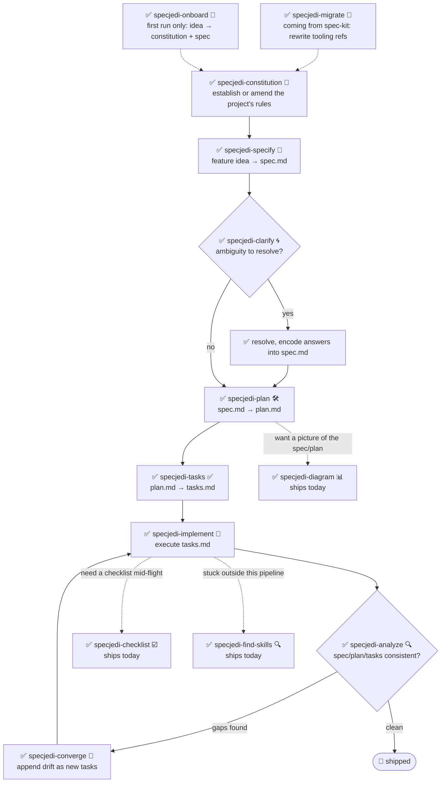

<!-- i18n-sync: source=README.md@81a2538 lang=ar -->
> 🌐 هذا المستند ترجمة بمساعدة الذكاء الاصطناعي. **الإنجليزية هي المصدر
> المعتمد** ([Principle I](../../../.specify/memory/constitution.md))؛ في حال
> وجود أي تعارض، تكون الإنجليزية هي المرجع. لغات أخرى:
> [English](../../../README.md) · [中文](../zh/README.md) ·
> [हिन्दी](../hi/README.md) · [Español](../es/README.md) ·
> [Français](../fr/README.md) · [العربية](../ar/README.md) ·
> [বাংলা](../bn/README.md)

# 🗡️ Spec Jedi

[](https://github.com/jonyfs/spec-jedi/actions/workflows/validate.yml)
[](../../../LICENSE)
[](../../../.specify/memory/constitution.md)
[](#ما-الذي-تحصل-عليه-اليوم)
[](#ما-الذي-تحصل-عليه-اليوم)
[](../../../references/skill-roadmap.md)
[](#التثبيت)
[](../../../.specify/memory/constitution.md)
[](https://github.com/jonyfs/spec-jedi/commits/main)

> *"المواصفات أولاً. ثم الكود. هذه هي الطريقة."* — سيد حكيم، على الأرجح.

‏Spec Jedi هي مجموعة من مهارات التطوير الموجَّه بالمواصفات
(Spec-Driven Development, SDD) تقوم بتثبيتها في وكيل البرمجة الذي
تختاره. بدلاً من كتابة الكود أولاً وتوثيقه لاحقاً، تكتب **دستوراً** 📜
(القواعد غير القابلة للتفاوض في مشروعك)، و**مواصفة** 🎯 (ما الذي تبنيه
ولماذا)، و**خطة** 🛠️ (كيف تقنياً)، و**قائمة مهام** ✅ (الخطوات المرتبة)
— ثم ينفّذ وكيلك بناءً على هذه المخرجات بدلاً من الارتجال مثل Padawan لم
يُكمل تدريبه.

هذا المستودع نفسه مبني بنفس الانضباط الذي يقدّمه: [دستوره](../../../.specify/memory/constitution.md)
الخاص هو المصدر الموثوق لكيفية عمل المشروع، بما في ذلك كيفية إصدار
الإصدارات وكيفية التحقق من طلبات السحب (pull requests) ودمجها. لا
اختصارات نحو الجانب المظلم من "vibe-coding" هنا. 🚫🖤

*(هوية غير رسمية مستوحاة من المعجبين — Spec Jedi ليست تابعة لشركة
Lucasfilm/Disney ولا مدعومة أو مموَّلة منها. لتكن المواصفة معك. 🌌)*

## لمن هذا المشروع

لأي شخص يستخدم وكيل برمجة بالذكاء الاصطناعي ويريد أن تكون المواصفات
والخطط والمهام مخرجات ذات إصدارات ومرتبة الأولوية بدلاً من رسائل محادثة
تُستهلك وتُهمل — المطورون المستقلون، والفرق التي توحّد طريقة عمل
وكلائها، وكل من سئم من إعادة شرح سياق المشروع في كل جلسة.

## ما الذي تحصل عليه اليوم

‏Spec Jedi هي **منافس** حقيقي لـ [spec-kit](https://github.com/github/spec-kit)،
وليست غلافاً بموضوع مختلف له ([Principle XV](../../../.specify/memory/constitution.md)).
سلسلة `specjedi-*` الكاملة لتطوير SDD — من الدستور إلى التقارب —
**مكتملة ومتاحة**: جميع المراحل التسع، بُنيت قصة صارمة تلو الأخرى وفق
انضباط البحث التنافسي في [research.md](../../../specs/001-specjedi-pipeline/research.md)
‏(Principle II)، دون تسرّع أبداً.

**متاحة اليوم، ثبّتها واستخدمها الآن:**

| المهارة (Skill) | ما تفعله |
|---|---|
| `specjedi-onboard` 🌱 | جولة إرشادية للمشروع الجديد كلياً — تُنتج معاً أول `constitution.md` و `spec.md` حقيقيَّين، وتشرح كل مفهوم من مفاهيم SDD تماماً عند الحاجة إليه. تتنحى فوراً إذا كانت عملية الإعداد قد تمت بالفعل |
| `specjedi-constitution` 📜 | تُنشئ أو تُعدّل القواعد غير القابلة للتفاوض في المشروع — الأساس الذي تتحقق منه كل مهارة `specjedi-*` أخرى. راجع [spec](../../../specs/001-specjedi-pipeline/spec.md) |
| `specjedi-specify` 🎯 | تحوّل فكرة ميزة — جملة واحدة تكفي — إلى `spec.md` مرتّب حسب الأولوية وقابل للاختبار بشكل مستقل، مع تحديد الغموض الحقيقي بدلاً من التخمين |
| `specjedi-clarify` 🌀 | تفحص المواصفة بحثاً عن غموض حقيقي وتطرح حتى 5 أسئلة مرتبة حسب الأولوية — لكل منها إجابة مقترَحة، ليحصل المبتدئ على إرشاد ويستطيع الخبير الرد بكلمة واحدة — قبل التخطيط بناءً على تخمين |
| `specjedi-plan` 🛠️ | تحوّل مواصفة تم توضيحها إلى `plan.md` تقني — تفحص أولاً قاعدة الكود الفعلية بحثاً عن الأنماط الموجودة، حتى لا يضطر التنفيذ للتوقف والبحث عن نمط موجود بالفعل |
| `specjedi-tasks` ✅ | تقسّم الخطة إلى `tasks.md` مرتّب ومدرك للتبعيات، مجمّع حسب قصة المستخدم — تضع مهمة اختبار فاشلة قبل مهمة التنفيذ المقابلة أينما تطلبت الخطة كتابة كود |
| `specjedi-implement` 🔨 | تنفّذ `tasks.md` بترتيب التبعيات، مع الاختبار أولاً حيثما تطلب الخطة كتابة كود — لا تُثبّت التغييرات (commit) إلا عبر فرع ميزة وطلب سحب، وأبداً مباشرة على `main` |
| `specjedi-analyze` 🔍 | فحص متقاطع للقراءة فقط بشكل صارم لـ `spec.md`/`plan.md`/`tasks.md` (والدستور) بحثاً عن الثغرات والتكرار والتناقضات — تُبلّغ عن النتائج فقط، ولا تعدّل أي ملف أبداً |
| `specjedi-checklist` ☑️ | تُنشئ قائمة تحقق مخصصة لمجال تركيز محدد (الأمان، إمكانية الوصول، الأداء...) مبنية بالكامل على `spec.md`/`plan.md` الخاصَّين بهذه الميزة — أبداً قالب عام |
| `specjedi-converge` 🔁 | تكتشف الانحراف بين قاعدة الكود الفعلية و `tasks.md` بعد التغييرات اليدوية، وتضيف أي ثغرة كمهمة جديدة بدلاً من تجاهلها بصمت — تُغلق الحلقة عائدةً إلى `specjedi-implement` |
| `specjedi-find-skills` 🔍 | تقترح مهارة محدَّدة ومُتحقَّق منها عندما يمسّ طلبك مجالاً لا تغطيه المهارات المثبَّتة جيداً — لا تُثبِّت شيئاً أبداً دون السؤال أولاً ([Principle XVII](../../../.specify/memory/constitution.md)) |
| `specjedi-explain` 🎓 | تشرح أي مفهوم أو أمر متعلق بـ SDD، بعمق يتناسب مع مستوى خبرتك الظاهر — من المبتدئ التام إلى الممارس اليومي، ولا تُعطي أبداً نفس الإجابة الجاهزة للجميع ([Principle XIX](../../../.specify/memory/constitution.md)) |
| `specjedi-migrate` 🔄 | تعيد كتابة إشارات أدوات `/speckit-*` الحرفية في دستورك/مواصفتك/خطتك/مهامك إلى ما يقابلها من `specjedi-*` — لا تمسّ أبداً محتوى المبادئ أو المتطلبات، فقط عند الطلب الصريح |
| `specjedi-diagram` 📊 | تُنشئ مخطط Mermaid مُتحقَّقاً من عرضه (مخطط انسيابي، تسلسلي، أو ER — يُستنتج من المحتوى) من `spec.md`/`plan.md` موجود — دائماً مكمِّل للنص المصدر، وليس بديلاً عنه أبداً |
| `specjedi-status` 🧭 | لوحة معلومات على مستوى المشروع تعرض حالة كل ميزة، مستمدة بالكامل من مخرجات `spec.md`/`plan.md`/`tasks.md` الموجودة فعلياً على القرص — لا يوجد نظام تتبع منفصل يُصان، ولا تدّعي أبداً أن ميزة ما "متوقفة" كحقيقة |
| `specjedi-retro` 🪞 | مراجعة استعادية للقراءة فقط بشكل صارم تقارن التنفيذ الفعلي لميزة مكتملة بخطتها `plan.md` — تؤسّس سبب أي انحراف على تاريخ git الحقيقي، ولا تختلق سبباً أبداً، وتسجّل مدخلاً دائماً ومؤرَّخاً |
| `specjedi-security` 🛡️ | تنبيه خفيف واستباقي على غرار "هل فكّرنا في X" لثغرات المصادقة/التحقق من المُدخلات/الأسرار/خصوصية البيانات — يُستدعى تلقائياً من `specjedi-plan`، ولا يدّعي أبداً أنه مراجعة أمنية كاملة |
| `specjedi-docs` 📚 | تصوغ مسودة سطر جدول المهارات في README، وخطوة Quickstart، ومدخل `CHANGELOG.md` من مواصفة/خطة ميزة تم تسليمها — مبنية على محتوى حقيقي، تُعرض دائماً للتأكيد قبل الكتابة |
| `specjedi-new-skill` 🌟 | تُنشئ هيكل ملفات مهارة `specjedi-*` جديدة — عناصر نائبة فقط، دون محتوى مُختلَق أبداً — وفق معيار كتابة المهارات الخاص بهذا المشروع، مع تضمين قائمة تحقق البحث الخاصة بـ Principle II |
| `specjedi-release` 🚀 | تُغلِّف `scripts/suggest-release.sh` بصوت Spec Jedi الخاص — تسرد آخر وسم (tag)، والإصدار التالي المقترح، والالتزامات (commits) المساهمة؛ ترفض وتُسمّي الأمر اليدوي إذا طُلب منها فعلاً إصدار نسخة |
| `specjedi-skill-review` 🎓 | تدقيق للقراءة فقط بشكل صارم لملف `SKILL.md` الخاص بمهارة `specjedi-*` مقابل معيار كتابة المهارات — تفحص محتوى الأقسام لا العناوين فقط، وتقارن مع `plan.md` المطابق بحثاً عن استثناءات مشروعة، وتُبلّغ عن النتائج أو نتيجة نظيفة، ولا تعدّل أبداً الملف المُراجَع |
| `specjedi-tokencheck` 🎒 | تتحقق استباقياً من تثبيت `rtk` و `graphify`، وتشرح ما هو مفقود ووفورات الرموز (tokens) المتوقعة، وتعرض دليل تثبيت — تُستدعى تلقائياً من مسار التشغيل الأول لـ `specjedi-onboard`، وتعمل أيضاً بشكل مستقل؛ لا تُثبّت شيئاً أبداً دون تأكيد صريح |
| `specjedi-govcheck` ⚖️ | قائمة تحقق للحوكمة للقراءة فقط بشكل صارم لكل طلب سحب/فرع مقابل جميع مبادئ الدستور العشرين — تقرير بثلاث حالات (غير منطبق / متوافق / غير متوافق)، وأي تعارض يُصنَّف CRITICAL — تُستدعى تلقائياً من `specjedi-implement` قبل فتح طلب سحب (دون أن تمنعه أبداً)، وتعمل أيضاً بشكل مستقل على الفرع الحالي أو طلب سحب محدَّد |

راجع [`references/skill-roadmap.md`](../../../references/skill-roadmap.md)
لمعرفة ما هو مقترَح إضافةً إلى المسار الأساسي (المخططات، والمزيد) — وهي
قائمة انتظار لمهارات *إضافية*، وليست ثغرات في المسار الأساسي؛ كل واحدة
منها لا تزال بحاجة إلى بحثها الخاص قبل بنائها.

## كيف يبني Spec Jedi *نفسه*، في شكل قصة مصوَّرة

> ⚠️ **يتناول هذا القسم عملية التمهيد (bootstrap) الداخلية لدينا، وليس
> منتج Spec Jedi.** أوامر `/speckit-*` أدناه هي أدوات
> [spec-kit](https://github.com/github/spec-kit) الخاصة به — يستخدم Spec
> Jedi حالياً spec-kit لبناء نفسه (نفس نمط "تمهيد مترجم بمترجم أقدم")،
> تماماً كما قد يستخدم أي منافس أدوات لاعب راسخ أثناء بناء بديله. **إذا
> كنت تقيّم Spec Jedi كمنتج، انتقل مباشرة إلى
> [ما الذي تحصل عليه اليوم](#ما-الذي-تحصل-عليه-اليوم) أدناه** — سطح
> المنتج الحقيقي هو مهارات `specjedi-*`، وليس هذه. راجع
> [Principle XV](../../../.specify/memory/constitution.md) للسياسة
> الكاملة حول سبب إبقائهما منفصلَين بوضوح.
>
> أيضاً، ملاحظة حول التنسيق: هذه لوحات قصة مصوَّرة بالنص والرموز
> التعبيرية، وليست أعمالاً فنية مُولَّدة. صور Star Wars الحقيقية
> (الشخصيات، السفن، الشعار) هي ملكية فكرية لشركة Lucasfilm/Disney —
> يلتزم [Principle XII](../../../.specify/memory/constitution.md) الخاص
> بهذا المشروع باستخدام إشارات نصية فقط، ولا يُعيد إنتاج أعمال فنية
> محمية بحقوق النشر أبداً. إذن: لحظات القصة حقيقية، واللوحات هي Markdown. 🖋️

---

**اللوحة 1 — طرفية وحيدة، مؤشر يومض.**
> 🧑‍💻 *"لدي فكرة لميزة. ...ماذا الآن؟"*

**اللوحة 2 — شخصية مقنَّعة تخرج من الظلال، تحمل مخطوطة.**
> 🧙 *"أولاً، القانون."* 📜
> ‏`/speckit-constitution` — قواعد المشروع غير القابلة للتفاوض، تُكتب
> مرة واحدة، ويُتحقَّق منها إلى الأبد بعد ذلك.

**اللوحة 3 — الفكرة، مثبَّتة على جدار، وعلامات استفهام تحيط بها.**
> 🌀 *"ما الذي تبنيه حقاً — ولمن؟"*
> ‏`/speckit-specify` تحوّل الفكرة إلى `spec.md`. `/speckit-clarify`
> تطارد الغموض قبل أن يتحول إلى خلل.

**اللوحة 4 — مخطط يُفرَد على طاولة عمل.**
> 🛠️ *"الآن، الكيفية."*
> ‏`/speckit-plan` ← `plan.md`. `/speckit-tasks` ← `tasks.md` مرتّب
> ومدرك للتبعيات. لا خطوة تُهمَل، ولا خطوة خارج ترتيبها.

**اللوحة 5 — أدوات تطنّ، اختبارات تفشل بالأحمر، ثم تتحول للأخضر واحدة تلو الأخرى.**
> 🤖 *"الاختبارات أولاً. دائماً الاختبارات أولاً."*
> ‏`/speckit-implement` تنفّذ `tasks.md`، مع الاختبار أولاً حيثما ينطبق
> ذلك ([Principle VI](../../../.specify/memory/constitution.md)).

**اللوحة 6 — قاعة مجلس. طلب سحب يقف أمام المنصة.**
> 🏛️ *"اذكر تغييراتك."*
> يُفتح طلب سحب. `ci-gate` 🤖 يُشغِّل كامل حزمة التحقق — كل نظام تشغيل،
> كل فحص. لا يُسمح بالموافقة الذاتية؛ لا يمكن للآلة أن تعفو عن نفسها،
> ولا أنت أيضاً ([Principle X](../../../.specify/memory/constitution.md)).

**اللوحة 7 — ضوء أخضر. البوابة تُفتَح من تلقاء نفسها.**
> ✅ *"لقد تحدّثت الحزمة."*
> جميع الفحوصات تنجح ← دمج تلقائي، دون أن يضطر أي إنسان للنقر على زر.

**اللوحة 8 — سفينة تقفز إلى الفضاء الفائق.**
> 🚀 *"تم التسليم."*
> 🌌 *"لتكن المواصفة معك."*

### نفس قصة التمهيد الداخلي، كمخطط



## المتطلبات الأساسية

يتم تطوير Spec Jedi والتحقق منه على **Linux وmacOS وWindows**
‏(Constitution [Principle XIII](../../../.specify/memory/constitution.md))
— كل سكربت تحت `scripts/` يُشحَن بنسختين: POSIX shell (‏`.sh`) و
PowerShell أصلي (‏`.ps1`)، ويُشغِّل CI حزمة التحقق على أنظمة التشغيل
الثلاثة في كل طلب سحب.

- ‏`git`
- وكيل برمجة مدعوم (راجع [البيئات المدعومة](#البيئات-المدعومة) أدناه)
- [GitHub CLI (`gh`)](https://cli.github.com/)، فقط إذا كنت تخطط
  للمساهمة بتغييرات عبر طلب سحب
- فقط إذا أردت تشغيل السكربتات المساعدة محلياً (اختياري — وكيل البرمجة
  نفسه لا يحتاجها): POSIX shell (bash/zsh، موجود افتراضياً على Linux
  وmacOS) **أو** [PowerShell 7+](https://aka.ms/powershell) (‏`pwsh`)،
  الذي يعمل على أنظمة التشغيل الثلاثة

## التثبيت

### Claude Code (مدعوم بالكامل اليوم)

خطوة الاستنساخ (clone) تختلف قليلاً حسب نظام التشغيل؛ وكل ما بعدها متطابق.

**Linux / macOS** (الطرفية):

```bash
git clone https://github.com/jonyfs/spec-jedi.git
cd spec-jedi
```

**Windows — PowerShell أصلي** (لا حاجة لـ WSL):

```powershell
git clone https://github.com/jonyfs/spec-jedi.git
cd spec-jedi
```

**Windows — WSL أو Git Bash** (إذا كنت تفضّل shell شبيهاً بـ Unix على
Windows):

```bash
git clone https://github.com/jonyfs/spec-jedi.git
cd spec-jedi
```

كلا مساري Windows يعملان بنفس الكفاءة — اختر ما تستخدمه بالفعل يومياً.
الفرق الوحيد بعد ذلك هو أي سكربت مساعد تُشغِّله (`scripts/*.sh` في
POSIX shell، `scripts/*.ps1` في PowerShell الأصلي)؛ المهارات نفسها تعمل
بشكل متطابق في الحالتين.

1. استنسخ المستودع باستخدام الكتلة أعلاه المناسبة لنظام تشغيلك.

2. افتح المجلد في [Claude Code](https://claude.com/claude-code). يكتشف
   Claude Code تلقائياً كل مهارة تحت `.claude/skills/*/SKILL.md` — لا
   توجد خطوة تثبيت منفصلة أو عملية بناء، وهذه الخطوة متطابقة على أنظمة
   التشغيل الثلاثة.

3. تأكد من تحميل المهارات بكتابة `/` في موجّه Claude Code. سترى جميع
   المهارات الثلاث والعشرين من `specjedi-*` وأوامر `speckit-*` (أدوات
   التمهيد الداخلية الخاصة بهذا المستودع — راجع
   [ما الذي تحصل عليه اليوم](#ما-الذي-تحصل-عليه-اليوم)) مُدرَجة معاً،
   لأن Claude Code يكتشف كل مهارة تحت `.claude/skills/` دون التمييز
   بينهما.

4. هذا كل شيء — أنت الآن جاهز لتشغيل `specjedi-onboard` لتشغيل أول
   موجَّه، أو سؤال `specjedi-explain` عن أي شيء إن لم تكن متأكداً من أين
   تبدأ، أو قراءة الدستور لفهم الاتجاه الذي يسير فيه باقي المسار.

**تستخدم Spec Jedi في مشروع آخر غير هذا؟** شغّل المثبِّت (Constitution
[Principle XVIII](../../../.specify/memory/constitution.md)) — ينسخ فقط
مهارات المنتج `specjedi-*`، وليس أبداً أدوات التمهيد `speckit-*`،
بالإضافة إلى ملفات `.specify/templates/*.md` الأربعة التي تحتاجها هذه
المهارات، ويتحقق من النتيجة قبل الانتهاء:

```bash
# من نسخة محلية من Spec Jedi، تستهدف مشروعاً آخر على القرص
./scripts/install.sh /path/to/your-project
```

```powershell
# Windows PowerShell أصلي
.\scripts\install.ps1 -TargetDir C:\path\to\your-project
```

فقط `-harness claude-code` (الافتراضي) مبنيّ ومُختبَر اليوم؛ أي قيمة
أخرى يُبلَّغ عنها بأنها غير مدعومة بعد بدلاً من محاولتها بصمت — راجع
[البيئات المدعومة](#البيئات-المدعومة) أدناه. شغّل
`./scripts/install.sh --help` (أو `.\scripts\install.ps1 -Help`) لقائمة
الخيارات الكاملة.

### البيئات المدعومة

يُلزم دستور Spec Jedi ([Principle III](../../../.specify/memory/constitution.md))
هذا المشروع بدعم عشرين أداة/بيئة برمجة LLM الأكثر استخداماً في السوق في
النهاية. اليوم، فقط المسار أعلاه (Claude Code) تم بناؤه واختباره وتوثيقه
من البداية إلى النهاية.

| البيئة | الحالة |
|---|---|
| Claude Code | ✅ مدعومة — راجع الخطوات أعلاه |
| Cursor | 📋 مخطَّط لها — غير قابلة للتثبيت بعد |
| GitHub Copilot (Chat/Workspace) | 📋 مخطَّط لها — غير قابلة للتثبيت بعد |
| Codex CLI (OpenAI) | 📋 مخطَّط لها — غير قابلة للتثبيت بعد |
| Gemini CLI | 📋 مخطَّط لها — غير قابلة للتثبيت بعد |
| Antigravity (Google) | 📋 مخطَّط لها — غير قابلة للتثبيت بعد |
| Windsurf (Codeium) | 📋 مخطَّط لها — غير قابلة للتثبيت بعد |
| Cline | 📋 مخطَّط لها — غير قابلة للتثبيت بعد |
| Continue | 📋 مخطَّط لها — غير قابلة للتثبيت بعد |
| Aider | 📋 مخطَّط لها — غير قابلة للتثبيت بعد |
| Amazon Q Developer | 📋 مخطَّط لها — غير قابلة للتثبيت بعد |
| JetBrains AI Assistant | 📋 مخطَّط لها — غير قابلة للتثبيت بعد |
| Zed | 📋 مخطَّط لها — غير قابلة للتثبيت بعد |
| OpenCode | 📋 مخطَّط لها — غير قابلة للتثبيت بعد |
| Warp (Agent Mode) | 📋 مخطَّط لها — غير قابلة للتثبيت بعد |
| Replit Agent | 📋 مخطَّط لها — غير قابلة للتثبيت بعد |
| Devin (Cognition) | 📋 مخطَّط لها — غير قابلة للتثبيت بعد |
| Tabnine | 📋 مخطَّط لها — غير قابلة للتثبيت بعد |
| Sourcegraph Cody | 📋 مخطَّط لها — غير قابلة للتثبيت بعد |
| Trae | 📋 مخطَّط لها — غير قابلة للتثبيت بعد |

عشرون بيئة مذكورة كل واحدة على حدة وفق ولاية Principle III "عشرون على
الأقل" — الحالة فقط (✅ مدعومة / 📋 مخطَّط لها)، دون أي ادّعاءات قدرات
لأي بيئة لم يبنِ هذا المشروع ويختبرها فعلياً، وفق انضباط مقاومة
الهلوسة الخاص بـ Principle XX. "مخطَّط لها" حالة، وليست موعداً موعوداً
على خارطة الطريق.

إذا لم تكن بيئتك مُدرَجة كمدعومة بعد، فملفات `SKILL.md` هي Markdown صِرف
مع بيانات وصفية YAML — العديد من البيئات التي تدعم التعليمات/المطالبات
المخصصة يمكنها بالفعل قراءتها مباشرة حتى دون مسار تثبيت مخصص، لكن هذا
لم يُتحقَّق منه أو يُوثَّق بعد لكل بيئة على حدة.

## البدء السريع

ثلاث وعشرون مهارة منتج متاحة اليوم
([ما الذي تحصل عليه اليوم](#ما-الذي-تحصل-عليه-اليوم)) — مسار
`specjedi-*` الكامل مكتمل. لم تستخدم أداة SDD من قبل؟ ابدأ بالخطوة 0.

0. **لست متأكداً مما يعنيه كل هذا؟** فقط اسأل — "ما هي المواصفة ولماذا
   قد أحتاجها"، "ما الذي يفعله هذا المشروع فعلياً". `specjedi-explain`
   🎓 تجيب بأي عمق تحتاجه، مبتدئاً كنت أم متقدماً، وتشير دائماً إلى ما
   يجب تشغيله بعد ذلك
   ([Principle XIX](../../../.specify/memory/constitution.md)).
1. ثبِّت (راجع [التثبيت](#التثبيت) أعلاه).
2. مشروع جديد كلياً، لا فكرة من أين تبدأ؟ `specjedi-onboard` 🌱 ترشدك
   لإنتاج أول `constitution.md` و `spec.md` حقيقيَّين معاً من فكرة بجملة
   واحدة، وتشرح كل مفهوم فقط عندما تحتاجه فعلاً — أبداً جدار من
   التوثيق منذ البداية. (الخطوتان 3-4 أدناه هما بالضبط ما تنسّقه لأجلك؛
   انتقل إليهما مباشرة إذا فضّلت تشغيل كل مرحلة بنفسك.)
3. أرسِ قواعد مشروعك: صِف أموراً غير قابلة للتفاوض بلغة بسيطة، وتُنتج
   `specjedi-constitution` 📜 ملف `.specify/memory/constitution.md` ذا
   إصدار — تتحقق كل مهارة `specjedi-*` أخرى من مخرجاتها مقابل هذا الملف.
4. حدِّد مواصفة ميزة: صِف ما تريد بناءه — فكرة تقريبية بجملة واحدة تكفي
   — وتحوّلها `specjedi-specify` 🎯 إلى `spec.md` مرتّب حسب الأولوية
   وقابل للاختبار بشكل مستقل، مع تحديد الغموض الحقيقي بدلاً من تخمينه.
5. لست متأكداً أن المواصفة متينة بعد؟ تفحصها `specjedi-clarify` 🌀
   بحثاً عن غموض حقيقي وتطرح حتى 5 أسئلة مرتبة حسب الأولوية — لكل منها
   إجابة مقترَحة، فيمكنك قبولها بكلمة واحدة أو قراءة التبرير إن أردت —
   قبل التخطيط بناءً على تخمين.
6. مستعد لتصميم "الكيفية"؟ تفحص `specjedi-plan` 🛠️ أولاً قاعدة الكود
   الفعلية بحثاً عن الأنماط الموجودة، ثم تحوّل المواصفة الموضَّحة إلى
   `plan.md` تقني — حتى لا يضطر التنفيذ أبداً للتوقف والبحث عن نمط موجود
   بالفعل في مكان آخر من مشروعك. إذا كانت مواصفتك تمسّ المصادقة أو
   المُدخلات الخارجية أو الأسرار أو معالجة البيانات، تُفعَّل
   `specjedi-security` 🛡️ تلقائياً بأسئلة موجَّهة على غرار "هل فكّرنا في
   X" — تنبيه خفيف، وليس مراجعة أمنية كاملة أبداً.
7. مستعد لتقسيمه إلى عمل؟ تحوّل `specjedi-tasks` ✅ الخطة إلى `tasks.md`
   مرتّب ومدرك للتبعيات، مجمّع حسب قصة المستخدم — تضع مهمة اختبار فاشلة
   قبل مهمة التنفيذ المقابلة أينما تطلبت الخطة كتابة كود.
8. مستعد لبنائه؟ تنفّذ `specjedi-implement` 🔨 ملف `tasks.md` بترتيب
   التبعيات، مع الاختبار أولاً حيثما تطلب الخطة كتابة كود — كل التزام
   (commit) يستقر على فرع ميزة وطلب سحب، وأبداً مباشرة على `main`.
9. تريد شبكة أمان؟ تُجري `specjedi-analyze` 🔍 فحصاً متقاطعاً لـ
   `spec.md` و `plan.md` و `tasks.md` (ودستورك) بحثاً عن الثغرات
   والتكرار والتناقضات — للقراءة فقط بشكل صارم، قابلة للتشغيل في أي
   وقت، ولا تعدّل ملفاً أبداً.
10. تحتاج مراجعة موجَّهة؟ تُنشئ `specjedi-checklist` ☑️ قائمة تحقق
    لمجال تركيز محدَّد — الأمان، إمكانية الوصول، الأداء، أياً كان ما
    تسمّيه — مبنية بالكامل على مواصفة/خطة هذه الميزة، أبداً قالب عام.
11. غيّرت الكود يدوياً منذ آخر `tasks.md`؟ تفحص `specjedi-converge` 🔁
    قاعدة الكود الفعلية، وتكتشف أي إمكانية دون مهمة مقابلة، وتضيفها
    كعمل جديد بدلاً من تركها تنحرف بصمت — المرحلة الأخيرة في المسار،
    مُغلقة الحلقة عائدةً إلى `specjedi-implement`.
12. عالق في شيء خارج هذه المجموعة؟ فقط صِفه — "كيف أفعل X"، "هل توجد
    مهارة لـ X" — وتُفعَّل `specjedi-find-skills` 🔍 تلقائياً، تبحث في
    نظام agent-skills المفتوح، وتقترح مهارة محدَّدة ومُتحقَّق منها. لا
    تُثبِّت شيئاً أبداً دون السؤال أولاً
    ([Principle VIII](../../../.specify/memory/constitution.md)).
13. قادم من مشروع spec-kit موجود؟ تعيد `specjedi-migrate` 🔄 كتابة
    إشارات أدوات `/speckit-*` الخاصة بمشروعك إلى ما يقابلها من
    `specjedi-*` — لا تمسّ أبداً مبدأ أو متطلَّباً، فقط عند الطلب
    الصريح.
14. تريد صورة بدلاً من جدار نصي؟ تحوّل `specjedi-diagram` 📊 مواصفة أو
    خطة إلى مخطط Mermaid مُتحقَّق من عرضه — انسيابي، تسلسلي، أو ER،
    أياً كان ما يتطلبه المحتوى الفعلي — دائماً بجانب النص المصدر، أبداً
    مكانه.
15. تدير أكثر من ميزة أو اثنتين في آن واحد؟ تعرض `specjedi-status` 🧭
    لوحة معلومات على مستوى المشروع بأكمله — أي الميزات محدَّدة، مخطَّطة،
    قيد التقدم، أو مكتملة — مستمدة بالكامل مما هو موجود فعلياً على
    القرص، دون نظام تتبع منفصل يجب إبقاؤه متزامناً.
16. أنهيت للتو ميزة؟ تقارن `specjedi-retro` 🪞 ما تم تسليمه فعلياً بما
    قالته `plan.md`، وتؤسّس سبب أي انحراف على تاريخ git الحقيقي — ولا
    تختلق سبباً أبداً — وتسجّل مدخلاً دائماً حتى تبقى الإشارة بعد هذه
    المحادثة.
17. سلّمت شيئاً وتحتاج توثيقه؟ تصوغ `specjedi-docs` 📚 مسودة سطر
    README، وخطوة Quickstart، ومدخل `CHANGELOG.md` لأجلك — مبنية على
    مواصفتك/خطتك الحقيقية، تُعرض دائماً للتأكيد قبل كتابة أي شيء.
18. توسِّع Spec Jedi نفسه بمهارة جديدة؟ تُنشئ `specjedi-new-skill` 🌟
    هيكل الملفات — `specs/`، هيكل `SKILL.md`، كل قسم عنصر نائب موسوم —
    لا تختلق أبداً نتائج بحث أو سلوكاً نيابة عنك.
19. تتساءل إن حان وقت إصدار نسخة؟ تسرد `specjedi-release` 🚀 اقتراح
    `scripts/suggest-release.sh` نفسه — آخر وسم، الإصدار التالي،
    الالتزامات المساهمة — وترفض مع ذكر الأمر اليدوي الدقيق إذا طلبت
    منها فعلاً إصدار نسخة؛ لا تضع وسماً أو تنشر بنفسها أبداً.
20. كتبت أو غيّرت مهارة `specjedi-*` يدوياً؟ تفحص `specjedi-skill-review`
    🎓 ملف `SKILL.md` الخاص بها مقابل معيار كتابة المهارات — محتوى
    الأقسام، لا العناوين فقط، مقارنةً بـ `plan.md` المطابق بحثاً عن
    استثناءات مشروعة — وتُبلّغ عن النتائج أو نتيجة نظيفة؛ لا تعدّل
    الملف نفسه أبداً.
21. تُشغِّل `specjedi-onboard` هذا بالفعل مرة واحدة نيابة عنك عند
    الاستخدام الأول، لكن `specjedi-tokencheck` 🎒 تعمل أيضاً بشكل مستقل
    — تتحقق من تثبيت `rtk` و `graphify`، وتشرح ما هو مفقود ووفورات
    الرموز المتوقعة، وتعرض إرشادك خلال التثبيت؛ لا تُثبِّت شيئاً أبداً
    دون موافقتك الصريحة.
22. تُشغِّل `specjedi-implement` هذا بالفعل قبل فتح كل طلب سحب، لكن
    `specjedi-govcheck` ⚖️ تعمل أيضاً بشكل مستقل — قائمة تحقق لكل فرع
    (أو طلب سحب) مقابل مبادئ الدستور العشرين، تُبلّغ عن كل واحد كغير
    منطبق، متوافق، أو غير متوافق، مع تصنيف أي تعارض حقيقي كـ CRITICAL؛
    للقراءة فقط بشكل صارم، لا تعدّل شيئاً أبداً، ولا تمنع أبداً طلب سحب
    من الفتح بنفسها.

وفق [Principle XIV](../../../.specify/memory/constitution.md)، ما شغّلته
للتو يجب أن يخبرك بما تشغّله بعد ذلك — لا ينبغي أن تحتاج للعودة إلى هذه
القائمة لمعرفة ذلك. تُشغِّل السلسلة الكاملة `specjedi-onboard` (أول
تشغيل فقط) ← `specjedi-constitution` ← `specjedi-specify` ←
`specjedi-clarify` ← `specjedi-plan` ← `specjedi-tasks` ←
`specjedi-implement` ← `specjedi-analyze` ← `specjedi-checklist` ←
`specjedi-converge`، وتعود بحلقة إلى `specjedi-implement` كلما وجدت
`specjedi-converge` انحرافاً يجب معالجته.

### المسار، من البداية إلى النهاية

من الإعداد إلى التقارب — كل مرحلة أدناه مُفعَّلة:



✅ = متاحة اليوم — مسار `specjedi-*` الكامل ذو التسع مراحل مكتمل، بالإضافة
إلى `specjedi-onboard` كنقطة دخول موجَّهة للتشغيل الأول.

## الرفقاء الموصى بهم

يوجّه دستور هذا المشروع
([Principle VIII](../../../.specify/memory/constitution.md)) كل جلسة
Spec Jedi لاقتراح رفيقَين استباقياً موفِّرَين للرموز (tokens)، لكن أبداً
تثبيتهما بصمت:

- [`rtk`](https://github.com/rtk-ai/rtk) — وكيل CLI محسَّن للرموز
  لعمليات التطوير الشائعة.
- [`graphify`](https://graphify.net/) — يحوّل قاعدة الكود إلى رسم بياني
  معرفي قابل للاستعلام.

إذا عرض وكيلك تثبيت أو ضبط أي منهما، فهذا هو أثر هذه السياسة — يُسأل
منك دائماً أولاً.

**تم ربط graphify بالفعل بهذا المستودع** (بتأكيد من القائم على الصيانة):
قسم `## graphify` في `CLAUDE.md` يخبر Claude Code بمراجعة الرسم البياني
المعرفي قبل تصفح الكود المصدري وتحديثه بعد تغييرات الكود، ويسجّل
`.claude/settings.json` خطافات (hooks) توجّه استدعاءات الأدوات نحو
`graphify query`/`explain`/`path` بدلاً من grep/read الخام بمجرد وجود
الرسم البياني. الرسم البياني نفسه (`graphify-out/`) لا يُثبَّت (commit)
— إنه ذاكرة تخزين مؤقت مشتقة، تُعاد توليدها مع كل استنساخ.

للحصول على نفس سلوك التحديث التلقائي محلياً بعد الاستنساخ:

```bash
pip install graphifyy   # أو: uv tool install graphifyy
graphify .               # البناء الأول (مطلوب مرة واحدة فقط؛ يعمل أيضاً تلقائياً عند أول استخدام على أي حال)
graphify hook install    # إعادة بناء graph.json تلقائياً بعد كل التزام (تغييرات الكود)
```

تغييرات التوثيق/المحتوى لا يلتقطها خطاف الالتزام (commit hook) — شغّل
`graphify update .` (أو فقط اطلب من وكيلك ذلك) بعد تعديل ملفات ليست
كوداً.

## الإصدارات والنشر

يتّبع Spec Jedi [الإصدار الدلالي (Semantic Versioning)](https://semver.org/)
لإصداراته الخاصة، محدوداً بعقد حزمة المهارات العام (تغيير سلوك مهارة
بشكل جذري = MAJOR، مهارات جديدة أو إمكانية إضافية = MINOR،
إصلاحات/توثيق = PATCH). راجع
[Principle XI](../../../.specify/memory/constitution.md) للسياسة الكاملة.

يقترح المشروع متى يكون الإصدار مبرَّراً بدلاً من إصداره بصمت:

```bash
# Linux / macOS / Windows (WSL أو Git Bash)
./scripts/suggest-release.sh
```

```powershell
# Windows (PowerShell أصلي)
./scripts/suggest-release.ps1
```

يفحص هذا الالتزامات منذ آخر وسم ويوصي بالإصدار التالي — لا يضع وسماً أو
ينشر أي شيء بنفسه أبداً. إصدار نسخة فعلياً هو دائماً خطوة متعمَّدة يقودها
القائم على الصيانة.

## المساهمة

راجع [`CONTRIBUTING.md`](./CONTRIBUTING.md) لعملية المساهمة الكاملة —
متطلبات البحث التنافسي للمهارات الجديدة، وقائمة تحقق معيار كتابة
المهارات، وخطوات التحقق التي يجب تشغيلها قبل فتح طلب سحب.

كل تغيير يُسلَّم عبر طلب سحب يتحقق منه حزمة CI الخاصة بهذا المشروع،
ويُدمَج تلقائياً فقط بمجرد أن يصبح كل فحص أخضر (راجع
[Principle IX و X](../../../.specify/memory/constitution.md)). تعمل تلك
الحزمة على Linux وmacOS وWindows في كل طلب سحب (Principle XIII) — إذا
أضفت أو غيّرت سكربتاً تحت `scripts/`، يجب أن توجد نسختا `.sh` و `.ps1`
معاً وتنجحا على الأنظمة الثلاثة. قوالب المشكلات (issues) وطلبات السحب
(`.github/ISSUE_TEMPLATE/`, `.github/PULL_REQUEST_TEMPLATE.md`) ترشد
المساهمين للتأكد من إتمام خطوات البحث والتحقق أعلاه قبل طلب المراجعة.

## الترخيص

[MIT](../../../LICENSE) — مختار ومطلوب من دستور هذا المشروع الخاص
(Distribution & Ecosystem Standards). بلغة بسيطة، تعني MIT أنه يمكنك:

- **استخدام** هذا المشروع، تجارياً أو غير ذلك، دون قيود.
- **تعديله** كيفما تشاء.
- **إعادة توزيعه**، حتى كجزء من شيء تبيعه.

الشروط الحقيقية الوحيدة: الاحتفاظ بإشعار حقوق النشر الأصلي ونص الترخيص
في مكان ما من نسختك، وعدم توقّع أي ضمان — يُقدَّم البرنامج "كما هو"،
دون أي مسؤولية إذا تعطّل شيء ما. هذا هو الاتفاق كاملاً؛ راجع
[`LICENSE`](../../../LICENSE) للنص القانوني الدقيق.

---
