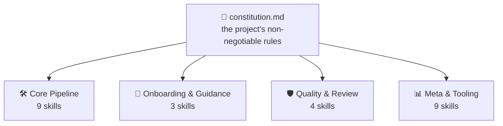
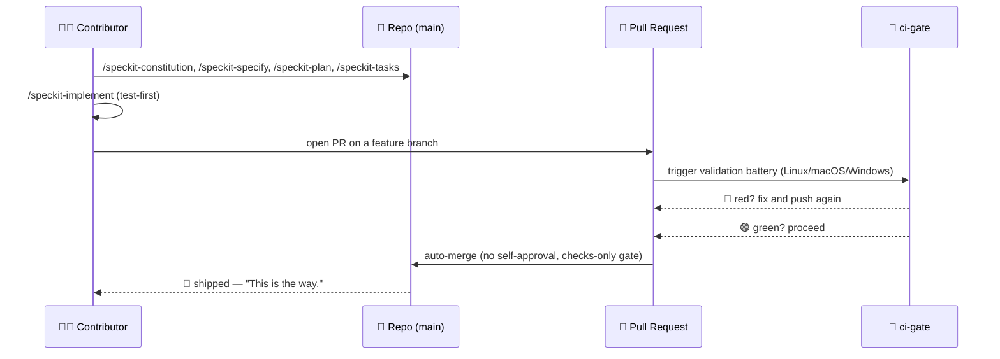

<!-- i18n-sync: source=README.md@1609524 lang=ar -->
> 🌐 هذا المستند ترجمة بمساعدة الذكاء الاصطناعي. **الإنجليزية هي المصدر
> المعتمد** ([Principle I](../../../.specify/memory/constitution.md))؛ في حال
> وجود أي تعارض، تكون الإنجليزية هي المرجع. لغات أخرى:
> [English](../../../README.md) · [中文](../zh/README.md) ·
> [हिन्दी](../hi/README.md) · [Español](../es/README.md) ·
> [Français](../fr/README.md) · [العربية](../ar/README.md) ·
> [বাংলা](../bn/README.md) · [Português](../pt/README.md) · [Русский](../ru/README.md) · [اردو](../ur/README.md) · [Bahasa Indonesia](../id/README.md)

# Spec Jedi

[](https://github.com/jonyfs/spec-jedi/actions/workflows/validate.yml)
[](../../../LICENSE)
[](../../../.specify/memory/constitution.md)
[](#كيف-يطبّق-spec-jedi-منهج-sdd)
[](#كيف-يطبّق-spec-jedi-منهج-sdd)
[](../../../references/skill-roadmap.md)
[](#التثبيت)
[](../../../docs/i18n/)
[](../../../.specify/memory/constitution.md)
[](https://github.com/jonyfs/spec-jedi/commits/main)

> *"المواصفات أولاً. ثم الكود. هذه هي الطريقة."* — سيد حكيم، على الأرجح.


**رسالة، من سيد إلى كل من يلتقط هذه المخطوطة بعده:**

معظم المشاريع التي تتجاوز خطتها الخاصة تشترك في السبب الجذري نفسه: الكود
أولاً، ثم الشرح لاحقاً — وذلك "اللاحقاً" لا يأتي أبداً بحق. ما يلي هو
الممارسة التي تعكس هذا الترتيب، والمشروع الفعلي الذي بُني لتطبيقها.

*(هوية غير رسمية مستوحاة من المعجبين — Spec Jedi ليست تابعة لشركة
Lucasfilm/Disney ولا مدعومة أو مموَّلة منها. لتكن المواصفة معك. 🌌)*

## ما هو التطوير الموجَّه بالمواصفات؟

الطريقة المعتادة لبناء برمجيات باستخدام وكيل برمجة بالذكاء الاصطناعي هي
هذه: تصف ما تريده في المحادثة، يكتب الوكيل الكود، تقرأ الكود لتعرف إن كان
قد فعل ما قصدته، تصححه، ثم تكرر ذلك. فهم الوكيل لـ"ما قصدته" يعيش فقط في
المحادثة — لا يُدوَّن أبداً كأثر دائم قابل للمراجعة. ينتج عن ذلك نوعان من
الفشل: يُحلّ الغموض بالتخمين بدلاً من عرضه لاتخاذ قرار، ولا شيء يبقى بعد
انتهاء المحادثة — تُغلق المحادثة، فيضيع منطقك.

يعكس التطوير الموجَّه بالمواصفات (Spec-Driven Development, SDD) هذا
الترتيب. قبل وجود أي سطر كود، يُدوَّن ما يُبنى ولماذا، كوثيقة منظَّمة
قابلة للمراجعة — **دستور** 📜 (القواعد غير القابلة للتفاوض)، و**مواصفة**
🎯 (ماذا، ولمن)، و**خطة** 🛠️ (كيف تقنياً)، و**قائمة مهام** ✅ (الخطوات
المرتبة). يُولَّد الكود *بناءً* على هذه المخرجات، وليس العكس — نفس
الانضباط الذي يطلبه قانون الجدَاي من أي شخص تغريه فكرة تخطي الأجزاء
المملة من التدريب. شرح كامل، دون أي علامة تجارية خاصة بـ Spec Jedi:
[`references/what-is-sdd.md`](../../../references/what-is-sdd.md).



كل ما يأتي بعد ذلك يتحقق من نفسه مقابل الدستور، وليس العكس أبداً. غيّر
قاعدة واحدة، وستشعر كل skill بذلك في تشغيلها التالي.

## كيف يطبّق Spec Jedi منهج SDD

‏Spec Jedi هي **منافس** حقيقي لـ [spec-kit](https://github.com/github/spec-kit)،
وليست غلافاً بموضوع مختلف له ([Principle XV](../../../.specify/memory/constitution.md)) —
عشرون وكيل برمجة مدعومة فعلياً، وليس فقط نظرياً (راجع
[التثبيت](#التثبيت) أدناه). سلسلة `specjedi-*` الكاملة لتطوير SDD — من
الدستور إلى التقارب — مُسلَّمة بالكامل منذ فترة: جميع المراحل التسع، كل
واحدة مبنية على بحث تنافسي حقيقي قبل كتابة أول سطر منها
([research.md](../../../specs/001-specjedi-pipeline/research.md)،
Principle II).

كل نشاط من أنشطة SDD أعلاه يقابل skill حقيقية من `specjedi-*` مُسلَّمة
بالفعل، وليست طموحاً: `specjedi-constitution` تُنشئ القواعد،
`specjedi-specify` تحوّل فكرة إلى `spec.md`، `specjedi-clarify` تحلّ
الغموض المحدَّد، و`specjedi-plan` و`specjedi-tasks` تُنتجان الخطة التقنية
وتفكيك المهام، و`specjedi-implement` (أو `specjedi-quick` للتغييرات
الصغيرة والمفهومة جيداً) تنفّذها باختبار أولاً، فقط عبر فرع ميزة وطلب سحب.
تتوفر اليوم خمس وعشرون skill إجمالاً، عبر أربعة تخصصات — الكتالوج الكامل،
والمخططان، ودليل السير خطوة بخطوة المكوَّن من 23 خطوة، كلها موجودة في
[`references/quickstart-guide.md`](../../../references/quickstart-guide.md)؛
والتخطيط الكامل من النشاط إلى المهارة، بما في ذلك ثلاث مساهمات حقيقية
تتجاوز ممارسة SDD العامة، موجود في
[`references/specjedi-and-sdd.md`](../../../references/specjedi-and-sdd.md).

فضولي بشأن ما هو قادم؟
[`references/skill-roadmap.md`](../../../references/skill-roadmap.md)
يتتبع ما هو مقترَح إضافةً إلى المسار الأساسي — وهي قائمة انتظار لأفكار
*إضافية*، وليست ثغرات في المسار نفسه. كل واحدة منها لا تزال بحاجة إلى
بحثها الحقيقي الخاص قبل بنائها؛ لا شيء هنا يُسلَّم بمجرد الحدس.

## لمن هذا المشروع

سئمت من إعادة شرح سياق المشروع نفسه في كل جلسة. سئمت من رؤية وكيل يعيد
اختراع قرار اتخذه فريق ثم تخلى عنه قبل ثلاثة أسابيع بصمت، لأن لا أحد
دوّنه في مكان يستطيع الوكيل إيجاده فيه. سواء كنت شخصاً واحداً أو فريقاً
كاملاً يحاول جعل كل الوكلاء يتصرفون بالطريقة نفسها: أي شخص يريد أن تكون
المواصفات والخطط والمهام ملفات حقيقية ذات إصدارات بدلاً من رسائل محادثة
تختفي بمجرد إغلاق النافذة، هو القارئ الذي يخاطبه هذا.

## كيف يبني Spec Jedi *نفسه*، في شكل قصة مصوَّرة

> ⚠️ **يتناول هذا القسم عملية التمهيد (bootstrap) الداخلية لدينا، وليس
> منتج Spec Jedi.** أوامر `/speckit-*` أدناه هي أدوات
> [spec-kit](https://github.com/github/spec-kit) الخاصة به — يستخدم Spec
> Jedi حالياً spec-kit لبناء نفسه (نفس نمط "تمهيد مترجم بمترجم أقدم")،
> تماماً كما قد يستخدم أي منافس أدوات لاعب راسخ أثناء بناء بديله. **إذا
> كنت تقيّم Spec Jedi كمنتج، انتقل مباشرة إلى
> [التثبيت](#التثبيت) أدناه** — سطح المنتج الحقيقي هو مهارات
> `specjedi-*`، وليس هذه. راجع
> [Principle XV](../../../.specify/memory/constitution.md) للسياسة
> الكاملة حول سبب إبقائهما منفصلَين بوضوح.
>
> أيضاً، ملاحظة حول التنسيق: تجمع اللوحات أدناه بين حوار نصي مع رموز
> تعبيرية ورسوم توضيحية أصلية — أبداً صور Star Wars الحقيقية (الشخصيات،
> السفن، الشعار)، وهي ملكية فكرية لشركة Lucasfilm/Disney.
> [Principle XII](../../../.specify/memory/constitution.md) الخاص بهذا
> المشروع يلتزم بهوية بصرية أصلية وإشارات نصية فقط إلى Star Wars، ولا
> يُعيد إنتاج أعمال فنية محمية بحقوق النشر أبداً، ولا يصنع فناً يستحضر
> السمات البصرية المميَّزة الخاصة بالسلسلة. إذن: لحظات القصة حقيقية،
> والفن أصلي، والكلمات وحدها لا تزال تحمل المعنى. 🖋️

---

تبدأ كل قصة بالطريقة نفسها: غرفة مظلمة، طرفية، ومؤشر لا يتوقف عن الوميض
حتى تعطيه شيئاً يفعله.


> 🧑‍💻 *"لدي فكرة لميزة. ...ماذا الآن؟"*

عندئذٍ يظهر المرشد — بلا سيف ضوئي، فقط مخطوطة، لأن المعركة الأولى هنا لا
تكون أبداً الأخيرة. `/speckit-constitution` تكتب القواعد مرة واحدة، حتى
لا يضطر أحد لتعلّمها بالطريقة الصعبة بعد ثلاث ميزات.


> 🧙 *"أولاً، القانون."* 📜

ثم ترتفع الفكرة على الجدار، محاطة بكل سؤال لم تجب عليه بعد — ما الذي
يُبنى فعلياً، ولمن. `/speckit-specify` تحوّلها إلى `spec.md` حقيقي؛
`/speckit-clarify` تنطلق لتطارد الغموض قبل أن يتحول إلى خلل لا يريد أحد
تحمّل مسؤوليته لاحقاً.


> 🌀 *"ما الذي تبنيه حقاً — ولمن؟"*

ثم يظهر المخطط. `/speckit-plan` يصبح `plan.md`، و`/speckit-tasks` يقسّمه
إلى `tasks.md` مرتَّب ومدرك للتبعيات — لا خطوة مُهمَلة، ولا خطوة خارج
ترتيبها، نوع الخطة التي يستطيع أي Padawan اتّباعها دون أن يسأل مرتين.


> 🛠️ *"الآن، الكيفية."*

تبدأ الأدوات بالطنين. تفشل الاختبارات بالأحمر، واحداً تلو الآخر — ثم،
تدريجياً، تتوقف عن الفشل. `/speckit-implement` تنفّذ `tasks.md` مع
الاختبار أولاً حيثما ينطبق ذلك
([Principle VI](../../../.specify/memory/constitution.md))، لأن أي بناء
يتخطى هذه الخطوة ليس سوى تخمين بخطوات إضافية.


> 🤖 *"الاختبارات أولاً. دائماً الاختبارات أولاً."*

الآن يجتمع المجلس — ليس لمباركة العمل، فقط لفحصه. يقف طلب سحب أمام
المنصة، ويُشغِّل `ci-gate` 🤖 كامل حزمة التحقق: كل نظام تشغيل، كل فحص،
دون اختصارات. لا يُسمح لأحد بالموافقة على عمله بنفسه هنا، لا الآلة ولا
الإنسان ([Principle X](../../../.specify/memory/constitution.md)).


> 🏛️ *"اذكر تغييراتك."*

يتحول الضوء إلى الأخضر، وتُفتح البوابة من تلقاء نفسها — لا يد على
المقبض، لا أحد يضغط زراً. الحزمة قالت بالفعل ما كان يجب قوله.


> ✅ *"لقد تحدّثت الحزمة."*

ثم تمضي — نحو الفضاء الفائق، تم التسليم.


> 🚀 *"تم التسليم."*
> 🌌 *"لتكن المواصفة معك."*

لا شيء من هذا افتراضي — إنه العملية الحرفية والمتكررة وراء طلبات السحب
الأخيرة لهذا المشروع نفسه —
[#82](https://github.com/jonyfs/spec-jedi/pull/82)،
[#84](https://github.com/jonyfs/spec-jedi/pull/84)،
[#87](https://github.com/jonyfs/spec-jedi/pull/87)، على سبيل المثال لا
الحصر — من البداية إلى النهاية، بشكل حقيقي، في كل مرة.

### نفس قصة التمهيد الداخلي، كمخطط



## المتطلبات الأساسية

لا شيء غريب هنا. يُبنى Spec Jedi ويُختبَر على **Linux وmacOS وWindows**
بالتساوي (Constitution
[Principle XIII](../../../.specify/memory/constitution.md)) — كل سكربت
تحت `scripts/` يُشحَن بنسختين: POSIX shell (‏`.sh`) وPowerShell أصلي
(‏`.ps1`)، ويُشغِّل CI الحزمة الكاملة على أنظمة التشغيل الثلاثة، في كل
طلب سحب.

ما تحتاجه فعلياً:

- ‏`git`
- وكيل برمجة مدعوم (راجع [البيئات المدعومة](#البيئات-المدعومة) أدناه)
- [GitHub CLI (`gh`)](https://cli.github.com/) — فقط إذا كنت تخطط لإرسال
  طلبات سحب
- shell لتشغيل السكربتات المساعدة محلياً، إذا أردت (وكيل البرمجة نفسه لا
  يحتاج هذا): bash/zsh، موجود افتراضياً على Linux وmacOS، أو
  [PowerShell 7+](https://aka.ms/powershell) (‏`pwsh`)، الذي يعمل في كل
  مكان

## التثبيت

أمر واحد. بلا `git clone`. `scripts/bootstrap-install.sh`/`.ps1` (راجع
specs/024-bootstrap-installer إذا أردت القصة الكاملة) يجلبان إصداراً
منشوراً على GitHub ويشغّلان مثبِّته المرفق مباشرة في دليلك الهدف:

```bash
curl -fsSL https://raw.githubusercontent.com/jonyfs/spec-jedi/main/scripts/bootstrap-install.sh \
  | bash -s -- /path/to/your-project --harness cursor
```

```powershell
&([scriptblock]::Create((iwr -useb https://raw.githubusercontent.com/jonyfs/spec-jedi/main/scripts/bootstrap-install.ps1).Content)) -TargetDir C:\path\to\your-project -Harness cursor
```

‏`--harness` اختياري. إذا تم حذفه، يحاول المثبِّت معرفة وكيل البرمجة الذي
تستخدمه — `claude-code`، أو `codex-cli`، أو `trae` — بفحص وجود دليل
مشروع، أو ملف تنفيذي على `PATH`، أو دليل إعدادات عام موجود مسبقاً، ولا
يسأل إلا إذا وجد أكثر من مرشح محتمل. البيئات السبع عشرة الأخرى ليس لديها
بعد إشارة اكتشاف موثوقة، لذا فهي تتطلب منك تمرير `--harness` بنفسك —
القائمة الكاملة أدناه مباشرة في [البيئات المدعومة](#البيئات-المدعومة).
شغّل `./scripts/bootstrap-install.sh --help` (أو
`.\scripts\bootstrap-install.ps1 -Help`) في أي وقت تريد فيه القائمة
الكاملة للخيارات، بما في ذلك `--auto`.

### البيئات المدعومة

يُلزم الدستور ([Principle III](../../../.specify/memory/constitution.md))
هذا المشروع بتغطية عشرين وكيل برمجة الأكثر استخداماً الموجودين — واعتباراً
من هذا الإصدار، كل العشرين حقيقية ومُختبَرة ومُثبَتة عبر CI، وليست
افتراضية. أربعة منها تقرأ المهارات أصلياً من القرص (Claude Code، وCodex
CLI، وTrae، وAntigravity — الثلاث الأخيرة تشترك في مجلدَي هدف فعليَّين
فقط، `.agents/skills/` و`.trae/skills/`، مع تحقق OpenCode وWarp عبر
المسارين نفسيهما دون أي كود إضافي). أما البيئات الأربع عشرة المتبقية
فليس لديها أي مفهوم أصلي للمهارات على الإطلاق — فقط ملف قواعد في جذر
المشروع، أو دليل قواعد صغير، أو، في حالة Sourcegraph Cody، ملف JSON
لأوامر مخصصة — لذا يُنشئ المثبِّت **جسراً**: تهبط حزم `specjedi-*`
الحقيقية دائماً في الموقع المرجعي `.claude/skills/`، ويشير محوِّل صغير
(ملف واحد، أو ملف واحد لكل مهارة للبيئات ذات نمط المجلدات) إليه باستخدام
الاصطلاح الذي توثّقه تلك البيئة فعلياً.

راجع [`specs/023-full-harness-coverage/research.md`](../../../specs/023-full-harness-coverage/research.md)
إذا أردت المرجع الداعم لآلية كل بيئة بالضبط — لا شيء هنا مُخمَّن.

| البيئة | الحالة |
|---|---|
| Claude Code | ✅ مدعومة — أمر [التثبيت](#التثبيت) أعلاه، احذف `--harness` (اكتشاف تلقائي) أو مرّر `--harness claude-code` صراحةً |
| Cursor | ✅ مدعومة — `./scripts/install.sh --harness cursor` (ملفات جسر تحت `.cursor/rules/`) |
| GitHub Copilot (Chat/Workspace) | ✅ مدعومة — `./scripts/install.sh --harness copilot` (ملف جسر في `.github/copilot-instructions.md`) |
| Codex CLI (OpenAI) | ✅ مدعومة — `./scripts/install.sh --harness codex-cli` (تُثبَّت في `.agents/skills/`) |
| Gemini CLI | ✅ مدعومة — `./scripts/install.sh --harness gemini-cli` (ملف جسر في `GEMINI.md`؛ تعمل Google على إيقاف Gemini CLI تدريجياً لصالح Antigravity — راجع [`references/harness-capability-notes.md`](../../../references/harness-capability-notes.md)) |
| Antigravity (Google) | ✅ مدعومة — `./scripts/install.sh --harness antigravity` (تُثبَّت في `.agents/skills/`، بنفس اصطلاح Codex CLI) |
| Windsurf (Codeium) | ✅ مدعومة — `./scripts/install.sh --harness windsurf` (ملفات جسر تحت `.windsurf/rules/`) |
| Cline | ✅ مدعومة — `./scripts/install.sh --harness cline` (ملفات جسر تحت `.clinerules/`) |
| Continue | ✅ مدعومة — `./scripts/install.sh --harness continue` (ملفات جسر تحت `.continue/rules/`) |
| Aider | ✅ مدعومة — `./scripts/install.sh --harness aider` (ملف جسر في `CONVENTIONS.md`) |
| Amazon Q Developer | ✅ مدعومة — `./scripts/install.sh --harness amazon-q` (ملفات جسر تحت `.amazonq/rules/`) |
| JetBrains AI Assistant | ✅ مدعومة — `./scripts/install.sh --harness jetbrains-ai` (ملفات جسر تحت `.aiassistant/rules/`) |
| Zed | ✅ مدعومة — `./scripts/install.sh --harness zed` (ملف جسر في `.rules`) |
| OpenCode | ✅ مدعومة — تُلبّى عبر تثبيت `claude-code` أو `codex-cli` (يفحص OpenCode بشكل أصلي كلاً من `.claude/skills/` و`.agents/skills/`)، دون الحاجة لعلامة منفصلة |
| Warp (Agent Mode) | ✅ مدعومة — تُلبّى عبر تثبيت `claude-code` أو `codex-cli` (يفحص نظام Skills الخاص بـ Warp بشكل أصلي كلاً من `.claude/skills/` و`.agents/skills/`)، دون الحاجة لعلامة منفصلة |
| Replit Agent | ✅ مدعومة — `./scripts/install.sh --harness replit` (ملف جسر في `replit.md`) |
| Devin (Cognition) | ✅ مدعومة — `./scripts/install.sh --harness devin` (ملف جسر في `.devin.md`، مُهيكَل كـ Devin Playbook) |
| Tabnine | ✅ مدعومة — `./scripts/install.sh --harness tabnine` (ملفات جسر تحت `.tabnine/guidelines/`) |
| Sourcegraph Cody | ✅ مدعومة — `./scripts/install.sh --harness cody` (أوامر مخصصة في `.vscode/cody.json`، تُستدعى صراحةً كـ `/specjedi-<name>`؛ خلافاً لكل بيئة أخرى أعلاه، لا يملك Cody ملف قواعد مؤكَّد دائم التفعيل، لذا هذا استدعاء يدوي، وليس سياقاً تلقائياً — راجع وثيقة البحث) |
| Trae | ✅ مدعومة — `./scripts/install.sh --harness trae` (تُثبَّت في `.trae/skills/`) |

عشرون بيئة مذكورة كل واحدة على حدة، جميعها ✅ مدعومة — هذا هو معيار
Principle III الخاص. دون أي ادّعاءات قدرات لأي آلية لم يبنِ هذا المشروع
ويختبرها فعلياً؛ لا يسمح Principle XX بالتخمين هنا.

تريد المزيد؟ [`references/harness-capability-notes.md`](../../../references/harness-capability-notes.md)
يحتوي ملاحظات القدرات الأصلية المستندة إلى بحث مكتبي لكل بيئة، و
[`specs/023-full-harness-coverage/research.md`](../../../specs/023-full-harness-coverage/research.md)
يحتوي قرارات آلية التثبيت الحقيقية والمراجع التي بُني عليها هذا الجدول
بأكمله.

## تقييم صادق

مزايا حقيقية، وقيود حالية حقيقية — وليست صفحة تسويقية. عشرون من أصل عشرين
بيئة هدف لديها مسار تثبيت حقيقي مُختبَر عبر CI، والمخططات يُتحقَّق منها
بالعرض قبل إظهارها، والدستور وثيقة حية ذات إصدار عند v1.24.0 مع سجل
تعديلات موثَّق. النصف الآخر، قيل بصراحة: لم يُصدَر أي إصدار بعد (لا يُعيد
`git tag -l` شيئاً وقت كتابة هذا)، ومعظم مسارات تثبيت بيئات الجسر تستند
إلى بحث مكتبي، وليس جلسة عملية داخل المنتج الفعلي لطرف ثالث. الصورة
الكاملة، دون تنقيح:
[`references/honest-assessment.md`](../../../references/honest-assessment.md).

عشرون بيئة مذكورة كل واحدة على حدة، جميعها مثبَتة عبر CI — لكن 18 من أصل
19 بيئة غير Claude Code تم تأكيدها ببحث مكتبي (مصدر واحد مُستشهَد به لكل
بيئة)، وليس بالتثبيت الفعلي في المنتج الحقيقي ومراقبة تحميل skill؛ فقط
حالة Sourcegraph Cody تغيَّرت بعد بحث متابعة أعمق لم يجد أي ملف قواعد
مؤكَّد دائم التفعيل. المراجع لكل بيئة وتاريخ البحث الكامل:
[`references/harness-capability-notes.md`](../../../references/harness-capability-notes.md).

هل تتساءل كيف يقارن Spec Jedi بـ spec-kit والعشر أدوات SDD الأخرى التي
قورن بها؟
[`references/competitive-comparison.md`](../../../references/competitive-comparison.md)
لديه الأدلة.

## المساهمة

راجع [`CONTRIBUTING.md`](./CONTRIBUTING.md) للعملية الكاملة — متطلبات
البحث التنافسي للمهارات الجديدة، وقائمة تحقق معيار كتابة المهارات، وخطوات
التحقق التي يجب تشغيلها قبل فتح طلب سحب.

كل تغيير يُسلَّم عبر طلب سحب، يتحقق منه حزمة CI الخاصة بهذا المشروع،
ويُدمَج تلقائياً فقط بمجرد أن يصبح كل فحص أخضر
(راجع [Principle IX و X](../../../.specify/memory/constitution.md)).
تعمل تلك الحزمة على Linux وmacOS وWindows في كل طلب سحب (Principle XIII)
— إذا أضفت أو غيّرت سكربتاً تحت `scripts/`، يجب أن توجد نسختا `.sh`
و`.ps1` معاً وتنجحا على الأنظمة الثلاثة، دون استثناءات. قوالب المشكلات
وطلبات السحب (`.github/ISSUE_TEMPLATE/`,
`.github/PULL_REQUEST_TEMPLATE.md`) ترشدك للتأكد من إتمام خطوات البحث
والتحقق أعلاه قبل طلب المراجعة.

## الترخيص

[MIT](../../../LICENSE) — يتطلبه دستور هذا المشروع الخاص (Distribution &
Ecosystem Standards)، وليس مجرد خيار افتراضي لم يفكر فيه أحد. بلغة بسيطة،
تعني MIT أنه يمكنك:

- **استخدام** هذا المشروع، تجارياً أو غير ذلك، دون قيود.
- **تعديله** كيفما تشاء.
- **إعادة توزيعه**، حتى كجزء من شيء تبيعه.

الشروط الحقيقية، وهما اثنتان فقط: الاحتفاظ بإشعار حقوق النشر الأصلي ونص
الترخيص في مكان ما من نسختك، وعدم توقّع أي ضمان — يُقدَّم البرنامج "كما
هو"، دون أي مسؤولية إذا تعطّل شيء ما. هذا هو الاتفاق كاملاً بحق؛ راجع
[`LICENSE`](../../../LICENSE) للنص القانوني الدقيق إذا أردته حرفياً.

---

🌌 *لتكن المواصفة معك.*
