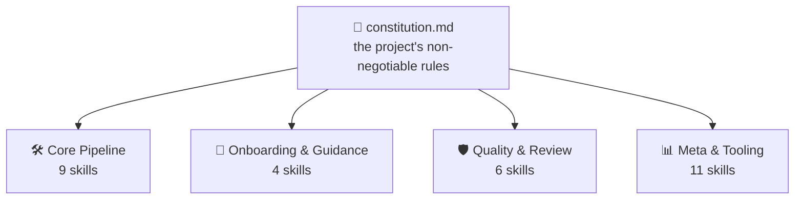
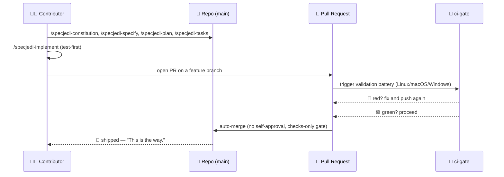

<!-- i18n-sync: source=README.md@2a01f98 lang=bn -->
> 🌐 এই ডকুমেন্টটি AI-সহায়তায় অনূদিত। **ইংরেজি হলো প্রামাণিক উৎস**
> ([Principle I](../../../.specify/memory/constitution.md))；কোনো অসঙ্গতি
> থাকলে ইংরেজি সংস্করণ প্রাধান্য পাবে। অন্যান্য ভাষা দেখুন:
> [English](../../../README.md) · [中文](../zh/README.md) ·
> [हिन्दी](../hi/README.md) · [Español](../es/README.md) ·
> [Français](../fr/README.md) · [العربية](../ar/README.md) ·
> [বাংলা](../bn/README.md) · [Português](../pt/README.md) · [Русский](../ru/README.md) · [اردو](../ur/README.md) · [Bahasa Indonesia](../id/README.md)

# Spec Jedi

[](https://github.com/jonyfs/spec-jedi/actions/workflows/validate.yml)
[](../../../LICENSE)
[](../../../.specify/memory/constitution.md)
[](#spec-jedi-কীভাবে-sdd-বাস্তবায়ন-করে)
[](#spec-jedi-কীভাবে-sdd-বাস্তবায়ন-করে)
[](../../../references/skill-roadmap.md)
[](#ইনস্টলেশন)
[](../../../docs/i18n/)
[](../../../.specify/memory/constitution.md)
[](https://github.com/jonyfs/spec-jedi/commits/main)

> *"প্রথমে স্পেসিফিকেশন। তারপর কোড। এটাই পথ।"* — এক জ্ঞানী মাস্টার,
> সম্ভবত।


**একটি চিঠি, এক মাস্টারের কাছ থেকে, যে পরে এই স্ক্রলটি তুলে নেবে তার জন্য:**

বেশিরভাগ প্রজেক্ট যা নিজের পরিকল্পনাকে ছাড়িয়ে যায়, তাদের একই মূল কারণ থাকে:
আগে কোড, পরে ব্যাখ্যা — এবং সেই "পরে" আসলে কখনোই সত্যিকারভাবে আসে না। এরপর
যা আসছে তা হলো সেই চর্চা যা এই ক্রমকে উল্টে দেয়, এবং সেই নির্দিষ্ট প্রজেক্ট
যা এটি বাস্তবায়ন করার জন্য তৈরি হয়েছে।

*(এটি একটি অনানুষ্ঠানিক, ফ্যান-অনুপ্রাণিত ব্র্যান্ডিং — Spec Jedi
Lucasfilm/Disney-এর সাথে সংযুক্ত, অনুমোদিত বা স্পনসরকৃত নয়। Spec আপনার
সাথে থাকুক। 🌌)*

## Spec-Driven Development কী?

AI কোডিং এজেন্ট দিয়ে সফটওয়্যার তৈরির স্বাভাবিক পদ্ধতিটি এমন দেখায়: চ্যাটে
আপনি কী চান তা বর্ণনা করুন, এজেন্ট কোড লেখে, আপনি কোডটি পড়ে বুঝতে চেষ্টা
করেন এটি আপনার অভিপ্রায় অনুযায়ী কাজ করেছে কি না, আপনি সংশোধন করেন, তারপর
পুনরাবৃত্তি করেন। "আপনি কী বোঝাতে চেয়েছিলেন" সে সম্পর্কে এজেন্টের বোঝাপড়া
শুধুমাত্র কথোপকথনেই থাকে — এটি কখনো একটি স্থায়ী, পর্যালোচনাযোগ্য
আর্টিফ্যাক্ট হিসেবে লেখা হয় না। এর থেকে দুই ধরনের ব্যর্থতা তৈরি হয়:
অস্পষ্টতা কোনো সিদ্ধান্তের জন্য প্রকাশ করার বদলে অনুমান করে সমাধান করা হয়,
এবং কথোপকথন শেষ হওয়ার পর কিছুই টিকে থাকে না — চ্যাট বন্ধ করুন, যুক্তি হারিয়ে
ফেলুন।

Spec-Driven Development (SDD) এই ক্রমকে উল্টে দেয়। কোনো কোডের একটি লাইনও
থাকার আগে, কী তৈরি করা হচ্ছে এবং কেন তা লিখে রাখা হয়, চারটি কাঠামোগত,
পর্যালোচনাযোগ্য নথি হিসেবে: `specjedi-constitution` দ্বারা লেখা একটি
**constitution** 📜 (প্রজেক্টের অলঙ্ঘনীয় নিয়ম), `specjedi-specify` দ্বারা
লেখা একটি **specification** 🎯 (কী, এবং কার জন্য), `specjedi-plan` দ্বারা
লেখা একটি **plan** 🛠️ (কীভাবে, প্রযুক্তিগতভাবে), এবং `specjedi-tasks`
দ্বারা লেখা একটি **task list** ✅ (ক্রমানুসারে ধাপগুলো)। কোড এই চারটি
আর্টিফ্যাক্টের *বিপরীতে* তৈরি হয়, উল্টো নয়। সম্পূর্ণ ব্যাখ্যা, Spec Jedi-এর
নিজস্ব কোনো ব্র্যান্ডিং ছাড়াই:
[`references/what-is-sdd.md`](../../../references/what-is-sdd.md)।



এরপরের সবকিছু নিজেকে constitution-এর বিপরীতে যাচাই করে, উল্টোটা কখনো নয়।
একটি নিয়ম বদলান, এবং প্রতিটি skill তার পরবর্তী রানে তা অনুভব করবে।

## Spec Jedi কীভাবে SDD বাস্তবায়ন করে

Spec Jedi হলো [spec-kit](https://github.com/github/spec-kit)-এর একটি
**প্রতিযোগী** ([Principle XV](../../../.specify/memory/constitution.md)),
একটি `specjedi-*` skill সেট হিসেবে তৈরি যা একটি প্রজেক্ট spec-kit-এর
নিজস্ব `speckit-*` কমান্ডের পাশাপাশি — অথবা তার পরিবর্তে — ইনস্টল করে,
এবং বিশটি টার্গেট কোডিং এজেন্টই সমর্থিত-সহ (নিচে
[ইনস্টলেশন](#ইনস্টলেশন) দেখুন)। সম্পূর্ণ `specjedi-*` SDD পাইপলাইন —
constitution থেকে convergence পর্যন্ত — অনেকদিন আগেই সম্পূর্ণভাবে প্রকাশিত
হয়েছে: সবগুলো ৯টি ধাপ, প্রতিটি তার প্রথম লাইন লেখার আগে প্রকৃত
প্রতিযোগিতামূলক গবেষণার উপর নির্মিত
([research.md](../../../specs/001-specjedi-pipeline/research.md),
Principle II)।

উপরের প্রতিটি SDD কার্যক্রম একটি প্রকৃত, ইতিমধ্যে প্রকাশিত `specjedi-*`
skill-এর সাথে মেলে, কোনো কল্পনা নয়: `specjedi-constitution` নিয়ম স্থাপন
করে, `specjedi-specify` একটি আইডিয়াকে `spec.md`-এ রূপান্তর করে,
`specjedi-clarify` চিহ্নিত অস্পষ্টতা সমাধান করে, `specjedi-plan` এবং
`specjedi-tasks` প্রযুক্তিগত পরিকল্পনা এবং টাস্ক ভাঙন তৈরি করে, এবং
`specjedi-implement` (অথবা ছোট, ভালোভাবে বোঝা পরিবর্তনের জন্য
`specjedi-quick`) এটি টেস্ট-প্রথম পদ্ধতিতে কার্যকর করে, শুধুমাত্র একটি
ফিচার ব্রাঞ্চ এবং pull request-এর মাধ্যমে। আজ মোট ত্রিশটি skill উপলব্ধ,
চারটি শাখায় — সম্পূর্ণ ক্যাটালগ, উভয় ডায়াগ্রাম, এবং ২৩-ধাপের ওয়াকথ্রু
[`references/quickstart-guide.md`](../../../references/quickstart-guide.md)-এ
বাস করে; সাধারণ SDD চর্চার বাইরে তিনটি প্রকৃত অবদান-সহ সম্পূর্ণ
কার্যক্রম-থেকে-skill ম্যাপিং
[`references/specjedi-and-sdd.md`](../../../references/specjedi-and-sdd.md)-এ
বাস করে।

### সংখ্যায়: `specjedi-*` বনাম `speckit-*`

একটি প্রমাণ-ভিত্তিক, কমান্ড-বাই-কমান্ড তুলনা —
[`specs/044-speckit-parity-audit/PARITY-LEDGER.md`](../../../specs/044-speckit-parity-audit/PARITY-LEDGER.md)
— `speckit-*`-এর ১১টি পাইপলাইন কমান্ডের প্রতিটিকে তার সংশ্লিষ্ট
`specjedi-*` প্রতিরূপের বিপরীতে পরীক্ষা করেছে, নামের মিলের ভিত্তিতে নয়,
প্রকৃত বর্ণিত আচরণের ভিত্তিতে:

- **১১টির মধ্যে ৮টি** সম্পূর্ণ সমতায় আছে — একই কাজ, একই ইনপুট/আউটপুট।
- **১১টির মধ্যে ১টি** (`specjedi-implement` বনাম `speckit-implement`) একটি
  অনুকূল বিচ্যুতি: `specjedi-implement`-এর জন্য শুধুমাত্র একটি ফিচার
  ব্রাঞ্চ এবং pull request-এর মাধ্যমে কমিট করা প্রয়োজন, কখনো সরাসরি trunk
  ব্রাঞ্চে নয়; `speckit-implement`-এর নিজস্ব নির্দেশাবলীতে কোনো git
  ব্রাঞ্চ বা কমিট শৃঙ্খলার উল্লেখই নেই।
- **১১টির মধ্যে ২টির** কোনো `specjedi-*` প্রতিরূপ নেই — উভয়ই ইতিমধ্যে
  সমাধান হয়ে গেছে, খোলা ফাঁক নয়: GitHub-issue টাস্ক রূপান্তর (এই
  প্রজেক্টের নিজস্ব প্রকৃত ইতিহাসে কখনো ব্যবহৃত হয়নি) এবং একটি স্থায়ী
  "current plan" পয়েন্টার (`specjedi-status`-এর জিরো-প্যারালাল-ট্র্যাকিং
  ডিজাইন এবং Constitution Principle XXI-এর নিজস্ব সেশন-স্টার্ট স্ট্যাটাস
  পুনঃপ্রদর্শন দ্বারা প্রতিস্থাপিত)।
- প্রকাশিত ৩০টি `specjedi-*` skill-এর মধ্যে **২১টির** কোনো `speckit-*`
  প্রতিরূপই নেই — `specjedi-catalog-audit`, `specjedi-chain`,
  `specjedi-constitution-audit`, `specjedi-diagram`, `specjedi-docs`,
  `specjedi-explain`, `specjedi-find-skills`, `specjedi-govcheck`,
  `specjedi-master`, `specjedi-migrate`, `specjedi-new-skill`,
  `specjedi-onboard`, `specjedi-parallel`, `specjedi-quick`,
  `specjedi-release`, `specjedi-retro`, `specjedi-security`,
  `specjedi-skill-review`, `specjedi-status`, `specjedi-tokencheck`, এবং
  `specjedi-worktree` — প্রকৃত অতিরিক্ত সক্ষমতা, কোনো পুনরাবৃত্ত পাইপলাইন
  নয়।

পরবর্তীতে কী আছে তা নিয়ে আগ্রহী?
[`references/skill-roadmap.md`](../../../references/skill-roadmap.md)
মূল পাইপলাইনের বাইরে কী প্রস্তাবিত তা ট্র্যাক করে — এটি *অতিরিক্ত*
আইডিয়ার একটি ব্যাকলগ, মূল পাইপলাইনের ফাঁক নয়। প্রতিটির তৈরি হওয়ার আগে
এখনও নিজস্ব প্রকৃত গবেষণা প্রয়োজন; এখানে কিছুই স্রেফ অনুমানের ভিত্তিতে
প্রকাশিত হয় না।

## এটি কাদের জন্য

প্রতিটি সেশনে একই প্রজেক্ট কনটেক্সট বারবার ব্যাখ্যা করতে ক্লান্ত। একটি
এজেন্টকে নীরবে সেই সিদ্ধান্ত পুনরায় আবিষ্কার করতে দেখে ক্লান্ত যা একটি টিম
তিন সপ্তাহ আগে নিয়েছিল এবং ছেড়ে দিয়েছিল, কারণ এটি এমন কোথাও লেখা ছিল না
যেখানে এজেন্ট এটি খুঁজে পেতে পারে। একজন মানুষ হোক বা পুরো একটি টিম যারা
সমস্ত এজেন্টকে একইভাবে আচরণ করাতে চেষ্টা করছে তা কোনো ব্যাপার না: যে কেউ
চায় specs, plans, এবং tasks প্রকৃত, ভার্সনযুক্ত ফাইল হোক, চ্যাট মেসেজের
বদলে যা উইন্ডো বন্ধ হওয়ার সাথে সাথেই অদৃশ্য হয়ে যায় — সেই এখানকার
উদ্দিষ্ট পাঠক।

## Spec Jedi কীভাবে কমিক আকারে *নিজেকে* তৈরি করে

> ⚠️ **এই বিভাগটি এই প্রজেক্টের নিজস্ব প্রকৃত ডেভেলপমেন্ট পাইপলাইন
> বাস্তবে দেখায়** — নিচের `specjedi-*` কমান্ডগুলো ঠিক উপরে বর্ণিত একই
> প্রোডাক্ট সারফেস, যা Spec Jedi নিজের উপরেই ব্যবহৃত হয়েছে। ফিচার ০৪৮
> (2026-07-18) পর্যন্ত, এই প্রজেক্ট নিজেকে তৈরি করতে spec-kit-এর নিজস্ব
> vendored `speckit-*` কমান্ড ব্যবহার করত (একই "পুরনো কম্পাইলার দিয়ে নতুন
> কম্পাইলার বুটস্ট্র্যাপ করা" প্যাটার্ন যা যেকোনো প্রতিযোগী তার
> প্রতিস্থাপন তৈরি করার সময় ব্যবহার করতে পারে), যতক্ষণ না তার নিজস্ব
> `specjedi-*` পাইপলাইন দায়িত্ব নেওয়ার মতো যথেষ্ট সম্পূর্ণ হয়ে ওঠে। সেই
> bootstrap পর্যায় এখন শেষ — এই মাইগ্রেশন সম্পূর্ণ করা পূর্ণ নীতির জন্য
> দেখুন [Principle XV](../../../.specify/memory/constitution.md)।
>
> এছাড়াও, ফরম্যাট নিয়ে একটি নোট: নিচের প্যানেলগুলো টেক্সট-এবং-ইমোজি
> সংলাপকে মৌলিক চিত্রকর্মের সাথে মিলিয়ে দেয় — কখনো প্রকৃত Star Wars চিত্র
> (চরিত্র, জাহাজ, লোগো) নয়, যা Lucasfilm/Disney-এর মেধাসম্পত্তি। এই
> প্রজেক্টের নিজস্ব
> [Principle XII](../../../.specify/memory/constitution.md) একটি মৌলিক
> ভিজ্যুয়াল পরিচয় এবং শুধুমাত্র টেক্সট-ভিত্তিক Star Wars রেফারেন্সের
> প্রতিশ্রুতি দেয়, কখনো কপিরাইটযুক্ত আর্ট পুনরুৎপাদন করে না এবং এমন আর্টও
> তৈরি করে না যা সাগার নিজস্ব স্বীকৃত ভিজ্যুয়াল চিহ্নগুলো মনে করিয়ে দেয়।
> তাই: গল্পের মুহূর্তগুলো বাস্তব, শিল্পকর্ম মৌলিক, এবং শব্দগুলো একাই অর্থ
> বহন করে চলে। 🖋️

---

প্রতিটি গল্প একইভাবে শুরু হয়: একটি অন্ধকার ঘর, একটি টার্মিনাল, একটি কার্সার
যা আপনি এটিকে কিছু করার না দেওয়া পর্যন্ত জ্বলতে থামে না।


> 🧑‍💻 *"আমার একটা ফিচার আইডিয়া আছে। ...এখন কী?"*

তখনই মেন্টর সামনে আসে — কোনো লাইটসেবার নেই, শুধু একটি স্ক্রল, কারণ এখানকার
প্রথম যুদ্ধ কখনো শেষটি নয়। `/specjedi-constitution` নিয়মগুলো একবার লেখে,
যাতে তিনটি ফিচার পরে কাউকে কঠিন উপায়ে সেগুলো আবার শিখতে না হয়।


> 🧙 *"প্রথমে, বিধান।"* 📜

তারপর আইডিয়াটি দেয়ালে ওঠে, তার এখনও উত্তর না দেওয়া প্রতিটি প্রশ্নে ঘেরা —
আসলে কী তৈরি হচ্ছে, এবং কার জন্য। `/specjedi-specify` এটিকে একটি প্রকৃত
`spec.md`-এ রূপান্তর করে; `/specjedi-clarify` অস্পষ্টতাকে ধরতে বের হয়, এটি
এমন একটি বাগে পরিণত হওয়ার আগে যা পরে কেউ নিজের বলে স্বীকার করতে চায় না।


> 🌀 *"আপনি আসলে কী তৈরি করছেন — এবং কার জন্য?"*

তারপর ব্লুপ্রিন্ট বেরিয়ে আসে। `/specjedi-plan` হয়ে যায় `plan.md`,
`/specjedi-tasks` এটিকে একটি ক্রমানুসারে, ডিপেন্ডেন্সি-সচেতন `tasks.md`-এ
ভেঙে ফেলে — কোনো ধাপ বাদ যায় না, কোনো ধাপ ক্রম ছাড়া নয়, এমন একটি
পরিকল্পনা যা একজন Padawan দুবার না জিজ্ঞেস করেই অনুসরণ করতে পারবে।


> 🛠️ *"এখন কীভাবে।"*

টুলগুলো গুনগুন করতে শুরু করে। টেস্টগুলো একের পর এক লাল হয়ে ব্যর্থ হয় —
এবং তারপর, ধীরে ধীরে, ব্যর্থ হওয়া বন্ধ করে। `/specjedi-implement` যেখানে
প্রযোজ্য সেখানে টেস্ট-প্রথম পদ্ধতিতে `tasks.md` কার্যকর করে
([Principle VI](../../../.specify/memory/constitution.md)), কারণ এই ধাপ
এড়িয়ে যাওয়া একটি বিল্ড শুধুমাত্র অতিরিক্ত ধাপযুক্ত একটি অনুমান মাত্র।


> 🤖 *"প্রথমে টেস্ট। সবসময় প্রথমে টেস্ট।"*

এখন কাউন্সিল একত্রিত হয় — কাজকে আশীর্বাদ করতে নয়, শুধু এটি যাচাই করতে। একটি
pull request বেঞ্চের সামনে দাঁড়িয়ে থাকে, এবং `ci-gate` 🤖 সম্পূর্ণ
validation battery চালায়: প্রতিটি অপারেটিং সিস্টেম, প্রতিটি চেক, কোনো
শর্টকাট ছাড়াই। এখানে কাউকে নিজের কাজ নিজে অনুমোদন করার অনুমতি নেই — মেশিন
হোক বা মানুষ
([Principle X](../../../.specify/memory/constitution.md))।


> 🏛️ *"আপনার পরিবর্তনগুলো বলুন।"*

আলো সবুজ হয়ে যায়, এবং গেট নিজে থেকেই খুলে যায় — কোনো হাত লিভারে নেই, কেউ
বাটনে ক্লিক করছে না। battery ইতিমধ্যে যা বলার তা বলে ফেলেছে।


> ✅ *"battery কথা বলেছে।"*

এবং তারপর এটি চলে যায় — হাইপারস্পেসের দিকে, প্রকাশিত।


> 🚀 *"প্রকাশিত।"*
> 🌌 *"Spec আপনার সাথে থাকুক।"*

এর কোনোটিই কাল্পনিক নয় — এটি এই প্রজেক্টের নিজস্ব সাম্প্রতিক pull
request-গুলোর পেছনের আক্ষরিক, পুনরাবৃত্ত প্রক্রিয়া —
[#82](https://github.com/jonyfs/spec-jedi/pull/82),
[#84](https://github.com/jonyfs/spec-jedi/pull/84),
[#87](https://github.com/jonyfs/spec-jedi/pull/87), কয়েকটি নাম বলতে গেলে
— শুরু থেকে শেষ পর্যন্ত, সত্যিকারভাবে, প্রতিবার।

### একই গল্প, একটি ডায়াগ্রাম হিসেবে



## পূর্বশর্ত

এখানে বিদেশী কিছু নেই। Spec Jedi সমানভাবে **Linux, macOS, এবং Windows**-এ
তৈরি ও পরীক্ষিত হয় (Constitution
[Principle XIII](../../../.specify/memory/constitution.md)) — `scripts/`-এর
অধীনে প্রতিটি স্ক্রিপ্ট POSIX shell (`.sh`) এবং নেটিভ PowerShell (`.ps1`)
উভয় সংস্করণে প্রকাশিত হয়, এবং CI প্রতিটি PR-এ তিনটি অপারেটিং সিস্টেমেই
সম্পূর্ণ battery চালায়।

আসলে যা প্রয়োজন:

- `git`
- একটি সমর্থিত কোডিং এজেন্ট (নিচে
  [সমর্থিত হার্নেস](#সমর্থিত-হার্নেস) দেখুন)
- [GitHub CLI (`gh`)](https://cli.github.com/) — শুধুমাত্র যদি আপনি
  pull request ফেরত পাঠানোর পরিকল্পনা করেন
- স্থানীয়ভাবে হেল্পার স্ক্রিপ্ট চালানোর জন্য একটি shell, যদি আপনি চান
  (কোডিং এজেন্টের নিজেরই এর প্রয়োজন নেই): bash/zsh, যা Linux এবং
  macOS-এ ডিফল্টভাবে উপস্থিত, অথবা
  [PowerShell 7+](https://aka.ms/powershell) (`pwsh`), যা সব জায়গায়
  চলে

## ইনস্টলেশন

একটি মাত্র কমান্ড। কোনো `git clone` নেই।
`scripts/bootstrap-install.sh`/`.ps1` (সম্পূর্ণ কাহিনীর জন্য
specs/024-bootstrap-installer দেখুন) একটি প্রকাশিত GitHub Release এনে
সরাসরি আপনার টার্গেট ডিরেক্টরিতে এর অন্তর্ভুক্ত ইনস্টলার চালায়:

```bash
curl -fsSL https://raw.githubusercontent.com/jonyfs/spec-jedi/main/scripts/bootstrap-install.sh \
  | bash -s -- /path/to/your-project --harness cursor
```

```powershell
&([scriptblock]::Create((iwr -useb https://raw.githubusercontent.com/jonyfs/spec-jedi/main/scripts/bootstrap-install.ps1).Content)) -TargetDir C:\path\to\your-project -Harness cursor
```

`--harness` ঐচ্ছিক। যদি বাদ দেওয়া হয়, ইনস্টলার আপনি কোন কোডিং এজেন্ট
ব্যবহার করছেন তা বের করার চেষ্টা করে — `claude-code`, `codex-cli`, অথবা
`trae` — আগে থেকেই বিদ্যমান প্রজেক্ট ডিরেক্টরি, `PATH`-এ থাকা বাইনারি,
অথবা আগে থেকেই বিদ্যমান গ্লোবাল কনফিগ ফোল্ডার পরীক্ষা করে, এবং শুধুমাত্র
তখনই জিজ্ঞাসা করে যখন এটি একাধিক সম্ভাব্য প্রার্থী খুঁজে পায়। বাকি ১৭টি
হার্নেসের এখনও একটি নির্ভরযোগ্য শনাক্তকরণ সংকেত নেই, তাই সেগুলোর জন্য
আপনি নিজেই `--harness` পাস করেন — সম্পূর্ণ তালিকা ঠিক নিচে
[সমর্থিত হার্নেস](#সমর্থিত-হার্নেস)-এ আছে। `--auto`-সহ সম্পূর্ণ অপশন
তালিকা চাইলে যেকোনো সময় `./scripts/bootstrap-install.sh --help` (বা
`.\scripts\bootstrap-install.ps1 -Help`) চালান।

`claude-code`, `codex-cli`, এবং `trae`-এর জন্য, ইনস্টলার সেই হার্নেসের
নিজস্ব প্রজেক্ট-মেমরি ফাইলও (`CLAUDE.md`, `AGENTS.md`, অথবা
`.trae/rules/project_rules.md`) তৈরি বা আপডেট করে, ইনস্টল করা skill-গুলোর
নাম উল্লেখকারী একটি সংক্ষিপ্ত, মার্কার-বিভক্ত অংশসহ — যাতে হার্নেসের
নিজস্ব কনটেক্সট ইতিমধ্যেই জানে সেগুলো সেখানে আছে, শুধু skills ডিরেক্টরি
নিজে নয়। যদি সেই ফাইলটি ইতিমধ্যেই আপনার নিজস্ব কনটেন্টসহ বিদ্যমান থাকে,
আপনার কোনো কিছু স্পর্শ করা হয় না; শুধু সেই অংশটি যুক্ত করা হয়, এবং
পরবর্তী পুনঃ-ইনস্টলে শুধুমাত্র সেই অংশটিই রিফ্রেশ হয়।

### সমর্থিত হার্নেস

Constitution ([Principle III](../../../.specify/memory/constitution.md))
এই প্রজেক্টকে বিশটি সবচেয়ে বেশি ব্যবহৃত কোডিং এজেন্ট কভার করতে
প্রতিশ্রুতিবদ্ধ করে — এবং এই রিলিজ অনুযায়ী, সবগুলো বিশটিই আসল, পরীক্ষিত,
এবং CI-প্রমাণিত, কল্পনাপ্রসূত নয়। চারটি ডিস্ক থেকে সরাসরি skill পড়ে
(Claude Code, Codex CLI, Trae, Antigravity — শেষ তিনটি মাত্র দুটি
ফিজিক্যাল টার্গেট ডিরেক্টরি শেয়ার করে, `.agents/skills/` এবং
`.trae/skills/`, এবং OpenCode ও Warp কোনো অতিরিক্ত কোড ছাড়াই এই একই
পথগুলো দিয়ে সন্তুষ্ট হয়)। বাকি চৌদ্দটির skills-এর কোনো নেটিভ ধারণাই নেই —
শুধু প্রজেক্ট-রুটে একটি নিয়ম ফাইল, একটি ছোট নিয়ম ডিরেক্টরি, অথবা,
Sourcegraph Cody-এর ক্ষেত্রে, একটি কাস্টম-কমান্ড JSON ফাইল — তাই ইনস্টলার
একটি **bridge** তৈরি করে: প্রকৃত `specjedi-*` প্যাকেজগুলো সবসময়
ক্যানোনিকাল `.claude/skills/`-এ অবতরণ করে, এবং একটি ছোট অ্যাডাপ্টার (একটি
ফাইল, অথবা ডিরেক্টরি-স্টাইল হার্নেসের জন্য প্রতি skill-এ একটি ফাইল) সেই
হার্নেস প্রকৃতপক্ষে যে কনভেনশন ডকুমেন্ট করে তা ব্যবহার করে সেদিকে ইঙ্গিত
করে।

দেখুন [`specs/023-full-harness-coverage/research.md`](../../../specs/023-full-harness-coverage/research.md)
যদি আপনি প্রতিটি হার্নেসের সঠিক প্রক্রিয়ার পেছনের উদ্ধৃতি চান — এখানে
কিছুই অনুমান করা হয়নি।

| হার্নেস | স্ট্যাটাস |
|---|---|
| Claude Code | ✅ সমর্থিত — উপরের [ইনস্টলেশন](#ইনস্টলেশন) কমান্ড, `--harness` বাদ দিন (স্বয়ংক্রিয় শনাক্তকরণ) অথবা স্পষ্টভাবে `--harness claude-code` পাস করুন |
| Cursor | ✅ সমর্থিত — `./scripts/install.sh --harness cursor` (`.cursor/rules/`-এর অধীনে bridge ফাইল) |
| GitHub Copilot (Chat/Workspace) | ✅ সমর্থিত — `./scripts/install.sh --harness copilot` (`.github/copilot-instructions.md`-এ bridge ফাইল) |
| Codex CLI (OpenAI) | ✅ সমর্থিত — `./scripts/install.sh --harness codex-cli` (`.agents/skills/`-এ ইনস্টল হয়) |
| Gemini CLI | ✅ সমর্থিত — `./scripts/install.sh --harness gemini-cli` (`GEMINI.md`-এ bridge ফাইল; Google ধীরে ধীরে Gemini CLI বন্ধ করে Antigravity-এর দিকে যাচ্ছে — দেখুন [`references/harness-capability-notes.md`](../../../references/harness-capability-notes.md)) |
| Antigravity (Google) | ✅ সমর্থিত — `./scripts/install.sh --harness antigravity` (`.agents/skills/`-এ ইনস্টল হয়, Codex CLI-এর মতোই কনভেনশন) |
| Windsurf (Codeium) | ✅ সমর্থিত — `./scripts/install.sh --harness windsurf` (`.windsurf/rules/`-এর অধীনে bridge ফাইল) |
| Cline | ✅ সমর্থিত — `./scripts/install.sh --harness cline` (`.clinerules/`-এর অধীনে bridge ফাইল) |
| Continue | ✅ সমর্থিত — `./scripts/install.sh --harness continue` (`.continue/rules/`-এর অধীনে bridge ফাইল) |
| Aider | ✅ সমর্থিত — `./scripts/install.sh --harness aider` (`CONVENTIONS.md`-এ bridge ফাইল) |
| Amazon Q Developer | ✅ সমর্থিত — `./scripts/install.sh --harness amazon-q` (`.amazonq/rules/`-এর অধীনে bridge ফাইল) |
| JetBrains AI Assistant | ✅ সমর্থিত — `./scripts/install.sh --harness jetbrains-ai` (`.aiassistant/rules/`-এর অধীনে bridge ফাইল) |
| Zed | ✅ সমর্থিত — `./scripts/install.sh --harness zed` (`.rules`-এ bridge ফাইল) |
| OpenCode | ✅ সমর্থিত — `claude-code` অথবা `codex-cli` ইনস্টলের যেকোনো একটি দিয়ে পূরণ হয় (OpenCode স্বাভাবিকভাবেই `.claude/skills/` এবং `.agents/skills/` উভয়ই স্ক্যান করে), আলাদা flag-এর প্রয়োজন নেই |
| Warp (Agent Mode) | ✅ সমর্থিত — `claude-code` অথবা `codex-cli` ইনস্টলের যেকোনো একটি দিয়ে পূরণ হয় (Warp-এর Skills সিস্টেম স্বাভাবিকভাবেই `.claude/skills/` এবং `.agents/skills/` উভয়ই স্ক্যান করে), আলাদা flag-এর প্রয়োজন নেই |
| Replit Agent | ✅ সমর্থিত — `./scripts/install.sh --harness replit` (`replit.md`-এ bridge ফাইল) |
| Devin (Cognition) | ✅ সমর্থিত — `./scripts/install.sh --harness devin` (`.devin.md`-এ bridge ফাইল, Devin Playbook হিসেবে গঠিত) |
| Tabnine | ✅ সমর্থিত — `./scripts/install.sh --harness tabnine` (`.tabnine/guidelines/`-এর অধীনে bridge ফাইল) |
| Sourcegraph Cody | ✅ সমর্থিত — `./scripts/install.sh --harness cody` (`.vscode/cody.json` কাস্টম কমান্ড, স্পষ্টভাবে `/specjedi-<name>` হিসেবে আহ্বান করা হয়; উপরের অন্য সব হার্নেসের বিপরীতে, Cody-এর কোনো নিশ্চিত সবসময়-সক্রিয় নিয়ম ফাইল নেই, তাই এটি ম্যানুয়াল-আহ্বান, স্বয়ংক্রিয় কনটেক্সট নয় — গবেষণা নথি দেখুন) |
| Trae | ✅ সমর্থিত — `./scripts/install.sh --harness trae` (`.trae/skills/`-এ ইনস্টল করে) |

বিশটি হার্নেস আলাদাভাবে নামকরণ করা হয়েছে, সবগুলো ✅ সমর্থিত — এটি
Principle III-এর নিজস্ব মান। এই প্রজেক্ট প্রকৃতপক্ষে তৈরি ও পরীক্ষা করেনি
এমন কোনো প্রক্রিয়ার জন্য কোনো ক্ষমতার দাবি নেই; Principle XX এখানে অনুমান
করার অনুমতি দেয় না।

আরও চান? [`references/harness-capability-notes.md`](../../../references/harness-capability-notes.md)-এ
প্রতিটি হার্নেসের মূল ডেস্ক-রিসার্চ ক্যাপাবিলিটি নোট আছে, এবং
[`specs/023-full-harness-coverage/research.md`](../../../specs/023-full-harness-coverage/research.md)-এ
এই পুরো টেবিলটি যে ইনস্টল-মেকানিজম সিদ্ধান্ত এবং উদ্ধৃতির উপর নির্মিত তা
আছে।

## সৎ মূল্যায়ন

প্রকৃত সুবিধা, প্রকৃত বর্তমান সীমাবদ্ধতা — কোনো মার্কেটিং পেজ নয়। বিশটির
মধ্যে বিশটি টার্গেট হার্নেসেরই CI-পরীক্ষিত একটি প্রকৃত ইনস্টল পথ আছে,
ডায়াগ্রামগুলো দেখানোর আগে রেন্ডারিং দিয়ে যাচাই করা হয়, চারটি প্রকৃত রিলিজ
ইতিমধ্যে প্রকাশিত হয়েছে (`v0.1.0`, `v0.1.1`, `v0.2.0`, `v0.3.0`), এবং
constitution একটি জীবন্ত, ভার্সনযুক্ত নথি v1.29.0-এ, একটি নথিভুক্ত
সংশোধনী ইতিহাসসহ। অন্য অর্ধেকটি, স্পষ্টভাবে বলতে গেলে: বেশিরভাগ
bridge-file হার্নেস ইনস্টল পথ প্রকৃত তৃতীয়-পক্ষের প্রোডাক্টের ভেতরে
হাতে-কলমে পরীক্ষার বদলে ডেস্ক রিসার্চের উপর ভিত্তি করে (নিচে দেখুন), এবং
এই প্রজেক্টের নিজস্ব লোকালাইজড ডকুমেন্টেশন প্রায়ই তার ইংরেজি উৎসের চেয়ে
পিছিয়ে থাকে — `scripts/validate.sh` বর্তমানে সবগুলো ১০টি অনূদিত
`README.md` এবং `CONTRIBUTING.md` কপিকে সর্বশেষ ইংরেজি পরিবর্তনগুলোর
সাথে অসামঞ্জস্যপূর্ণ হিসেবে চিহ্নিত করে — এটি একটি প্রকৃত, পুনরাবৃত্ত ফাঁক
যা এই প্রজেক্ট এখনও কাঠামোগতভাবে বন্ধ করেনি। সম্পূর্ণ, ফিল্টারহীন চিত্র:
[`references/honest-assessment.md`](../../../references/honest-assessment.md)।

বিশটি হার্নেস আলাদাভাবে নামকরণ করা হয়েছে, সবগুলো CI-প্রমাণিত — কিন্তু
Claude Code বাদে ১৯টির মধ্যে ১৮টি হার্নেস ডেস্ক রিসার্চ দিয়ে নিশ্চিত করা
হয়েছে (প্রতি হার্নেসে একটি উদ্ধৃত উৎস), প্রকৃত প্রোডাক্টে ইনস্টল করে এবং
একটি skill লোড হতে দেখে নয়; শুধুমাত্র Sourcegraph Cody-এর স্ট্যাটাস আরও
গভীর ফলো-আপ গবেষণার পরে পরিবর্তিত হয়েছে, যা কোনো নিশ্চিত সবসময়-সক্রিয়
নিয়ম ফাইল খুঁজে পায়নি। প্রতিটি হার্নেসের উদ্ধৃতি এবং সম্পূর্ণ গবেষণা
ইতিহাস:
[`references/harness-capability-notes.md`](../../../references/harness-capability-notes.md)।

জানতে আগ্রহী Spec Jedi, spec-kit এবং যে আরও দশটি SDD টুলের বিপরীতে এটি
বেঞ্চমার্ক করা হয়েছে সেগুলোর সাথে কেমন তুলনীয়?
[`references/competitive-comparison.md`](../../../references/competitive-comparison.md)-এ
প্রমাণ আছে।

## অবদান রাখা

নতুন skill-এর জন্য প্রতিযোগিতামূলক গবেষণার প্রয়োজনীয়তা, Skill Authoring
Standard চেকলিস্ট, এবং একটি PR খোলার আগে চালানোর মতো যাচাইকরণ ধাপসহ
সম্পূর্ণ প্রক্রিয়ার জন্য [`CONTRIBUTING.md`](./CONTRIBUTING.md) দেখুন।

প্রতিটি পরিবর্তন এই প্রজেক্টের নিজস্ব CI battery দ্বারা যাচাইকৃত একটি
pull request-এর মাধ্যমে ship হয়, এবং শুধুমাত্র তখনই স্বয়ংক্রিয়ভাবে মার্জ
হয় যখন প্রতিটি চেক সবুজ হয়ে যায়
(দেখুন [Principle IX এবং X](../../../.specify/memory/constitution.md))।
সেই battery প্রতিটি PR-এ Linux, macOS, এবং Windows-এ চলে (Principle
XIII) — আপনি যদি `scripts/`-এর অধীনে কোনো স্ক্রিপ্ট যোগ করেন বা পরিবর্তন
করেন, তাহলে `.sh` এবং `.ps1` উভয় সংস্করণই থাকতে হবে এবং তিনটিতেই পাস
করতে হবে, কোনো ব্যতিক্রম ছাড়াই। Issue এবং PR টেমপ্লেট
(`.github/ISSUE_TEMPLATE/`, `.github/PULL_REQUEST_TEMPLATE.md`) আপনাকে
পর্যালোচনার অনুরোধ করার আগে উপরের গবেষণা এবং যাচাইকরণ ধাপগুলো সম্পন্ন
করেছেন কি না তা নিশ্চিত করতে গাইড করে।

## লাইসেন্স

[MIT](../../../LICENSE) — এই প্রজেক্টের নিজস্ব constitution দ্বারা
প্রয়োজনীয় (Distribution & Ecosystem Standards), শুধু এমন একটি ডিফল্ট নয়
যা নিয়ে কেউ ভাবেনি। সহজ ভাষায়, MIT মানে হলো আপনি পারবেন:

- এই প্রজেক্টটি **ব্যবহার** করতে, বাণিজ্যিকভাবে বা অন্যভাবে, কোনো
  বিধিনিষেধ ছাড়াই।
- এটি যেভাবে চান সেভাবে **পরিবর্তন** করতে।
- এটি **পুনর্বিতরণ** করতে, এমনকি আপনি যা বিক্রি করছেন তার একটি অংশ
  হিসেবেও।

প্রকৃত শর্তগুলো, এবং মাত্র দুটিই আছে: আপনার কপিতে কোথাও মূল কপিরাইট নোটিশ
এবং লাইসেন্স টেক্সট রাখুন, এবং কোনো ওয়ারেন্টি আশা করবেন না — সফটওয়্যারটি
"যেমন আছে" প্রদান করা হয়, কিছু ভেঙে গেলে কোনো দায়বদ্ধতা নেই। এটাই
প্রকৃতপক্ষে পুরো চুক্তি; আপনি যদি হুবহু আইনি টেক্সট চান তাহলে
[`LICENSE`](../../../LICENSE) দেখুন।

---

🌌 *Spec আপনার সাথে থাকুক।*
