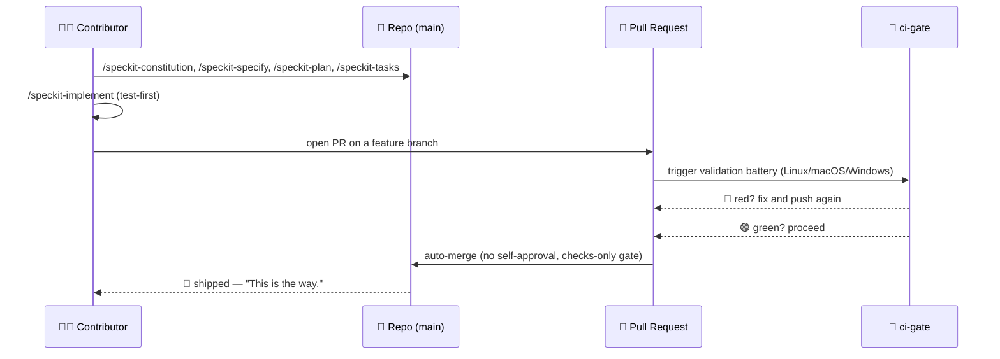
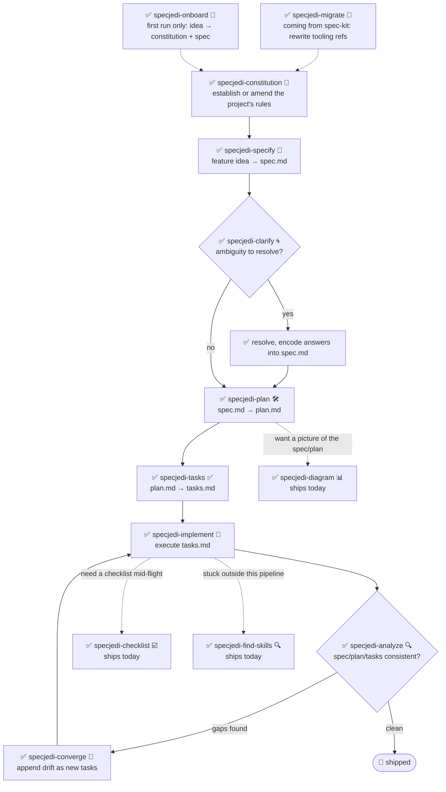

<!-- i18n-sync: source=README.md@4a3486c lang=bn -->
> 🌐 এই ডকুমেন্টটি AI-সহায়তায় অনূদিত। **ইংরেজি হলো প্রামাণিক উৎস**
> ([Principle I](../../../.specify/memory/constitution.md))；কোনো অসঙ্গতি
> থাকলে ইংরেজি সংস্করণ প্রাধান্য পাবে। অন্যান্য ভাষা দেখুন:
> [English](../../../README.md) · [中文](../zh/README.md) ·
> [हिन्दी](../hi/README.md) · [Español](../es/README.md) ·
> [Français](../fr/README.md) · [العربية](../ar/README.md) ·
> [বাংলা](../bn/README.md) · [Português](../pt/README.md) · [Русский](../ru/README.md) · [اردو](../ur/README.md) · [Bahasa Indonesia](../id/README.md)

# 🗡️ Spec Jedi

[](https://github.com/jonyfs/spec-jedi/actions/workflows/validate.yml)
[](../../../LICENSE)
[](../../../.specify/memory/constitution.md)
[](#আজ-আপনি-কী-পাচ্ছেন)
[](#আজ-আপনি-কী-পাচ্ছেন)
[](../../../references/skill-roadmap.md)
[](#ইনস্টলেশন)
[](../../../docs/i18n/)
[](../../../.specify/memory/constitution.md)
[](https://github.com/jonyfs/spec-jedi/commits/main)

> *"প্রথমে স্পেসিফিকেশন। তারপর কোড। এটাই পথ।"* — এক জ্ঞানী মাস্টার,
> সম্ভবত।

Spec Jedi হলো Spec-Driven Development (SDD) স্কিলের একটি সেট যা আপনি
আপনার পছন্দের কোডিং এজেন্টে ইনস্টল করেন। আগে কোড লিখে পরে ডকুমেন্ট করার
বদলে, আপনি একটি **constitution** 📜 (আপনার প্রজেক্টের অলঙ্ঘনীয় নিয়ম),
একটি **specification** 🎯 (আপনি কী তৈরি করছেন এবং কেন), একটি **plan**
🛠️ (কীভাবে, প্রযুক্তিগতভাবে), এবং একটি **task list** ✅ (ক্রমানুসারে
ধাপগুলো) লেখেন — এবং আপনার এজেন্ট প্রশিক্ষণ ফাঁকি দেওয়া কোনো Padawan-এর
মতো ইমপ্রোভাইজ না করে এই আর্টিফ্যাক্টগুলোর ভিত্তিতে বাস্তবায়ন করে।

এই রিপোজিটরি নিজেও একই শৃঙ্খলা মেনে তৈরি যা এটি সরবরাহ করে: এর নিজস্ব
[constitution](../../../.specify/memory/constitution.md) হলো প্রজেক্ট
কীভাবে আচরণ করে তার প্রামাণিক উৎস — রিলিজের ভার্সনিং এবং pull request
কীভাবে যাচাই ও মার্জ করা হয় তা-সহ। এখানে vibe-coding-এর অন্ধকার দিকে
যাওয়ার কোনো শর্টকাট নেই। 🚫🖤

*(এটি একটি অনানুষ্ঠানিক, ফ্যান-অনুপ্রাণিত ব্র্যান্ডিং — Spec Jedi
Lucasfilm/Disney-এর সাথে সংযুক্ত, অনুমোদিত বা স্পনসরকৃত নয়। Spec আপনার
সাথে থাকুক। 🌌)*

## এটি কাদের জন্য

যে কেউ AI কোডিং এজেন্ট ব্যবহার করেন এবং চান specs, plans, এবং tasks
ডিসপোজেবল চ্যাট মেসেজের বদলে ফার্স্ট-ক্লাস, ভার্সনযুক্ত আর্টিফ্যাক্ট
হোক — স্বাধীন ডেভেলপার, যেসব টিম তাদের এজেন্টদের কাজের ধরন
স্ট্যান্ডার্ডাইজ করছে, এবং প্রতিটি সেশনে প্রজেক্ট কনটেক্সট বারবার
ব্যাখ্যা করতে ক্লান্ত যে কেউ।

## আজ আপনি কী পাচ্ছেন

Spec Jedi হলো [spec-kit](https://github.com/github/spec-kit)-এর একটি
প্রকৃত **প্রতিযোগী**, এর থিম্যাটিক র‍্যাপার নয়
([Principle XV](../../../.specify/memory/constitution.md))। সম্পূর্ণ
`specjedi-*` SDD পাইপলাইন — constitution থেকে convergence পর্যন্ত —
**সম্পূর্ণ এবং প্রকাশিত**: সবগুলো ৯টি ধাপ,
[research.md](../../../specs/001-specjedi-pipeline/research.md)-এর
প্রতিযোগিতামূলক গবেষণা শৃঙ্খলা (Principle II) অনুসরণ করে একবারে একটি
করে যত্নসহকারে তৈরি, কখনো তাড়াহুড়ো না করে।

**আজই উপলব্ধ, এখনই ইনস্টল করে ব্যবহার করুন:**

| Skill | এটি কী করে |
|---|---|
| `specjedi-onboard` 🌱 | একদম নতুন প্রজেক্টের জন্য প্রথম-রান ওয়াকথ্রু — একসাথে একটি প্রকৃত প্রথম `constitution.md` এবং `spec.md` তৈরি করে, ঠিক যখন প্রয়োজন তখনই প্রতিটি SDD ধারণা শেখায়। onboarding ইতিমধ্যে হয়ে থাকলে সাথে সাথে সরে যায় |
| `specjedi-constitution` 📜 | একটি প্রজেক্টের অলঙ্ঘনীয় নিয়ম প্রতিষ্ঠা বা সংশোধন করে — যার বিপরীতে অন্য প্রতিটি `specjedi-*` স্কিল নিজেকে যাচাই করে। দেখুন [spec](../../../specs/001-specjedi-pipeline/spec.md) |
| `specjedi-specify` 🎯 | একটি ফিচার আইডিয়া — একটি বাক্যই যথেষ্ট — কে অগ্রাধিকারভিত্তিক, স্বতন্ত্রভাবে পরীক্ষাযোগ্য `spec.md`-এ রূপান্তরিত করে, অনুমান না করে প্রকৃত অস্পষ্টতা চিহ্নিত করে |
| `specjedi-clarify` 🌀 | একটি স্পেকে প্রকৃত অস্পষ্টতার জন্য স্ক্যান করে এবং সর্বোচ্চ ৫টি অগ্রাধিকারভিত্তিক প্রশ্ন করে — প্রতিটিতে একটি সুপারিশকৃত উত্তরসহ, যাতে নতুনরা দিকনির্দেশনা পায় আর অভিজ্ঞরা এক কথায় উত্তর দিতে পারেন — অনুমানের উপর পরিকল্পনা করার আগে |
| `specjedi-plan` 🛠️ | স্পষ্ট করা স্পেককে একটি প্রযুক্তিগত `plan.md`-এ রূপান্তরিত করে — প্রথমে বিদ্যমান কনভেনশনের জন্য আসল কোডবেস স্ক্যান করে, যাতে ইমপ্লিমেন্টেশনকে থেমে ইতিমধ্যে বিদ্যমান প্যাটার্ন খুঁজতে না হয় |
| `specjedi-tasks` ✅ | একটি পরিকল্পনাকে ক্রমানুসারে, ডিপেন্ডেন্সি-সচেতন `tasks.md`-এ ভেঙে ফেলে, ইউজার স্টোরি অনুসারে গ্রুপ করা — যেখানেই পরিকল্পনায় কোড প্রয়োজন, সেখানে ইমপ্লিমেন্টেশন টাস্কের আগে একটি ব্যর্থ টেস্ট টাস্ক সাজায় |
| `specjedi-implement` 🔨 | ডিপেন্ডেন্সি অনুসারে `tasks.md` কার্যকর করে, পরিকল্পনায় কোড প্রয়োজন হলে টেস্ট-প্রথম — শুধুমাত্র ফিচার ব্রাঞ্চ এবং pull request-এর মাধ্যমে কমিট করে, কখনো সরাসরি `main`-এ নয় |
| `specjedi-analyze` 🔍 | `spec.md`/`plan.md`/`tasks.md` (এবং constitution)-এর কঠোরভাবে শুধুমাত্র-পঠনযোগ্য ক্রস-চেক — ফাঁক, পুনরাবৃত্তি, এবং দ্বন্দ্বের জন্য — ফলাফল রিপোর্ট করে, কখনো কোনো ফাইল সম্পাদনা করে না |
| `specjedi-checklist` ☑️ | একটি নির্দিষ্ট ফোকাস এলাকার (নিরাপত্তা, অ্যাক্সেসিবিলিটি, পারফরম্যান্স...) জন্য একটি কাস্টম চেকলিস্ট তৈরি করে, সম্পূর্ণভাবে এই ফিচারের নিজস্ব `spec.md`/`plan.md`-এর উপর ভিত্তি করে — কখনো জেনেরিক বয়লারপ্লেট নয় |
| `specjedi-converge` 🔁 | ম্যানুয়াল পরিবর্তনের পর আসল কোডবেস এবং `tasks.md`-এর মধ্যে ড্রিফট শনাক্ত করে, নীরবে উপেক্ষা না করে যেকোনো ফাঁককে নতুন টাস্ক হিসেবে যুক্ত করে — `specjedi-implement`-এ ফিরে লুপ বন্ধ করে |
| `specjedi-find-skills` 🔍 | যখন আপনার অনুরোধ এমন একটি ডোমেইন স্পর্শ করে যা ইনস্টল করা সেট ভালোভাবে কভার করে না, তখন একটি নির্দিষ্ট, যাচাইকৃত স্কিল সুপারিশ করে — আগে না জিজ্ঞেস করে কখনো ইনস্টল করে না ([Principle XVII](../../../.specify/memory/constitution.md)) |
| `specjedi-explain` 🎓 | যেকোনো SDD ধারণা বা কমান্ড ব্যাখ্যা করে, আপনি কতটা অভিজ্ঞ শোনাচ্ছেন তার উপর ভিত্তি করে ক্যালিব্রেট করে — সম্পূর্ণ নতুন থেকে দৈনন্দিন অনুশীলনকারী পর্যন্ত, কখনো একই বাঁধাধরা উত্তর দেয় না ([Principle XIX](../../../.specify/memory/constitution.md)) |
| `specjedi-migrate` 🔄 | আপনার নিজের constitution/spec/plan/tasks-এ থাকা আক্ষরিক `/speckit-*` টুলিং রেফারেন্সগুলোকে তাদের `specjedi-*` সমতুল্যে পুনর্লিখন করে — কখনো নীতি বা প্রয়োজনীয়তার বিষয়বস্তু স্পর্শ করে না, শুধুমাত্র স্পষ্ট অনুরোধে |
| `specjedi-diagram` 📊 | একটি বিদ্যমান `spec.md`/`plan.md` থেকে রেন্ডার-ভেরিফায়েড Mermaid ডায়াগ্রাম তৈরি করে — সম্পূর্ণ Mermaid ক্যাটালগ থেকে সঠিক টাইপ বেছে (ফ্লোচার্ট, সিকোয়েন্স, ER, ক্লাস, স্টেট, Gantt, টাইমলাইন, ইউজার জার্নি, কানবান, মাইন্ডম্যাপ, কোয়াড্রেন্ট, পাই, এবং আরও) — সবসময় মূল প্রোজের পরিপূরক, কখনো প্রতিস্থাপন নয় |
| `specjedi-status` 🧭 | প্রজেক্ট-ব্যাপী ড্যাশবোর্ড যা প্রতিটি ফিচারের স্ট্যাটাস দেখায়, সম্পূর্ণভাবে ডিস্কে থাকা `spec.md`/`plan.md`/`tasks.md` আর্টিফ্যাক্ট থেকে উদ্ভূত — আলাদাভাবে রক্ষণাবেক্ষণকৃত কোনো ট্র্যাকিং সিস্টেম নেই, কখনো "স্থবির" কে সত্য হিসেবে দাবি করে না |
| `specjedi-retro` 🪞 | কঠোরভাবে শুধুমাত্র-পঠনযোগ্য রেট্রোস্পেক্টিভ যা একটি সম্পূর্ণ ফিচারের প্রকৃত ইমপ্লিমেন্টেশনকে তার `plan.md`-এর সাথে তুলনা করে — যেকোনো বিচ্যুতির কারণ প্রকৃত git ইতিহাসে ভিত্তি করে, কখনো একটি বানায় না, একটি স্থায়ী তারিখযুক্ত এন্ট্রি লগ করে |
| `specjedi-security` 🛡️ | auth/input validation/secrets/data-privacy ফাঁকের জন্য হালকা, সক্রিয় "আমরা কি X নিয়ে ভেবেছি" প্রম্পট — `specjedi-plan` দ্বারা স্ব-আহ্বানকৃত, কখনো সম্পূর্ণ নিরাপত্তা পর্যালোচনা হওয়ার দাবি করে না |
| `specjedi-docs` 📚 | একটি প্রকাশিত ফিচারের spec/plan থেকে README skill-table সারি, Quickstart ধাপ, এবং `CHANGELOG.md` এন্ট্রির খসড়া তৈরি করে — প্রকৃত বিষয়বস্তুর উপর ভিত্তি করে, লেখার আগে সবসময় নিশ্চিতকরণের জন্য দেখায় |
| `specjedi-new-skill` 🌟 | একটি নতুন `specjedi-*` স্কিলের ফাইল স্ট্রাকচার তৈরি করে — শুধুমাত্র প্লেসহোল্ডার, কখনো বানানো বিষয়বস্তু নয় — এই প্রজেক্টের নিজস্ব Skill Authoring Standard অনুসরণ করে এবং Principle II-এর গবেষণা চেকলিস্ট অন্তর্ভুক্ত করে |
| `specjedi-release` 🚀 | Spec Jedi-এর নিজস্ব কণ্ঠে `scripts/suggest-release.sh` মুড়ে দেয় — সর্বশেষ ট্যাগ, প্রস্তাবিত পরবর্তী ভার্সন, এবং অবদানকারী কমিট বর্ণনা করে; সত্যিই একটি রিলিজ কাটতে বলা হলে প্রত্যাখ্যান করে এবং ম্যানুয়াল কমান্ড নাম বলে |
| `specjedi-skill-review` 🎓 | একটি `specjedi-*` স্কিলের `SKILL.md`-কে Skill Authoring Standard-এর বিপরীতে কঠোরভাবে শুধুমাত্র-পঠনযোগ্য অডিট করে — শুধু হেডিং নয়, সেকশনের বিষয়বস্তু পরীক্ষা করে, বৈধ ছাড়ের জন্য মিলে যাওয়া `plan.md`-এর সাথে ক্রস-রেফারেন্স করে, ফলাফল বা একটি পরিষ্কার পাস রিপোর্ট করে, কখনো পর্যালোচিত ফাইল সম্পাদনা করে না |
| `specjedi-tokencheck` 🎒 | সক্রিয়ভাবে যাচাই করে `rtk` এবং `graphify` ইনস্টল করা আছে কি না, কী অনুপস্থিত এবং প্রত্যাশিত টোকেন সাশ্রয় ব্যাখ্যা করে, এবং একটি ইনস্টল ওয়াকথ্রু অফার করে — `specjedi-onboard`-এর প্রথম-রান প্রবাহ থেকে স্ব-আহ্বানকৃত, স্বতন্ত্রভাবেও চলে; স্পষ্ট নিশ্চিতকরণ ছাড়া কখনো কিছু ইনস্টল করে না |
| `specjedi-govcheck` ⚖️ | সমস্ত ২০টি constitution নীতির বিপরীতে কঠোরভাবে শুধুমাত্র-পঠনযোগ্য প্রতি-PR/প্রতি-ব্রাঞ্চ গভর্নেন্স চেকলিস্ট — তিন-অবস্থার রিপোর্ট (N/A / সঙ্গতিপূর্ণ / অসঙ্গতিপূর্ণ), যেকোনো দ্বন্দ্ব CRITICAL — একটি PR খোলার আগে `specjedi-implement` দ্বারা স্ব-আহ্বানকৃত (কখনো এটি ব্লক করে না), বর্তমান ব্রাঞ্চ বা একটি নামযুক্ত PR-এর বিপরীতেও স্বতন্ত্রভাবে চলে |

মূল পাইপলাইনের বাইরে কী প্রস্তাবিত (ডায়াগ্রাম, এবং আরও) তার জন্য দেখুন
[`references/skill-roadmap.md`](../../../references/skill-roadmap.md)
— এটি *অতিরিক্ত* স্কিলের একটি ব্যাকলগ, মূল পাইপলাইনের ফাঁক নয়; প্রতিটির
তৈরি হওয়ার আগে এখনও নিজস্ব গবেষণা প্রয়োজন।

## Spec Jedi কীভাবে কমিক আকারে *নিজেকে* তৈরি করে

> ⚠️ **এই বিভাগটি আমাদের অভ্যন্তরীণ bootstrap প্রক্রিয়া নিয়ে, Spec Jedi
> প্রোডাক্ট নিয়ে নয়।** নিচের `/speckit-*` কমান্ডগুলো
> [spec-kit](https://github.com/github/spec-kit)-এর নিজস্ব টুল — Spec
> Jedi বর্তমানে নিজেকে তৈরি করতে spec-kit ব্যবহার করে (একই "পুরনো
> কম্পাইলার দিয়ে নতুন কম্পাইলার বুটস্ট্র্যাপ করা" প্যাটার্ন), যেভাবে
> যেকোনো প্রতিযোগী তার প্রতিস্থাপন তৈরি করার সময় প্রতিষ্ঠিত কারো টুল
> ব্যবহার করতে পারে। **যদি আপনি Spec Jedi-কে একটি প্রোডাক্ট হিসেবে
> মূল্যায়ন করছেন, নিচের
> [আজ আপনি কী পাচ্ছেন](#আজ-আপনি-কী-পাচ্ছেন)-এ সরাসরি যান** — প্রকৃত
> প্রোডাক্ট সারফেস হলো `specjedi-*` স্কিল, এগুলো নয়। কেন এগুলো স্পষ্টভাবে
> আলাদা রাখা হয়েছে তার সম্পূর্ণ নীতির জন্য দেখুন
> [Principle XV](../../../.specify/memory/constitution.md)।
>
> এছাড়াও, ফরম্যাট নিয়ে একটি নোট: এগুলো টেক্সট-এবং-ইমোজি কমিক প্যানেল,
> জেনারেটেড আর্টওয়ার্ক নয়। প্রকৃত Star Wars চিত্র (চরিত্র, জাহাজ, লোগো)
> Lucasfilm/Disney-এর মেধাসম্পত্তি — এই প্রজেক্টের নিজস্ব
> [Principle XII](../../../.specify/memory/constitution.md) শুধুমাত্র
> টেক্সট রেফারেন্স ব্যবহারের প্রতিশ্রুতি দেয়, কপিরাইটযুক্ত আর্ট কখনো
> পুনরুৎপাদন করে না। তাই: গল্পের মুহূর্তগুলো বাস্তব, প্যানেলগুলো
> Markdown। 🖋️

---

**প্যানেল ১ — একটি নিঃসঙ্গ টার্মিনাল, কার্সার জ্বলছে।**
> 🧑‍💻 *"আমার একটা ফিচার আইডিয়া আছে। ...এখন কী?"*

**প্যানেল ২ — ছায়া থেকে একটি হুডপরা মূর্তি বেরিয়ে আসে, হাতে একটি স্ক্রল।**
> 🧙 *"প্রথমে, বিধান।"* 📜
> `/speckit-constitution` — প্রজেক্টের অলঙ্ঘনীয় নিয়ম, একবার লেখা,
> তারপর চিরকাল যাচাই করা হয়।

**প্যানেল ৩ — আইডিয়াটি দেয়ালে পিন করা, প্রশ্নবোধক চিহ্ন এর চারপাশে ঘুরছে।**
> 🌀 *"আপনি আসলে কী তৈরি করছেন — এবং কার জন্য?"*
> `/speckit-specify` আইডিয়াকে `spec.md`-এ রূপান্তর করে। `/speckit-clarify`
> অস্পষ্টতা বাগ হয়ে যাওয়ার আগেই তা খুঁজে বের করে।

**প্যানেল ৪ — একটি কর্মক্ষেত্রে একটি ব্লুপ্রিন্ট খুলে যায়।**
> 🛠️ *"এখন কীভাবে।"*
> `/speckit-plan` → `plan.md`। `/speckit-tasks` → একটি ক্রমানুসারে,
> ডিপেন্ডেন্সি-সচেতন `tasks.md`। কোনো ধাপ বাদ যায় না, কোনো ধাপ
> বিশৃঙ্খল নয়।

**প্যানেল ৫ — টুলগুলো গুনগুন করছে, টেস্ট লাল হয়ে ব্যর্থ হচ্ছে, তারপর একে একে সবুজ হয়ে যাচ্ছে।**
> 🤖 *"প্রথমে টেস্ট। সবসময় প্রথমে টেস্ট।"*
> `/speckit-implement` `tasks.md` কার্যকর করে, যেখানে প্রযোজ্য সেখানে
> টেস্ট-প্রথম ([Principle VI](../../../.specify/memory/constitution.md))।

**প্যানেল ৬ — একটি কাউন্সিল চেম্বার। একটি pull request বেঞ্চের সামনে দাঁড়িয়ে আছে।**
> 🏛️ *"আপনার পরিবর্তনগুলো বলুন।"*
> একটি PR খোলে। `ci-gate` 🤖 সম্পূর্ণ validation battery চালায় — প্রতিটি
> OS, প্রতিটি চেক। স্ব-অনুমোদনের অনুমতি নেই; মেশিন নিজেকে ক্ষমা করতে
> পারে না, এবং আপনিও না
> ([Principle X](../../../.specify/memory/constitution.md))।

**প্যানেল ৭ — সবুজ আলো। গেট নিজে থেকেই খুলে যায়।**
> ✅ *"battery কথা বলেছে।"*
> সমস্ত চেক পাস হয় → অটো-মার্জ, কোনো মানুষকে বাটনে ক্লিক করতে হয়নি।

**প্যানেল ৮ — একটি জাহাজ হাইপারস্পেসে লাফ দেয়।**
> 🚀 *"প্রকাশিত।"*
> 🌌 *"Spec আপনার সাথে থাকুক।"*

### একই অভ্যন্তরীণ-bootstrap গল্প, একটি ডায়াগ্রাম হিসেবে



## পূর্বশর্ত

Spec Jedi **Linux, macOS, এবং Windows**-এ ডেভেলপ ও যাচাই করা হয়
(Constitution [Principle XIII](../../../.specify/memory/constitution.md))
— `scripts/`-এর অধীনে প্রতিটি স্ক্রিপ্ট POSIX shell (`.sh`) এবং নেটিভ
PowerShell (`.ps1`) উভয় সংস্করণে প্রকাশিত হয়, এবং CI প্রতিটি PR-এ তিনটি
অপারেটিং সিস্টেমেই battery চালায়।

- `git`
- একটি সমর্থিত কোডিং এজেন্ট (নিচে
  [সমর্থিত হার্নেস](#সমর্থিত-হার্নেস) দেখুন)
- [GitHub CLI (`gh`)](https://cli.github.com/), শুধুমাত্র যদি আপনি
  pull request-এর মাধ্যমে পরিবর্তন অবদান রাখার পরিকল্পনা করেন
- শুধুমাত্র যদি আপনি স্থানীয়ভাবে হেল্পার স্ক্রিপ্ট চালাতে চান (ঐচ্ছিক
  — কোডিং এজেন্টের নিজেরই এগুলোর প্রয়োজন নেই): একটি POSIX shell
  (bash/zsh, Linux এবং macOS-এ ডিফল্টভাবে উপস্থিত) **অথবা**
  [PowerShell 7+](https://aka.ms/powershell) (`pwsh`), যা তিনটি
  অপারেটিং সিস্টেমেই চলে

## ইনস্টলেশন

### Claude Code (আজ সম্পূর্ণভাবে সমর্থিত)

ক্লোন ধাপটি OS অনুসারে সামান্য ভিন্ন; এরপর সবকিছু অভিন্ন।

**Linux / macOS** (টার্মিনাল):

```bash
git clone https://github.com/jonyfs/spec-jedi.git
cd spec-jedi
```

**Windows — নেটিভ PowerShell** (WSL প্রয়োজন নেই):

```powershell
git clone https://github.com/jonyfs/spec-jedi.git
cd spec-jedi
```

**Windows — WSL বা Git Bash** (যদি আপনি Windows-এ Unix-এর মতো shell
পছন্দ করেন):

```bash
git clone https://github.com/jonyfs/spec-jedi.git
cd spec-jedi
```

দুটি Windows পথই সমানভাবে ভালো কাজ করে — যেটা আপনি প্রতিদিন ব্যবহার করেন
সেটাই বেছে নিন। এরপর একমাত্র যা গুরুত্বপূর্ণ তা হলো আপনি কোন হেল্পার
স্ক্রিপ্ট চালাচ্ছেন (POSIX shell-এ `scripts/*.sh`, নেটিভ PowerShell-এ
`scripts/*.ps1`); স্কিলগুলো নিজেরা উভয় ক্ষেত্রেই অভিন্নভাবে কাজ করে।

1. আপনার OS-এর জন্য উপরের ব্লক ব্যবহার করে রিপোজিটরি ক্লোন করুন।

2. [Claude Code](https://claude.com/claude-code)-এ ফোল্ডারটি খুলুন।
   Claude Code স্বয়ংক্রিয়ভাবে `.claude/skills/*/SKILL.md`-এর অধীনে
   প্রতিটি স্কিল আবিষ্কার করে — কোনো আলাদা ইনস্টল ধাপ বা বিল্ড প্রক্রিয়া
   নেই, এবং এই ধাপটি তিনটি অপারেটিং সিস্টেমেই অভিন্ন।

3. Claude Code প্রম্পটে `/` টাইপ করে নিশ্চিত করুন স্কিলগুলো লোড হয়েছে।
   আপনি সমস্ত ২৩টি `specjedi-*` প্রোডাক্ট স্কিল এবং `speckit-*` কমান্ড
   (এই রিপোজিটরির নিজস্ব অভ্যন্তরীণ bootstrap টুলিং — দেখুন
   [আজ আপনি কী পাচ্ছেন](#আজ-আপনি-কী-পাচ্ছেন)) একসাথে তালিকাভুক্ত দেখতে
   পাবেন, কারণ Claude Code দুটির মধ্যে পার্থক্য না করে
   `.claude/skills/`-এর অধীনে প্রতিটি স্কিল আবিষ্কার করে।

4. এটাই — এখন আপনি একটি গাইডেড প্রথম রানের জন্য `specjedi-onboard`
   চালাতে প্রস্তুত, কোথা থেকে শুরু করবেন নিশ্চিত না হলে
   `specjedi-explain`-কে যেকোনো কিছু জিজ্ঞাসা করতে পারেন, বা বাকি
   পাইপলাইন কোন দিকে যাচ্ছে তা বুঝতে constitution পড়তে পারেন।

**এই প্রজেক্ট ছাড়া অন্য কোনো প্রজেক্টে Spec Jedi ব্যবহার করছেন?**
ইনস্টলার চালান (Constitution
[Principle XVIII](../../../.specify/memory/constitution.md)) — এটি
শুধুমাত্র `specjedi-*` প্রোডাক্ট স্কিল কপি করে, কখনো `speckit-*`
bootstrap টুলিং নয়, সেই স্কিলগুলোর প্রয়োজনীয় চারটি
`.specify/templates/*.md` ফাইল-সহ, এবং শেষ করার আগে ফলাফল যাচাই করে:

```bash
# একটি Spec Jedi checkout থেকে, ডিস্কের অন্য একটি প্রজেক্টকে লক্ষ্য করে
./scripts/install.sh /path/to/your-project
```

```powershell
# Windows নেটিভ PowerShell
.\scripts\install.ps1 -TargetDir C:\path\to\your-project
```

আজ শুধুমাত্র `-harness claude-code` (ডিফল্ট) তৈরি এবং পরীক্ষিত; অন্য
যেকোনো মান নীরবে চেষ্টা করার বদলে এখনো-সমর্থিত-নয় হিসেবে রিপোর্ট করা
হয় — নিচে [সমর্থিত হার্নেস](#সমর্থিত-হার্নেস) দেখুন। সম্পূর্ণ অপশন
তালিকার জন্য `./scripts/install.sh --help` (বা
`.\scripts\install.ps1 -Help`) চালান।

### সমর্থিত হার্নেস

Spec Jedi-এর constitution
([Principle III](../../../.specify/memory/constitution.md)) এই
প্রজেক্টকে অবশেষে বাজারের সবচেয়ে বেশি ব্যবহৃত বিশটি LLM কোডিং
টুল/হার্নেস সমর্থন করতে প্রতিশ্রুতিবদ্ধ করে। আজ, শুধুমাত্র উপরের পথটি
(Claude Code) সম্পূর্ণভাবে তৈরি, পরীক্ষিত এবং ডকুমেন্টেড।

| হার্নেস | স্ট্যাটাস |
|---|---|
| Claude Code | ✅ সমর্থিত — উপরের ধাপগুলো দেখুন |
| Cursor | 📋 পরিকল্পিত — এখনো ইনস্টলযোগ্য নয় |
| GitHub Copilot (Chat/Workspace) | 📋 পরিকল্পিত — এখনো ইনস্টলযোগ্য নয় |
| Codex CLI (OpenAI) | 📋 পরিকল্পিত — এখনো ইনস্টলযোগ্য নয় |
| Gemini CLI | 📋 পরিকল্পিত — এখনো ইনস্টলযোগ্য নয় |
| Antigravity (Google) | 📋 পরিকল্পিত — এখনো ইনস্টলযোগ্য নয় |
| Windsurf (Codeium) | 📋 পরিকল্পিত — এখনো ইনস্টলযোগ্য নয় |
| Cline | 📋 পরিকল্পিত — এখনো ইনস্টলযোগ্য নয় |
| Continue | 📋 পরিকল্পিত — এখনো ইনস্টলযোগ্য নয় |
| Aider | 📋 পরিকল্পিত — এখনো ইনস্টলযোগ্য নয় |
| Amazon Q Developer | 📋 পরিকল্পিত — এখনো ইনস্টলযোগ্য নয় |
| JetBrains AI Assistant | 📋 পরিকল্পিত — এখনো ইনস্টলযোগ্য নয় |
| Zed | 📋 পরিকল্পিত — এখনো ইনস্টলযোগ্য নয় |
| OpenCode | 📋 পরিকল্পিত — এখনো ইনস্টলযোগ্য নয় |
| Warp (Agent Mode) | 📋 পরিকল্পিত — এখনো ইনস্টলযোগ্য নয় |
| Replit Agent | 📋 পরিকল্পিত — এখনো ইনস্টলযোগ্য নয় |
| Devin (Cognition) | 📋 পরিকল্পিত — এখনো ইনস্টলযোগ্য নয় |
| Tabnine | 📋 পরিকল্পিত — এখনো ইনস্টলযোগ্য নয় |
| Sourcegraph Cody | 📋 পরিকল্পিত — এখনো ইনস্টলযোগ্য নয় |
| Trae | 📋 পরিকল্পিত — এখনো ইনস্টলযোগ্য নয় |

Principle III-এর "কমপক্ষে বিশ"-এর আদেশ অনুসারে বিশটি হার্নেস আলাদাভাবে
নামকরণ করা হয়েছে — শুধুমাত্র স্ট্যাটাস (✅ সমর্থিত / 📋 পরিকল্পিত), এই
প্রজেক্ট প্রকৃতপক্ষে তৈরি ও পরীক্ষা করেনি এমন কোনো হার্নেসের জন্য কোনো
ক্ষমতার দাবি নেই, Principle XX-এর হ্যালুসিনেশন-প্রতিরোধ শৃঙ্খলা অনুসারে।
"পরিকল্পিত" একটি স্ট্যাটাস, প্রতিশ্রুত রোডম্যাপ তারিখ নয়।

যদি আপনার হার্নেস এখনো সমর্থিত হিসেবে তালিকাভুক্ত না থাকে, `SKILL.md`
ফাইলগুলো YAML frontmatter-সহ সাধারণ Markdown — অনেক হার্নেস যা কাস্টম
নির্দেশনা/প্রম্পট সমর্থন করে সেগুলো একটি ডেডিকেটেড ইনস্টল পথ ছাড়াও
সরাসরি পড়তে পারে, কিন্তু এটি এখনো প্রতিটি হার্নেসের জন্য আলাদাভাবে
যাচাই বা ডকুমেন্ট করা হয়নি। প্রতিটি হার্নেসের ডেস্ক-রিসার্চ ক্যাপাবিলিটি
নোটের জন্য দেখুন
[`references/harness-capability-notes.md`](../../../references/harness-capability-notes.md)।

জানতে আগ্রহী Spec Jedi, spec-kit এবং যে আরও দশটি SDD টুলের বিপরীতে এটি
বেঞ্চমার্ক করা হয়েছে সেগুলোর সাথে কেমন তুলনীয়? দেখুন
[`references/competitive-comparison.md`](../../../references/competitive-comparison.md)।

## দ্রুত শুরু

আজ তেইশটি প্রোডাক্ট স্কিল উপলব্ধ
([আজ আপনি কী পাচ্ছেন](#আজ-আপনি-কী-পাচ্ছেন)) — সম্পূর্ণ `specjedi-*`
পাইপলাইন সম্পূর্ণ। কখনো SDD টুল ব্যবহার করেননি? ধাপ ০ থেকে শুরু করুন।

0. **নিশ্চিত নন এসবের মানে কী?** শুধু জিজ্ঞাসা করুন — "একটি spec কী এবং
   কেন আমার এটি প্রয়োজন হবে", "এই প্রজেক্ট আসলে কী করে।"
   `specjedi-explain` 🎓 আপনার প্রয়োজনীয় গভীরতায় উত্তর দেয়, নতুন হোক বা
   অভিজ্ঞ, এবং সবসময় পরবর্তী কী চালাতে হবে তা নির্দেশ করে
   ([Principle XIX](../../../.specify/memory/constitution.md))।
1. ইনস্টল করুন (উপরে [ইনস্টলেশন](#ইনস্টলেশন) দেখুন)।
2. একদম নতুন প্রজেক্ট, কোথা থেকে শুরু করবেন কোনো ধারণা নেই?
   `specjedi-onboard` 🌱 একটি এক-বাক্যের আইডিয়া থেকে একসাথে একটি প্রকৃত
   প্রথম `constitution.md` এবং `spec.md` তৈরি করতে আপনাকে গাইড করে,
   শুধুমাত্র যখন আপনার প্রকৃতপক্ষে প্রয়োজন তখনই প্রতিটি ধারণা ব্যাখ্যা
   করে — শুরুতে কখনো ডকুমেন্টেশনের দেয়াল নয়। (নিচের ধাপ ৩-৪ ঠিক এটাই
   যা এটি আপনার জন্য অর্কেস্ট্রেট করে; আপনি নিজে প্রতিটি ধাপ চালাতে
   চাইলে সরাসরি সেগুলোতে যান।)
3. আপনার প্রজেক্টের নিয়ম প্রতিষ্ঠা করুন: সহজ ভাষায় আপনার
   অলঙ্ঘনীয়গুলো বর্ণনা করুন এবং `specjedi-constitution` 📜 একটি
   ভার্সনযুক্ত `.specify/memory/constitution.md` তৈরি করে — অন্য প্রতিটি
   `specjedi-*` স্কিল এর নিজস্ব আউটপুট এর বিপরীতে যাচাই করে।
4. একটি ফিচার স্পেসিফাই করুন: আপনি কী তৈরি করতে চান তা বর্ণনা করুন —
   একটি মোটামুটি এক-বাক্যের আইডিয়াই যথেষ্ট — এবং `specjedi-specify`
   🎯 এটিকে অগ্রাধিকারভিত্তিক, স্বতন্ত্রভাবে পরীক্ষাযোগ্য `spec.md`-এ
   রূপান্তরিত করে, অনুমান না করে প্রকৃত অস্পষ্টতা চিহ্নিত করে।
5. নিশ্চিত নন স্পেকটি এখনো শক্তিশালী কি না? `specjedi-clarify` 🌀
   প্রকৃত অস্পষ্টতার জন্য এটি স্ক্যান করে এবং সর্বোচ্চ ৫টি
   অগ্রাধিকারভিত্তিক প্রশ্ন করে — প্রতিটিতে একটি সুপারিশকৃত উত্তরসহ,
   যাতে আপনি এক কথায় এটি গ্রহণ করতে পারেন বা চাইলে যুক্তি পড়তে পারেন
   — অনুমানের উপর পরিকল্পনা করার আগে।
6. "কীভাবে" ডিজাইন করতে প্রস্তুত? `specjedi-plan` 🛠️ প্রথমে বিদ্যমান
   কনভেনশনের জন্য আপনার আসল কোডবেস স্ক্যান করে, তারপর স্পষ্ট করা স্পেককে
   একটি প্রযুক্তিগত `plan.md`-এ রূপান্তরিত করে — যাতে ইমপ্লিমেন্টেশনকে
   কখনো থেমে আপনার প্রজেক্টের অন্য কোথাও ইতিমধ্যে বিদ্যমান প্যাটার্ন
   খুঁজতে না হয়। যদি আপনার স্পেক auth, বাহ্যিক ইনপুট, secrets, বা ডেটা
   হ্যান্ডলিং স্পর্শ করে, `specjedi-security` 🛡️ স্বয়ংক্রিয়ভাবে কিছু
   লক্ষ্যযুক্ত "আমরা কি X নিয়ে ভেবেছি" প্রশ্নসহ ট্রিগার হয় — একটি হালকা
   প্রম্পট, কখনো সম্পূর্ণ নিরাপত্তা পর্যালোচনা নয়।
7. এটিকে কাজে ভাঙতে প্রস্তুত? `specjedi-tasks` ✅ পরিকল্পনাকে একটি
   ক্রমানুসারে, ডিপেন্ডেন্সি-সচেতন, ইউজার স্টোরি অনুসারে গ্রুপ করা
   `tasks.md`-এ রূপান্তরিত করে — যেখানেই পরিকল্পনায় কোড প্রয়োজন, সেখানে
   ইমপ্লিমেন্টেশন টাস্কের আগে একটি ব্যর্থ টেস্ট টাস্ক সাজায়।
8. এটি তৈরি করতে প্রস্তুত? `specjedi-implement` 🔨 ডিপেন্ডেন্সি অনুসারে
   `tasks.md` কার্যকর করে, পরিকল্পনায় কোড প্রয়োজন হলে টেস্ট-প্রথম —
   প্রতিটি কমিট একটি ফিচার ব্রাঞ্চ এবং pull request-এ অবতরণ করে, কখনো
   সরাসরি `main`-এ নয়।
9. একটি সুরক্ষা জাল চান? `specjedi-analyze` 🔍 `spec.md`, `plan.md`,
   এবং `tasks.md` (এবং আপনার constitution) ক্রস-চেক করে ফাঁক,
   পুনরাবৃত্তি, বা দ্বন্দ্বের জন্য — কঠোরভাবে শুধুমাত্র-পঠনযোগ্য,
   যেকোনো সময় চালানো যায়, কখনো কোনো ফাইল সম্পাদনা করে না।
10. একটি লক্ষ্যযুক্ত পর্যালোচনা প্রয়োজন? `specjedi-checklist` ☑️ একটি
    নির্দিষ্ট ফোকাস এলাকার জন্য একটি চেকলিস্ট তৈরি করে — নিরাপত্তা,
    অ্যাক্সেসিবিলিটি, পারফরম্যান্স, যা আপনি নাম দেন — সম্পূর্ণভাবে এই
    ফিচারের নিজস্ব spec/plan-এর উপর ভিত্তি করে, কখনো জেনেরিক
    বয়লারপ্লেট নয়।
11. আপনার শেষ `tasks.md`-এর পর হাতে কোড পরিবর্তন করেছেন?
    `specjedi-converge` 🔁 আসল কোডবেস স্ক্যান করে, সংশ্লিষ্ট টাস্ক ছাড়া
    যেকোনো ক্ষমতা শনাক্ত করে, এবং নীরবে ড্রিফট হতে না দিয়ে এটিকে নতুন
    কাজ হিসেবে যুক্ত করে — পাইপলাইনের শেষ ধাপ, `specjedi-implement`-এ
    ফিরে লুপ বন্ধ করে।
12. এই সেটের বাইরে কিছুতে আটকে গেছেন? শুধু এটি বর্ণনা করুন — "আমি কীভাবে
    X করব", "X-এর জন্য কি কোনো স্কিল আছে" — এবং `specjedi-find-skills`
    🔍 স্বয়ংক্রিয়ভাবে ট্রিগার হয়, ওপেন agent-skills ইকোসিস্টেমে খোঁজে,
    এবং একটি নির্দিষ্ট, যাচাইকৃত স্কিল সুপারিশ করে। আগে না জিজ্ঞেস করে
    কখনো কিছু ইনস্টল করে না
    ([Principle VIII](../../../.specify/memory/constitution.md))।
13. একটি বিদ্যমান spec-kit প্রজেক্ট থেকে আসছেন? `specjedi-migrate` 🔄
    আপনার নিজের প্রজেক্টের `/speckit-*` টুলিং রেফারেন্সগুলোকে তাদের
    `specjedi-*` সমতুল্যে পুনর্লিখন করে — কখনো কোনো নীতি বা প্রয়োজনীয়তা
    স্পর্শ করে না, শুধুমাত্র স্পষ্ট অনুরোধে।
14. প্রোজের দেয়ালের বদলে একটি ছবি চান? `specjedi-diagram` 📊 একটি স্পেক
    বা পরিকল্পনাকে একটি রেন্ডার-ভেরিফায়েড Mermaid ডায়াগ্রামে রূপান্তরিত
    করে — সম্পূর্ণ ক্যাটালগ থেকে টাইপ বেছে (দেখুন
    [`references/mermaid-diagram-catalog.md`](../../../references/mermaid-diagram-catalog.md))
    প্রকৃত বিষয়বস্তু যা দাবি করে তা অনুযায়ী — সবসময় মূল প্রোজের পাশে,
    কখনো তার জায়গায় নয়।
15. একের বা দুইয়ের বেশি ফিচার সামলাচ্ছেন? `specjedi-status` 🧭 একটি
    প্রজেক্ট-ব্যাপী ড্যাশবোর্ড দেখায় — কোন ফিচারগুলো স্পেসিফাই করা,
    পরিকল্পিত, চলমান, বা সম্পূর্ণ — সম্পূর্ণভাবে ডিস্কে প্রকৃতপক্ষে যা
    আছে তা থেকে উদ্ভূত, সিঙ্কে রাখার জন্য কোনো আলাদা ট্র্যাকিং সিস্টেম
    নেই।
16. সবেমাত্র একটি ফিচার শেষ করেছেন? `specjedi-retro` 🪞 প্রকৃতপক্ষে যা
    প্রকাশিত হয়েছে তার সাথে `plan.md` যা বলেছিল তার তুলনা করে, প্রকৃত
    git ইতিহাসে যেকোনো বিচ্যুতির কারণ ভিত্তি করে — কখনো একটি বানায় না
    — এবং একটি স্থায়ী এন্ট্রি লগ করে যাতে সংকেতটি এই কথোপকথনের পরেও
    টিকে থাকে।
17. কিছু প্রকাশ করেছেন এবং এটি ডকুমেন্ট করা প্রয়োজন? `specjedi-docs`
    📚 আপনার জন্য README সারি, Quickstart ধাপ, এবং `CHANGELOG.md`
    এন্ট্রির খসড়া তৈরি করে — আপনার প্রকৃত spec/plan-এর উপর ভিত্তি করে,
    কিছু লেখার আগে সবসময় নিশ্চিতকরণের জন্য দেখায়।
18. একটি নতুন স্কিল দিয়ে Spec Jedi নিজেকে সম্প্রসারিত করছেন?
    `specjedi-new-skill` 🌟 ফাইল স্ট্রাকচার তৈরি করে — `specs/`,
    `SKILL.md` কাঠামো, প্রতিটি সেকশন একটি লেবেলযুক্ত প্লেসহোল্ডার —
    আপনার পক্ষে কখনো গবেষণার ফলাফল বা আচরণ বানায় না।
19. একটি রিলিজ প্রয়োজন কি না ভাবছেন? `specjedi-release` 🚀
    `scripts/suggest-release.sh`-এর নিজস্ব পরামর্শ বর্ণনা করে — সর্বশেষ
    ট্যাগ, পরবর্তী ভার্সন, অবদানকারী কমিট — এবং সত্যিই একটি কাটতে বলা
    হলে সঠিক ম্যানুয়াল কমান্ডসহ প্রত্যাখ্যান করে; নিজে কখনো ট্যাগ বা
    প্রকাশ করে না।
20. হাতে একটি `specjedi-*` স্কিল লিখেছেন বা পরিবর্তন করেছেন?
    `specjedi-skill-review` 🎓 এর `SKILL.md` Skill Authoring
    Standard-এর বিপরীতে যাচাই করে — শুধু হেডিং নয়, সেকশনের বিষয়বস্তু,
    বৈধ ছাড়ের জন্য মিলে যাওয়া `plan.md`-এর সাথে ক্রস-রেফারেন্সড — এবং
    ফলাফল বা একটি পরিষ্কার পাস রিপোর্ট করে; ফাইলটি নিজে কখনো সম্পাদনা
    করে না।
21. `specjedi-onboard` প্রথম ব্যবহারে ইতিমধ্যে একবার আপনার জন্য এটি
    চালায়, কিন্তু `specjedi-tokencheck` 🎒 স্বতন্ত্রভাবেও কাজ করে —
    `rtk` এবং `graphify` ইনস্টল করা আছে কি না যাচাই করে, কী অনুপস্থিত
    এবং প্রত্যাশিত টোকেন সাশ্রয় ব্যাখ্যা করে, এবং ইনস্টলেশনে আপনাকে
    গাইড করার প্রস্তাব দেয়; আপনার স্পষ্ট সম্মতি ছাড়া কখনো কিছু ইনস্টল
    করে না।
22. `specjedi-implement` প্রতিটি PR খোলার আগে ইতিমধ্যে এটি চালায়,
    কিন্তু `specjedi-govcheck` ⚖️ স্বতন্ত্রভাবেও কাজ করে — ২০টি
    constitution নীতির বিপরীতে প্রতি-ব্রাঞ্চ (বা PR) চেকলিস্ট, প্রতিটিকে
    প্রযোজ্য নয়, সঙ্গতিপূর্ণ, বা অসঙ্গতিপূর্ণ হিসেবে রিপোর্ট করে,
    যেকোনো প্রকৃত দ্বন্দ্বকে CRITICAL চিহ্নিত করে; কঠোরভাবে
    শুধুমাত্র-পঠনযোগ্য, কখনো কিছু সম্পাদনা করে না, কখনো নিজে থেকে PR
    খোলা ব্লক করে না।

[Principle XIV](../../../.specify/memory/constitution.md) অনুসারে, আপনি
সবেমাত্র যা চালিয়েছেন তা আপনাকে বলা উচিত পরবর্তী কী চালাতে হবে — এটি
জানতে আপনার এই তালিকায় ফিরে আসার প্রয়োজন হওয়া উচিত নয়। সম্পূর্ণ চেইন
`specjedi-onboard` (শুধুমাত্র প্রথম রান) → `specjedi-constitution` →
`specjedi-specify` → `specjedi-clarify` → `specjedi-plan` →
`specjedi-tasks` → `specjedi-implement` → `specjedi-analyze` →
`specjedi-checklist` → `specjedi-converge` চালায়, যখনই
`specjedi-converge` কাজ করার মতো ড্রিফট খুঁজে পায় তখন
`specjedi-implement`-এ ফিরে লুপ করে।

### পাইপলাইন, শুরু থেকে শেষ পর্যন্ত

Onboarding থেকে convergence পর্যন্ত — নিচের প্রতিটি ধাপ লাইভ:



✅ = আজ উপলব্ধ — সম্পূর্ণ ৯-ধাপের `specjedi-*` পাইপলাইন সম্পূর্ণ, সাথে
`specjedi-onboard` একটি গাইডেড প্রথম-রান এন্ট্রি পয়েন্ট হিসেবে।

## প্রস্তাবিত সঙ্গী

এই প্রজেক্টের constitution
([Principle VIII](../../../.specify/memory/constitution.md)) প্রতিটি
Spec Jedi সেশনকে সক্রিয়ভাবে সুপারিশ করতে নির্দেশ দেয়, কিন্তু কখনো নীরবে
ইনস্টল না করতে, দুটি টোকেন-সাশ্রয়কারী সঙ্গী:

- [`rtk`](https://github.com/rtk-ai/rtk) — সাধারণ ডেভ অপারেশনের জন্য
  একটি টোকেন-অপ্টিমাইজড CLI প্রক্সি।
- [`graphify`](https://graphify.net/) — একটি কোডবেসকে একটি
  জিজ্ঞাসাযোগ্য নলেজ গ্রাফে রূপান্তরিত করে।

যদি আপনার এজেন্ট এই দুটির যেকোনো একটি ইনস্টল বা কনফিগার করার প্রস্তাব
দেয়, তাহলে সেটি এই নীতির কার্যকারিতা — আপনাকে সবসময় আগে জিজ্ঞাসা করা
হয়।

**graphify ইতিমধ্যে এই রিপোজিটরিতে সংযুক্ত** (মেইনটেইনারের
নিশ্চিতকরণসহ): `CLAUDE.md`-এর একটি `## graphify` বিভাগ Claude Code-কে
সোর্স ব্রাউজ করার আগে নলেজ গ্রাফ পরামর্শ করতে এবং কোড পরিবর্তনের পরে
এটি রিফ্রেশ করতে বলে, এবং `.claude/settings.json` হুক নিবন্ধন করে যা
গ্রাফ বিদ্যমান থাকলে raw grep/read-এর বদলে টুল কলগুলোকে `graphify
query`/`explain`/`path`-এর দিকে ঠেলে দেয়। গ্রাফ নিজেই
(`graphify-out/`) কমিট করা হয় না — এটি একটি ডেরিভড ক্যাশে, প্রতি
ক্লোনে পুনরায় তৈরি হয়।

ক্লোন করার পরে স্থানীয়ভাবে একই স্বয়ংক্রিয়-আপডেট আচরণ পেতে:

```bash
pip install graphifyy   # অথবা: uv tool install graphifyy
graphify .               # প্রথম বিল্ড (শুধুমাত্র একবার প্রয়োজন; প্রথম ব্যবহারেও যাইহোক স্বয়ংক্রিয়ভাবে চলে)
graphify hook install    # প্রতিটি কমিটের পরে স্বয়ংক্রিয়ভাবে graph.json পুনর্নির্মাণ করে (কোড পরিবর্তন)
```

ডক/বিষয়বস্তু পরিবর্তন কমিট হুক দ্বারা ধরা পড়ে না — নন-কোড ফাইল সম্পাদনা
করার পরে `graphify update .` চালান (বা কেবল আপনার এজেন্টকে বলুন)।

## ভার্সনিং এবং রিলিজ

Spec Jedi তার নিজস্ব রিলিজের জন্য
[Semantic Versioning](https://semver.org/) অনুসরণ করে, পাবলিক
স্কিল-প্যাকেজ চুক্তিতে সীমাবদ্ধ (একটি স্কিলের আচরণ ভাঙা = MAJOR, নতুন
স্কিল বা সংযোজনমূলক ক্ষমতা = MINOR, ফিক্স/ডক্স = PATCH)। সম্পূর্ণ
নীতির জন্য [Principle XI](../../../.specify/memory/constitution.md)
দেখুন।

প্রজেক্ট নীরবে একটি কাটার বদলে কখন একটি রিলিজ যুক্তিসঙ্গত তা সুপারিশ
করে:

```bash
# Linux / macOS / Windows (WSL বা Git Bash)
./scripts/suggest-release.sh
```

```powershell
# Windows (নেটিভ PowerShell)
./scripts/suggest-release.ps1
```

এটি সর্বশেষ ট্যাগের পর থেকে কমিটগুলো পরীক্ষা করে এবং একটি পরবর্তী
ভার্সন সুপারিশ করে — এটি নিজে কখনো কিছু ট্যাগ বা প্রকাশ করে না। প্রকৃত
রিলিজ কাটা সবসময় একটি ইচ্ছাকৃত, মেইনটেইনার-চালিত ধাপ।

## অবদান রাখা

নতুন স্কিলের জন্য প্রতিযোগিতামূলক গবেষণার প্রয়োজনীয়তা, Skill
Authoring Standard চেকলিস্ট, এবং একটি PR খোলার আগে চালানোর জন্য
যাচাইকরণ ধাপ-সহ সম্পূর্ণ অবদান প্রক্রিয়ার জন্য দেখুন
[`CONTRIBUTING.md`](./CONTRIBUTING.md)।

প্রতিটি পরিবর্তন এই প্রজেক্টের নিজস্ব CI battery দ্বারা যাচাইকৃত একটি
pull request-এর মাধ্যমে প্রকাশিত হয়, এবং শুধুমাত্র প্রতিটি চেক সবুজ
হওয়ার পরেই অটো-মার্জ হয় (দেখুন
[Principle IX এবং X](../../../.specify/memory/constitution.md))। সেই
battery প্রতিটি PR-এ Linux, macOS, এবং Windows-এ চলে (Principle XIII)
— যদি আপনি `scripts/`-এর অধীনে একটি স্ক্রিপ্ট যোগ বা পরিবর্তন করেন,
`.sh` এবং `.ps1` উভয় সংস্করণই বিদ্যমান থাকতে হবে এবং তিনটিতেই পাস করতে
হবে। ইস্যু এবং PR টেমপ্লেট (`.github/ISSUE_TEMPLATE/`,
`.github/PULL_REQUEST_TEMPLATE.md`) অবদানকারীদের পর্যালোচনার অনুরোধ
করার আগে উপরের গবেষণা এবং যাচাইকরণ ধাপগুলো সম্পন্ন করা নিশ্চিত করতে
গাইড করে।

## লাইসেন্স

[MIT](../../../LICENSE) — এই প্রজেক্টের নিজস্ব constitution দ্বারা
নির্বাচিত এবং প্রয়োজনীয় (Distribution & Ecosystem Standards)। সহজ
ভাষায়, MIT মানে আপনি পারেন:

- এই প্রজেক্ট **ব্যবহার** করতে, বাণিজ্যিকভাবে বা অন্যথায়, কোনো
  বিধিনিষেধ ছাড়াই।
- এটি যেভাবে চান **পরিবর্তন** করতে।
- এটি **পুনর্বিতরণ** করতে, এমনকি আপনি যা বিক্রি করেন তার অংশ হিসেবেও।

একমাত্র প্রকৃত শর্ত: আপনার কপিতে কোথাও মূল কপিরাইট নোটিশ এবং লাইসেন্স
টেক্সট রাখুন, এবং কোনো ওয়ারেন্টি আশা করবেন না — সফটওয়্যারটি "যেমন
আছে" প্রদান করা হয়, কিছু ভেঙে গেলে কোনো দায় নেই। এটাই পুরো চুক্তি;
সঠিক আইনি টেক্সটের জন্য [`LICENSE`](../../../LICENSE) দেখুন।

---
