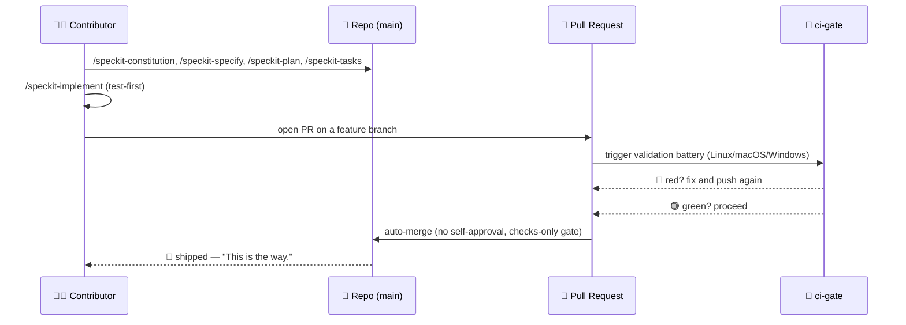
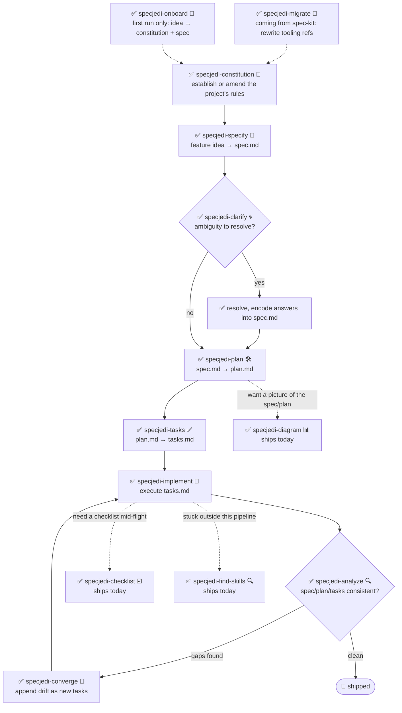

<!-- i18n-sync: source=README.md@4a3486c lang=es -->
> 🌐 Este documento es una traducción asistida por IA. **El inglés es la fuente
> canónica** ([Principle I](../../../.specify/memory/constitution.md)); en caso de
> discrepancia, prevalece el inglés. Ver otros idiomas: [English](../../../README.md) ·
> [中文](../zh/README.md) · [हिन्दी](../hi/README.md) · [Español](../es/README.md) ·
> [Français](../fr/README.md) · [العربية](../ar/README.md) · [বাংলা](../bn/README.md) · [Português](../pt/README.md) · [Русский](../ru/README.md) · [اردو](../ur/README.md) · [Bahasa Indonesia](../id/README.md)

# 🗡️ Spec Jedi

[](https://github.com/jonyfs/spec-jedi/actions/workflows/validate.yml)
[](../../../LICENSE)
[](../../../.specify/memory/constitution.md)
[](#lo-que-obtienes-hoy)
[](#lo-que-obtienes-hoy)
[](../../../references/skill-roadmap.md)
[](#instalación)
[](../../../docs/i18n/)
[](../../../.specify/memory/constitution.md)
[](https://github.com/jonyfs/spec-jedi/commits/main)

> *"Primero la especificación. Luego el código. Ese es el camino."* — un Maestro sabio, probablemente.

Spec Jedi es un conjunto de habilidades (skills) de Desarrollo Guiado por
Especificaciones (Spec-Driven Development, SDD) que instalas en el agente de
codificación que prefieras. En lugar de escribir código primero y documentarlo
después, escribes una **constitución** 📜 (las reglas innegociables de tu
proyecto), una **especificación** 🎯 (qué estás construyendo y por qué), un
**plan** 🛠️ (cómo, técnicamente) y una **lista de tareas** ✅ (los pasos
ordenados) — y tu agente implementa a partir de esos artefactos en lugar de
improvisar como un Padawan que se saltó el entrenamiento.

Este repositorio está construido con la misma disciplina que ofrece: su
propia [constitución](../../../.specify/memory/constitution.md) es la fuente
autoritativa sobre cómo se comporta el proyecto, incluyendo cómo se
versionan las releases y cómo se validan y fusionan los pull requests. Sin
atajos hacia el Lado Oscuro del vibe-coding aquí. 🚫🖤

*(Branding no oficial, inspirado por fans — Spec Jedi no está afiliado, avalado
ni patrocinado por Lucasfilm/Disney. Que la Especificación te acompañe. 🌌)*

## Para quién es esto

Cualquiera que use un agente de codificación con IA y quiera que
especificaciones, planes y tareas sean artefactos versionados de primera
clase en lugar de mensajes de chat desechables — desarrolladores
independientes, equipos que están estandarizando cómo trabajan sus agentes,
y cualquiera cansado de tener que re-explicar el contexto del proyecto en
cada sesión.

## Lo que obtienes hoy

Spec Jedi es un **competidor** genuino de
[spec-kit](https://github.com/github/spec-kit), no una envoltura temática de
este ([Principle XV](../../../.specify/memory/constitution.md)). El pipeline
completo de SDD `specjedi-*` — desde la constitución hasta la convergencia —
está **completo y disponible**: las 9 etapas, construidas una historia
rigurosa a la vez según la disciplina de investigación competitiva de
[research.md](../../../specs/001-specjedi-pipeline/research.md)
(Principle II), sin apuros nunca.

**Disponible hoy, instala y úsalo ya:**

| Skill | Qué hace |
|---|---|
| `specjedi-onboard` 🌱 | Recorrido guiado para un proyecto completamente nuevo — produce un primer `constitution.md` y `spec.md` reales juntos, enseñando cada concepto de SDD exactamente cuando se necesita. Se hace a un lado de inmediato si el onboarding ya ocurrió |
| `specjedi-constitution` 📜 | Establece o enmienda las reglas innegociables de un proyecto — la base contra la que se verifica cualquier otra skill `specjedi-*`. Ver [spec](../../../specs/001-specjedi-pipeline/spec.md) |
| `specjedi-specify` 🎯 | Convierte una idea de funcionalidad — una sola frase basta — en un `spec.md` priorizado y probable de forma independiente, marcando la ambigüedad real en lugar de adivinar |
| `specjedi-clarify` 🌀 | Escanea una especificación en busca de ambigüedad real y hace hasta 5 preguntas priorizadas — cada una con una respuesta recomendada, para que un principiante reciba guía y un experto pueda responder en una palabra — antes de planificar sobre una suposición |
| `specjedi-plan` 🛠️ | Convierte una especificación ya aclarada en un `plan.md` técnico — primero escanea el código base real en busca de convenciones existentes, para que la implementación nunca tenga que detenerse a buscar un patrón que ya existe |
| `specjedi-tasks` ✅ | Descompone un plan en un `tasks.md` ordenado, consciente de dependencias, agrupado por historia de usuario — secuencia una prueba que falla antes de su tarea de implementación en todo lugar donde el plan requiera código |
| `specjedi-implement` 🔨 | Ejecuta `tasks.md` en orden de dependencia, con pruebas primero donde el plan requiere código — solo confirma cambios a través de una rama de funcionalidad y un pull request, nunca directamente a `main` |
| `specjedi-analyze` 🔍 | Verificación cruzada estrictamente de solo lectura de `spec.md`/`plan.md`/`tasks.md` (y la constitución) en busca de vacíos, duplicación y contradicciones — reporta hallazgos, nunca edita un archivo |
| `specjedi-checklist` ☑️ | Genera una lista de verificación personalizada para un área de enfoque nombrada (seguridad, accesibilidad, rendimiento...) fundamentada completamente en el `spec.md`/`plan.md` propio de esta funcionalidad — nunca una plantilla genérica |
| `specjedi-converge` 🔁 | Detecta desviaciones entre el código base real y `tasks.md` tras cambios manuales, agregando cualquier vacío como una nueva tarea en lugar de ignorarlo silenciosamente — cierra el ciclo de vuelta a `specjedi-implement` |
| `specjedi-find-skills` 🔍 | Sugiere una skill específica y verificada cuando tu solicitud toca un dominio que lo instalado no cubre bien — nunca instala sin preguntar primero ([Principle XVII](../../../.specify/memory/constitution.md)) |
| `specjedi-explain` 🎓 | Explica cualquier concepto o comando de SDD, calibrado según cuán experimentado suenas — desde principiante total hasta practicante diario, nunca la misma respuesta enlatada en ambos casos ([Principle XIX](../../../.specify/memory/constitution.md)) |
| `specjedi-migrate` 🔄 | Reescribe referencias literales a herramientas `/speckit-*` en tu propia constitución/spec/plan/tasks a sus equivalentes `specjedi-*` — nunca toca contenido de principios o requisitos, solo a solicitud explícita |
| `specjedi-diagram` 📊 | Genera un diagrama Mermaid verificado por renderizado — el tipo correcto elegido de todo el catálogo Mermaid (flowchart, secuencia, ER, clase, estado, Gantt, línea de tiempo, recorrido de usuario, kanban, mapa mental, cuadrante, circular, y más) — a partir de un `spec.md`/`plan.md` existente — siempre un complemento a la prosa fuente, nunca un reemplazo |
| `specjedi-status` 🧭 | Panel de estado de todo el proyecto que muestra el estado de cada funcionalidad, derivado enteramente de los artefactos `spec.md`/`plan.md`/`tasks.md` en disco — cero sistema de seguimiento mantenido por separado, nunca afirma "estancado" como un hecho |
| `specjedi-retro` 🪞 | Retrospectiva estrictamente de solo lectura que compara la implementación real de una funcionalidad completada contra su `plan.md` — fundamenta la causa de cualquier desviación en el historial real de git, nunca inventa una, registra una entrada duradera con fecha |
| `specjedi-security` 🛡️ | Aviso ligero y proactivo tipo "¿pensamos en X?" para vacíos de autenticación/validación de entrada/secretos/privacidad de datos — auto-invocado por `specjedi-plan`, nunca afirma ser una revisión de seguridad completa |
| `specjedi-docs` 📚 | Redacta una fila de tabla de skills para el README, un paso de Quickstart, y una entrada de `CHANGELOG.md` a partir del spec/plan de una funcionalidad ya entregada — fundamentado en contenido real, siempre mostrado para confirmación antes de escribir |
| `specjedi-new-skill` 🌟 | Estructura el esqueleto de archivos de una nueva skill `specjedi-*` — solo marcadores de posición, nunca contenido inventado — siguiendo el Estándar de Autoría de Skills propio de este proyecto e incorporando la lista de verificación de investigación del Principle II |
| `specjedi-release` 🚀 | Envuelve `scripts/suggest-release.sh` con la voz propia de Spec Jedi — narra la última etiqueta, la siguiente versión sugerida, y los commits que contribuyen; se niega y nombra el comando manual si se le pide efectivamente cortar una release |
| `specjedi-skill-review` 🎓 | Auditoría estrictamente de solo lectura del `SKILL.md` de una skill `specjedi-*` contra el Estándar de Autoría de Skills — revisa el contenido de las secciones, no solo los encabezados, contrasta con el `plan.md` correspondiente en busca de exenciones legítimas, reporta hallazgos o un resultado limpio, nunca edita el archivo revisado |
| `specjedi-tokencheck` 🎒 | Verifica proactivamente si `rtk` y `graphify` están instalados, explica qué falta y su ahorro de tokens esperado, y ofrece un recorrido de instalación — auto-invocado por el flujo de primera ejecución de `specjedi-onboard`, también funciona de forma independiente; nunca instala nada sin confirmación explícita |
| `specjedi-govcheck` ⚖️ | Lista de verificación de cumplimiento de gobernanza estrictamente de solo lectura por PR/rama contra los 20 principios de la constitución — reporte de tres estados (N/A / Conforme / No conforme), cualquier conflicto es CRITICAL — auto-invocado por `specjedi-implement` antes de abrir un PR (nunca lo bloquea), también funciona de forma independiente contra la rama actual o un PR nombrado |

Ver [`references/skill-roadmap.md`](../../../references/skill-roadmap.md)
para lo propuesto más allá del pipeline central (diagramas, y más) — una
lista de skills *adicionales*, no vacíos del pipeline central; cada una
todavía necesita su propia investigación antes de construirse.

## Cómo Spec Jedi se construye *a sí mismo*, en forma de cómic

> ⚠️ **Esta sección trata sobre nuestro proceso interno de bootstrap, no
> sobre el producto Spec Jedi.** Los comandos `/speckit-*` de abajo son
> herramientas propias de [spec-kit](https://github.com/github/spec-kit) —
> Spec Jedi actualmente usa spec-kit para construirse a sí mismo (el mismo
> patrón de "arrancar un compilador con un compilador más viejo"), de la
> misma forma en que cualquier competidor podría usar las herramientas de
> un actor establecido mientras construye su reemplazo. **Si estás
> evaluando Spec Jedi como producto, ve directamente a
> [Lo que obtienes hoy](#lo-que-obtienes-hoy) abajo** — la superficie de
> producto real son las skills `specjedi-*`, no estas. Ver
> [Principle XV](../../../.specify/memory/constitution.md) para la
> política completa sobre por qué se mantienen claramente separadas.
>
> También, una nota sobre el formato: estos son paneles de cómic en texto y
> emojis, no arte generado. Las imágenes reales de Star Wars (personajes,
> naves, el logo) son propiedad intelectual de Lucasfilm/Disney — el propio
> [Principle XII](../../../.specify/memory/constitution.md) de este
> proyecto se compromete a usar solo referencias en texto, nunca
> reproducir arte con derechos de autor. Así que: los momentos de la
> historia son reales, los paneles son Markdown. 🖋️

---

**PANEL 1 — Una terminal solitaria, cursor parpadeando.**
> 🧑‍💻 *"Tengo una idea para una funcionalidad. ...¿Y ahora qué?"*

**PANEL 2 — Una figura encapuchada sale de las sombras, sosteniendo un pergamino.**
> 🧙 *"Primero, el Código."* 📜
> `/speckit-constitution` — las reglas innegociables del proyecto, escritas
> una vez, verificadas para siempre después.

**PANEL 3 — La idea, clavada en una pared, signos de interrogación rodeándola.**
> 🌀 *"¿Qué estás construyendo realmente — y para quién?"*
> `/speckit-specify` convierte la idea en `spec.md`. `/speckit-clarify`
> caza la ambigüedad antes de que se convierta en un bug.

**PANEL 4 — Un plano se despliega sobre una mesa de trabajo.**
> 🛠️ *"Ahora el cómo."*
> `/speckit-plan` → `plan.md`. `/speckit-tasks` → un `tasks.md` ordenado,
> consciente de dependencias. Ningún paso omitido, ningún paso fuera de orden.

**PANEL 5 — Herramientas zumbando, pruebas fallando en rojo, luego volviéndose verdes una a una.**
> 🤖 *"Pruebas primero. Siempre pruebas primero."*
> `/speckit-implement` ejecuta `tasks.md`, con pruebas primero donde aplica
> ([Principle VI](../../../.specify/memory/constitution.md)).

**PANEL 6 — Una cámara del consejo. Un pull request se presenta ante el estrado.**
> 🏛️ *"Declara tus cambios."*
> Se abre un PR. `ci-gate` 🤖 ejecuta toda la batería de validación — cada
> sistema operativo, cada verificación. No se permite la auto-aprobación;
> la máquina no puede perdonarse a sí misma, y tú tampoco
> ([Principle X](../../../.specify/memory/constitution.md)).

**PANEL 7 — Luz verde. La puerta se abre por sí sola.**
> ✅ *"La batería ha hablado."*
> Todas las verificaciones pasan → auto-fusión, sin que ningún humano tenga
> que hacer clic en un botón.

**PANEL 8 — Una nave salta al hiperespacio.**
> 🚀 *"Entregado."*
> 🌌 *"Que la Especificación te acompañe."*

### La misma historia de bootstrap interno, como diagrama



## Requisitos previos

Spec Jedi se desarrolla y valida en **Linux, macOS y Windows** (Constitution
[Principle XIII](../../../.specify/memory/constitution.md)) — cada script
bajo `scripts/` se distribuye tanto en shell POSIX (`.sh`) como en
PowerShell nativo (`.ps1`), y el CI ejecuta la batería en los tres sistemas
operativos en cada PR.

- `git`
- Un agente de codificación soportado (ver
  [Entornos soportados](#entornos-soportados) abajo)
- [GitHub CLI (`gh`)](https://cli.github.com/), solo si planeas contribuir
  cambios de vuelta vía pull request
- Solo si quieres ejecutar los scripts de ayuda localmente (opcional — el
  agente de codificación en sí no los necesita): un shell POSIX (bash/zsh,
  presente por defecto en Linux y macOS) **o**
  [PowerShell 7+](https://aka.ms/powershell) (`pwsh`), que corre en los tres
  sistemas operativos

## Instalación

### Claude Code (totalmente soportado hoy)

El paso de clonado difiere ligeramente según el SO; todo lo demás es idéntico.

**Linux / macOS** (Terminal):

```bash
git clone https://github.com/jonyfs/spec-jedi.git
cd spec-jedi
```

**Windows — PowerShell nativo** (sin necesidad de WSL):

```powershell
git clone https://github.com/jonyfs/spec-jedi.git
cd spec-jedi
```

**Windows — WSL o Git Bash** (si prefieres un shell tipo Unix en Windows):

```bash
git clone https://github.com/jonyfs/spec-jedi.git
cd spec-jedi
```

Ambas rutas de Windows funcionan igual de bien — elige la que ya uses a
diario. Lo único que importa de ahí en adelante es qué script de ayuda
ejecutas (`scripts/*.sh` en un shell POSIX, `scripts/*.ps1` en PowerShell
nativo); las skills en sí funcionan idénticamente en ambos casos.

1. Clona el repositorio usando el bloque de arriba para tu SO.

2. Abre la carpeta en [Claude Code](https://claude.com/claude-code). Claude
   Code descubre automáticamente cada skill bajo `.claude/skills/*/SKILL.md`
   — no hay un paso de instalación separado ni proceso de compilación, y
   este paso es idéntico en los tres sistemas operativos.

3. Confirma que las skills se cargaron escribiendo `/` en el prompt de
   Claude Code. Verás las 23 skills de producto `specjedi-*` y los comandos
   `speckit-*` (las herramientas internas de bootstrap propias de este
   repositorio — ver [Lo que obtienes hoy](#lo-que-obtienes-hoy)) listados
   juntos, ya que Claude Code descubre cada skill bajo `.claude/skills/`
   sin distinguir entre los dos.

4. Eso es todo — ya estás listo para ejecutar `specjedi-onboard` para una
   primera ejecución guiada, preguntarle a `specjedi-explain` cualquier
   cosa si no estás seguro de por dónde empezar, o leer la constitución
   para entender hacia dónde se dirige el resto del pipeline.

**¿Usando Spec Jedi en un proyecto distinto a este?** Ejecuta el instalador
(Constitution [Principle XVIII](../../../.specify/memory/constitution.md))
— copia solo las skills de producto `specjedi-*`, nunca las herramientas
de bootstrap `speckit-*`, más los cuatro archivos
`.specify/templates/*.md` que esas skills necesitan, y valida el
resultado antes de terminar:

```bash
# desde un checkout de Spec Jedi, apuntando a otro proyecto en disco
./scripts/install.sh /path/to/your-project
```

```powershell
# Windows PowerShell nativo
.\scripts\install.ps1 -TargetDir C:\path\to\your-project
```

Solo `-harness claude-code` (el predeterminado) está construido y probado
hoy; cualquier otro valor se reporta como aún no soportado en lugar de
intentarse silenciosamente — ver
[Entornos soportados](#entornos-soportados) abajo. Ejecuta
`./scripts/install.sh --help` (o `.\scripts\install.ps1 -Help`) para la
lista completa de opciones.

### Entornos soportados

La constitución de Spec Jedi
([Principle III](../../../.specify/memory/constitution.md)) compromete a
este proyecto a eventualmente soportar las veinte herramientas/entornos de
codificación LLM de mayor uso en el mercado. Hoy, solo la ruta de arriba
(Claude Code) ha sido construida, probada y documentada de principio a fin.

| Entorno | Estado |
|---|---|
| Claude Code | ✅ Soportado — ver pasos arriba |
| Cursor | 📋 Planeado — aún no instalable |
| GitHub Copilot (Chat/Workspace) | 📋 Planeado — aún no instalable |
| Codex CLI (OpenAI) | 📋 Planeado — aún no instalable |
| Gemini CLI | 📋 Planeado — aún no instalable |
| Antigravity (Google) | 📋 Planeado — aún no instalable |
| Windsurf (Codeium) | 📋 Planeado — aún no instalable |
| Cline | 📋 Planeado — aún no instalable |
| Continue | 📋 Planeado — aún no instalable |
| Aider | 📋 Planeado — aún no instalable |
| Amazon Q Developer | 📋 Planeado — aún no instalable |
| JetBrains AI Assistant | 📋 Planeado — aún no instalable |
| Zed | 📋 Planeado — aún no instalable |
| OpenCode | 📋 Planeado — aún no instalable |
| Warp (Agent Mode) | 📋 Planeado — aún no instalable |
| Replit Agent | 📋 Planeado — aún no instalable |
| Devin (Cognition) | 📋 Planeado — aún no instalable |
| Tabnine | 📋 Planeado — aún no instalable |
| Sourcegraph Cody | 📋 Planeado — aún no instalable |
| Trae | 📋 Planeado — aún no instalable |

Veinte entornos nombrados individualmente según el mandato de "al menos
veinte" del Principle III — solo estado (✅ soportado / 📋 planeado), sin
afirmaciones de capacidad para ningún entorno que este proyecto no haya
construido y probado realmente, según la disciplina de resistencia a la
alucinación del Principle XX. "Planeado" es un estado, no una fecha de
hoja de ruta prometida.

Si tu entorno aún no aparece como soportado, los archivos `SKILL.md` son
Markdown plano con frontmatter YAML — muchos entornos que soportan
instrucciones/prompts personalizados ya pueden leerlos directamente
incluso sin una ruta de instalación dedicada, pero esto aún no ha sido
verificado ni documentado entorno por entorno. Consulta
[`references/harness-capability-notes.md`](../../../references/harness-capability-notes.md)
para notas de capacidad por entorno basadas en investigación documental.

¿Curiosidad por saber cómo se compara Spec Jedi con spec-kit y las otras
diez herramientas SDD contra las que fue evaluado? Consulta
[`references/competitive-comparison.md`](../../../references/competitive-comparison.md).

## Guía rápida

Veintitrés skills de producto están disponibles hoy
([Lo que obtienes hoy](#lo-que-obtienes-hoy)) — el pipeline completo
`specjedi-*` está terminado. ¿Nunca usaste una herramienta de SDD? Empieza
por el paso 0.

0. **¿No estás seguro de qué significa todo esto?** Simplemente pregunta —
   "qué es una especificación y por qué la necesitaría", "qué hace
   realmente este proyecto". `specjedi-explain` 🎓 responde a la
   profundidad que necesites, principiante o avanzado, y siempre te indica
   qué ejecutar a continuación
   ([Principle XIX](../../../.specify/memory/constitution.md)).
1. Instala (ver [Instalación](#instalación) arriba).
2. ¿Proyecto completamente nuevo, sin idea de por dónde empezar?
   `specjedi-onboard` 🌱 te guía para producir un primer `constitution.md`
   y `spec.md` reales juntos a partir de una idea de una sola frase,
   explicando cada concepto solo cuando realmente lo necesitas — nunca un
   muro de documentación de entrada. (Los pasos 3-4 de abajo son
   exactamente lo que orquesta por ti; salta directo a ellos si prefieres
   ejecutar cada etapa tú mismo.)
3. Establece las reglas de tu proyecto: describe tus innegociables en
   lenguaje sencillo y `specjedi-constitution` 📜 produce un
   `.specify/memory/constitution.md` versionado — cada otra skill
   `specjedi-*` verifica su propia salida contra este.
4. Especifica una funcionalidad: describe qué quieres construir — una idea
   general de una sola frase basta — y `specjedi-specify` 🎯 la convierte
   en un `spec.md` priorizado, probable de forma independiente, marcando
   la ambigüedad real en lugar de adivinarla.
5. ¿No estás seguro de que la especificación ya sea sólida?
   `specjedi-clarify` 🌀 la escanea en busca de ambigüedad real y hace
   hasta 5 preguntas priorizadas — cada una con una respuesta
   recomendada, para que puedas aceptarla en una palabra o leer el
   razonamiento si lo quieres — antes de planificar sobre una suposición.
6. ¿Listo para diseñar el "cómo"? `specjedi-plan` 🛠️ escanea tu código
   base real en busca de convenciones existentes primero, luego convierte
   la especificación aclarada en un `plan.md` técnico — para que la
   implementación nunca tenga que detenerse a buscar un patrón que ya
   existe en otra parte de tu proyecto. Si tu especificación toca
   autenticación, entrada externa, secretos o manejo de datos,
   `specjedi-security` 🛡️ se activa automáticamente con algunas preguntas
   específicas tipo "¿pensamos en X?" — un aviso ligero, nunca una
   revisión de seguridad completa.
7. ¿Listo para desglosarlo en trabajo? `specjedi-tasks` ✅ convierte el
   plan en un `tasks.md` ordenado, consciente de dependencias, agrupado
   por historia de usuario — secuencia una tarea de prueba que falla
   antes de su tarea de implementación en todo lugar donde el plan
   requiera código.
8. ¿Listo para construirlo? `specjedi-implement` 🔨 ejecuta `tasks.md` en
   orden de dependencia, con pruebas primero donde el plan requiere
   código — cada commit aterriza en una rama de funcionalidad y un pull
   request, nunca directamente en `main`.
9. ¿Quieres una red de seguridad? `specjedi-analyze` 🔍 verifica de forma
   cruzada `spec.md`, `plan.md` y `tasks.md` (y tu constitución) en busca
   de vacíos, duplicación o contradicciones — estrictamente de solo
   lectura, ejecutable en cualquier momento, nunca edita un archivo.
10. ¿Necesitas una revisión específica? `specjedi-checklist` ☑️ genera una
    lista de verificación para un área de enfoque nombrada — seguridad,
    accesibilidad, rendimiento, lo que sea — fundamentada completamente
    en el spec/plan propio de esta funcionalidad, nunca una plantilla
    genérica.
11. ¿Cambiaste código a mano desde tu último `tasks.md`? `specjedi-converge`
    🔁 escanea el código base real, detecta cualquier capacidad sin tarea
    correspondiente, y la agrega como trabajo nuevo en lugar de dejar que
    se desvíe silenciosamente — la etapa final del pipeline, cerrando el
    ciclo de vuelta a `specjedi-implement`.
12. ¿Atascado en algo fuera de este conjunto? Simplemente descríbelo —
    "cómo hago X", "hay una skill para X" — y `specjedi-find-skills` 🔍 se
    activa automáticamente, busca en el ecosistema abierto de
    agent-skills, y sugiere una skill específica y verificada. Nunca
    instala nada sin preguntar primero
    ([Principle VIII](../../../.specify/memory/constitution.md)).
13. ¿Vienes de un proyecto spec-kit existente? `specjedi-migrate` 🔄
    reescribe las referencias de herramientas `/speckit-*` propias de tu
    proyecto a sus equivalentes `specjedi-*` — nunca toca un principio o
    requisito, solo a solicitud explícita.
14. ¿Quieres una imagen en lugar de un muro de prosa? `specjedi-diagram`
    📊 convierte una especificación o plan en un diagrama Mermaid
    verificado por renderizado — eligiendo el tipo de todo el catálogo
    (ver
    [`references/mermaid-diagram-catalog.md`](../../../references/mermaid-diagram-catalog.md))
    según lo que el contenido real requiera — siempre junto a la prosa
    fuente, nunca en
    su lugar.
15. ¿Manejando más de una o dos funcionalidades? `specjedi-status` 🧭
    muestra un panel de todo el proyecto — qué funcionalidades están
    especificadas, planeadas, en progreso o completas — derivado
    enteramente de lo que realmente hay en disco, sin sistema de
    seguimiento separado que mantener sincronizado.
16. ¿Acabas de terminar una funcionalidad? `specjedi-retro` 🪞 compara lo
    que realmente se entregó contra lo que decía `plan.md`, fundamenta la
    causa de cualquier desviación en el historial real de git — nunca
    inventa una — y registra una entrada duradera para que la señal
    sobreviva más allá de esta conversación.
17. ¿Entregaste algo y necesitas documentarlo? `specjedi-docs` 📚 redacta
    la fila del README, el paso de Quickstart, y la entrada de
    `CHANGELOG.md` por ti — fundamentado en tu spec/plan real, siempre
    mostrado para confirmación antes de escribir nada.
18. ¿Extendiendo Spec Jedi mismo con una nueva skill? `specjedi-new-skill`
    🌟 estructura el esqueleto de archivos — `specs/`, esqueleto de
    `SKILL.md`, cada sección un marcador de posición etiquetado — nunca
    inventa hallazgos de investigación o comportamiento en tu nombre.
19. ¿Preguntándote si toca una release? `specjedi-release` 🚀 narra la
    propia sugerencia de `scripts/suggest-release.sh` — última etiqueta,
    siguiente versión, commits que contribuyen — y se niega con el
    comando manual exacto si le pides que efectivamente corte una; nunca
    etiqueta ni publica por sí mismo.
20. ¿Escribiste o cambiaste una skill `specjedi-*` a mano?
    `specjedi-skill-review` 🎓 revisa su `SKILL.md` contra el Estándar de
    Autoría de Skills — contenido de las secciones, no solo encabezados,
    contrastado con el `plan.md` correspondiente en busca de exenciones
    legítimas — y reporta hallazgos o un resultado limpio; nunca edita el
    archivo en sí.
21. `specjedi-onboard` ya ejecuta esto una vez por ti en el primer uso,
    pero `specjedi-tokencheck` 🎒 también funciona de forma independiente
    — verifica si `rtk` y `graphify` están instalados, explica qué falta
    y su ahorro de tokens esperado, y ofrece guiarte en la instalación;
    nunca instala nada sin tu sí explícito.
22. `specjedi-implement` ya ejecuta esto antes de abrir cada PR, pero
    `specjedi-govcheck` ⚖️ también funciona de forma independiente — una
    lista de verificación por rama (o PR) contra los 20 principios de la
    constitución, reportando cada uno como no aplicable, conforme o no
    conforme, con cualquier conflicto real marcado como CRITICAL —
    estrictamente de solo lectura, nunca edita nada, nunca bloquea un PR
    de abrirse por sí mismo.

Según el [Principle XIV](../../../.specify/memory/constitution.md), lo que
sea que acabas de ejecutar debería decirte qué ejecutar a continuación —
no deberías necesitar volver a esta lista para averiguarlo. La cadena
completa ejecuta `specjedi-onboard` (solo primera ejecución) →
`specjedi-constitution` → `specjedi-specify` → `specjedi-clarify` →
`specjedi-plan` → `specjedi-tasks` → `specjedi-implement` →
`specjedi-analyze` → `specjedi-checklist` → `specjedi-converge`, volviendo
en bucle a `specjedi-implement` cada vez que `specjedi-converge` encuentra
una desviación que resolver.

### El pipeline, de principio a fin

Desde el onboarding hasta la convergencia — cada etapa de abajo está en
vivo:



✅ = disponible hoy — el pipeline completo de 9 etapas `specjedi-*` está
terminado, más `specjedi-onboard` como el punto de entrada guiado de
primera ejecución.

## Compañeros recomendados

La constitución de este proyecto
([Principle VIII](../../../.specify/memory/constitution.md)) dirige a
cada sesión de Spec Jedi a sugerir proactivamente, pero nunca instalar
silenciosamente, dos compañeros que ahorran tokens:

- [`rtk`](https://github.com/rtk-ai/rtk) — un proxy CLI optimizado para
  tokens para operaciones de desarrollo comunes.
- [`graphify`](https://graphify.net/) — convierte un código base en un
  grafo de conocimiento consultable.

Si tu agente ofrece instalar o configurar cualquiera de los dos, esa es
esta política en acción — siempre se te pregunta primero.

**graphify ya está integrado en este repositorio** (con confirmación del
mantenedor): una sección `## graphify` en `CLAUDE.md` le dice a Claude
Code que consulte el grafo de conocimiento antes de explorar el código
fuente y que lo actualice después de cambios de código, y
`.claude/settings.json` registra hooks que empujan las llamadas a
herramientas hacia `graphify query`/`explain`/`path` en lugar de
grep/read crudos una vez que el grafo existe. El grafo en sí
(`graphify-out/`) no se confirma — es un caché derivado, regenerado por
cada clonado.

Para obtener el mismo comportamiento de auto-actualización localmente
después de clonar:

```bash
pip install graphifyy   # o: uv tool install graphifyy
graphify .               # primera construcción (solo se necesita una vez; también corre en el primer uso de todos modos)
graphify hook install    # reconstruye graph.json automáticamente después de cada commit (cambios de código)
```

Los cambios de documentación/contenido no son capturados por el hook de
commit — ejecuta `graphify update .` (o simplemente pídele a tu agente
que lo haga) después de editar archivos que no son código.

## Versionado y releases

Spec Jedi sigue el [Versionado Semántico](https://semver.org/) para sus
propias releases, limitado al contrato público del paquete de skills
(cambio de comportamiento que rompe una skill = MAJOR, nuevas skills o
capacidad aditiva = MINOR, correcciones/documentación = PATCH). Ver
[Principle XI](../../../.specify/memory/constitution.md) para la política
completa.

El proyecto sugiere cuándo se justifica una release en lugar de cortar
una silenciosamente:

```bash
# Linux / macOS / Windows (WSL o Git Bash)
./scripts/suggest-release.sh
```

```powershell
# Windows (PowerShell nativo)
./scripts/suggest-release.ps1
```

Esto inspecciona los commits desde la última etiqueta y recomienda una
siguiente versión — nunca etiqueta ni publica nada por sí mismo. Cortar
efectivamente una release siempre es un paso deliberado, dirigido por el
mantenedor.

## Contribuir

Ver [`CONTRIBUTING.md`](./CONTRIBUTING.md) para el proceso completo de
contribución — requisitos de investigación competitiva para nuevas
skills, la lista de verificación del Estándar de Autoría de Skills, y los
pasos de validación a ejecutar antes de abrir un PR.

Cada cambio se entrega a través de un pull request validado por la
batería de CI propia de este proyecto, y se auto-fusiona solo una vez que
cada verificación está en verde (ver
[Principle IX y X](../../../.specify/memory/constitution.md)). Esa
batería corre en Linux, macOS y Windows en cada PR (Principle XIII) — si
agregas o cambias un script bajo `scripts/`, tanto la versión `.sh` como
la `.ps1` deben existir y pasar en los tres. Las plantillas de issues y
PR (`.github/ISSUE_TEMPLATE/`, `.github/PULL_REQUEST_TEMPLATE.md`) guían
a los contribuyentes para confirmar que realizaron los pasos de
investigación y validación anteriores antes de solicitar revisión.

## Licencia

[MIT](../../../LICENSE) — elegida y requerida por la propia constitución
de este proyecto (Distribution & Ecosystem Standards). En lenguaje
sencillo, MIT significa que puedes:

- **Usar** este proyecto, comercialmente o no, sin restricciones.
- **Modificarlo** como quieras.
- **Redistribuirlo**, incluso como parte de algo que vendas.

Las únicas condiciones reales: conserva el aviso de copyright original y
el texto de la licencia en algún lugar de tu copia, y no esperes garantía
— el software se ofrece "tal cual", sin responsabilidad si algo se
rompe. Eso es todo el trato; ver [`LICENSE`](../../../LICENSE) para el
texto legal exacto.

---
