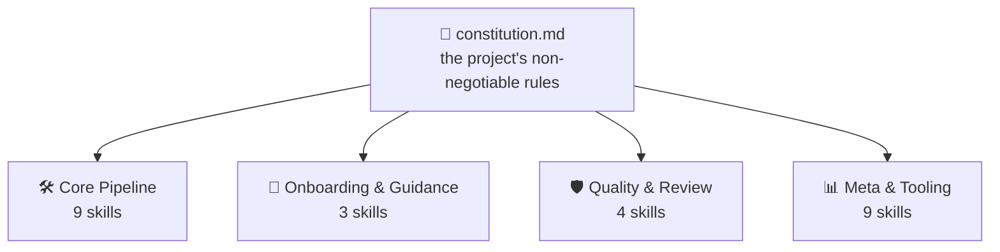
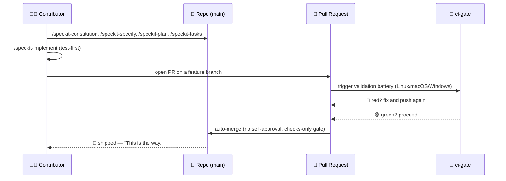

<!-- i18n-sync: source=README.md@1609524 lang=es -->
> 🌐 Este documento es una traducción asistida por IA. **El inglés es la fuente
> canónica** ([Principle I](../../../.specify/memory/constitution.md)); en caso de
> discrepancia, prevalece el inglés. Ver otros idiomas: [English](../../../README.md) ·
> [中文](../zh/README.md) · [हिन्दी](../hi/README.md) · [Español](../es/README.md) ·
> [Français](../fr/README.md) · [العربية](../ar/README.md) · [বাংলা](../bn/README.md) · [Português](../pt/README.md) · [Русский](../ru/README.md) · [اردو](../ur/README.md) · [Bahasa Indonesia](../id/README.md)

# Spec Jedi

[](https://github.com/jonyfs/spec-jedi/actions/workflows/validate.yml)
[](../../../LICENSE)
[](../../../.specify/memory/constitution.md)
[](#cómo-spec-jedi-implementa-sdd)
[](#cómo-spec-jedi-implementa-sdd)
[](../../../references/skill-roadmap.md)
[](#instalación)
[](../../../docs/i18n/)
[](../../../.specify/memory/constitution.md)
[](https://github.com/jonyfs/spec-jedi/commits/main)

> *"Primero la especificación. Luego el código. Ese es el camino."* — un Maestro sabio, probablemente.


**Una carta, de un Maestro para quien recoja este pergamino después:**

La mayoría de los proyectos que superan su propio plan comparten la misma
causa raíz: código primero, explicación después — y ese después nunca
llega del todo. Lo que sigue es la práctica que invierte ese orden, y el
proyecto concreto construido para ponerla en práctica.

*(Branding no oficial, inspirado por fans — Spec Jedi no está afiliado, avalado
ni patrocinado por Lucasfilm/Disney. Que la Especificación te acompañe. 🌌)*

## ¿Qué es el Desarrollo Guiado por Especificaciones?

La forma habitual de construir software con un agente de codificación con
IA es esta: describir lo que quieres en el chat, el agente escribe
código, lees el código para averiguar si hizo lo que querías decir, lo
corriges, repites. El entendimiento del agente sobre "lo que querías
decir" vive solo en la conversación — nunca queda escrito como un
artefacto duradero y revisable. De ahí se siguen dos fallos: la
ambigüedad se resuelve adivinando en lugar de exponerse para una
decisión, y nada sobrevive a la conversación — cierras el chat, pierdes
el razonamiento.

El Desarrollo Guiado por Especificaciones (Spec-Driven Development, SDD)
invierte ese orden. Antes de que exista una sola línea de código, se
escribe qué se está construyendo y por qué, como un documento
estructurado y revisable — una **constitución** 📜 (las reglas
innegociables), una **especificación** 🎯 (qué, y para quién), un
**plan** 🛠️ (cómo, técnicamente), y una **lista de tareas** ✅ (los
pasos ordenados). El código se genera *a partir de* esos artefactos, no
al revés — la misma disciplina que el Código Jedi le pide a cualquiera
tentado a saltarse las partes aburridas del entrenamiento. Explicación
completa, sin ninguna marca propia de Spec Jedi:
[`references/what-is-sdd.md`](../../../references/what-is-sdd.md).



Todo lo que viene después se verifica contra la constitución, nunca al
revés. Cambia una regla, y cada skill lo siente en su próxima ejecución.

## Cómo Spec Jedi implementa SDD

Spec Jedi es un **competidor** genuino de
[spec-kit](https://github.com/github/spec-kit), no una envoltura temática
de este ([Principle XV](../../../.specify/memory/constitution.md)) —
veinte agentes de codificación soportados, de verdad, no solo en teoría
(ver [Instalación](#instalación) abajo). El pipeline completo de SDD
`specjedi-*` — desde la constitución hasta la convergencia — está entregado
por completo desde hace tiempo: las 9 etapas, cada una construida sobre
investigación competitiva real antes de escribir una sola línea
([research.md](../../../specs/001-specjedi-pipeline/research.md),
Principle II).

Cada actividad de SDD de arriba se corresponde con una skill `specjedi-*`
real y entregada, no una aspiración: `specjedi-constitution` establece las
reglas, `specjedi-specify` convierte una idea en un `spec.md`,
`specjedi-clarify` resuelve la ambigüedad marcada, `specjedi-plan` y
`specjedi-tasks` producen el plan técnico y el desglose de tareas, y
`specjedi-implement` (o `specjedi-quick` para cambios pequeños y bien
entendidos) lo ejecuta con pruebas primero, a través de una rama de
funcionalidad y un pull request únicamente. Veinticinco skills están
disponibles hoy en total, en cuatro disciplinas — el catálogo completo,
ambos diagramas, y el recorrido de 23 pasos viven en
[`references/quickstart-guide.md`](../../../references/quickstart-guide.md);
el mapeo completo de actividad a skill, incluyendo tres contribuciones
genuinas más allá de la práctica genérica de SDD, vive en
[`references/specjedi-and-sdd.md`](../../../references/specjedi-and-sdd.md).

¿Curiosidad por lo que sigue?
[`references/skill-roadmap.md`](../../../references/skill-roadmap.md)
rastrea lo propuesto más allá del pipeline central — una lista de ideas
*adicionales*, no vacíos del pipeline en sí. Cada una todavía necesita su
propia investigación real antes de construirse; nada aquí se entrega por
intuición.

## Para quién es esto

Cansado de tener que re-explicar el mismo contexto del proyecto en cada
sesión. Cansado de ver a un agente reinventar silenciosamente una decisión
que un equipo tomó y abandonó hace tres semanas, porque nada la dejó
escrita en un lugar donde el agente pudiera encontrarla. No importa si es
una sola persona o un equipo entero tratando de que todos los agentes se
comporten igual: cualquiera que quiera que las especificaciones, planes y
tareas sean archivos reales y versionados en lugar de mensajes de chat
que desaparecen al cerrar la ventana es el lector al que se dirige esto.

## Cómo Spec Jedi se construye *a sí mismo*, en forma de cómic

> ⚠️ **Esta sección trata sobre nuestro proceso interno de bootstrap, no
> sobre el producto Spec Jedi.** Los comandos `/speckit-*` de abajo son
> herramientas propias de [spec-kit](https://github.com/github/spec-kit) —
> Spec Jedi actualmente usa spec-kit para construirse a sí mismo (el mismo
> patrón de "arrancar un compilador con un compilador más viejo"), de la
> misma forma en que cualquier competidor podría usar las herramientas de
> un actor establecido mientras construye su reemplazo. **Si estás
> evaluando Spec Jedi como producto, ve directamente a
> [Instalación](#instalación) abajo** — la superficie de producto real son
> las skills `specjedi-*`, no estas. Ver
> [Principle XV](../../../.specify/memory/constitution.md) para la
> política completa sobre por qué se mantienen claramente separadas.
>
> También, una nota sobre el formato: los paneles de abajo combinan
> diálogo en texto y emojis con ilustraciones originales — nunca imágenes
> reales de Star Wars (personajes, naves, el logo), que son propiedad
> intelectual de Lucasfilm/Disney. El propio
> [Principle XII](../../../.specify/memory/constitution.md) de este
> proyecto se compromete a una identidad visual original y referencias de
> Star Wars solo en texto, nunca arte con derechos de autor reproducido ni
> arte que evoque las señas visuales reconocibles propias de la saga. Así
> que: los momentos de la historia son reales, el arte es original, y las
> palabras siguen llevando el significado por sí solas. 🖋️

---

Toda historia empieza igual: un cuarto oscuro, una terminal, un cursor
que no deja de parpadear hasta que le das algo que hacer.


> 🧑‍💻 *"Tengo una idea para una funcionalidad. ...¿Y ahora qué?"*

Ahí es cuando aparece el mentor — sin sable de luz, solo un pergamino,
porque la primera batalla aquí nunca es la última. `/speckit-constitution`
escribe las reglas una sola vez, para que nadie tenga que reaprenderlas
por las malas tres funcionalidades después.


> 🧙 *"Primero, el Código."* 📜

La idea sube a la pared después, rodeada de cada pregunta que aún no ha
respondido — qué se está construyendo realmente, y para quién.
`/speckit-specify` la convierte en un `spec.md` real; `/speckit-clarify`
sale a cazar la ambigüedad antes de que se convierta en un bug que nadie
quiere reclamar después.


> 🌀 *"¿Qué estás construyendo realmente — y para quién?"*

Después sale el plano. `/speckit-plan` se convierte en `plan.md`,
`/speckit-tasks` lo desglosa en un `tasks.md` ordenado y consciente de
dependencias — nada omitido, nada fuera de secuencia, el tipo de plan que
un Padawan podría seguir sin preguntar dos veces.


> 🛠️ *"Ahora el cómo."*

Las herramientas empiezan a zumbar. Las pruebas fallan en rojo, una tras
otra — y luego, poco a poco, dejan de fallar. `/speckit-implement`
ejecuta `tasks.md` con pruebas primero donde aplica
([Principle VI](../../../.specify/memory/constitution.md)), porque una
construcción que se salta este paso no es más que una suposición con
pasos extra.


> 🤖 *"Pruebas primero. Siempre pruebas primero."*

Ahora se reúne el consejo — no para bendecir el trabajo, solo para
revisarlo. Un pull request se presenta ante el estrado, y `ci-gate` 🤖
ejecuta toda la batería de validación: cada sistema operativo, cada
verificación, sin atajos. Nadie tiene permitido aprobar su propio trabajo
aquí, ni máquina ni persona
([Principle X](../../../.specify/memory/constitution.md)).


> 🏛️ *"Declara tus cambios."*

La luz se vuelve verde, y la puerta se abre por sí sola — ninguna mano en
la palanca, nadie haciendo clic en un botón. La batería ya dijo lo que
había que decir.


> ✅ *"La batería ha hablado."*

Y luego se va — rumbo al hiperespacio, entregado.


> 🚀 *"Entregado."*
> 🌌 *"Que la Especificación te acompañe."*

Nada de esto es un cuento — es el proceso literal y repetido detrás de
los pull requests recientes de este mismo proyecto —
[#82](https://github.com/jonyfs/spec-jedi/pull/82),
[#84](https://github.com/jonyfs/spec-jedi/pull/84),
[#87](https://github.com/jonyfs/spec-jedi/pull/87), por nombrar algunos —
de principio a fin, de verdad, cada vez.

### La misma historia de bootstrap interno, como diagrama



## Requisitos previos

Nada exótico aquí. Spec Jedi se construye y se prueba en **Linux, macOS y
Windows** por igual (Constitution
[Principle XIII](../../../.specify/memory/constitution.md)) — cada script
bajo `scripts/` se distribuye tanto en shell POSIX (`.sh`) como en
PowerShell nativo (`.ps1`), y el CI ejecuta la batería completa en los
tres sistemas operativos, en cada PR.

Lo que realmente se necesita:

- `git`
- Un agente de codificación soportado (ver
  [Entornos soportados](#entornos-soportados) abajo)
- [GitHub CLI (`gh`)](https://cli.github.com/) — solo si planeas enviar
  pull requests de vuelta
- Un shell para ejecutar los scripts de ayuda localmente, si quieres (el
  agente de codificación en sí no lo necesita): bash/zsh, ya presente en
  Linux y macOS, o [PowerShell 7+](https://aka.ms/powershell) (`pwsh`),
  que corre en todas partes

## Instalación

Un solo comando. Sin `git clone`. `scripts/bootstrap-install.sh`/`.ps1`
(ver specs/024-bootstrap-installer si quieres la historia completa)
obtienen una GitHub Release publicada y ejecutan su instalador incluido
directamente en tu directorio de destino:

```bash
curl -fsSL https://raw.githubusercontent.com/jonyfs/spec-jedi/main/scripts/bootstrap-install.sh \
  | bash -s -- /path/to/your-project --harness cursor
```

```powershell
&([scriptblock]::Create((iwr -useb https://raw.githubusercontent.com/jonyfs/spec-jedi/main/scripts/bootstrap-install.ps1).Content)) -TargetDir C:\path\to\your-project -Harness cursor
```

`--harness` es opcional. Si se omite, el instalador intenta averiguar qué
agente de codificación estás usando — `claude-code`, `codex-cli`, o
`trae` — comprobando si existe un directorio de proyecto, un binario en
`PATH`, o una carpeta de configuración global ya presente, y solo
pregunta si encuentra más de un candidato. Los otros 17 entornos no
tienen todavía una señal de detección confiable, así que para esos pasas
`--harness` tú mismo — la lista completa está justo abajo en
[Entornos soportados](#entornos-soportados). Ejecuta
`./scripts/bootstrap-install.sh --help` (o
`.\scripts\bootstrap-install.ps1 -Help`) cuando quieras la lista completa
de opciones, incluyendo `--auto`.

### Entornos soportados

La constitución ([Principle III](../../../.specify/memory/constitution.md))
compromete a este proyecto a cubrir los veinte agentes de codificación de
mayor uso que existen — y a partir de esta release, los veinte son
reales, probados y verificados por CI, no aspiracionales. Cuatro leen
skills nativamente desde disco (Claude Code, Codex CLI, Trae, Antigravity
— los últimos tres compartiendo solo dos directorios físicos entre ellos,
`.agents/skills/` y `.trae/skills/`, con OpenCode y Warp aprovechando
esas mismas rutas de forma gratuita). Los otros catorce no tienen ningún
concepto nativo de skills — solo un archivo de reglas en la raíz del
proyecto, un pequeño directorio de reglas, o, en el caso de Sourcegraph
Cody, un archivo JSON de comandos personalizados — así que el instalador
construye un **puente**: los paquetes reales `specjedi-*` aterrizan
igualmente en la ubicación canónica `.claude/skills/`, y un pequeño
adaptador (un archivo, o uno por skill para entornos de estilo
directorio) apunta hacia allí usando la convención que ese entorno
realmente documenta.

Ver [`specs/023-full-harness-coverage/research.md`](../../../specs/023-full-harness-coverage/research.md)
si quieres la cita que respalda el mecanismo exacto de cada entorno —
nada aquí es adivinado.

| Entorno | Estado |
|---|---|
| Claude Code | ✅ Soportado — el comando de [Instalación](#instalación) de arriba, omite `--harness` (detección automática) o pasa `--harness claude-code` explícitamente |
| Cursor | ✅ Soportado — `./scripts/install.sh --harness cursor` (archivos puente bajo `.cursor/rules/`) |
| GitHub Copilot (Chat/Workspace) | ✅ Soportado — `./scripts/install.sh --harness copilot` (archivo puente en `.github/copilot-instructions.md`) |
| Codex CLI (OpenAI) | ✅ Soportado — `./scripts/install.sh --harness codex-cli` (instala en `.agents/skills/`) |
| Gemini CLI | ✅ Soportado — `./scripts/install.sh --harness gemini-cli` (archivo puente en `GEMINI.md`; Google está descontinuando Gemini CLI en favor de Antigravity — ver [`references/harness-capability-notes.md`](../../../references/harness-capability-notes.md)) |
| Antigravity (Google) | ✅ Soportado — `./scripts/install.sh --harness antigravity` (instala en `.agents/skills/`, la misma convención que Codex CLI) |
| Windsurf (Codeium) | ✅ Soportado — `./scripts/install.sh --harness windsurf` (archivos puente bajo `.windsurf/rules/`) |
| Cline | ✅ Soportado — `./scripts/install.sh --harness cline` (archivos puente bajo `.clinerules/`) |
| Continue | ✅ Soportado — `./scripts/install.sh --harness continue` (archivos puente bajo `.continue/rules/`) |
| Aider | ✅ Soportado — `./scripts/install.sh --harness aider` (archivo puente en `CONVENTIONS.md`) |
| Amazon Q Developer | ✅ Soportado — `./scripts/install.sh --harness amazon-q` (archivos puente bajo `.amazonq/rules/`) |
| JetBrains AI Assistant | ✅ Soportado — `./scripts/install.sh --harness jetbrains-ai` (archivos puente bajo `.aiassistant/rules/`) |
| Zed | ✅ Soportado — `./scripts/install.sh --harness zed` (archivo puente en `.rules`) |
| OpenCode | ✅ Soportado — satisfecho por la instalación de `claude-code` o `codex-cli` (OpenCode escanea nativamente tanto `.claude/skills/` como `.agents/skills/`), sin necesidad de un flag separado |
| Warp (Agent Mode) | ✅ Soportado — satisfecho por la instalación de `claude-code` o `codex-cli` (el sistema de Skills de Warp escanea nativamente tanto `.claude/skills/` como `.agents/skills/`), sin necesidad de un flag separado |
| Replit Agent | ✅ Soportado — `./scripts/install.sh --harness replit` (archivo puente en `replit.md`) |
| Devin (Cognition) | ✅ Soportado — `./scripts/install.sh --harness devin` (archivo puente en `.devin.md`, estructurado como un Devin Playbook) |
| Tabnine | ✅ Soportado — `./scripts/install.sh --harness tabnine` (archivos puente bajo `.tabnine/guidelines/`) |
| Sourcegraph Cody | ✅ Soportado — `./scripts/install.sh --harness cody` (comandos personalizados en `.vscode/cody.json`, invocados explícitamente como `/specjedi-<name>`; a diferencia de todos los demás entornos de arriba, Cody no tiene un archivo de reglas siempre activo confirmado, así que esto es invocación manual, no contexto automático — ver el documento de investigación) |
| Trae | ✅ Soportado — `./scripts/install.sh --harness trae` (instala en `.trae/skills/`) |

Los veinte entornos nombrados individualmente, todos ✅ Soportados — ese
es el estándar propio del Principle III. Sin afirmaciones de capacidad
para ningún mecanismo que este proyecto no haya construido y probado
realmente; el Principle XX no permite adivinar aquí.

¿Quieres más? [`references/harness-capability-notes.md`](../../../references/harness-capability-notes.md)
tiene las notas de investigación documental originales por entorno, y
[`specs/023-full-harness-coverage/research.md`](../../../specs/023-full-harness-coverage/research.md)
tiene las decisiones de mecanismo de instalación reales y las citas sobre
las que está construida toda esta tabla.

## Evaluación honesta

Ventajas reales, limitaciones reales — no una página de marketing. Veinte
de veinte entornos objetivo tienen una ruta de instalación real y
verificada por CI, los diagramas se verifican por renderizado antes de
mostrarse, y la constitución es un documento vivo y versionado en la
v1.24.0 con un historial de enmiendas documentado. La otra mitad, dicha
con franqueza: todavía no se ha cortado ninguna release
(`git tag -l` no devuelve nada al momento de escribir esto), y la mayoría
de las rutas de instalación de entornos puente se fundamentan en
investigación documental, no en una sesión práctica dentro del producto
real de terceros. Panorama completo, sin filtros:
[`references/honest-assessment.md`](../../../references/honest-assessment.md).

Veinte entornos nombrados individualmente, todos verificados por CI —
pero 18 de los 19 entornos que no son Claude Code fueron confirmados por
investigación documental (una fuente citada por entorno), no instalando
en el producto real y viendo cómo carga una skill; solo el estado de
Sourcegraph Cody cambió tras una investigación de seguimiento más
profunda que no encontró ningún archivo de reglas siempre activo
confirmado. Citas por entorno y el historial completo de investigación:
[`references/harness-capability-notes.md`](../../../references/harness-capability-notes.md).

¿Curiosidad por saber cómo se compara Spec Jedi con spec-kit y las otras
diez herramientas SDD contra las que fue evaluado?
[`references/competitive-comparison.md`](../../../references/competitive-comparison.md)
tiene los recibos.

## Contribuir

Ver [`CONTRIBUTING.md`](./CONTRIBUTING.md) para el proceso completo — los
requisitos de investigación competitiva para nuevas skills, la lista de
verificación del Estándar de Autoría de Skills, y los pasos de validación
a ejecutar antes de abrir un PR.

Cada cambio se entrega a través de un pull request, validado por la
batería de CI propia de este proyecto y auto-fusionado solo una vez que
cada verificación está en verde
([Principle IX y X](../../../.specify/memory/constitution.md)). Esa
batería corre en Linux, macOS y Windows en cada PR (Principle XIII) —
añade o toca un script bajo `scripts/`, y tanto la versión `.sh` como la
`.ps1` deben existir y pasar en los tres, sin excepciones. Las plantillas
de issues y PR (`.github/ISSUE_TEMPLATE/`, `.github/PULL_REQUEST_TEMPLATE.md`)
te guían para confirmar que realmente hiciste la investigación y la
validación de arriba antes de solicitar revisión.

## Licencia

[MIT](../../../LICENSE) — requerida por la propia constitución de este
proyecto (Distribution & Ecosystem Standards), no solo un valor por
defecto en el que nadie pensó. En lenguaje sencillo, MIT significa que
puedes:

- **Usar** este proyecto, comercialmente o no, sin restricciones.
- **Modificarlo** como quieras.
- **Redistribuirlo**, incluso como parte de algo que vendas.

Las condiciones reales, y solo hay dos: conserva el aviso de copyright
original y el texto de la licencia en algún lugar de tu copia, y no
esperes garantía — el software se ofrece "tal cual", sin responsabilidad
si algo se rompe. Eso es genuinamente todo el trato;
[`LICENSE`](../../../LICENSE) tiene el texto legal exacto si lo quieres
palabra por palabra.

---

🌌 *Que la Especificación te acompañe.*
