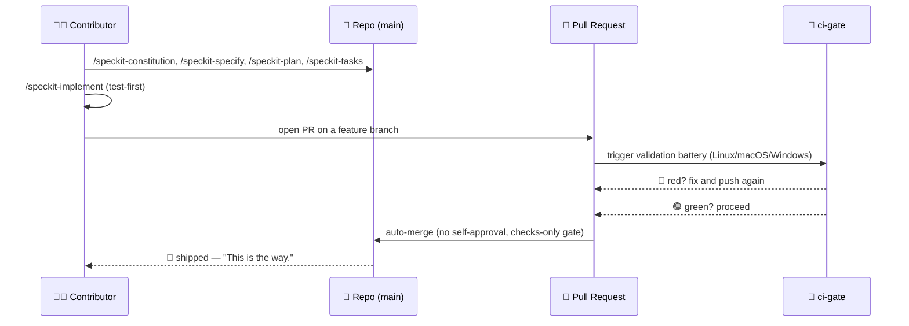
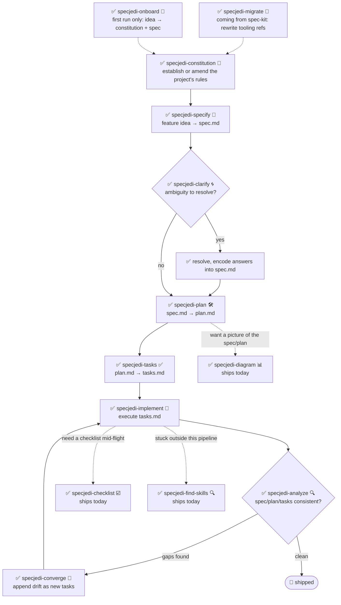

<!-- i18n-sync: source=README.md@620b1d9 lang=fr -->
> 🌐 Ce document est une traduction assistée par IA. **L'anglais est la
> source canonique** ([Principle I](../../../.specify/memory/constitution.md)) ;
> en cas de divergence, l'anglais prévaut. Voir d'autres langues :
> [English](../../../README.md) · [中文](../zh/README.md) ·
> [हिन्दी](../hi/README.md) · [Español](../es/README.md) ·
> [Français](../fr/README.md) · [العربية](../ar/README.md) ·
> [বাংলা](../bn/README.md) · [Português](../pt/README.md) · [Русский](../ru/README.md) · [اردو](../ur/README.md) · [Bahasa Indonesia](../id/README.md)

# 🗡️ Spec Jedi

[](https://github.com/jonyfs/spec-jedi/actions/workflows/validate.yml)
[](../../../LICENSE)
[](../../../.specify/memory/constitution.md)
[](#ce-que-vous-obtenez-aujourdhui)
[](#ce-que-vous-obtenez-aujourdhui)
[](../../../references/skill-roadmap.md)
[](#installation)
[](../../../docs/i18n/)
[](../../../.specify/memory/constitution.md)
[](https://github.com/jonyfs/spec-jedi/commits/main)

> *"La spécification d'abord. Le code ensuite. Telle est la voie."* — un
> sage Maître, probablement.

Spec Jedi est un ensemble de compétences (skills) de développement guidé
par les spécifications (Spec-Driven Development, SDD) que vous installez
dans l'agent de codage de votre choix. Plutôt que d'écrire le code
d'abord et de le documenter ensuite, vous écrivez une **constitution** 📜
(les règles non négociables de votre projet), une **spécification** 🎯
(ce que vous construisez et pourquoi), un **plan** 🛠️ (comment,
techniquement) et une **liste de tâches** ✅ (les étapes ordonnées) — et
votre agent implémente à partir de ces artefacts au lieu d'improviser
comme un Padawan qui aurait sauté son entraînement.

Ce dépôt est lui-même construit avec la même discipline qu'il livre : sa
propre [constitution](../../../.specify/memory/constitution.md) est la
source faisant autorité sur le comportement du projet, y compris la
manière dont les versions sont publiées et dont les pull requests sont
validées et fusionnées. Aucun raccourci vers le Côté Obscur du
vibe-coding ici. 🚫🖤

*(Image de marque non officielle, inspirée par des fans — Spec Jedi n'est
affilié, approuvé ni sponsorisé par Lucasfilm/Disney. Que la Spec soit
avec vous. 🌌)*

## Pour qui

Toute personne utilisant un agent de codage IA qui souhaite que les
spécifications, plans et tâches soient des artefacts de première classe
et versionnés plutôt que des messages de chat jetables — développeurs
indépendants, équipes qui standardisent la façon dont leurs agents
travaillent, et quiconque en a assez de devoir réexpliquer le contexte du
projet à chaque session.

## Ce que vous obtenez aujourd'hui

Spec Jedi est un véritable **concurrent** de
[spec-kit](https://github.com/github/spec-kit), pas un habillage
thématique de celui-ci
([Principle XV](../../../.specify/memory/constitution.md)). Le pipeline
SDD `specjedi-*` complet — de la constitution à la convergence — est
**terminé et livré** : les 9 étapes, construites une histoire rigoureuse
à la fois selon la discipline de recherche concurrentielle de
[research.md](../../../specs/001-specjedi-pipeline/research.md)
(Principle II), jamais précipitées.

**Disponible dès aujourd'hui, installez et utilisez maintenant :**

| Skill | Ce qu'elle fait |
|---|---|
| `specjedi-onboard` 🌱 | Parcours guidé pour un tout nouveau projet — produit ensemble un premier `constitution.md` et `spec.md` réels, enseignant chaque concept SDD exactement au moment où il est nécessaire. S'efface immédiatement si l'onboarding a déjà eu lieu |
| `specjedi-constitution` 📜 | Établit ou modifie les règles non négociables d'un projet — la base contre laquelle toute autre skill `specjedi-*` se vérifie. Voir [spec](../../../specs/001-specjedi-pipeline/spec.md) |
| `specjedi-specify` 🎯 | Transforme une idée de fonctionnalité — une seule phrase suffit — en un `spec.md` priorisé et testable indépendamment, en marquant l'ambiguïté réelle plutôt qu'en devinant |
| `specjedi-clarify` 🌀 | Scanne une spécification à la recherche d'ambiguïté réelle et pose jusqu'à 5 questions priorisées — chacune avec une réponse recommandée, pour qu'un débutant obtienne des conseils et qu'un expert puisse répondre en un mot — avant de planifier sur une supposition |
| `specjedi-plan` 🛠️ | Transforme une spécification clarifiée en un `plan.md` technique — scanne d'abord la base de code réelle à la recherche de conventions existantes, pour que l'implémentation n'ait jamais à s'arrêter pour chercher un motif déjà présent |
| `specjedi-tasks` ✅ | Décompose un plan en un `tasks.md` ordonné, conscient des dépendances, groupé par user story — séquence un test en échec avant sa tâche d'implémentation partout où le plan appelle du code |
| `specjedi-implement` 🔨 | Exécute `tasks.md` dans l'ordre des dépendances, tests d'abord là où le plan appelle du code — ne commit qu'à travers une branche de fonctionnalité et une pull request, jamais directement sur `main` |
| `specjedi-analyze` 🔍 | Vérification croisée strictement en lecture seule de `spec.md`/`plan.md`/`tasks.md` (et de la constitution) à la recherche d'écarts, duplications et contradictions — rapporte les constats, ne modifie jamais un fichier |
| `specjedi-checklist` ☑️ | Génère une checklist personnalisée pour un domaine d'intérêt nommé (sécurité, accessibilité, performance...) entièrement fondée sur le `spec.md`/`plan.md` propre à cette fonctionnalité — jamais un modèle générique |
| `specjedi-converge` 🔁 | Détecte les écarts entre la base de code réelle et `tasks.md` après des modifications manuelles, ajoutant tout écart comme nouvelle tâche plutôt que de l'ignorer silencieusement — referme la boucle vers `specjedi-implement` |
| `specjedi-find-skills` 🔍 | Suggère une skill spécifique et vérifiée lorsque votre demande touche un domaine mal couvert par l'existant — n'installe jamais sans demander d'abord ([Principle XVII](../../../.specify/memory/constitution.md)) |
| `specjedi-explain` 🎓 | Explique tout concept ou commande SDD, calibré selon votre niveau d'expérience apparent — du débutant total au praticien quotidien, jamais la même réponse toute faite dans les deux cas ([Principle XIX](../../../.specify/memory/constitution.md)) |
| `specjedi-migrate` 🔄 | Réécrit les références littérales aux outils `/speckit-*` dans votre propre constitution/spec/plan/tasks vers leurs équivalents `specjedi-*` — ne touche jamais au contenu des principes ou exigences, uniquement sur demande explicite |
| `specjedi-diagram` 📊 | Génère un diagramme Mermaid vérifié par rendu — le type correct choisi dans tout le catalogue Mermaid (flowchart, séquence, ER, classe, état, Gantt, chronologie, parcours utilisateur, kanban, carte mentale, quadrant, camembert, et plus) — à partir d'un `spec.md`/`plan.md` existant — toujours un complément à la prose source, jamais un remplacement |
| `specjedi-status` 🧭 | Tableau de bord global du projet montrant le statut de chaque fonctionnalité, entièrement dérivé des artefacts `spec.md`/`plan.md`/`tasks.md` sur disque — zéro système de suivi maintenu séparément, n'affirme jamais "bloqué" comme un fait |
| `specjedi-retro` 🪞 | Rétrospective strictement en lecture seule comparant l'implémentation réelle d'une fonctionnalité terminée à son `plan.md` — fonde la cause de tout écart sur l'historique git réel, n'en invente jamais une, consigne une entrée datée et durable |
| `specjedi-security` 🛡️ | Invite légère et proactive du type "avons-nous pensé à X" pour les écarts d'authentification/validation d'entrée/secrets/confidentialité des données — auto-invoquée par `specjedi-plan`, ne prétend jamais être une revue de sécurité complète |
| `specjedi-docs` 📚 | Rédige une ligne de tableau de skills pour le README, une étape Quickstart, et une entrée `CHANGELOG.md` à partir du spec/plan d'une fonctionnalité livrée — fondé sur le contenu réel, toujours présenté pour confirmation avant écriture |
| `specjedi-new-skill` 🌟 | Structure le squelette de fichiers d'une nouvelle skill `specjedi-*` — uniquement des espaces réservés, jamais de contenu inventé — suivant le Standard de Rédaction de Skills propre à ce projet et intégrant la checklist de recherche du Principle II |
| `specjedi-release` 🚀 | Enveloppe `scripts/suggest-release.sh` avec la voix propre de Spec Jedi — narre le dernier tag, la prochaine version suggérée, et les commits contributeurs ; refuse et nomme la commande manuelle si on lui demande de réellement couper une release |
| `specjedi-skill-review` 🎓 | Audit strictement en lecture seule du `SKILL.md` d'une skill `specjedi-*` par rapport au Standard de Rédaction de Skills — vérifie le contenu des sections, pas seulement les titres, croise avec le `plan.md` correspondant pour des exemptions légitimes, rapporte les constats ou un résultat propre, ne modifie jamais le fichier examiné |
| `specjedi-tokencheck` 🎒 | Vérifie proactivement si `rtk` et `graphify` sont installés, explique ce qui manque et les économies de tokens attendues, et propose un guide d'installation — auto-invoquée par le flux de première exécution de `specjedi-onboard`, fonctionne aussi seule ; n'installe jamais rien sans confirmation explicite |
| `specjedi-govcheck` ⚖️ | Checklist de conformité de gouvernance strictement en lecture seule par PR/branche par rapport aux 20 principes de la constitution — rapport à trois états (N/A / Conforme / Non conforme), tout conflit est CRITICAL — auto-invoquée par `specjedi-implement` avant d'ouvrir une PR (ne la bloque jamais), fonctionne aussi seule sur la branche actuelle ou une PR nommée |

Voir [`references/skill-roadmap.md`](../../../references/skill-roadmap.md)
pour ce qui est proposé au-delà du pipeline central (diagrammes, et plus)
— une réserve de skills *additionnelles*, pas des lacunes du pipeline
central ; chacune a encore besoin de sa propre recherche avant d'être
construite.

## Comment Spec Jedi se construit *lui-même*, sous forme de bande dessinée

> ⚠️ **Cette section porte sur notre processus interne de bootstrap, pas
> sur le produit Spec Jedi.** Les commandes `/speckit-*` ci-dessous sont
> les outils propres de [spec-kit](https://github.com/github/spec-kit) —
> Spec Jedi utilise actuellement spec-kit pour se construire lui-même (le
> même schéma de "démarrer un compilateur avec un compilateur plus
> ancien"), de la même façon qu'un concurrent pourrait utiliser les
> outils d'un acteur établi en construisant son remplaçant. **Si vous
> évaluez Spec Jedi en tant que produit, passez directement à
> [Ce que vous obtenez aujourd'hui](#ce-que-vous-obtenez-aujourdhui)
> ci-dessous** — la surface de produit réelle, ce sont les skills
> `specjedi-*`, pas celles-ci. Voir
> [Principle XV](../../../.specify/memory/constitution.md) pour la
> politique complète expliquant pourquoi elles restent clairement
> séparées.
>
> Aussi, une note sur le format : ce sont des cases de bande dessinée en
> texte et emojis, pas des œuvres générées. Les véritables images Star
> Wars (personnages, vaisseaux, le logo) sont la propriété intellectuelle
> de Lucasfilm/Disney — le [Principle XII](../../../.specify/memory/constitution.md)
> de ce projet s'engage à n'utiliser que des références textuelles,
> jamais à reproduire d'œuvres protégées par le droit d'auteur. Donc :
> les moments de l'histoire sont réels, les cases sont du Markdown. 🖋️

---

**CASE 1 — Un terminal solitaire, curseur clignotant.**
> 🧑‍💻 *"J'ai une idée de fonctionnalité. ...Et maintenant ?"*

**CASE 2 — Une silhouette encapuchonnée sort de l'ombre, tenant un parchemin.**
> 🧙 *"D'abord, le Code."* 📜
> `/speckit-constitution` — les règles non négociables du projet, écrites
> une fois, vérifiées pour toujours ensuite.

**CASE 3 — L'idée, épinglée sur un mur, des points d'interrogation tournant autour.**
> 🌀 *"Que construisez-vous vraiment — et pour qui ?"*
> `/speckit-specify` transforme l'idée en `spec.md`. `/speckit-clarify`
> traque l'ambiguïté avant qu'elle ne devienne un bug.

**CASE 4 — Un plan se déroule sur un établi.**
> 🛠️ *"Maintenant le comment."*
> `/speckit-plan` → `plan.md`. `/speckit-tasks` → un `tasks.md` ordonné,
> conscient des dépendances. Aucune étape sautée, aucune étape désordonnée.

**CASE 5 — Des outils qui vrombissent, des tests en rouge qui échouent, puis passent au vert un à un.**
> 🤖 *"Les tests d'abord. Toujours les tests d'abord."*
> `/speckit-implement` exécute `tasks.md`, tests d'abord là où cela
> s'applique ([Principle VI](../../../.specify/memory/constitution.md)).

**CASE 6 — Une chambre du conseil. Une pull request se présente devant le banc.**
> 🏛️ *"Déclarez vos changements."*
> Une PR s'ouvre. `ci-gate` 🤖 exécute toute la batterie de validation —
> chaque OS, chaque vérification. Aucune auto-approbation autorisée ; la
> machine ne peut pas se gracier elle-même, et vous non plus
> ([Principle X](../../../.specify/memory/constitution.md)).

**CASE 7 — Feu vert. La porte s'ouvre d'elle-même.**
> ✅ *"La batterie a parlé."*
> Toutes les vérifications passent → auto-fusion, sans qu'aucun humain
> n'ait eu à cliquer sur un bouton.

**CASE 8 — Un vaisseau s'élance vers l'hyperespace.**
> 🚀 *"Livré."*
> 🌌 *"Que la Spec soit avec vous."*

### La même histoire de bootstrap interne, en diagramme



## Prérequis

Spec Jedi est développé et validé sur **Linux, macOS et Windows**
(Constitution [Principle XIII](../../../.specify/memory/constitution.md))
— chaque script sous `scripts/` est livré à la fois en shell POSIX
(`.sh`) et en PowerShell natif (`.ps1`), et le CI exécute la batterie sur
les trois systèmes d'exploitation à chaque PR.

- `git`
- Un agent de codage supporté (voir
  [Environnements supportés](#environnements-supportés) ci-dessous)
- [GitHub CLI (`gh`)](https://cli.github.com/), uniquement si vous
  prévoyez de contribuer des changements via pull request
- Uniquement si vous voulez exécuter les scripts d'aide localement
  (optionnel — l'agent de codage lui-même n'en a pas besoin) : un shell
  POSIX (bash/zsh, présent par défaut sur Linux et macOS) **ou**
  [PowerShell 7+](https://aka.ms/powershell) (`pwsh`), qui fonctionne sur
  les trois systèmes d'exploitation

## Installation

### Claude Code (entièrement supporté aujourd'hui)

L'étape de clonage diffère légèrement selon l'OS ; tout le reste est
identique.

**Linux / macOS** (Terminal) :

```bash
git clone https://github.com/jonyfs/spec-jedi.git
cd spec-jedi
```

**Windows — PowerShell natif** (WSL non requis) :

```powershell
git clone https://github.com/jonyfs/spec-jedi.git
cd spec-jedi
```

**Windows — WSL ou Git Bash** (si vous préférez un shell de type Unix sur
Windows) :

```bash
git clone https://github.com/jonyfs/spec-jedi.git
cd spec-jedi
```

Les deux chemins Windows fonctionnent tout aussi bien — choisissez celui
que vous utilisez déjà au quotidien. La seule chose qui compte ensuite
est le script d'aide que vous exécutez (`scripts/*.sh` dans un shell
POSIX, `scripts/*.ps1` en PowerShell natif) ; les skills elles-mêmes
fonctionnent de manière identique dans les deux cas.

1. Clonez le dépôt en utilisant le bloc ci-dessus pour votre OS.

2. Ouvrez le dossier dans [Claude Code](https://claude.com/claude-code).
   Claude Code découvre automatiquement chaque skill sous
   `.claude/skills/*/SKILL.md` — il n'y a pas d'étape d'installation
   séparée ni de processus de build, et cette étape est identique sur
   les trois systèmes d'exploitation.

3. Confirmez que les skills sont chargées en tapant `/` dans le prompt de
   Claude Code. Vous verrez les 23 skills de produit `specjedi-*` et les
   commandes `speckit-*` (l'outillage interne de bootstrap propre à ce
   dépôt — voir
   [Ce que vous obtenez aujourd'hui](#ce-que-vous-obtenez-aujourdhui))
   listées ensemble, puisque Claude Code découvre chaque skill sous
   `.claude/skills/` sans distinguer les deux.

4. C'est tout — vous êtes prêt à exécuter `specjedi-onboard` pour une
   première exécution guidée, à demander n'importe quoi à
   `specjedi-explain` si vous ne savez pas par où commencer, ou à lire la
   constitution pour comprendre vers où se dirige le reste du pipeline.

**Vous utilisez Spec Jedi dans un projet autre que celui-ci ?** Exécutez
l'installeur (Constitution
[Principle XVIII](../../../.specify/memory/constitution.md)) — il ne
copie que les skills de produit `specjedi-*`, jamais l'outillage de
bootstrap `speckit-*`, plus les quatre fichiers
`.specify/templates/*.md` dont ces skills ont besoin, et valide le
résultat avant de terminer :

```bash
# depuis un checkout de Spec Jedi, ciblant un autre projet sur disque
./scripts/install.sh /path/to/your-project
```

```powershell
# Windows PowerShell natif
.\scripts\install.ps1 -TargetDir C:\path\to\your-project
```

Seul `-harness claude-code` (la valeur par défaut) est construit et
testé aujourd'hui ; toute autre valeur est signalée comme non encore
supportée plutôt que tentée silencieusement — voir
[Environnements supportés](#environnements-supportés) ci-dessous.
Exécutez `./scripts/install.sh --help` (ou `.\scripts\install.ps1 -Help`)
pour la liste complète des options.

### Environnements supportés

La constitution de Spec Jedi
([Principle III](../../../.specify/memory/constitution.md)) engage ce
projet à finalement supporter les vingt outils/environnements de codage
LLM les plus utilisés du marché. Aujourd'hui, deux chemins ont été
construits, testés et documentés de bout en bout : Claude Code (voir les
étapes ci-dessus) et Codex CLI (`./scripts/install.sh --harness
codex-cli` / `.\scripts\install.ps1 -Harness codex-cli`, installant dans
`.agents/skills/` — vérifié par rapport à la convention de découverte de
skills documentée par Codex CLI lui-même).

| Environnement | Statut |
|---|---|
| Claude Code | ✅ Supporté — voir les étapes ci-dessus |
| Cursor | 📋 Prévu — pas encore installable |
| GitHub Copilot (Chat/Workspace) | 📋 Prévu — pas encore installable |
| Codex CLI (OpenAI) | ✅ Supporté — `./scripts/install.sh --harness codex-cli` (installe dans `.agents/skills/`) |
| Gemini CLI | 📋 Prévu — pas encore installable |
| Antigravity (Google) | 📋 Prévu — pas encore installable |
| Windsurf (Codeium) | 📋 Prévu — pas encore installable |
| Cline | 📋 Prévu — pas encore installable |
| Continue | 📋 Prévu — pas encore installable |
| Aider | 📋 Prévu — pas encore installable |
| Amazon Q Developer | 📋 Prévu — pas encore installable |
| JetBrains AI Assistant | 📋 Prévu — pas encore installable |
| Zed | 📋 Prévu — pas encore installable |
| OpenCode | ✅ Supporté — satisfait par l'installation `claude-code` ou `codex-cli` (OpenCode scanne nativement à la fois `.claude/skills/` et `.agents/skills/`), aucun flag séparé nécessaire |
| Warp (Agent Mode) | ✅ Supporté — satisfait par l'installation `claude-code` ou `codex-cli` (le système Skills de Warp scanne nativement à la fois `.claude/skills/` et `.agents/skills/`), aucun flag séparé nécessaire |
| Replit Agent | 📋 Prévu — pas encore installable |
| Devin (Cognition) | 📋 Prévu — pas encore installable |
| Tabnine | 📋 Prévu — pas encore installable |
| Sourcegraph Cody | 📋 Prévu — pas encore installable |
| Trae | 📋 Prévu — pas encore installable |

Vingt environnements nommés individuellement selon le mandat "au moins
vingt" du Principle III — statut uniquement (✅ supporté / 📋 prévu),
aucune affirmation de capacité pour un environnement que ce projet n'a
pas réellement construit et testé, selon la discipline de résistance à
l'hallucination du Principle XX. "Prévu" est un statut, pas une date de
feuille de route promise.

Si votre environnement n'est pas encore listé comme supporté, les
fichiers `SKILL.md` sont du Markdown pur avec frontmatter YAML — de
nombreux environnements supportant des instructions/prompts personnalisés
peuvent déjà les lire directement même sans chemin d'installation dédié,
mais cela n'a pas encore été vérifié ni documenté environnement par
environnement. Voir
[`references/harness-capability-notes.md`](../../../references/harness-capability-notes.md)
pour des notes de capacité par environnement issues d'une recherche
documentaire.

Curieux de savoir comment Spec Jedi se compare à spec-kit et aux dix
autres outils SDD contre lesquels il a été évalué ? Voir
[`references/competitive-comparison.md`](../../../references/competitive-comparison.md).

## Démarrage rapide

Vingt-trois skills de produit sont disponibles aujourd'hui
([Ce que vous obtenez aujourd'hui](#ce-que-vous-obtenez-aujourdhui)) — le
pipeline `specjedi-*` complet est terminé. Jamais utilisé d'outil SDD
auparavant ? Commencez par l'étape 0.

0. **Pas sûr de ce que tout cela signifie ?** Demandez simplement — "qu'est-ce
   qu'une spec et pourquoi en aurais-je besoin", "que fait réellement ce
   projet". `specjedi-explain` 🎓 répond au niveau de profondeur dont
   vous avez besoin, débutant ou avancé, et vous indique toujours quoi
   exécuter ensuite
   ([Principle XIX](../../../.specify/memory/constitution.md)).
1. Installez (voir [Installation](#installation) ci-dessus).
2. Tout nouveau projet, aucune idée par où commencer ? `specjedi-onboard`
   🌱 vous guide pour produire ensemble un premier `constitution.md` et
   `spec.md` réels à partir d'une idée en une phrase, n'expliquant chaque
   concept que lorsque vous en avez réellement besoin — jamais un mur de
   documentation d'entrée. (Les étapes 3-4 ci-dessous sont exactement ce
   qu'il orchestre pour vous ; passez-y directement si vous préférez
   exécuter chaque étape vous-même.)
3. Établissez les règles de votre projet : décrivez vos non-négociables
   en langage clair et `specjedi-constitution` 📜 produit un
   `.specify/memory/constitution.md` versionné — chaque autre skill
   `specjedi-*` vérifie sa propre sortie par rapport à celui-ci.
4. Spécifiez une fonctionnalité : décrivez ce que vous voulez construire
   — une idée approximative en une phrase suffit — et `specjedi-specify`
   🎯 la transforme en un `spec.md` priorisé, testable indépendamment,
   marquant l'ambiguïté réelle plutôt que de la deviner.
5. Pas sûr que la spec soit déjà solide ? `specjedi-clarify` 🌀 la scanne
   à la recherche d'ambiguïté réelle et pose jusqu'à 5 questions
   priorisées — chacune avec une réponse recommandée, pour que vous
   puissiez l'accepter en un mot ou lire le raisonnement si vous le
   souhaitez — avant de planifier sur une supposition.
6. Prêt à concevoir le "comment" ? `specjedi-plan` 🛠️ scanne d'abord
   votre base de code réelle à la recherche de conventions existantes,
   puis transforme la spec clarifiée en un `plan.md` technique — pour
   que l'implémentation n'ait jamais à s'arrêter pour chercher un motif
   déjà présent ailleurs dans votre projet. Si votre spec touche
   l'authentification, une entrée externe, des secrets ou le traitement
   de données, `specjedi-security` 🛡️ se déclenche automatiquement avec
   quelques questions ciblées du type "avons-nous pensé à X" — une
   invite légère, jamais une revue de sécurité complète.
7. Prêt à le décomposer en travail ? `specjedi-tasks` ✅ transforme le
   plan en un `tasks.md` ordonné, conscient des dépendances, groupé par
   user story — séquence une tâche de test en échec avant sa tâche
   d'implémentation partout où le plan appelle du code.
8. Prêt à le construire ? `specjedi-implement` 🔨 exécute `tasks.md`
   dans l'ordre des dépendances, tests d'abord là où le plan appelle du
   code — chaque commit atterrit sur une branche de fonctionnalité et
   une pull request, jamais directement sur `main`.
9. Vous voulez un filet de sécurité ? `specjedi-analyze` 🔍 vérifie de
   manière croisée `spec.md`, `plan.md` et `tasks.md` (et votre
   constitution) à la recherche d'écarts, duplications ou
   contradictions — strictement en lecture seule, exécutable à tout
   moment, ne modifie jamais un fichier.
10. Besoin d'une revue ciblée ? `specjedi-checklist` ☑️ génère une
    checklist pour un domaine d'intérêt nommé — sécurité, accessibilité,
    performance, ce que vous voulez — entièrement fondée sur le
    spec/plan propre à cette fonctionnalité, jamais un modèle générique.
11. Vous avez modifié du code à la main depuis votre dernier `tasks.md` ?
    `specjedi-converge` 🔁 scanne la base de code réelle, détecte toute
    capacité sans tâche correspondante, et l'ajoute comme nouveau
    travail plutôt que de la laisser dériver silencieusement — l'étape
    finale du pipeline, refermant la boucle vers `specjedi-implement`.
12. Bloqué sur quelque chose en dehors de cet ensemble ? Décrivez-le
    simplement — "comment fais-je X", "y a-t-il une skill pour X" — et
    `specjedi-find-skills` 🔍 se déclenche automatiquement, cherche dans
    l'écosystème ouvert d'agent-skills, et suggère une skill spécifique
    et vérifiée. N'installe jamais rien sans demander d'abord
    ([Principle VIII](../../../.specify/memory/constitution.md)).
13. Vous venez d'un projet spec-kit existant ? `specjedi-migrate` 🔄
    réécrit les références d'outils `/speckit-*` propres à votre projet
    vers leurs équivalents `specjedi-*` — ne touche jamais à un principe
    ou une exigence, uniquement sur demande explicite.
14. Vous voulez une image plutôt qu'un mur de prose ? `specjedi-diagram`
    📊 transforme une spec ou un plan en diagramme Mermaid vérifié par
    rendu — en choisissant le type dans tout le catalogue (voir
    [`references/mermaid-diagram-catalog.md`](../../../references/mermaid-diagram-catalog.md))
    selon ce que le contenu réel exige — toujours aux côtés de la prose
    source, jamais à sa place.
15. Vous jonglez avec plus d'une ou deux fonctionnalités ?
    `specjedi-status` 🧭 affiche un tableau de bord de tout le projet —
    quelles fonctionnalités sont spécifiées, planifiées, en cours ou
    terminées — entièrement dérivé de ce qui existe réellement sur
    disque, sans système de suivi séparé à maintenir synchronisé.
16. Vous venez de terminer une fonctionnalité ? `specjedi-retro` 🪞
    compare ce qui a été réellement livré à ce que disait `plan.md`,
    fonde la cause de tout écart sur l'historique git réel — n'en
    invente jamais une — et consigne une entrée durable pour que le
    signal survive au-delà de cette conversation.
17. Vous avez livré quelque chose et devez le documenter ?
    `specjedi-docs` 📚 rédige la ligne du README, l'étape Quickstart, et
    l'entrée `CHANGELOG.md` pour vous — fondé sur votre spec/plan réel,
    toujours présenté pour confirmation avant d'écrire quoi que ce soit.
18. Vous étendez Spec Jedi lui-même avec une nouvelle skill ?
    `specjedi-new-skill` 🌟 structure le squelette de fichiers —
    `specs/`, squelette de `SKILL.md`, chaque section un espace réservé
    étiqueté — n'invente jamais de résultats de recherche ou de
    comportement en votre nom.
19. Vous vous demandez si une release est due ? `specjedi-release` 🚀
    narre la propre suggestion de `scripts/suggest-release.sh` — dernier
    tag, prochaine version, commits contributeurs — et refuse avec la
    commande manuelle exacte si vous lui demandez d'en réellement couper
    une ; ne tague ni ne publie jamais elle-même.
20. Vous avez écrit ou modifié une skill `specjedi-*` à la main ?
    `specjedi-skill-review` 🎓 vérifie son `SKILL.md` par rapport au
    Standard de Rédaction de Skills — contenu des sections, pas
    seulement les titres, croisé avec le `plan.md` correspondant pour
    des exemptions légitimes — et rapporte les constats ou un résultat
    propre ; ne modifie jamais le fichier lui-même.
21. `specjedi-onboard` exécute déjà cela une fois pour vous à la première
    utilisation, mais `specjedi-tokencheck` 🎒 fonctionne aussi seule —
    vérifie si `rtk` et `graphify` sont installés, explique ce qui
    manque et les économies de tokens attendues, et propose de vous
    guider dans l'installation ; n'installe jamais rien sans votre oui
    explicite.
22. `specjedi-implement` exécute déjà cela avant d'ouvrir chaque PR, mais
    `specjedi-govcheck` ⚖️ fonctionne aussi seule — une checklist par
    branche (ou PR) par rapport aux 20 principes de la constitution,
    rapportant chacun comme non applicable, conforme ou non conforme,
    avec tout conflit réel marqué CRITICAL — strictement en lecture
    seule, ne modifie jamais rien, ne bloque jamais une PR de s'ouvrir
    d'elle-même.

Selon le [Principle XIV](../../../.specify/memory/constitution.md), ce
que vous venez d'exécuter devrait vous dire quoi exécuter ensuite — vous
ne devriez pas avoir besoin de revenir à cette liste pour le savoir. La
chaîne complète exécute `specjedi-onboard` (première exécution
uniquement) → `specjedi-constitution` → `specjedi-specify` →
`specjedi-clarify` → `specjedi-plan` → `specjedi-tasks` →
`specjedi-implement` → `specjedi-analyze` → `specjedi-checklist` →
`specjedi-converge`, revenant en boucle vers `specjedi-implement` chaque
fois que `specjedi-converge` trouve un écart à traiter.

### Le pipeline, de bout en bout

De l'onboarding à la convergence — chaque étape ci-dessous est en
production :



✅ = disponible aujourd'hui — le pipeline `specjedi-*` complet en 9 étapes
est terminé, plus `specjedi-onboard` comme point d'entrée guidé de
première exécution.

## Compagnons recommandés

La constitution de ce projet
([Principle VIII](../../../.specify/memory/constitution.md)) demande à
chaque session Spec Jedi de suggérer proactivement, mais jamais
d'installer silencieusement, deux compagnons économiseurs de tokens :

- [`rtk`](https://github.com/rtk-ai/rtk) — un proxy CLI optimisé pour les
  tokens pour les opérations de développement courantes.
- [`graphify`](https://graphify.net/) — transforme une base de code en un
  graphe de connaissances interrogeable.

Si votre agent propose d'installer ou de configurer l'un des deux, c'est
cette politique en action — on vous demande toujours d'abord.

**graphify est déjà intégré à ce dépôt** (avec confirmation du
mainteneur) : une section `## graphify` dans `CLAUDE.md` indique à
Claude Code de consulter le graphe de connaissances avant de parcourir le
code source et de le rafraîchir après des changements de code, et
`.claude/settings.json` enregistre des hooks qui orientent les appels
d'outils vers `graphify query`/`explain`/`path` plutôt que grep/read
bruts une fois le graphe existant. Le graphe lui-même (`graphify-out/`)
n'est pas commité — c'est un cache dérivé, régénéré à chaque clonage.

Pour obtenir le même comportement d'auto-mise à jour localement après le
clonage :

```bash
pip install graphifyy   # ou : uv tool install graphifyy
graphify .               # première construction (nécessaire une seule fois ; s'exécute aussi de toute façon à la première utilisation)
graphify hook install    # reconstruit automatiquement graph.json après chaque commit (changements de code)
```

Les changements de documentation/contenu ne sont pas captés par le hook
de commit — exécutez `graphify update .` (ou demandez simplement à votre
agent de le faire) après avoir édité des fichiers non liés au code.

## Versionnage et releases

Spec Jedi suit le [Versionnage Sémantique](https://semver.org/) pour ses
propres releases, limité au contrat public du paquet de skills
(changement de comportement d'une skill qui casse = MAJOR, nouvelles
skills ou capacité additive = MINOR, corrections/documentation = PATCH).
Voir [Principle XI](../../../.specify/memory/constitution.md) pour la
politique complète.

Le projet suggère quand une release est justifiée plutôt que d'en couper
une silencieusement :

```bash
# Linux / macOS / Windows (WSL ou Git Bash)
./scripts/suggest-release.sh
```

```powershell
# Windows (PowerShell natif)
./scripts/suggest-release.ps1
```

Ceci inspecte les commits depuis le dernier tag et recommande une
prochaine version — il ne tague ni ne publie jamais rien lui-même.
Couper effectivement une release est toujours une étape délibérée,
dirigée par le mainteneur.

## Contribuer

Voir [`CONTRIBUTING.md`](./CONTRIBUTING.md) pour le processus complet de
contribution — exigences de recherche concurrentielle pour les nouvelles
skills, la checklist du Standard de Rédaction de Skills, et les étapes
de validation à exécuter avant d'ouvrir une PR.

Chaque changement est livré via une pull request validée par la batterie
CI propre à ce projet, et n'est auto-fusionné qu'une fois chaque
vérification au vert (voir
[Principle IX et X](../../../.specify/memory/constitution.md)). Cette
batterie s'exécute sur Linux, macOS et Windows à chaque PR (Principle
XIII) — si vous ajoutez ou modifiez un script sous `scripts/`, les
versions `.sh` et `.ps1` doivent toutes deux exister et passer sur les
trois. Les modèles d'issues et de PR (`.github/ISSUE_TEMPLATE/`,
`.github/PULL_REQUEST_TEMPLATE.md`) guident les contributeurs pour
confirmer qu'ils ont effectué les étapes de recherche et de validation
ci-dessus avant de demander une revue.

## Licence

[MIT](../../../LICENSE) — choisie et exigée par la propre constitution de
ce projet (Distribution & Ecosystem Standards). En termes simples, MIT
signifie que vous pouvez :

- **Utiliser** ce projet, commercialement ou non, sans restriction.
- Le **modifier** comme vous le voulez.
- Le **redistribuer**, y compris dans le cadre de quelque chose que vous
  vendez.

Les seules vraies conditions : conserver l'avis de copyright original et
le texte de la licence quelque part dans votre copie, et ne pas
attendre de garantie — le logiciel est fourni "tel quel", sans
responsabilité en cas de problème. C'est tout l'accord ; voir
[`LICENSE`](../../../LICENSE) pour le texte juridique exact.

---
