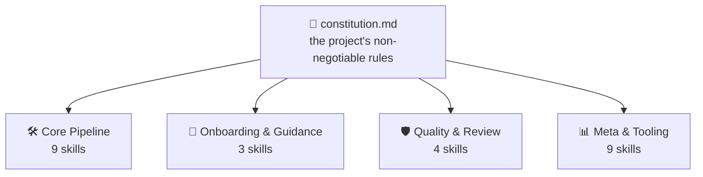
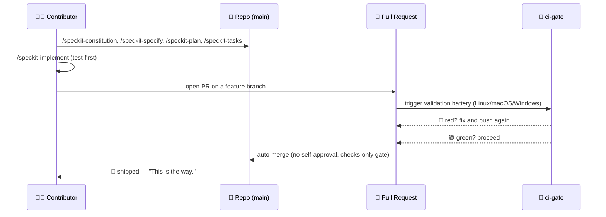

<!-- i18n-sync: source=README.md@1609524 lang=fr -->
> 🌐 Ce document est une traduction assistée par IA. **L'anglais est la
> source canonique** ([Principle I](../../../.specify/memory/constitution.md)) ;
> en cas de divergence, l'anglais prévaut. Voir d'autres langues :
> [English](../../../README.md) · [中文](../zh/README.md) ·
> [हिन्दी](../hi/README.md) · [Español](../es/README.md) ·
> [Français](../fr/README.md) · [العربية](../ar/README.md) ·
> [বাংলা](../bn/README.md) · [Português](../pt/README.md) · [Русский](../ru/README.md) · [اردو](../ur/README.md) · [Bahasa Indonesia](../id/README.md)

# Spec Jedi

[](https://github.com/jonyfs/spec-jedi/actions/workflows/validate.yml)
[](../../../LICENSE)
[](../../../.specify/memory/constitution.md)
[](#comment-spec-jedi-implémente-le-sdd)
[](#comment-spec-jedi-implémente-le-sdd)
[](../../../references/skill-roadmap.md)
[](#installation)
[](../../../docs/i18n/)
[](../../../.specify/memory/constitution.md)
[](https://github.com/jonyfs/spec-jedi/commits/main)

> *"La spécification d'abord. Le code ensuite. Telle est la voie."* — un
> sage Maître, probablement.


**Une lettre, d'un Maître à quiconque reprendra ce parchemin ensuite :**

La plupart des projets qui dépassent leur propre plan partagent la même
cause profonde : le code d'abord, l'explication ensuite — et cet ensuite
n'arrive jamais vraiment. Ce qui suit est la pratique qui inverse cet
ordre, et le projet concret construit pour la mettre en œuvre.

*(Image de marque non officielle, inspirée par des fans — Spec Jedi n'est
affilié, approuvé ni sponsorisé par Lucasfilm/Disney. Que la Spec soit
avec vous. 🌌)*

## Qu'est-ce que le développement guidé par les spécifications ?

La façon habituelle de construire un logiciel avec un agent de codage IA
est celle-ci : décrire ce que vous voulez dans le chat, l'agent écrit le
code, vous lisez le code pour déterminer s'il a fait ce que vous vouliez
dire, vous le corrigez, vous recommencez. La compréhension de l'agent de
"ce que vous vouliez dire" ne vit que dans la conversation — jamais
consignée comme un artefact durable et révisable. Deux modes d'échec en
découlent : l'ambiguïté est résolue en devinant plutôt qu'en étant
exposée pour une décision, et rien ne survit à la conversation — vous
fermez le chat, vous perdez le raisonnement.

Le Développement Guidé par les Spécifications (Spec-Driven Development,
SDD) inverse cet ordre. Avant qu'une seule ligne de code n'existe, on
écrit ce qui est construit et pourquoi, sous forme d'un document
structuré et révisable — une **constitution** 📜 (les règles non
négociables), une **spécification** 🎯 (quoi, et pour qui), un **plan**
🛠️ (comment, techniquement), et une **liste de tâches** ✅ (les étapes
ordonnées). Le code est généré *à partir de* ces artefacts, pas
l'inverse — la même discipline que le Code Jedi exige de quiconque est
tenté de sauter les parties ennuyeuses de l'entraînement. Explication
complète, sans aucune marque propre à Spec Jedi :
[`references/what-is-sdd.md`](../../../references/what-is-sdd.md).



Tout ce qui suit se vérifie par rapport à la constitution, jamais
l'inverse. Changez une règle, et chaque skill le ressent dès sa
prochaine exécution.

## Comment Spec Jedi implémente le SDD

Spec Jedi est un véritable **concurrent** de
[spec-kit](https://github.com/github/spec-kit), pas un habillage
thématique de celui-ci
([Principle XV](../../../.specify/memory/constitution.md)) — vingt
agents de codage supportés, pour de vrai, pas seulement en théorie (voir
[Installation](#installation) ci-dessous). Le pipeline SDD `specjedi-*`
complet — de la constitution à la convergence — est livré en entier
depuis un moment : les 9 étapes, chacune construite sur une recherche
concurrentielle réelle avant qu'une seule ligne ne soit écrite
([research.md](../../../specs/001-specjedi-pipeline/research.md),
Principle II).

Chaque activité SDD ci-dessus correspond à une skill `specjedi-*` réelle
et livrée, pas une aspiration : `specjedi-constitution` établit les
règles, `specjedi-specify` transforme une idée en `spec.md`,
`specjedi-clarify` résout l'ambiguïté marquée, `specjedi-plan` et
`specjedi-tasks` produisent le plan technique et la décomposition en
tâches, et `specjedi-implement` (ou `specjedi-quick` pour les
changements petits et bien compris) l'exécute tests d'abord, uniquement
à travers une branche de fonctionnalité et une pull request. Vingt-cinq
skills sont disponibles aujourd'hui au total, réparties en quatre
disciplines — le catalogue complet, les deux diagrammes, et le parcours
en 23 étapes vivent dans
[`references/quickstart-guide.md`](../../../references/quickstart-guide.md) ;
le mapping complet activité-vers-skill, incluant trois contributions
authentiques au-delà de la pratique SDD générique, vit dans
[`references/specjedi-and-sdd.md`](../../../references/specjedi-and-sdd.md).

Curieux de ce qui vient ensuite ?
[`references/skill-roadmap.md`](../../../references/skill-roadmap.md)
recense ce qui est proposé au-delà du pipeline central — une réserve
d'idées *additionnelles*, pas des lacunes du pipeline lui-même. Chacune a
encore besoin de sa propre recherche réelle avant d'être construite ;
rien ici n'est livré à l'instinct.

## Pour qui

Fatigué de devoir réexpliquer le même contexte de projet à chaque
session. Fatigué de voir un agent réinventer silencieusement une
décision qu'une équipe a prise et abandonnée trois semaines plus tôt,
parce que rien ne l'a consignée là où l'agent pouvait la trouver. Peu
importe qu'il s'agisse d'une seule personne ou d'une équipe entière
essayant de faire en sorte que tous les agents se comportent de la même
façon : quiconque veut que les spécifications, plans et tâches soient de
vrais fichiers versionnés plutôt que des messages de chat qui
disparaissent à la fermeture de la fenêtre est le lecteur visé ici.

## Comment Spec Jedi se construit *lui-même*, sous forme de bande dessinée

> ⚠️ **Cette section porte sur notre processus interne de bootstrap, pas
> sur le produit Spec Jedi.** Les commandes `/speckit-*` ci-dessous sont
> les outils propres de [spec-kit](https://github.com/github/spec-kit) —
> Spec Jedi utilise actuellement spec-kit pour se construire lui-même (le
> même schéma de "démarrer un compilateur avec un compilateur plus
> ancien"), de la même façon qu'un concurrent pourrait utiliser les
> outils d'un acteur établi en construisant son remplaçant. **Si vous
> évaluez Spec Jedi en tant que produit, passez directement à
> [Installation](#installation) ci-dessous** — la surface de produit
> réelle, ce sont les skills `specjedi-*`, pas celles-ci. Voir
> [Principle XV](../../../.specify/memory/constitution.md) pour la
> politique complète expliquant pourquoi elles restent clairement
> séparées.
>
> Aussi, une note sur le format : les cases ci-dessous combinent dialogue
> en texte et emojis avec des illustrations originales — jamais de
> véritables images Star Wars (personnages, vaisseaux, le logo), qui sont
> la propriété intellectuelle de Lucasfilm/Disney. Le
> [Principle XII](../../../.specify/memory/constitution.md) de ce projet
> s'engage à une identité visuelle originale et à des références Star
> Wars uniquement textuelles, jamais d'œuvre protégée par le droit
> d'auteur reproduite ni d'art évoquant les signatures visuelles
> reconnaissables propres à la saga. Donc : les moments de l'histoire
> sont réels, l'art est original, et les mots portent toujours le sens à
> eux seuls. 🖋️

---

Chaque histoire commence de la même façon : une pièce sombre, un
terminal, un curseur qui ne s'arrête pas de clignoter jusqu'à ce qu'on
lui donne quelque chose à faire.


> 🧑‍💻 *"J'ai une idée de fonctionnalité. ...Et maintenant ?"*

C'est là que le mentor apparaît — pas de sabre laser, juste un
parchemin, parce que le premier combat ici n'est jamais le dernier.
`/speckit-constitution` écrit les règles une bonne fois pour toutes, pour
que personne n'ait à les réapprendre à la dure trois fonctionnalités
plus tard.


> 🧙 *"D'abord, le Code."* 📜

L'idée monte sur le mur ensuite, entourée de chaque question à laquelle
elle n'a pas encore répondu — ce qui est vraiment construit, et pour
qui. `/speckit-specify` la transforme en un vrai `spec.md` ;
`/speckit-clarify` part traquer l'ambiguïté avant qu'elle ne devienne un
bug que personne ne veut endosser plus tard.


> 🌀 *"Que construisez-vous vraiment — et pour qui ?"*

Puis le plan sort. `/speckit-plan` devient `plan.md`, `/speckit-tasks` le
décompose en un `tasks.md` ordonné et conscient des dépendances — rien
d'omis, rien de désordonné, le genre de plan qu'un Padawan pourrait
suivre sans avoir à demander deux fois.


> 🛠️ *"Maintenant le comment."*

Les outils se mettent à vrombir. Les tests échouent en rouge, l'un après
l'autre — puis, peu à peu, ils cessent d'échouer. `/speckit-implement`
exécute `tasks.md` tests d'abord là où cela s'applique
([Principle VI](../../../.specify/memory/constitution.md)), parce qu'une
construction qui saute cette étape n'est qu'une supposition avec des
étapes en plus.


> 🤖 *"Les tests d'abord. Toujours les tests d'abord."*

Le conseil se réunit maintenant — pas pour bénir le travail, seulement
pour le vérifier. Une pull request se présente devant le banc, et
`ci-gate` 🤖 exécute toute la batterie de validation : chaque système
d'exploitation, chaque vérification, sans raccourci. Personne n'a le
droit d'approuver son propre travail ici, ni machine ni personne
([Principle X](../../../.specify/memory/constitution.md)).


> 🏛️ *"Déclarez vos changements."*

La lumière passe au vert, et la porte s'ouvre d'elle-même — aucune main
sur le levier, personne ne cliquant sur un bouton. La batterie a déjà dit
ce qu'il fallait dire.


> ✅ *"La batterie a parlé."*

Et puis c'est parti — direction l'hyperespace, livré.


> 🚀 *"Livré."*
> 🌌 *"Que la Spec soit avec vous."*

Rien de tout cela n'est un conte — c'est le processus littéral et
répété derrière les pull requests récentes de ce projet lui-même —
[#82](https://github.com/jonyfs/spec-jedi/pull/82),
[#84](https://github.com/jonyfs/spec-jedi/pull/84),
[#87](https://github.com/jonyfs/spec-jedi/pull/87), pour n'en citer que
quelques-unes — du début à la fin, pour de vrai, à chaque fois.

### La même histoire de bootstrap interne, en diagramme



## Prérequis

Rien d'exotique ici. Spec Jedi est construit et testé sur **Linux, macOS
et Windows** à égalité (Constitution
[Principle XIII](../../../.specify/memory/constitution.md)) — chaque
script sous `scripts/` est livré à la fois en shell POSIX (`.sh`) et en
PowerShell natif (`.ps1`), et le CI exécute la batterie complète sur les
trois systèmes d'exploitation, à chaque PR.

Ce dont vous avez réellement besoin :

- `git`
- Un agent de codage supporté (voir
  [Environnements supportés](#environnements-supportés) ci-dessous)
- [GitHub CLI (`gh`)](https://cli.github.com/) — uniquement si vous
  prévoyez d'envoyer des pull requests
- Un shell pour exécuter les scripts d'aide localement, si vous le
  souhaitez (l'agent de codage lui-même n'en a pas besoin) : bash/zsh,
  déjà présent sur Linux et macOS, ou
  [PowerShell 7+](https://aka.ms/powershell) (`pwsh`), qui fonctionne
  partout

## Installation

Une seule commande. Pas de `git clone`. `scripts/bootstrap-install.sh`/`.ps1`
(voir specs/024-bootstrap-installer pour l'histoire complète) récupèrent
une GitHub Release publiée et exécutent son installateur intégré
directement dans votre répertoire cible :

```bash
curl -fsSL https://raw.githubusercontent.com/jonyfs/spec-jedi/main/scripts/bootstrap-install.sh \
  | bash -s -- /path/to/your-project --harness cursor
```

```powershell
&([scriptblock]::Create((iwr -useb https://raw.githubusercontent.com/jonyfs/spec-jedi/main/scripts/bootstrap-install.ps1).Content)) -TargetDir C:\path\to\your-project -Harness cursor
```

`--harness` est optionnel. S'il est omis, l'installateur tente de
déterminer quel agent de codage vous utilisez — `claude-code`,
`codex-cli`, ou `trae` — en vérifiant un répertoire de projet, un
binaire sur `PATH`, ou un répertoire de configuration global déjà
présent, et ne demande que s'il trouve plusieurs candidats plausibles.
Les 17 autres environnements n'ont pas encore de signal de détection
fiable, donc pour ceux-là vous passez `--harness` vous-même — la liste
complète est juste ci-dessous dans
[Environnements supportés](#environnements-supportés). Exécutez
`./scripts/bootstrap-install.sh --help` (ou
`.\scripts\bootstrap-install.ps1 -Help`) quand vous voulez la liste
complète des options, y compris `--auto`.

### Environnements supportés

La constitution ([Principle III](../../../.specify/memory/constitution.md))
engage ce projet à couvrir les vingt agents de codage les plus utilisés
qui existent — et à partir de cette release, les vingt sont réels,
testés et prouvés par CI, pas aspirationnels. Quatre lisent les skills
nativement depuis le disque (Claude Code, Codex CLI, Trae, Antigravity —
les trois derniers partageant seulement deux répertoires physiques entre
eux, `.agents/skills/` et `.trae/skills/`, avec OpenCode et Warp
profitant de ces mêmes chemins gratuitement). Les quatorze autres n'ont
aucun concept natif de skills — juste un fichier de règles à la racine
du projet, un petit répertoire de règles, ou, dans le cas de Sourcegraph
Cody, un fichier JSON de commandes personnalisées — donc l'installateur
construit un **pont** : les paquets réels `specjedi-*` atterrissent
quand même à l'emplacement canonique `.claude/skills/`, et un petit
adaptateur (un fichier, ou un par skill pour les environnements de type
répertoire) pointe vers celui-ci en utilisant la convention que cet
environnement documente réellement.

Voir [`specs/023-full-harness-coverage/research.md`](../../../specs/023-full-harness-coverage/research.md)
si vous voulez la citation qui étaye le mécanisme exact de chaque
environnement — rien ici n'est deviné.

| Environnement | Statut |
|---|---|
| Claude Code | ✅ Supporté — la commande d'[Installation](#installation) ci-dessus, omettez `--harness` (détection automatique) ou passez `--harness claude-code` explicitement |
| Cursor | ✅ Supporté — `./scripts/install.sh --harness cursor` (fichiers pont sous `.cursor/rules/`) |
| GitHub Copilot (Chat/Workspace) | ✅ Supporté — `./scripts/install.sh --harness copilot` (fichier pont à `.github/copilot-instructions.md`) |
| Codex CLI (OpenAI) | ✅ Supporté — `./scripts/install.sh --harness codex-cli` (installe dans `.agents/skills/`) |
| Gemini CLI | ✅ Supporté — `./scripts/install.sh --harness gemini-cli` (fichier pont à `GEMINI.md` ; Google abandonne progressivement Gemini CLI au profit d'Antigravity — voir [`references/harness-capability-notes.md`](../../../references/harness-capability-notes.md)) |
| Antigravity (Google) | ✅ Supporté — `./scripts/install.sh --harness antigravity` (installe dans `.agents/skills/`, même convention que Codex CLI) |
| Windsurf (Codeium) | ✅ Supporté — `./scripts/install.sh --harness windsurf` (fichiers pont sous `.windsurf/rules/`) |
| Cline | ✅ Supporté — `./scripts/install.sh --harness cline` (fichiers pont sous `.clinerules/`) |
| Continue | ✅ Supporté — `./scripts/install.sh --harness continue` (fichiers pont sous `.continue/rules/`) |
| Aider | ✅ Supporté — `./scripts/install.sh --harness aider` (fichier pont à `CONVENTIONS.md`) |
| Amazon Q Developer | ✅ Supporté — `./scripts/install.sh --harness amazon-q` (fichiers pont sous `.amazonq/rules/`) |
| JetBrains AI Assistant | ✅ Supporté — `./scripts/install.sh --harness jetbrains-ai` (fichiers pont sous `.aiassistant/rules/`) |
| Zed | ✅ Supporté — `./scripts/install.sh --harness zed` (fichier pont à `.rules`) |
| OpenCode | ✅ Supporté — satisfait par l'installation `claude-code` ou `codex-cli` (OpenCode scanne nativement à la fois `.claude/skills/` et `.agents/skills/`), aucun flag séparé nécessaire |
| Warp (Agent Mode) | ✅ Supporté — satisfait par l'installation `claude-code` ou `codex-cli` (le système Skills de Warp scanne nativement à la fois `.claude/skills/` et `.agents/skills/`), aucun flag séparé nécessaire |
| Replit Agent | ✅ Supporté — `./scripts/install.sh --harness replit` (fichier pont à `replit.md`) |
| Devin (Cognition) | ✅ Supporté — `./scripts/install.sh --harness devin` (fichier pont à `.devin.md`, structuré comme un Devin Playbook) |
| Tabnine | ✅ Supporté — `./scripts/install.sh --harness tabnine` (fichiers pont sous `.tabnine/guidelines/`) |
| Sourcegraph Cody | ✅ Supporté — `./scripts/install.sh --harness cody` (commandes personnalisées `.vscode/cody.json`, invoquées explicitement comme `/specjedi-<name>` ; contrairement à tous les autres environnements ci-dessus, Cody n'a pas de fichier de règles toujours actif confirmé, donc il s'agit d'une invocation manuelle, pas d'un contexte automatique — voir le document de recherche) |
| Trae | ✅ Supporté — `./scripts/install.sh --harness trae` (installe dans `.trae/skills/`) |

Les vingt environnements nommés individuellement, tous ✅ Supportés —
c'est le standard propre du Principle III. Aucune affirmation de
capacité pour un mécanisme que ce projet n'a pas réellement construit
et testé ; le Principle XX ne permet pas de deviner ici.

Vous en voulez plus ? [`references/harness-capability-notes.md`](../../../references/harness-capability-notes.md)
contient les notes de recherche documentaire originales par
environnement, et
[`specs/023-full-harness-coverage/research.md`](../../../specs/023-full-harness-coverage/research.md)
contient les décisions de mécanisme d'installation réelles et les
citations sur lesquelles toute cette table est construite.

## Évaluation honnête

Des avantages réels, des limites actuelles réelles — pas une page
marketing. Vingt environnements cibles sur vingt ont une véritable voie
d'installation testée par CI, les diagrammes sont vérifiés par rendu
avant d'être montrés, et la constitution est un document vivant et
versionné en v1.24.0 avec un historique d'amendements documenté. L'autre
moitié, dite avec franchise : aucune release n'a encore été coupée
(`git tag -l` ne renvoie rien à l'heure où ces lignes sont écrites), et
la plupart des voies d'installation par pont reposent sur de la
recherche documentaire, pas sur une session pratique dans le produit
tiers réel. Le tableau complet, sans filtre :
[`references/honest-assessment.md`](../../../references/honest-assessment.md).

Vingt environnements nommés individuellement, tous prouvés par CI — mais
18 des 19 environnements autres que Claude Code ont été confirmés par
recherche documentaire (une source citée par environnement), pas en
installant dans le produit réel et en observant le chargement d'une
skill ; seul le statut de Sourcegraph Cody a changé après une recherche
de suivi plus approfondie qui n'a trouvé aucun fichier de règles
toujours actif confirmé. Citations par environnement et historique
complet de recherche :
[`references/harness-capability-notes.md`](../../../references/harness-capability-notes.md).

Curieux de savoir comment Spec Jedi se compare à spec-kit et aux dix
autres outils SDD contre lesquels il a été évalué ?
[`references/competitive-comparison.md`](../../../references/competitive-comparison.md)
a les preuves.

## Contribuer

Voir [`CONTRIBUTING.md`](./CONTRIBUTING.md) pour le processus complet —
les exigences de recherche concurrentielle pour les nouvelles skills, la
checklist du Standard de Rédaction de Skills, et les étapes de
validation à exécuter avant d'ouvrir une PR.

Chaque changement est livré via une pull request, validée par la
batterie CI propre à ce projet et auto-fusionnée uniquement une fois
chaque vérification au vert
([Principle IX et X](../../../.specify/memory/constitution.md)). Cette
batterie s'exécute sur Linux, macOS et Windows à chaque PR (Principle
XIII) — ajoutez ou modifiez un script sous `scripts/`, et les versions
`.sh` et `.ps1` doivent toutes deux exister et passer sur les trois,
sans exception. Les modèles d'issues et de PR (`.github/ISSUE_TEMPLATE/`,
`.github/PULL_REQUEST_TEMPLATE.md`) vous guident pour confirmer que vous
avez réellement effectué la recherche et la validation ci-dessus avant
de demander une revue.

## Licence

[MIT](../../../LICENSE) — exigée par la propre constitution de ce projet
(Distribution & Ecosystem Standards), pas juste une valeur par défaut à
laquelle personne n'a réfléchi. En termes simples, MIT signifie que vous
pouvez :

- **Utiliser** ce projet, commercialement ou non, sans restriction.
- Le **modifier** comme vous le voulez.
- Le **redistribuer**, y compris dans le cadre de quelque chose que vous
  vendez.

Les seules vraies conditions : conserver l'avis de copyright original et
le texte de la licence quelque part dans votre copie, et ne pas
attendre de garantie — le logiciel est fourni "tel quel", sans
responsabilité en cas de problème. C'est vraiment tout l'accord ; voir
[`LICENSE`](../../../LICENSE) pour le texte juridique exact si vous le
voulez mot pour mot.

---

🌌 *Que la Spec soit avec vous.*
