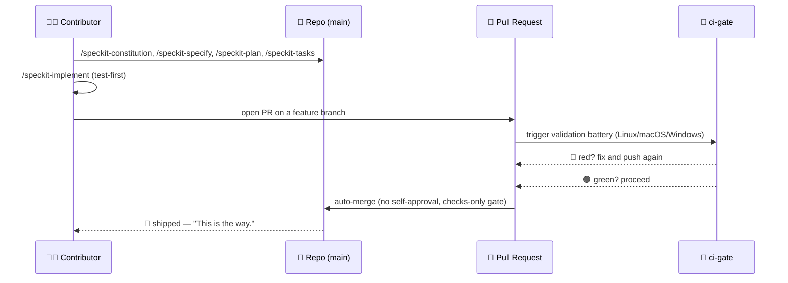
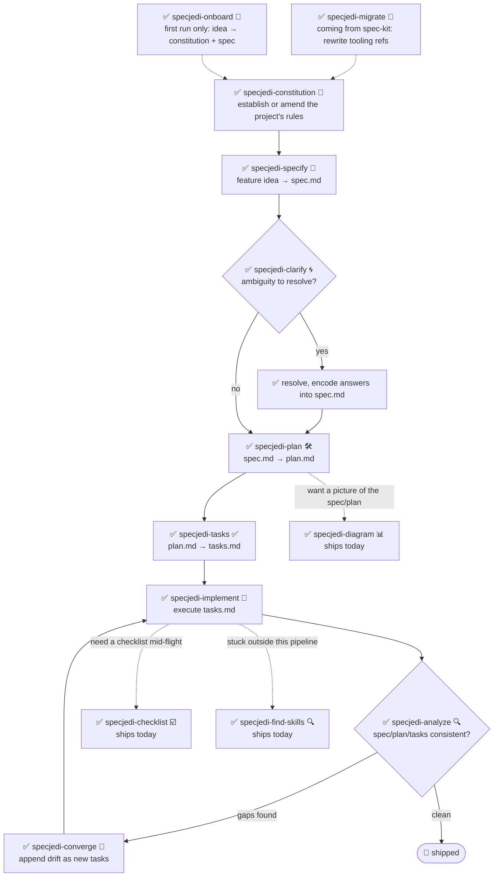

<!-- i18n-sync: source=README.md@402bb58 lang=hi -->
> 🌐 यह दस्तावेज़ AI-सहायता प्राप्त अनुवाद है। **अंग्रेज़ी मूल स्रोत है**
> ([Principle I](../../../.specify/memory/constitution.md))；किसी भी विरोधाभास की
> स्थिति में अंग्रेज़ी संस्करण मान्य होगा। अन्य भाषाएँ देखें:
> [English](../../../README.md) · [中文](../zh/README.md) ·
> [हिन्दी](../hi/README.md) · [Español](../es/README.md) ·
> [Français](../fr/README.md) · [العربية](../ar/README.md) ·
> [বাংলা](../bn/README.md) · [Português](../pt/README.md) · [Русский](../ru/README.md) · [اردو](../ur/README.md) · [Bahasa Indonesia](../id/README.md)

# 🗡️ Spec Jedi

[](https://github.com/jonyfs/spec-jedi/actions/workflows/validate.yml)
[](../../../LICENSE)
[](../../../.specify/memory/constitution.md)
[](#आज-आपको-क्या-मिलता-है)
[](#आज-आपको-क्या-मिलता-है)
[](../../../references/skill-roadmap.md)
[](#इंस्टॉलेशन)
[](../../../docs/i18n/)
[](../../../.specify/memory/constitution.md)
[](https://github.com/jonyfs/spec-jedi/commits/main)

> *"पहले स्पेसिफिकेशन। फिर कोड। यही तरीका है।"* — एक बुद्धिमान मास्टर,
> शायद।

Spec Jedi, Spec-Driven Development (SDD) skills का एक सेट है जिसे आप अपने
पसंदीदा कोडिंग एजेंट में इंस्टॉल करते हैं। पहले कोड लिखने और बाद में उसका
दस्तावेज़ीकरण करने के बजाय, आप एक **constitution** 📜 (आपके प्रोजेक्ट के
गैर-परक्राम्य नियम), एक **specification** 🎯 (आप क्या बना रहे हैं और
क्यों), एक **plan** 🛠️ (तकनीकी रूप से कैसे), और एक **task list** ✅
(क्रमबद्ध चरण) लिखते हैं — और आपका एजेंट बिना प्रशिक्षण के Padawan की तरह
सुधार करने के बजाय इन्हीं artifacts के आधार पर काम करता है।

यह repository खुद भी उसी अनुशासन के साथ बनाया गया है जिसे यह देता है:
इसका अपना [constitution](../../../.specify/memory/constitution.md) इस
बात का प्रामाणिक स्रोत है कि प्रोजेक्ट कैसे व्यवहार करता है — जिसमें
releases का version कैसे तय होता है और pull requests कैसे validate और
merge होते हैं, शामिल है। यहाँ vibe-coding के Dark Side की तरफ कोई
शॉर्टकट नहीं है। 🚫🖤

*(यह गैर-आधिकारिक, फैन-प्रेरित branding है — Spec Jedi का Lucasfilm/Disney
से कोई संबंध, समर्थन या प्रायोजन नहीं है। Spec आपके साथ रहे। 🌌)*

## यह किसके लिए है

कोई भी व्यक्ति जो AI कोडिंग एजेंट का उपयोग करता है और चाहता है कि specs,
plans और tasks डिस्पोज़ेबल chat messages के बजाय first-class, versioned
artifacts हों — independent developers, वे teams जो अपने एजेंट्स के काम
करने के तरीके को standardize कर रही हैं, और हर वो व्यक्ति जो हर session
में project context दोबारा समझाते-समझाते थक चुका है।

## आज आपको क्या मिलता है

Spec Jedi, [spec-kit](https://github.com/github/spec-kit) का असली
**प्रतिस्पर्धी** है, इसका themed wrapper नहीं
([Principle XV](../../../.specify/memory/constitution.md))। पूरा
`specjedi-*` SDD pipeline — constitution से लेकर convergence तक —
**पूरा हो चुका है और उपलब्ध है**: सभी 9 चरण,
[research.md](../../../specs/001-specjedi-pipeline/research.md) के
competitive research अनुशासन (Principle II) के अनुसार, एक-एक करके सावधानी
से बनाए गए, कभी जल्दबाज़ी में नहीं।

**आज ही उपलब्ध, इंस्टॉल करें और इस्तेमाल करें:**

| Skill | यह क्या करती है |
|---|---|
| `specjedi-onboard` 🌱 | बिल्कुल नए प्रोजेक्ट के लिए first-run walkthrough — एक साथ एक वास्तविक पहला `constitution.md` और `spec.md` तैयार करती है, हर SDD अवधारणा को ठीक उसी समय सिखाती है जब उसकी ज़रूरत हो। अगर onboarding पहले ही हो चुकी है तो तुरंत रास्ता छोड़ देती है |
| `specjedi-constitution` 📜 | किसी प्रोजेक्ट के गैर-परक्राम्य नियम स्थापित या संशोधित करती है — वह नींव जिसके आधार पर हर दूसरी `specjedi-*` skill खुद को जाँचती है। [spec](../../../specs/001-specjedi-pipeline/spec.md) देखें |
| `specjedi-specify` 🎯 | एक feature idea — एक वाक्य ही काफी है — को प्राथमिकता-क्रमित, स्वतंत्र रूप से परीक्षण-योग्य `spec.md` में बदलती है, अनुमान लगाने के बजाय वास्तविक अस्पष्टता को चिह्नित करती है |
| `specjedi-clarify` 🌀 | किसी spec को वास्तविक अस्पष्टता के लिए स्कैन करती है और अधिकतम 5 प्राथमिकता-क्रमित प्रश्न पूछती है — हर एक के साथ एक अनुशंसित उत्तर, ताकि beginner को मार्गदर्शन मिले और expert एक शब्द में जवाब दे सके — किसी अनुमान के आधार पर plan बनाने से पहले |
| `specjedi-plan` 🛠️ | स्पष्ट किए गए spec को तकनीकी `plan.md` में बदलती है — पहले वास्तविक codebase में मौजूद conventions को स्कैन करती है, ताकि implementation को कभी रुककर पहले से मौजूद pattern खोजने की ज़रूरत न पड़े |
| `specjedi-tasks` ✅ | plan को क्रमबद्ध, dependency-aware `tasks.md` में तोड़ती है, user story के अनुसार group किया गया — जहाँ भी plan कोड की माँग करता है, वहाँ implementation task से पहले असफल test task रखती है |
| `specjedi-implement` 🔨 | dependency क्रम में `tasks.md` को execute करती है, जहाँ plan कोड की माँग करता है वहाँ test-first — केवल feature branch और pull request के माध्यम से commit करती है, कभी सीधे `main` पर नहीं |
| `specjedi-analyze` 🔍 | `spec.md`/`plan.md`/`tasks.md` (और constitution) की सख्ती से केवल-पढ़ने योग्य cross-check — gaps, duplication और contradictions के लिए — findings रिपोर्ट करती है, कभी किसी फ़ाइल को edit नहीं करती |
| `specjedi-checklist` ☑️ | किसी नामित focus area (security, accessibility, performance...) के लिए custom checklist बनाती है, पूरी तरह इस feature के अपने `spec.md`/`plan.md` पर आधारित — कभी generic boilerplate नहीं |
| `specjedi-converge` 🔁 | manual बदलावों के बाद वास्तविक codebase और `tasks.md` के बीच drift का पता लगाती है, किसी भी gap को चुपचाप नज़रअंदाज़ करने के बजाय नए task के रूप में जोड़ती है — `specjedi-implement` की ओर loop बंद करती है |
| `specjedi-find-skills` 🔍 | जब आपका अनुरोध किसी ऐसे domain को छूता है जिसे installed set अच्छी तरह कवर नहीं करता, तो एक specific, verified skill सुझाती है — पहले पूछे बिना कभी इंस्टॉल नहीं करती ([Principle XVII](../../../.specify/memory/constitution.md)) |
| `specjedi-explain` 🎓 | किसी भी SDD अवधारणा या command को समझाती है, आप कितने अनुभवी लगते हैं उसके अनुसार कैलिब्रेट करके — पूर्ण beginner से लेकर रोज़ाना अभ्यास करने वाले तक, कभी दोनों को एक जैसा जवाब नहीं देती ([Principle XIX](../../../.specify/memory/constitution.md)) |
| `specjedi-migrate` 🔄 | आपके अपने constitution/spec/plan/tasks में मौजूद literal `/speckit-*` tooling references को उनके `specjedi-*` समकक्षों में बदलती है — कभी principle या requirement content को नहीं छूती, केवल स्पष्ट अनुरोध पर |
| `specjedi-diagram` 📊 | किसी मौजूदा `spec.md`/`plan.md` से render-verified Mermaid diagram बनाती है (flowchart, sequence, या ER — content से अनुमानित) — हमेशा मूल प्रोज़ का पूरक, कभी उसकी जगह नहीं |
| `specjedi-status` 🧭 | project-wide dashboard जो हर feature की स्थिति दिखाता है, पूरी तरह डिस्क पर मौजूद `spec.md`/`plan.md`/`tasks.md` artifacts से derived — कोई अलग से maintain किया गया tracking system नहीं, कभी "stalled" को तथ्य के रूप में नहीं बताती |
| `specjedi-retro` 🪞 | सख्ती से केवल-पढ़ने योग्य retrospective जो किसी पूर्ण हुए feature के वास्तविक implementation की तुलना उसके `plan.md` से करती है — किसी भी deviation के कारण को वास्तविक git history में आधार देती है, कभी कोई कारण नहीं गढ़ती, एक स्थायी dated entry लॉग करती है |
| `specjedi-security` 🛡️ | auth/input validation/secrets/data-privacy gaps के लिए हल्का, proactive "क्या हमने X के बारे में सोचा" prompt — `specjedi-plan` द्वारा self-invoked, कभी पूर्ण security review होने का दावा नहीं करती |
| `specjedi-docs` 📚 | किसी shipped feature के spec/plan से README skill-table row, Quickstart step, और `CHANGELOG.md` entry का draft तैयार करती है — वास्तविक content पर आधारित, लिखने से पहले हमेशा confirmation के लिए दिखाती है |
| `specjedi-new-skill` 🌟 | नई `specjedi-*` skill की file structure तैयार करती है — केवल placeholders, कभी गढ़ा हुआ content नहीं — इस प्रोजेक्ट के अपने Skill Authoring Standard का पालन करते हुए और Principle II की research checklist शामिल करते हुए |
| `specjedi-release` 🚀 | `scripts/suggest-release.sh` को Spec Jedi की अपनी आवाज़ में लपेटती है — अंतिम tag, सुझाई गई अगली version, और योगदान देने वाले commits बताती है; अगर वाकई release काटने के लिए कहा जाए तो मना करती है और exact manual command बताती है |
| `specjedi-skill-review` 🎓 | किसी `specjedi-*` skill के `SKILL.md` की Skill Authoring Standard के विरुद्ध सख्ती से केवल-पढ़ने योग्य audit — केवल headings नहीं बल्कि section content जाँचती है, वैध exemptions के लिए matching `plan.md` से cross-reference करती है, findings या clean pass रिपोर्ट करती है, कभी reviewed फ़ाइल को edit नहीं करती |
| `specjedi-tokencheck` 🎒 | proactively जाँचती है कि `rtk` और `graphify` इंस्टॉल हैं या नहीं, जो कमी है उसे और उसकी अपेक्षित token बचत को समझाती है, और installation walkthrough देती है — `specjedi-onboard` के first-run flow से self-invoked, अकेले भी चलती है; स्पष्ट पुष्टि के बिना कभी कुछ इंस्टॉल नहीं करती |
| `specjedi-govcheck` ⚖️ | सभी 20 constitution principles के विरुद्ध सख्ती से केवल-पढ़ने योग्य per-PR/per-branch governance checklist — three-state रिपोर्ट (N/A / Compliant / Non-Compliant), कोई भी conflict CRITICAL — PR खोलने से पहले `specjedi-implement` द्वारा self-invoked (कभी उसे रोकती नहीं), current branch या नामित PR पर अकेले भी चलती है |

core pipeline से आगे क्या प्रस्तावित है (diagrams, और अधिक) इसके लिए
[`references/skill-roadmap.md`](../../../references/skill-roadmap.md)
देखें — यह *अतिरिक्त* skills का backlog है, core pipeline में कोई कमी
नहीं; हर एक को बनने से पहले अपनी खुद की research पास चाहिए।

## Spec Jedi कैसे कॉमिक रूप में *खुद को* बनाता है

> ⚠️ **यह section हमारी internal bootstrap प्रक्रिया के बारे में है, Spec
> Jedi product के बारे में नहीं।** नीचे दिए गए `/speckit-*` commands
> [spec-kit](https://github.com/github/spec-kit) के अपने tools हैं — Spec
> Jedi फ़िलहाल खुद को बनाने के लिए spec-kit का उपयोग करता है (वही "पुराने
> compiler से नया compiler बनाने" वाला pattern), जिस तरह कोई भी
> प्रतिस्पर्धी अपना replacement बनाते समय किसी established tool का उपयोग
> कर सकता है। **अगर आप Spec Jedi को product के रूप में evaluate कर रहे
> हैं, तो सीधे नीचे [आज आपको क्या मिलता है](#आज-आपको-क्या-मिलता-है) पर
> जाएँ** — असली product surface `specjedi-*` skills हैं, ये नहीं। पूरी
> policy के लिए कि इन्हें स्पष्ट रूप से अलग क्यों रखा गया है, देखें
> [Principle XV](../../../.specify/memory/constitution.md)।
>
> साथ ही, format पर एक नोट: ये text-and-emoji comic panels हैं, generated
> artwork नहीं। असली Star Wars imagery (characters, ships, logo)
> Lucasfilm/Disney का IP है — इस प्रोजेक्ट का अपना
> [Principle XII](../../../.specify/memory/constitution.md) केवल text
> references का उपयोग करने की प्रतिबद्धता रखता है, copyrighted art कभी
> reproduce नहीं करता। तो: story beats असली हैं, panels Markdown हैं। 🖋️

---

**PANEL 1 — एक अकेला terminal, cursor blink कर रहा है।**
> 🧑‍💻 *"मेरे पास एक feature idea है। ...अब क्या?"*

**PANEL 2 — छाया से एक hooded figure निकलता है, हाथ में एक scroll लिए।**
> 🧙 *"पहले, Code।"* 📜
> `/speckit-constitution` — प्रोजेक्ट के गैर-परक्राम्य नियम, एक बार लिखे
> गए, हमेशा के लिए जाँचे जाते हैं।

**PANEL 3 — idea, दीवार पर टँगा हुआ, question marks उसके चारों तरफ़ घूम रहे हैं।**
> 🌀 *"तुम असल में क्या बना रहे हो — और किसके लिए?"*
> `/speckit-specify` idea को `spec.md` में बदलती है। `/speckit-clarify`
> ambiguity के bug बनने से पहले उसे ढूँढ निकालती है।

**PANEL 4 — एक workbench पर blueprint खुलता है।**
> 🛠️ *"अब 'कैसे' की बारी।"*
> `/speckit-plan` → `plan.md`। `/speckit-tasks` → एक क्रमबद्ध,
> dependency-aware `tasks.md`। कोई step नहीं छूटा, कोई step क्रम से बाहर
> नहीं।

**PANEL 5 — Tools गूँज रहे हैं, tests लाल होकर fail हो रहे हैं, फिर एक-एक करके हरे हो रहे हैं।**
> 🤖 *"पहले tests। हमेशा पहले tests।"*
> `/speckit-implement` `tasks.md` को execute करती है, जहाँ लागू हो वहाँ
> test-first ([Principle VI](../../../.specify/memory/constitution.md))।

**PANEL 6 — एक council chamber। एक pull request bench के सामने खड़ा है।**
> 🏛️ *"अपने बदलाव बताओ।"*
> एक PR खुलता है। `ci-gate` 🤖 पूरी validation battery चलाता है — हर OS,
> हर check। self-approval की अनुमति नहीं; machine खुद को माफ़ नहीं कर
> सकती, और तुम भी नहीं
> ([Principle X](../../../.specify/memory/constitution.md))।

**PANEL 7 — Green light। Gate खुद-ब-खुद खुल जाता है।**
> ✅ *"battery बोल चुकी है।"*
> सभी checks pass → auto-merge, किसी इंसान को button click नहीं करना पड़ा।

**PANEL 8 — एक ship hyperspace में छलांग लगाता है।**
> 🚀 *"Shipped।"*
> 🌌 *"Spec आपके साथ रहे।"*

### वही internal-bootstrap story, diagram के रूप में



## आवश्यकताएँ

Spec Jedi **Linux, macOS, और Windows** पर विकसित और validate किया जाता है
(Constitution [Principle XIII](../../../.specify/memory/constitution.md))
— `scripts/` के अंतर्गत हर script दोनों रूपों में उपलब्ध है: POSIX shell
(`.sh`) और native PowerShell (`.ps1`), और CI हर PR पर तीनों operating
systems पर battery चलाता है।

- `git`
- एक supported coding agent (नीचे
  [Supported harnesses](#समर्थित-harnesses) देखें)
- [GitHub CLI (`gh`)](https://cli.github.com/), केवल तभी अगर आप pull
  request के माध्यम से बदलाव contribute करने की योजना बना रहे हैं
- केवल अगर आप helper scripts को locally चलाना चाहते हैं (optional —
  coding agent को खुद इनकी ज़रूरत नहीं है): एक POSIX shell (bash/zsh,
  Linux और macOS पर by default मौजूद) **या**
  [PowerShell 7+](https://aka.ms/powershell) (`pwsh`), जो तीनों operating
  systems पर चलता है

## इंस्टॉलेशन

### Claude Code (आज पूरी तरह समर्थित)

Clone step OS के अनुसार थोड़ा अलग है; उसके बाद सब कुछ identical है।

**Linux / macOS** (Terminal):

```bash
git clone https://github.com/jonyfs/spec-jedi.git
cd spec-jedi
```

**Windows — native PowerShell** (WSL की ज़रूरत नहीं):

```powershell
git clone https://github.com/jonyfs/spec-jedi.git
cd spec-jedi
```

**Windows — WSL या Git Bash** (अगर आप Windows पर Unix-जैसा shell पसंद
करते हैं):

```bash
git clone https://github.com/jonyfs/spec-jedi.git
cd spec-jedi
```

दोनों Windows रास्ते समान रूप से अच्छे से काम करते हैं — जो भी आप रोज़
इस्तेमाल करते हैं वही चुनें। आगे बस इतना फ़र्क़ पड़ता है कि आप कौन सा
helper script चलाते हैं (POSIX shell में `scripts/*.sh`, native
PowerShell में `scripts/*.ps1`); skills खुद दोनों तरह से identical काम
करती हैं।

1. अपने OS के लिए ऊपर दिए गए block का उपयोग करके repository clone करें।

2. [Claude Code](https://claude.com/claude-code) में folder खोलें। Claude
   Code `.claude/skills/*/SKILL.md` के अंतर्गत हर skill को अपने आप
   discover करता है — कोई अलग install step या build process नहीं है, और
   यह step तीनों operating systems पर identical है।

3. Claude Code prompt में `/` टाइप करके पुष्टि करें कि skills load हो
   गई हैं। आपको सभी 23 `specjedi-*` product skills और `speckit-*`
   commands (इस repository का अपना internal bootstrap tooling — देखें
   [आज आपको क्या मिलता है](#आज-आपको-क्या-मिलता-है)) एक साथ सूचीबद्ध
   दिखेंगे, क्योंकि Claude Code `.claude/skills/` के अंतर्गत हर skill को
   बिना दोनों में फ़र्क़ किए discover करता है।

4. बस इतना ही — अब आप guided first run के लिए `specjedi-onboard` चला सकते
   हैं, अगर पता नहीं कहाँ से शुरू करें तो `specjedi-explain` से कुछ भी पूछ
   सकते हैं, या यह समझने के लिए constitution पढ़ सकते हैं कि बाक़ी
   pipeline किस दिशा में जा रहा है।

**इस project के अलावा किसी और project में Spec Jedi इस्तेमाल कर रहे हैं?**
Installer चलाएँ (Constitution
[Principle XVIII](../../../.specify/memory/constitution.md)) — यह केवल
`specjedi-*` product skills copy करता है, `speckit-*` bootstrap tooling
कभी नहीं, साथ ही चार `.specify/templates/*.md` फ़ाइलें जिनकी इन skills को
ज़रूरत होती है, और खत्म करने से पहले result को validate करता है:

```bash
# Spec Jedi checkout से, disk पर किसी और project को target करते हुए
./scripts/install.sh /path/to/your-project
```

```powershell
# Windows native PowerShell
.\scripts\install.ps1 -TargetDir C:\path\to\your-project
```

आज केवल `-harness claude-code` (default) ही बनाया और test किया गया है;
कोई भी दूसरी value को चुपचाप try करने के बजाय not-yet-supported के रूप में
रिपोर्ट किया जाता है — नीचे
[Supported harnesses](#समर्थित-harnesses) देखें। पूरी option list के लिए
`./scripts/install.sh --help` (या `.\scripts\install.ps1 -Help`) चलाएँ।

### समर्थित harnesses

Spec Jedi का constitution
([Principle III](../../../.specify/memory/constitution.md)) इस project
को अंततः market के बीस सबसे ज़्यादा इस्तेमाल किए जाने वाले LLM coding
tools/harnesses को support करने के लिए प्रतिबद्ध करता है। आज, केवल ऊपर
वाला रास्ता (Claude Code) पूरी तरह build, test, और document किया गया है।

| Harness | स्थिति |
|---|---|
| Claude Code | ✅ Supported — ऊपर दिए गए steps देखें |
| Cursor | 📋 Planned — अभी installable नहीं |
| GitHub Copilot (Chat/Workspace) | 📋 Planned — अभी installable नहीं |
| Codex CLI (OpenAI) | 📋 Planned — अभी installable नहीं |
| Gemini CLI | 📋 Planned — अभी installable नहीं |
| Antigravity (Google) | 📋 Planned — अभी installable नहीं |
| Windsurf (Codeium) | 📋 Planned — अभी installable नहीं |
| Cline | 📋 Planned — अभी installable नहीं |
| Continue | 📋 Planned — अभी installable नहीं |
| Aider | 📋 Planned — अभी installable नहीं |
| Amazon Q Developer | 📋 Planned — अभी installable नहीं |
| JetBrains AI Assistant | 📋 Planned — अभी installable नहीं |
| Zed | 📋 Planned — अभी installable नहीं |
| OpenCode | 📋 Planned — अभी installable नहीं |
| Warp (Agent Mode) | 📋 Planned — अभी installable नहीं |
| Replit Agent | 📋 Planned — अभी installable नहीं |
| Devin (Cognition) | 📋 Planned — अभी installable नहीं |
| Tabnine | 📋 Planned — अभी installable नहीं |
| Sourcegraph Cody | 📋 Planned — अभी installable नहीं |
| Trae | 📋 Planned — अभी installable नहीं |

Principle III के "कम से कम बीस" mandate के अनुसार बीस harnesses अलग-अलग
नाम से सूचीबद्ध किए गए हैं — केवल status (✅ supported / 📋 planned), किसी
भी ऐसे harness के लिए कोई capability claim नहीं जिसे इस project ने वास्तव
में build और test नहीं किया है, Principle XX के hallucination-resistance
अनुशासन के अनुसार। "Planned" एक status है, वादा किया हुआ roadmap date
नहीं।

अगर आपका harness अभी supported के रूप में सूचीबद्ध नहीं है, तो
`SKILL.md` फ़ाइलें YAML frontmatter के साथ plain Markdown हैं — कई
harnesses जो custom instructions/prompts को support करते हैं वे इन्हें
dedicated install path के बिना भी सीधे पढ़ सकते हैं, पर यह अभी हर harness
के लिए अलग से verify और document नहीं किया गया है। हर harness की
desk-research capability notes के लिए देखें
[`references/harness-capability-notes.md`](../../../references/harness-capability-notes.md)।

जानना चाहते हैं कि Spec Jedi, spec-kit और उन दस अन्य SDD tools की तुलना
में कैसा है जिनके विरुद्ध इसे benchmark किया गया? देखें
[`references/competitive-comparison.md`](../../../references/competitive-comparison.md)।

## Quickstart

आज तेईस product skills उपलब्ध हैं
([आज आपको क्या मिलता है](#आज-आपको-क्या-मिलता-है)) — पूरा `specjedi-*`
pipeline पूरा हो चुका है। पहले कभी SDD tool इस्तेमाल नहीं किया? step 0 से
शुरू करें।

0. **पक्का नहीं कि इसका मतलब क्या है?** बस पूछें — "spec क्या है और मुझे
   इसकी ज़रूरत क्यों होगी", "यह project असल में करता क्या है"।
   `specjedi-explain` 🎓 आपको जितनी गहराई चाहिए उतनी गहराई से जवाब देती
   है, beginner हो या advanced, और हमेशा बताती है कि आगे क्या चलाना है
   ([Principle XIX](../../../.specify/memory/constitution.md))।
1. Install करें (ऊपर [इंस्टॉलेशन](#इंस्टॉलेशन) देखें)।
2. बिल्कुल नया project, पता नहीं कहाँ से शुरू करें? `specjedi-onboard`
   🌱 आपको एक वाक्य के idea से एक साथ एक वास्तविक पहला `constitution.md`
   और `spec.md` तैयार करने में मार्गदर्शन देती है, हर concept को तभी
   समझाती है जब उसकी वाकई ज़रूरत हो — कभी शुरुआत में documentation की
   दीवार नहीं। (नीचे step 3-4 वही है जो यह आपके लिए orchestrate करती है;
   अगर आप हर stage खुद चलाना चाहते हैं तो सीधे उन पर जाएँ।)
3. अपने project के नियम स्थापित करें: अपने non-negotiables को सादी भाषा
   में describe करें और `specjedi-constitution` 📜 एक versioned
   `.specify/memory/constitution.md` तैयार करती है — हर दूसरी
   `specjedi-*` skill इसी के विरुद्ध अपने output को जाँचती है।
4. किसी feature का spec बनाएँ: describe करें कि आप क्या बनाना चाहते हैं
   — एक मोटा-सा एक-वाक्य idea काफ़ी है — और `specjedi-specify` 🎯 इसे
   प्राथमिकता-क्रमित, स्वतंत्र रूप से परीक्षण-योग्य `spec.md` में बदलती
   है, अनुमान लगाने के बजाय वास्तविक ambiguity को चिह्नित करती है।
5. पक्का नहीं कि spec अभी ठोस है? `specjedi-clarify` 🌀 इसे वास्तविक
   ambiguity के लिए scan करती है और अधिकतम 5 प्राथमिकता-क्रमित प्रश्न
   पूछती है — हर एक के साथ एक अनुशंसित उत्तर, ताकि आप उसे एक शब्द में
   स्वीकार कर सकें या चाहें तो reasoning पढ़ सकें — किसी अनुमान के आधार
   पर plan बनने से पहले।
6. "कैसे" design करने के लिए तैयार हैं? `specjedi-plan` 🛠️ पहले आपके
   वास्तविक codebase को मौजूदा conventions के लिए scan करती है, फिर
   स्पष्ट किए गए spec को तकनीकी `plan.md` में बदलती है — ताकि
   implementation को कभी रुककर आपके project में कहीं और पहले से मौजूद
   pattern खोजने की ज़रूरत न पड़े। अगर आपका spec auth, external input,
   secrets, या data handling को छूता है, तो `specjedi-security` 🛡️
   अपने आप कुछ लक्षित "क्या हमने X के बारे में सोचा" प्रश्नों के साथ
   trigger होती है — एक हल्का prompt, कभी पूर्ण security review नहीं।
7. इसे काम में तोड़ने के लिए तैयार हैं? `specjedi-tasks` ✅ plan को
   क्रमबद्ध, dependency-aware `tasks.md` में बदलती है, user story के
   अनुसार group किया गया — जहाँ भी plan code की माँग करता है, वहाँ
   implementation task से पहले असफल test task रखती है।
8. इसे बनाने के लिए तैयार हैं? `specjedi-implement` 🔨 dependency क्रम
   में `tasks.md` को execute करती है, जहाँ plan code की माँग करता है वहाँ
   test-first — हर commit एक feature branch और pull request पर जाता है,
   कभी सीधे `main` पर नहीं।
9. एक safety net चाहिए? `specjedi-analyze` 🔍 `spec.md`, `plan.md`, और
   `tasks.md` (और आपके constitution) को gaps, duplication, या
   contradictions के लिए cross-check करती है — सख्ती से केवल-पढ़ने
   योग्य, कभी भी चलाई जा सकती है, कभी किसी फ़ाइल को edit नहीं करती।
10. एक targeted review चाहिए? `specjedi-checklist` ☑️ किसी नामित focus
    area — security, accessibility, performance, जो भी आप नाम दें — के
    लिए checklist बनाती है, पूरी तरह इस feature के अपने spec/plan पर
    आधारित, कभी generic boilerplate नहीं।
11. अपने आखिरी `tasks.md` के बाद हाथ से code बदला? `specjedi-converge`
    🔁 वास्तविक codebase को scan करती है, बिना corresponding task वाली
    किसी भी capability का पता लगाती है, और उसे चुपचाप drift होने देने के
    बजाय नए काम के रूप में जोड़ती है — pipeline का आख़िरी stage,
    `specjedi-implement` की ओर loop बंद करते हुए।
12. इस set के बाहर किसी चीज़ में अटक गए? बस उसे describe करें — "मैं X
    कैसे करूँ", "क्या X के लिए कोई skill है" — और `specjedi-find-skills`
    🔍 अपने आप trigger होती है, open agent-skills ecosystem में खोजती
    है, और एक specific, verified skill सुझाती है। पहले पूछे बिना कभी कुछ
    इंस्टॉल नहीं करती
    ([Principle VIII](../../../.specify/memory/constitution.md))।
13. किसी मौजूदा spec-kit project से आ रहे हैं? `specjedi-migrate` 🔄
    आपके अपने project के `/speckit-*` tooling references को उनके
    `specjedi-*` समकक्षों में बदलती है — कभी किसी principle या
    requirement को नहीं छूती, केवल स्पष्ट अनुरोध पर।
14. prose की दीवार के बजाय एक picture चाहिए? `specjedi-diagram` 📊 किसी
    spec या plan को render-verified Mermaid diagram में बदलती है —
    flowchart, sequence, या ER, जो भी वास्तविक content माँगे — हमेशा
    source प्रोज़ के साथ, कभी उसकी जगह नहीं।
15. एक-दो से ज़्यादा features को एक साथ संभाल रहे हैं? `specjedi-status`
    🧭 एक project-wide dashboard दिखाती है — कौन-से features specified,
    planned, in progress, या complete हैं — पूरी तरह disk पर वास्तव में
    मौजूद चीज़ों से derived, sync में रखने के लिए कोई अलग tracking
    system नहीं।
16. अभी-अभी कोई feature खत्म किया? `specjedi-retro` 🪞 वास्तव में shipped
    हुई चीज़ की तुलना `plan.md` में कही गई बात से करती है, किसी भी
    deviation के कारण को वास्तविक git history में आधार देती है — कभी
    कोई कारण नहीं गढ़ती — और एक स्थायी entry log करती है ताकि signal इस
    conversation के बाद भी बना रहे।
17. कुछ ship किया और उसे document करना है? `specjedi-docs` 📚 आपके लिए
    README row, Quickstart step, और `CHANGELOG.md` entry का draft तैयार
    करती है — आपके वास्तविक spec/plan पर आधारित, कुछ भी लिखने से पहले
    हमेशा confirmation के लिए दिखाती है।
18. Spec Jedi को खुद एक नई skill के साथ extend कर रहे हैं?
    `specjedi-new-skill` 🌟 file structure का skeleton तैयार करती है —
    `specs/`, `SKILL.md` skeleton, हर section एक labeled placeholder —
    आपकी ओर से कभी research findings या behavior नहीं गढ़ती।
19. सोच रहे हैं कि release का समय आ गया है? `specjedi-release` 🚀
    `scripts/suggest-release.sh` के अपने सुझाव को narrate करती है —
    आख़िरी tag, अगली version, योगदान देने वाले commits — और अगर आप
    उससे वाकई release काटने के लिए कहें तो exact manual command बताते
    हुए मना करती है; खुद कभी tag या publish नहीं करती।
20. हाथ से कोई `specjedi-*` skill लिखी या बदली? `specjedi-skill-review`
    🎓 उसके `SKILL.md` को Skill Authoring Standard के विरुद्ध जाँचती है
    — केवल headings नहीं बल्कि section content, वैध exemptions के लिए
    matching `plan.md` से cross-referenced — और findings या clean pass
    रिपोर्ट करती है; कभी फ़ाइल को खुद edit नहीं करती।
21. `specjedi-onboard` पहली बार इस्तेमाल पर आपके लिए यह एक बार पहले ही
    चला देती है, पर `specjedi-tokencheck` 🎒 अकेले भी काम करती है —
    जाँचती है कि `rtk` और `graphify` इंस्टॉल हैं या नहीं, जो कमी है उसे
    और उसकी अपेक्षित token बचत को समझाती है, और installation में गाइड
    करने की पेशकश करती है; आपकी स्पष्ट सहमति के बिना कभी कुछ इंस्टॉल
    नहीं करती।
22. `specjedi-implement` हर PR खोलने से पहले यह पहले ही चला देती है, पर
    `specjedi-govcheck` ⚖️ अकेले भी काम करती है — सभी 20 constitution
    principles के विरुद्ध per-branch (या per-PR) checklist, हर एक को
    not applicable, compliant, या non-compliant के रूप में रिपोर्ट
    करती है, किसी भी वास्तविक conflict को CRITICAL चिह्नित करती है;
    सख्ती से केवल-पढ़ने योग्य, कभी कुछ edit नहीं करती, कभी खुद PR को
    खुलने से नहीं रोकती।

[Principle XIV](../../../.specify/memory/constitution.md) के अनुसार, आपने
अभी जो भी चलाया है उसे आपको बताना चाहिए कि आगे क्या चलाना है — इसे पता
लगाने के लिए आपको इस list पर वापस आने की ज़रूरत नहीं होनी चाहिए। पूरी
chain `specjedi-onboard` (केवल पहली बार) → `specjedi-constitution` →
`specjedi-specify` → `specjedi-clarify` → `specjedi-plan` →
`specjedi-tasks` → `specjedi-implement` → `specjedi-analyze` →
`specjedi-checklist` → `specjedi-converge` चलाती है, जब भी
`specjedi-converge` को निपटाने के लिए drift मिलता है तो
`specjedi-implement` की ओर वापस loop करती है।

### पूरा pipeline, शुरू से अंत तक

Onboarding से convergence तक — नीचे हर stage live है:



✅ = आज उपलब्ध है — पूरा 9-stage `specjedi-*` pipeline पूरा हो चुका है,
साथ ही `specjedi-onboard` guided first-run entry point के रूप में।

## अनुशंसित companions

इस project का constitution
([Principle VIII](../../../.specify/memory/constitution.md)) हर Spec
Jedi session को दो token-saving companions को proactively सुझाने का
निर्देश देता है, पर उन्हें कभी चुपचाप install करने का नहीं:

- [`rtk`](https://github.com/rtk-ai/rtk) — आम dev operations के लिए एक
  token-optimized CLI proxy।
- [`graphify`](https://graphify.net/) — codebase को queryable knowledge
  graph में बदलता है।

अगर आपका agent इनमें से किसी को install या configure करने की पेशकश करता
है, तो यह इसी policy का असर है — आपसे हमेशा पहले पूछा जाता है।

**graphify पहले से ही इस repository में जुड़ा हुआ है** (maintainer की
पुष्टि के साथ): `CLAUDE.md` में एक `## graphify` section Claude Code को
source browse करने से पहले knowledge graph से consult करने और code
बदलावों के बाद उसे refresh करने के लिए कहता है, और
`.claude/settings.json` hooks register करता है जो graph मौजूद होने पर
raw grep/read के बजाय tool calls को `graphify query`/`explain`/`path` की
तरफ़ ले जाते हैं। Graph खुद (`graphify-out/`) commit नहीं किया जाता — यह
एक derived cache है, हर clone पर फिर से generate होता है।

Clone करने के बाद locally वही auto-updating behavior पाने के लिए:

```bash
pip install graphifyy   # या: uv tool install graphifyy
graphify .               # पहला build (केवल एक बार ज़रूरी; वैसे भी पहले उपयोग पर अपने आप चलता है)
graphify hook install    # हर commit के बाद graph.json को अपने आप rebuild करता है (code बदलाव)
```

Doc/content बदलाव commit hook द्वारा पकड़े नहीं जाते — non-code files
edit करने के बाद `graphify update .` चलाएँ (या बस अपने agent से कहें)।

## Versioning और releases

Spec Jedi अपनी releases के लिए [Semantic Versioning](https://semver.org/)
का पालन करता है, जो public skill-package contract तक सीमित है (breaking
skill behavior = MAJOR, नई skills या additive capability = MINOR,
fixes/docs = PATCH)। पूरी policy के लिए
[Principle XI](../../../.specify/memory/constitution.md) देखें।

Project suggest करता है कि कब release justified है, बजाय इसके कि चुपचाप
एक काट दी जाए:

```bash
# Linux / macOS / Windows (WSL या Git Bash)
./scripts/suggest-release.sh
```

```powershell
# Windows (native PowerShell)
./scripts/suggest-release.ps1
```

यह आख़िरी tag के बाद से commits को inspect करता है और अगली version की
सिफ़ारिश करता है — यह खुद कभी कुछ tag या publish नहीं करता। वास्तव में
release काटना हमेशा एक जान-बूझकर, maintainer-driven step होता है।

## Contributing

नए skills के लिए competitive research requirements, Skill Authoring
Standard checklist, और PR खोलने से पहले चलाने वाले validation steps सहित
पूरी contribution process के लिए
[`CONTRIBUTING.md`](./CONTRIBUTING.md) देखें।

हर बदलाव इस project की अपनी CI battery द्वारा validate किए गए pull
request के माध्यम से ship होता है, और तभी auto-merge होता है जब हर check
green हो जाए (देखें
[Principle IX और X](../../../.specify/memory/constitution.md))। वह
battery हर PR पर Linux, macOS, और Windows पर चलती है (Principle XIII) —
अगर आप `scripts/` के अंतर्गत कोई script जोड़ते या बदलते हैं, तो `.sh` और
`.ps1` दोनों versions मौजूद होने चाहिए और तीनों पर pass होने चाहिए। Issue
और PR templates (`.github/ISSUE_TEMPLATE/`,
`.github/PULL_REQUEST_TEMPLATE.md`) contributors को review के लिए
request करने से पहले ऊपर बताए गए research और validation steps पूरे करने
की पुष्टि कराते हैं।

## License

[MIT](../../../LICENSE) — इस project के अपने constitution द्वारा चुना और
आवश्यक (Distribution & Ecosystem Standards)। सादी भाषा में, MIT का मतलब
है कि आप:

- इस project का **उपयोग** कर सकते हैं, व्यावसायिक रूप से या अन्यथा,
  बिना किसी प्रतिबंध के।
- इसे जैसे चाहें **संशोधित** कर सकते हैं।
- इसे **पुनर्वितरित** कर सकते हैं, यहाँ तक कि किसी ऐसी चीज़ के हिस्से के
  रूप में जिसे आप बेचते हैं।

असली शर्तें बस इतनी हैं: अपनी copy में कहीं original copyright notice और
license text रखें, और किसी warranty की उम्मीद न करें — software "as is"
दिया जाता है, कुछ टूटने पर कोई liability नहीं। यही पूरा deal है; exact
legal text के लिए [`LICENSE`](../../../LICENSE) देखें।

---
