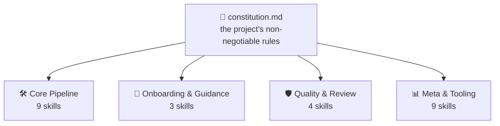
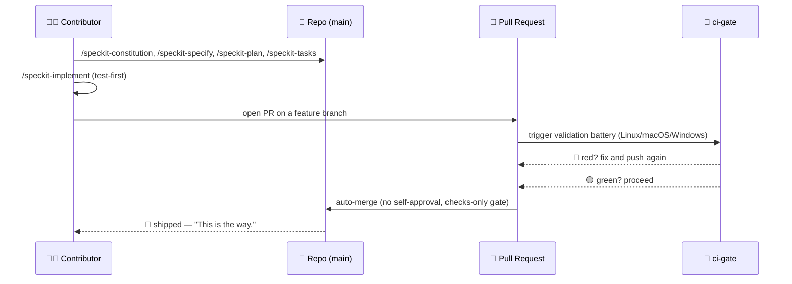

<!-- i18n-sync: source=README.md@1609524 lang=hi -->
> 🌐 यह दस्तावेज़ AI-सहायता प्राप्त अनुवाद है। **अंग्रेज़ी मूल स्रोत है**
> ([Principle I](../../../.specify/memory/constitution.md))；किसी भी विरोधाभास की
> स्थिति में अंग्रेज़ी संस्करण मान्य होगा। अन्य भाषाएँ देखें:
> [English](../../../README.md) · [中文](../zh/README.md) ·
> [हिन्दी](../hi/README.md) · [Español](../es/README.md) ·
> [Français](../fr/README.md) · [العربية](../ar/README.md) ·
> [বাংলা](../bn/README.md) · [Português](../pt/README.md) · [Русский](../ru/README.md) · [اردو](../ur/README.md) · [Bahasa Indonesia](../id/README.md)

# Spec Jedi

[](https://github.com/jonyfs/spec-jedi/actions/workflows/validate.yml)
[](../../../LICENSE)
[](../../../.specify/memory/constitution.md)
[](#spec-jedi-sdd-को-कैसे-implement-करता-है)
[](#spec-jedi-sdd-को-कैसे-implement-करता-है)
[](../../../references/skill-roadmap.md)
[](#इंस्टॉलेशन)
[](../../../docs/i18n/)
[](../../../.specify/memory/constitution.md)
[](https://github.com/jonyfs/spec-jedi/commits/main)

> *"पहले स्पेसिफिकेशन। फिर कोड। यही तरीका है।"* — एक बुद्धिमान मास्टर,
> शायद।


**एक चिट्ठी, एक Master की ओर से उस हर किसी के लिए जो अगली बार यह scroll उठाए:**

ज़्यादातर projects जो अपनी ही योजना से आगे निकल जाते हैं, उनकी जड़ में एक ही
वजह होती है: पहले कोड, बाद में explanation — और वह "बाद में" कभी सच में आता ही
नहीं। आगे जो है वह इसी क्रम को पलटने वाली practice है, और वह असली project जो
इसी को अमल में लाने के लिए बनाया गया है।

*(यह गैर-आधिकारिक, फैन-प्रेरित branding है — Spec Jedi का Lucasfilm/Disney
से कोई संबंध, समर्थन या प्रायोजन नहीं है। Spec आपके साथ रहे। 🌌)*

## Spec-Driven Development क्या है?

AI कोडिंग एजेंट के साथ software बनाने का आम तरीका ऐसा दिखता है: chat में
बताएँ कि आपको क्या चाहिए, एजेंट code लिखता है, आप code पढ़कर यह पता लगाते हैं
कि उसने वही किया या नहीं जो आपके मन में था, आप उसे ठीक करते हैं, फिर दोहराते
हैं। एजेंट की "आपके मतलब" की समझ सिर्फ़ conversation में रहती है — कभी एक
स्थायी, review-योग्य artifact के रूप में लिखी नहीं जाती। इससे दो तरह की
असफलताएँ जन्म लेती हैं: ambiguity को किसी decision के लिए सामने लाने के बजाय
अंदाज़े से सुलझाया जाता है, और conversation खत्म होते ही कुछ भी बचता नहीं —
chat बंद कीजिए, reasoning खो दीजिए।

Spec-Driven Development (SDD) इसी क्रम को पलट देता है। code की एक भी लाइन
लिखे जाने से पहले, यह लिख दिया जाता है कि क्या बनाया जा रहा है और क्यों, एक
structured, review-योग्य दस्तावेज़ के रूप में — एक **constitution** 📜
(गैर-परक्राम्य नियम), एक **specification** 🎯 (क्या, और किसके लिए), एक
**plan** 🛠️ (तकनीकी रूप से कैसे), और एक **task list** ✅ (क्रमबद्ध चरण)।
code इन्हीं artifacts के *आधार पर* generate होता है, उल्टा नहीं — वही अनुशासन
जो Jedi Code training के उबाऊ हिस्सों को छोड़ने के लालच में आए किसी भी व्यक्ति
से माँगता है। पूरी explanation, बिना किसी Spec Jedi ब्रांडिंग के:
[`references/what-is-sdd.md`](../../../references/what-is-sdd.md)।



आगे जो कुछ भी है वह खुद को constitution के आधार पर जाँचता है, उल्टा कभी नहीं।
एक नियम बदलिए, और हर skill अपनी अगली run में इसे महसूस करती है।

## Spec Jedi SDD को कैसे implement करता है

Spec Jedi, [spec-kit](https://github.com/github/spec-kit) का असली
**प्रतिस्पर्धी** है, इसका themed wrapper नहीं
([Principle XV](../../../.specify/memory/constitution.md)) — बीस coding
agents वाक़ई support किए जाते हैं, सिर्फ़ theory में नहीं (नीचे
[इंस्टॉलेशन](#इंस्टॉलेशन) देखें)। पूरा `specjedi-*` SDD pipeline —
constitution से लेकर convergence तक — काफ़ी समय से पूरी तरह ship हो चुका है:
सभी 9 चरण, हर एक असली competitive research पर बनाया गया, इससे पहले कि उसकी
एक भी लाइन लिखी गई
([research.md](../../../specs/001-specjedi-pipeline/research.md),
Principle II)।

ऊपर हर SDD activity एक असली, पहले से shipped `specjedi-*` skill से मेल खाती
है, कोई कल्पना नहीं: `specjedi-constitution` नियम स्थापित करती है,
`specjedi-specify` किसी idea को `spec.md` में बदलती है, `specjedi-clarify`
चिह्नित ambiguity को हल करती है, `specjedi-plan` और `specjedi-tasks` तकनीकी
plan और task breakdown तैयार करती हैं, और `specjedi-implement` (या छोटे,
अच्छी तरह समझे गए बदलावों के लिए `specjedi-quick`) इसे test-first तरीके से
execute करती है, केवल feature branch और pull request के माध्यम से। आज कुल
मिलाकर पच्चीस skills उपलब्ध हैं, चार disciplines में — पूरा catalog, दोनों
diagrams, और 23-step walkthrough
[`references/quickstart-guide.md`](../../../references/quickstart-guide.md)
में मौजूद हैं; generic SDD practice से आगे की तीन genuine contributions
सहित पूरा activity-to-skill mapping
[`references/specjedi-and-sdd.md`](../../../references/specjedi-and-sdd.md)
में है।

आगे क्या है, जानने में दिलचस्पी है?
[`references/skill-roadmap.md`](../../../references/skill-roadmap.md)
core pipeline से आगे क्या प्रस्तावित है इसे track करता है — यह *अतिरिक्त*
ideas का backlog है, core pipeline की कोई कमी नहीं। हर एक को बनने से पहले
अपना खुद का असली research चाहिए; यहाँ कुछ भी सिर्फ़ अंदाज़े से ship नहीं होता।

## यह किसके लिए है

हर session में project context दोबारा समझाते-समझाते थक चुके हैं। किसी एजेंट
को चुपचाप वह decision फिर से खोजते देखकर थक चुके हैं जिसे किसी team ने तीन
हफ़्ते पहले ही ले लिया था और छोड़ दिया था, क्योंकि इसे कहीं भी ऐसी जगह नहीं
लिखा गया था जहाँ एजेंट इसे ढूँढ सके। चाहे यह एक व्यक्ति हो या पूरी team जो
सभी agents को एक जैसा व्यवहार कराने की कोशिश कर रही हो — जो कोई भी चाहता है
कि specs, plans, और tasks असली, versioned files हों, न कि chat messages जो
window बंद होते ही ग़ायब हो जाएँ, वही इसका intended reader है।

## Spec Jedi कैसे कॉमिक रूप में *खुद को* बनाता है

> ⚠️ **यह section हमारी internal bootstrap प्रक्रिया के बारे में है, Spec
> Jedi product के बारे में नहीं।** नीचे दिए गए `/speckit-*` commands
> [spec-kit](https://github.com/github/spec-kit) के अपने tools हैं — Spec
> Jedi फ़िलहाल खुद को बनाने के लिए spec-kit का उपयोग करता है (वही "पुराने
> compiler से नया compiler बनाने" वाला pattern), जिस तरह कोई भी
> प्रतिस्पर्धी अपना replacement बनाते समय किसी established tool का उपयोग
> कर सकता है। **अगर आप Spec Jedi को product के रूप में evaluate कर रहे
> हैं, तो सीधे नीचे [इंस्टॉलेशन](#इंस्टॉलेशन) पर जाएँ** — असली product
> surface `specjedi-*` skills हैं, ये नहीं। पूरी policy के लिए कि इन्हें
> स्पष्ट रूप से अलग क्यों रखा गया है, देखें
> [Principle XV](../../../.specify/memory/constitution.md)।
>
> साथ ही, format पर एक नोट: नीचे दिए गए panels text-and-emoji dialogue को
> original illustrations के साथ जोड़ते हैं — असली Star Wars imagery
> (characters, ships, logo) कभी नहीं, जो Lucasfilm/Disney का IP है। इस
> प्रोजेक्ट का अपना
> [Principle XII](../../../.specify/memory/constitution.md) एक original
> visual identity और केवल text-based Star Wars references की प्रतिबद्धता
> रखता है, कभी भी copyrighted art reproduce नहीं करता और न ही ऐसा art
> बनाता है जो saga के अपने पहचाने जाने वाले visual संकेतों को याद दिलाए।
> तो: story के moments असली हैं, art original है, और शब्द अकेले भी अर्थ
> पूरी तरह पहुँचाते हैं। 🖋️

---

हर कहानी एक ही तरह से शुरू होती है: एक अँधेरा कमरा, एक terminal, एक cursor
जो तब तक blink करना बंद नहीं करता जब तक आप उसे कुछ करने को न दें।


> 🧑‍💻 *"मेरे पास एक feature idea है। ...अब क्या?"*

तभी mentor सामने आता है — कोई lightsaber नहीं, बस एक scroll, क्योंकि यहाँ
की पहली लड़ाई कभी आख़िरी नहीं होती। `/speckit-constitution` नियम एक बार
लिख देती है, ताकि किसी को तीन features बाद उन्हें कठिन तरीके से दोबारा सीखना
न पड़े।


> 🧙 *"पहले, Code।"* 📜

फिर idea दीवार पर चढ़ता है, हर उस सवाल से घिरा हुआ जिसका उसने अभी तक जवाब
नहीं दिया — असल में क्या बनाया जा रहा है, और किसके लिए। `/speckit-specify`
इसे एक असली `spec.md` में बदलती है; `/speckit-clarify` उस ambiguity को
पकड़ने निकल पड़ती है इससे पहले कि वह किसी ऐसे bug में बदल जाए जिसे बाद में
कोई अपनाना नहीं चाहता।


> 🌀 *"तुम असल में क्या बना रहे हो — और किसके लिए?"*

फिर blueprint सामने आता है। `/speckit-plan` `plan.md` बन जाता है,
`/speckit-tasks` इसे एक क्रमबद्ध, dependency-aware `tasks.md` में तोड़ता है
— कोई step नहीं छूटा, कोई step क्रम से बाहर नहीं, वैसी योजना जिसे कोई
Padawan बिना दो बार पूछे follow कर सके।


> 🛠️ *"अब 'कैसे' की बारी।"*

Tools गूँजने लगते हैं। Tests एक के बाद एक लाल होकर fail होते हैं — और फिर,
धीरे-धीरे, fail होना बंद कर देते हैं। `/speckit-implement` जहाँ लागू हो वहाँ
test-first तरीके से `tasks.md` execute करती है
([Principle VI](../../../.specify/memory/constitution.md)), क्योंकि यह
step छोड़ने वाला build सिर्फ़ अतिरिक्त steps वाला अंदाज़ा भर है।


> 🤖 *"पहले tests। हमेशा पहले tests।"*

अब council इकट्ठा होती है — काम को आशीर्वाद देने के लिए नहीं, बस उसे जाँचने
के लिए। एक pull request bench के सामने खड़ा है, और `ci-gate` 🤖 पूरी
validation battery चलाता है: हर OS, हर check, बिना कोई shortcut लिए। यहाँ
किसी को भी अपना काम खुद approve करने की इजाज़त नहीं — न machine को, न इंसान
को ([Principle X](../../../.specify/memory/constitution.md))।


> 🏛️ *"अपने बदलाव बताओ।"*

Light हरी हो जाती है, और gate खुद-ब-खुद खुल जाता है — किसी हाथ ने lever नहीं
छुआ, किसी ने button नहीं दबाया। battery पहले ही वह कह चुकी थी जो कहना था।


> ✅ *"battery बोल चुकी है।"*

और फिर वह चला जाता है — hyperspace की ओर, shipped।


> 🚀 *"Shipped।"*
> 🌌 *"Spec आपके साथ रहे।"*

यह कोई काल्पनिक बात नहीं है — यह इस project के अपने हाल के pull requests —
[#82](https://github.com/jonyfs/spec-jedi/pull/82),
[#84](https://github.com/jonyfs/spec-jedi/pull/84),
[#87](https://github.com/jonyfs/spec-jedi/pull/87), कुछ नाम गिनाने भर के
लिए — के पीछे की असली, बार-बार दोहराई गई प्रक्रिया है — शुरू से अंत तक, हर
बार, वाक़ई में।

### वही internal-bootstrap story, diagram के रूप में



## आवश्यकताएँ

यहाँ कुछ भी exotic नहीं है। Spec Jedi **Linux, macOS, और Windows** पर
समान रूप से बनाया और test किया जाता है (Constitution
[Principle XIII](../../../.specify/memory/constitution.md)) —
`scripts/` के अंतर्गत हर script दोनों रूपों में उपलब्ध है: POSIX shell
(`.sh`) और native PowerShell (`.ps1`), और CI हर PR पर तीनों operating
systems पर पूरी battery चलाता है।

असल में जो चाहिए:

- `git`
- एक supported coding agent (नीचे
  [समर्थित harnesses](#समर्थित-harnesses) देखें)
- [GitHub CLI (`gh`)](https://cli.github.com/) — केवल तभी अगर आप pull
  request वापस भेजने की योजना बना रहे हैं
- helper scripts locally चलाने के लिए एक shell, अगर आप चाहें (coding
  agent को खुद इसकी ज़रूरत नहीं है): bash/zsh, जो Linux और macOS पर
  default रूप से मौजूद है, या
  [PowerShell 7+](https://aka.ms/powershell) (`pwsh`), जो हर जगह चलता है

## इंस्टॉलेशन

एक ही command। कोई `git clone` नहीं।
`scripts/bootstrap-install.sh`/`.ps1` (पूरी कहानी के लिए
specs/024-bootstrap-installer देखें) एक published GitHub Release लाते हैं
और उसका bundled installer सीधे आपकी target directory में चलाते हैं:

```bash
curl -fsSL https://raw.githubusercontent.com/jonyfs/spec-jedi/main/scripts/bootstrap-install.sh \
  | bash -s -- /path/to/your-project --harness cursor
```

```powershell
&([scriptblock]::Create((iwr -useb https://raw.githubusercontent.com/jonyfs/spec-jedi/main/scripts/bootstrap-install.ps1).Content)) -TargetDir C:\path\to\your-project -Harness cursor
```

`--harness` optional है। अगर छोड़ दिया जाए, तो installer यह पता लगाने की
कोशिश करता है कि आप कौन सा coding agent इस्तेमाल कर रहे हैं — `claude-code`,
`codex-cli`, या `trae` — पहले से मौजूद project directory, `PATH` पर मौजूद
binary, या पहले से मौजूद global config folder जाँचकर, और सिर्फ़ तभी पूछता
है जब उसे एक से ज़्यादा संभावित उम्मीदवार मिलें। बाक़ी 17 harnesses के पास
अभी भरोसेमंद detection signal नहीं है, इसलिए उनके लिए आप खुद `--harness`
पास करते हैं — पूरी सूची नीचे [समर्थित harnesses](#समर्थित-harnesses) में
है। जब भी पूरी options की सूची चाहिए, `--auto` सहित, तो चलाएँ
`./scripts/bootstrap-install.sh --help` (या
`.\scripts\bootstrap-install.ps1 -Help`)।

### समर्थित harnesses

Constitution ([Principle III](../../../.specify/memory/constitution.md))
इस project को बीस सबसे ज़्यादा इस्तेमाल किए जाने वाले coding agents को
cover करने के लिए प्रतिबद्ध करता है — इस release के अनुसार, सभी बीस असली,
test किए गए, और CI-proven हैं, कल्पना नहीं। चार skills को disk से native
रूप से पढ़ते हैं (Claude Code, Codex CLI, Trae, Antigravity — आख़िरी तीन
सिर्फ़ दो physical target directories share करते हैं, `.agents/skills/`
और `.trae/skills/`, साथ ही OpenCode और Warp बिना किसी अतिरिक्त code के
उन्हीं paths से satisfy हो जाते हैं)। बाक़ी चौदह के पास skills का कोई
native concept ही नहीं है — सिर्फ़ एक project-root rules file, एक छोटी
rules directory, या, Sourcegraph Cody के मामले में, एक custom-commands
JSON file — इसलिए installer एक **bridge** बनाता है: असली `specjedi-*`
packages हमेशा की तरह canonical `.claude/skills/` में उतरते हैं, और एक
छोटी adapter (एक file, या directory-style harnesses के लिए प्रति skill एक
file) उस harness के अपने documented convention का उपयोग करके उसकी ओर
इशारा करती है।

देखें [`specs/023-full-harness-coverage/research.md`](../../../specs/023-full-harness-coverage/research.md)
अगर आपको हर harness के exact mechanism के पीछे citation चाहिए — यहाँ कुछ
भी अंदाज़े से नहीं लिया गया।

| Harness | स्थिति |
|---|---|
| Claude Code | ✅ Supported — ऊपर दिया गया [इंस्टॉलेशन](#इंस्टॉलेशन) command, `--harness` छोड़ें (automatic detection) या explicitly `--harness claude-code` पास करें |
| Cursor | ✅ Supported — `./scripts/install.sh --harness cursor` (bridge files `.cursor/rules/` में) |
| GitHub Copilot (Chat/Workspace) | ✅ Supported — `./scripts/install.sh --harness copilot` (bridge file `.github/copilot-instructions.md` पर) |
| Codex CLI (OpenAI) | ✅ Supported — `./scripts/install.sh --harness codex-cli` (`.agents/skills/` में install होता है) |
| Gemini CLI | ✅ Supported — `./scripts/install.sh --harness gemini-cli` (bridge file `GEMINI.md` पर; Google, Gemini CLI को धीरे-धीरे बंद कर Antigravity की ओर बढ़ रहा है — देखें [`references/harness-capability-notes.md`](../../../references/harness-capability-notes.md)) |
| Antigravity (Google) | ✅ Supported — `./scripts/install.sh --harness antigravity` (`.agents/skills/` में install होता है, Codex CLI जैसा ही convention) |
| Windsurf (Codeium) | ✅ Supported — `./scripts/install.sh --harness windsurf` (bridge files `.windsurf/rules/` में) |
| Cline | ✅ Supported — `./scripts/install.sh --harness cline` (bridge files `.clinerules/` में) |
| Continue | ✅ Supported — `./scripts/install.sh --harness continue` (bridge files `.continue/rules/` में) |
| Aider | ✅ Supported — `./scripts/install.sh --harness aider` (bridge file `CONVENTIONS.md` पर) |
| Amazon Q Developer | ✅ Supported — `./scripts/install.sh --harness amazon-q` (bridge files `.amazonq/rules/` में) |
| JetBrains AI Assistant | ✅ Supported — `./scripts/install.sh --harness jetbrains-ai` (bridge files `.aiassistant/rules/` में) |
| Zed | ✅ Supported — `./scripts/install.sh --harness zed` (bridge file `.rules` पर) |
| OpenCode | ✅ Supported — `claude-code` या `codex-cli` install में से कोई भी पर्याप्त है (OpenCode स्वाभाविक रूप से `.claude/skills/` और `.agents/skills/` दोनों को scan करता है), अलग flag की ज़रूरत नहीं |
| Warp (Agent Mode) | ✅ Supported — `claude-code` या `codex-cli` install में से कोई भी पर्याप्त है (Warp का Skills system स्वाभाविक रूप से `.claude/skills/` और `.agents/skills/` दोनों को scan करता है), अलग flag की ज़रूरत नहीं |
| Replit Agent | ✅ Supported — `./scripts/install.sh --harness replit` (bridge file `replit.md` पर) |
| Devin (Cognition) | ✅ Supported — `./scripts/install.sh --harness devin` (bridge file `.devin.md` पर, Devin Playbook के रूप में structured) |
| Tabnine | ✅ Supported — `./scripts/install.sh --harness tabnine` (bridge files `.tabnine/guidelines/` में) |
| Sourcegraph Cody | ✅ Supported — `./scripts/install.sh --harness cody` (`.vscode/cody.json` custom commands, `/specjedi-<name>` के रूप में explicitly invoke होते हैं; ऊपर दिए गए बाक़ी हर harness से अलग, Cody के पास कोई confirmed always-on rules file नहीं है, इसलिए यह manual-invocation है, automatic context नहीं — research doc देखें) |
| Trae | ✅ Supported — `./scripts/install.sh --harness trae` (`.trae/skills/` में install करता है) |

बीस harnesses अलग-अलग नाम से सूचीबद्ध किए गए हैं, सभी ✅ Supported — यह
Principle III का अपना standard है। किसी भी ऐसे mechanism के लिए कोई
capability claim नहीं जिसे इस project ने वास्तव में build और test नहीं
किया है; Principle XX यहाँ अंदाज़ा लगाने की इजाज़त नहीं देता।

और भी चाहिए? [`references/harness-capability-notes.md`](../../../references/harness-capability-notes.md)
में हर harness की मूल desk-research capability notes हैं, और
[`specs/023-full-harness-coverage/research.md`](../../../specs/023-full-harness-coverage/research.md)
में वे install-mechanism decisions और citations हैं जिन पर यह पूरी table
आधारित है।

## ईमानदार आकलन

असली advantages, असली मौजूदा limitations — कोई marketing page नहीं। बीस
में से बीस target harnesses के पास CI-tested असली install path है,
diagrams दिखाए जाने से पहले rendering से verify होते हैं, और constitution
v1.24.0 पर एक जीवंत, versioned document है जिसमें documented amendment
history है। दूसरा आधा, साफ़ शब्दों में: अभी तक कोई release cut नहीं हुई है
(यह लिखते समय `git tag -l` कुछ भी नहीं लौटाता), और ज़्यादातर bridge-file
harness install paths असली third-party product के अंदर hands-on session
के बजाय desk research पर टिके हैं। पूरी, बिना filter वाली तस्वीर:
[`references/honest-assessment.md`](../../../references/honest-assessment.md)।

बीस harnesses अलग-अलग नाम से सूचीबद्ध, सभी CI-proven — पर Claude Code के
अलावा 19 में से 18 harnesses desk research से confirm किए गए (हर harness
के लिए एक cited source), असली product में install करके और किसी skill को
load होते देखकर नहीं; सिर्फ़ Sourcegraph Cody का status और गहरी follow-up
research के बाद बदला, जिसमें कोई confirmed always-on rules file नहीं
मिली। हर harness के citations और पूरा research इतिहास:
[`references/harness-capability-notes.md`](../../../references/harness-capability-notes.md)।

जानना चाहते हैं कि Spec Jedi, spec-kit और उन दस अन्य SDD tools की तुलना
में कैसा है जिनके विरुद्ध इसे benchmark किया गया?
[`references/competitive-comparison.md`](../../../references/competitive-comparison.md)
के पास सबूत हैं।

## Contributing

नए skills के लिए competitive research requirements, Skill Authoring
Standard checklist, और PR खोलने से पहले चलाने वाले validation steps सहित
पूरी process के लिए [`CONTRIBUTING.md`](./CONTRIBUTING.md) देखें।

हर बदलाव इस project की अपनी CI battery द्वारा validate किए गए pull
request के माध्यम से ship होता है, और तभी auto-merge होता है जब हर check
green हो जाए
(देखें [Principle IX और X](../../../.specify/memory/constitution.md))।
वह battery हर PR पर Linux, macOS, और Windows पर चलती है
(Principle XIII) — अगर आप `scripts/` के अंतर्गत कोई script जोड़ते या
बदलते हैं, तो `.sh` और `.ps1` दोनों versions मौजूद होने चाहिए और तीनों पर
pass होने चाहिए, बिना किसी अपवाद के। Issue और PR templates
(`.github/ISSUE_TEMPLATE/`, `.github/PULL_REQUEST_TEMPLATE.md`) आपको
review के लिए request करने से पहले ऊपर बताए गए research और validation
steps पूरे करने की पुष्टि कराते हैं।

## License

[MIT](../../../LICENSE) — इस project के अपने constitution द्वारा आवश्यक
(Distribution & Ecosystem Standards), सिर्फ़ ऐसा default नहीं जिसके बारे
में किसी ने सोचा ही न हो। सादी भाषा में, MIT का मतलब है कि आप:

- इस project का **उपयोग** कर सकते हैं, व्यावसायिक रूप से या अन्यथा,
  बिना किसी प्रतिबंध के।
- इसे जैसे चाहें **संशोधित** कर सकते हैं।
- इसे **पुनर्वितरित** कर सकते हैं, यहाँ तक कि किसी ऐसी चीज़ के हिस्से के
  रूप में जिसे आप बेचते हैं।

असली शर्तें, और सिर्फ़ दो हैं: अपनी copy में कहीं original copyright
notice और license text रखें, और किसी warranty की उम्मीद न करें — software
"as is" दिया जाता है, कुछ टूटने पर कोई liability नहीं। यही पूरी तरह से पूरा
deal है; अगर शब्द-दर-शब्द चाहिए तो exact legal text के लिए
[`LICENSE`](../../../LICENSE) देखें।

---

🌌 *Spec आपके साथ रहे।*
