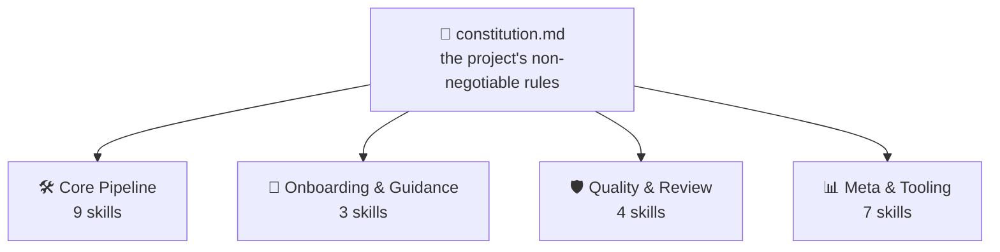
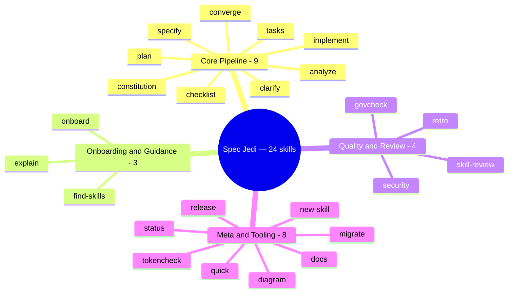
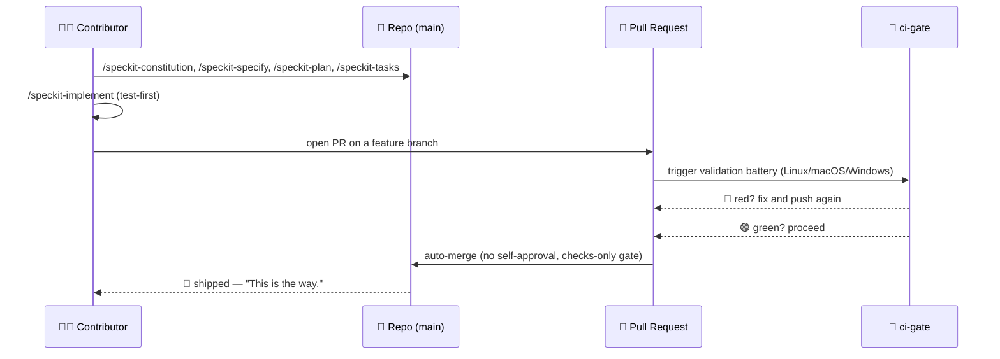
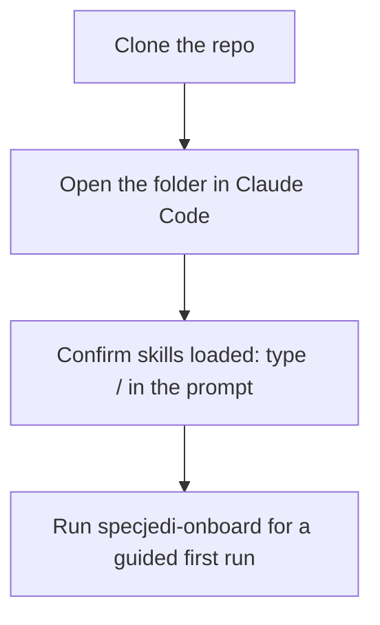
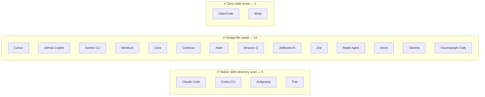
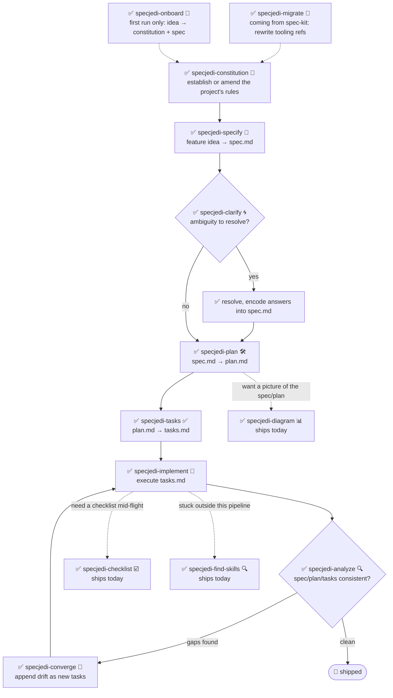

<!-- i18n-sync: source=README.md@bf963a8 lang=id -->
> 🌐 Dokumen ini adalah terjemahan berbantuan AI. **Bahasa Inggris adalah
> sumber kanonis** ([Principle I](../../../.specify/memory/constitution.md));
> jika ada perbedaan, bahasa Inggris yang berlaku. Lihat bahasa lain:
> [English](../../../README.md) · [中文](../zh/README.md) ·
> [हिन्दी](../hi/README.md) · [Español](../es/README.md) ·
> [Français](../fr/README.md) · [العربية](../ar/README.md) ·
> [বাংলা](../bn/README.md) · [Português](../pt/README.md) ·
> [Русский](../ru/README.md) · [اردو](../ur/README.md) ·
> [Bahasa Indonesia](../id/README.md)

# Spec Jedi

[](https://github.com/jonyfs/spec-jedi/actions/workflows/validate.yml)
[](../../../LICENSE)
[](../../../.specify/memory/constitution.md)
[](#apa-yang-anda-dapatkan-hari-ini)
[](#apa-yang-anda-dapatkan-hari-ini)
[](../../../references/skill-roadmap.md)
[](#instalasi)
[](../../../docs/i18n/)
[](../../../.specify/memory/constitution.md)
[](https://github.com/jonyfs/spec-jedi/commits/main)

> *"Spesifikasi dulu. Kode kemudian. Itulah caranya."* — seorang Master
> yang bijak, mungkin.

Spec Jedi adalah sekumpulan skill Spec-Driven Development (SDD) yang
Anda instal ke agen coding pilihan Anda. Alih-alih menulis kode dulu dan
mendokumentasikannya belakangan, Anda menulis **constitution** 📜
(aturan tak-terganggu-gugat proyek Anda), sebuah **specification** 🎯
(apa yang Anda bangun dan mengapa), sebuah **plan** 🛠️ (bagaimana,
secara teknis), dan sebuah **task list** ✅ (langkah-langkah yang
terurut) — dan agen Anda mengimplementasikan berdasarkan artefak
tersebut, bukan berimprovisasi seperti Padawan yang melewatkan
pelatihan.

Repositori ini sendiri dibangun dengan disiplin yang sama seperti yang
ia berikan: [constitution](../../../.specify/memory/constitution.md)
miliknya sendiri adalah sumber otoritatif tentang bagaimana proyek ini
berperilaku, termasuk bagaimana rilis diberi versi dan bagaimana pull
request divalidasi dan digabungkan. Tidak ada jalan pintas menuju Sisi
Gelap vibe-coding di sini. 🚫🖤

*(Branding tidak resmi, terinspirasi penggemar — Spec Jedi tidak
berafiliasi dengan, didukung oleh, atau disponsori oleh
Lucasfilm/Disney. Semoga Spec menyertaimu. 🌌)*



Setiap skill memverifikasi hasilnya sendiri terhadap constitution — bukan
sebaliknya. Ubah aturannya, dan setiap skill di hilir akan merasakannya
pada eksekusi berikutnya.

## Untuk siapa ini

Siapa pun yang menggunakan agen coding AI yang ingin specs, plans, dan
tasks menjadi artefak kelas satu yang diberi versi, bukan pesan chat
sekali pakai — pengembang independen, tim yang menstandarkan cara agen
mereka bekerja, dan siapa pun yang lelah menjelaskan ulang konteks
proyek di setiap sesi.

## Apa yang Anda dapatkan hari ini

Spec Jedi adalah **pesaing** sejati [spec-kit](https://github.com/github/spec-kit),
bukan wrapper bertema darinya
([Principle XV](../../../.specify/memory/constitution.md)). Pipeline
SDD `specjedi-*` lengkap — dari constitution hingga convergence —
**lengkap dan tersedia**: semua 9 tahap, dibangun satu cerita yang
ketat dalam satu waktu mengikuti disiplin riset kompetitif dari
[research.md](../../../specs/001-specjedi-pipeline/research.md)
(Principle II), tidak pernah terburu-buru.

> *"Kekuatan seorang Jedi mengalir dari Force. Begitu pula kekuatan
> sebuah proyek, mengalir dari skill-skillnya."* — seorang Master yang
> bijak, mungkin.

Berjumlah dua puluh empat, inilah Ordo ini — dilatih bukan untuk
pertempuran, tetapi untuk Spec-Driven Development. Empat disiplin ia jaga:



**Tersedia hari ini, instal dan gunakan sekarang:**

| Skill | Apa yang dilakukannya |
|---|---|
| `specjedi-onboard` 🌱 | Walkthrough first-run untuk proyek yang benar-benar baru — menghasilkan `constitution.md` dan `spec.md` pertama yang nyata bersama-sama, mengajarkan setiap konsep SDD tepat saat dibutuhkan. Langsung menyingkir jika onboarding sudah pernah terjadi |
| `specjedi-constitution` 📜 | Menetapkan atau mengamandemen aturan tak-terganggu-gugat proyek — fondasi yang menjadi acuan verifikasi setiap skill `specjedi-*` lainnya. Lihat [spec](../../../specs/001-specjedi-pipeline/spec.md) |
| `specjedi-specify` 🎯 | Mengubah ide fitur — satu kalimat sudah cukup — menjadi `spec.md` yang diprioritaskan dan dapat diuji secara independen, menandai ambiguitas nyata alih-alih menebak |
| `specjedi-clarify` 🌀 | Memindai spec untuk ambiguitas nyata dan mengajukan hingga 5 pertanyaan berprioritas — masing-masing dengan jawaban yang direkomendasikan, sehingga pemula mendapat panduan dan ahli dapat menjawab dalam satu kata — sebelum merencanakan berdasarkan tebakan |
| `specjedi-plan` 🛠️ | Mengubah spec yang sudah diklarifikasi menjadi `plan.md` teknis — terlebih dahulu memindai codebase aktual untuk konvensi yang sudah ada, sehingga implementasi tidak perlu berhenti dan mencari pola yang sudah ada |
| `specjedi-tasks` ✅ | Memecah rencana menjadi `tasks.md` yang terurut dan sadar-dependensi, dikelompokkan berdasarkan user story — menempatkan test yang gagal sebelum task implementasinya di mana pun rencana memerlukan kode |
| `specjedi-implement` 🔨 | Mengeksekusi `tasks.md` dalam urutan dependensi, test-first di mana rencana memerlukan kode — hanya commit melalui feature branch dan pull request, tidak pernah langsung ke `main` |
| `specjedi-quick` ⚡ | Jalur ringan untuk perubahan kecil yang sudah dipahami dengan baik — satu `quick.md` alih-alih `spec.md`+`research.md`+`plan.md`+`tasks.md`, langsung ke implementasi. Quality gate (test-first, `specjedi-govcheck`, hanya-PR) tidak pernah dipersingkat, hanya seremoni perencanaan yang dipersingkat. Menolak dan mengarahkan ke `specjedi-specify` untuk apa pun yang lebih besar, ambigu, atau skill baru — lihat [Jalur mana yang harus saya gunakan?](#jalur-mana-yang-harus-saya-gunakan) |
| `specjedi-analyze` 🔍 | Pemeriksaan silang yang murni read-only dari `spec.md`/`plan.md`/`tasks.md` (dan constitution) untuk kesenjangan, duplikasi, dan kontradiksi — melaporkan temuan, tidak pernah mengedit file |
| `specjedi-checklist` ☑️ | Menghasilkan checklist khusus untuk area fokus tertentu (keamanan, aksesibilitas, performa...) yang sepenuhnya didasarkan pada `spec.md`/`plan.md` fitur ini sendiri — tidak pernah boilerplate generik |
| `specjedi-converge` 🔁 | Mendeteksi penyimpangan antara codebase aktual dan `tasks.md` setelah perubahan manual, menambahkan kesenjangan apa pun sebagai task baru alih-alih mengabaikannya diam-diam — menutup loop kembali ke `specjedi-implement` |
| `specjedi-find-skills` 🔍 | Menyarankan skill spesifik yang terverifikasi ketika permintaan Anda menyentuh domain yang tidak dicakup baik oleh set yang terinstal — tidak pernah menginstal tanpa bertanya dulu ([Principle XVII](../../../.specify/memory/constitution.md)) |
| `specjedi-explain` 🎓 | Menjelaskan konsep atau perintah SDD apa pun, dikalibrasi sesuai seberapa berpengalaman Anda terdengar — dari pemula total hingga praktisi harian, tidak pernah memberikan jawaban kalengan yang sama untuk keduanya ([Principle XIX](../../../.specify/memory/constitution.md)) |
| `specjedi-migrate` 🔄 | Menulis ulang referensi tooling `/speckit-*` literal dalam constitution/spec/plan/tasks Anda sendiri ke padanan `specjedi-*`-nya — tidak pernah menyentuh konten principle atau requirement, hanya atas permintaan eksplisit |
| `specjedi-diagram` 📊 | Menghasilkan diagram Mermaid yang terverifikasi render — tipe yang tepat dipilih dari katalog Mermaid lengkap (flowchart, sequence, ER, class, state, Gantt, timeline, user journey, kanban, mindmap, quadrant, pie, dan lainnya) — dari `spec.md`/`plan.md` yang sudah ada — selalu pelengkap prosa sumber, tidak pernah pengganti |
| `specjedi-status` 🧭 | Dashboard seluruh proyek yang menunjukkan status setiap fitur, sepenuhnya diturunkan dari artefak `spec.md`/`plan.md`/`tasks.md` di disk — nol sistem pelacakan yang dikelola terpisah, tidak pernah menyatakan "macet" sebagai fakta |
| `specjedi-retro` 🪞 | Retrospektif yang murni read-only membandingkan implementasi aktual fitur yang selesai dengan `plan.md`-nya — mendasarkan penyebab penyimpangan apa pun pada riwayat git yang nyata, tidak pernah mengarang satu, mencatat entri bertanggal yang tahan lama |
| `specjedi-security` 🛡️ | Prompt ringan dan proaktif seperti "apakah kita sudah memikirkan X" untuk kesenjangan otentikasi/validasi input/rahasia/privasi data — di-invoke sendiri oleh `specjedi-plan`, tidak pernah mengklaim sebagai tinjauan keamanan lengkap |
| `specjedi-docs` 📚 | Menyusun draf baris tabel skill README, langkah Quickstart, dan entri `CHANGELOG.md` dari spec/plan fitur yang sudah dikirim — didasarkan pada konten nyata, selalu ditampilkan untuk konfirmasi sebelum menulis |
| `specjedi-new-skill` 🌟 | Membuat struktur file skill `specjedi-*` baru — hanya placeholder, tidak pernah konten yang dikarang — mengikuti Skill Authoring Standard proyek ini sendiri dan menyematkan checklist riset Principle II |
| `specjedi-release` 🚀 | Membungkus `scripts/suggest-release.sh` dengan suara khas Spec Jedi — menarasikan tag terakhir, versi berikutnya yang disarankan, dan commit yang berkontribusi; menolak dan menyebutkan perintah manual jika diminta benar-benar memotong rilis |
| `specjedi-skill-review` 🎓 | Audit yang murni read-only dari `SKILL.md` skill `specjedi-*` terhadap Skill Authoring Standard — memeriksa konten section, bukan hanya judul, melakukan cross-reference dengan `plan.md` yang sesuai untuk pengecualian yang sah, melaporkan temuan atau hasil bersih, tidak pernah mengedit file yang ditinjau |
| `specjedi-tokencheck` 🎒 | Secara proaktif memeriksa apakah `rtk` dan `graphify` terinstal, menjelaskan apa yang hilang dan penghematan token yang diharapkan, serta menawarkan walkthrough instalasi — di-invoke sendiri oleh alur first-run `specjedi-onboard`, juga berjalan mandiri; tidak pernah menginstal apa pun tanpa konfirmasi eksplisit |
| `specjedi-govcheck` ⚖️ | Checklist kepatuhan governance yang murni read-only per-PR/per-branch terhadap 20 principle constitution — laporan tiga status (N/A / Sesuai / Tidak Sesuai), konflik apa pun adalah CRITICAL — di-invoke sendiri oleh `specjedi-implement` sebelum membuka PR (tidak pernah memblokirnya), juga berjalan mandiri terhadap branch saat ini atau PR yang disebutkan |

Lihat [`references/skill-roadmap.md`](../../../references/skill-roadmap.md)
untuk apa yang diusulkan di luar pipeline inti (diagram, dan lainnya) —
sebuah backlog skill *tambahan*, bukan kesenjangan pipeline inti;
masing-masing masih memerlukan riset sendiri sebelum dibangun.

## Bagaimana Spec Jedi membangun *dirinya sendiri*, dalam bentuk komik

> ⚠️ **Bagian ini tentang proses bootstrap internal kami, bukan tentang
> produk Spec Jedi.** Perintah `/speckit-*` di bawah ini adalah alat
> milik [spec-kit](https://github.com/github/spec-kit) sendiri — Spec
> Jedi saat ini menggunakan spec-kit untuk membangun dirinya sendiri
> (pola "bootstrap kompiler dengan kompiler lama" yang sama), sama
> seperti pesaing mana pun mungkin menggunakan alat pemain lama saat
> membangun penggantinya. **Jika Anda mengevaluasi Spec Jedi sebagai
> produk, langsung lompat ke
> [Apa yang Anda dapatkan hari ini](#apa-yang-anda-dapatkan-hari-ini)
> di bawah** — permukaan produk sebenarnya adalah skill `specjedi-*`,
> bukan ini. Lihat
> [Principle XV](../../../.specify/memory/constitution.md) untuk
> kebijakan lengkap tentang mengapa keduanya dijaga tetap terpisah
> dengan jelas.
>
> Juga, catatan tentang format: ini adalah panel komik teks-dan-emoji,
> bukan karya seni yang dihasilkan. Citra Star Wars yang sebenarnya
> (karakter, kapal, logo) adalah kekayaan intelektual Lucasfilm/Disney —
> [Principle XII](../../../.specify/memory/constitution.md) proyek ini
> sendiri berkomitmen hanya pada referensi teks, tidak pernah
> mereproduksi karya seni berhak cipta. Jadi: momen ceritanya nyata,
> panelnya adalah Markdown. 🖋️

---

**PANEL 1 — Sebuah terminal yang sendirian, kursor berkedip.**
> 🧑‍💻 *"Saya punya ide untuk sebuah fitur. ...Sekarang apa?"*

**PANEL 2 — Sosok berkerudung keluar dari bayangan, memegang sebuah gulungan.**
> 🧙 *"Pertama, Kodeks."* 📜
> `/speckit-constitution` — aturan tak-terganggu-gugat proyek, ditulis
> sekali, diverifikasi selamanya setelahnya.

**PANEL 3 — Ide itu, dipaku di dinding, tanda tanya berputar di sekelilingnya.**
> 🌀 *"Apa yang sebenarnya sedang Anda bangun — dan untuk siapa?"*
> `/speckit-specify` mengubah ide menjadi `spec.md`. `/speckit-clarify`
> memburu ambiguitas sebelum menjadi bug.

**PANEL 4 — Sebuah blueprint terbentang di atas meja kerja.**
> 🛠️ *"Sekarang bagaimananya."*
> `/speckit-plan` → `plan.md`. `/speckit-tasks` → `tasks.md` yang
> terurut dan sadar-dependensi. Tidak ada langkah yang terlewat, tidak
> ada langkah yang salah urutan.

**PANEL 5 — Alat-alat berdengung, test gagal berwarna merah, lalu berubah hijau satu per satu.**
> 🤖 *"Test dulu. Selalu test dulu."*
> `/speckit-implement` mengeksekusi `tasks.md`, test-first di mana
> berlaku ([Principle VI](../../../.specify/memory/constitution.md)).

**PANEL 6 — Sebuah ruang dewan. Sebuah pull request berdiri di hadapan bangku.**
> 🏛️ *"Nyatakan perubahan Anda."*
> Sebuah PR terbuka. `ci-gate` 🤖 menjalankan seluruh baterai validasi —
> setiap OS, setiap pemeriksaan. Tidak ada persetujuan-sendiri yang
> diizinkan; mesin tidak bisa mengampuni dirinya sendiri, begitu juga
> Anda ([Principle X](../../../.specify/memory/constitution.md)).

**PANEL 7 — Lampu hijau. Gerbang terbuka dengan sendirinya.**
> ✅ *"Baterai telah berbicara."*
> Semua pemeriksaan lolos → auto-merge, tidak ada manusia yang perlu
> mengklik tombol.

**PANEL 8 — Sebuah kapal melompat ke hyperspace.**
> 🚀 *"Terkirim."*
> 🌌 *"Semoga Spec menyertaimu."*

Ini bukan hipotetis — ini adalah proses literal dan berulang di balik
pull request terbaru proyek ini sendiri (misalnya
[#82](https://github.com/jonyfs/spec-jedi/pull/82),
[#84](https://github.com/jonyfs/spec-jedi/pull/84),
[#87](https://github.com/jonyfs/spec-jedi/pull/87)), masing-masing
menjalankan delapan panel persis ini secara nyata.

### Cerita bootstrap internal yang sama, sebagai diagram



## Prasyarat

Spec Jedi dikembangkan dan divalidasi pada **Linux, macOS, dan Windows**
(Constitution [Principle XIII](../../../.specify/memory/constitution.md))
— setiap skrip di bawah `scripts/` didistribusikan baik sebagai POSIX
shell (`.sh`) maupun PowerShell native (`.ps1`), dan CI menjalankan
baterai pada ketiga sistem operasi di setiap PR.

- `git`
- Agen coding yang didukung (lihat
  [Harness yang didukung](#harness-yang-didukung) di bawah)
- [GitHub CLI (`gh`)](https://cli.github.com/), hanya jika Anda
  berencana berkontribusi perubahan kembali melalui pull request
- Hanya jika Anda ingin menjalankan skrip pembantu secara lokal
  (opsional — agen coding sendiri tidak memerlukannya): sebuah POSIX
  shell (bash/zsh, ada secara default di Linux dan macOS) **atau**
  [PowerShell 7+](https://aka.ms/powershell) (`pwsh`), yang berjalan
  pada ketiga sistem operasi

## Instalasi

### Claude Code (didukung penuh hari ini)

Langkah clone sedikit berbeda menurut OS; semua setelahnya identik.

**Linux / macOS** (Terminal):

```bash
git clone https://github.com/jonyfs/spec-jedi.git
cd spec-jedi
```

**Windows — PowerShell native** (tidak perlu WSL):

```powershell
git clone https://github.com/jonyfs/spec-jedi.git
cd spec-jedi
```

**Windows — WSL atau Git Bash** (jika Anda lebih suka shell bergaya
Unix di Windows):

```bash
git clone https://github.com/jonyfs/spec-jedi.git
cd spec-jedi
```

Kedua jalur Windows bekerja sama baiknya — pilih mana pun yang sudah
Anda gunakan sehari-hari. Satu-satunya perbedaan selanjutnya adalah
skrip pembantu mana yang Anda jalankan (`scripts/*.sh` di POSIX shell,
`scripts/*.ps1` di PowerShell native); skill itu sendiri bekerja secara
identik di kedua cara.



1. Clone repositori menggunakan blok di atas untuk OS Anda.

2. Buka folder di [Claude Code](https://claude.com/claude-code). Claude
   Code secara otomatis menemukan setiap skill di bawah
   `.claude/skills/*/SKILL.md` — tidak ada langkah instalasi terpisah
   atau proses build, dan langkah ini identik pada ketiga sistem
   operasi.

3. Konfirmasi skill sudah dimuat dengan mengetik `/` di prompt Claude
   Code. Anda akan melihat semua 24 skill produk `specjedi-*` dan
   perintah `speckit-*` (tooling bootstrap internal milik repositori
   ini sendiri — lihat
   [Apa yang Anda dapatkan hari ini](#apa-yang-anda-dapatkan-hari-ini))
   terdaftar bersama, karena Claude Code menemukan setiap skill di
   bawah `.claude/skills/` tanpa membedakan keduanya.

4. Itu saja — sekarang Anda siap menjalankan `specjedi-onboard` untuk
   first run yang terpandu, bertanya apa pun kepada `specjedi-explain`
   jika tidak yakin harus mulai dari mana, atau membaca constitution
   untuk memahami ke mana arah pipeline selanjutnya.

**Menggunakan Spec Jedi di proyek lain selain ini?** Jalankan installer
(Constitution [Principle XVIII](../../../.specify/memory/constitution.md))
— ia hanya menyalin skill produk `specjedi-*`, tidak pernah tooling
bootstrap `speckit-*`, ditambah empat file `.specify/templates/*.md`
yang dibutuhkan skill tersebut, dan memvalidasi hasilnya sebelum
selesai:

```bash
# dari checkout Spec Jedi, menargetkan proyek lain di disk
./scripts/install.sh /path/to/your-project
```

```powershell
# Windows PowerShell native
.\scripts\install.ps1 -TargetDir C:\path\to\your-project
```

**Tidak ingin clone repositori sama sekali?** `scripts/bootstrap-install.sh`/`.ps1`
(specs/024-bootstrap-installer) mengambil GitHub Release yang
dipublikasikan dan menjalankan installer yang disertakan untuk Anda —
tidak perlu checkout lokal:

```bash
curl -fsSL https://raw.githubusercontent.com/jonyfs/spec-jedi/main/scripts/bootstrap-install.sh \
  | bash -s -- /path/to/your-project --harness cursor
```

```powershell
iwr -useb https://raw.githubusercontent.com/jonyfs/spec-jedi/main/scripts/bootstrap-install.ps1 | iex
```

⚠️ Rilis pertama proyek ini sendiri belum dipotong (Principle XI —
memotong rilis selalu merupakan langkah maintainer yang disengaja,
tidak pernah otomatis), jadi perintah satu baris di atas saat ini akan
melaporkan "no release found" dengan perintah fallback git-clone. Ini
sudah dikirim dan diuji-CI terhadap keadaan nyata saat ini itu; ia
akan mulai benar-benar menginstal begitu sebuah rilis ada.

`--harness` opsional — jika dihilangkan, installer mencoba mendeteksi
agen coding mana yang Anda gunakan di antara `claude-code`/`codex-cli`/`trae`
(direktori proyek yang sudah ada, binary di `PATH`, atau direktori
konfigurasi global yang sudah ada) dan menginstal secara otomatis
untuk itu — hanya bertanya jika deteksi menemukan lebih dari satu
kemungkinan yang cocok. 17 harness lainnya (belum ada sinyal deteksi
filesystem/PATH yang andal untuk mereka) memerlukan `--harness`
eksplisit. Jalankan `./scripts/install.sh --help` (atau
`.\scripts\install.ps1 -Help`) untuk daftar opsi lengkap, termasuk
`--auto`.

### Harness yang didukung

Constitution Spec Jedi
([Principle III](../../../.specify/memory/constitution.md)) mengikat
proyek ini untuk mendukung dua puluh alat/harness coding LLM yang
paling banyak digunakan di pasar — sejak rilis ini, kedua puluhnya
nyata, teruji, dan terbukti oleh CI. Empat menggunakan pemindaian
direktori skills native (Claude Code, Codex CLI, Trae, Antigravity —
tiga yang terakhir berbagi hanya dua direktori target fisik,
`.agents/skills/` dan `.trae/skills/`, ditambah OpenCode dan Warp yang
terpenuhi oleh jalur yang sama tanpa kode tambahan). Empat belas
sisanya tidak memiliki konsep direktori skills native — hanya file
aturan di root proyek, direktori aturan kecil, atau (Sourcegraph Cody)
sebuah file JSON custom-commands — sehingga installer menghasilkan
sebuah **bridge**: paket `specjedi-*` lengkap tetap mendarat di
`.claude/skills/` yang kanonis, dan sebuah file adapter kecil (atau
satu file per skill, untuk harness bergaya direktori) menunjuk ke
sana menggunakan konvensi dokumentasi harness tersebut sendiri. Lihat
[`specs/023-full-harness-coverage/research.md`](../../../specs/023-full-harness-coverage/research.md)
untuk sitasi yang mendasari mekanisme persis setiap harness.



| Harness | Status |
|---|---|
| Claude Code | ✅ Didukung — lihat langkah di atas |
| Cursor | ✅ Didukung — `./scripts/install.sh --harness cursor` (bridge file di bawah `.cursor/rules/`) |
| GitHub Copilot (Chat/Workspace) | ✅ Didukung — `./scripts/install.sh --harness copilot` (bridge file di `.github/copilot-instructions.md`) |
| Codex CLI (OpenAI) | ✅ Didukung — `./scripts/install.sh --harness codex-cli` (menginstal ke `.agents/skills/`) |
| Gemini CLI | ✅ Didukung — `./scripts/install.sh --harness gemini-cli` (bridge file di `GEMINI.md`; Google menghentikan Gemini CLI demi Antigravity — lihat [`references/harness-capability-notes.md`](../../../references/harness-capability-notes.md)) |
| Antigravity (Google) | ✅ Didukung — `./scripts/install.sh --harness antigravity` (menginstal ke `.agents/skills/`, konvensi yang sama dengan Codex CLI) |
| Windsurf (Codeium) | ✅ Didukung — `./scripts/install.sh --harness windsurf` (bridge file di bawah `.windsurf/rules/`) |
| Cline | ✅ Didukung — `./scripts/install.sh --harness cline` (bridge file di bawah `.clinerules/`) |
| Continue | ✅ Didukung — `./scripts/install.sh --harness continue` (bridge file di bawah `.continue/rules/`) |
| Aider | ✅ Didukung — `./scripts/install.sh --harness aider` (bridge file di `CONVENTIONS.md`) |
| Amazon Q Developer | ✅ Didukung — `./scripts/install.sh --harness amazon-q` (bridge file di bawah `.amazonq/rules/`) |
| JetBrains AI Assistant | ✅ Didukung — `./scripts/install.sh --harness jetbrains-ai` (bridge file di bawah `.aiassistant/rules/`) |
| Zed | ✅ Didukung — `./scripts/install.sh --harness zed` (bridge file di `.rules`) |
| OpenCode | ✅ Didukung — dipenuhi oleh instalasi `claude-code` atau `codex-cli` (OpenCode secara native memindai baik `.claude/skills/` maupun `.agents/skills/`), tidak perlu flag terpisah |
| Warp (Agent Mode) | ✅ Didukung — dipenuhi oleh instalasi `claude-code` atau `codex-cli` (sistem Skills Warp secara native memindai baik `.claude/skills/` maupun `.agents/skills/`), tidak perlu flag terpisah |
| Replit Agent | ✅ Didukung — `./scripts/install.sh --harness replit` (bridge file di `replit.md`) |
| Devin (Cognition) | ✅ Didukung — `./scripts/install.sh --harness devin` (bridge file di `.devin.md`, distruktur sebagai Devin Playbook) |
| Tabnine | ✅ Didukung — `./scripts/install.sh --harness tabnine` (bridge file di bawah `.tabnine/guidelines/`) |
| Sourcegraph Cody | ✅ Didukung — `./scripts/install.sh --harness cody` (custom commands `.vscode/cody.json`, dipanggil secara eksplisit sebagai `/specjedi-<name>`; tidak seperti semua harness lain di atas, Cody tidak memiliki file aturan always-on yang terkonfirmasi, jadi ini adalah invokasi manual, bukan konteks otomatis — lihat dokumen riset) |
| Trae | ✅ Didukung — `./scripts/install.sh --harness trae` (menginstal ke `.trae/skills/`) |

Dua puluh harness disebutkan satu per satu sesuai mandat "setidaknya
dua puluh" dari Principle III, semuanya ✅ Didukung — tanpa klaim
kapabilitas apa pun untuk mekanisme yang belum benar-benar dibangun
dan diuji oleh proyek ini, mengikuti disiplin resistensi-halusinasi
Principle XX.

Lihat [`references/harness-capability-notes.md`](../../../references/harness-capability-notes.md)
untuk catatan kapabilitas riset literatur asli per harness, dan
[`specs/023-full-harness-coverage/research.md`](../../../specs/023-full-harness-coverage/research.md)
untuk keputusan mekanisme instalasi dan sitasi yang menjadi dasar
tabel ini.

Penasaran bagaimana Spec Jedi dibandingkan dengan spec-kit dan sepuluh
alat SDD lain yang menjadi tolok ukurnya? Lihat
[`references/competitive-comparison.md`](../../../references/competitive-comparison.md).

Ingin versi tanpa filter — keunggulan nyata, keterbatasan nyata saat
ini, dan poin peningkatan konkret yang didasarkan pada kompetitor?
Lihat
[`references/honest-assessment.md`](../../../references/honest-assessment.md).

## Mulai cepat

Dua puluh empat skill produk tersedia hari ini
([Apa yang Anda dapatkan hari ini](#apa-yang-anda-dapatkan-hari-ini)) —
pipeline `specjedi-*` lengkap sudah selesai. Belum pernah menggunakan
alat SDD sebelumnya? Mulai dari langkah 0.

### Jalur mana yang harus saya gunakan?

| Ukuran perubahan | Gunakan | Menghasilkan |
|---|---|---|
| Kecil, sudah dipahami dengan baik — typo, perbaikan satu file, penyesuaian dengan cakupan ketat | `specjedi-quick` ⚡ | Satu `quick.md`, langsung ke kode yang dikirim |
| Apa pun yang lebih besar, ambigu, menyentuh lebih dari satu subsistem, atau skill `specjedi-*` baru | Pipeline lengkap (langkah 3-11 di bawah) | `spec.md` → `plan.md` → `tasks.md` → kode yang dikirim |

`specjedi-quick` memeriksa kelayakan sendiri terhadap lima kriteria
eksplisit sebelum menulis apa pun — jika permintaan Anda sebenarnya
tidak muat dalam sekitar satu halaman catatan, ia menolak dan
mengarahkan Anda ke `specjedi-specify` alih-alih memaksakannya. Kedua
jalur menegakkan quality gate yang sama (test-first di mana kode
terlibat, `specjedi-govcheck` sebelum PR dibuka) — "quick" hanya
mempersingkat seremoni perencanaan, tidak pernah verifikasi.

0. **Tidak yakin semua ini artinya apa?** Tanyakan saja — "apa itu spec
   dan mengapa saya membutuhkannya", "apa yang sebenarnya dilakukan
   proyek ini". `specjedi-explain` 🎓 menjawab pada kedalaman yang Anda
   butuhkan, pemula atau lanjutan, dan selalu menunjukkan apa yang harus
   dijalankan selanjutnya
   ([Principle XIX](../../../.specify/memory/constitution.md)).
1. Instal (lihat [Instalasi](#instalasi) di atas).
2. Proyek yang benar-benar baru, tidak ada ide harus mulai dari mana?
   `specjedi-onboard` 🌱 memandu Anda memproduksi bersama-sama
   `constitution.md` dan `spec.md` pertama yang nyata dari ide satu
   kalimat, menjelaskan setiap konsep hanya ketika Anda benar-benar
   membutuhkannya — tidak pernah tembok dokumentasi di depan. (Langkah
   3-4 di bawah adalah persis apa yang ia orkestrasikan untuk Anda;
   langsung lompat ke sana jika Anda lebih suka menjalankan setiap
   tahap sendiri.)
3. Tetapkan aturan proyek Anda: jelaskan hal-hal tak-terganggu-gugat
   Anda dalam bahasa sederhana dan `specjedi-constitution` 📜
   menghasilkan `.specify/memory/constitution.md` yang diberi versi —
   setiap skill `specjedi-*` lainnya memverifikasi outputnya sendiri
   terhadap ini.
4. Spesifikasikan sebuah fitur: jelaskan apa yang ingin Anda bangun —
   ide kasar satu kalimat sudah cukup — dan `specjedi-specify` 🎯
   mengubahnya menjadi `spec.md` yang diprioritaskan, dapat diuji
   secara independen, menandai ambiguitas nyata alih-alih
   menebaknya.
5. Tidak yakin spec sudah solid? `specjedi-clarify` 🌀 memindainya
   untuk ambiguitas nyata dan mengajukan hingga 5 pertanyaan
   berprioritas — masing-masing dengan jawaban yang direkomendasikan,
   sehingga Anda dapat menerimanya dalam satu kata atau membaca
   alasannya jika mau — sebelum merencanakan berdasarkan tebakan.
6. Siap mendesain "bagaimana"-nya? `specjedi-plan` 🛠️ terlebih dahulu
   memindai codebase aktual Anda untuk konvensi yang sudah ada,
   kemudian mengubah spec yang sudah diklarifikasi menjadi `plan.md`
   teknis — sehingga implementasi tidak pernah perlu berhenti dan
   mencari pola yang sudah ada di tempat lain dalam proyek Anda. Jika
   spec Anda menyentuh otentikasi, input eksternal, rahasia, atau
   penanganan data, `specjedi-security` 🛡️ dipicu secara otomatis
   dengan beberapa pertanyaan terarah seperti "apakah kita sudah
   memikirkan X" — sebuah prompt ringan, tidak pernah tinjauan
   keamanan lengkap.
7. Siap memecahnya menjadi pekerjaan? `specjedi-tasks` ✅ mengubah
   rencana menjadi `tasks.md` yang terurut, sadar-dependensi,
   dikelompokkan berdasarkan user story — menempatkan task test yang
   gagal sebelum task implementasinya di mana pun rencana memerlukan
   kode.
8. Siap membangunnya? `specjedi-implement` 🔨 mengeksekusi `tasks.md`
   dalam urutan dependensi, test-first di mana rencana memerlukan
   kode — setiap commit mendarat di feature branch dan pull request,
   tidak pernah langsung di `main`.
9. Ingin jaring pengaman? `specjedi-analyze` 🔍 memeriksa silang
   `spec.md`, `plan.md`, dan `tasks.md` (dan constitution Anda) untuk
   kesenjangan, duplikasi, atau kontradiksi — murni read-only, dapat
   dijalankan kapan saja, tidak pernah mengedit file.
10. Butuh tinjauan terarah? `specjedi-checklist` ☑️ menghasilkan
    checklist untuk area fokus tertentu — keamanan, aksesibilitas,
    performa, apa pun yang Anda sebutkan — sepenuhnya didasarkan pada
    spec/plan fitur ini sendiri, tidak pernah boilerplate generik.
11. Mengubah kode secara manual sejak `tasks.md` terakhir Anda?
    `specjedi-converge` 🔁 memindai codebase aktual, mendeteksi
    kapabilitas apa pun tanpa task yang sesuai, dan menambahkannya
    sebagai pekerjaan baru alih-alih membiarkannya menyimpang diam-diam
    — tahap akhir pipeline, menutup loop kembali ke
    `specjedi-implement`.
12. Terjebak pada sesuatu di luar set ini? Jelaskan saja — "bagaimana
    saya melakukan X", "apakah ada skill untuk X" — dan
    `specjedi-find-skills` 🔍 dipicu secara otomatis, mencari di
    ekosistem agent-skills terbuka, dan menyarankan skill spesifik yang
    terverifikasi. Tidak pernah menginstal apa pun tanpa bertanya dulu
    ([Principle VIII](../../../.specify/memory/constitution.md)).
13. Datang dari proyek spec-kit yang sudah ada? `specjedi-migrate` 🔄
    menulis ulang referensi tooling `/speckit-*` proyek Anda sendiri
    ke padanan `specjedi-*`-nya — tidak pernah menyentuh principle atau
    requirement, hanya atas permintaan eksplisit.
14. Ingin gambar alih-alih tembok prosa? `specjedi-diagram` 📊
    mengubah spec atau plan menjadi diagram Mermaid yang terverifikasi
    render — memilih tipe dari katalog lengkap (lihat
    [`references/mermaid-diagram-catalog.md`](../../../references/mermaid-diagram-catalog.md))
    sesuai apa pun yang diminta konten aktual — selalu berdampingan
    dengan prosa sumber, tidak pernah
    menggantikannya.
15. Menangani lebih dari satu atau dua fitur? `specjedi-status` 🧭
    menampilkan dashboard seluruh proyek — fitur mana yang
    dispesifikasikan, direncanakan, sedang berlangsung, atau selesai —
    sepenuhnya diturunkan dari apa yang benar-benar ada di disk, tanpa
    sistem pelacakan terpisah yang harus disinkronkan.
16. Baru saja menyelesaikan sebuah fitur? `specjedi-retro` 🪞
    membandingkan apa yang benar-benar dikirim dengan apa yang
    dikatakan `plan.md`, mendasarkan penyebab penyimpangan apa pun
    pada riwayat git yang nyata — tidak pernah mengarang satu — dan
    mencatat entri yang tahan lama sehingga sinyal bertahan melampaui
    percakapan ini.
17. Mengirimkan sesuatu dan perlu didokumentasikan? `specjedi-docs` 📚
    menyusun draf baris README, langkah Quickstart, dan entri
    `CHANGELOG.md` untuk Anda — didasarkan pada spec/plan nyata Anda,
    selalu ditampilkan untuk konfirmasi sebelum menulis apa pun.
18. Memperluas Spec Jedi sendiri dengan skill baru? `specjedi-new-skill`
    🌟 membuat struktur file — `specs/`, kerangka `SKILL.md`, setiap
    section adalah placeholder berlabel — tidak pernah mengarang
    temuan riset atau perilaku atas nama Anda.
19. Bertanya-tanya apakah sudah waktunya rilis? `specjedi-release` 🚀
    menarasikan saran `scripts/suggest-release.sh` sendiri — tag
    terakhir, versi berikutnya, commit yang berkontribusi — dan
    menolak dengan perintah manual yang tepat jika diminta benar-benar
    memotong satu; tidak pernah mem-tag atau mempublikasikan sendiri.
20. Menulis atau mengubah skill `specjedi-*` secara manual?
    `specjedi-skill-review` 🎓 memeriksa `SKILL.md`-nya terhadap Skill
    Authoring Standard — konten section, bukan hanya judul, di-cross-
    reference dengan `plan.md` yang sesuai untuk pengecualian yang sah
    — dan melaporkan temuan atau hasil bersih; tidak pernah mengedit
    file itu sendiri.
21. `specjedi-onboard` sudah menjalankan ini sekali untuk Anda pada
    penggunaan pertama, tetapi `specjedi-tokencheck` 🎒 juga berfungsi
    mandiri — memeriksa apakah `rtk` dan `graphify` terinstal,
    menjelaskan apa yang hilang dan penghematan token yang diharapkan,
    dan menawarkan untuk memandu Anda melalui instalasi; tidak pernah
    menginstal apa pun tanpa persetujuan eksplisit Anda.
22. `specjedi-implement` sudah menjalankan ini sebelum membuka setiap
    PR, tetapi `specjedi-govcheck` ⚖️ juga berfungsi mandiri —
    checklist per-branch (atau per-PR) terhadap 20 principle
    constitution, melaporkan masing-masing sebagai tidak berlaku,
    sesuai, atau tidak sesuai, dengan konflik nyata apa pun ditandai
    CRITICAL; murni read-only, tidak pernah mengedit apa pun, tidak
    pernah memblokir PR untuk terbuka dengan sendirinya.

Sesuai [Principle XIV](../../../.specify/memory/constitution.md), apa
pun yang baru saja Anda jalankan seharusnya memberi tahu Anda apa yang
harus dijalankan selanjutnya — Anda seharusnya tidak perlu kembali ke
daftar ini untuk mengetahuinya. Rantai lengkap menjalankan
`specjedi-onboard` (hanya first run) → `specjedi-constitution` →
`specjedi-specify` → `specjedi-clarify` → `specjedi-plan` →
`specjedi-tasks` → `specjedi-implement` → `specjedi-analyze` →
`specjedi-checklist` → `specjedi-converge`, melakukan loop kembali ke
`specjedi-implement` setiap kali `specjedi-converge` menemukan
penyimpangan yang perlu diselesaikan.

### Pipeline, dari awal hingga akhir

Dari onboarding hingga convergence — setiap tahap di bawah ini sudah
aktif:



✅ = tersedia hari ini — pipeline `specjedi-*` 9-tahap lengkap sudah
selesai, ditambah `specjedi-onboard` sebagai titik masuk first-run yang
terpandu.

## Pendamping yang direkomendasikan

Constitution proyek ini
([Principle VIII](../../../.specify/memory/constitution.md)) mengarahkan
setiap sesi Spec Jedi untuk secara proaktif menyarankan, tetapi tidak
pernah diam-diam menginstal, dua pendamping penghemat token:

- [`rtk`](https://github.com/rtk-ai/rtk) — sebuah proxy CLI yang
  dioptimalkan untuk token bagi operasi dev umum.
- [`graphify`](https://graphify.net/) — mengubah codebase menjadi
  graph pengetahuan yang dapat di-query.

Jika agen Anda menawarkan untuk menginstal atau mengonfigurasi salah
satunya, itulah kebijakan ini beraksi — Anda selalu ditanya terlebih
dahulu.

**graphify sudah terhubung ke repositori ini** (dengan konfirmasi
maintainer): sebuah section `## graphify` di `CLAUDE.md` memberi tahu
Claude Code untuk berkonsultasi dengan graph pengetahuan sebelum
menelusuri kode sumber dan menyegarkannya setelah perubahan kode, dan
`.claude/settings.json` mendaftarkan hook yang mengarahkan panggilan
tool ke `graphify query`/`explain`/`path` alih-alih grep/read mentah
begitu graph tersebut ada. Graph itu sendiri (`graphify-out/`) tidak
di-commit — ini adalah cache turunan, diregenerasi setiap clone.

Untuk mendapatkan perilaku auto-update yang sama secara lokal setelah
clone:

```bash
pip install graphifyy   # atau: uv tool install graphifyy
graphify .               # build pertama (hanya diperlukan sekali; juga berjalan otomatis pada penggunaan pertama)
graphify hook install    # membangun ulang graph.json secara otomatis setelah setiap commit (perubahan kode)
```

Perubahan dokumen/konten tidak ditangkap oleh commit hook — jalankan
`graphify update .` (atau cukup minta agen Anda) setelah mengedit file
yang bukan kode.

## Versioning dan rilis

Spec Jedi mengikuti [Semantic Versioning](https://semver.org/) untuk
rilisnya sendiri, dibatasi pada kontrak paket skill publik (perubahan
perilaku skill yang breaking = MAJOR, skill baru atau kapabilitas
aditif = MINOR, perbaikan/dokumentasi = PATCH). Lihat
[Principle XI](../../../.specify/memory/constitution.md) untuk
kebijakan lengkap.

Proyek ini menyarankan kapan rilis dibenarkan alih-alih memotongnya
secara diam-diam:

```bash
# Linux / macOS / Windows (WSL atau Git Bash)
./scripts/suggest-release.sh
```

```powershell
# Windows (PowerShell native)
./scripts/suggest-release.ps1
```

Ini memeriksa commit sejak tag terakhir dan merekomendasikan versi
berikutnya — ia tidak pernah mem-tag atau mempublikasikan apa pun
sendiri. Benar-benar memotong rilis selalu merupakan langkah yang
disengaja, dipimpin oleh maintainer.

## Berkontribusi

Lihat [`CONTRIBUTING.md`](./CONTRIBUTING.md) untuk proses kontribusi
lengkap — persyaratan riset kompetitif untuk skill baru, checklist
Skill Authoring Standard, dan langkah validasi yang harus dijalankan
sebelum membuka PR.

Setiap perubahan dikirim melalui pull request yang divalidasi oleh
baterai CI proyek ini sendiri, dan hanya di-auto-merge setelah setiap
pemeriksaan hijau (lihat
[Principle IX dan X](../../../.specify/memory/constitution.md)).
Baterai itu berjalan di Linux, macOS, dan Windows pada setiap PR
(Principle XIII) — jika Anda menambahkan atau mengubah skrip di bawah
`scripts/`, baik versi `.sh` maupun `.ps1` harus ada dan lolos pada
ketiganya. Template issue dan PR (`.github/ISSUE_TEMPLATE/`,
`.github/PULL_REQUEST_TEMPLATE.md`) memandu kontributor untuk
mengonfirmasi bahwa mereka telah melakukan langkah riset dan validasi
di atas sebelum meminta review.

## Lisensi

[MIT](../../../LICENSE) — dipilih dan diwajibkan oleh constitution
proyek ini sendiri (Distribution & Ecosystem Standards). Dalam bahasa
sederhana, MIT berarti Anda dapat:

- **Menggunakan** proyek ini, secara komersial atau tidak, tanpa
  batasan.
- **Memodifikasinya** sesuka Anda.
- **Mendistribusikan ulang**, termasuk sebagai bagian dari sesuatu
  yang Anda jual.

Satu-satunya kondisi nyata: pertahankan pemberitahuan hak cipta asli
dan teks lisensi di suatu tempat dalam salinan Anda, dan jangan
mengharapkan garansi — perangkat lunak disediakan "apa adanya", tanpa
tanggung jawab jika ada yang rusak. Itulah keseluruhan kesepakatan;
lihat [`LICENSE`](../../../LICENSE) untuk teks hukum yang tepat.

---
