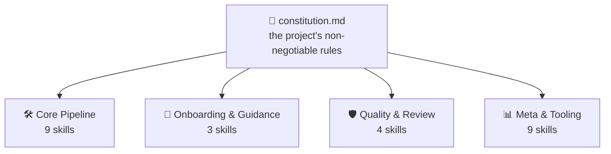
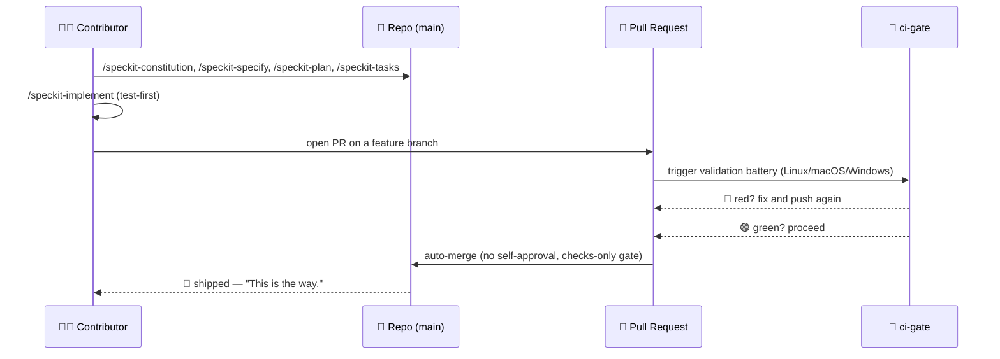

<!-- i18n-sync: source=README.md@1609524 lang=id -->
> 🌐 Dokumen ini adalah terjemahan berbantuan AI. **Bahasa Inggris adalah
> sumber kanonis** ([Principle I](../../../.specify/memory/constitution.md));
> jika ada perbedaan, bahasa Inggris yang berlaku. Lihat bahasa lain:
> [English](../../../README.md) · [中文](../zh/README.md) ·
> [हिन्दी](../hi/README.md) · [Español](../es/README.md) ·
> [Français](../fr/README.md) · [العربية](../ar/README.md) ·
> [বাংলা](../bn/README.md) · [Português](../pt/README.md) ·
> [Русский](../ru/README.md) · [اردو](../ur/README.md) ·
> [Bahasa Indonesia](../id/README.md)

# Spec Jedi

[](https://github.com/jonyfs/spec-jedi/actions/workflows/validate.yml)
[](../../../LICENSE)
[](../../../.specify/memory/constitution.md)
[](#bagaimana-spec-jedi-mengimplementasikan-sdd)
[](#bagaimana-spec-jedi-mengimplementasikan-sdd)
[](../../../references/skill-roadmap.md)
[](#instalasi)
[](../../../docs/i18n/)
[](../../../.specify/memory/constitution.md)
[](https://github.com/jonyfs/spec-jedi/commits/main)

> *"Spesifikasi dulu. Kode kemudian. Itulah caranya."* — seorang Master
> yang bijak, mungkin.


**Sebuah surat, dari seorang Master untuk siapa pun yang mengambil
gulungan ini selanjutnya:**

Sebagian besar proyek yang melampaui rencananya sendiri berbagi akar
masalah yang sama: kode dulu, penjelasan kemudian — dan "kemudian" itu
tidak pernah benar-benar datang. Yang berikut adalah praktik yang
membalik urutan itu, dan proyek nyata yang dibangun untuk
mempraktikkannya.

*(Branding tidak resmi, terinspirasi penggemar — Spec Jedi tidak
berafiliasi dengan, didukung oleh, atau disponsori oleh
Lucasfilm/Disney. Semoga Spec menyertaimu. 🌌)*

## Apa itu Spec-Driven Development?

Cara umum membangun perangkat lunak dengan agen coding AI adalah begini:
menjelaskan apa yang Anda inginkan di chat, agen menulis kode, Anda
membaca kode itu untuk mengetahui apakah ia melakukan apa yang Anda
maksud, Anda memperbaikinya, mengulanginya. Pemahaman agen tentang "apa
yang Anda maksud" hanya hidup dalam percakapan — tidak pernah dituliskan
sebagai artefak yang tahan lama dan dapat ditinjau. Dua mode kegagalan
mengikuti dari itu: ambiguitas diselesaikan dengan menebak alih-alih
diungkap untuk sebuah keputusan, dan tidak ada yang bertahan melampaui
percakapan — Anda menutup chat, Anda kehilangan penalarannya.

Spec-Driven Development (SDD) membalik urutan itu. Sebelum satu baris
kode pun ada, apa yang sedang dibangun dan mengapa dituliskan, sebagai
dokumen yang terstruktur dan dapat ditinjau — sebuah **constitution** 📜
(aturan tak-terganggu-gugat), sebuah **specification** 🎯 (apa, dan
untuk siapa), sebuah **plan** 🛠️ (bagaimana, secara teknis), dan sebuah
**task list** ✅ (langkah-langkah yang terurut). Kode dihasilkan
*berdasarkan* artefak-artefak tersebut, bukan sebaliknya — disiplin yang
sama yang dituntut Kodeks Jedi dari siapa pun yang tergoda untuk
melewatkan bagian-bagian membosankan dari pelatihan. Penjelasan lengkap,
tanpa merek Spec Jedi sedikit pun:
[`references/what-is-sdd.md`](../../../references/what-is-sdd.md).



Semua yang mengikuti memverifikasi dirinya terhadap constitution, tidak
pernah sebaliknya. Ubah satu aturan, dan setiap skill merasakannya pada
eksekusi berikutnya.

## Bagaimana Spec Jedi mengimplementasikan SDD

Spec Jedi adalah **pesaing** sejati [spec-kit](https://github.com/github/spec-kit),
bukan wrapper bertema darinya
([Principle XV](../../../.specify/memory/constitution.md)) — dua puluh
agen coding didukung, benar-benar nyata, bukan hanya di teori (lihat
[Instalasi](#instalasi) di bawah). Pipeline SDD `specjedi-*` lengkap —
dari constitution hingga convergence — telah dikirim sepenuhnya sejak
lama: semua 9 tahap, masing-masing dibangun di atas riset kompetitif
nyata sebelum satu baris pun ditulis
([research.md](../../../specs/001-specjedi-pipeline/research.md),
Principle II).

Setiap aktivitas SDD di atas bersesuaian dengan skill `specjedi-*` yang
nyata dan sudah dikirim, bukan sebuah aspirasi:
`specjedi-constitution` menetapkan aturan, `specjedi-specify` mengubah
ide menjadi `spec.md`, `specjedi-clarify` menyelesaikan ambiguitas yang
ditandai, `specjedi-plan` dan `specjedi-tasks` menghasilkan rencana
teknis dan penguraian tugas, dan `specjedi-implement` (atau
`specjedi-quick` untuk perubahan kecil yang sudah dipahami dengan baik)
mengeksekusinya test-first, hanya melalui feature branch dan pull
request. Dua puluh lima skill tersedia hari ini secara total, dalam
empat disiplin — katalog lengkap, kedua diagram, dan panduan langkah
demi langkah 23 langkah hidup di
[`references/quickstart-guide.md`](../../../references/quickstart-guide.md);
pemetaan lengkap aktivitas-ke-skill, termasuk tiga kontribusi asli di
luar praktik SDD generik, hidup di
[`references/specjedi-and-sdd.md`](../../../references/specjedi-and-sdd.md).

Penasaran apa selanjutnya?
[`references/skill-roadmap.md`](../../../references/skill-roadmap.md)
melacak apa yang diusulkan di luar pipeline inti — sebuah backlog ide
*tambahan*, bukan kesenjangan pipeline itu sendiri. Masing-masing masih
memerlukan riset nyatanya sendiri sebelum dibangun; tidak ada yang
dikirim di sini berdasarkan intuisi belaka.

## Untuk siapa ini

Lelah menjelaskan ulang konteks proyek yang sama di setiap sesi. Lelah
melihat agen diam-diam menemukan kembali keputusan yang sudah diambil
dan ditinggalkan tim tiga minggu lalu, karena tidak ada yang
menuliskannya di tempat yang bisa ditemukan agen tersebut. Tidak
peduli apakah itu satu orang atau seluruh tim yang mencoba membuat
semua agen berperilaku dengan cara yang sama: siapa pun yang ingin
specs, plans, dan tasks menjadi file nyata dan diberi versi alih-alih
pesan chat yang menghilang saat jendela ditutup adalah pembaca yang
dituju di sini.

## Bagaimana Spec Jedi membangun *dirinya sendiri*, dalam bentuk komik

> ⚠️ **Bagian ini tentang proses bootstrap internal kami, bukan tentang
> produk Spec Jedi.** Perintah `/speckit-*` di bawah ini adalah alat
> milik [spec-kit](https://github.com/github/spec-kit) sendiri — Spec
> Jedi saat ini menggunakan spec-kit untuk membangun dirinya sendiri
> (pola "bootstrap kompiler dengan kompiler lama" yang sama), sama
> seperti pesaing mana pun mungkin menggunakan alat pemain lama saat
> membangun penggantinya. **Jika Anda mengevaluasi Spec Jedi sebagai
> produk, langsung lompat ke [Instalasi](#instalasi) di bawah** —
> permukaan produk sebenarnya adalah skill `specjedi-*`, bukan ini.
> Lihat [Principle XV](../../../.specify/memory/constitution.md) untuk
> kebijakan lengkap tentang mengapa keduanya dijaga tetap terpisah
> dengan jelas.
>
> Juga, catatan tentang format: panel-panel di bawah ini memadukan
> dialog teks-dan-emoji dengan ilustrasi asli — tidak pernah citra Star
> Wars yang sebenarnya (karakter, kapal, logo), yang merupakan kekayaan
> intelektual Lucasfilm/Disney. [Principle XII](../../../.specify/memory/constitution.md)
> proyek ini sendiri berkomitmen pada identitas visual asli dan
> referensi Star Wars hanya dalam teks, tidak pernah mereproduksi karya
> seni berhak cipta atau seni yang membangkitkan ciri khas visual yang
> dikenali dari saga tersebut. Jadi: momen ceritanya nyata, seninya
> asli, dan kata-katanya tetap membawa makna dengan sendirinya. 🖋️

---

Setiap cerita dimulai dengan cara yang sama: ruangan gelap, terminal,
kursor yang tidak berhenti berkedip sampai Anda memberinya sesuatu
untuk dikerjakan.


> 🧑‍💻 *"Saya punya ide untuk sebuah fitur. ...Sekarang apa?"*

Saat itulah sang mentor muncul — tanpa lightsaber, hanya sebuah
gulungan, karena pertarungan pertama di sini tidak pernah menjadi yang
terakhir. `/speckit-constitution` menuliskan aturan sekali saja, agar
tidak seorang pun perlu mempelajarinya kembali dengan cara yang sulit
tiga fitur kemudian.


> 🧙 *"Pertama, Kodeks."* 📜

Ide itu naik ke dinding selanjutnya, dikelilingi oleh setiap pertanyaan
yang belum dijawabnya — apa yang sebenarnya sedang dibangun, dan untuk
siapa. `/speckit-specify` mengubahnya menjadi `spec.md` yang nyata;
`/speckit-clarify` pergi memburu ambiguitas sebelum ia menjadi bug yang
tidak ingin diakui siapa pun nanti.


> 🌀 *"Apa yang sebenarnya sedang Anda bangun — dan untuk siapa?"*

Kemudian blueprint pun muncul. `/speckit-plan` menjadi `plan.md`,
`/speckit-tasks` memecahnya menjadi `tasks.md` yang terurut dan
sadar-dependensi — tidak ada yang terlewat, tidak ada yang salah urutan,
jenis rencana yang bisa diikuti seorang Padawan tanpa perlu bertanya
dua kali.


> 🛠️ *"Sekarang bagaimananya."*

Alat-alat mulai berdengung. Test gagal berwarna merah, satu demi satu —
dan kemudian, perlahan, mereka berhenti gagal. `/speckit-implement`
mengeksekusi `tasks.md` test-first di mana pun itu berlaku
([Principle VI](../../../.specify/memory/constitution.md)), karena
sebuah build yang melewatkan langkah ini hanyalah tebakan dengan
langkah tambahan.


> 🤖 *"Test dulu. Selalu test dulu."*

Sekarang dewan berkumpul — bukan untuk memberkati pekerjaan itu, hanya
untuk memeriksanya. Sebuah pull request berdiri di hadapan bangku, dan
`ci-gate` 🤖 menjalankan seluruh baterai validasi: setiap OS, setiap
pemeriksaan, tanpa jalan pintas. Tidak seorang pun diizinkan menyetujui
pekerjaannya sendiri di sini, baik mesin maupun manusia
([Principle X](../../../.specify/memory/constitution.md)).


> 🏛️ *"Nyatakan perubahan Anda."*

Lampu berubah hijau, dan gerbang terbuka dengan sendirinya — tidak ada
tangan di tuas, tidak ada yang mengklik tombol. Baterai sudah
mengatakan apa yang perlu dikatakan.


> ✅ *"Baterai telah berbicara."*

Dan kemudian ia pergi — menuju hyperspace, terkirim.


> 🚀 *"Terkirim."*
> 🌌 *"Semoga Spec menyertaimu."*

Tidak ada dari ini yang hipotetis — ini adalah proses literal dan
berulang di balik pull request terbaru proyek ini sendiri —
[#82](https://github.com/jonyfs/spec-jedi/pull/82),
[#84](https://github.com/jonyfs/spec-jedi/pull/84),
[#87](https://github.com/jonyfs/spec-jedi/pull/87), untuk menyebut
beberapa — dari awal hingga akhir, secara nyata, setiap saat.

### Cerita bootstrap internal yang sama, sebagai diagram



## Prasyarat

Tidak ada yang eksotis di sini. Spec Jedi dibangun dan diuji pada
**Linux, macOS, dan Windows** secara setara (Constitution
[Principle XIII](../../../.specify/memory/constitution.md)) — setiap
skrip di bawah `scripts/` didistribusikan baik sebagai POSIX shell
(`.sh`) maupun PowerShell native (`.ps1`), dan CI menjalankan baterai
lengkap pada ketiga sistem operasi, di setiap PR.

Apa yang benar-benar Anda butuhkan:

- `git`
- Agen coding yang didukung (lihat
  [Harness yang didukung](#harness-yang-didukung) di bawah)
- [GitHub CLI (`gh`)](https://cli.github.com/) — hanya jika Anda
  berencana mengirim pull request kembali
- Shell untuk menjalankan skrip pembantu secara lokal, jika Anda mau
  (agen coding sendiri tidak memerlukan ini): bash/zsh, sudah ada
  secara default di Linux dan macOS, atau
  [PowerShell 7+](https://aka.ms/powershell) (`pwsh`), yang berjalan di
  mana saja

## Instalasi

Satu perintah. Tanpa `git clone`.
`scripts/bootstrap-install.sh`/`.ps1` (lihat specs/024-bootstrap-installer
jika Anda ingin cerita lengkapnya) mengambil GitHub Release yang
dipublikasikan dan menjalankan installer bawaannya langsung ke
direktori target Anda:

```bash
curl -fsSL https://raw.githubusercontent.com/jonyfs/spec-jedi/main/scripts/bootstrap-install.sh \
  | bash -s -- /path/to/your-project --harness cursor
```

```powershell
&([scriptblock]::Create((iwr -useb https://raw.githubusercontent.com/jonyfs/spec-jedi/main/scripts/bootstrap-install.ps1).Content)) -TargetDir C:\path\to\your-project -Harness cursor
```

`--harness` opsional. Jika dihilangkan, installer mencoba mencari tahu
agen coding mana yang Anda gunakan — `claude-code`, `codex-cli`, atau
`trae` — dengan memeriksa direktori proyek, binary di `PATH`, atau
folder konfigurasi global yang sudah ada, dan hanya bertanya jika
ditemukan lebih dari satu kandidat. 17 harness lainnya belum memiliki
sinyal deteksi yang andal, jadi untuk itu Anda sendiri yang meneruskan
`--harness` — daftar lengkapnya tepat di bawah ini di
[Harness yang didukung](#harness-yang-didukung). Jalankan
`./scripts/bootstrap-install.sh --help` (atau
`.\scripts\bootstrap-install.ps1 -Help`) kapan pun Anda ingin daftar
opsi lengkap, termasuk `--auto`.

### Harness yang didukung

Constitution ([Principle III](../../../.specify/memory/constitution.md))
mengikat proyek ini untuk mencakup dua puluh agen coding yang paling
banyak digunakan yang ada — dan mulai rilis ini, kedua puluhnya nyata,
teruji, dan terbukti oleh CI, tidak aspirasional. Empat membaca skill
secara native dari disk (Claude Code, Codex CLI, Trae, Antigravity —
tiga yang terakhir hanya berbagi dua direktori target fisik,
`.agents/skills/` dan `.trae/skills/`, dengan OpenCode dan Warp
memanfaatkan jalur yang sama secara gratis). Empat belas sisanya tidak
memiliki konsep skill native sama sekali — hanya file aturan di root
proyek, direktori aturan kecil, atau, dalam kasus Sourcegraph Cody,
file JSON custom-commands — sehingga installer membangun sebuah
**bridge**: paket `specjedi-*` yang nyata tetap mendarat di lokasi
kanonis `.claude/skills/`, dan sebuah adapter kecil (satu file, atau
satu per skill untuk harness bergaya direktori) menunjuk ke sana
menggunakan konvensi yang benar-benar didokumentasikan harness
tersebut.

Lihat [`specs/023-full-harness-coverage/research.md`](../../../specs/023-full-harness-coverage/research.md)
jika Anda ingin sitasi yang mendasari mekanisme persis setiap harness —
tidak ada yang ditebak di sini.

| Harness | Status |
|---|---|
| Claude Code | ✅ Didukung — perintah [Instalasi](#instalasi) di atas, hilangkan `--harness` (deteksi otomatis) atau teruskan `--harness claude-code` secara eksplisit |
| Cursor | ✅ Didukung — `./scripts/install.sh --harness cursor` (bridge file di bawah `.cursor/rules/`) |
| GitHub Copilot (Chat/Workspace) | ✅ Didukung — `./scripts/install.sh --harness copilot` (bridge file di `.github/copilot-instructions.md`) |
| Codex CLI (OpenAI) | ✅ Didukung — `./scripts/install.sh --harness codex-cli` (menginstal ke `.agents/skills/`) |
| Gemini CLI | ✅ Didukung — `./scripts/install.sh --harness gemini-cli` (bridge file di `GEMINI.md`; Google menghentikan Gemini CLI demi Antigravity — lihat [`references/harness-capability-notes.md`](../../../references/harness-capability-notes.md)) |
| Antigravity (Google) | ✅ Didukung — `./scripts/install.sh --harness antigravity` (menginstal ke `.agents/skills/`, konvensi yang sama dengan Codex CLI) |
| Windsurf (Codeium) | ✅ Didukung — `./scripts/install.sh --harness windsurf` (bridge file di bawah `.windsurf/rules/`) |
| Cline | ✅ Didukung — `./scripts/install.sh --harness cline` (bridge file di bawah `.clinerules/`) |
| Continue | ✅ Didukung — `./scripts/install.sh --harness continue` (bridge file di bawah `.continue/rules/`) |
| Aider | ✅ Didukung — `./scripts/install.sh --harness aider` (bridge file di `CONVENTIONS.md`) |
| Amazon Q Developer | ✅ Didukung — `./scripts/install.sh --harness amazon-q` (bridge file di bawah `.amazonq/rules/`) |
| JetBrains AI Assistant | ✅ Didukung — `./scripts/install.sh --harness jetbrains-ai` (bridge file di bawah `.aiassistant/rules/`) |
| Zed | ✅ Didukung — `./scripts/install.sh --harness zed` (bridge file di `.rules`) |
| OpenCode | ✅ Didukung — dipenuhi oleh instalasi `claude-code` atau `codex-cli` (OpenCode secara native memindai baik `.claude/skills/` maupun `.agents/skills/`), tidak perlu flag terpisah |
| Warp (Agent Mode) | ✅ Didukung — dipenuhi oleh instalasi `claude-code` atau `codex-cli` (sistem Skills Warp secara native memindai baik `.claude/skills/` maupun `.agents/skills/`), tidak perlu flag terpisah |
| Replit Agent | ✅ Didukung — `./scripts/install.sh --harness replit` (bridge file di `replit.md`) |
| Devin (Cognition) | ✅ Didukung — `./scripts/install.sh --harness devin` (bridge file di `.devin.md`, distruktur sebagai Devin Playbook) |
| Tabnine | ✅ Didukung — `./scripts/install.sh --harness tabnine` (bridge file di bawah `.tabnine/guidelines/`) |
| Sourcegraph Cody | ✅ Didukung — `./scripts/install.sh --harness cody` (custom commands `.vscode/cody.json`, dipanggil secara eksplisit sebagai `/specjedi-<name>`; tidak seperti semua harness lain di atas, Cody tidak memiliki file aturan always-on yang terkonfirmasi, jadi ini adalah invokasi manual, bukan konteks otomatis — lihat dokumen riset) |
| Trae | ✅ Didukung — `./scripts/install.sh --harness trae` (menginstal ke `.trae/skills/`) |

Dua puluh harness disebutkan satu per satu, semuanya ✅ Didukung — itu
adalah standar Principle III sendiri. Tanpa klaim kapabilitas apa pun
untuk mekanisme yang belum benar-benar dibangun dan diuji oleh proyek
ini; Principle XX tidak mengizinkan menebak di sini.

Ingin lebih? [`references/harness-capability-notes.md`](../../../references/harness-capability-notes.md)
memiliki catatan riset literatur asli per harness, dan
[`specs/023-full-harness-coverage/research.md`](../../../specs/023-full-harness-coverage/research.md)
memiliki keputusan mekanisme instalasi nyata dan sitasi yang menjadi
dasar seluruh tabel ini.

## Penilaian jujur

Keunggulan nyata, keterbatasan nyata saat ini — bukan halaman
pemasaran. Dua puluh dari dua puluh harness target memiliki jalur
instalasi nyata yang teruji CI, diagram diverifikasi lewat rendering
sebelum ditampilkan, dan constitution adalah dokumen hidup dan diberi
versi pada v1.24.0 dengan riwayat amandemen yang terdokumentasi.
Separuh lainnya, dikatakan dengan terus terang: belum ada rilis yang
dipotong (`git tag -l` tidak mengembalikan apa pun saat tulisan ini
dibuat), dan sebagian besar jalur instalasi harness-bridge bertumpu
pada riset literatur, bukan sesi praktis di dalam produk pihak ketiga
yang sebenarnya. Gambaran lengkap, tanpa filter:
[`references/honest-assessment.md`](../../../references/honest-assessment.md).

Dua puluh harness disebutkan satu per satu, semuanya terbukti CI —
tetapi 18 dari 19 harness selain Claude Code dikonfirmasi lewat riset
literatur (satu sumber yang dikutip per harness), bukan dengan
menginstal ke produk nyata dan mengamati sebuah skill dimuat; hanya
status Sourcegraph Cody yang berubah setelah riset lanjutan yang lebih
mendalam yang tidak menemukan file aturan always-on yang terkonfirmasi.
Sitasi per harness dan riwayat riset lengkap:
[`references/harness-capability-notes.md`](../../../references/harness-capability-notes.md).

Penasaran bagaimana Spec Jedi dibandingkan dengan spec-kit dan sepuluh
alat SDD lain yang menjadi tolok ukurnya?
[`references/competitive-comparison.md`](../../../references/competitive-comparison.md)
memiliki buktinya.

## Berkontribusi

Lihat [`CONTRIBUTING.md`](./CONTRIBUTING.md) untuk proses lengkap —
persyaratan riset kompetitif untuk skill baru, checklist Skill
Authoring Standard, dan langkah validasi yang harus dijalankan sebelum
membuka PR.

Setiap perubahan dikirim melalui pull request, divalidasi oleh baterai
CI proyek ini sendiri dan hanya di-auto-merge setelah setiap
pemeriksaan hijau
([Principle IX dan X](../../../.specify/memory/constitution.md)).
Baterai itu berjalan di Linux, macOS, dan Windows pada setiap PR
(Principle XIII) — tambahkan atau ubah skrip di bawah `scripts/`, dan
baik versi `.sh` maupun `.ps1` harus ada dan lolos pada ketiganya,
tanpa pengecualian. Template issue dan PR (`.github/ISSUE_TEMPLATE/`,
`.github/PULL_REQUEST_TEMPLATE.md`) memandu Anda untuk mengonfirmasi
bahwa Anda benar-benar telah melakukan riset dan validasi di atas
sebelum meminta review.

## Lisensi

[MIT](../../../LICENSE) — diwajibkan oleh constitution proyek ini
sendiri (Distribution & Ecosystem Standards), bukan sekadar default
yang tidak dipikirkan siapa pun. Dalam bahasa sederhana, MIT berarti
Anda dapat:

- **Menggunakan** proyek ini, secara komersial atau tidak, tanpa
  batasan.
- **Memodifikasinya** sesuka Anda.
- **Mendistribusikan ulang**, termasuk sebagai bagian dari sesuatu yang
  Anda jual.

Kondisi nyatanya, dan hanya ada dua: pertahankan pemberitahuan hak
cipta asli dan teks lisensi di suatu tempat dalam salinan Anda, dan
jangan mengharapkan garansi — perangkat lunak disediakan "apa adanya",
tanpa tanggung jawab jika ada yang rusak. Itulah keseluruhan
kesepakatan; [`LICENSE`](../../../LICENSE) memiliki teks hukum yang
tepat jika Anda menginginkannya kata demi kata.

---

🌌 *Semoga Spec menyertaimu.*
