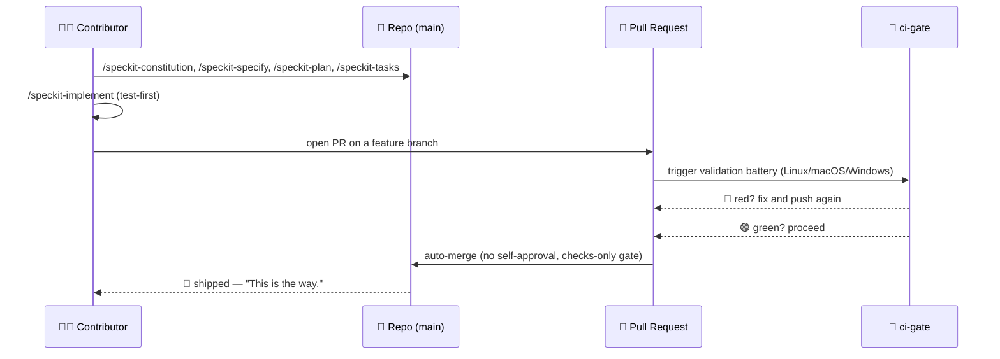
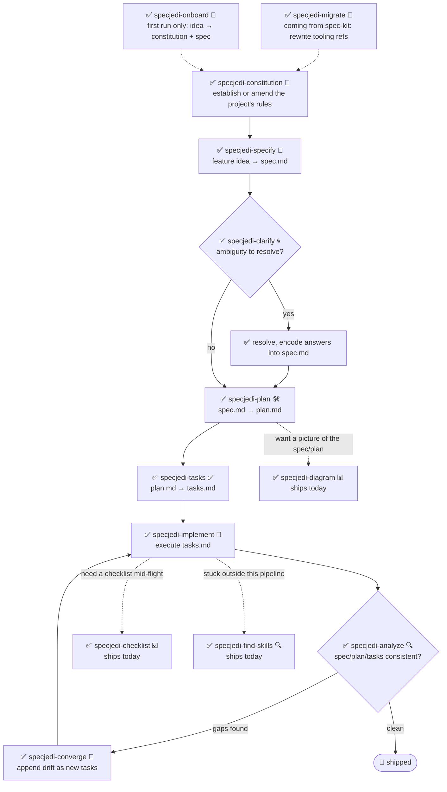

<!-- i18n-sync: source=README.md@e0a1fb8 lang=pt -->
> 🌐 Este documento é uma tradução assistida por IA. **O inglês é a fonte
> canônica** ([Principle I](../../../.specify/memory/constitution.md)); em
> caso de divergência, prevalece o inglês. Ver outros idiomas:
> [English](../../../README.md) · [中文](../zh/README.md) ·
> [हिन्दी](../hi/README.md) · [Español](../es/README.md) ·
> [Français](../fr/README.md) · [العربية](../ar/README.md) ·
> [বাংলা](../bn/README.md) · [Português](../pt/README.md) ·
> [Русский](../ru/README.md) · [اردو](../ur/README.md) ·
> [Bahasa Indonesia](../id/README.md)

#  Spec Jedi

[](https://github.com/jonyfs/spec-jedi/actions/workflows/validate.yml)
[](../../../LICENSE)
[](../../../.specify/memory/constitution.md)
[](#o-que-voc%C3%AA-tem-hoje)
[](#o-que-voc%C3%AA-tem-hoje)
[](../../../references/skill-roadmap.md)
[](#instala%C3%A7%C3%A3o)
[](../../../docs/i18n/)
[](../../../.specify/memory/constitution.md)
[](https://github.com/jonyfs/spec-jedi/commits/main)

> *"Primeiro a especificação. Depois o código. Esse é o caminho."* — um
> Mestre sábio, provavelmente.

Spec Jedi é um conjunto de skills de Desenvolvimento Guiado por
Especificações (Spec-Driven Development, SDD) que você instala no agente
de codificação de sua escolha. Em vez de escrever código primeiro e
documentá-lo depois, você escreve uma **constitution** 📜 (as regras
inegociáveis do seu projeto), uma **specification** 🎯 (o que você está
construindo e por quê), um **plan** 🛠️ (como, tecnicamente) e uma
**task list** ✅ (os passos ordenados) — e seu agente implementa a partir
desses artefatos em vez de improvisar como um Padawan que pulou o
treinamento.

Este repositório em si é construído com a mesma disciplina que entrega:
sua própria [constitution](../../../.specify/memory/constitution.md) é a
fonte de autoridade sobre como o projeto se comporta, incluindo como as
releases são versionadas e como os pull requests são validados e
mesclados. Nenhum atalho para o Lado Sombrio do vibe-coding aqui. 🚫🖤

*(Branding não oficial, inspirado por fãs — Spec Jedi não é afiliado,
endossado ou patrocinado por Lucasfilm/Disney. Que a Spec esteja com
você. 🌌 Ícone de "sabre de luz" por Carlos von Dessauer, do
[Noun Project](https://thenounproject.com), usado sob licença CC BY 3.0.)*

## Para quem é isso

Qualquer pessoa que use um agente de codificação com IA e queira que
specs, plans e tasks sejam artefatos versionados de primeira classe em
vez de mensagens de chat descartáveis — desenvolvedores independentes,
equipes padronizando como seus agentes trabalham, e qualquer um cansado
de reexplicar o contexto do projeto a cada sessão.

## O que você tem hoje

Spec Jedi é um **concorrente** genuíno do
[spec-kit](https://github.com/github/spec-kit), não um wrapper temático
dele ([Principle XV](../../../.specify/memory/constitution.md)). O
pipeline `specjedi-*` completo de SDD — da constitution até a
convergência — está **completo e disponível**: todos os 9 estágios,
construídos uma história rigorosa de cada vez seguindo a disciplina de
pesquisa competitiva do
[research.md](../../../specs/001-specjedi-pipeline/research.md)
(Principle II), nunca apressado.

**Disponível hoje, instale e use agora:**

| Skill | O que faz |
|---|---|
| `specjedi-onboard` 🌱 | Tour guiado de primeira execução para um projeto totalmente novo — produz juntos um primeiro `constitution.md` e `spec.md` reais, ensinando cada conceito de SDD exatamente quando necessário. Se afasta imediatamente se o onboarding já aconteceu |
| `specjedi-constitution` 📜 | Estabelece ou emenda as regras inegociáveis de um projeto — a base contra a qual toda outra skill `specjedi-*` se verifica. Veja [spec](../../../specs/001-specjedi-pipeline/spec.md) |
| `specjedi-specify` 🎯 | Transforma uma ideia de funcionalidade — uma frase basta — em um `spec.md` priorizado e testável de forma independente, marcando ambiguidade real em vez de adivinhar |
| `specjedi-clarify` 🌀 | Varre uma spec em busca de ambiguidade real e faz até 5 perguntas priorizadas — cada uma com uma resposta recomendada, para que um iniciante receba orientação e um especialista possa responder em uma palavra — antes de planejar sobre um palpite |
| `specjedi-plan` 🛠️ | Transforma uma spec já esclarecida em um `plan.md` técnico — primeiro varre a base de código real em busca de convenções existentes, para que a implementação nunca precise parar e procurar um padrão que já existe |
| `specjedi-tasks` ✅ | Quebra um plano em um `tasks.md` ordenado e consciente de dependências, agrupado por história de usuário — sequencia um teste que falha antes de sua tarefa de implementação correspondente onde quer que o plano exija código |
| `specjedi-implement` 🔨 | Executa `tasks.md` em ordem de dependência, com testes primeiro onde o plano exige código — só confirma mudanças por meio de um branch de feature e um pull request, nunca diretamente no `main` |
| `specjedi-analyze` 🔍 | Verificação cruzada estritamente somente-leitura de `spec.md`/`plan.md`/`tasks.md` (e a constitution) em busca de lacunas, duplicação e contradições — reporta descobertas, nunca edita um arquivo |
| `specjedi-checklist` ☑️ | Gera uma checklist personalizada para uma área de foco nomeada (segurança, acessibilidade, performance...) fundamentada inteiramente no `spec.md`/`plan.md` próprio desta feature — nunca boilerplate genérico |
| `specjedi-converge` 🔁 | Detecta desvio entre a base de código real e `tasks.md` após mudanças manuais, adicionando qualquer lacuna como uma nova tarefa em vez de ignorá-la silenciosamente — fecha o loop de volta para `specjedi-implement` |
| `specjedi-find-skills` 🔍 | Sugere uma skill específica e verificada quando seu pedido toca um domínio que o conjunto instalado não cobre bem — nunca instala sem perguntar antes ([Principle XVII](../../../.specify/memory/constitution.md)) |
| `specjedi-explain` 🎓 | Explica qualquer conceito ou comando de SDD, calibrado conforme o quão experiente você soa — de iniciante total a praticante diário, nunca a mesma resposta engessada para ambos ([Principle XIX](../../../.specify/memory/constitution.md)) |
| `specjedi-migrate` 🔄 | Reescreve referências literais a ferramentas `/speckit-*` na sua própria constitution/spec/plan/tasks para seus equivalentes `specjedi-*` — nunca toca em conteúdo de princípio ou requisito, só a pedido explícito |
| `specjedi-diagram` 📊 | Gera um diagrama Mermaid verificado por renderização — o tipo correto escolhido de todo o catálogo Mermaid (flowchart, sequência, ER, classe, estado, Gantt, linha do tempo, jornada do usuário, kanban, mapa mental, quadrante, pizza, e mais) — a partir de um `spec.md`/`plan.md` existente — sempre um complemento à prosa fonte, nunca um substituto |
| `specjedi-status` 🧭 | Dashboard de todo o projeto mostrando o status de cada feature, derivado inteiramente dos artefatos `spec.md`/`plan.md`/`tasks.md` em disco — zero sistema de rastreamento mantido separadamente, nunca afirma "parado" como um fato |
| `specjedi-retro` 🪞 | Retrospectiva estritamente somente-leitura comparando a implementação real de uma feature concluída com seu `plan.md` — fundamenta a causa de qualquer desvio no histórico real do git, nunca inventa uma, registra uma entrada durável e datada |
| `specjedi-security` 🛡️ | Aviso leve e proativo do tipo "pensamos em X" para lacunas de autenticação/validação de entrada/segredos/privacidade de dados — auto-invocado por `specjedi-plan`, nunca afirma ser uma revisão de segurança completa |
| `specjedi-docs` 📚 | Redige um rascunho de linha da tabela de skills do README, um passo de Quickstart, e uma entrada de `CHANGELOG.md` a partir do spec/plan de uma feature já entregue — fundamentado em conteúdo real, sempre mostrado para confirmação antes de escrever |
| `specjedi-new-skill` 🌟 | Estrutura o esqueleto de arquivos de uma nova skill `specjedi-*` — apenas placeholders, nunca conteúdo inventado — seguindo o Skill Authoring Standard próprio deste projeto e incorporando a checklist de pesquisa do Principle II |
| `specjedi-release` 🚀 | Envolve `scripts/suggest-release.sh` com a voz própria do Spec Jedi — narra a última tag, a próxima versão sugerida, e os commits contribuintes; recusa e nomeia o comando manual se pedirem para realmente cortar uma release |
| `specjedi-skill-review` 🎓 | Auditoria estritamente somente-leitura do `SKILL.md` de uma skill `specjedi-*` contra o Skill Authoring Standard — verifica o conteúdo das seções, não só os títulos, cruza com o `plan.md` correspondente em busca de isenções legítimas, reporta descobertas ou um resultado limpo, nunca edita o arquivo revisado |
| `specjedi-tokencheck` 🎒 | Verifica proativamente se `rtk` e `graphify` estão instalados, explica o que falta e sua economia de tokens esperada, e oferece um passo a passo de instalação — auto-invocado pelo fluxo de primeira execução do `specjedi-onboard`, também funciona sozinho; nunca instala nada sem confirmação explícita |
| `specjedi-govcheck` ⚖️ | Checklist de conformidade de governança estritamente somente-leitura por PR/branch contra os 20 princípios da constitution — relatório de três estados (N/A / Conforme / Não Conforme), qualquer conflito é CRITICAL — auto-invocado por `specjedi-implement` antes de abrir um PR (nunca o bloqueia), também funciona sozinho contra o branch atual ou um PR nomeado |

Veja [`references/skill-roadmap.md`](../../../references/skill-roadmap.md)
para o que é proposto além do pipeline central (diagramas, e mais) — um
backlog de skills *adicionais*, não lacunas do pipeline central; cada uma
ainda precisa de sua própria pesquisa antes de ser construída.

## Como o Spec Jedi constrói *a si mesmo*, em forma de quadrinho

> ⚠️ **Esta seção é sobre nosso processo interno de bootstrap, não sobre
> o produto Spec Jedi.** Os comandos `/speckit-*` abaixo são ferramentas
> próprias do [spec-kit](https://github.com/github/spec-kit) — o Spec
> Jedi atualmente usa o spec-kit para se construir (o mesmo padrão de
> "inicializar um compilador com um compilador mais antigo"), da mesma
> forma que qualquer concorrente pode usar as ferramentas de um
> incumbente enquanto constrói seu substituto. **Se você está avaliando o
> Spec Jedi como produto, vá direto para
> [O que você tem hoje](#o-que-você-tem-hoje) abaixo** — a superfície de
> produto real são as skills `specjedi-*`, não estas. Veja o
> [Principle XV](../../../.specify/memory/constitution.md) para a
> política completa sobre por que elas são mantidas claramente separadas.
>
> Também, uma nota sobre o formato: estes são painéis de quadrinhos em
> texto e emojis, não arte gerada. Imagens reais de Star Wars
> (personagens, naves, o logo) são propriedade intelectual da
> Lucasfilm/Disney — o próprio
> [Principle XII](../../../.specify/memory/constitution.md) deste
> projeto se compromete a usar apenas referências em texto, nunca
> reproduzindo arte protegida por direitos autorais. Então: os momentos
> da história são reais, os painéis são Markdown. 🖋️

---

**PAINEL 1 — Um terminal solitário, cursor piscando.**
> 🧑‍💻 *"Tenho uma ideia para uma feature. ...E agora?"*

**PAINEL 2 — Uma figura encapuzada sai das sombras, segurando um pergaminho.**
> 🧙 *"Primeiro, o Código."* 📜
> `/speckit-constitution` — as regras inegociáveis do projeto, escritas
> uma vez, verificadas para sempre depois.

**PAINEL 3 — A ideia, pregada em uma parede, pontos de interrogação girando ao redor.**
> 🌀 *"O que você está realmente construindo — e para quem?"*
> `/speckit-specify` transforma a ideia em `spec.md`. `/speckit-clarify`
> caça a ambiguidade antes que ela vire um bug.

**PAINEL 4 — Um blueprint se desenrola sobre uma bancada de trabalho.**
> 🛠️ *"Agora o como."*
> `/speckit-plan` → `plan.md`. `/speckit-tasks` → um `tasks.md` ordenado
> e consciente de dependências. Nenhum passo pulado, nenhum passo fora
> de ordem.

**PAINEL 5 — Ferramentas zunindo, testes falhando em vermelho, depois virando verde um a um.**
> 🤖 *"Testes primeiro. Sempre testes primeiro."*
> `/speckit-implement` executa `tasks.md`, com testes primeiro onde se
> aplica ([Principle VI](../../../.specify/memory/constitution.md)).

**PAINEL 6 — Uma câmara do conselho. Um pull request se apresenta diante do banco.**
> 🏛️ *"Declare suas mudanças."*
> Um PR abre. `ci-gate` 🤖 executa toda a bateria de validação — cada SO,
> cada verificação. Nenhuma auto-aprovação permitida; a máquina não pode
> perdoar a si mesma, e você também não
> ([Principle X](../../../.specify/memory/constitution.md)).

**PAINEL 7 — Luz verde. O portão se abre sozinho.**
> ✅ *"A bateria falou."*
> Todas as verificações passam → auto-merge, sem nenhum humano precisar
> clicar em um botão.

**PAINEL 8 — Uma nave salta para o hiperespaço.**
> 🚀 *"Entregue."*
> 🌌 *"Que a Spec esteja com você."*

### A mesma história de bootstrap interno, como diagrama



## Pré-requisitos

Spec Jedi é desenvolvido e validado em **Linux, macOS e Windows**
(Constitution [Principle XIII](../../../.specify/memory/constitution.md))
— cada script sob `scripts/` é distribuído tanto em shell POSIX (`.sh`)
quanto em PowerShell nativo (`.ps1`), e o CI roda a bateria nos três
sistemas operacionais em cada PR.

- `git`
- Um agente de codificação suportado (veja
  [Ambientes suportados](#ambientes-suportados) abaixo)
- [GitHub CLI (`gh`)](https://cli.github.com/), somente se você planeja
  contribuir mudanças de volta via pull request
- Somente se você quiser rodar os scripts auxiliares localmente
  (opcional — o agente de codificação em si não precisa deles): um shell
  POSIX (bash/zsh, presente por padrão em Linux e macOS) **ou**
  [PowerShell 7+](https://aka.ms/powershell) (`pwsh`), que roda nos três
  sistemas operacionais

## Instalação

### Claude Code (totalmente suportado hoje)

O passo de clone difere ligeiramente por SO; tudo depois disso é
idêntico.

**Linux / macOS** (Terminal):

```bash
git clone https://github.com/jonyfs/spec-jedi.git
cd spec-jedi
```

**Windows — PowerShell nativo** (sem necessidade de WSL):

```powershell
git clone https://github.com/jonyfs/spec-jedi.git
cd spec-jedi
```

**Windows — WSL ou Git Bash** (se você preferir um shell tipo Unix no
Windows):

```bash
git clone https://github.com/jonyfs/spec-jedi.git
cd spec-jedi
```

Ambos os caminhos do Windows funcionam igualmente bem — escolha o que
você já usa no dia a dia. A única diferença daí em diante é qual script
auxiliar você roda (`scripts/*.sh` em um shell POSIX, `scripts/*.ps1` em
PowerShell nativo); as skills em si funcionam de forma idêntica em
ambos os casos.

1. Clone o repositório usando o bloco acima para o seu SO.

2. Abra a pasta no [Claude Code](https://claude.com/claude-code). O
   Claude Code descobre automaticamente cada skill sob
   `.claude/skills/*/SKILL.md` — não há passo de instalação separado ou
   processo de build, e este passo é idêntico nos três sistemas
   operacionais.

3. Confirme que as skills carregaram digitando `/` no prompt do Claude
   Code. Você verá as 23 skills de produto `specjedi-*` e os comandos
   `speckit-*` (a ferramentaria interna de bootstrap própria deste
   repositório — veja
   [O que você tem hoje](#o-que-você-tem-hoje)) listados juntos, já que
   o Claude Code descobre cada skill sob `.claude/skills/` sem
   distinguir entre os dois.

4. É isso — agora você está pronto para rodar `specjedi-onboard` para
   uma primeira execução guiada, perguntar qualquer coisa ao
   `specjedi-explain` se não tiver certeza de onde começar, ou ler a
   constitution para entender para onde o resto do pipeline está indo.

**Usando o Spec Jedi em um projeto diferente deste?** Rode o instalador
(Constitution
[Principle XVIII](../../../.specify/memory/constitution.md)) — ele copia
apenas as skills de produto `specjedi-*`, nunca a ferramentaria de
bootstrap `speckit-*`, mais os quatro arquivos
`.specify/templates/*.md` que essas skills precisam, e valida o
resultado antes de terminar:

```bash
# a partir de um checkout do Spec Jedi, mirando outro projeto no disco
./scripts/install.sh /path/to/your-project
```

```powershell
# Windows PowerShell nativo
.\scripts\install.ps1 -TargetDir C:\path\to\your-project
```

`--harness` agora é opcional — se omitido, o instalador tenta detectar
qual agente de codificação você está usando (um diretório do projeto já
existente, um binário no `PATH`, ou um diretório de configuração global
já existente) e instala automaticamente para ele — só pergunta se a
detecção encontrar mais de uma correspondência plausível. `claude-code`,
`codex-cli` e `trae` estão construídos e testados hoje; qualquer outro
valor explícito é reportado como ainda-não-suportado em vez de tentado
silenciosamente — veja [Ambientes suportados](#ambientes-suportados)
abaixo. Rode `./scripts/install.sh --help` (ou `.\scripts\install.ps1
-Help`) para a lista completa de opções, incluindo `--auto`.

### Ambientes suportados

A constitution do Spec Jedi
([Principle III](../../../.specify/memory/constitution.md)) compromete
este projeto a eventualmente suportar as vinte ferramentas/ambientes de
codificação com LLM mais usados no mercado. Hoje, dois caminhos foram
construídos, testados e documentados de ponta a ponta: Claude Code (veja
os passos acima) e Codex CLI (`./scripts/install.sh --harness
codex-cli` / `.\scripts\install.ps1 -Harness codex-cli`, instalando em
`.agents/skills/` — verificado contra a própria convenção documentada de
descoberta de skills do Codex CLI).

| Ambiente | Status |
|---|---|
| Claude Code | ✅ Suportado — veja os passos acima |
| Cursor | 📋 Planejado — ainda não instalável |
| GitHub Copilot (Chat/Workspace) | 📋 Planejado — ainda não instalável |
| Codex CLI (OpenAI) | ✅ Suportado — `./scripts/install.sh --harness codex-cli` (instala em `.agents/skills/`) |
| Gemini CLI | 📋 Planejado — ainda não instalável |
| Antigravity (Google) | 📋 Planejado — ainda não instalável |
| Windsurf (Codeium) | 📋 Planejado — ainda não instalável |
| Cline | 📋 Planejado — ainda não instalável |
| Continue | 📋 Planejado — ainda não instalável |
| Aider | 📋 Planejado — ainda não instalável |
| Amazon Q Developer | 📋 Planejado — ainda não instalável |
| JetBrains AI Assistant | 📋 Planejado — ainda não instalável |
| Zed | 📋 Planejado — ainda não instalável |
| OpenCode | ✅ Suportado — satisfeito pela instalação `claude-code` ou `codex-cli` (o OpenCode escaneia nativamente tanto `.claude/skills/` quanto `.agents/skills/`), sem necessidade de flag separada |
| Warp (Agent Mode) | ✅ Suportado — satisfeito pela instalação `claude-code` ou `codex-cli` (o sistema de Skills do Warp escaneia nativamente tanto `.claude/skills/` quanto `.agents/skills/`), sem necessidade de flag separada |
| Replit Agent | 📋 Planejado — ainda não instalável |
| Devin (Cognition) | 📋 Planejado — ainda não instalável |
| Tabnine | 📋 Planejado — ainda não instalável |
| Sourcegraph Cody | 📋 Planejado — ainda não instalável |
| Trae | ✅ Suportado — `./scripts/install.sh --harness trae` (instala em `.trae/skills/`) |

Vinte ambientes nomeados individualmente conforme o mandato de "pelo
menos vinte" do Principle III — apenas status (✅ suportado / 📋
planejado), sem alegações de capacidade para nenhum ambiente que este
projeto não tenha de fato construído e testado, seguindo a disciplina de
resistência à alucinação do Principle XX. "Planejado" é um status, não
uma data prometida de roadmap.

Se o seu ambiente ainda não está listado como suportado, os arquivos
`SKILL.md` são Markdown puro com frontmatter YAML — muitos ambientes que
suportam instruções/prompts personalizados já conseguem lê-los
diretamente mesmo sem um caminho de instalação dedicado, mas isso ainda
não foi verificado ou documentado ambiente por ambiente. Veja
[`references/harness-capability-notes.md`](../../../references/harness-capability-notes.md)
para notas de capacidade por ambiente baseadas em pesquisa documental.

Curioso para saber como o Spec Jedi se compara ao spec-kit e às outras
dez ferramentas de SDD contra as quais foi avaliado? Veja
[`references/competitive-comparison.md`](../../../references/competitive-comparison.md).

## Guia rápido

Vinte e três skills de produto estão disponíveis hoje
([O que você tem hoje](#o-que-você-tem-hoje)) — o pipeline `specjedi-*`
completo está terminado. Nunca usou uma ferramenta de SDD antes? Comece
pelo passo 0.

0. **Não tem certeza do que tudo isso significa?** Simplesmente
   pergunte — "o que é uma spec e por que eu precisaria de uma", "o que
   este projeto realmente faz". `specjedi-explain` 🎓 responde na
   profundidade que você precisa, iniciante ou avançado, e sempre aponta
   o que rodar em seguida
   ([Principle XIX](../../../.specify/memory/constitution.md)).
1. Instale (veja [Instalação](#instalação) acima).
2. Projeto totalmente novo, sem ideia de por onde começar?
   `specjedi-onboard` 🌱 te guia para produzir juntos um primeiro
   `constitution.md` e `spec.md` reais a partir de uma ideia de uma
   frase, explicando cada conceito só quando você realmente precisa —
   nunca uma parede de documentação de saída. (Os passos 3-4 abaixo são
   exatamente o que ele orquestra para você; pule direto para eles se
   preferir rodar cada estágio sozinho.)
3. Estabeleça as regras do seu projeto: descreva seus inegociáveis em
   linguagem simples e `specjedi-constitution` 📜 produz um
   `.specify/memory/constitution.md` versionado — toda outra skill
   `specjedi-*` verifica sua própria saída contra ele.
4. Especifique uma feature: descreva o que você quer construir — uma
   ideia aproximada de uma frase basta — e `specjedi-specify` 🎯 a
   transforma em um `spec.md` priorizado, testável de forma
   independente, marcando ambiguidade real em vez de adivinhá-la.
5. Não tem certeza se a spec já está sólida? `specjedi-clarify` 🌀 a
   varre em busca de ambiguidade real e faz até 5 perguntas priorizadas
   — cada uma com uma resposta recomendada, para que você possa aceitá-la
   em uma palavra ou ler o raciocínio se quiser — antes de planejar
   sobre um palpite.
6. Pronto para desenhar o "como"? `specjedi-plan` 🛠️ varre primeiro sua
   base de código real em busca de convenções existentes, depois
   transforma a spec esclarecida em um `plan.md` técnico — para que a
   implementação nunca precise parar e procurar um padrão que já existe
   em outro lugar do seu projeto. Se sua spec toca autenticação, entrada
   externa, segredos ou manuseio de dados, `specjedi-security` 🛡️ é
   acionada automaticamente com algumas perguntas direcionadas do tipo
   "pensamos em X" — um aviso leve, nunca uma revisão de segurança
   completa.
7. Pronto para quebrar em trabalho? `specjedi-tasks` ✅ transforma o
   plano em um `tasks.md` ordenado, consciente de dependências, agrupado
   por história de usuário — sequencia uma tarefa de teste que falha
   antes de sua tarefa de implementação correspondente onde quer que o
   plano exija código.
8. Pronto para construir? `specjedi-implement` 🔨 executa `tasks.md` em
   ordem de dependência, com testes primeiro onde o plano exige código —
   cada commit pousa em um branch de feature e um pull request, nunca
   diretamente no `main`.
9. Quer uma rede de segurança? `specjedi-analyze` 🔍 verifica de forma
   cruzada `spec.md`, `plan.md` e `tasks.md` (e sua constitution) em
   busca de lacunas, duplicação ou contradições — estritamente
   somente-leitura, executável a qualquer momento, nunca edita um
   arquivo.
10. Precisa de uma revisão direcionada? `specjedi-checklist` ☑️ gera uma
    checklist para uma área de foco nomeada — segurança, acessibilidade,
    performance, o que você nomear — fundamentada inteiramente no
    spec/plan próprio desta feature, nunca boilerplate genérico.
11. Mudou código à mão desde seu último `tasks.md`? `specjedi-converge`
    🔁 varre a base de código real, detecta qualquer capacidade sem
    tarefa correspondente, e a adiciona como novo trabalho em vez de
    deixá-la desviar silenciosamente — o estágio final do pipeline,
    fechando o loop de volta para `specjedi-implement`.
12. Travado em algo fora deste conjunto? Simplesmente descreva — "como
    eu faço X", "existe uma skill para X" — e `specjedi-find-skills` 🔍
    é acionada automaticamente, busca no ecossistema aberto de
    agent-skills, e sugere uma skill específica e verificada. Nunca
    instala nada sem perguntar antes
    ([Principle VIII](../../../.specify/memory/constitution.md)).
13. Vindo de um projeto spec-kit existente? `specjedi-migrate` 🔄
    reescreve as referências de ferramentas `/speckit-*` próprias do seu
    projeto para seus equivalentes `specjedi-*` — nunca toca em um
    princípio ou requisito, só a pedido explícito.
14. Quer uma imagem em vez de uma parede de prosa? `specjedi-diagram`
    📊 transforma uma spec ou plano em um diagrama Mermaid verificado
    por renderização — escolhendo o tipo de todo o catálogo (veja
    [`references/mermaid-diagram-catalog.md`](../../../references/mermaid-diagram-catalog.md))
    conforme o que o conteúdo real exija — sempre ao lado da prosa
    fonte, nunca no lugar
    dela.
15. Lidando com mais de uma ou duas features? `specjedi-status` 🧭
    mostra um dashboard de todo o projeto — quais features estão
    especificadas, planejadas, em progresso, ou completas — derivado
    inteiramente do que realmente está em disco, sem sistema de
    rastreamento separado para manter sincronizado.
16. Acabou de terminar uma feature? `specjedi-retro` 🪞 compara o que
    realmente foi entregue com o que o `plan.md` dizia, fundamenta a
    causa de qualquer desvio no histórico real do git — nunca inventa
    uma — e registra uma entrada durável para que o sinal sobreviva além
    desta conversa.
17. Entregou algo e precisa documentar? `specjedi-docs` 📚 redige a
    linha do README, o passo de Quickstart, e a entrada de
    `CHANGELOG.md` para você — fundamentado no seu spec/plan real,
    sempre mostrado para confirmação antes de escrever qualquer coisa.
18. Estendendo o próprio Spec Jedi com uma nova skill?
    `specjedi-new-skill` 🌟 estrutura o esqueleto de arquivos —
    `specs/`, esqueleto de `SKILL.md`, cada seção um placeholder
    rotulado — nunca inventa achados de pesquisa ou comportamento em seu
    nome.
19. Se perguntando se é hora de uma release? `specjedi-release` 🚀
    narra a própria sugestão do `scripts/suggest-release.sh` — última
    tag, próxima versão, commits contribuintes — e recusa com o comando
    manual exato se pedirem para realmente cortar uma; nunca cria tag ou
    publica sozinha.
20. Escreveu ou mudou uma skill `specjedi-*` à mão?
    `specjedi-skill-review` 🎓 verifica seu `SKILL.md` contra o Skill
    Authoring Standard — conteúdo das seções, não só títulos, cruzado
    com o `plan.md` correspondente em busca de isenções legítimas — e
    reporta descobertas ou um resultado limpo; nunca edita o arquivo em
    si.
21. `specjedi-onboard` já roda isso uma vez para você no primeiro uso,
    mas `specjedi-tokencheck` 🎒 também funciona sozinha — verifica se
    `rtk` e `graphify` estão instalados, explica o que falta e sua
    economia de tokens esperada, e se oferece para te guiar na
    instalação; nunca instala nada sem seu sim explícito.
22. `specjedi-implement` já roda isso antes de abrir cada PR, mas
    `specjedi-govcheck` ⚖️ também funciona sozinha — uma checklist por
    branch (ou PR) contra os 20 princípios da constitution, reportando
    cada um como não aplicável, conforme, ou não conforme, com qualquer
    conflito real marcado CRITICAL; estritamente somente-leitura, nunca
    edita nada, nunca bloqueia um PR de abrir por conta própria.

Conforme o [Principle XIV](../../../.specify/memory/constitution.md), o
que você acabou de rodar deveria te dizer o que rodar em seguida — você
não deveria precisar voltar a esta lista para descobrir. A cadeia
completa roda `specjedi-onboard` (só primeira execução) →
`specjedi-constitution` → `specjedi-specify` → `specjedi-clarify` →
`specjedi-plan` → `specjedi-tasks` → `specjedi-implement` →
`specjedi-analyze` → `specjedi-checklist` → `specjedi-converge`,
voltando em loop para `specjedi-implement` sempre que
`specjedi-converge` encontra um desvio para resolver.

### O pipeline, do início ao fim

Do onboarding à convergência — cada estágio abaixo está no ar:



✅ = disponível hoje — o pipeline `specjedi-*` completo de 9 estágios
está terminado, mais `specjedi-onboard` como o ponto de entrada guiado
de primeira execução.

## Companheiros recomendados

A constitution deste projeto
([Principle VIII](../../../.specify/memory/constitution.md)) direciona
cada sessão do Spec Jedi a sugerir proativamente, mas nunca instalar
silenciosamente, dois companheiros que economizam tokens:

- [`rtk`](https://github.com/rtk-ai/rtk) — um proxy CLI otimizado para
  tokens para operações comuns de desenvolvimento.
- [`graphify`](https://graphify.net/) — transforma uma base de código em
  um grafo de conhecimento consultável.

Se seu agente oferecer instalar ou configurar qualquer um dos dois, essa
é essa política em ação — sempre te perguntam antes.

**graphify já está integrado a este repositório** (com confirmação do
mantenedor): uma seção `## graphify` no `CLAUDE.md` diz ao Claude Code
para consultar o grafo de conhecimento antes de navegar pelo código
fonte e atualizá-lo após mudanças de código, e `.claude/settings.json`
registra hooks que direcionam chamadas de ferramenta para `graphify
query`/`explain`/`path` em vez de grep/read brutos assim que o grafo
existe. O grafo em si (`graphify-out/`) não é commitado — é um cache
derivado, regenerado a cada clone.

Para obter o mesmo comportamento de auto-atualização localmente após
clonar:

```bash
pip install graphifyy   # ou: uv tool install graphifyy
graphify .               # primeiro build (só necessário uma vez; também roda automaticamente no primeiro uso de qualquer forma)
graphify hook install    # reconstrói graph.json automaticamente após cada commit (mudanças de código)
```

Mudanças de documentação/conteúdo não são capturadas pelo hook de
commit — rode `graphify update .` (ou simplesmente peça ao seu agente)
após editar arquivos que não são código.

## Versionamento e releases

Spec Jedi segue o [Versionamento Semântico](https://semver.org/) para
suas próprias releases, limitado ao contrato público do pacote de
skills (mudança de comportamento de uma skill que quebra = MAJOR, novas
skills ou capacidade aditiva = MINOR, correções/documentação = PATCH).
Veja o [Principle XI](../../../.specify/memory/constitution.md) para a
política completa.

O projeto sugere quando uma release é justificada em vez de cortar uma
silenciosamente:

```bash
# Linux / macOS / Windows (WSL ou Git Bash)
./scripts/suggest-release.sh
```

```powershell
# Windows (PowerShell nativo)
./scripts/suggest-release.ps1
```

Isso inspeciona os commits desde a última tag e recomenda uma próxima
versão — nunca cria tag ou publica nada sozinho. Realmente cortar uma
release é sempre um passo deliberado, conduzido pelo mantenedor.

## Contribuindo

Veja [`CONTRIBUTING.md`](./CONTRIBUTING.md) para o processo completo de
contribuição — requisitos de pesquisa competitiva para novas skills, a
checklist do Skill Authoring Standard, e os passos de validação a rodar
antes de abrir um PR.

Cada mudança é entregue por meio de um pull request validado pela
bateria de CI própria deste projeto, e só é auto-mesclada uma vez que
cada verificação está verde (veja
[Principle IX e X](../../../.specify/memory/constitution.md)). Essa
bateria roda em Linux, macOS e Windows em cada PR (Principle XIII) — se
você adicionar ou mudar um script sob `scripts/`, tanto a versão `.sh`
quanto a `.ps1` devem existir e passar nos três. Os templates de issue e
PR (`.github/ISSUE_TEMPLATE/`, `.github/PULL_REQUEST_TEMPLATE.md`)
guiam os contribuidores a confirmar que realizaram os passos de
pesquisa e validação acima antes de solicitar revisão.

## Licença

[MIT](../../../LICENSE) — escolhida e exigida pela própria constitution
deste projeto (Distribution & Ecosystem Standards). Em linguagem
simples, MIT significa que você pode:

- **Usar** este projeto, comercialmente ou não, sem restrições.
- **Modificá-lo** como quiser.
- **Redistribuí-lo**, inclusive como parte de algo que você vende.

As únicas condições reais: manter o aviso de copyright original e o
texto da licença em algum lugar da sua cópia, e não esperar garantia — o
software é fornecido "como está", sem responsabilidade se algo quebrar.
Esse é o acordo completo; veja [`LICENSE`](../../../LICENSE) para o
texto legal exato.

---
