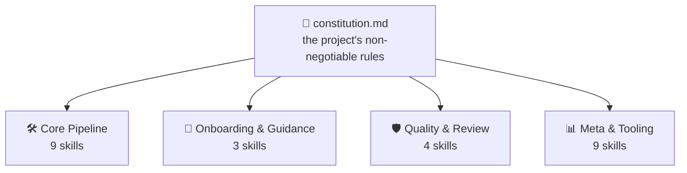
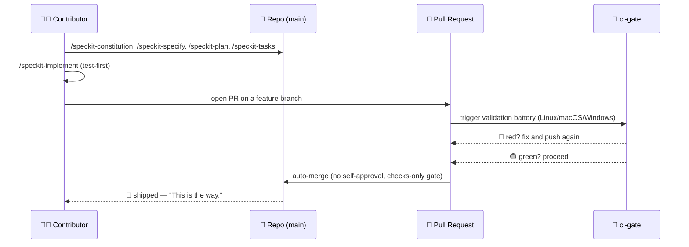

<!-- i18n-sync: source=README.md@1609524 lang=pt -->
> 🌐 Este documento é uma tradução assistida por IA. **O inglês é a fonte
> canônica** ([Principle I](../../../.specify/memory/constitution.md)); em
> caso de divergência, prevalece o inglês. Ver outros idiomas:
> [English](../../../README.md) · [中文](../zh/README.md) ·
> [हिन्दी](../hi/README.md) · [Español](../es/README.md) ·
> [Français](../fr/README.md) · [العربية](../ar/README.md) ·
> [বাংলা](../bn/README.md) · [Português](../pt/README.md) ·
> [Русский](../ru/README.md) · [اردو](../ur/README.md) ·
> [Bahasa Indonesia](../id/README.md)

# Spec Jedi

[](https://github.com/jonyfs/spec-jedi/actions/workflows/validate.yml)
[](../../../LICENSE)
[](../../../.specify/memory/constitution.md)
[](#como-o-spec-jedi-implementa-o-sdd)
[](#como-o-spec-jedi-implementa-o-sdd)
[](../../../references/skill-roadmap.md)
[](#instala%C3%A7%C3%A3o)
[](../../../docs/i18n/)
[](../../../.specify/memory/constitution.md)
[](https://github.com/jonyfs/spec-jedi/commits/main)

> *"Primeiro a especificação. Depois o código. Esse é o caminho."* — um
> Mestre sábio, provavelmente.


**Uma carta, de um Mestre para quem pegar este pergaminho a seguir:**

A maioria dos projetos que ultrapassam seu próprio plano compartilha a
mesma causa raiz: código primeiro, explicação depois — e esse depois
nunca chega de verdade. O que segue é a prática que inverte essa ordem, e
o projeto concreto construído para colocá-la em prática.

*(Branding não oficial, inspirado por fãs — Spec Jedi não é afiliado,
endossado ou patrocinado por Lucasfilm/Disney. Que a Spec esteja com
você. 🌌)*

## O que é Desenvolvimento Guiado por Especificações?

A forma padrão de construir software com um agente de codificação com
IA é esta: descrever o que você quer no chat, o agente escreve código,
você lê o código para descobrir se ele fez o que você quis dizer, você
corrige, repete. O entendimento do agente sobre "o que você quis dizer"
vive só na conversa — nunca fica escrito como um artefato durável e
revisável. Dois modos de falha decorrem disso: a ambiguidade é resolvida
adivinhando em vez de ser exposta para uma decisão, e nada sobrevive à
conversa — você fecha o chat, perde o raciocínio.

O Desenvolvimento Guiado por Especificações (Spec-Driven Development,
SDD) inverte essa ordem. Antes de existir uma única linha de código,
escreve-se o que está sendo construído e por quê, como um documento
estruturado e revisável — uma **constitution** 📜 (as regras
inegociáveis), uma **specification** 🎯 (o quê, e para quem), um **plan**
🛠️ (como, tecnicamente), e uma **task list** ✅ (os passos ordenados). O
código é gerado *a partir* desses artefatos, não o contrário — a mesma
disciplina que o Código Jedi exige de quem se sente tentado a pular as
partes chatas do treinamento. Explicação completa, sem nenhuma marca
própria do Spec Jedi:
[`references/what-is-sdd.md`](../../../references/what-is-sdd.md).



Tudo que vem depois se verifica contra a constitution, nunca o
contrário. Mude uma regra, e toda skill sente isso na próxima execução.

## Como o Spec Jedi implementa o SDD

Spec Jedi é um **concorrente** genuíno do
[spec-kit](https://github.com/github/spec-kit), não um wrapper temático
dele ([Principle XV](../../../.specify/memory/constitution.md)) — vinte
agentes de codificação suportados, de verdade, não só na teoria (veja
[Instalação](#instalação) abaixo). O pipeline `specjedi-*` completo de
SDD — da constitution até a convergência — está entregue por completo há
um bom tempo: todos os 9 estágios, cada um construído sobre pesquisa
competitiva real antes de escrever uma única linha
([research.md](../../../specs/001-specjedi-pipeline/research.md),
Principle II).

Cada atividade de SDD acima corresponde a uma skill `specjedi-*` real e
entregue, não uma aspiração: `specjedi-constitution` estabelece as
regras, `specjedi-specify` transforma uma ideia em um `spec.md`,
`specjedi-clarify` resolve a ambiguidade marcada, `specjedi-plan` e
`specjedi-tasks` produzem o plano técnico e a decomposição em tarefas, e
`specjedi-implement` (ou `specjedi-quick` para mudanças pequenas e bem
compreendidas) o executa com testes primeiro, apenas através de um
branch de feature e um pull request. Vinte e cinco skills estão
disponíveis hoje no total, em quatro disciplinas — o catálogo completo,
ambos os diagramas, e o passo a passo de 23 etapas vivem em
[`references/quickstart-guide.md`](../../../references/quickstart-guide.md);
o mapeamento completo de atividade para skill, incluindo três
contribuições genuínas além da prática genérica de SDD, vive em
[`references/specjedi-and-sdd.md`](../../../references/specjedi-and-sdd.md).

Curioso sobre o que vem a seguir?
[`references/skill-roadmap.md`](../../../references/skill-roadmap.md)
rastreia o que é proposto além do pipeline central — um backlog de
ideias *adicionais*, não lacunas do próprio pipeline. Cada uma ainda
precisa de sua própria pesquisa real antes de ser construída; nada aqui
é entregue por intuição.

## Para quem é isso

Cansado de reexplicar o mesmo contexto do projeto a cada sessão. Cansado
de ver um agente reinventar silenciosamente uma decisão que uma equipe
tomou e abandonou três semanas atrás, porque nada a deixou escrita em
algum lugar onde o agente pudesse encontrá-la. Não importa se é uma
única pessoa ou uma equipe inteira tentando fazer todos os agentes se
comportarem da mesma forma: quem quiser que specs, plans e tasks sejam
arquivos reais e versionados em vez de mensagens de chat que
desaparecem ao fechar a janela é o leitor a quem isso se dirige.

## Como o Spec Jedi constrói *a si mesmo*, em forma de quadrinho

> ⚠️ **Esta seção é sobre nosso processo interno de bootstrap, não sobre
> o produto Spec Jedi.** Os comandos `/speckit-*` abaixo são ferramentas
> próprias do [spec-kit](https://github.com/github/spec-kit) — o Spec
> Jedi atualmente usa o spec-kit para se construir (o mesmo padrão de
> "inicializar um compilador com um compilador mais antigo"), da mesma
> forma que qualquer concorrente pode usar as ferramentas de um
> incumbente enquanto constrói seu substituto. **Se você está avaliando o
> Spec Jedi como produto, vá direto para
> [Instalação](#instalação) abaixo** — a superfície de produto real são
> as skills `specjedi-*`, não estas. Veja o
> [Principle XV](../../../.specify/memory/constitution.md) para a
> política completa sobre por que elas são mantidas claramente separadas.
>
> Também, uma nota sobre o formato: os painéis abaixo combinam diálogo em
> texto e emojis com ilustrações originais — nunca imagens reais de Star
> Wars (personagens, naves, o logo), que são propriedade intelectual da
> Lucasfilm/Disney. O próprio
> [Principle XII](../../../.specify/memory/constitution.md) deste
> projeto se compromete a uma identidade visual original e referências de
> Star Wars apenas em texto, nunca reproduzindo arte protegida por
> direitos autorais nem arte que evoque as marcas visuais reconhecíveis
> próprias da saga. Então: os momentos da história são reais, a arte é
> original, e as palavras continuam carregando o significado sozinhas.
> 🖋️

---

Toda história começa da mesma forma: um quarto escuro, um terminal, um
cursor que não para de piscar até você dar a ele algo para fazer.


> 🧑‍💻 *"Tenho uma ideia para uma feature. ...E agora?"*

É aí que o mentor aparece — sem sabre de luz, só um pergaminho, porque a
primeira batalha aqui nunca é a última. `/speckit-constitution` escreve
as regras uma vez só, para que ninguém precise reaprendê-las do jeito
difícil três features depois.


> 🧙 *"Primeiro, o Código."* 📜

A ideia sobe na parede em seguida, cercada por cada pergunta que ainda
não respondeu — o que está sendo realmente construído, e para quem.
`/speckit-specify` a transforma em um `spec.md` real; `/speckit-clarify`
sai caçando a ambiguidade antes que ela vire um bug que ninguém quer
assumir depois.


> 🌀 *"O que você está realmente construindo — e para quem?"*

Depois vem o blueprint. `/speckit-plan` se torna `plan.md`,
`/speckit-tasks` o quebra em um `tasks.md` ordenado e consciente de
dependências — nada pulado, nada fora de ordem, o tipo de plano que um
Padawan conseguiria seguir sem perguntar duas vezes.


> 🛠️ *"Agora o como."*

As ferramentas começam a zunir. Os testes falham em vermelho, um após o
outro — e então, aos poucos, param de falhar. `/speckit-implement`
executa `tasks.md` com testes primeiro onde se aplica
([Principle VI](../../../.specify/memory/constitution.md)), porque uma
construção que pula essa etapa não passa de um palpite com passos
extras.


> 🤖 *"Testes primeiro. Sempre testes primeiro."*

Agora o conselho se reúne — não para abençoar o trabalho, só para
verificá-lo. Um pull request se apresenta diante do banco, e `ci-gate`
🤖 executa toda a bateria de validação: cada sistema operacional, cada
verificação, sem atalhos. Ninguém tem permissão para aprovar o próprio
trabalho aqui, nem máquina nem pessoa
([Principle X](../../../.specify/memory/constitution.md)).


> 🏛️ *"Declare suas mudanças."*

A luz fica verde, e o portão se abre sozinho — nenhuma mão na alavanca,
ninguém clicando em um botão. A bateria já disse o que precisava ser
dito.


> ✅ *"A bateria falou."*

E então se vai — rumo ao hiperespaço, entregue.


> 🚀 *"Entregue."*
> 🌌 *"Que a Spec esteja com você."*

Nada disso é hipotético — é o processo literal e repetido por trás dos
pull requests recentes deste próprio projeto —
[#82](https://github.com/jonyfs/spec-jedi/pull/82),
[#84](https://github.com/jonyfs/spec-jedi/pull/84),
[#87](https://github.com/jonyfs/spec-jedi/pull/87), para citar alguns —
do início ao fim, de verdade, toda vez.

### A mesma história de bootstrap interno, como diagrama



## Pré-requisitos

Nada exótico aqui. Spec Jedi é construído e testado em **Linux, macOS e
Windows** por igual (Constitution
[Principle XIII](../../../.specify/memory/constitution.md)) — cada
script sob `scripts/` é distribuído tanto em shell POSIX (`.sh`) quanto
em PowerShell nativo (`.ps1`), e o CI roda a bateria completa nos três
sistemas operacionais, em cada PR.

O que você realmente precisa:

- `git`
- Um agente de codificação suportado (veja
  [Ambientes suportados](#ambientes-suportados) abaixo)
- [GitHub CLI (`gh`)](https://cli.github.com/) — só se você pretende
  enviar pull requests de volta
- Um shell para rodar os scripts auxiliares localmente, se você quiser
  (o agente de codificação em si não precisa disso): bash/zsh, já
  presente em Linux e macOS, ou
  [PowerShell 7+](https://aka.ms/powershell) (`pwsh`), que roda em
  qualquer lugar

## Instalação

Um único comando. Sem `git clone`. `scripts/bootstrap-install.sh`/`.ps1`
(veja specs/024-bootstrap-installer se quiser a história completa)
buscam uma GitHub Release publicada e rodam o instalador empacotado dela
direto no seu diretório de destino:

```bash
curl -fsSL https://raw.githubusercontent.com/jonyfs/spec-jedi/main/scripts/bootstrap-install.sh \
  | bash -s -- /path/to/your-project --harness cursor
```

```powershell
&([scriptblock]::Create((iwr -useb https://raw.githubusercontent.com/jonyfs/spec-jedi/main/scripts/bootstrap-install.ps1).Content)) -TargetDir C:\path\to\your-project -Harness cursor
```

`--harness` é opcional. Se omitido, o instalador tenta descobrir qual
agente de codificação você está usando — `claude-code`, `codex-cli`, ou
`trae` — checando se existe um diretório de projeto, um binário no
`PATH`, ou uma pasta de configuração global já presente, e só pergunta
se encontrar mais de um candidato. Os outros 17 ambientes ainda não têm
um sinal de detecção confiável, então para eles você mesmo passa
`--harness` — a lista completa está logo abaixo em
[Ambientes suportados](#ambientes-suportados). Rode
`./scripts/bootstrap-install.sh --help` (ou
`.\scripts\bootstrap-install.ps1 -Help`) quando quiser a lista completa
de opções, incluindo `--auto`.

### Ambientes suportados

A constitution ([Principle III](../../../.specify/memory/constitution.md))
compromete este projeto a cobrir os vinte agentes de codificação mais
usados que existem — e a partir desta release, os vinte são reais,
testados e comprovados por CI, não aspiracionais. Quatro leem skills
nativamente do disco (Claude Code, Codex CLI, Trae, Antigravity — os
três últimos compartilhando apenas dois diretórios físicos entre si,
`.agents/skills/` e `.trae/skills/`, com OpenCode e Warp aproveitando
esses mesmos caminhos de graça). Os outros catorze não têm nenhum
conceito nativo de skills — apenas um arquivo de regras na raiz do
projeto, um pequeno diretório de regras, ou, no caso do Sourcegraph
Cody, um arquivo JSON de comandos personalizados — então o instalador
constrói uma **ponte**: os pacotes reais `specjedi-*` pousam igualmente
no local canônico `.claude/skills/`, e um pequeno adaptador (um arquivo,
ou um por skill para ambientes baseados em diretório) aponta para lá
usando a convenção que aquele ambiente realmente documenta.

Veja [`specs/023-full-harness-coverage/research.md`](../../../specs/023-full-harness-coverage/research.md)
se quiser a citação que fundamenta o mecanismo exato de cada ambiente —
nada aqui é adivinhado.

| Ambiente | Status |
|---|---|
| Claude Code | ✅ Suportado — o comando de [Instalação](#instalação) acima, omita `--harness` (detecção automática) ou passe `--harness claude-code` explicitamente |
| Cursor | ✅ Suportado — `./scripts/install.sh --harness cursor` (arquivos de ponte em `.cursor/rules/`) |
| GitHub Copilot (Chat/Workspace) | ✅ Suportado — `./scripts/install.sh --harness copilot` (arquivo de ponte em `.github/copilot-instructions.md`) |
| Codex CLI (OpenAI) | ✅ Suportado — `./scripts/install.sh --harness codex-cli` (instala em `.agents/skills/`) |
| Gemini CLI | ✅ Suportado — `./scripts/install.sh --harness gemini-cli` (arquivo de ponte em `GEMINI.md`; o Google está descontinuando o Gemini CLI em favor do Antigravity — veja [`references/harness-capability-notes.md`](../../../references/harness-capability-notes.md)) |
| Antigravity (Google) | ✅ Suportado — `./scripts/install.sh --harness antigravity` (instala em `.agents/skills/`, mesma convenção do Codex CLI) |
| Windsurf (Codeium) | ✅ Suportado — `./scripts/install.sh --harness windsurf` (arquivos de ponte em `.windsurf/rules/`) |
| Cline | ✅ Suportado — `./scripts/install.sh --harness cline` (arquivos de ponte em `.clinerules/`) |
| Continue | ✅ Suportado — `./scripts/install.sh --harness continue` (arquivos de ponte em `.continue/rules/`) |
| Aider | ✅ Suportado — `./scripts/install.sh --harness aider` (arquivo de ponte em `CONVENTIONS.md`) |
| Amazon Q Developer | ✅ Suportado — `./scripts/install.sh --harness amazon-q` (arquivos de ponte em `.amazonq/rules/`) |
| JetBrains AI Assistant | ✅ Suportado — `./scripts/install.sh --harness jetbrains-ai` (arquivos de ponte em `.aiassistant/rules/`) |
| Zed | ✅ Suportado — `./scripts/install.sh --harness zed` (arquivo de ponte em `.rules`) |
| OpenCode | ✅ Suportado — satisfeito pela instalação `claude-code` ou `codex-cli` (o OpenCode escaneia nativamente tanto `.claude/skills/` quanto `.agents/skills/`), sem necessidade de flag separada |
| Warp (Agent Mode) | ✅ Suportado — satisfeito pela instalação `claude-code` ou `codex-cli` (o sistema de Skills do Warp escaneia nativamente tanto `.claude/skills/` quanto `.agents/skills/`), sem necessidade de flag separada |
| Replit Agent | ✅ Suportado — `./scripts/install.sh --harness replit` (arquivo de ponte em `replit.md`) |
| Devin (Cognition) | ✅ Suportado — `./scripts/install.sh --harness devin` (arquivo de ponte em `.devin.md`, estruturado como um Devin Playbook) |
| Tabnine | ✅ Suportado — `./scripts/install.sh --harness tabnine` (arquivos de ponte em `.tabnine/guidelines/`) |
| Sourcegraph Cody | ✅ Suportado — `./scripts/install.sh --harness cody` (comandos personalizados em `.vscode/cody.json`, invocados explicitamente como `/specjedi-<name>`; diferente de todos os outros ambientes acima, o Cody não tem um arquivo de regras sempre ativo confirmado, então isso é invocação manual, não contexto automático — veja o documento de pesquisa) |
| Trae | ✅ Suportado — `./scripts/install.sh --harness trae` (instala em `.trae/skills/`) |

Os vinte ambientes nomeados individualmente, todos ✅ Suportados — esse
é o próprio padrão do Principle III. Sem alegações de capacidade para
nenhum mecanismo que este projeto não tenha de fato construído e
testado; o Principle XX não permite adivinhar aqui.

Quer mais? [`references/harness-capability-notes.md`](../../../references/harness-capability-notes.md)
tem as notas de pesquisa documental originais por ambiente, e
[`specs/023-full-harness-coverage/research.md`](../../../specs/023-full-harness-coverage/research.md)
tem as decisões de mecanismo de instalação reais e as citações nas quais
toda essa tabela se baseia.

## Avaliação honesta

Vantagens reais, limitações atuais reais — não uma página de marketing.
Vinte dos vinte ambientes-alvo têm um caminho de instalação real
testado por CI, os diagramas são verificados por renderização antes de
serem mostrados, e a constitution é um documento vivo e versionado na
v1.24.0 com um histórico de emendas documentado. A outra metade, dita
com franqueza: nenhuma release foi cortada ainda (`git tag -l` não
retorna nada no momento em que isso é escrito), e a maioria dos
caminhos de instalação de ambientes-ponte se fundamenta em pesquisa
documental, não em uma sessão prática dentro do produto real de
terceiros. O quadro completo, sem filtro:
[`references/honest-assessment.md`](../../../references/honest-assessment.md).

Vinte ambientes nomeados individualmente, todos comprovados por CI —
mas 18 dos 19 ambientes que não são Claude Code foram confirmados por
pesquisa documental (uma fonte citada por ambiente), não instalando no
produto real e observando uma skill carregar; só o status do
Sourcegraph Cody mudou após uma pesquisa de acompanhamento mais
profunda que não encontrou nenhum arquivo de regras sempre ativo
confirmado. Citações por ambiente e o histórico completo de pesquisa:
[`references/harness-capability-notes.md`](../../../references/harness-capability-notes.md).

Curioso para saber como o Spec Jedi se compara ao spec-kit e às outras
dez ferramentas de SDD contra as quais foi avaliado?
[`references/competitive-comparison.md`](../../../references/competitive-comparison.md)
tem os recibos.

## Contribuindo

Veja [`CONTRIBUTING.md`](./CONTRIBUTING.md) para o processo completo —
requisitos de pesquisa competitiva para novas skills, a checklist do
Skill Authoring Standard, e os passos de validação a rodar antes de
abrir um PR.

Cada mudança é entregue por meio de um pull request, validado pela
bateria de CI própria deste projeto e só auto-mesclado uma vez que cada
verificação está verde
([Principle IX e X](../../../.specify/memory/constitution.md)). Essa
bateria roda em Linux, macOS e Windows em cada PR (Principle XIII) —
adicione ou mude um script sob `scripts/`, e tanto a versão `.sh`
quanto a `.ps1` precisam existir e passar nos três, sem exceções. Os
templates de issue e PR (`.github/ISSUE_TEMPLATE/`,
`.github/PULL_REQUEST_TEMPLATE.md`) guiam você para confirmar que
realmente fez a pesquisa e a validação acima antes de solicitar
revisão.

## Licença

[MIT](../../../LICENSE) — exigida pela própria constitution deste
projeto (Distribution & Ecosystem Standards), não só um padrão em que
ninguém pensou. Em linguagem simples, MIT significa que você pode:

- **Usar** este projeto, comercialmente ou não, sem restrições.
- **Modificá-lo** como quiser.
- **Redistribuí-lo**, inclusive como parte de algo que você vende.

As condições reais, e só há duas: manter o aviso de copyright original
e o texto da licença em algum lugar da sua cópia, e não esperar
garantia — o software é fornecido "como está", sem responsabilidade se
algo quebrar. Esse é genuinamente todo o acordo;
[`LICENSE`](../../../LICENSE) tem o texto legal exato se você o quiser
palavra por palavra.

---

🌌 *Que a Spec esteja com você.*
