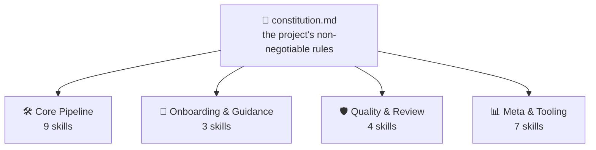
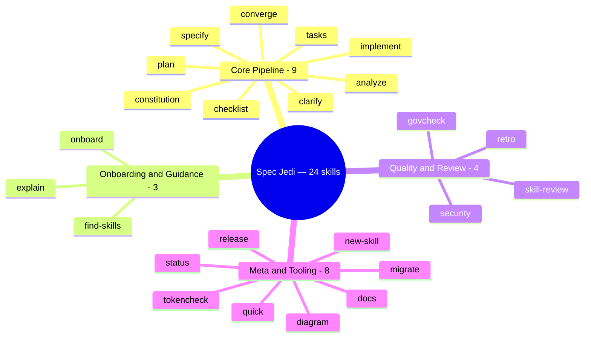
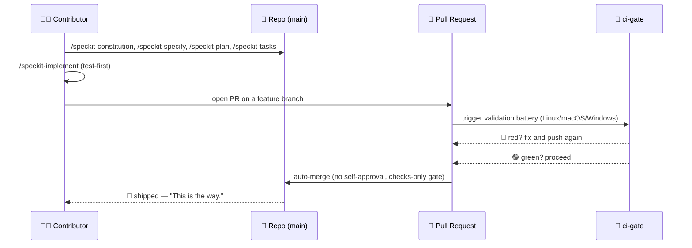
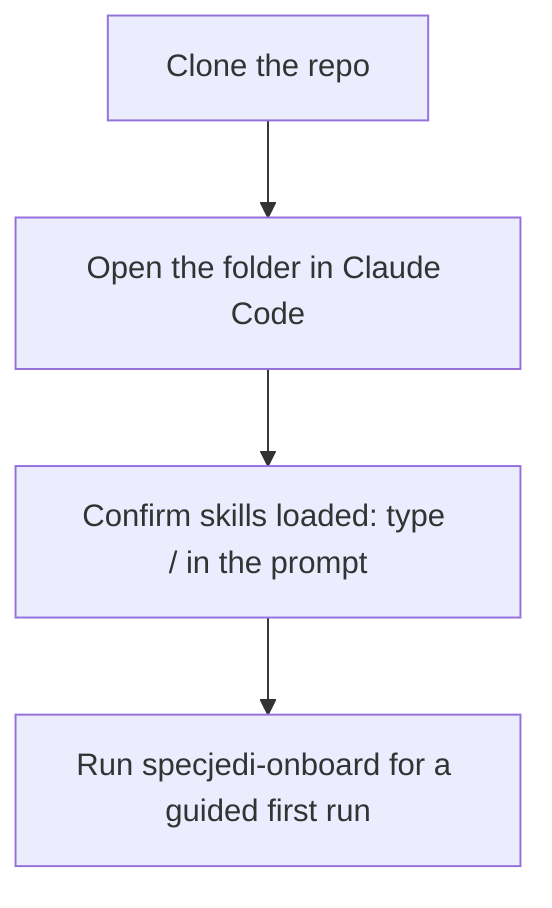
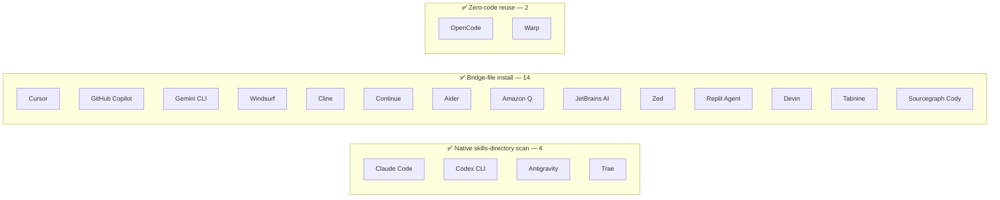
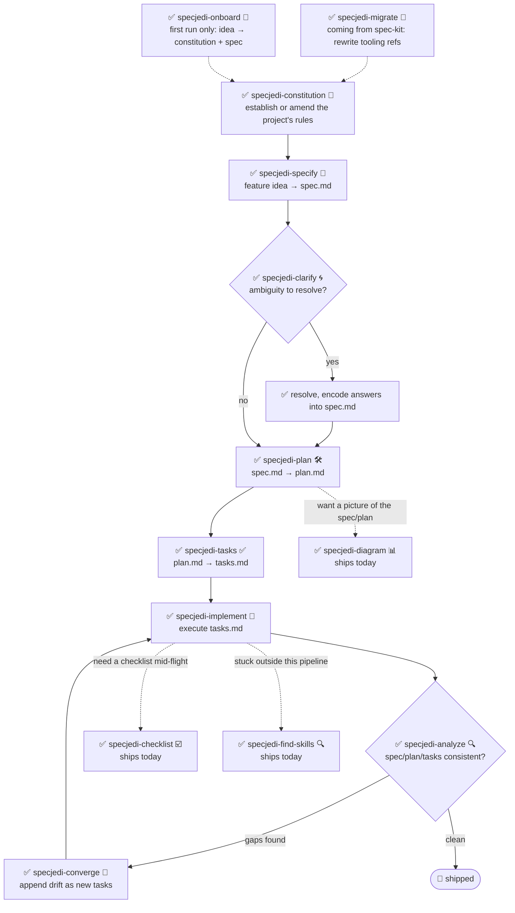

<!-- i18n-sync: source=README.md@bf963a8 lang=ru -->
> 🌐 Этот документ переведён с помощью ИИ. **Английский является
> каноническим источником**
> ([Principle I](../../../.specify/memory/constitution.md)); в случае
> расхождений английский текст имеет приоритет. Другие языки:
> [English](../../../README.md) · [中文](../zh/README.md) ·
> [हिन्दी](../hi/README.md) · [Español](../es/README.md) ·
> [Français](../fr/README.md) · [العربية](../ar/README.md) ·
> [বাংলা](../bn/README.md) · [Português](../pt/README.md) ·
> [Русский](../ru/README.md) · [اردو](../ur/README.md) ·
> [Bahasa Indonesia](../id/README.md)

#  Spec Jedi

[](https://github.com/jonyfs/spec-jedi/actions/workflows/validate.yml)
[](../../../LICENSE)
[](../../../.specify/memory/constitution.md)
[](#что-вы-получаете-сегодня)
[](#что-вы-получаете-сегодня)
[](../../../references/skill-roadmap.md)
[](#установка)
[](../../../docs/i18n/)
[](../../../.specify/memory/constitution.md)
[](https://github.com/jonyfs/spec-jedi/commits/main)

> *"Сначала спецификация. Потом код. Таков путь."* — мудрый Мастер,
> вероятно.

Spec Jedi — это набор навыков (skills) для разработки на основе
спецификаций (Spec-Driven Development, SDD), которые вы устанавливаете
в выбранного вами кодового агента. Вместо того чтобы сначала писать код,
а документировать его потом, вы пишете **constitution** 📜
(неотъемлемые правила вашего проекта), **specification** 🎯 (что вы
строите и зачем), **plan** 🛠️ (как именно, технически) и **task list**
✅ (упорядоченные шаги) — а ваш агент реализует их на основе этих
артефактов, а не импровизирует, как Падаван, пропустивший обучение.

Сам этот репозиторий построен с той же дисциплиной, которую он
предлагает: его собственная
[constitution](../../../.specify/memory/constitution.md) — авторитетный
источник того, как ведёт себя проект, включая то, как версионируются
релизы и как проверяются и сливаются pull request'ы. Никаких коротких
путей к Тёмной стороне vibe-кодинга здесь нет. 🚫🖤

*(Неофициальный, вдохновлённый фанатами брендинг — Spec Jedi не связан
с Lucasfilm/Disney, не одобрен и не спонсируется ими. Да пребудет Spec
с вами. 🌌 Значок «световой меч» — автор Carlos von Dessauer, с сайта
[Noun Project](https://thenounproject.com), используется по лицензии
CC BY 3.0.)*



Каждый навык проверяет собственный результат по constitution — а не
наоборот. Измените правила, и каждый навык ниже по цепочке почувствует
это при следующем запуске.

## Для кого это

Для всех, кто использует ИИ-агента для кодирования и хочет, чтобы specs,
plans и tasks были полноценными, версионируемыми артефактами, а не
одноразовыми сообщениями в чате — независимых разработчиков, команд,
стандартизирующих работу своих агентов, и всех, кто устал заново
объяснять контекст проекта в каждой сессии.

## Что вы получаете сегодня

Spec Jedi — настоящий **конкурент**
[spec-kit](https://github.com/github/spec-kit), а не тематическая
обёртка вокруг него
([Principle XV](../../../.specify/memory/constitution.md)). Полный
пайплайн SDD `specjedi-*` — от constitution до convergence — **завершён
и доступен**: все 9 этапов, построенные одна тщательно проработанная
история за раз, следуя дисциплине конкурентного исследования из
[research.md](../../../specs/001-specjedi-pipeline/research.md)
(Principle II), никогда не в спешке.

> *"Сила джедая исходит от Силы. Сила проекта, точно так же, исходит от
> его навыков."* — мудрый Мастер, вероятно.

Двадцать четыре числом — этот Орден, обученный не бою, а
Spec-Driven Development. Четыре дисциплины он хранит:



**Доступно уже сегодня, устанавливайте и используйте:**

| Skill | Что делает |
|---|---|
| `specjedi-onboard` 🌱 | Пошаговое руководство для совершенно нового проекта — вместе создаёт настоящие первые `constitution.md` и `spec.md`, объясняя каждое понятие SDD именно тогда, когда оно нужно. Мгновенно отступает, если onboarding уже произошёл |
| `specjedi-constitution` 📜 | Устанавливает или изменяет неотъемлемые правила проекта — основу, по которой проверяет себя каждый другой навык `specjedi-*`. См. [spec](../../../specs/001-specjedi-pipeline/spec.md) |
| `specjedi-specify` 🎯 | Превращает идею функции — достаточно одного предложения — в приоритизированный, независимо тестируемый `spec.md`, отмечая реальную неоднозначность вместо угадывания |
| `specjedi-clarify` 🌀 | Сканирует спецификацию на предмет реальной неоднозначности и задаёт до 5 приоритизированных вопросов — каждый с рекомендованным ответом, чтобы новичок получил руководство, а эксперт мог ответить одним словом — прежде чем планировать на основе догадки |
| `specjedi-plan` 🛠️ | Превращает уточнённую спецификацию в технический `plan.md` — сначала сканирует реальную кодовую базу на предмет существующих соглашений, чтобы реализации никогда не приходилось останавливаться и искать уже существующий паттерн |
| `specjedi-tasks` ✅ | Разбивает план на упорядоченный, учитывающий зависимости `tasks.md`, сгруппированный по пользовательским историям — размещает падающий тест перед соответствующей задачей реализации везде, где план требует кода |
| `specjedi-implement` 🔨 | Выполняет `tasks.md` в порядке зависимостей, сначала тесты там, где план требует кода — коммитит только через feature-ветку и pull request, никогда напрямую в `main` |
| `specjedi-quick` ⚡ | Облегчённый путь для небольших, хорошо понятных изменений — один `quick.md` вместо `spec.md`+`research.md`+`plan.md`+`tasks.md`, сразу к реализации. Гейты качества (сначала тесты, `specjedi-govcheck`, только через PR) никогда не сокращаются, сокращается только церемония планирования. Отказывается и перенаправляет на `specjedi-specify` для чего-то большего, неоднозначного, или нового навыка — см. [Какой путь мне использовать?](#какой-путь-мне-использовать) |
| `specjedi-analyze` 🔍 | Строго readonly перекрёстная проверка `spec.md`/`plan.md`/`tasks.md` (и constitution) на предмет пробелов, дублирования и противоречий — сообщает о находках, никогда не редактирует файл |
| `specjedi-checklist` ☑️ | Генерирует пользовательский чек-лист для указанной области фокуса (безопасность, доступность, производительность...), полностью основанный на собственных `spec.md`/`plan.md` этой функции — никогда не типовой шаблон |
| `specjedi-converge` 🔁 | Обнаруживает расхождение между реальной кодовой базой и `tasks.md` после ручных изменений, добавляя любой пробел как новую задачу вместо того, чтобы молча его игнорировать — замыкает цикл обратно на `specjedi-implement` |
| `specjedi-find-skills` 🔍 | Предлагает конкретный, проверенный навык, когда ваш запрос затрагивает область, которую установленный набор плохо покрывает — никогда не устанавливает без предварительного вопроса ([Principle XVII](../../../.specify/memory/constitution.md)) |
| `specjedi-explain` 🎓 | Объясняет любое понятие или команду SDD, калибруясь по тому, насколько опытно вы звучите — от полного новичка до ежедневного практика, никогда не даёт один и тот же шаблонный ответ в обоих случаях ([Principle XIX](../../../.specify/memory/constitution.md)) |
| `specjedi-migrate` 🔄 | Переписывает буквальные ссылки на инструменты `/speckit-*` в вашей собственной constitution/spec/plan/tasks на их эквиваленты `specjedi-*` — никогда не трогает содержание принципов или требований, только по явному запросу |
| `specjedi-diagram` 📊 | Генерирует проверенную рендерингом диаграмму Mermaid — правильный тип выбирается из полного каталога Mermaid (flowchart, sequence, ER, class, state, Gantt, timeline, user journey, kanban, mindmap, quadrant, pie и другие) — на основе существующего `spec.md`/`plan.md` — всегда дополнение к исходному тексту, никогда не замена |
| `specjedi-status` 🧭 | Общепроектная панель, показывающая статус каждой функции, полностью выведенная из артефактов `spec.md`/`plan.md`/`tasks.md` на диске — ноль отдельно поддерживаемой системы отслеживания, никогда не утверждает "застряло" как факт |
| `specjedi-retro` 🪞 | Строго readonly ретроспектива, сравнивающая реальную реализацию завершённой функции с её `plan.md` — обосновывает причину любого отклонения реальной историей git, никогда не выдумывает её, записывает устойчивую датированную запись |
| `specjedi-security` 🛡️ | Лёгкая, проактивная подсказка типа "подумали ли мы о X" для пробелов в аутентификации/валидации ввода/секретах/приватности данных — самовызывается `specjedi-plan`, никогда не претендует на полный обзор безопасности |
| `specjedi-docs` 📚 | Составляет черновик строки таблицы навыков README, шага Quickstart и записи `CHANGELOG.md` из spec/plan уже поставленной функции — обоснованный реальным содержимым, всегда показывается для подтверждения перед записью |
| `specjedi-new-skill` 🌟 | Создаёт структуру файлов нового навыка `specjedi-*` — только заполнители, никогда не выдуманное содержимое — следуя собственному Стандарту авторства навыков этого проекта и встраивая чек-лист исследования Principle II |
| `specjedi-release` 🚀 | Оборачивает `scripts/suggest-release.sh` собственным голосом Spec Jedi — озвучивает последний тег, предлагаемую следующую версию и коммиты-участники; отказывается и называет ручную команду, если его действительно просят вырезать релиз |
| `specjedi-skill-review` 🎓 | Строго readonly аудит `SKILL.md` навыка `specjedi-*` относительно Стандарта авторства навыков — проверяет содержание разделов, а не только заголовки, сверяется с соответствующим `plan.md` на предмет законных исключений, сообщает о находках или чистом результате, никогда не редактирует проверяемый файл |
| `specjedi-tokencheck` 🎒 | Проактивно проверяет, установлены ли `rtk` и `graphify`, объясняет, чего не хватает, и ожидаемую экономию токенов, предлагает пошаговую установку — самовызывается потоком первого запуска `specjedi-onboard`, также работает самостоятельно; никогда ничего не устанавливает без явного подтверждения |
| `specjedi-govcheck` ⚖️ | Строго readonly чек-лист соответствия управлению для каждого PR/ветки по всем 20 принципам constitution — отчёт с тремя состояниями (Н/П / Соответствует / Не соответствует), любой конфликт — CRITICAL — самовызывается `specjedi-implement` перед открытием PR (никогда его не блокирует), также работает самостоятельно для текущей ветки или указанного PR |

См. [`references/skill-roadmap.md`](../../../references/skill-roadmap.md)
о том, что предлагается сверх основного пайплайна (диаграммы и другое)
— это бэклог *дополнительных* навыков, а не пробелов основного
пайплайна; каждому из них ещё нужно собственное исследование, прежде
чем он будет построен.

## Как Spec Jedi строит *сам себя*, в виде комикса

> ⚠️ **Этот раздел о нашем внутреннем процессе bootstrap, а не о
> продукте Spec Jedi.** Команды `/speckit-*` ниже — собственные
> инструменты [spec-kit](https://github.com/github/spec-kit) — Spec
> Jedi в настоящее время использует spec-kit, чтобы построить себя (тот
> же паттерн "загрузки компилятора старым компилятором"), так же как
> любой конкурент может использовать инструменты действующего игрока,
> строя ему замену. **Если вы оцениваете Spec Jedi как продукт,
> переходите сразу к разделу
> [Что вы получаете сегодня](#что-вы-получаете-сегодня) ниже** —
> реальная поверхность продукта — это навыки `specjedi-*`, а не эти.
> См. [Principle XV](../../../.specify/memory/constitution.md) для
> полной политики о том, почему они чётко разделены.
>
> Также заметка о формате: это текстово-эмодзи комикс-панели, а не
> сгенерированное искусство. Настоящие изображения Star Wars
> (персонажи, корабли, логотип) — интеллектуальная собственность
> Lucasfilm/Disney — собственный
> [Principle XII](../../../.specify/memory/constitution.md) этого
> проекта обязуется использовать только текстовые отсылки, никогда не
> воспроизводя защищённое авторским правом искусство. Итак: моменты
> истории реальны, панели — это Markdown. 🖋️

---

**ПАНЕЛЬ 1 — Одинокий терминал, мигающий курсор.**
> 🧑‍💻 *"У меня есть идея для функции. ...И что теперь?"*

**ПАНЕЛЬ 2 — Из тени выходит фигура в капюшоне, держащая свиток.**
> 🧙 *"Сперва — Кодекс."* 📜
> `/speckit-constitution` — неотъемлемые правила проекта, написанные
> однажды, проверяемые вечно после.

**ПАНЕЛЬ 3 — Идея, прикреплённая к стене, вокруг кружат вопросительные знаки.**
> 🌀 *"Что вы на самом деле строите — и для кого?"*
> `/speckit-specify` превращает идею в `spec.md`. `/speckit-clarify`
> выслеживает неоднозначность прежде, чем она станет багом.

**ПАНЕЛЬ 4 — На рабочем столе разворачивается чертёж.**
> 🛠️ *"Теперь — как."*
> `/speckit-plan` → `plan.md`. `/speckit-tasks` → упорядоченный,
> учитывающий зависимости `tasks.md`. Ни один шаг не пропущен, ни один
> шаг не нарушен по порядку.

**ПАНЕЛЬ 5 — Инструменты гудят, тесты падают красным, затем один за другим становятся зелёными.**
> 🤖 *"Сначала тесты. Всегда сначала тесты."*
> `/speckit-implement` выполняет `tasks.md`, сначала тесты там, где это
> применимо ([Principle VI](../../../.specify/memory/constitution.md)).

**ПАНЕЛЬ 6 — Зал совета. Pull request предстаёт перед скамьёй.**
> 🏛️ *"Изложите ваши изменения."*
> Открывается PR. `ci-gate` 🤖 запускает всю батарею валидации — каждую
> ОС, каждую проверку. Самоодобрение не допускается; машина не может
> помиловать саму себя, и вы тоже
> ([Principle X](../../../.specify/memory/constitution.md)).

**ПАНЕЛЬ 7 — Зелёный свет. Врата открываются сами.**
> ✅ *"Батарея высказалась."*
> Все проверки проходят → автослияние, ни одному человеку не пришлось
> нажимать кнопку.

**ПАНЕЛЬ 8 — Корабль прыгает в гиперпространство.**
> 🚀 *"Поставлено."*
> 🌌 *"Да пребудет Spec с вами."*

Это не гипотетический сценарий — это буквальный, повторяющийся процесс
за недавними pull request'ами самого этого проекта (например,
[#82](https://github.com/jonyfs/spec-jedi/pull/82),
[#84](https://github.com/jonyfs/spec-jedi/pull/84),
[#87](https://github.com/jonyfs/spec-jedi/pull/87)), каждый из которых
по-настоящему проходит через эти ровно восемь панелей.

### Та же история внутреннего bootstrap в виде диаграммы



## Предварительные требования

Spec Jedi разрабатывается и валидируется на **Linux, macOS и Windows**
(Constitution [Principle XIII](../../../.specify/memory/constitution.md))
— каждый скрипт под `scripts/` поставляется как в виде POSIX shell
(`.sh`), так и нативного PowerShell (`.ps1`), и CI запускает батарею на
всех трёх операционных системах при каждом PR.

- `git`
- Поддерживаемый кодовый агент (см.
  [Поддерживаемые окружения](#поддерживаемые-окружения) ниже)
- [GitHub CLI (`gh`)](https://cli.github.com/), только если вы
  планируете вносить изменения через pull request
- Только если вы хотите запускать вспомогательные скрипты локально
  (опционально — самому кодовому агенту они не нужны): POSIX shell
  (bash/zsh, присутствует по умолчанию на Linux и macOS) **или**
  [PowerShell 7+](https://aka.ms/powershell) (`pwsh`), который работает
  на всех трёх операционных системах

## Установка

### Claude Code (полностью поддерживается сегодня)

Шаг клонирования немного отличается в зависимости от ОС; всё
остальное идентично.

**Linux / macOS** (Терминал):

```bash
git clone https://github.com/jonyfs/spec-jedi.git
cd spec-jedi
```

**Windows — нативный PowerShell** (WSL не требуется):

```powershell
git clone https://github.com/jonyfs/spec-jedi.git
cd spec-jedi
```

**Windows — WSL или Git Bash** (если вы предпочитаете Unix-подобную
оболочку на Windows):

```bash
git clone https://github.com/jonyfs/spec-jedi.git
cd spec-jedi
```

Оба пути Windows работают одинаково хорошо — выберите тот, которым вы
уже пользуетесь ежедневно. Единственное, что важно дальше — какой
вспомогательный скрипт вы запускаете (`scripts/*.sh` в POSIX shell,
`scripts/*.ps1` в нативном PowerShell); сами навыки работают идентично
в обоих случаях.



1. Клонируйте репозиторий, используя блок выше для вашей ОС.

2. Откройте папку в [Claude Code](https://claude.com/claude-code).
   Claude Code автоматически обнаруживает каждый навык под
   `.claude/skills/*/SKILL.md` — отдельного шага установки или процесса
   сборки нет, и этот шаг идентичен на всех трёх операционных системах.

3. Подтвердите, что навыки загружены, набрав `/` в приглашении Claude
   Code. Вы увидите все 24 продуктовых навыка `specjedi-*` и команды
   `speckit-*` (собственную внутреннюю инфраструктуру bootstrap этого
   репозитория — см.
   [Что вы получаете сегодня](#что-вы-получаете-сегодня)), перечисленные
   вместе, поскольку Claude Code обнаруживает каждый навык под
   `.claude/skills/`, не различая эти два типа.

4. Вот и всё — теперь вы готовы запустить `specjedi-onboard` для
   первого управляемого запуска, спросить `specjedi-explain` о чём
   угодно, если не уверены, с чего начать, или прочитать constitution,
   чтобы понять, куда движется остальной пайплайн.

**Используете Spec Jedi в проекте, отличном от этого?** Запустите
установщик (Constitution
[Principle XVIII](../../../.specify/memory/constitution.md)) — он
копирует только продуктовые навыки `specjedi-*`, никогда не инструменты
bootstrap `speckit-*`, плюс четыре файла `.specify/templates/*.md`,
необходимые этим навыкам, и проверяет результат перед завершением:

```bash
# из checkout Spec Jedi, нацеленного на другой проект на диске
./scripts/install.sh /path/to/your-project
```

```powershell
# нативный PowerShell Windows
.\scripts\install.ps1 -TargetDir C:\path\to\your-project
```

**Не хотите вообще клонировать репозиторий?** `scripts/bootstrap-install.sh`/`.ps1`
(specs/024-bootstrap-installer) загружают опубликованный GitHub Release
и запускают входящий в него установщик за вас — локальный checkout не
требуется:

```bash
curl -fsSL https://raw.githubusercontent.com/jonyfs/spec-jedi/main/scripts/bootstrap-install.sh \
  | bash -s -- /path/to/your-project --harness cursor
```

```powershell
iwr -useb https://raw.githubusercontent.com/jonyfs/spec-jedi/main/scripts/bootstrap-install.ps1 | iex
```

⚠️ Первый релиз самого этого проекта ещё не выпущен (Principle XI —
выпуск релиза всегда является преднамеренным шагом мейнтейнера, никогда
не автоматическим), поэтому команда одной строкой выше в настоящее
время сообщит "no release found" с резервной командой git-клонирования.
Она поставляется и протестирована CI против этого реального, текущего
состояния; она начнёт действительно устанавливать в момент появления
релиза.

`--harness` необязателен — если он опущен, установщик пытается
определить, каким кодовым агентом вы пользуетесь, среди
`claude-code`/`codex-cli`/`trae` (уже существующий каталог проекта,
бинарник в `PATH`, или уже существующий глобальный каталог конфигурации)
и автоматически устанавливает для него, задавая вопрос только если
обнаружено несколько возможных совпадений. Остальные 17 окружений (для
них пока не существует надёжного сигнала обнаружения через файловую
систему/`PATH`) требуют явной передачи `--harness`. Запустите
`./scripts/install.sh --help` (или `.\scripts\install.ps1 -Help`) для
полного списка опций, включая `--auto`.

### Поддерживаемые окружения

Constitution Spec Jedi
([Principle III](../../../.specify/memory/constitution.md)) обязывает
этот проект поддерживать двадцать самых используемых на рынке
инструментов/окружений кодирования с LLM — начиная с этого релиза, все
двадцать реальны, протестированы и подтверждены CI. Четыре используют
нативное сканирование каталога skills (Claude Code, Codex CLI, Trae,
Antigravity — последние три делят всего два физических целевых
каталога, `.agents/skills/` и `.trae/skills/`, плюс OpenCode и Warp,
удовлетворяемые теми же путями без дополнительного кода). Остальные
четырнадцать не имеют нативной концепции каталога skills — только файл
правил в корне проекта, небольшой каталог правил, или (для Sourcegraph
Cody) JSON-файл пользовательских команд — поэтому установщик генерирует
**мост (bridge)**: полные пакеты `specjedi-*` всё равно попадают в
канонический `.claude/skills/`, а небольшой файл-адаптер (или один файл
на навык, для окружений с директориями) указывает на него, используя
собственную задокументированную конвенцию этого окружения. См.
[`specs/023-full-harness-coverage/research.md`](../../../specs/023-full-harness-coverage/research.md)
для ссылки, подтверждающей точный механизм каждого окружения.



| Окружение | Статус |
|---|---|
| Claude Code | ✅ Поддерживается — см. шаги выше |
| Cursor | ✅ Поддерживается — `./scripts/install.sh --harness cursor` (файлы-мосты в `.cursor/rules/`) |
| GitHub Copilot (Chat/Workspace) | ✅ Поддерживается — `./scripts/install.sh --harness copilot` (файл-мост в `.github/copilot-instructions.md`) |
| Codex CLI (OpenAI) | ✅ Поддерживается — `./scripts/install.sh --harness codex-cli` (устанавливает в `.agents/skills/`) |
| Gemini CLI | ✅ Поддерживается — `./scripts/install.sh --harness gemini-cli` (файл-мост в `GEMINI.md`; Google сворачивает Gemini CLI в пользу Antigravity — см. [`references/harness-capability-notes.md`](../../../references/harness-capability-notes.md)) |
| Antigravity (Google) | ✅ Поддерживается — `./scripts/install.sh --harness antigravity` (устанавливает в `.agents/skills/`, та же конвенция, что и у Codex CLI) |
| Windsurf (Codeium) | ✅ Поддерживается — `./scripts/install.sh --harness windsurf` (файлы-мосты в `.windsurf/rules/`) |
| Cline | ✅ Поддерживается — `./scripts/install.sh --harness cline` (файлы-мосты в `.clinerules/`) |
| Continue | ✅ Поддерживается — `./scripts/install.sh --harness continue` (файлы-мосты в `.continue/rules/`) |
| Aider | ✅ Поддерживается — `./scripts/install.sh --harness aider` (файл-мост в `CONVENTIONS.md`) |
| Amazon Q Developer | ✅ Поддерживается — `./scripts/install.sh --harness amazon-q` (файлы-мосты в `.amazonq/rules/`) |
| JetBrains AI Assistant | ✅ Поддерживается — `./scripts/install.sh --harness jetbrains-ai` (файлы-мосты в `.aiassistant/rules/`) |
| Zed | ✅ Поддерживается — `./scripts/install.sh --harness zed` (файл-мост в `.rules`) |
| OpenCode | ✅ Поддерживается — удовлетворяется установкой `claude-code` или `codex-cli` (OpenCode нативно сканирует как `.claude/skills/`, так и `.agents/skills/`), отдельный флаг не нужен |
| Warp (Agent Mode) | ✅ Поддерживается — удовлетворяется установкой `claude-code` или `codex-cli` (система Skills в Warp нативно сканирует как `.claude/skills/`, так и `.agents/skills/`), отдельный флаг не нужен |
| Replit Agent | ✅ Поддерживается — `./scripts/install.sh --harness replit` (файл-мост в `replit.md`) |
| Devin (Cognition) | ✅ Поддерживается — `./scripts/install.sh --harness devin` (файл-мост в `.devin.md`, структурированный как Devin Playbook) |
| Tabnine | ✅ Поддерживается — `./scripts/install.sh --harness tabnine` (файлы-мосты в `.tabnine/guidelines/`) |
| Sourcegraph Cody | ✅ Поддерживается — `./scripts/install.sh --harness cody` (пользовательские команды `.vscode/cody.json`, вызываемые явно как `/specjedi-<name>`; в отличие от всех остальных окружений выше, у Cody нет подтверждённого всегда активного файла правил, поэтому это ручной вызов, а не автоматический контекст — см. документ исследования) |
| Trae | ✅ Поддерживается — `./scripts/install.sh --harness trae` (устанавливает в `.trae/skills/`) |

Двадцать окружений, перечисленных индивидуально согласно мандату
Principle III "минимум двадцать", все ✅ Поддерживаются — без заявлений
о возможностях для любого механизма, который этот проект фактически не
построил и не протестировал, согласно дисциплине устойчивости к
галлюцинациям Principle XX.

См. [`references/harness-capability-notes.md`](../../../references/harness-capability-notes.md)
для исходных заметок о возможностях по каждому окружению на основе
кабинетного исследования, и
[`specs/023-full-harness-coverage/research.md`](../../../specs/023-full-harness-coverage/research.md)
для решений о механизме установки и ссылок, на которых основана эта
таблица.

Интересно, как Spec Jedi сравнивается со spec-kit и десятью другими
инструментами SDD, с которыми он был сопоставлен? См.
[`references/competitive-comparison.md`](../../../references/competitive-comparison.md).

Хотите нефильтрованную версию — подлинные преимущества, подлинные
текущие ограничения и конкретные пункты улучшения, обоснованные
сравнением с конкурентами? См.
[`references/honest-assessment.md`](../../../references/honest-assessment.md).

## Быстрый старт

Сегодня доступны двадцать четыре продуктовых навыка
([Что вы получаете сегодня](#что-вы-получаете-сегодня)) — полный
пайплайн `specjedi-*` завершён. Никогда раньше не использовали
инструмент SDD? Начните с шага 0.

### Какой путь мне использовать?

| Размер изменения | Используйте | Результат |
|---|---|---|
| Маленькое, хорошо понятное — опечатка, исправление в одном файле, узко ограниченная правка | `specjedi-quick` ⚡ | Один `quick.md`, сразу к поставленному коду |
| Что-то большее, неоднозначное, затрагивающее более одной подсистемы, или новый навык `specjedi-*` | Полный пайплайн (шаги 3-11 ниже) | `spec.md` → `plan.md` → `tasks.md` → поставленный код |

`specjedi-quick` сам проверяет соответствие пяти явным критериям прежде
чем что-либо писать — если ваш запрос на самом деле не умещается
примерно на одной странице заметок, он отказывается и перенаправляет
вас на `specjedi-specify`, вместо того чтобы протащить его через
процесс силой. Оба пути обеспечивают одни и те же гейты качества
(сначала тесты там, где задействован код, `specjedi-govcheck` перед
открытием PR) — "quick" сокращает только церемонию планирования, но
никогда не проверку.

0. **Не уверены, что всё это значит?** Просто спросите — "что такое
   spec и зачем она мне нужна", "что на самом деле делает этот
   проект". `specjedi-explain` 🎓 отвечает на нужной вам глубине,
   новичку или продвинутому пользователю, и всегда указывает, что
   запустить дальше
   ([Principle XIX](../../../.specify/memory/constitution.md)).
1. Установите (см. [Установка](#установка) выше).
2. Совершенно новый проект, нет идеи, с чего начать? `specjedi-onboard`
   🌱 проведёт вас через создание вместе настоящих первых
   `constitution.md` и `spec.md` из идеи в одно предложение, объясняя
   каждое понятие только тогда, когда оно реально нужно — никогда стена
   документации на входе. (Шаги 3-4 ниже — это именно то, что он
   оркеструет для вас; перейдите прямо к ним, если предпочитаете
   запускать каждый этап самостоятельно.)
3. Установите правила вашего проекта: опишите ваши неотъемлемые
   требования простым языком, и `specjedi-constitution` 📜 создаст
   версионированный `.specify/memory/constitution.md` — каждый другой
   навык `specjedi-*` проверяет свой собственный вывод относительно
   него.
4. Специфицируйте функцию: опишите, что вы хотите построить —
   достаточно приблизительной идеи в одно предложение — и
   `specjedi-specify` 🎯 превращает её в приоритизированный, независимо
   тестируемый `spec.md`, отмечая реальную неоднозначность вместо
   угадывания.
5. Не уверены, что спецификация уже достаточно надёжна?
   `specjedi-clarify` 🌀 сканирует её на предмет реальной
   неоднозначности и задаёт до 5 приоритизированных вопросов — каждый с
   рекомендованным ответом, чтобы вы могли принять его одним словом или
   прочитать обоснование, если хотите — прежде чем планировать на
   основе догадки.
6. Готовы спроектировать "как"? `specjedi-plan` 🛠️ сначала сканирует
   вашу реальную кодовую базу на предмет существующих соглашений, затем
   превращает уточнённую спецификацию в технический `plan.md` — чтобы
   реализации никогда не приходилось останавливаться и искать паттерн,
   уже существующий где-то ещё в вашем проекте. Если ваша спецификация
   затрагивает аутентификацию, внешний ввод, секреты или обработку
   данных, `specjedi-security` 🛡️ автоматически срабатывает с
   несколькими целевыми вопросами типа "подумали ли мы о X" — лёгкая
   подсказка, никогда не полный обзор безопасности.
7. Готовы разбить на работу? `specjedi-tasks` ✅ превращает план в
   упорядоченный, учитывающий зависимости `tasks.md`, сгруппированный
   по пользовательским историям — размещает падающую тестовую задачу
   перед соответствующей задачей реализации везде, где план требует
   кода.
8. Готовы построить это? `specjedi-implement` 🔨 выполняет `tasks.md` в
   порядке зависимостей, сначала тесты там, где план требует кода —
   каждый коммит попадает в feature-ветку и pull request, никогда
   напрямую в `main`.
9. Хотите подстраховку? `specjedi-analyze` 🔍 перекрёстно проверяет
   `spec.md`, `plan.md` и `tasks.md` (и вашу constitution) на предмет
   пробелов, дублирования или противоречий — строго readonly,
   запускается в любой момент, никогда не редактирует файл.
10. Нужен целевой обзор? `specjedi-checklist` ☑️ генерирует чек-лист
    для указанной области фокуса — безопасность, доступность,
    производительность, что угодно, что вы назовёте — полностью
    основанный на собственных spec/plan этой функции, никогда не
    типовой шаблон.
11. Меняли код вручную с момента последнего `tasks.md`?
    `specjedi-converge` 🔁 сканирует реальную кодовую базу, обнаруживает
    любую возможность без соответствующей задачи, и добавляет её как
    новую работу вместо того, чтобы позволить ей молча разойтись —
    финальный этап пайплайна, замыкающий цикл обратно на
    `specjedi-implement`.
12. Застряли на чём-то за пределами этого набора? Просто опишите это —
    "как мне сделать X", "есть ли навык для X" — и
    `specjedi-find-skills` 🔍 автоматически срабатывает, ищет в открытой
    экосистеме agent-skills и предлагает конкретный, проверенный навык.
    Никогда ничего не устанавливает без предварительного вопроса
    ([Principle VIII](../../../.specify/memory/constitution.md)).
13. Пришли из существующего проекта spec-kit? `specjedi-migrate` 🔄
    переписывает собственные ссылки на инструменты `/speckit-*` вашего
    проекта на их эквиваленты `specjedi-*` — никогда не трогает принцип
    или требование, только по явному запросу.
14. Хотите картинку вместо стены прозы? `specjedi-diagram` 📊
    превращает спецификацию или план в проверенную рендерингом
    диаграмму Mermaid — выбирая тип из полного каталога (см.
    [`references/mermaid-diagram-catalog.md`](../../../references/mermaid-diagram-catalog.md))
    в зависимости от того, что требует реальное содержимое — всегда
    рядом с исходным
    текстом, никогда вместо него.
15. Управляете более чем одной-двумя функциями? `specjedi-status` 🧭
    показывает общепроектную панель — какие функции специфицированы,
    запланированы, в процессе или завершены — полностью выведено из
    того, что реально находится на диске, без отдельной системы
    отслеживания, которую нужно синхронизировать.
16. Только что закончили функцию? `specjedi-retro` 🪞 сравнивает то,
    что реально было поставлено, с тем, что говорил `plan.md`,
    обосновывает причину любого отклонения реальной историей git —
    никогда не выдумывает её — и записывает устойчивую запись, чтобы
    сигнал пережил эту беседу.
17. Что-то поставили и нужно задокументировать? `specjedi-docs` 📚
    составляет для вас строку README, шаг Quickstart и запись
    `CHANGELOG.md` — обоснованные вашими реальными spec/plan, всегда
    показываются для подтверждения перед записью чего-либо.
18. Расширяете сам Spec Jedi новым навыком? `specjedi-new-skill` 🌟
    создаёт структуру файлов — `specs/`, скелет `SKILL.md`, каждый
    раздел — помеченный заполнитель — никогда не выдумывает результаты
    исследования или поведение от вашего имени.
19. Интересуетесь, не пора ли делать релиз? `specjedi-release` 🚀
    озвучивает собственное предложение `scripts/suggest-release.sh` —
    последний тег, следующую версию, коммиты-участники — и отказывается
    с точной ручной командой, если его действительно просят вырезать
    релиз; никогда не создаёт тег и не публикует сам.
20. Написали или изменили навык `specjedi-*` вручную?
    `specjedi-skill-review` 🎓 проверяет его `SKILL.md` относительно
    Стандарта авторства навыков — содержание разделов, а не только
    заголовки, сверенное с соответствующим `plan.md` на предмет
    законных исключений — и сообщает о находках или чистом результате;
    никогда не редактирует сам файл.
21. `specjedi-onboard` уже запускает это один раз для вас при первом
    использовании, но `specjedi-tokencheck` 🎒 также работает
    самостоятельно — проверяет, установлены ли `rtk` и `graphify`,
    объясняет, чего не хватает, и ожидаемую экономию токенов, предлагает
    провести вас через установку; никогда ничего не устанавливает без
    вашего явного согласия.
22. `specjedi-implement` уже запускает это перед открытием каждого PR,
    но `specjedi-govcheck` ⚖️ также работает самостоятельно — чек-лист
    по ветке (или PR) по всем 20 принципам constitution, сообщающий о
    каждом как о неприменимом, соответствующем или несоответствующем, с
    любым реальным конфликтом, помеченным как CRITICAL; строго
    readonly, никогда ничего не редактирует, никогда сам не блокирует
    открытие PR.

Согласно [Principle XIV](../../../.specify/memory/constitution.md), то,
что вы только что запустили, должно сообщить вам, что запускать дальше
— вам не должно требоваться возвращаться к этому списку, чтобы это
выяснить. Полная цепочка запускает `specjedi-onboard` (только первый
запуск) → `specjedi-constitution` → `specjedi-specify` →
`specjedi-clarify` → `specjedi-plan` → `specjedi-tasks` →
`specjedi-implement` → `specjedi-analyze` → `specjedi-checklist` →
`specjedi-converge`, возвращаясь по циклу к `specjedi-implement` каждый
раз, когда `specjedi-converge` находит расхождение для устранения.

### Пайплайн от начала до конца

От onboarding до convergence — каждый этап ниже работает:



✅ = доступно сегодня — полный 9-этапный пайплайн `specjedi-*` завершён,
плюс `specjedi-onboard` как управляемая точка входа первого запуска.

## Рекомендуемые компаньоны

Constitution этого проекта
([Principle VIII](../../../.specify/memory/constitution.md)) требует,
чтобы каждая сессия Spec Jedi проактивно предлагала, но никогда молча
не устанавливала, двух экономящих токены компаньонов:

- [`rtk`](https://github.com/rtk-ai/rtk) — оптимизированный по токенам
  CLI-прокси для распространённых операций разработки.
- [`graphify`](https://graphify.net/) — превращает кодовую базу в
  запрашиваемый граф знаний.

Если ваш агент предлагает установить или настроить любой из них — это
и есть эта политика в действии — вас всегда спрашивают заранее.

**graphify уже подключён к этому репозиторию** (с подтверждения
мейнтейнера): раздел `## graphify` в `CLAUDE.md` говорит Claude Code
консультироваться с графом знаний перед просмотром исходного кода и
обновлять его после изменений кода, а `.claude/settings.json`
регистрирует хуки, направляющие вызовы инструментов к `graphify
query`/`explain`/`path` вместо сырых grep/read, как только граф
существует. Сам граф (`graphify-out/`) не коммитится — это производный
кэш, регенерируемый при каждом клонировании.

Чтобы получить то же поведение автообновления локально после
клонирования:

```bash
pip install graphifyy   # или: uv tool install graphifyy
graphify .               # первая сборка (нужна только один раз; в любом случае также запускается автоматически при первом использовании)
graphify hook install    # автоматически перестраивает graph.json после каждого коммита (изменения кода)
```

Изменения документации/содержимого не улавливаются хуком коммита —
запустите `graphify update .` (или просто попросите вашего агента)
после редактирования файлов, не относящихся к коду.

## Версионирование и релизы

Spec Jedi следует [семантическому версионированию](https://semver.org/)
для своих собственных релизов, ограниченному публичным контрактом
пакета навыков (ломающее изменение поведения навыка = MAJOR, новые
навыки или аддитивная возможность = MINOR, исправления/документация =
PATCH). См. [Principle XI](../../../.specify/memory/constitution.md)
для полной политики.

Проект предлагает, когда релиз оправдан, вместо того, чтобы молча
выпускать его:

```bash
# Linux / macOS / Windows (WSL или Git Bash)
./scripts/suggest-release.sh
```

```powershell
# Windows (нативный PowerShell)
./scripts/suggest-release.ps1
```

Это проверяет коммиты с момента последнего тега и рекомендует следующую
версию — никогда не создаёт тег и не публикует ничего сам. Реальный
выпуск релиза всегда является преднамеренным шагом, управляемым
мейнтейнером.

## Вклад в проект

См. [`CONTRIBUTING.md`](./CONTRIBUTING.md) для полного процесса
внесения вклада — требований конкурентного исследования для новых
навыков, чек-листа Стандарта авторства навыков и шагов валидации,
которые нужно запустить перед открытием PR.

Каждое изменение поставляется через pull request, проверенный
собственной батареей CI этого проекта, и автоматически сливается только
после того, как каждая проверка станет зелёной (см.
[Principle IX и X](../../../.specify/memory/constitution.md)). Эта
батарея запускается на Linux, macOS и Windows при каждом PR (Principle
XIII) — если вы добавляете или меняете скрипт под `scripts/`, версии
`.sh` и `.ps1` обе должны существовать и проходить на всех трёх.
Шаблоны issue и PR (`.github/ISSUE_TEMPLATE/`,
`.github/PULL_REQUEST_TEMPLATE.md`) направляют участников подтвердить,
что они выполнили вышеуказанные шаги исследования и валидации перед
запросом ревью.

## Лицензия

[MIT](../../../LICENSE) — выбрана и требуется собственной constitution
этого проекта (Distribution & Ecosystem Standards). Простым языком, MIT
означает, что вы можете:

- **Использовать** этот проект, коммерчески или нет, без ограничений.
- **Изменять** его как хотите.
- **Распространять** его повторно, включая как часть чего-то, что вы
  продаёте.

Единственные реальные условия: сохранить оригинальное уведомление об
авторских правах и текст лицензии где-то в вашей копии, и не ожидать
гарантии — программное обеспечение предоставляется "как есть", без
ответственности, если что-то сломается. Это вся сделка; см.
[`LICENSE`](../../../LICENSE) для точного юридического текста.

---
