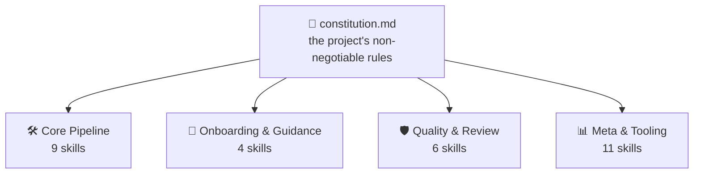
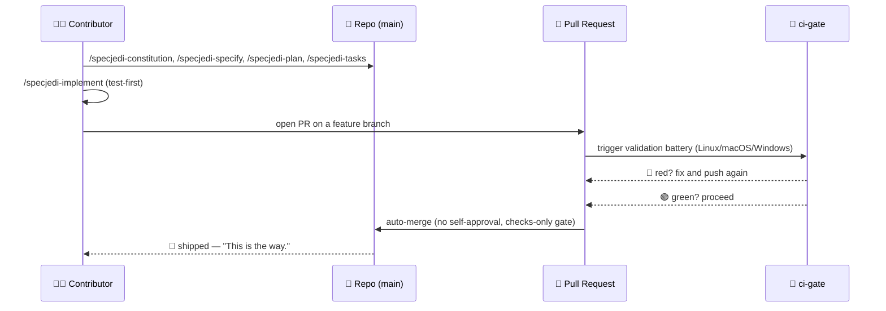

<!-- i18n-sync: source=README.md@2a01f98 lang=ru -->
> 🌐 Этот документ переведён с помощью ИИ. **Английский является
> каноническим источником**
> ([Principle I](../../../.specify/memory/constitution.md)); в случае
> расхождений английский текст имеет приоритет. Другие языки:
> [English](../../../README.md) · [中文](../zh/README.md) ·
> [हिन्दी](../hi/README.md) · [Español](../es/README.md) ·
> [Français](../fr/README.md) · [العربية](../ar/README.md) ·
> [বাংলা](../bn/README.md) · [Português](../pt/README.md) ·
> [Русский](../ru/README.md) · [اردو](../ur/README.md) ·
> [Bahasa Indonesia](../id/README.md)

# Spec Jedi

[](https://github.com/jonyfs/spec-jedi/actions/workflows/validate.yml)
[](../../../LICENSE)
[](../../../.specify/memory/constitution.md)
[](#как-spec-jedi-реализует-sdd)
[](#как-spec-jedi-реализует-sdd)
[](../../../references/skill-roadmap.md)
[](#установка)
[](../../../docs/i18n/)
[](../../../.specify/memory/constitution.md)
[](https://github.com/jonyfs/spec-jedi/commits/main)

> *"Сначала спецификация. Потом код. Таков путь."* — мудрый Мастер,
> вероятно.


**Письмо от одного Мастера к тому, кто возьмёт этот свиток следующим:**

У большинства проектов, переросших собственный план, одна и та же
коренная причина: сначала код, объяснение потом — и это "потом" по-
настоящему никогда не наступает. Дальше — практика, которая меняет этот
порядок местами, и конкретный проект, построенный, чтобы воплотить её.

*(Неофициальный, вдохновлённый фанатами брендинг — Spec Jedi не связан
с Lucasfilm/Disney, не одобрен и не спонсируется ими. Да пребудет Spec
с вами. 🌌)*

## Что такое разработка на основе спецификаций?

Стандартный способ создавать ПО с ИИ-агентом для кодирования выглядит
так: описать в чате, что вам нужно, агент пишет код, вы читаете код,
чтобы понять, сделал ли он то, что вы имели в виду, исправляете,
повторяете. Понимание агентом того, "что вы имели в виду", живёт только
в переписке — оно никогда не фиксируется как устойчивый, проверяемый
артефакт. Отсюда два режима отказа: неоднозначность разрешается
угадыванием вместо того, чтобы быть вынесенной на решение, и ничто не
переживает разговор — вы закрываете чат, теряете рассуждение.

Разработка на основе спецификаций (Spec-Driven Development, SDD)
переворачивает этот порядок. Прежде чем появится хоть одна строка кода,
записывается, что строится и почему, в виде четырёх структурированных,
проверяемых документов: **constitution** 📜, которую пишет
`specjedi-constitution` (неотъемлемые правила проекта),
**specification** 🎯, которую пишет `specjedi-specify` (что и для
кого), **plan** 🛠️, который пишет `specjedi-plan` (как именно,
технически), и **task list** ✅, который пишет `specjedi-tasks`
(упорядоченные шаги). Код генерируется *на основе* этих четырёх
артефактов, а не наоборот. Полное объяснение, без единой собственной
марки Spec Jedi:
[`references/what-is-sdd.md`](../../../references/what-is-sdd.md).



Всё, что следует дальше, сверяется с constitution, а не наоборот.
Измените правило, и каждый навык почувствует это при следующем запуске.

## Как Spec Jedi реализует SDD

Spec Jedi — настоящий **конкурент**
[spec-kit](https://github.com/github/spec-kit)
([Principle XV](../../../.specify/memory/constitution.md)), выстроенный
как набор навыков `specjedi-*`, который проект устанавливает рядом с
собственными командами `speckit-*` от spec-kit — или вместо них, — при
этом поддерживаются все двадцать целевых кодовых агентов (см.
[Установка](#установка) ниже). Полный пайплайн SDD `specjedi-*` — от
constitution до convergence — уже давно полностью поставлен: все 9
этапов, каждый построен на реальном конкурентном исследовании, прежде
чем была написана хоть одна строка
([research.md](../../../specs/001-specjedi-pipeline/research.md),
Principle II).

Каждая активность SDD выше соответствует реальному, уже поставленному
навыку `specjedi-*`, а не устремлению: `specjedi-constitution`
устанавливает правила, `specjedi-specify` превращает идею в `spec.md`,
`specjedi-clarify` разрешает отмеченную неоднозначность,
`specjedi-plan` и `specjedi-tasks` производят технический план и
разбивку на задачи, а `specjedi-implement` (или `specjedi-quick` для
небольших, хорошо понятных изменений) выполняет это сначала с тестами,
только через feature-ветку и pull request. Всего сегодня поставляется
тридцать навыков в четырёх дисциплинах — полный каталог, обе диаграммы
и пошаговое руководство из 23 шагов живут в
[`references/quickstart-guide.md`](../../../references/quickstart-guide.md);
полное сопоставление активностей навыкам, включая три подлинных вклада
сверх общей практики SDD, живёт в
[`references/specjedi-and-sdd.md`](../../../references/specjedi-and-sdd.md).

### `specjedi-*` против `speckit-*`, в цифрах

Сравнение, основанное на фактах, команда за командой —
[`specs/044-speckit-parity-audit/PARITY-LEDGER.md`](../../../specs/044-speckit-parity-audit/PARITY-LEDGER.md)
— проверило каждую из 11 пайплайн-команд `speckit-*` против её аналога
`specjedi-*` по фактическому описанному поведению, а не по схожести
названий:

- **8 из 11** находятся в полном паритете — та же задача, те же
  входы/выходы.
- **1 из 11** (`specjedi-implement` против `speckit-implement`) — это
  выгодное расхождение: `specjedi-implement` требует коммитить только
  через feature-ветку и pull request, никогда напрямую в ствол;
  собственные инструкции `speckit-implement` вообще не содержат
  дисциплины git-веток или коммитов.
- **2 из 11** не имеют аналога `specjedi-*` — обе уже разрешены, а не
  являются открытыми пробелами: преобразование задач в GitHub-issue
  (никогда не использовалось в реальной истории самого этого проекта)
  и постоянный указатель "текущего плана" (заменён дизайном
  `specjedi-status` без параллельного отслеживания и собственным
  повторным отображением статуса при старте сессии из Constitution
  Principle XXI).
- **21 из 30** поставленных навыков `specjedi-*` вообще не имеют
  аналога `speckit-*` — `specjedi-catalog-audit`, `specjedi-chain`,
  `specjedi-constitution-audit`, `specjedi-diagram`, `specjedi-docs`,
  `specjedi-explain`, `specjedi-find-skills`, `specjedi-govcheck`,
  `specjedi-master`, `specjedi-migrate`, `specjedi-new-skill`,
  `specjedi-onboard`, `specjedi-parallel`, `specjedi-quick`,
  `specjedi-release`, `specjedi-retro`, `specjedi-security`,
  `specjedi-skill-review`, `specjedi-status`, `specjedi-tokencheck` и
  `specjedi-worktree` — реально добавленная возможность, а не
  переформулированный пайплайн.

Интересно, что дальше?
[`references/skill-roadmap.md`](../../../references/skill-roadmap.md)
отслеживает то, что предлагается сверх основного пайплайна — это
бэклог *дополнительных* идей, а не пробелов самого пайплайна. Каждой из
них ещё нужно собственное реальное исследование, прежде чем она будет
построена; здесь ничто не поставляется на интуиции.

## Для кого это

Устали заново объяснять один и тот же контекст проекта на каждой
сессии. Устали видеть, как агент молча заново изобретает решение,
которое команда приняла и отменила три недели назад, потому что нигде
это не было записано так, чтобы агент мог это найти. Неважно, один ли
это человек или целая команда, пытающаяся заставить всех агентов вести
себя одинаково: любой, кто хочет, чтобы specs, plans и tasks были
настоящими, версионируемыми файлами, а не сообщениями в чате, которые
исчезают при закрытии окна, — тот читатель, к кому это обращено.

## Как Spec Jedi строит *сам себя*, в виде комикса

> ⚠️ **Этот раздел показывает собственный реальный процесс разработки
> этого проекта в действии** — команды `specjedi-*` ниже представляют
> ту же самую продуктовую поверхность, что описана выше, применённую к
> самому Spec Jedi. До фичи 048 (2026-07-18) этот проект bootstrap'ился
> с помощью собственных, поставляемых (vendored) команд `speckit-*` от
> spec-kit (тот же паттерн "загрузки компилятора старым компилятором",
> который может использовать любой конкурент, строя ему замену), пока
> собственный пайплайн `specjedi-*` не стал достаточно полным, чтобы
> взять управление на себя. Эта фаза bootstrap завершена — см.
> [Principle XV](../../../.specify/memory/constitution.md) для полной
> политики, которую завершила эта миграция.
>
> Также заметка о формате: панели ниже сочетают текстово-эмодзи диалог
> с оригинальными иллюстрациями — никогда не настоящие изображения Star
> Wars (персонажи, корабли, логотип), которые являются
> интеллектуальной собственностью Lucasfilm/Disney. Собственный
> [Principle XII](../../../.specify/memory/constitution.md) этого
> проекта обязуется использовать оригинальную визуальную идентичность и
> только текстовые отсылки к Star Wars, никогда не воспроизводя
> защищённое авторским правом искусство и не создавая арт, вызывающий
> узнаваемые визуальные образы саги. Итак: моменты истории реальны,
> искусство оригинально, а слова по-прежнему несут смысл сами по себе.
> 🖋️

---

Каждая история начинается одинаково: тёмная комната, терминал, курсор,
который не перестаёт мигать, пока вы не дадите ему задачу.


> 🧑‍💻 *"У меня есть идея для функции. ...И что теперь?"*

Именно тогда появляется наставник — без светового меча, только со
свитком, потому что первая битва здесь никогда не последняя.
`/specjedi-constitution` записывает правила один раз, чтобы никому не
пришлось заново учить их на горьком опыте три функции спустя.


> 🧙 *"Сперва — Кодекс."* 📜

Идея поднимается на стену следом, окружённая каждым вопросом, на
который она ещё не ответила — что на самом деле строится, и для кого.
`/specjedi-specify` превращает её в настоящий `spec.md`;
`/specjedi-clarify` отправляется выслеживать неоднозначность прежде,
чем она станет багом, который никто не захочет признавать своим.


> 🌀 *"Что вы на самом деле строите — и для кого?"*

Затем появляется чертёж. `/specjedi-plan` становится `plan.md`,
`/specjedi-tasks` разбивает его на упорядоченный, учитывающий
зависимости `tasks.md` — ничего не пропущено, ничего не нарушено по
порядку, план такого рода, который Падаван мог бы выполнить, не
переспрашивая дважды.


> 🛠️ *"Теперь — как."*

Инструменты начинают гудеть. Тесты падают красным, один за другим — а
потом, постепенно, перестают падать. `/specjedi-implement` выполняет
`tasks.md` сначала с тестами там, где это применимо
([Principle VI](../../../.specify/memory/constitution.md)), потому что
сборка, пропускающая этот шаг, — всего лишь догадка с лишними шагами.


> 🤖 *"Сначала тесты. Всегда сначала тесты."*

Теперь собирается совет — не чтобы благословить работу, а лишь чтобы
проверить её. Pull request предстаёт перед скамьёй, и `ci-gate` 🤖
запускает всю батарею валидации: каждую ОС, каждую проверку, без
сокращений. Никому не позволено одобрять собственную работу здесь — ни
машине, ни человеку
([Principle X](../../../.specify/memory/constitution.md)).


> 🏛️ *"Изложите ваши изменения."*

Свет становится зелёным, и врата открываются сами — ничья рука не на
рычаге, никто не нажимает кнопку. Батарея уже сказала то, что нужно
было сказать.


> ✅ *"Батарея высказалась."*

А затем всё исчезает — курсом в гиперпространство, поставлено.


> 🚀 *"Поставлено."*
> 🌌 *"Да пребудет Spec с вами."*

Ничто из этого — не сказка на ночь. Это буквальный, повторяющийся
процесс за недавними pull request'ами самого этого проекта —
[#82](https://github.com/jonyfs/spec-jedi/pull/82),
[#84](https://github.com/jonyfs/spec-jedi/pull/84),
[#87](https://github.com/jonyfs/spec-jedi/pull/87), назовём лишь
несколько — от начала до конца, по-настоящему, каждый раз.

### Та же история в виде диаграммы



## Предварительные требования

Ничего экзотического. Spec Jedi разрабатывается и тестируется на
**Linux, macOS и Windows** одинаково (Constitution
[Principle XIII](../../../.specify/memory/constitution.md)) — каждый
скрипт под `scripts/` поставляется как в виде POSIX shell (`.sh`), так
и нативного PowerShell (`.ps1`), и CI запускает полную батарею на всех
трёх операционных системах при каждом PR.

Что реально нужно:

- `git`
- Поддерживаемый кодовый агент (см.
  [Поддерживаемые окружения](#поддерживаемые-окружения) ниже)
- [GitHub CLI (`gh`)](https://cli.github.com/) — только если вы
  планируете отправлять pull request'ы обратно
- Оболочка для локального запуска вспомогательных скриптов, если
  хотите (самому кодовому агенту она не нужна): bash/zsh, уже
  присутствующие в Linux и macOS, или
  [PowerShell 7+](https://aka.ms/powershell) (`pwsh`), который работает
  везде

## Установка

Одна команда. Без `git clone`. `scripts/bootstrap-install.sh`/`.ps1`
(см. specs/024-bootstrap-installer, если хотите полную историю) берут
опубликованный GitHub Release и запускают его встроенный установщик
прямо в вашей целевой директории:

```bash
curl -fsSL https://raw.githubusercontent.com/jonyfs/spec-jedi/main/scripts/bootstrap-install.sh \
  | bash -s -- /path/to/your-project --harness cursor
```

```powershell
&([scriptblock]::Create((iwr -useb https://raw.githubusercontent.com/jonyfs/spec-jedi/main/scripts/bootstrap-install.ps1).Content)) -TargetDir C:\path\to\your-project -Harness cursor
```

`--harness` необязателен. Если он опущен, установщик пытается
определить, каким кодовым агентом вы пользуетесь — `claude-code`,
`codex-cli` или `trae` — проверяя наличие каталога проекта, бинарника в
`PATH`, или уже существующей глобальной папки конфигурации, и
спрашивает только если найдено несколько возможных кандидатов.
Остальные 17 окружений пока не имеют надёжного сигнала обнаружения,
поэтому для них вы сами передаёте `--harness` — полный список сразу
ниже, в [Поддерживаемые окружения](#поддерживаемые-окружения).
Запустите `./scripts/bootstrap-install.sh --help` (или
`.\scripts\bootstrap-install.ps1 -Help`), когда захотите полный список
опций, включая `--auto`.

Для `claude-code`, `codex-cli` и `trae` установщик также создаёт или
обновляет собственный файл памяти проекта этого окружения (`CLAUDE.md`,
`AGENTS.md` или `.trae/rules/project_rules.md`), добавляя короткий
раздел, ограниченный маркерами, с перечислением установленных навыков
— чтобы собственный контекст окружения уже знал об их существовании, а
не только сам каталог навыков. Если такой файл уже существует с вашим
собственным содержимым, ничего вашего не затрагивается: раздел
добавляется в конец, и при последующих переустановках обновляется
только этот раздел.

### Поддерживаемые окружения

Constitution ([Principle III](../../../.specify/memory/constitution.md))
обязывает этот проект охватить двадцать самых используемых кодовых
агентов, что существуют, — и начиная с этого релиза, все двадцать
реальны, протестированы и подтверждены CI, а не аспирационны. Четыре
читают навыки нативно с диска (Claude Code, Codex CLI, Trae,
Antigravity — последние три делят всего два физических целевых
каталога, `.agents/skills/` и `.trae/skills/`, а OpenCode и Warp
пользуются теми же путями бесплатно). Остальные четырнадцать вообще не
имеют концепции навыков — только файл правил в корне проекта, небольшой
каталог правил, или, в случае Sourcegraph Cody, JSON-файл
пользовательских команд — поэтому установщик строит **мост**: реальные
пакеты `specjedi-*` всё равно попадают в канонический `.claude/skills/`,
а небольшой адаптер (один файл, или по одному на навык для окружений с
директориями) указывает на него, используя конвенцию, которую это
окружение реально документирует.

См. [`specs/023-full-harness-coverage/research.md`](../../../specs/023-full-harness-coverage/research.md),
если хотите ссылку, подтверждающую точный механизм каждого окружения —
здесь ничто не угадывается.

| Окружение | Статус |
|---|---|
| Claude Code | ✅ Поддерживается — команда [Установка](#установка) выше, опустите `--harness` (автоматическое обнаружение) или явно передайте `--harness claude-code` |
| Cursor | ✅ Поддерживается — `./scripts/install.sh --harness cursor` (файлы-мосты в `.cursor/rules/`) |
| GitHub Copilot (Chat/Workspace) | ✅ Поддерживается — `./scripts/install.sh --harness copilot` (файл-мост в `.github/copilot-instructions.md`) |
| Codex CLI (OpenAI) | ✅ Поддерживается — `./scripts/install.sh --harness codex-cli` (устанавливает в `.agents/skills/`) |
| Gemini CLI | ✅ Поддерживается — `./scripts/install.sh --harness gemini-cli` (файл-мост в `GEMINI.md`; Google сворачивает Gemini CLI в пользу Antigravity — см. [`references/harness-capability-notes.md`](../../../references/harness-capability-notes.md)) |
| Antigravity (Google) | ✅ Поддерживается — `./scripts/install.sh --harness antigravity` (устанавливает в `.agents/skills/`, та же конвенция, что и у Codex CLI) |
| Windsurf (Codeium) | ✅ Поддерживается — `./scripts/install.sh --harness windsurf` (файлы-мосты в `.windsurf/rules/`) |
| Cline | ✅ Поддерживается — `./scripts/install.sh --harness cline` (файлы-мосты в `.clinerules/`) |
| Continue | ✅ Поддерживается — `./scripts/install.sh --harness continue` (файлы-мосты в `.continue/rules/`) |
| Aider | ✅ Поддерживается — `./scripts/install.sh --harness aider` (файл-мост в `CONVENTIONS.md`) |
| Amazon Q Developer | ✅ Поддерживается — `./scripts/install.sh --harness amazon-q` (файлы-мосты в `.amazonq/rules/`) |
| JetBrains AI Assistant | ✅ Поддерживается — `./scripts/install.sh --harness jetbrains-ai` (файлы-мосты в `.aiassistant/rules/`) |
| Zed | ✅ Поддерживается — `./scripts/install.sh --harness zed` (файл-мост в `.rules`) |
| OpenCode | ✅ Поддерживается — удовлетворяется установкой `claude-code` или `codex-cli` (OpenCode нативно сканирует как `.claude/skills/`, так и `.agents/skills/`), отдельный флаг не нужен |
| Warp (Agent Mode) | ✅ Поддерживается — удовлетворяется установкой `claude-code` или `codex-cli` (система Skills в Warp нативно сканирует как `.claude/skills/`, так и `.agents/skills/`), отдельный флаг не нужен |
| Replit Agent | ✅ Поддерживается — `./scripts/install.sh --harness replit` (файл-мост в `replit.md`) |
| Devin (Cognition) | ✅ Поддерживается — `./scripts/install.sh --harness devin` (файл-мост в `.devin.md`, структурированный как Devin Playbook) |
| Tabnine | ✅ Поддерживается — `./scripts/install.sh --harness tabnine` (файлы-мосты в `.tabnine/guidelines/`) |
| Sourcegraph Cody | ✅ Поддерживается — `./scripts/install.sh --harness cody` (пользовательские команды `.vscode/cody.json`, вызываемые явно как `/specjedi-<name>`; в отличие от всех остальных окружений выше, у Cody нет подтверждённого всегда активного файла правил, поэтому это ручной вызов, а не автоматический контекст — см. документ исследования) |
| Trae | ✅ Поддерживается — `./scripts/install.sh --harness trae` (устанавливает в `.trae/skills/`) |

Двадцать окружений, перечисленных индивидуально, все ✅ Поддерживаются
— это собственный стандарт Principle III. Никаких заявлений о
возможностях для механизма, который этот проект фактически не построил
и не протестировал; Principle XX не позволяет здесь угадывать.

Хотите больше? [`references/harness-capability-notes.md`](../../../references/harness-capability-notes.md)
содержит исходные заметки о возможностях по каждому окружению на
основе кабинетного исследования, а
[`specs/023-full-harness-coverage/research.md`](../../../specs/023-full-harness-coverage/research.md)
содержит реальные решения о механизме установки и ссылки, на которых
построена вся эта таблица.

## Честная оценка

Реальные преимущества, реальные текущие ограничения — не маркетинговая
страница. Двадцать из двадцати целевых окружений имеют реальный,
проверенный CI путь установки, диаграммы проверяются рендерингом
прежде, чем они показаны, поставлено четыре настоящих релиза
(`v0.1.0`, `v0.1.1`, `v0.2.0`, `v0.3.0`), а constitution — живой,
версионируемый документ версии v1.29.0 с задокументированной историей
поправок. Честно о второй половине: большинство путей установки для
мостовых (bridge-file) окружений опираются на кабинетное исследование,
а не на практическую сессию внутри реального стороннего продукта (см.
ниже), а собственная локализованная документация этого проекта чаще
отстаёт от своего английского источника, чем нет — `scripts/validate.sh`
в настоящий момент отмечает все 10 переведённых копий `README.md` и
`CONTRIBUTING.md` как рассинхронизированные с последними английскими
изменениями — реальный, повторяющийся пробел, который этот проект пока
структурно не закрыл. Полная, нефильтрованная картина:
[`references/honest-assessment.md`](../../../references/honest-assessment.md).

Двадцать окружений, перечисленных индивидуально, все подтверждены CI —
но 18 из 19 окружений, кроме Claude Code, были подтверждены кабинетным
исследованием (один цитируемый источник на окружение), а не
установкой в реальный продукт с наблюдением за загрузкой навыка; только
статус Sourcegraph Cody изменился после более глубокого
дополнительного исследования, которое не нашло подтверждённого всегда
активного файла правил. Ссылки по окружениям и полная история
исследования:
[`references/harness-capability-notes.md`](../../../references/harness-capability-notes.md).

Интересно, как Spec Jedi сравнивается со spec-kit и десятью другими
инструментами SDD, с которыми он был сопоставлен?
[`references/competitive-comparison.md`](../../../references/competitive-comparison.md)
содержит доказательства.

## Вклад в проект

См. [`CONTRIBUTING.md`](./CONTRIBUTING.md) для полного процесса —
требований конкурентного исследования для новых навыков, чек-листа
Стандарта авторства навыков и шагов валидации, которые нужно запустить
перед открытием PR.

Каждое изменение поставляется через pull request, проверенный
собственной батареей CI этого проекта, и автоматически сливается
только после того, как каждая проверка станет зелёной
([Principle IX и X](../../../.specify/memory/constitution.md)). Эта
батарея запускается на Linux, macOS и Windows при каждом PR (Principle
XIII) — добавьте или измените скрипт под `scripts/`, и версии `.sh` и
`.ps1` обе должны существовать и проходить на всех трёх, без
исключений. Шаблоны issue и PR (`.github/ISSUE_TEMPLATE/`,
`.github/PULL_REQUEST_TEMPLATE.md`) направляют вас подтвердить, что вы
действительно выполнили вышеуказанные шаги исследования и валидации
перед запросом ревью.

## Лицензия

[MIT](../../../LICENSE) — требуется собственной constitution этого
проекта (Distribution & Ecosystem Standards), а не просто значение по
умолчанию, о котором никто не подумал. Простым языком, MIT означает,
что вы можете:

- **Использовать** этот проект, коммерчески или нет, без ограничений.
- **Изменять** его как хотите.
- **Распространять** его повторно, включая как часть чего-то, что вы
  продаёте.

Единственные реальные условия — и их всего два: сохранить оригинальное
уведомление об авторских правах и текст лицензии где-то в вашей копии,
и не ожидать гарантии — программное обеспечение предоставляется "как
есть", без ответственности, если что-то сломается. Это действительно
вся сделка; [`LICENSE`](../../../LICENSE) содержит точный юридический
текст, если он вам нужен дословно.

---

🌌 *Да пребудет Spec с вами.*
