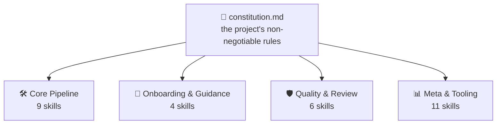
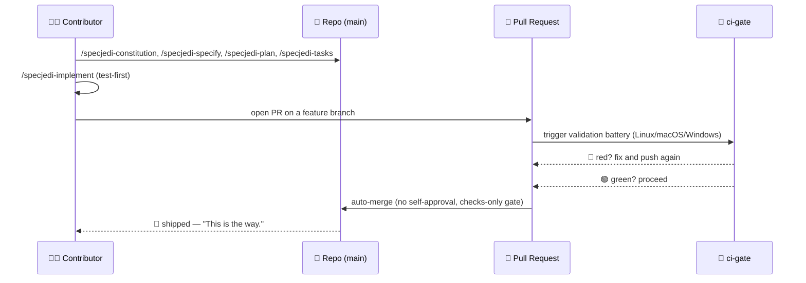

<!-- i18n-sync: source=README.md@2a01f98 lang=ur -->
> 🌐 یہ دستاویز AI کی مدد سے ترجمہ کی گئی ہے۔ **انگریزی مستند ماخذ ہے**
> ([Principle I](../../../.specify/memory/constitution.md))؛ کسی بھی
> فرق کی صورت میں انگریزی کو ترجیح حاصل ہوگی۔ دیگر زبانیں دیکھیں:
> [English](../../../README.md) · [中文](../zh/README.md) ·
> [हिन्दी](../hi/README.md) · [Español](../es/README.md) ·
> [Français](../fr/README.md) · [العربية](../ar/README.md) ·
> [বাংলা](../bn/README.md) · [Português](../pt/README.md) ·
> [Русский](../ru/README.md) · [اردو](../ur/README.md) ·
> [Bahasa Indonesia](../id/README.md)

# Spec Jedi

[](https://github.com/jonyfs/spec-jedi/actions/workflows/validate.yml)
[](../../../LICENSE)
[](../../../.specify/memory/constitution.md)
[](#spec-jedi-sdd-کیسے-نافذ-کرتا-ہے)
[](#spec-jedi-sdd-کیسے-نافذ-کرتا-ہے)
[](../../../references/skill-roadmap.md)
[](#تنصیب)
[](../../../docs/i18n/)
[](../../../.specify/memory/constitution.md)
[](https://github.com/jonyfs/spec-jedi/commits/main)

> *"پہلے اسپیسیفیکیشن۔ پھر کوڈ۔ یہی راستہ ہے۔"* — ایک دانا ماسٹر، غالباً۔


**ایک خط، ایک ماسٹر کی طرف سے، اُس ہر کسی کے لیے جو اس طومار کو آگے
اٹھائے گا:**

زیادہ تر پروجیکٹس جو اپنے ہی منصوبے سے آگے نکل جاتے ہیں، ان کی ایک ہی
بنیادی وجہ ہوتی ہے: پہلے کوڈ، بعد میں وضاحت — اور وہ "بعد میں" کبھی
حقیقتاً آتا ہی نہیں۔ آگے جو ہے وہ وہ عمل ہے جو اس ترتیب کو الٹ دیتا ہے،
اور وہ حقیقی پروجیکٹ جو اسے عملی جامہ پہنانے کے لیے بنایا گیا ہے۔

*(یہ غیر سرکاری، فین سے متاثر برانڈنگ ہے — Spec Jedi کا Lucasfilm/Disney
سے کوئی تعلق، توثیق یا سرپرستی نہیں ہے۔ Spec آپ کے ساتھ رہے۔ 🌌)*

## Spec-Driven Development کیا ہے؟

AI کوڈنگ ایجنٹ کے ساتھ سافٹ ویئر بنانے کا معمول کا طریقہ یہ ہے: چیٹ میں
بتائیں کہ آپ کیا چاہتے ہیں، ایجنٹ کوڈ لکھتا ہے، آپ کوڈ پڑھ کر معلوم
کرتے ہیں کہ آیا اس نے وہی کیا جو آپ کا مطلب تھا، آپ اصلاح کرتے ہیں،
پھر دہراتے ہیں۔ ایجنٹ کی "آپ کا مطلب کیا تھا" کی سمجھ صرف گفتگو میں
رہتی ہے — یہ کبھی ایک مستقل، جائزہ لینے کے قابل نمونے کے طور پر نہیں
لکھی جاتی۔ اس سے دو طرح کی ناکامیاں پیدا ہوتی ہیں: ابہام کو کسی فیصلے
کے لیے سامنے لانے کے بجائے اندازے سے حل کیا جاتا ہے، اور گفتگو ختم ہونے
کے بعد کچھ بھی باقی نہیں رہتا — چیٹ بند کریں، اپنی منطق کھو دیں۔

Spec-Driven Development (SDD) اس ترتیب کو الٹ دیتا ہے۔ کوڈ کی ایک لائن
موجود ہونے سے پہلے، یہ لکھ دیا جاتا ہے کہ کیا بنایا جا رہا ہے اور کیوں،
چار منظم، جائزہ لینے کے قابل دستاویزات کے طور پر: ایک **constitution**
📜 جسے `specjedi-constitution` لکھتی ہے (پروجیکٹ کے ناقابلِ مصالحت
اصول)، ایک **specification** 🎯 جسے `specjedi-specify` لکھتی ہے (کیا،
اور کس کے لیے)، ایک **plan** 🛠️ جسے `specjedi-plan` لکھتی ہے (تکنیکی
طور پر کیسے)، اور ایک **task list** ✅ جسے `specjedi-tasks` لکھتی ہے
(ترتیب وار مراحل)۔ کوڈ ان چار artifacts کی *بنیاد پر* بنایا جاتا ہے،
الٹا نہیں۔ مکمل وضاحت، Spec-Jedi کی اپنی کسی برانڈنگ کے بغیر:
[`references/what-is-sdd.md`](../../../references/what-is-sdd.md)۔



اس کے بعد آنے والی ہر چیز خود کو constitution کے مقابلے میں verify کرتی
ہے، الٹا کبھی نہیں۔ ایک اصول بدلیں، اور ہر skill اپنی اگلی run میں یہ
محسوس کرے گی۔

## Spec Jedi SDD کیسے نافذ کرتا ہے

Spec Jedi [spec-kit](https://github.com/github/spec-kit) کا ایک حقیقی
**حریف** ہے ([Principle XV](../../../.specify/memory/constitution.md))،
جسے ایک `specjedi-*` skill set کے طور پر بنایا گیا ہے جو کوئی پروجیکٹ
spec-kit کے اپنے `speckit-*` commands کے ساتھ ساتھ — یا اُن کی جگہ —
انسٹال کر سکتا ہے، جس میں تمام بیس target coding agents معاون ہیں
(نیچے [تنصیب](#تنصیب) دیکھیں)۔ مکمل `specjedi-*` SDD pipeline —
constitution سے convergence تک — کافی عرصہ پہلے مکمل طور پر ship ہو چکا
ہے: تمام 9 مراحل، ہر ایک اپنی پہلی لائن لکھنے سے پہلے حقیقی competitive
research پر بنایا گیا
([research.md](../../../specs/001-specjedi-pipeline/research.md),
Principle II)۔

اوپر ہر SDD سرگرمی ایک حقیقی، پہلے سے shipped `specjedi-*` skill سے
میل کھاتی ہے، کوئی خواہش نہیں: `specjedi-constitution` اصول قائم کرتی
ہے، `specjedi-specify` ایک idea کو `spec.md` میں تبدیل کرتی ہے،
`specjedi-clarify` نشان زد ابہام حل کرتی ہے، `specjedi-plan` اور
`specjedi-tasks` تکنیکی plan اور task breakdown تیار کرتی ہیں، اور
`specjedi-implement` (یا چھوٹی، اچھی طرح سمجھی گئی تبدیلیوں کے لیے
`specjedi-quick`) اسے test-first طریقے سے انجام دیتی ہے، صرف ایک feature
branch اور pull request کے ذریعے۔ آج کل ملا کر تیس skills دستیاب ہیں،
چار شعبوں میں — مکمل catalog، دونوں diagrams، اور 23-قدمی walkthrough
[`references/quickstart-guide.md`](../../../references/quickstart-guide.md)
میں موجود ہیں؛ عام SDD طریقہ کار سے آگے تین حقیقی contributions سمیت
مکمل سرگرمی-سے-skill mapping
[`references/specjedi-and-sdd.md`](../../../references/specjedi-and-sdd.md)
میں موجود ہے۔

### `specjedi-*` بمقابلہ `speckit-*`، نمبروں کے حساب سے

ایک شواہد پر مبنی، command-by-command موازنہ —
[`specs/044-speckit-parity-audit/PARITY-LEDGER.md`](../../../specs/044-speckit-parity-audit/PARITY-LEDGER.md)
— نے `speckit-*` کے تمام 11 pipeline commands کو اُن کے `specjedi-*` ہم
منصب کے خلاف اصل بیان کردہ رویے کی بنیاد پر جانچا، نام کی مماثلت کی
بنیاد پر نہیں:

- **11 میں سے 8** مکمل parity پر ہیں — وہی کام، وہی inputs/outputs۔
- **11 میں سے 1** (`specjedi-implement` بمقابلہ `speckit-implement`) ایک
  سازگار فرق ہے: `specjedi-implement` صرف ایک feature branch اور pull
  request کے ذریعے commit کرنے کا تقاضا کرتی ہے، کبھی سیدھا trunk
  branch پر نہیں؛ `speckit-implement` کی اپنی instructions میں کوئی git
  branch یا commit discipline سرے سے موجود نہیں ہے۔
- **11 میں سے 2** کا کوئی `specjedi-*` ہم منصب نہیں ہے — دونوں پہلے ہی
  حل شدہ ہیں، کوئی کھلا خلا نہیں: GitHub-issue task conversion (اس
  پروجیکٹ کی اپنی حقیقی تاریخ میں کبھی استعمال نہیں ہوئی) اور ایک
  مستقل "current plan" pointer (جسے `specjedi-status` کے
  zero-parallel-tracking ڈیزائن اور Constitution Principle XXI کے اپنے
  session-start status re-surfacing نے بے کار کر دیا)۔
- **30 میں سے 21** shipped `specjedi-*` skills کا کوئی `speckit-*` ہم
  منصب سرے سے موجود نہیں — `specjedi-catalog-audit`, `specjedi-chain`,
  `specjedi-constitution-audit`, `specjedi-diagram`, `specjedi-docs`,
  `specjedi-explain`, `specjedi-find-skills`, `specjedi-govcheck`,
  `specjedi-master`, `specjedi-migrate`, `specjedi-new-skill`,
  `specjedi-onboard`, `specjedi-parallel`, `specjedi-quick`,
  `specjedi-release`, `specjedi-retro`, `specjedi-security`,
  `specjedi-skill-review`, `specjedi-status`, `specjedi-tokencheck`, اور
  `specjedi-worktree` — حقیقی اضافی صلاحیت، کوئی دہرایا ہوا pipeline
  نہیں۔

آگے کیا ہے اس میں دلچسپی ہے؟
[`references/skill-roadmap.md`](../../../references/skill-roadmap.md)
بنیادی pipeline سے آگے کیا تجویز کیا گیا ہے اسے ٹریک کرتا ہے — یہ
*اضافی* ideas کا backlog ہے، خود pipeline کی کمی نہیں۔ ہر ایک کو بننے
سے پہلے اب بھی اپنی حقیقی research چاہیے؛ یہاں کچھ بھی محض اندازے پر
ship نہیں ہوتا۔

## یہ کس کے لیے ہے

ہر session میں ایک ہی پروجیکٹ context دوبارہ سمجھانے سے تھک چکے ہیں۔
کسی ایجنٹ کو خاموشی سے وہ فیصلہ دوبارہ ایجاد کرتے دیکھ کر تھک چکے ہیں
جو ایک ٹیم نے تین ہفتے پہلے لیا اور چھوڑ دیا تھا، کیونکہ یہ کہیں ایسی
جگہ نہیں لکھا گیا تھا جہاں ایجنٹ اسے تلاش کر سکے۔ چاہے یہ ایک شخص ہو یا
پوری ٹیم جو تمام ایجنٹس کو ایک جیسا برتاؤ کرانے کی کوشش کر رہی ہو، کوئی
فرق نہیں پڑتا: جو بھی چاہتا ہے کہ specs، plans، اور tasks حقیقی، ورژن
شدہ فائلیں ہوں، چیٹ پیغامات کے بجائے جو ونڈو بند ہوتے ہی غائب ہو جاتے
ہیں — وہی یہاں کا مطلوب قاری ہے۔

## Spec Jedi کامک شکل میں کیسے *خود کو* بناتا ہے

> ⚠️ **یہ سیکشن اس پروجیکٹ کے اپنے حقیقی development pipeline کو عمل میں
> دکھاتا ہے** — نیچے دیے گئے `specjedi-*` commands بالکل وہی product
> سطح ہیں جو اوپر بیان کی گئی ہے، جو خود Spec Jedi پر استعمال ہوتی ہے۔
> feature 048 (2026-07-18) تک، یہ پروجیکٹ خود کو بنانے کے لیے spec-kit
> کے اپنے vendored `speckit-*` commands استعمال کرتا رہا (وہی "پرانے
> compiler سے نیا compiler بناؤ" پیٹرن جو کوئی بھی حریف اپنا متبادل
> بناتے وقت استعمال کر سکتا ہے) اس سے پہلے کہ اس کی اپنی `specjedi-*`
> pipeline اتنی مکمل ہو جائے کہ ذمہ داری سنبھال لے۔ وہ bootstrap مرحلہ
> اب ختم ہو چکا ہے — اس migration کو مکمل کرنے والی مکمل policy کے لیے
> دیکھیں [Principle XV](../../../.specify/memory/constitution.md)۔
>
> نیز، format کے بارے میں ایک نوٹ: نیچے دیے گئے panels متن اور ایموجی
> مکالمے کو اصل illustrations کے ساتھ ملاتے ہیں — کبھی اصل Star Wars
> تصاویر نہیں (کردار، جہاز، لوگو)، جو Lucasfilm/Disney کی دانشورانہ
> ملکیت ہیں۔ اس پروجیکٹ کا اپنا
> [Principle XII](../../../.specify/memory/constitution.md) ایک اصل
> بصری شناخت اور صرف متنی Star Wars حوالوں کا عہد کرتا ہے، کبھی کاپی
> رائٹ شدہ آرٹ دوبارہ پیش نہیں کرتا اور نہ ہی ایسا آرٹ بناتا ہے جو ساگا
> کے اپنے پہچانے جانے والے بصری نشانات یاد دلائے۔ تو: کہانی کے لمحات
> حقیقی ہیں، آرٹ اصل ہے، اور الفاظ اکیلے ہی معنی برقرار رکھتے ہیں۔ 🖋️

---

ہر کہانی ایک ہی طرح شروع ہوتی ہے: ایک تاریک کمرہ، ایک ٹرمینل، ایک
cursor جو تب تک جھپکنا نہیں چھوڑتا جب تک آپ اسے کچھ کرنے کو نہ دیں۔


> 🧑‍💻 *"میرے پاس ایک feature idea ہے۔ ...اب کیا؟"*

تبھی رہنما سامنے آتا ہے — کوئی لائٹ سیبر نہیں، صرف ایک طومار، کیونکہ
یہاں کی پہلی لڑائی کبھی آخری نہیں ہوتی۔ `/specjedi-constitution` اصول
ایک بار لکھتی ہے، تاکہ تین features بعد کسی کو انہیں مشکل طریقے سے
دوبارہ سیکھنا نہ پڑے۔


> 🧙 *"سب سے پہلے، ضابطہ۔"* 📜

پھر idea دیوار پر چڑھتا ہے، ہر اس سوال سے گھرا ہوا جس کا اس نے ابھی تک
جواب نہیں دیا — اصل میں کیا بنایا جا رہا ہے، اور کس کے لیے۔
`/specjedi-specify` اسے ایک حقیقی `spec.md` میں تبدیل کرتی ہے؛
`/specjedi-clarify` ابہام کو پکڑنے نکلتی ہے اس سے پہلے کہ وہ ایک ایسے
bug میں بدل جائے جسے بعد میں کوئی اپنانا نہیں چاہتا۔


> 🌀 *"تم اصل میں کیا بنا رہے ہو — اور کس کے لیے؟"*

پھر بلیو پرنٹ سامنے آتا ہے۔ `/specjedi-plan` `plan.md` بن جاتا ہے،
`/specjedi-tasks` اسے ایک ترتیب وار، dependency-aware `tasks.md` میں
تقسیم کرتی ہے — کوئی قدم نہیں چھوٹا، کوئی قدم ترتیب سے باہر نہیں، ایسا
منصوبہ جسے ایک Padawan دو بار پوچھے بغیر پیروی کر سکے۔


> 🛠️ *"اب 'کیسے' کی باری۔"*

اوزار گونجنا شروع کرتے ہیں۔ ٹیسٹس ایک کے بعد ایک سرخ ہو کر ناکام ہوتے
ہیں — اور پھر، آہستہ آہستہ، ناکام ہونا بند کر دیتے ہیں۔
`/specjedi-implement` جہاں لاگو ہو وہاں test-first طریقے سے `tasks.md`
انجام دیتی ہے
([Principle VI](../../../.specify/memory/constitution.md))، کیونکہ یہ
قدم چھوڑنے والا build صرف اضافی مراحل والا ایک اندازہ ہے۔


> 🤖 *"پہلے tests۔ ہمیشہ پہلے tests۔"*

اب کونسل جمع ہوتی ہے — کام کو برکت دینے کے لیے نہیں، صرف اسے جانچنے
کے لیے۔ ایک pull request بینچ کے سامنے کھڑا ہے، اور `ci-gate` 🤖 مکمل
validation battery چلاتا ہے: ہر operating system، ہر check، بغیر کسی
شارٹ کٹ کے۔ یہاں کسی کو اپنے کام کی خود منظوری دینے کی اجازت نہیں — نہ
مشین کو، نہ انسان کو
([Principle X](../../../.specify/memory/constitution.md))۔


> 🏛️ *"اپنی تبدیلیاں بیان کرو۔"*

روشنی سبز ہو جاتی ہے، اور gate خود بخود کھل جاتا ہے — کوئی ہاتھ لیور پر
نہیں، کوئی بٹن نہیں دبا رہا۔ battery پہلے ہی وہ کہہ چکی جو کہنا تھا۔


> ✅ *"battery بول چکی ہے۔"*

اور پھر یہ چلا جاتا ہے — ہائپر اسپیس کی طرف، ship ہو کر۔


> 🚀 *"Shipped۔"*
> 🌌 *"Spec آپ کے ساتھ رہے۔"*

اس میں سے کچھ بھی فرضی نہیں ہے — یہ اس پروجیکٹ کے اپنے حالیہ pull
requests کے پیچھے کی لفظی، بار بار دہرائی گئی process ہے —
[#82](https://github.com/jonyfs/spec-jedi/pull/82),
[#84](https://github.com/jonyfs/spec-jedi/pull/84),
[#87](https://github.com/jonyfs/spec-jedi/pull/87), چند نام لینے کے
لیے — شروع سے آخر تک، حقیقتاً، ہر بار۔

### وہی کہانی، ایک diagram کی شکل میں



## ضروری تقاضے

یہاں کچھ بھی عجیب و غریب نہیں ہے۔ Spec Jedi یکساں طور پر **Linux, macOS,
اور Windows** پر بنایا اور test کیا جاتا ہے (Constitution
[Principle XIII](../../../.specify/memory/constitution.md)) — `scripts/`
کے تحت ہر script دونوں شکلوں میں فراہم کی جاتی ہے: POSIX shell (`.sh`)
اور native PowerShell (`.ps1`)، اور CI ہر PR پر تینوں operating systems
پر مکمل battery چلاتا ہے۔

اصل میں جو چاہیے:

- `git`
- ایک supported coding agent (نیچے
  [معاون harnesses](#معاون-harnesses) دیکھیں)
- [GitHub CLI (`gh`)](https://cli.github.com/) — صرف اگر آپ pull
  request واپس بھیجنے کا ارادہ رکھتے ہیں
- locally helper scripts چلانے کے لیے ایک shell، اگر آپ چاہیں (coding
  agent کو خود اس کی ضرورت نہیں): bash/zsh، جو Linux اور macOS پر
  by default موجود ہے، یا [PowerShell 7+](https://aka.ms/powershell)
  (`pwsh`)، جو ہر جگہ چلتا ہے

## تنصیب

ایک ہی کمانڈ۔ کوئی `git clone` نہیں۔
`scripts/bootstrap-install.sh`/`.ps1` (مکمل کہانی کے لیے
specs/024-bootstrap-installer دیکھیں) ایک published GitHub Release
لاتے ہیں اور اس کا شامل کردہ installer براہ راست آپ کی target directory
میں چلاتے ہیں:

```bash
curl -fsSL https://raw.githubusercontent.com/jonyfs/spec-jedi/main/scripts/bootstrap-install.sh \
  | bash -s -- /path/to/your-project --harness cursor
```

```powershell
&([scriptblock]::Create((iwr -useb https://raw.githubusercontent.com/jonyfs/spec-jedi/main/scripts/bootstrap-install.ps1).Content)) -TargetDir C:\path\to\your-project -Harness cursor
```

`--harness` اختیاری ہے۔ اگر چھوڑ دیا جائے، تو installer یہ معلوم کرنے
کی کوشش کرتا ہے کہ آپ کون سا coding agent استعمال کر رہے ہیں —
`claude-code`، `codex-cli`، یا `trae` — پہلے سے موجود project directory،
`PATH` پر موجود binary، یا پہلے سے موجود global config folder چیک کرکے،
اور صرف اسی وقت پوچھتا ہے جب اسے ایک سے زیادہ ممکنہ candidate ملیں۔ باقی
17 harnesses کے پاس ابھی تک ایک قابل اعتماد detection signal نہیں ہے،
اس لیے ان کے لیے آپ خود `--harness` پاس کرتے ہیں — مکمل فہرست بالکل
نیچے [معاون harnesses](#معاون-harnesses) میں ہے۔ جب بھی آپ `--auto`
سمیت مکمل option فہرست چاہیں تو `./scripts/bootstrap-install.sh --help`
(یا `.\scripts\bootstrap-install.ps1 -Help`) چلائیں۔

`claude-code`، `codex-cli`، اور `trae` کے لیے، installer اس harness کی
اپنی project-memory فائل (`CLAUDE.md`، `AGENTS.md`، یا
`.trae/rules/project_rules.md`) بھی بناتا یا اپ ڈیٹ کرتا ہے، جس میں
انسٹال کی گئی skills کے نام والا ایک مختصر، marker سے حد بند کیا گیا
section شامل ہوتا ہے — تاکہ harness کا اپنا context پہلے ہی جان لے کہ
وہ موجود ہیں، صرف skills directory ہی نہیں۔ اگر وہ فائل پہلے سے آپ کے
اپنے مواد کے ساتھ موجود ہے، تو آپ کی کسی چیز کو ہاتھ نہیں لگایا جاتا؛
صرف section کو append کیا جاتا ہے اور بعد کے re-installs پر صرف وہی
section refresh ہوتا ہے۔

### معاون harnesses

Constitution ([Principle III](../../../.specify/memory/constitution.md))
اس project کو موجود بیس سب سے زیادہ استعمال ہونے والے coding agents کو
cover کرنے کا پابند بناتا ہے — اور اس release کے مطابق، تمام بیس حقیقی،
test شدہ، اور CI-proven ہیں، خیالی نہیں۔ چار ڈسک سے براہ راست skills
پڑھتی ہیں (Claude Code, Codex CLI, Trae, Antigravity — آخری تین صرف دو
physical target directories شیئر کرتی ہیں، `.agents/skills/` اور
`.trae/skills/`، اور OpenCode و Warp بغیر کسی اضافی کوڈ کے انہی راستوں
سے مطمئن ہو جاتی ہیں)۔ باقی چودہ کے پاس skills کا کوئی native تصور ہی
نہیں ہے — صرف project کی جڑ میں ایک rules فائل، ایک چھوٹی rules
directory، یا، Sourcegraph Cody کی صورت میں، ایک custom-commands JSON
فائل — اس لیے installer ایک **bridge** بناتا ہے: حقیقی `specjedi-*`
پیکجز ہمیشہ canonical `.claude/skills/` میں اترتے ہیں، اور ایک چھوٹا
adapter (ایک فائل، یا directory-style harnesses کے لیے فی skill ایک
فائل) اس طرف اشارہ کرتا ہے، اس harness کے اپنے دستاویزی convention کا
استعمال کرتے ہوئے۔

دیکھیں [`specs/023-full-harness-coverage/research.md`](../../../specs/023-full-harness-coverage/research.md)
اگر آپ ہر harness کے صحیح mechanism کے پیچھے حوالہ چاہتے ہیں — یہاں
کچھ بھی اندازے سے نہیں لیا گیا۔

| Harness | حیثیت |
|---|---|
| Claude Code | ✅ معاون — اوپر دیا گیا [تنصیب](#تنصیب) کمانڈ، `--harness` چھوڑ دیں (خودکار شناخت) یا واضح طور پر `--harness claude-code` پاس کریں |
| Cursor | ✅ معاون — `./scripts/install.sh --harness cursor` (`.cursor/rules/` کے تحت bridge فائلیں) |
| GitHub Copilot (Chat/Workspace) | ✅ معاون — `./scripts/install.sh --harness copilot` (`.github/copilot-instructions.md` پر bridge فائل) |
| Codex CLI (OpenAI) | ✅ معاون — `./scripts/install.sh --harness codex-cli` (`.agents/skills/` میں install ہوتا ہے) |
| Gemini CLI | ✅ معاون — `./scripts/install.sh --harness gemini-cli` (`GEMINI.md` پر bridge فائل؛ Google بتدریج Gemini CLI بند کر کے Antigravity کی طرف جا رہا ہے — دیکھیں [`references/harness-capability-notes.md`](../../../references/harness-capability-notes.md)) |
| Antigravity (Google) | ✅ معاون — `./scripts/install.sh --harness antigravity` (`.agents/skills/` میں install ہوتا ہے، Codex CLI جیسا ہی convention) |
| Windsurf (Codeium) | ✅ معاون — `./scripts/install.sh --harness windsurf` (`.windsurf/rules/` کے تحت bridge فائلیں) |
| Cline | ✅ معاون — `./scripts/install.sh --harness cline` (`.clinerules/` کے تحت bridge فائلیں) |
| Continue | ✅ معاون — `./scripts/install.sh --harness continue` (`.continue/rules/` کے تحت bridge فائلیں) |
| Aider | ✅ معاون — `./scripts/install.sh --harness aider` (`CONVENTIONS.md` پر bridge فائل) |
| Amazon Q Developer | ✅ معاون — `./scripts/install.sh --harness amazon-q` (`.amazonq/rules/` کے تحت bridge فائلیں) |
| JetBrains AI Assistant | ✅ معاون — `./scripts/install.sh --harness jetbrains-ai` (`.aiassistant/rules/` کے تحت bridge فائلیں) |
| Zed | ✅ معاون — `./scripts/install.sh --harness zed` (`.rules` پر bridge فائل) |
| OpenCode | ✅ معاون — `claude-code` یا `codex-cli` install میں سے کوئی بھی کافی ہے (OpenCode قدرتی طور پر `.claude/skills/` اور `.agents/skills/` دونوں کو scan کرتا ہے)، الگ flag کی ضرورت نہیں |
| Warp (Agent Mode) | ✅ معاون — `claude-code` یا `codex-cli` install میں سے کوئی بھی کافی ہے (Warp کا Skills نظام قدرتی طور پر `.claude/skills/` اور `.agents/skills/` دونوں کو scan کرتا ہے)، الگ flag کی ضرورت نہیں |
| Replit Agent | ✅ معاون — `./scripts/install.sh --harness replit` (`replit.md` پر bridge فائل) |
| Devin (Cognition) | ✅ معاون — `./scripts/install.sh --harness devin` (`.devin.md` پر bridge فائل، Devin Playbook کے طور پر structured) |
| Tabnine | ✅ معاون — `./scripts/install.sh --harness tabnine` (`.tabnine/guidelines/` کے تحت bridge فائلیں) |
| Sourcegraph Cody | ✅ معاون — `./scripts/install.sh --harness cody` (`.vscode/cody.json` custom commands، واضح طور پر `/specjedi-<name>` کے طور پر invoke کیے جاتے ہیں؛ اوپر دیے گئے باقی ہر harness کے برعکس، Cody کے پاس کوئی تصدیق شدہ always-on rules فائل نہیں ہے، اس لیے یہ manual invocation ہے، خودکار context نہیں — research document دیکھیں) |
| Trae | ✅ معاون — `./scripts/install.sh --harness trae` (`.trae/skills/` میں install کرتا ہے) |

بیس harnesses انفرادی طور پر نامزد کیے گئے ہیں، سب ✅ معاون — یہ خود
Principle III کا معیار ہے۔ کسی بھی ایسے mechanism کے لیے کوئی capability
دعویٰ نہیں جسے اس project نے واقعی build اور test نہیں کیا؛ Principle
XX یہاں اندازہ لگانے کی اجازت نہیں دیتا۔

مزید چاہیے؟ [`references/harness-capability-notes.md`](../../../references/harness-capability-notes.md)
میں ہر harness کے اصل desk-research capability notes موجود ہیں، اور
[`specs/023-full-harness-coverage/research.md`](../../../specs/023-full-harness-coverage/research.md)
میں وہ حقیقی install-mechanism فیصلے اور حوالے موجود ہیں جن پر یہ پوری
table بنائی گئی ہے۔

## دیانتدار جائزہ

حقیقی فوائد، حقیقی موجودہ حدود — کوئی marketing page نہیں۔ بیس میں سے
بیس target harnesses کے پاس ایک حقیقی، CI-tested install path ہے،
diagrams دکھانے سے پہلے rendering سے verify کیے جاتے ہیں، چار حقیقی
releases ship ہو چکے ہیں (`v0.1.0`، `v0.1.1`، `v0.2.0`، `v0.3.0`)، اور
constitution ایک زندہ، ورژن شدہ نمونہ ہے v1.29.0 پر، ایک دستاویزی ترمیمی
تاریخ کے ساتھ۔ دوسرا آدھا، صاف طور پر کہا جائے: زیادہ تر bridge-file
harness install راستے حقیقی third-party product کے اندر ہاتھ سے کیے
گئے تجربے کے بجائے desk research پر قائم ہیں (نیچے دیکھیں)، اور اس
پروجیکٹ کی اپنی localized documentation اکثر اپنے انگریزی ماخذ سے پیچھے
رہ جاتی ہے — `scripts/validate.sh` فی الحال تمام 10 ترجمہ شدہ
`README.md` اور `CONTRIBUTING.md` کاپیوں کو تازہ ترین انگریزی تبدیلیوں
سے out of sync کے طور پر نشان زد کرتا ہے، ایک حقیقی، بار بار پیش آنے
والا خلا جسے اس پروجیکٹ نے ابھی تک ساختیاتی طور پر بند نہیں کیا۔ مکمل،
بغیر filter کے تصویر:
[`references/honest-assessment.md`](../../../references/honest-assessment.md)۔

بیس harnesses انفرادی طور پر نامزد، سب CI سے ثابت شدہ — لیکن Claude
Code کے علاوہ 19 میں سے 18 harnesses کو desk research سے تصدیق ملی
(فی harness ایک حوالہ شدہ ماخذ)، حقیقی product میں انسٹال کر کے اور
کسی skill کو load ہوتے دیکھ کر نہیں؛ صرف Sourcegraph Cody کی حیثیت مزید
گہری follow-up research کے بعد بدلی، جس نے کوئی تصدیق شدہ always-on
rules فائل نہیں پائی۔ ہر harness کے حوالے اور مکمل research تاریخ:
[`references/harness-capability-notes.md`](../../../references/harness-capability-notes.md)۔

جاننا چاہتے ہیں کہ Spec Jedi، spec-kit اور ان دس دیگر SDD tools کے
مقابلے میں کیسا ہے جن کے خلاف اسے benchmark کیا گیا؟
[`references/competitive-comparison.md`](../../../references/competitive-comparison.md)
کے پاس ثبوت ہیں۔

## Contributing

نئی skills کے لیے competitive research requirements، Skill Authoring
Standard checklist، اور PR کھولنے سے پہلے چلانے والے validation قدموں
سمیت مکمل عمل کے لیے [`CONTRIBUTING.md`](./CONTRIBUTING.md) دیکھیں۔

ہر تبدیلی اس project کی اپنی CI battery کے ذریعے verify کیے گئے pull
request کے ذریعے ship ہوتی ہے، اور تبھی auto-merge ہوتی ہے جب ہر check
green ہو جائے
(دیکھیں [Principle IX اور X](../../../.specify/memory/constitution.md))۔
وہ battery ہر PR پر Linux، macOS، اور Windows پر چلتی ہے (Principle
XIII) — اگر آپ `scripts/` کے تحت کوئی script شامل یا تبدیل کرتے ہیں،
تو `.sh` اور `.ps1` دونوں versions موجود ہونے چاہئیں اور تینوں پر pass
ہونے چاہئیں، بغیر کسی استثنا کے۔ Issue اور PR templates
(`.github/ISSUE_TEMPLATE/`, `.github/PULL_REQUEST_TEMPLATE.md`) آپ کو
review کی درخواست سے پہلے اوپر بتائے گئے research اور validation قدم
مکمل کرنے کی تصدیق کرنے میں رہنمائی دیتے ہیں۔

## License

[MIT](../../../LICENSE) — اس project کے اپنے constitution کے ذریعے
ضروری (Distribution & Ecosystem Standards)، صرف ایک ایسا default نہیں
جس کے بارے میں کسی نے سوچا ہی نہ ہو۔ سادہ زبان میں، MIT کا مطلب ہے کہ
آپ:

- اس project کا **استعمال** کر سکتے ہیں، تجارتی طور پر یا دیگر، بغیر
  کسی پابندی کے۔
- اسے جیسے چاہیں **تبدیل** کر سکتے ہیں۔
- اسے **دوبارہ تقسیم** کر سکتے ہیں، یہاں تک کہ کسی ایسی چیز کے حصے کے
  طور پر جسے آپ بیچتے ہیں۔

اصل شرائط، اور صرف دو ہیں: اپنی کاپی میں کہیں original copyright notice
اور license text رکھیں، اور کسی warranty کی توقع نہ کریں — software
"as is" فراہم کیا جاتا ہے، کچھ ٹوٹنے پر کوئی liability نہیں۔ یہی حقیقتاً
پورا معاہدہ ہے؛ اگر آپ لفظ بہ لفظ چاہیں تو exact legal text کے لیے
[`LICENSE`](../../../LICENSE) دیکھیں۔

---

🌌 *یہی راستہ ہے۔*
