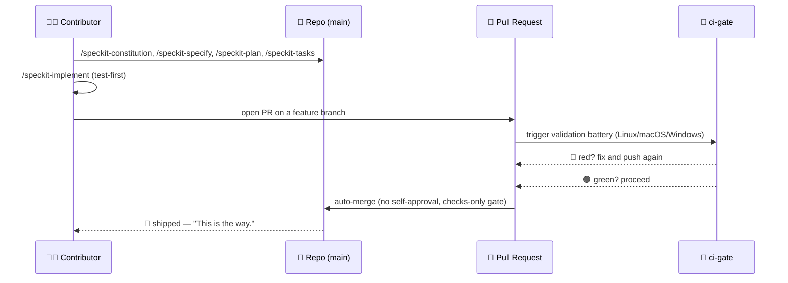
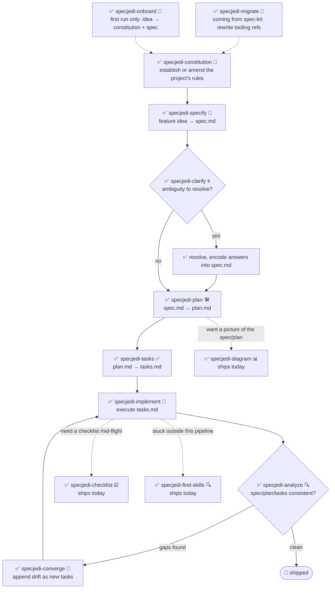

<!-- i18n-sync: source=README.md@4a3486c lang=ur -->
> 🌐 یہ دستاویز AI کی مدد سے ترجمہ کی گئی ہے۔ **انگریزی مستند ماخذ ہے**
> ([Principle I](../../../.specify/memory/constitution.md))؛ کسی بھی
> فرق کی صورت میں انگریزی کو ترجیح حاصل ہوگی۔ دیگر زبانیں دیکھیں:
> [English](../../../README.md) · [中文](../zh/README.md) ·
> [हिन्दी](../hi/README.md) · [Español](../es/README.md) ·
> [Français](../fr/README.md) · [العربية](../ar/README.md) ·
> [বাংলা](../bn/README.md) · [Português](../pt/README.md) ·
> [Русский](../ru/README.md) · [اردو](../ur/README.md) ·
> [Bahasa Indonesia](../id/README.md)

# 🗡️ Spec Jedi

[](https://github.com/jonyfs/spec-jedi/actions/workflows/validate.yml)
[](../../../LICENSE)
[](../../../.specify/memory/constitution.md)
[](#آج-آپ-کو-کیا-ملتا-ہے)
[](#آج-آپ-کو-کیا-ملتا-ہے)
[](../../../references/skill-roadmap.md)
[](#تنصیب)
[](../../../docs/i18n/)
[](../../../.specify/memory/constitution.md)
[](https://github.com/jonyfs/spec-jedi/commits/main)

> *"پہلے اسپیسیفیکیشن۔ پھر کوڈ۔ یہی راستہ ہے۔"* — ایک دانا ماسٹر، غالباً۔

Spec Jedi ایک Spec-Driven Development (SDD) اسکلز کا مجموعہ ہے جسے آپ
اپنے پسندیدہ کوڈنگ ایجنٹ میں انسٹال کرتے ہیں۔ پہلے کوڈ لکھنے اور بعد
میں دستاویز بنانے کے بجائے، آپ ایک **constitution** 📜 (آپ کے پروجیکٹ
کے ناقابلِ مصالحت اصول)، ایک **specification** 🎯 (آپ کیا بنا رہے ہیں
اور کیوں)، ایک **plan** 🛠️ (تکنیکی طور پر کیسے)، اور ایک **task list**
✅ (ترتیب وار مراحل) لکھتے ہیں — اور آپ کا ایجنٹ ان artifacts کی بنیاد
پر عمل درآمد کرتا ہے، بجائے اس کے کہ تربیت چھوڑنے والے Padawan کی طرح
اصلاحاً کام کرے۔

یہ ریپوزٹری خود بھی اسی نظم و ضبط کے ساتھ بنائی گئی ہے جو یہ فراہم کرتی
ہے: اس کا اپنا [constitution](../../../.specify/memory/constitution.md)
اس بات کا مستند ماخذ ہے کہ پروجیکٹ کیسے برتاؤ کرتا ہے — بشمول یہ کہ
releases کا ورژن کیسے طے ہوتا ہے اور pull requests کیسے تصدیق اور ضم
کیے جاتے ہیں۔ یہاں vibe-coding کی تاریک جانب کوئی شارٹ کٹ نہیں ہے۔ 🚫🖤

*(یہ غیر سرکاری، فین سے متاثر برانڈنگ ہے — Spec Jedi کا Lucasfilm/Disney
سے کوئی تعلق، توثیق یا سرپرستی نہیں ہے۔ Spec آپ کے ساتھ رہے۔ 🌌)*

## یہ کس کے لیے ہے

کوئی بھی شخص جو AI کوڈنگ ایجنٹ استعمال کرتا ہے اور چاہتا ہے کہ specs،
plans، اور tasks ڈسپوزایبل چیٹ پیغامات کے بجائے first-class، ورژن شدہ
artifacts ہوں — آزاد ڈویلپرز، وہ ٹیمیں جو اپنے ایجنٹس کے کام کرنے کے
طریقے کو معیاری بنا رہی ہیں، اور ہر وہ شخص جو ہر session میں پروجیکٹ کا
context دوبارہ سمجھانے سے تھک چکا ہے۔

## آج آپ کو کیا ملتا ہے

Spec Jedi [spec-kit](https://github.com/github/spec-kit) کا ایک حقیقی
**حریف** ہے، اس کا موضوعاتی wrapper نہیں
([Principle XV](../../../.specify/memory/constitution.md))۔ مکمل
`specjedi-*` SDD pipeline — constitution سے convergence تک — **مکمل اور
دستیاب** ہے: تمام 9 مراحل،
[research.md](../../../specs/001-specjedi-pipeline/research.md) کے
competitive research نظم و ضبط (Principle II) کے مطابق ایک وقت میں ایک
سخت کہانی بنائی گئی، کبھی جلدبازی میں نہیں۔

**آج ہی دستیاب، ابھی انسٹال کریں اور استعمال کریں:**

| Skill | یہ کیا کرتی ہے |
|---|---|
| `specjedi-onboard` 🌱 | بالکل نئے پروجیکٹ کے لیے first-run واک تھرو — ایک ساتھ ایک حقیقی پہلا `constitution.md` اور `spec.md` تیار کرتی ہے، ہر SDD تصور کو بالکل اسی وقت سکھاتی ہے جب اس کی ضرورت ہو۔ اگر onboarding پہلے ہی ہو چکی ہے تو فوراً ہٹ جاتی ہے |
| `specjedi-constitution` 📜 | کسی پروجیکٹ کے ناقابلِ مصالحت اصول قائم یا ترمیم کرتی ہے — وہ بنیاد جس کے خلاف ہر دوسری `specjedi-*` skill خود کو verify کرتی ہے۔ دیکھیں [spec](../../../specs/001-specjedi-pipeline/spec.md) |
| `specjedi-specify` 🎯 | ایک feature idea — ایک جملہ کافی ہے — کو ترجیح یافتہ، آزادانہ طور پر قابلِ آزمائش `spec.md` میں تبدیل کرتی ہے، اندازہ لگانے کے بجائے حقیقی ابہام کو نشان زد کرتی ہے |
| `specjedi-clarify` 🌀 | کسی spec کو حقیقی ابہام کے لیے اسکین کرتی ہے اور زیادہ سے زیادہ 5 ترجیح یافتہ سوالات پوچھتی ہے — ہر ایک کے ساتھ ایک تجویز کردہ جواب، تاکہ نئے شخص کو رہنمائی ملے اور ماہر ایک لفظ میں جواب دے سکے — کسی اندازے پر منصوبہ بندی کرنے سے پہلے |
| `specjedi-plan` 🛠️ | واضح کردہ spec کو ایک تکنیکی `plan.md` میں تبدیل کرتی ہے — پہلے موجودہ conventions کے لیے اصل codebase اسکین کرتی ہے، تاکہ implementation کو کبھی رک کر پہلے سے موجود pattern تلاش نہ کرنا پڑے |
| `specjedi-tasks` ✅ | کسی plan کو ترتیب وار، dependency-aware `tasks.md` میں تقسیم کرتی ہے، user story کے مطابق گروپ کیا گیا — جہاں بھی plan کوڈ کا تقاضا کرتا ہے، وہاں implementation task سے پہلے ایک ناکام test task ترتیب دیتی ہے |
| `specjedi-implement` 🔨 | dependency ترتیب میں `tasks.md` کو انجام دیتی ہے، جہاں plan کوڈ کا تقاضا کرتا ہے وہاں test-first — صرف feature branch اور pull request کے ذریعے commit کرتی ہے، کبھی براہ راست `main` پر نہیں |
| `specjedi-analyze` 🔍 | `spec.md`/`plan.md`/`tasks.md` (اور constitution) کا سختی سے صرف پڑھنے کے قابل cross-check — خلا، تکرار، اور تضادات کے لیے — نتائج رپورٹ کرتی ہے، کبھی کسی فائل میں ترمیم نہیں کرتی |
| `specjedi-checklist` ☑️ | کسی مخصوص focus area (سیکیورٹی، accessibility، کارکردگی...) کے لیے ایک custom checklist تیار کرتی ہے، مکمل طور پر اس feature کے اپنے `spec.md`/`plan.md` پر مبنی — کبھی عام boilerplate نہیں |
| `specjedi-converge` 🔁 | manual تبدیلیوں کے بعد اصل codebase اور `tasks.md` کے درمیان انحراف کا پتہ لگاتی ہے، کسی بھی خلا کو خاموشی سے نظر انداز کرنے کے بجائے نئے task کے طور پر شامل کرتی ہے — `specjedi-implement` کی طرف واپس loop بند کرتی ہے |
| `specjedi-find-skills` 🔍 | جب آپ کی درخواست کسی ایسے domain کو چھوتی ہے جسے انسٹال شدہ سیٹ اچھی طرح کور نہیں کرتا، تو ایک مخصوص، تصدیق شدہ skill تجویز کرتی ہے — پہلے پوچھے بغیر کبھی انسٹال نہیں کرتی ([Principle XVII](../../../.specify/memory/constitution.md)) |
| `specjedi-explain` 🎓 | کسی بھی SDD تصور یا command کی وضاحت کرتی ہے، آپ کتنے تجربہ کار لگتے ہیں اس کے مطابق calibrate کرکے — مکمل نئے شخص سے لے کر روزانہ کے ماہر تک، کبھی دونوں کو ایک جیسا جواب نہیں دیتی ([Principle XIX](../../../.specify/memory/constitution.md)) |
| `specjedi-migrate` 🔄 | آپ کے اپنے constitution/spec/plan/tasks میں موجود لفظی `/speckit-*` tooling references کو ان کے `specjedi-*` مساوی میں دوبارہ لکھتی ہے — کبھی principle یا requirement مواد کو نہیں چھوتی، صرف واضح درخواست پر |
| `specjedi-diagram` 📊 | کسی موجودہ `spec.md`/`plan.md` سے render-verified Mermaid diagram تیار کرتی ہے — مکمل Mermaid catalog سے صحیح type چن کر (flowchart، sequence، ER، class، state، Gantt، timeline، user journey، kanban، mindmap، quadrant، pie، اور مزید) — ہمیشہ اصل نثر کی تکمیل، کبھی متبادل نہیں |
| `specjedi-status` 🧭 | project-wide dashboard جو ہر feature کی حیثیت دکھاتا ہے، مکمل طور پر ڈسک پر موجود `spec.md`/`plan.md`/`tasks.md` artifacts سے اخذ کردہ — الگ سے برقرار رکھا گیا کوئی tracking نظام نہیں، کبھی "رکا ہوا" کو حقیقت کے طور پر بیان نہیں کرتی |
| `specjedi-retro` 🪞 | سختی سے صرف پڑھنے کے قابل retrospective جو کسی مکمل ہونے والے feature کے حقیقی implementation کا اس کے `plan.md` سے موازنہ کرتی ہے — کسی بھی انحراف کی وجہ کو حقیقی git تاریخ میں بنیاد دیتی ہے، کبھی کوئی وجہ نہیں گھڑتی، ایک مستقل تاریخ شدہ اندراج لاگ کرتی ہے |
| `specjedi-security` 🛡️ | auth/input validation/secrets/data-privacy خلا کے لیے ہلکا، فعال "کیا ہم نے X کے بارے میں سوچا" prompt — `specjedi-plan` کے ذریعے self-invoked، کبھی مکمل سیکیورٹی جائزہ ہونے کا دعویٰ نہیں کرتی |
| `specjedi-docs` 📚 | کسی shipped feature کے spec/plan سے README skill-table قطار، Quickstart قدم، اور `CHANGELOG.md` اندراج کا مسودہ تیار کرتی ہے — حقیقی مواد پر مبنی، لکھنے سے پہلے ہمیشہ تصدیق کے لیے دکھاتی ہے |
| `specjedi-new-skill` 🌟 | نئی `specjedi-*` skill کی file structure تیار کرتی ہے — صرف placeholders، کبھی گھڑا ہوا مواد نہیں — اس پروجیکٹ کے اپنے Skill Authoring Standard کی پیروی کرتے ہوئے اور Principle II کی research checklist شامل کرتے ہوئے |
| `specjedi-release` 🚀 | `scripts/suggest-release.sh` کو Spec Jedi کی اپنی آواز میں لپیٹتی ہے — آخری tag، تجویز کردہ اگلا ورژن، اور تعاون کرنے والے commits بیان کرتی ہے؛ اگر واقعی release کاٹنے کے لیے کہا جائے تو انکار کرتی ہے اور manual command بتاتی ہے |
| `specjedi-skill-review` 🎓 | کسی `specjedi-*` skill کے `SKILL.md` کا Skill Authoring Standard کے خلاف سختی سے صرف پڑھنے کے قابل audit — صرف headings نہیں بلکہ section مواد کی جانچ کرتی ہے، جائز استثناء کے لیے matching `plan.md` سے cross-reference کرتی ہے، نتائج یا ایک صاف نتیجہ رپورٹ کرتی ہے، کبھی جائزہ لی گئی فائل میں ترمیم نہیں کرتی |
| `specjedi-tokencheck` 🎒 | فعال طور پر جانچتی ہے کہ کیا `rtk` اور `graphify` انسٹال ہیں، کیا کمی ہے اور متوقع token بچت کی وضاحت کرتی ہے، اور installation walkthrough پیش کرتی ہے — `specjedi-onboard` کے first-run flow سے self-invoked، اکیلے بھی چلتی ہے؛ واضح تصدیق کے بغیر کبھی کچھ انسٹال نہیں کرتی |
| `specjedi-govcheck` ⚖️ | تمام 20 constitution principles کے خلاف سختی سے صرف پڑھنے کے قابل ہر-PR/ہر-branch governance checklist — three-state رپورٹ (N/A / Compliant / Non-Compliant)، کوئی بھی تنازعہ CRITICAL — PR کھولنے سے پہلے `specjedi-implement` کے ذریعے self-invoked (کبھی اسے روکتی نہیں)، موجودہ branch یا نامزد PR پر اکیلے بھی چلتی ہے |

بنیادی pipeline سے آگے کیا تجویز کیا گیا ہے (diagrams، اور مزید) اس کے
لیے دیکھیں
[`references/skill-roadmap.md`](../../../references/skill-roadmap.md)
— یہ *اضافی* skills کا backlog ہے، بنیادی pipeline کی کمی نہیں؛ ہر ایک
کو بننے سے پہلے اب بھی اپنی research چاہیے۔

## Spec Jedi کامک شکل میں کیسے *خود کو* بناتا ہے

> ⚠️ **یہ سیکشن ہمارے internal bootstrap عمل کے بارے میں ہے، Spec Jedi
> پروڈکٹ کے بارے میں نہیں۔** نیچے دیے گئے `/speckit-*` commands
> [spec-kit](https://github.com/github/spec-kit) کے اپنے ٹولز ہیں —
> Spec Jedi فی الحال خود کو بنانے کے لیے spec-kit استعمال کرتا ہے (وہی
> "پرانے compiler سے نیا compiler بناؤ" پیٹرن)، اسی طرح جیسے کوئی بھی
> حریف اپنا متبادل بناتے وقت کسی قائم شدہ ادارے کے ٹولز استعمال کر سکتا
> ہے۔ **اگر آپ Spec Jedi کو پروڈکٹ کے طور پر جانچ رہے ہیں، تو براہ راست
> نیچے [آج آپ کو کیا ملتا ہے](#آج-آپ-کو-کیا-ملتا-ہے) پر جائیں** — اصل
> پروڈکٹ سطح `specjedi-*` skills ہیں، یہ نہیں۔ ان کو واضح طور پر الگ
> کیوں رکھا گیا ہے اس کی مکمل policy کے لیے دیکھیں
> [Principle XV](../../../.specify/memory/constitution.md)۔
>
> نیز، format کے بارے میں ایک نوٹ: یہ متن اور ایموجی کامک panels ہیں،
> generated آرٹ ورک نہیں۔ اصل Star Wars تصاویر (کردار، جہاز، لوگو)
> Lucasfilm/Disney کی دانشورانہ ملکیت ہیں — اس پروجیکٹ کا اپنا
> [Principle XII](../../../.specify/memory/constitution.md) صرف متنی
> حوالوں کے استعمال کا عہد کرتا ہے، کبھی کاپی رائٹ شدہ آرٹ کو دوبارہ
> پیش نہیں کرتا۔ تو: کہانی کے لمحات حقیقی ہیں، panels Markdown ہیں۔ 🖋️

---

**پینل 1 — ایک تنہا ٹرمینل، جھپکتا cursor۔**
> 🧑‍💻 *"میرے پاس ایک feature idea ہے۔ ...اب کیا؟"*

**پینل 2 — سائے سے ایک ہڈی والا کردار نکلتا ہے، ہاتھ میں ایک طومار لیے۔**
> 🧙 *"سب سے پہلے، ضابطہ۔"* 📜
> `/speckit-constitution` — پروجیکٹ کے ناقابلِ مصالحت اصول، ایک بار
> لکھے گئے، اس کے بعد ہمیشہ کے لیے verify کیے گئے۔

**پینل 3 — idea، دیوار پر پن کیا گیا، سوالیہ نشان اس کے گرد گھوم رہے ہیں۔**
> 🌀 *"تم اصل میں کیا بنا رہے ہو — اور کس کے لیے؟"*
> `/speckit-specify` idea کو `spec.md` میں تبدیل کرتی ہے۔
> `/speckit-clarify` ابہام کو bug بننے سے پہلے تلاش کر لیتی ہے۔

**پینل 4 — ایک workbench پر ایک blueprint کھلتا ہے۔**
> 🛠️ *"اب 'کیسے' کی باری۔"*
> `/speckit-plan` → `plan.md`۔ `/speckit-tasks` → ایک ترتیب وار،
> dependency-aware `tasks.md`۔ کوئی قدم نہیں چھوٹا، کوئی قدم ترتیب سے
> باہر نہیں۔

**پینل 5 — Tools گونج رہے ہیں، tests سرخ ہو کر ناکام ہو رہے ہیں، پھر ایک ایک کر کے سبز ہو رہے ہیں۔**
> 🤖 *"پہلے tests۔ ہمیشہ پہلے tests۔"*
> `/speckit-implement` `tasks.md` کو انجام دیتی ہے، جہاں لاگو ہو وہاں
> test-first ([Principle VI](../../../.specify/memory/constitution.md))۔

**پینل 6 — ایک council chamber۔ ایک pull request بینچ کے سامنے کھڑا ہے۔**
> 🏛️ *"اپنی تبدیلیاں بیان کرو۔"*
> ایک PR کھلتا ہے۔ `ci-gate` 🤖 مکمل validation battery چلاتا ہے — ہر
> OS، ہر check۔ self-approval کی اجازت نہیں؛ مشین خود کو معاف نہیں کر
> سکتی، اور تم بھی نہیں
> ([Principle X](../../../.specify/memory/constitution.md))۔

**پینل 7 — سبز روشنی۔ Gate خود بخود کھل جاتا ہے۔**
> ✅ *"battery بول چکی ہے۔"*
> تمام checks pass ہو جاتے ہیں → auto-merge، کسی انسان کو button click
> نہیں کرنا پڑا۔

**پینل 8 — ایک جہاز hyperspace میں چھلانگ لگاتا ہے۔**
> 🚀 *"Shipped۔"*
> 🌌 *"Spec آپ کے ساتھ رہے۔"*

### وہی internal-bootstrap کہانی، diagram کی شکل میں



## ضروری تقاضے

Spec Jedi **Linux, macOS, اور Windows** پر تیار اور verify کیا جاتا ہے
(Constitution [Principle XIII](../../../.specify/memory/constitution.md))
— `scripts/` کے تحت ہر script دونوں شکلوں میں فراہم کی جاتی ہے: POSIX
shell (`.sh`) اور native PowerShell (`.ps1`)، اور CI ہر PR پر تینوں
operating systems پر battery چلاتا ہے۔

- `git`
- ایک supported coding agent (نیچے
  [معاون harnesses](#معاون-harnesses) دیکھیں)
- [GitHub CLI (`gh`)](https://cli.github.com/)، صرف اگر آپ pull request
  کے ذریعے تبدیلیاں contribute کرنے کا ارادہ رکھتے ہیں
- صرف اگر آپ helper scripts کو locally چلانا چاہتے ہیں (اختیاری —
  coding agent کو خود ان کی ضرورت نہیں): ایک POSIX shell (bash/zsh،
  Linux اور macOS پر by default موجود) **یا**
  [PowerShell 7+](https://aka.ms/powershell) (`pwsh`)، جو تینوں operating
  systems پر چلتا ہے

## تنصیب

### Claude Code (آج مکمل طور پر معاون)

Clone قدم OS کے مطابق تھوڑا مختلف ہے؛ اس کے بعد سب کچھ یکساں ہے۔

**Linux / macOS** (Terminal):

```bash
git clone https://github.com/jonyfs/spec-jedi.git
cd spec-jedi
```

**Windows — native PowerShell** (WSL کی ضرورت نہیں):

```powershell
git clone https://github.com/jonyfs/spec-jedi.git
cd spec-jedi
```

**Windows — WSL یا Git Bash** (اگر آپ Windows پر Unix جیسا shell پسند
کرتے ہیں):

```bash
git clone https://github.com/jonyfs/spec-jedi.git
cd spec-jedi
```

دونوں Windows راستے یکساں طور پر اچھے کام کرتے ہیں — جو بھی آپ روزانہ
استعمال کرتے ہیں وہی چنیں۔ اس کے بعد صرف یہ فرق پڑتا ہے کہ آپ کون سا
helper script چلاتے ہیں (POSIX shell میں `scripts/*.sh`، native
PowerShell میں `scripts/*.ps1`)؛ skills خود دونوں طرح یکساں کام کرتی
ہیں۔

1. اپنے OS کے لیے اوپر دیے گئے block کا استعمال کرتے ہوئے repository
   clone کریں۔

2. [Claude Code](https://claude.com/claude-code) میں folder کھولیں۔
   Claude Code خود بخود `.claude/skills/*/SKILL.md` کے تحت ہر skill
   دریافت کرتا ہے — کوئی الگ install قدم یا build process نہیں ہے، اور
   یہ قدم تینوں operating systems پر یکساں ہے۔

3. Claude Code prompt میں `/` ٹائپ کرکے تصدیق کریں کہ skills load ہو
   گئی ہیں۔ آپ تمام 23 `specjedi-*` product skills اور `speckit-*`
   commands (اس repository کا اپنا internal bootstrap tooling — دیکھیں
   [آج آپ کو کیا ملتا ہے](#آج-آپ-کو-کیا-ملتا-ہے)) ایک ساتھ فہرست میں
   دیکھیں گے، کیونکہ Claude Code دونوں میں فرق کیے بغیر
   `.claude/skills/` کے تحت ہر skill دریافت کرتا ہے۔

4. بس اتنا ہی — اب آپ guided first run کے لیے `specjedi-onboard`
   چلانے کے لیے تیار ہیں، اگر یقین نہیں کہ کہاں سے شروع کریں تو
   `specjedi-explain` سے کچھ بھی پوچھ سکتے ہیں، یا یہ سمجھنے کے لیے
   constitution پڑھ سکتے ہیں کہ باقی pipeline کس سمت جا رہا ہے۔

**اس پروجیکٹ کے علاوہ کسی اور پروجیکٹ میں Spec Jedi استعمال کر رہے
ہیں؟** installer چلائیں (Constitution
[Principle XVIII](../../../.specify/memory/constitution.md)) — یہ صرف
`specjedi-*` product skills کاپی کرتا ہے، `speckit-*` bootstrap tooling
کبھی نہیں، ساتھ ہی چار `.specify/templates/*.md` فائلیں جن کی ان skills
کو ضرورت ہوتی ہے، اور ختم کرنے سے پہلے نتیجہ verify کرتا ہے:

```bash
# Spec Jedi checkout سے، disk پر کسی اور project کو target کرتے ہوئے
./scripts/install.sh /path/to/your-project
```

```powershell
# Windows native PowerShell
.\scripts\install.ps1 -TargetDir C:\path\to\your-project
```

آج صرف `-harness claude-code` (default) بنائی اور test کی گئی ہے؛ کوئی
بھی دوسری value کو خاموشی سے try کرنے کے بجائے not-yet-supported کے طور
پر رپورٹ کیا جاتا ہے — نیچے [معاون harnesses](#معاون-harnesses) دیکھیں۔
مکمل option list کے لیے `./scripts/install.sh --help` (یا
`.\scripts\install.ps1 -Help`) چلائیں۔

### معاون harnesses

Spec Jedi کا constitution
([Principle III](../../../.specify/memory/constitution.md)) اس project
کو بالآخر market کے بیس سب سے زیادہ استعمال ہونے والے LLM coding
tools/harnesses کو support کرنے کے لیے پابند کرتا ہے۔ آج، صرف اوپر
والا راستہ (Claude Code) مکمل طور پر build، test، اور document کیا گیا
ہے۔

| Harness | حیثیت |
|---|---|
| Claude Code | ✅ معاون — اوپر دیے گئے قدم دیکھیں |
| Cursor | 📋 منصوبہ بند — ابھی installable نہیں |
| GitHub Copilot (Chat/Workspace) | 📋 منصوبہ بند — ابھی installable نہیں |
| Codex CLI (OpenAI) | 📋 منصوبہ بند — ابھی installable نہیں |
| Gemini CLI | 📋 منصوبہ بند — ابھی installable نہیں |
| Antigravity (Google) | 📋 منصوبہ بند — ابھی installable نہیں |
| Windsurf (Codeium) | 📋 منصوبہ بند — ابھی installable نہیں |
| Cline | 📋 منصوبہ بند — ابھی installable نہیں |
| Continue | 📋 منصوبہ بند — ابھی installable نہیں |
| Aider | 📋 منصوبہ بند — ابھی installable نہیں |
| Amazon Q Developer | 📋 منصوبہ بند — ابھی installable نہیں |
| JetBrains AI Assistant | 📋 منصوبہ بند — ابھی installable نہیں |
| Zed | 📋 منصوبہ بند — ابھی installable نہیں |
| OpenCode | 📋 منصوبہ بند — ابھی installable نہیں |
| Warp (Agent Mode) | 📋 منصوبہ بند — ابھی installable نہیں |
| Replit Agent | 📋 منصوبہ بند — ابھی installable نہیں |
| Devin (Cognition) | 📋 منصوبہ بند — ابھی installable نہیں |
| Tabnine | 📋 منصوبہ بند — ابھی installable نہیں |
| Sourcegraph Cody | 📋 منصوبہ بند — ابھی installable نہیں |
| Trae | 📋 منصوبہ بند — ابھی installable نہیں |

Principle III کے "کم از کم بیس" حکم کے مطابق بیس harnesses انفرادی طور
پر نامزد کیے گئے ہیں — صرف status (✅ معاون / 📋 منصوبہ بند)، کسی بھی
ایسے harness کے لیے کوئی capability claim نہیں جسے اس project نے واقعی
build اور test نہیں کیا، Principle XX کے hallucination-resistance نظم و
ضبط کے مطابق۔ "منصوبہ بند" ایک status ہے، وعدہ شدہ roadmap تاریخ نہیں۔

اگر آپ کا harness ابھی supported کے طور پر فہرست میں نہیں ہے، تو
`SKILL.md` فائلیں YAML frontmatter کے ساتھ سادہ Markdown ہیں — بہت سے
harnesses جو custom instructions/prompts کو support کرتے ہیں وہ ایک
dedicated install path کے بغیر بھی انہیں براہ راست پڑھ سکتے ہیں، لیکن
یہ ابھی ہر harness کے لیے الگ سے verify یا document نہیں کیا گیا۔ ہر
harness کے desk-research capability notes کے لیے دیکھیں
[`references/harness-capability-notes.md`](../../../references/harness-capability-notes.md)۔

جاننا چاہتے ہیں کہ Spec Jedi، spec-kit اور ان دس دیگر SDD tools کے
مقابلے میں کیسا ہے جن کے خلاف اسے benchmark کیا گیا؟ دیکھیں
[`references/competitive-comparison.md`](../../../references/competitive-comparison.md)۔

## فوری آغاز

آج تئیس product skills دستیاب ہیں
([آج آپ کو کیا ملتا ہے](#آج-آپ-کو-کیا-ملتا-ہے)) — مکمل `specjedi-*`
pipeline مکمل ہو چکا ہے۔ کبھی SDD tool استعمال نہیں کیا؟ قدم 0 سے شروع
کریں۔

0. **یقین نہیں کہ اس سب کا مطلب کیا ہے؟** بس پوچھیں — "spec کیا ہے اور
   مجھے اس کی ضرورت کیوں ہوگی"، "یہ project اصل میں کیا کرتا ہے"۔
   `specjedi-explain` 🎓 آپ کی ضرورت کے مطابق گہرائی میں جواب دیتی ہے،
   نیا ہو یا advanced، اور ہمیشہ بتاتی ہے کہ آگے کیا چلانا ہے
   ([Principle XIX](../../../.specify/memory/constitution.md))۔
1. Install کریں (اوپر [تنصیب](#تنصیب) دیکھیں)۔
2. بالکل نیا project، کہاں سے شروع کریں کوئی اندازہ نہیں؟
   `specjedi-onboard` 🌱 آپ کو ایک جملے کے idea سے ایک ساتھ ایک حقیقی
   پہلا `constitution.md` اور `spec.md` تیار کرنے میں رہنمائی دیتی ہے،
   ہر concept کو تبھی سمجھاتی ہے جب اس کی واقعی ضرورت ہو — کبھی شروع
   میں documentation کی دیوار نہیں۔ (نیچے قدم 3-4 وہی ہے جو یہ آپ کے
   لیے orchestrate کرتی ہے؛ اگر آپ ہر مرحلہ خود چلانا چاہتے ہیں تو
   براہ راست ان پر جائیں۔)
3. اپنے project کے قواعد قائم کریں: اپنے non-negotiables کو سادہ زبان
   میں بیان کریں اور `specjedi-constitution` 📜 ایک versioned
   `.specify/memory/constitution.md` تیار کرتی ہے — ہر دوسری
   `specjedi-*` skill اسی کے خلاف اپنے output کو verify کرتی ہے۔
4. کسی feature کا spec بنائیں: بیان کریں کہ آپ کیا بنانا چاہتے ہیں —
   ایک موٹا سا ایک جملے کا idea کافی ہے — اور `specjedi-specify` 🎯 اسے
   ترجیح یافتہ، آزادانہ طور پر قابلِ آزمائش `spec.md` میں تبدیل کرتی
   ہے، اندازہ لگانے کے بجائے حقیقی ابہام کو نشان زد کرتی ہے۔
5. یقین نہیں کہ spec ابھی مضبوط ہے؟ `specjedi-clarify` 🌀 اسے حقیقی
   ابہام کے لیے scan کرتی ہے اور زیادہ سے زیادہ 5 ترجیح یافتہ سوالات
   پوچھتی ہے — ہر ایک کے ساتھ ایک تجویز کردہ جواب، تاکہ آپ اسے ایک
   لفظ میں قبول کر سکیں یا چاہیں تو reasoning پڑھ سکیں — کسی اندازے
   کی بنیاد پر plan بننے سے پہلے۔
6. "کیسے" design کرنے کے لیے تیار ہیں؟ `specjedi-plan` 🛠️ پہلے آپ کے
   حقیقی codebase کو موجودہ conventions کے لیے scan کرتی ہے، پھر واضح
   کیے گئے spec کو تکنیکی `plan.md` میں تبدیل کرتی ہے — تاکہ
   implementation کو کبھی رک کر آپ کے project میں کہیں اور پہلے سے
   موجود pattern تلاش نہ کرنا پڑے۔ اگر آپ کا spec auth، external input،
   secrets، یا data handling کو چھوتا ہے، تو `specjedi-security` 🛡️
   خود بخود کچھ ہدفی "کیا ہم نے X کے بارے میں سوچا" سوالات کے ساتھ
   trigger ہوتی ہے — ایک ہلکا prompt، کبھی مکمل security review نہیں۔
7. اسے کام میں تقسیم کرنے کے لیے تیار ہیں؟ `specjedi-tasks` ✅ plan کو
   ترتیب وار، dependency-aware `tasks.md` میں تبدیل کرتی ہے، user story
   کے مطابق گروپ کیا گیا — جہاں بھی plan code کا تقاضا کرتا ہے، وہاں
   implementation task سے پہلے ایک ناکام test task ترتیب دیتی ہے۔
8. اسے بنانے کے لیے تیار ہیں؟ `specjedi-implement` 🔨 dependency ترتیب
   میں `tasks.md` کو انجام دیتی ہے، جہاں plan code کا تقاضا کرتا ہے
   وہاں test-first — ہر commit ایک feature branch اور pull request پر
   جاتا ہے، کبھی براہ راست `main` پر نہیں۔
9. ایک safety net چاہیے؟ `specjedi-analyze` 🔍 `spec.md`، `plan.md`،
   اور `tasks.md` (اور آپ کے constitution) کو خلا، تکرار، یا تضادات کے
   لیے cross-check کرتی ہے — سختی سے صرف پڑھنے کے قابل، کسی بھی وقت
   چلائی جا سکتی ہے، کبھی کسی فائل میں ترمیم نہیں کرتی۔
10. ایک ہدفی review چاہیے؟ `specjedi-checklist` ☑️ کسی مخصوص focus
    area — security، accessibility، performance، جو بھی آپ نام دیں —
    کے لیے checklist بناتی ہے، مکمل طور پر اس feature کے اپنے
    spec/plan پر مبنی، کبھی عام boilerplate نہیں۔
11. اپنے آخری `tasks.md` کے بعد ہاتھ سے code بدلا؟ `specjedi-converge`
    🔁 حقیقی codebase scan کرتی ہے، بغیر corresponding task کے کسی بھی
    capability کا پتہ لگاتی ہے، اور اسے خاموشی سے drift ہونے دینے کے
    بجائے نئے کام کے طور پر شامل کرتی ہے — pipeline کا آخری مرحلہ،
    `specjedi-implement` کی طرف واپس loop بند کرتے ہوئے۔
12. اس سیٹ سے باہر کسی چیز میں پھنس گئے؟ بس اسے بیان کریں — "میں X
    کیسے کروں"، "کیا X کے لیے کوئی skill ہے" — اور `specjedi-find-skills`
    🔍 خود بخود trigger ہوتی ہے، open agent-skills ecosystem میں تلاش
    کرتی ہے، اور ایک مخصوص، تصدیق شدہ skill تجویز کرتی ہے۔ پہلے پوچھے
    بغیر کبھی کچھ انسٹال نہیں کرتی
    ([Principle VIII](../../../.specify/memory/constitution.md))۔
13. کسی موجودہ spec-kit project سے آ رہے ہیں؟ `specjedi-migrate` 🔄
    آپ کے اپنے project کے `/speckit-*` tooling references کو ان کے
    `specjedi-*` مساوی میں دوبارہ لکھتی ہے — کبھی کسی principle یا
    requirement کو نہیں چھوتی، صرف واضح درخواست پر۔
14. نثر کی دیوار کے بجائے ایک picture چاہیے؟ `specjedi-diagram` 📊
    کسی spec یا plan کو render-verified Mermaid diagram میں تبدیل کرتی
    ہے — مکمل catalog سے type چن کر (دیکھیں
    [`references/mermaid-diagram-catalog.md`](../../../references/mermaid-diagram-catalog.md))
    جو بھی حقیقی مواد مانگے — ہمیشہ source نثر کے ساتھ، کبھی اس کی جگہ
    نہیں۔
15. ایک یا دو سے زیادہ features کو سنبھال رہے ہیں؟ `specjedi-status`
    🧭 ایک project-wide dashboard دکھاتی ہے — کون سے features specified،
    planned، in progress، یا complete ہیں — مکمل طور پر disk پر واقعی
    موجود چیزوں سے اخذ کردہ، sync میں رکھنے کے لیے کوئی الگ tracking
    نظام نہیں۔
16. ابھی ابھی کوئی feature ختم کیا؟ `specjedi-retro` 🪞 واقعی shipped
    ہونے والی چیز کا موازنہ `plan.md` میں کہی گئی بات سے کرتی ہے، کسی
    بھی deviation کی وجہ کو حقیقی git تاریخ میں بنیاد دیتی ہے — کبھی
    کوئی وجہ نہیں گھڑتی — اور ایک مستقل اندراج log کرتی ہے تاکہ signal
    اس conversation کے بعد بھی برقرار رہے۔
17. کچھ ship کیا اور اسے document کرنا ہے؟ `specjedi-docs` 📚 آپ کے
    لیے README قطار، Quickstart قدم، اور `CHANGELOG.md` اندراج کا مسودہ
    تیار کرتی ہے — آپ کے حقیقی spec/plan پر مبنی، کچھ بھی لکھنے سے
    پہلے ہمیشہ تصدیق کے لیے دکھاتی ہے۔
18. Spec Jedi کو خود ایک نئی skill کے ساتھ extend کر رہے ہیں؟
    `specjedi-new-skill` 🌟 file structure کا skeleton تیار کرتی ہے —
    `specs/`، `SKILL.md` skeleton، ہر section ایک labeled placeholder —
    آپ کی طرف سے کبھی research findings یا behavior نہیں گھڑتی۔
19. سوچ رہے ہیں کہ release کا وقت آ گیا ہے؟ `specjedi-release` 🚀
    `scripts/suggest-release.sh` کی اپنی تجویز بیان کرتی ہے — آخری
    tag، اگلا ورژن، تعاون کرنے والے commits — اور اگر آپ اس سے واقعی
    release کاٹنے کے لیے کہیں تو exact manual command بتاتے ہوئے انکار
    کرتی ہے؛ خود کبھی tag یا publish نہیں کرتی۔
20. ہاتھ سے کوئی `specjedi-*` skill لکھی یا بدلی؟ `specjedi-skill-review`
    🎓 اس کے `SKILL.md` کو Skill Authoring Standard کے خلاف جانچتی ہے
    — صرف headings نہیں بلکہ section مواد، جائز استثناء کے لیے matching
    `plan.md` سے cross-referenced — اور نتائج یا ایک صاف نتیجہ رپورٹ
    کرتی ہے؛ کبھی فائل کو خود edit نہیں کرتی۔
21. `specjedi-onboard` پہلی بار استعمال پر آپ کے لیے یہ ایک بار پہلے
    ہی چلا دیتی ہے، پر `specjedi-tokencheck` 🎒 اکیلے بھی کام کرتی ہے —
    جانچتی ہے کہ `rtk` اور `graphify` انسٹال ہیں یا نہیں، جو کمی ہے
    اسے اور اس کی متوقع token بچت کو سمجھاتی ہے، اور installation میں
    guide کرنے کی پیشکش کرتی ہے؛ آپ کی واضح رضامندی کے بغیر کبھی کچھ
    انسٹال نہیں کرتی۔
22. `specjedi-implement` ہر PR کھولنے سے پہلے یہ پہلے ہی چلا دیتی ہے،
    پر `specjedi-govcheck` ⚖️ اکیلے بھی کام کرتی ہے — تمام 20
    constitution principles کے خلاف per-branch (یا per-PR) checklist،
    ہر ایک کو not applicable، compliant، یا non-compliant کے طور پر
    رپورٹ کرتی ہے، کسی بھی حقیقی تنازعے کو CRITICAL نشان زد کرتی ہے؛
    سختی سے صرف پڑھنے کے قابل، کبھی کچھ edit نہیں کرتی، کبھی خود PR کو
    کھلنے سے نہیں روکتی۔

[Principle XIV](../../../.specify/memory/constitution.md) کے مطابق، آپ
نے ابھی جو بھی چلایا ہے اسے آپ کو بتانا چاہیے کہ آگے کیا چلانا ہے — یہ
جاننے کے لیے آپ کو اس list پر واپس آنے کی ضرورت نہیں ہونی چاہیے۔ مکمل
chain `specjedi-onboard` (صرف پہلی بار) → `specjedi-constitution` →
`specjedi-specify` → `specjedi-clarify` → `specjedi-plan` →
`specjedi-tasks` → `specjedi-implement` → `specjedi-analyze` →
`specjedi-checklist` → `specjedi-converge` چلاتی ہے، جب بھی
`specjedi-converge` کو نمٹانے کے لیے drift ملتا ہے تو
`specjedi-implement` کی طرف واپس loop کرتی ہے۔

### مکمل pipeline، شروع سے آخر تک

Onboarding سے convergence تک — نیچے ہر مرحلہ live ہے:



✅ = آج دستیاب — مکمل 9-مرحلہ `specjedi-*` pipeline مکمل ہو چکا ہے،
ساتھ ہی `specjedi-onboard` guided first-run entry point کے طور پر۔

## تجویز کردہ ساتھی

اس project کا constitution
([Principle VIII](../../../.specify/memory/constitution.md)) ہر Spec
Jedi session کو دو token بچانے والے ساتھیوں کو فعال طور پر تجویز کرنے
کی ہدایت دیتا ہے، پر انہیں کبھی خاموشی سے install کرنے کی نہیں:

- [`rtk`](https://github.com/rtk-ai/rtk) — عام dev operations کے لیے
  ایک token-optimized CLI proxy۔
- [`graphify`](https://graphify.net/) — codebase کو queryable knowledge
  graph میں تبدیل کرتا ہے۔

اگر آپ کا agent ان میں سے کسی کو install یا configure کرنے کی پیشکش
کرتا ہے، تو یہ اسی policy کا اثر ہے — آپ سے ہمیشہ پہلے پوچھا جاتا ہے۔

**graphify پہلے سے ہی اس repository میں شامل ہے** (maintainer کی
تصدیق کے ساتھ): `CLAUDE.md` میں ایک `## graphify` section Claude Code
کو source browse کرنے سے پہلے knowledge graph سے مشورہ کرنے اور code
تبدیلیوں کے بعد اسے refresh کرنے کے لیے کہتا ہے، اور
`.claude/settings.json` hooks register کرتا ہے جو graph موجود ہونے پر
raw grep/read کے بجائے tool calls کو `graphify query`/`explain`/`path`
کی طرف لے جاتے ہیں۔ Graph خود (`graphify-out/`) commit نہیں کیا جاتا —
یہ ایک derived cache ہے، ہر clone پر دوبارہ generate ہوتا ہے۔

Clone کرنے کے بعد locally وہی auto-updating behavior حاصل کرنے کے لیے:

```bash
pip install graphifyy   # یا: uv tool install graphifyy
graphify .               # پہلا build (صرف ایک بار ضروری؛ ویسے بھی پہلے استعمال پر خود بخود چلتا ہے)
graphify hook install    # ہر commit کے بعد graph.json کو خود بخود rebuild کرتا ہے (code تبدیلیاں)
```

Doc/content تبدیلیاں commit hook کے ذریعے نہیں پکڑی جاتیں — non-code
files edit کرنے کے بعد `graphify update .` چلائیں (یا بس اپنے agent
سے کہیں)۔

## Versioning اور releases

Spec Jedi اپنی releases کے لیے
[Semantic Versioning](https://semver.org/) کی پیروی کرتا ہے، جو public
skill-package contract تک محدود ہے (breaking skill behavior = MAJOR،
نئی skills یا additive capability = MINOR، fixes/docs = PATCH)۔ مکمل
policy کے لیے [Principle XI](../../../.specify/memory/constitution.md)
دیکھیں۔

Project suggest کرتا ہے کہ کب release justified ہے، بجائے اس کے کہ
خاموشی سے ایک کاٹ دی جائے:

```bash
# Linux / macOS / Windows (WSL یا Git Bash)
./scripts/suggest-release.sh
```

```powershell
# Windows (native PowerShell)
./scripts/suggest-release.ps1
```

یہ آخری tag کے بعد سے commits کا معائنہ کرتا ہے اور اگلی version کی
سفارش کرتا ہے — یہ خود کبھی کچھ tag یا publish نہیں کرتا۔ واقعی release
کاٹنا ہمیشہ ایک جان بوجھ کر، maintainer-driven قدم ہوتا ہے۔

## Contributing

نئی skills کے لیے competitive research requirements، Skill Authoring
Standard checklist، اور PR کھولنے سے پہلے چلانے والے validation قدموں
سمیت مکمل contribution عمل کے لیے
[`CONTRIBUTING.md`](./CONTRIBUTING.md) دیکھیں۔

ہر تبدیلی اس project کی اپنی CI battery کے ذریعے verify کیے گئے pull
request کے ذریعے ship ہوتی ہے، اور تبھی auto-merge ہوتی ہے جب ہر check
green ہو جائے (دیکھیں
[Principle IX اور X](../../../.specify/memory/constitution.md))۔ وہ
battery ہر PR پر Linux، macOS، اور Windows پر چلتی ہے (Principle XIII)
— اگر آپ `scripts/` کے تحت کوئی script شامل یا تبدیل کرتے ہیں، تو
`.sh` اور `.ps1` دونوں versions موجود ہونے چاہئیں اور تینوں پر pass
ہونے چاہئیں۔ Issue اور PR templates (`.github/ISSUE_TEMPLATE/`،
`.github/PULL_REQUEST_TEMPLATE.md`) contributors کو review کے لیے
request کرنے سے پہلے اوپر بتائے گئے research اور validation قدم مکمل
کرنے کی تصدیق کراتے ہیں۔

## License

[MIT](../../../LICENSE) — اس project کے اپنے constitution کے ذریعے
منتخب اور ضروری (Distribution & Ecosystem Standards)۔ سادہ زبان میں،
MIT کا مطلب ہے کہ آپ:

- اس project کا **استعمال** کر سکتے ہیں، تجارتی طور پر یا دیگر، بغیر
  کسی پابندی کے۔
- اسے جیسے چاہیں **تبدیل** کر سکتے ہیں۔
- اسے **دوبارہ تقسیم** کر سکتے ہیں، یہاں تک کہ کسی ایسی چیز کے حصے کے
  طور پر جسے آپ بیچتے ہیں۔

اصل شرائط بس اتنی ہیں: اپنی کاپی میں کہیں original copyright notice
اور license text رکھیں، اور کسی warranty کی توقع نہ کریں — software
"as is" فراہم کیا جاتا ہے، کچھ ٹوٹنے پر کوئی liability نہیں۔ یہی پورا
معاہدہ ہے؛ exact legal text کے لیے [`LICENSE`](../../../LICENSE)
دیکھیں۔

---
