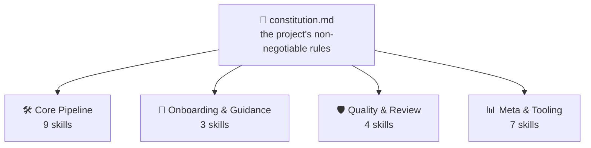
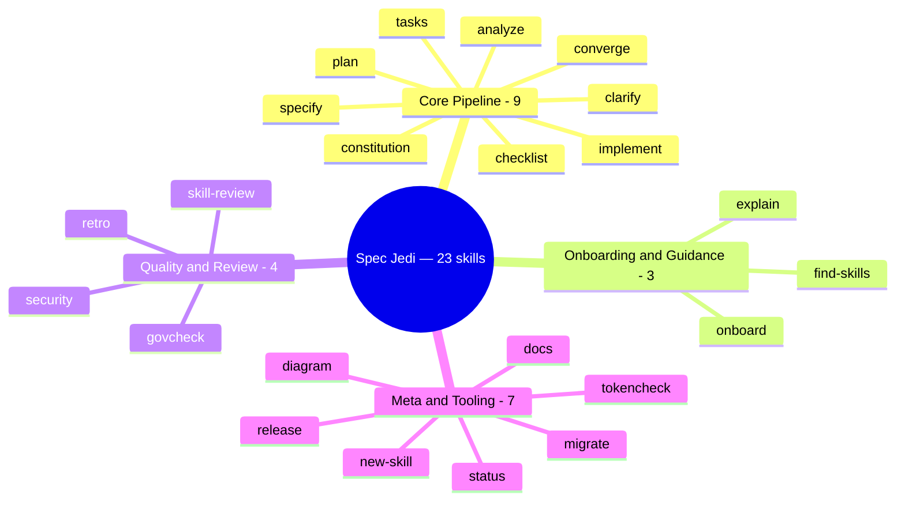
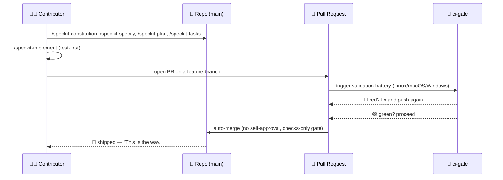
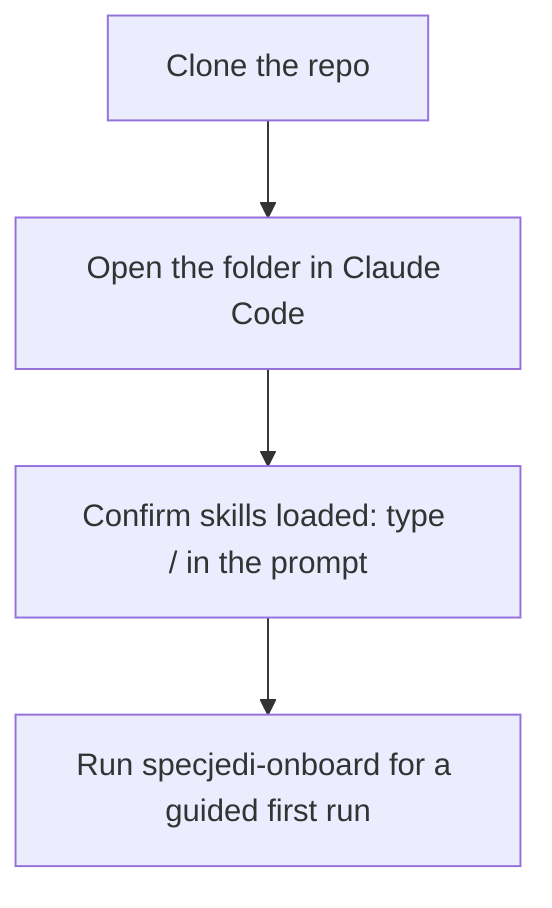
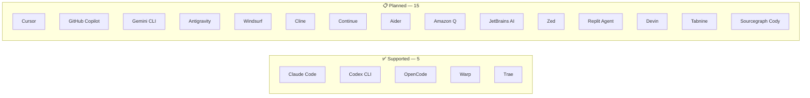
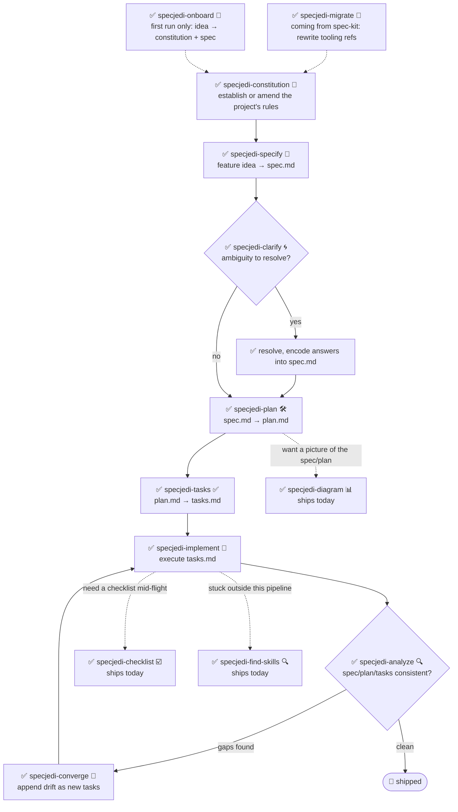

<!-- i18n-sync: source=README.md@5e179bb lang=zh -->
> 🌐 本文档由 AI 辅助翻译。**英文原文为权威版本**（[Principle I](../../../.specify/memory/constitution.md)）；如有出入，以英文为准。查看其他语言：[English](../../../README.md) · [中文](../zh/README.md) · [हिन्दी](../hi/README.md) · [Español](../es/README.md) · [Français](../fr/README.md) · [العربية](../ar/README.md) · [বাংলা](../bn/README.md) · [Português](../pt/README.md) · [Русский](../ru/README.md) · [اردو](../ur/README.md) · [Bahasa Indonesia](../id/README.md)

#  Spec Jedi

[](https://github.com/jonyfs/spec-jedi/actions/workflows/validate.yml)
[](../../../LICENSE)
[](../../../.specify/memory/constitution.md)
[](#今天你能获得什么)
[](#今天你能获得什么)
[](../../../references/skill-roadmap.md)
[](#安装)
[](../../../docs/i18n/)
[](../../../.specify/memory/constitution.md)
[](https://github.com/jonyfs/spec-jedi/commits/main)

> *"先有规格，后有代码。这才是原力之道。"* —— 一位智者，大概是这么说的。

Spec Jedi 是一套安装到你选用的编码智能体（coding agent）中的规格驱动开发（Spec-Driven
Development, SDD）技能集。与其先写代码再补文档，不如先写一份**章程**📜（项目不可动摇的规则）、
一份**规格说明**🎯（要构建什么、为什么）、一份**计划**🛠️（技术上如何实现）和一份**任务清单**✅
（有序的执行步骤）——然后让你的智能体依据这些成果物去实现，而不是像没受过训练的 Padawan 那样临场发挥。

本仓库自身也遵循着它所交付的这套纪律：它自己的[章程](../../../.specify/memory/constitution.md)
是项目行为方式的权威来源，包括版本如何发布、拉取请求（PR）如何验证与合并。这里没有通往 vibe-coding
黑暗面的捷径。🚫🖤

*（非官方、粉丝向的品牌演绎——Spec Jedi 与 Lucasfilm/Disney 没有从属、背书或赞助关系。愿原力与你同在。🌌
"光剑"图标由 Carlos von Dessauer 制作，来自 [Noun Project](https://thenounproject.com)，
采用 CC BY 3.0 许可使用。）*



每个技能都会依据章程校验自身的输出——而不是反过来。规则一旦改变，下游的每个
技能在下一次运行时都会感知到。

## 适合谁使用

任何使用 AI 编码智能体、希望规格、计划和任务成为一等公民、带版本管理的成果物，而不是用完即
丢的聊天消息的人——独立开发者、正在统一团队智能体工作方式的团队,以及厌倦了每次会话都要重新
解释项目背景的人。

## 今天你能获得什么

Spec Jedi 是 [spec-kit](https://github.com/github/spec-kit) 的真正**竞争者**，而不是它的主题化
包装（[Principle XV](../../../.specify/memory/constitution.md)）。完整的 `specjedi-*` SDD 流水线——
从章程到收敛——已经**全部完成并交付**：全部 9 个阶段，按照
[research.md](../../../specs/001-specjedi-pipeline/research.md) 的竞品研究纪律
（Principle II）一个个严谨打磨,从不仓促。

> *"绝地的力量源自原力。项目的力量，同样源自它的技能。"* —— 一位智者，大概是这么说的。

这个"教团"共有二十三名成员——训练的不是战斗，而是规格驱动开发。它遵循四大门类：



**今天即可安装使用：**

| 技能 | 作用 |
|---|---|
| `specjedi-onboard` 🌱 | 全新项目的首次引导流程——一起产出真正的第一份 `constitution.md` 和 `spec.md`，只在真正需要时讲解每个 SDD 概念。若已完成过引导，会立即让路 |
| `specjedi-constitution` 📜 | 建立或修订项目不可动摇的规则——其余所有 `specjedi-*` 技能都据此校验自身。参见[规格说明](../../../specs/001-specjedi-pipeline/spec.md) |
| `specjedi-specify` 🎯 | 将一个功能想法——一句话就够了——转化为按优先级排序、可独立测试的 `spec.md`，标记真正的歧义而不是靠猜 |
| `specjedi-clarify` 🌀 | 扫描规格说明中的真正歧义，最多提出 5 个按优先级排序的问题——每个都附有推荐答案，新手可直接采纳，专家也能一句话回复——避免基于猜测去做计划 |
| `specjedi-plan` 🛠️ | 把已澄清的规格说明转化为技术性的 `plan.md`——先扫描实际代码库中已有的约定，避免实现阶段还要停下来现找模式 |
| `specjedi-tasks` ✅ | 把计划拆解为有序、感知依赖关系的 `tasks.md`，按用户故事分组——凡计划要求写代码之处，都会把失败的测试任务排在实现任务之前 |
| `specjedi-implement` 🔨 | 按依赖顺序执行 `tasks.md`，计划要求写代码时采用测试先行——只通过功能分支和拉取请求提交，绝不直接提交到 `main` |
| `specjedi-analyze` 🔍 | 严格只读地交叉检查 `spec.md`/`plan.md`/`tasks.md`（及章程）之间的差距、重复和矛盾——只报告发现，绝不修改文件 |
| `specjedi-checklist` ☑️ | 为指定关注领域（安全、无障碍、性能……）生成定制检查清单，完全基于该功能自身的 `spec.md`/`plan.md`——绝非通用模板 |
| `specjedi-converge` 🔁 | 检测实际代码库与 `tasks.md` 在手动改动后的漂移，将任何缺口作为新任务追加，而不是悄悄忽略——把闭环带回 `specjedi-implement` |
| `specjedi-find-skills` 🔍 | 当你的请求涉及现有安装技能集无法很好覆盖的领域时，主动推荐一个具体、经过验证的技能——未经确认绝不安装（[Principle XVII](../../../.specify/memory/constitution.md)） |
| `specjedi-explain` 🎓 | 解释任何 SDD 概念或命令，依据你听起来的熟练程度调整深度——从完全新手到日常实践者，绝不千篇一律（[Principle XIX](../../../.specify/memory/constitution.md)） |
| `specjedi-migrate` 🔄 | 把你自己章程/规格/计划/任务中字面出现的 `/speckit-*` 工具引用改写为对应的 `specjedi-*`——绝不触碰原则或需求内容，仅在明确要求时执行 |
| `specjedi-diagram` 📊 | 从既有的 `spec.md`/`plan.md` 生成经渲染验证的 Mermaid 图——从完整的 Mermaid 图表类型库中推断出正确类型（流程图、时序图、ER 图、类图、状态图、甘特图、时间线、用户旅程图、看板、脑图、象限图、饼图等）——始终是原文的补充，绝不取而代之 |
| `specjedi-status` 🧭 | 项目全局仪表盘，展示每个功能的状态，完全从磁盘上实际存在的 `spec.md`/`plan.md`/`tasks.md` 成果物推导得出——零独立维护的追踪系统，绝不把"停滞"当作既定事实来断言 |
| `specjedi-retro` 🪞 | 严格只读的回顾——比对已完成功能的实际实现与其 `plan.md`，任何偏差的原因都基于真实的 git 历史，绝不臆造，并记录一条持久化的带日期条目 |
| `specjedi-security` 🛡️ | 针对身份验证/输入校验/密钥/数据隐私缺口的轻量、主动式"我们想过 X 吗"提示——由 `specjedi-plan` 自动触发，绝不自称是完整的安全审查 |
| `specjedi-docs` 📚 | 从已交付功能的 spec/plan 起草 README 技能表行、Quickstart 步骤和 `CHANGELOG.md` 条目——基于实际内容，写入前始终展示确认 |
| `specjedi-new-skill` 🌟 | 为新的 `specjedi-*` 技能搭建文件结构骨架——只有占位符，绝不臆造内容——遵循本项目自身的技能编写标准,并内置 Principle II 的研究检查清单 |
| `specjedi-release` 🚀 | 用 Spec Jedi 自己的语气包装 `scripts/suggest-release.sh`——播报最近一次标签、建议的下一个版本号，以及相关提交；若被要求真正剪切一次发布，会拒绝并给出手动命令 |
| `specjedi-skill-review` 🎓 | 严格只读地审核某个 `specjedi-*` 技能的 `SKILL.md` 是否符合技能编写标准——检查章节内容而不仅是标题，并对照匹配的 `plan.md` 判断是否属于合理豁免，报告发现或给出"通过"结论，绝不修改被审查的文件 |
| `specjedi-tokencheck` 🎒 | 主动检查是否安装了 `rtk` 和 `graphify`，说明缺失项及其预期的 token 节省效果，并提供安装向导——由 `specjedi-onboard` 首次运行流程自动触发，也可独立运行；未经明确确认绝不安装任何东西 |
| `specjedi-govcheck` ⚖️ | 严格只读的、针对每个 PR/分支的治理检查清单，覆盖全部 20 条章程原则——三态报告（不适用 / 合规 / 不合规），任何冲突都标记为 CRITICAL——在 `specjedi-implement` 打开 PR 前自动触发（不会阻止 PR 打开），也可对当前分支或指定 PR 独立运行 |

关于核心流水线之外还提议了哪些技能（图表等），参见
[`references/skill-roadmap.md`](../../../references/skill-roadmap.md)——这是一份*额外*
技能的储备清单，不是核心流水线的缺口；每一项在被构建前仍需要各自的研究阶段。

## Spec Jedi 如何以漫画形式构建*自身*

> ⚠️ **本节讲的是我们内部的自举（bootstrap）流程，不是 Spec Jedi 产品本身。** 下面的
> `/speckit-*` 命令是 [spec-kit](https://github.com/github/spec-kit) 自己的工具——Spec Jedi
> 目前用 spec-kit 自举来构建自己（与"用旧编译器引导新编译器"是同一种模式），就像任何竞争者
> 在构建替代品时也可能借用现有工具一样。**如果你是在把 Spec Jedi 当作产品来评估，请直接跳到
> 下面的[今天你能获得什么](#今天你能获得什么)**——真正的产品面是 `specjedi-*` 技能，而不是这些。
> 完整政策及为何两者要严格区分，参见
> [Principle XV](../../../.specify/memory/constitution.md)。
>
> 另外说明一下格式：这些是文字加表情符号的漫画分镜，不是生成的美术作品。真正的星球大战图像
> （角色、飞船、logo）属于 Lucasfilm/Disney 的知识产权——本项目自己的
> [Principle XII](../../../.specify/memory/constitution.md) 承诺只使用文字引用，绝不复制受版权保护的
> 美术作品。所以：故事情节是真的，分镜是 Markdown。🖋️

---

**分镜 1 —— 一台孤零零的终端，光标在闪烁。**
> 🧑‍💻 *"我有一个功能想法。……接下来呢？"*

**分镜 2 —— 一个戴兜帽的身影从阴影中走出，手持一卷卷轴。**
> 🧙 *"先立法。"* 📜
> `/speckit-constitution` —— 项目不可动摇的规则，写下一次，此后永远据此检验。

**分镜 3 —— 想法被钉在墙上，问号在周围盘旋。**
> 🌀 *"你到底在造什么——为了谁？"*
> `/speckit-specify` 把想法变成 `spec.md`。`/speckit-clarify` 在歧义变成 bug 之前把它揪出来。

**分镜 4 —— 一张蓝图在工作台上展开。**
> 🛠️ *"现在轮到'怎么做'。"*
> `/speckit-plan` → `plan.md`。`/speckit-tasks` → 有序、感知依赖的 `tasks.md`。一步不落，次序不乱。

**分镜 5 —— 工具嗡嗡作响，测试从红色一个个变绿。**
> 🤖 *"测试优先，永远优先。"*
> `/speckit-implement` 执行 `tasks.md`，适用之处采用测试先行
> （[Principle VI](../../../.specify/memory/constitution.md)）。

**分镜 6 —— 一间议事厅。一份拉取请求站在长凳前。**
> 🏛️ *"陈述你的改动。"*
> 一个 PR 打开了。`ci-gate` 🤖 运行完整的验证battery——每个操作系统、每项检查。不允许自我批准；
> 机器不能赦免自己，你也不能（[Principle X](../../../.specify/memory/constitution.md)）。

**分镜 7 —— 绿灯亮起。闸门自行打开。**
> ✅ *"battery已经表态。"*
> 所有检查通过 → 自动合并，无需任何人点击按钮。

**分镜 8 —— 一艘飞船跃入超空间。**
> 🚀 *"已交付。"*
> 🌌 *"愿原力与你同在。"*

### 同一段内部自举故事，以图表呈现



## 前置条件

Spec Jedi 在 **Linux、macOS 和 Windows** 上开发并验证（Constitution
[Principle XIII](../../../.specify/memory/constitution.md)）——`scripts/` 下的每个脚本都同时提供
POSIX shell（`.sh`）和原生 PowerShell（`.ps1`）两个版本，CI 在每个 PR 上都会在这三种操作系统上
运行整套验证battery。

- `git`
- 一个受支持的编码智能体（见下方[受支持的宿主环境](#受支持的宿主环境)）
- [GitHub CLI（`gh`）](https://cli.github.com/)，仅当你计划通过拉取请求贡献改动时需要
- 仅当你想在本地运行辅助脚本时需要（可选——编码智能体本身不需要）：一个 POSIX shell
  （bash/zsh，Linux 和 macOS 默认自带）**或** [PowerShell 7+](https://aka.ms/powershell)（`pwsh`），
  可在三种操作系统上运行

## 安装

### Claude Code（今天已完全支持）

克隆步骤因操作系统略有不同；之后的步骤完全一致。

**Linux / macOS**（终端）：

```bash
git clone https://github.com/jonyfs/spec-jedi.git
cd spec-jedi
```

**Windows —— 原生 PowerShell**（无需 WSL）：

```powershell
git clone https://github.com/jonyfs/spec-jedi.git
cd spec-jedi
```

**Windows —— WSL 或 Git Bash**（如果你更喜欢在 Windows 上使用类 Unix shell）：

```bash
git clone https://github.com/jonyfs/spec-jedi.git
cd spec-jedi
```

两条 Windows 路径同样有效——选你日常已经在用的那一种就好。之后唯一有区别的地方是你运行哪个
辅助脚本（POSIX shell 用 `scripts/*.sh`，原生 PowerShell 用 `scripts/*.ps1`）；技能本身在两边
表现完全一致。



1. 使用上面对应你操作系统的代码块克隆仓库。

2. 在 [Claude Code](https://claude.com/claude-code) 中打开该文件夹。Claude Code 会自动发现
   `.claude/skills/*/SKILL.md` 下的每一个技能——没有单独的安装步骤或构建流程，这一步在三种操作
   系统上完全一致。

3. 在 Claude Code 提示符中输入 `/` 确认技能已加载。你会看到全部 23 个 `specjedi-*` 产品技能，
   以及 `speckit-*` 命令（本仓库自己的内部自举工具——见[今天你能获得什么](#今天你能获得什么)）
   列在一起，因为 Claude Code 会发现 `.claude/skills/` 下的每一个技能，而不区分二者。

4. 就这样——你已经可以运行 `specjedi-onboard` 开始有引导的第一次运行，或者不确定从哪里开始时
   问问 `specjedi-explain`，又或者读一读章程,了解流水线接下来的走向。

**想在本仓库之外的项目中使用 Spec Jedi？** 运行安装器（Constitution
[Principle XVIII](../../../.specify/memory/constitution.md)）——它只复制 `specjedi-*` 产品技能，
绝不复制 `speckit-*` 自举工具，外加这些技能所需的四个 `.specify/templates/*.md` 文件，并在完成前
验证结果：

```bash
# 从 Spec Jedi 的检出目录中运行，目标为磁盘上的另一个项目
./scripts/install.sh /path/to/your-project
```

```powershell
# Windows 原生 PowerShell
.\scripts\install.ps1 -TargetDir C:\path\to\your-project
```

`--harness` 是可选的——如果省略，安装程序会尝试检测你正在使用的编码智能体（已存在的项目
目录、`PATH` 中的可执行文件，或已存在的全局配置目录），并自动为其安装；只有在检测到多个可
能匹配时才会询问。`claude-code`、`codex-cli` 和 `trae` 目前已构建并测试；其他显式指定的值
会被报告为尚不支持，而不是被悄悄尝试执行——见下方[受支持的宿主环境](#受支持的宿主环境)。
运行 `./scripts/install.sh --help`（或 `.\scripts\install.ps1 -Help`）查看完整选项列表，
包括 `--auto`。

### 受支持的宿主环境

Spec Jedi 的章程（[Principle III](../../../.specify/memory/constitution.md)）承诺该项目最终会支持
市场上使用率最高的二十种 LLM 编码工具/宿主环境。今天，已有五个真实、经过测试、CI 验证过的
宿主环境——其中三个通过专门的安装分支实现（Claude Code、Codex CLI、Trae），另外两个
（OpenCode、Warp）无需额外代码即可满足，因为它们都原生扫描安装程序已经写入的那些目录。



| 宿主环境 | 状态 |
|---|---|
| Claude Code | ✅ 已支持——见上方步骤 |
| Cursor | 📋 计划中——尚不可安装 |
| GitHub Copilot（Chat/Workspace） | 📋 计划中——尚不可安装 |
| Codex CLI（OpenAI） | ✅ 已支持——`./scripts/install.sh --harness codex-cli`（安装到 `.agents/skills/`） |
| Gemini CLI | 📋 计划中——尚不可安装 |
| Antigravity（Google） | 📋 计划中——尚不可安装 |
| Windsurf（Codeium） | 📋 计划中——尚不可安装 |
| Cline | 📋 计划中——尚不可安装 |
| Continue | 📋 计划中——尚不可安装 |
| Aider | 📋 计划中——尚不可安装 |
| Amazon Q Developer | 📋 计划中——尚不可安装 |
| JetBrains AI Assistant | 📋 计划中——尚不可安装 |
| Zed | 📋 计划中——尚不可安装 |
| OpenCode | ✅ 已支持——通过 `claude-code` 或 `codex-cli` 安装均可满足（OpenCode 会原生扫描 `.claude/skills/` 和 `.agents/skills/`），无需单独的标志 |
| Warp（Agent Mode） | ✅ 已支持——通过 `claude-code` 或 `codex-cli` 安装均可满足（Warp 的 Skills 系统会原生扫描 `.claude/skills/` 和 `.agents/skills/`），无需单独的标志 |
| Replit Agent | 📋 计划中——尚不可安装 |
| Devin（Cognition） | 📋 计划中——尚不可安装 |
| Tabnine | 📋 计划中——尚不可安装 |
| Sourcegraph Cody | 📋 计划中——尚不可安装 |
| Trae | ✅ 已支持——`./scripts/install.sh --harness trae`（安装到 `.trae/skills/`） |

按照 Principle III"至少二十种"的要求，逐一列出了二十种宿主环境——仅标注状态（✅ 已支持 /
📋 计划中），对本项目尚未实际构建和测试过的宿主环境不作任何能力方面的断言，遵循 Principle XX
的抗幻觉纪律。"计划中"是一个状态，不是承诺的路线图日期。

如果你的宿主环境尚未被列为已支持，`SKILL.md` 文件是带 YAML frontmatter 的纯 Markdown——许多
支持自定义指令/提示的宿主环境已经可以直接读取它们，即使还没有专门的安装路径，只是这一点尚未
针对每个宿主环境逐一验证和记录。参见
[`references/harness-capability-notes.md`](../../../references/harness-capability-notes.md)
获取每个宿主环境的桌面调研能力说明。

好奇 Spec Jedi 与 spec-kit 及其对标的另外十款 SDD 工具相比如何？参见
[`references/competitive-comparison.md`](../../../references/competitive-comparison.md)。

## 快速开始

今天已有二十三个产品技能可用（[今天你能获得什么](#今天你能获得什么)）——完整的
`specjedi-*` 流水线已经完成。从未用过 SDD 工具？从第 0 步开始。

0. **不确定这些都是什么意思？** 直接问就好——"什么是规格说明,我为什么需要它"、"这个项目到底
   是做什么的"。`specjedi-explain` 🎓 会以你需要的任何深度作答，无论新手还是资深用户，并总会
   指出接下来该运行什么（[Principle XIX](../../../.specify/memory/constitution.md)）。
1. 安装（见上方[安装](#安装)）。
2. 全新项目、不知从何下手？`specjedi-onboard` 🌱 会引导你，从一句话的想法出发，一起产出真正的
   第一份 `constitution.md` 和 `spec.md`，只在真正用到某个概念时才解释它——绝不是一上来就是一
   堵文档墙。（下面第 3-4 步正是它为你编排的内容；如果你想自己逐阶段运行,可以直接跳到那两步。）
3. 确立项目规则：用大白话描述你的不可动摇之处，`specjedi-constitution` 📜 会产出一份带版本号的
   `.specify/memory/constitution.md`——其余所有 `specjedi-*` 技能都会据此校验自己的输出。
4. 为一个功能写规格：描述你想构建什么——一个大致的一句话想法就够了——`specjedi-specify` 🎯
   会把它转化为按优先级排序、可独立测试的 `spec.md`，标记真正的歧义而不是靠猜。
5. 不确定规格说明是否扎实？`specjedi-clarify` 🌀 会扫描其中真正的歧义,最多提出 5 个按优先级
   排序的问题——每个都附推荐答案，你可以一个词就采纳，也可以细读理由——在基于猜测做计划之前
   先把这些理清。
6. 准备好设计"怎么做"了吗？`specjedi-plan` 🛠️ 会先扫描你实际的代码库,找出已有约定，再把已澄清
   的规格说明转化为技术性的 `plan.md`——这样实现阶段就不必再停下来找项目里其他地方已经存在的
   模式。如果你的规格说明涉及身份验证、外部输入、密钥或数据处理，`specjedi-security` 🛡️
   会自动触发一些有针对性的"我们想过 X 吗"问题——是一个轻量提示，绝非完整的安全审查。
7. 准备好拆解为具体工作了吗？`specjedi-tasks` ✅ 会把计划转化为有序、感知依赖关系、按用户
   故事分组的 `tasks.md`——凡计划要求写代码之处，都会把失败的测试任务排在实现任务之前。
8. 准备好构建了吗？`specjedi-implement` 🔨 按依赖顺序执行 `tasks.md`，计划要求写代码时采用
   测试先行——每次提交都落在功能分支和拉取请求上，绝不直接提交到 `main`。
9. 想要一张安全网？`specjedi-analyze` 🔍 会交叉检查 `spec.md`、`plan.md` 和 `tasks.md`
   （以及你的章程）之间的差距、重复或矛盾——严格只读，随时可运行，绝不修改文件。
10. 需要一次有针对性的审查？`specjedi-checklist` ☑️ 会为指定关注领域——安全、无障碍、性能，
    随你指定——生成一份检查清单，完全基于该功能自身的 spec/plan，绝非通用模板。
11. 上次的 `tasks.md` 之后你手动改过代码？`specjedi-converge` 🔁 会扫描实际代码库，检测任何
    没有对应任务的能力，把它作为新工作追加,而不是任其悄悄漂移失步——这是流水线的最后一个阶段，
    把闭环带回 `specjedi-implement`。
12. 卡在这套技能之外的事情上了？直接描述它——"我该怎么做 X"、"有没有针对 X 的技能"——
    `specjedi-find-skills` 🔍 会自动触发，搜索开放的 agent-skills 生态，并推荐一个具体、经过
    验证的技能。未经确认绝不安装任何东西（[Principle VIII](../../../.specify/memory/constitution.md)）。
13. 从已有的 spec-kit 项目迁移过来？`specjedi-migrate` 🔄 会把你项目自己的 `/speckit-*`
    工具引用改写为对应的 `specjedi-*`——绝不触碰任何原则或需求内容，仅在明确要求时执行。
14. 想要一张图而不是一堵文字墙？`specjedi-diagram` 📊 会把规格说明或计划转化为经渲染验证的
    Mermaid 图——从完整图表类型库中选取实际内容所需的类型（见
    [`references/mermaid-diagram-catalog.md`](../../../references/mermaid-diagram-catalog.md)）
    ——始终与原文并列展示，绝不取而代之。
15. 同时在忙不止一两个功能？`specjedi-status` 🧭 会展示一个项目全局仪表盘——哪些功能已写好
    规格、已计划、进行中或已完成——完全从磁盘上实际存在的内容推导得出，无需另建追踪系统来保持
    同步。
16. 刚完成一个功能？`specjedi-retro` 🪞 会比对实际交付的内容与 `plan.md` 所说的,任何偏差的
    原因都基于真实的 git 历史——绝不臆造——并记录一条持久化条目，让这个信号能留存到这次对话
    结束之后。
17. 交付了什么东西，需要记录文档？`specjedi-docs` 📚 会为你起草 README 表行、Quickstart
    步骤和 `CHANGELOG.md` 条目——基于你实际的 spec/plan，写入任何内容前都会展示以供确认。
18. 想为 Spec Jedi 本身扩展一个新技能？`specjedi-new-skill` 🌟 会搭建文件结构骨架——
    `specs/`、`SKILL.md` 骨架、每个章节都标注为占位符——绝不代你臆造研究发现或行为内容。
19. 想知道是否该发布新版本了？`specjedi-release` 🚀 会播报 `scripts/suggest-release.sh`
    自己给出的建议——最近一次标签、下一个版本号、相关提交——如果你要求它真正剪切一次发布，
    它会拒绝，并给出确切的手动命令；它自己绝不打标签或发布。
20. 手动编写或修改了某个 `specjedi-*` 技能？`specjedi-skill-review` 🎓 会检查其 `SKILL.md`
    是否符合技能编写标准——检查章节内容而不仅是标题，并对照匹配的 `plan.md` 判断是否属于合理
    豁免——报告发现或给出"通过"结论；它绝不修改被审查的文件本身。
21. `specjedi-onboard` 已经会在首次使用时为你运行一次，但 `specjedi-tokencheck` 🎒 也能独立
    运行——检查是否安装了 `rtk` 和 `graphify`，说明缺失项及其预期的 token 节省效果，并提供
    安装向导；未经你明确同意绝不安装任何东西。
22. `specjedi-implement` 已经会在每次打开 PR 之前为你运行一次,但 `specjedi-govcheck` ⚖️
    也能独立运行——针对当前分支（或 PR）,对全部 20 条章程原则给出检查清单，把每一条报告为
    不适用、合规或不合规，任何真实冲突都标记为 CRITICAL；严格只读，绝不修改任何内容，也绝不
    自行阻止 PR 打开。

按照 [Principle XIV](../../../.specify/memory/constitution.md)，你刚运行的任何步骤都应该会告诉你
接下来该做什么——你不该需要回来查这份清单才能弄清楚。完整链条是 `specjedi-onboard`（仅首次
运行）→ `specjedi-constitution` → `specjedi-specify` → `specjedi-clarify` → `specjedi-plan` →
`specjedi-tasks` → `specjedi-implement` → `specjedi-analyze` → `specjedi-checklist` →
`specjedi-converge`，每当 `specjedi-converge` 发现漂移需要处理时，就循环回到
`specjedi-implement`。

### 完整流水线，从头到尾

从引导到收敛——下面每个阶段都已上线：



✅ = 今天已上线——完整的 9 阶段 `specjedi-*` 流水线已经完成，外加 `specjedi-onboard` 作为
有引导的首次运行入口。

## 推荐的伴侣工具

本项目的章程（[Principle VIII](../../../.specify/memory/constitution.md)）要求每次 Spec Jedi
会话都主动建议——但绝不悄悄安装——两个省 token 的伴侣工具：

- [`rtk`](https://github.com/rtk-ai/rtk) —— 面向常见开发操作的、token 优化的 CLI 代理。
- [`graphify`](https://graphify.net/) —— 把代码库变成可查询的知识图谱。

如果你的智能体主动提出要安装或配置其中之一，那正是这条政策在起作用——你始终会被先问一遍。

**graphify 已经接入本仓库**（经维护者确认）：`CLAUDE.md` 中的 `## graphify` 小节会告诉
Claude Code 在浏览源码前先查询知识图谱，并在代码改动后刷新它；`.claude/settings.json` 注册了
钩子，在知识图谱存在时把工具调用引导向 `graphify query`/`explain`/`path`，而不是原始的
grep/read。图谱本身（`graphify-out/`）不被提交——它是一个派生缓存，每次克隆后重新生成。

克隆后想在本地获得同样的自动更新行为：

```bash
pip install graphifyy   # 或：uv tool install graphifyy
graphify .               # 首次构建（只需一次；首次使用时也会自动运行）
graphify hook install    # 每次提交后自动重建 graph.json（代码改动）
```

文档/内容改动不会被提交钩子捕获——编辑非代码文件后运行 `graphify update .`
（或直接让你的智能体去运行）。

## 版本管理与发布

Spec Jedi 自身的发布遵循[语义化版本](https://semver.org/)，范围限定于面向公众的技能包契约
（破坏性的技能行为变更 = MAJOR，新技能或可加性能力 = MINOR，修复/文档 = PATCH）。完整政策见
[Principle XI](../../../.specify/memory/constitution.md)。

项目会主动提示何时应该发布，而不是悄悄剪切一次发布：

```bash
# Linux / macOS / Windows（WSL 或 Git Bash）
./scripts/suggest-release.sh
```

```powershell
# Windows（原生 PowerShell）
./scripts/suggest-release.ps1
```

这会检查自上次打标签以来的提交，并推荐下一个版本号——它自己绝不打标签或发布任何东西。真正
剪切一次发布始终是一个有意为之、由维护者主导的步骤。

## 贡献

完整的贡献流程——新技能的竞品研究要求、技能编写标准检查清单，以及打开 PR 前要运行的验证
步骤——见[`CONTRIBUTING.md`](./CONTRIBUTING.md)。

每一次改动都通过拉取请求交付，由本项目自己的 CI battery 验证，只有在每一项检查都变绿之后才会
自动合并（见 [Principle IX 和 X](../../../.specify/memory/constitution.md)）。这套battery在每个
PR 上都会在 Linux、macOS 和 Windows 上运行（Principle XIII）——如果你在 `scripts/` 下新增或
修改了脚本，`.sh` 和 `.ps1` 两个版本都必须存在,并且都要在三种系统上通过。Issue 和 PR 模板
（`.github/ISSUE_TEMPLATE/`、`.github/PULL_REQUEST_TEMPLATE.md`）会引导贡献者在申请审查前确认
已完成上述研究和验证步骤。

## 许可证

[MIT](../../../LICENSE) —— 由本项目自己的章程选定并要求使用（Distribution & Ecosystem
Standards）。用大白话说，MIT 意味着你可以：

- **使用**本项目，无论商业与否，不受限制。
- 随意**修改**它。
- **再分发**它，包括作为你所出售之物的一部分。

真正的条件只有：在你的副本中保留原始版权声明和许可证文本，并且不要期待任何担保——软件是
"按现状"提供的，出问题概不负责。这就是全部约定；确切法律文本见
[`LICENSE`](../../../LICENSE)。

---
