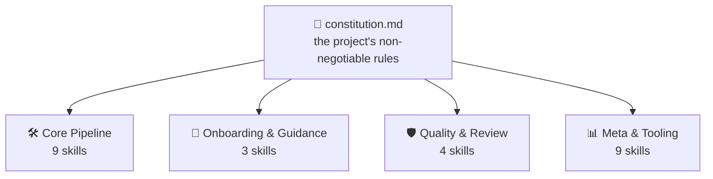
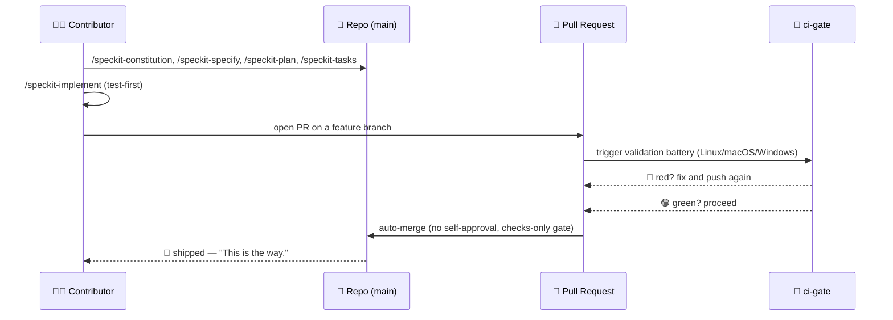

<!-- i18n-sync: source=README.md@1609524 lang=zh -->
> 🌐 本文档由 AI 辅助翻译。**英文原文为权威版本**（[Principle I](../../../.specify/memory/constitution.md)）；如有出入，以英文为准。查看其他语言：[English](../../../README.md) · [中文](../zh/README.md) · [हिन्दी](../hi/README.md) · [Español](../es/README.md) · [Français](../fr/README.md) · [العربية](../ar/README.md) · [বাংলা](../bn/README.md) · [Português](../pt/README.md) · [Русский](../ru/README.md) · [اردو](../ur/README.md) · [Bahasa Indonesia](../id/README.md)

# Spec Jedi

[](https://github.com/jonyfs/spec-jedi/actions/workflows/validate.yml)
[](../../../LICENSE)
[](../../../.specify/memory/constitution.md)
[](#spec-jedi-如何实现-sdd)
[](#spec-jedi-如何实现-sdd)
[](../../../references/skill-roadmap.md)
[](#安装)
[](../../../docs/i18n/)
[](../../../.specify/memory/constitution.md)
[](https://github.com/jonyfs/spec-jedi/commits/main)

> *"先有规格，后有代码。这才是原力之道。"* —— 一位智者，大概是这么说的。


**一封信，来自一位大师，写给下一个接过这卷羊皮卷的人：**

大多数超出自身计划范围的项目都有着同一个根本原因：先有代码，后有解释——而这个
"后"从来没有真正到来过。接下来要讲的，正是把这个顺序颠倒过来的实践，以及为实践
它而构建的具体项目。

*（非官方、粉丝向的品牌演绎——Spec Jedi 与 Lucasfilm/Disney 没有从属、背书或赞助关系。愿原力与你同在。🌌）*

## 什么是规格驱动开发？

用 AI 编码智能体构建软件的常见方式是这样的：在聊天中描述你想要什么，智能体写出
代码，你读代码来判断它是否做到了你的本意，你修正它，然后重复这个过程。智能体对
"你的本意"的理解只存在于对话之中——从未被记录为一份持久、可审阅的成果物。由此
产生两种失败模式：歧义靠猜测来解决,而不是被摆到明面上做决定；而且没有什么能在
对话结束后留存下来——你关掉聊天窗口，就丢失了推理过程。

规格驱动开发（Spec-Driven Development, SDD）把这个顺序颠倒过来。在任何一行代码
存在之前，先把要构建什么、为什么要构建写下来，形成一份结构化、可审阅的文档——
一份**章程**📜（不可动摇的规则）、一份**规格说明**🎯（做什么、为了谁）、一份
**计划**🛠️（技术上如何实现）、以及一份**任务清单**✅（有序的执行步骤）。代码是
*依据*这些成果物生成的，而不是反过来——这正是绝地法典要求任何想跳过训练中枯燥
部分的人所遵循的那份纪律。完整解释，不含任何 Spec Jedi 自身品牌：
[`references/what-is-sdd.md`](../../../references/what-is-sdd.md)。



接下来的一切都依据章程校验自身,绝不是反过来。改变一条规则,每个技能都会在下一次
运行时感知到。

## Spec Jedi 如何实现 SDD

Spec Jedi 是 [spec-kit](https://github.com/github/spec-kit) 的真正**竞争者**，而不是它的主题化
包装（[Principle XV](../../../.specify/memory/constitution.md)）——二十种编码智能体真正
得到了支持，不只是理论上（见下方[安装](#安装)）。完整的 `specjedi-*` SDD 流水线——
从章程到收敛——早已全部交付：全部 9 个阶段，每一个都建立在真实的竞品研究之上,
然后才动笔写下第一行代码
（[research.md](../../../specs/001-specjedi-pipeline/research.md)，Principle II）。

以上每一项 SDD 活动都对应着一个真实、已经交付的 `specjedi-*` 技能，而不是一种
愿景：`specjedi-constitution` 建立规则，`specjedi-specify` 把想法转化为
`spec.md`，`specjedi-clarify` 解决被标记的歧义，`specjedi-plan` 和
`specjedi-tasks` 产出技术计划和任务拆解，而 `specjedi-implement`（或面向小型、
已充分理解改动的 `specjedi-quick`）以测试先行的方式执行它，只通过功能分支和拉取
请求。今天总共有二十五个技能可用，分布在四大门类——完整目录、两张图表以及 23
步走查指南都收录在
[`references/quickstart-guide.md`](../../../references/quickstart-guide.md)；
完整的"活动 → 技能"对照表，包括超越通用 SDD 实践的三项真实贡献，收录在
[`references/specjedi-and-sdd.md`](../../../references/specjedi-and-sdd.md)。

好奇接下来还有什么？
[`references/skill-roadmap.md`](../../../references/skill-roadmap.md)
追踪了核心流水线之外还提议了哪些内容——这是一份*额外*想法的储备清单，不是核心
流水线本身的缺口。每一项在被构建前仍需要各自真实的研究阶段；这里没有任何东西是
靠直觉交付的。

## 适合谁使用

厌倦了每次会话都要重新解释同一个项目背景。厌倦了看着智能体悄悄重新发明一个团队
三周前就已经做出并放弃的决定，只因为没有任何地方把它写下来、让智能体能找到。无
论是一个人还是一整个团队,想让所有智能体表现一致——任何希望规格、计划和任务成为
真实的、带版本管理的文件，而不是关掉窗口就消失的聊天消息的人，都是这里所面向的
读者。

## Spec Jedi 如何以漫画形式构建*自身*

> ⚠️ **本节讲的是我们内部的自举（bootstrap）流程，不是 Spec Jedi 产品本身。** 下面的
> `/speckit-*` 命令是 [spec-kit](https://github.com/github/spec-kit) 自己的工具——Spec Jedi
> 目前用 spec-kit 自举来构建自己（与"用旧编译器引导新编译器"是同一种模式），就像任何竞争者
> 在构建替代品时也可能借用现有工具一样。**如果你是在把 Spec Jedi 当作产品来评估，请直接跳到
> 下面的[安装](#安装)**——真正的产品面是 `specjedi-*` 技能，而不是这些。
> 完整政策及为何两者要严格区分，参见
> [Principle XV](../../../.specify/memory/constitution.md)。
>
> 另外说明一下格式：下面的分镜把文字加表情符号的对话与原创插画结合在一起——绝不
> 是真正的星球大战图像（角色、飞船、logo），那些属于 Lucasfilm/Disney 的知识产权。
> 本项目自己的
> [Principle XII](../../../.specify/memory/constitution.md) 承诺采用原创的视觉
> 身份，星球大战相关内容只使用文字引用，绝不复制受版权保护的美术作品,也绝不制作
> 会让人联想到该系列标志性视觉符号的美术作品。所以：故事情节是真的，美术是原创
> 的,文字本身依然能独立传达含义。🖋️

---

每个故事都以同样的方式开场：一间昏暗的房间，一台终端，一个不停闪烁的光标,直到
你给它一件事去做。


> 🧑‍💻 *"我有一个功能想法。……接下来呢？"*

就在这时导师出现了——没有光剑，只有一卷羊皮卷，因为这里的第一场战斗从来都不是
最后一场。`/speckit-constitution` 把规则写下一次，往后就再也不用有人因为没学到
而在三个功能之后吃苦头。


> 🧙 *"先立法。"* 📜

接下来想法被贴到墙上，周围环绕着它还没能回答的每一个问题——到底在造什么，为了
谁。`/speckit-specify` 把它变成一份真正的 `spec.md`；`/speckit-clarify` 出发去
猎捕歧义，赶在它变成一个没人愿意认领的 bug 之前。


> 🌀 *"你到底在造什么——为了谁？"*

然后蓝图出现了。`/speckit-plan` 变成 `plan.md`，`/speckit-tasks` 把它拆解成一份
有序、感知依赖关系的 `tasks.md`——一步不落，次序不乱，是那种 Padawan 不用反复
确认就能照着执行的计划。


> 🛠️ *"现在轮到'怎么做'。"*

工具开始嗡嗡作响。测试一个接一个地以红色失败——然后，渐渐地，它们不再失败。
`/speckit-implement` 在适用之处以测试先行的方式执行 `tasks.md`
（[Principle VI](../../../.specify/memory/constitution.md)），因为跳过这一步的
构建不过是多了几个步骤的猜测。


> 🤖 *"测试优先，永远优先。"*

现在议事会召开了——不是为了给工作盖章祝福,只是为了检查它。一份拉取请求站在长凳
前，`ci-gate` 🤖 运行完整的验证 battery：每一种操作系统、每一项检查，没有捷径。
这里不允许任何人批准自己的工作——无论是机器还是人
（[Principle X](../../../.specify/memory/constitution.md)）。


> 🏛️ *"陈述你的改动。"*

灯光转绿，闸门自行打开——没有一只手放在拉杆上，没有人点击按钮。battery 已经说
出了它该说的话。


> ✅ *"battery 已经表态。"*

然后它就离开了——奔赴超空间，交付完成。


> 🚀 *"已交付。"*
> 🌌 *"愿原力与你同在。"*

这一切都不是虚构的——这正是本项目自己近期这些拉取请求（例如
[#82](https://github.com/jonyfs/spec-jedi/pull/82)、
[#84](https://github.com/jonyfs/spec-jedi/pull/84)、
[#87](https://github.com/jonyfs/spec-jedi/pull/87)，仅举几例）背后真实、反复上演
的流程——每一次都实打实地从头到尾走完，每次都是如此。

### 同一段内部自举故事，以图表呈现



## 前置条件

这里没有什么特别的东西。Spec Jedi 在 **Linux、macOS 和 Windows** 上同等构建并测试
（Constitution [Principle XIII](../../../.specify/memory/constitution.md)）——
`scripts/` 下的每个脚本都同时提供 POSIX shell（`.sh`）和原生 PowerShell（`.ps1`）
两个版本，CI 在每个 PR 上都会在这三种操作系统上运行完整的验证 battery。

真正需要的东西：

- `git`
- 一个受支持的编码智能体（见下方[受支持的宿主环境](#受支持的宿主环境)）
- [GitHub CLI（`gh`）](https://cli.github.com/)——仅当你计划把改动以拉取请求
  发回时才需要
- 一个用于本地运行辅助脚本的 shell，如果你想的话（编码智能体本身不需要这个）：
  bash/zsh（Linux 和 macOS 默认自带），或者
  [PowerShell 7+](https://aka.ms/powershell)（`pwsh`），它可以在任何地方运行

## 安装

一条命令。无需 `git clone`。`scripts/bootstrap-install.sh`/`.ps1`（如果想看完整
来龙去脉，见 specs/024-bootstrap-installer）会为你拉取一个已发布的 GitHub
Release，并直接在你的目标目录中运行其内置的安装程序：

```bash
curl -fsSL https://raw.githubusercontent.com/jonyfs/spec-jedi/main/scripts/bootstrap-install.sh \
  | bash -s -- /path/to/your-project --harness cursor
```

```powershell
&([scriptblock]::Create((iwr -useb https://raw.githubusercontent.com/jonyfs/spec-jedi/main/scripts/bootstrap-install.ps1).Content)) -TargetDir C:\path\to\your-project -Harness cursor
```

`--harness` 是可选的。如果省略，安装程序会尝试判断你正在使用哪个编码智能体——
`claude-code`、`codex-cli` 或 `trae`——方法是检查是否已存在项目目录、`PATH` 中
是否有对应可执行文件，或是否已存在全局配置文件夹，只有在检测到多个可能匹配时才
会询问。其余 17 个宿主环境目前还没有可靠的检测信号，因此需要你自己传入
`--harness`——完整列表就在下方的[受支持的宿主环境](#受支持的宿主环境)。运行
`./scripts/bootstrap-install.sh --help`（或
`.\scripts\bootstrap-install.ps1 -Help`）随时查看完整选项列表，包括 `--auto`。

### 受支持的宿主环境

章程（[Principle III](../../../.specify/memory/constitution.md)）承诺该项目
支持市场上使用率最高的二十种编码智能体——截至本次发布，全部二十个都是真实、
经过测试、CI 验证过的，绝非空想。其中四个原生从磁盘读取技能（Claude Code、
Codex CLI、Trae、Antigravity——后三者只共享两个物理目标目录，
`.agents/skills/` 和 `.trae/skills/`，OpenCode 和 Warp 无需额外代码即可通过
这些相同路径得到满足）。其余十四个完全没有原生的技能概念——只有一个项目根目录
规则文件、一个小型规则目录，或者（对 Sourcegraph Cody 而言）一个自定义命令
JSON 文件——因此安装程序会构建一个**桥接**：真实的 `specjedi-*` 包仍然落在
标准位置 `.claude/skills/`，再由一个小的适配器（一个文件，或对目录式宿主环境
而言每个技能一个文件）用该宿主环境自己真正文档化的约定指向它。

参见 [`specs/023-full-harness-coverage/research.md`](../../../specs/023-full-harness-coverage/research.md)
了解每个宿主环境确切机制背后的引用出处——这里没有任何东西是靠猜的。

| 宿主环境 | 状态 |
|---|---|
| Claude Code | ✅ 已支持——上方的[安装](#安装)命令，省略 `--harness`（自动检测）或显式传入 `--harness claude-code` |
| Cursor | ✅ 已支持——`./scripts/install.sh --harness cursor`（桥接文件位于 `.cursor/rules/`） |
| GitHub Copilot（Chat/Workspace） | ✅ 已支持——`./scripts/install.sh --harness copilot`（桥接文件位于 `.github/copilot-instructions.md`） |
| Codex CLI（OpenAI） | ✅ 已支持——`./scripts/install.sh --harness codex-cli`（安装到 `.agents/skills/`） |
| Gemini CLI | ✅ 已支持——`./scripts/install.sh --harness gemini-cli`（桥接文件位于 `GEMINI.md`；Google 正在逐步淘汰 Gemini CLI，转向 Antigravity——见 [`references/harness-capability-notes.md`](../../../references/harness-capability-notes.md)） |
| Antigravity（Google） | ✅ 已支持——`./scripts/install.sh --harness antigravity`（安装到 `.agents/skills/`，与 Codex CLI 采用相同约定） |
| Windsurf（Codeium） | ✅ 已支持——`./scripts/install.sh --harness windsurf`（桥接文件位于 `.windsurf/rules/`） |
| Cline | ✅ 已支持——`./scripts/install.sh --harness cline`（桥接文件位于 `.clinerules/`） |
| Continue | ✅ 已支持——`./scripts/install.sh --harness continue`（桥接文件位于 `.continue/rules/`） |
| Aider | ✅ 已支持——`./scripts/install.sh --harness aider`（桥接文件位于 `CONVENTIONS.md`） |
| Amazon Q Developer | ✅ 已支持——`./scripts/install.sh --harness amazon-q`（桥接文件位于 `.amazonq/rules/`） |
| JetBrains AI Assistant | ✅ 已支持——`./scripts/install.sh --harness jetbrains-ai`（桥接文件位于 `.aiassistant/rules/`） |
| Zed | ✅ 已支持——`./scripts/install.sh --harness zed`（桥接文件位于 `.rules`） |
| OpenCode | ✅ 已支持——通过 `claude-code` 或 `codex-cli` 安装均可满足（OpenCode 会原生扫描 `.claude/skills/` 和 `.agents/skills/`），无需单独的标志 |
| Warp（Agent Mode） | ✅ 已支持——通过 `claude-code` 或 `codex-cli` 安装均可满足（Warp 的 Skills 系统会原生扫描 `.claude/skills/` 和 `.agents/skills/`），无需单独的标志 |
| Replit Agent | ✅ 已支持——`./scripts/install.sh --harness replit`（桥接文件位于 `replit.md`） |
| Devin（Cognition） | ✅ 已支持——`./scripts/install.sh --harness devin`（桥接文件位于 `.devin.md`，按 Devin Playbook 格式组织） |
| Tabnine | ✅ 已支持——`./scripts/install.sh --harness tabnine`（桥接文件位于 `.tabnine/guidelines/`） |
| Sourcegraph Cody | ✅ 已支持——`./scripts/install.sh --harness cody`（`.vscode/cody.json` 自定义命令，需显式调用为 `/specjedi-<name>`；与上面其他宿主环境不同，Cody 没有确认可用的常驻规则文件，因此这是手动调用，而非自动加载的上下文——详见研究文档） |
| Trae | ✅ 已支持——`./scripts/install.sh --harness trae`（安装到 `.trae/skills/`） |

二十种宿主环境逐一列出，全部 ✅ 已支持——这正是 Principle III 自身设定的标准。
对本项目尚未实际构建和测试过的机制不作任何能力方面的断言；Principle XX 不允许
在这里靠猜。

想了解更多？[`references/harness-capability-notes.md`](../../../references/harness-capability-notes.md)
收录了每个宿主环境最初的桌面调研笔记，而
[`specs/023-full-harness-coverage/research.md`](../../../specs/023-full-harness-coverage/research.md)
收录了这整张表格所依据的真实安装机制决策与引用出处。

## 诚实评估

真实的优势，真实的当前局限——不是一份营销页面。二十个目标宿主环境中的二十个都
拥有经过 CI 测试的真实安装路径，图表在展示前都经过渲染验证，章程是一份活的、
带版本管理的文档，当前版本 v1.24.0，带有完整记录的修订历史。另一半坦率地说：
目前还没有剪切过任何一次发布（写下这些文字时 `git tag -l` 什么都没返回），而且
大多数桥接式宿主环境的安装路径都建立在桌面调研之上，而不是在真实的第三方产品中
亲手验证过。完整、不加过滤的全貌，见
[`references/honest-assessment.md`](../../../references/honest-assessment.md)。

二十种宿主环境逐一列出，全部经过 CI 验证——但除 Claude Code 之外的 19 个宿主
环境中,有 18 个是通过桌面调研确认的（每个宿主环境引用一个来源），而不是通过
实际安装到真实产品中、观察某个技能被加载来确认的；只有 Sourcegraph Cody 的状态
在更深入的后续调研之后发生了变化，那次调研没有找到已确认的常驻规则文件。各宿主
环境的引用出处及完整研究历史，见
[`references/harness-capability-notes.md`](../../../references/harness-capability-notes.md)。

好奇 Spec Jedi 与 spec-kit 及其对标的另外十款 SDD 工具相比如何？
[`references/competitive-comparison.md`](../../../references/competitive-comparison.md)
有确凿的依据。

## 贡献

完整的贡献流程——新技能的竞品研究要求、技能编写标准检查清单，以及打开 PR 前要
运行的验证步骤——见[`CONTRIBUTING.md`](./CONTRIBUTING.md)。

每一次改动都通过拉取请求交付，由本项目自己的 CI battery 验证，只有在每一项检查
都变绿之后才会自动合并
（见 [Principle IX 和 X](../../../.specify/memory/constitution.md)）。这套
battery 在每个 PR 上都会在 Linux、macOS 和 Windows 上运行（Principle XIII）——
如果你在 `scripts/` 下新增或修改了脚本，`.sh` 和 `.ps1` 两个版本都必须存在，
并且都要在三种系统上通过，没有例外。Issue 和 PR 模板
（`.github/ISSUE_TEMPLATE/`、`.github/PULL_REQUEST_TEMPLATE.md`）会引导你在
申请审查前确认已完成上述研究和验证步骤。

## 许可证

[MIT](../../../LICENSE)——由本项目自己的章程要求使用（Distribution & Ecosystem
Standards），不只是一个没人多想的默认选择。用大白话说，MIT 意味着你可以：

- **使用**本项目，无论商业与否，不受限制。
- 随意**修改**它。
- **再分发**它，包括作为你所出售之物的一部分。

真正的条件只有两条：在你的副本中保留原始版权声明和许可证文本，并且不要期待任何
担保——软件是"按现状"提供的，出问题概不负责。这就是全部约定；如果你想要逐字
逐句的确切法律文本，见 [`LICENSE`](../../../LICENSE)。

---

🌌 *愿原力与你同在。*
