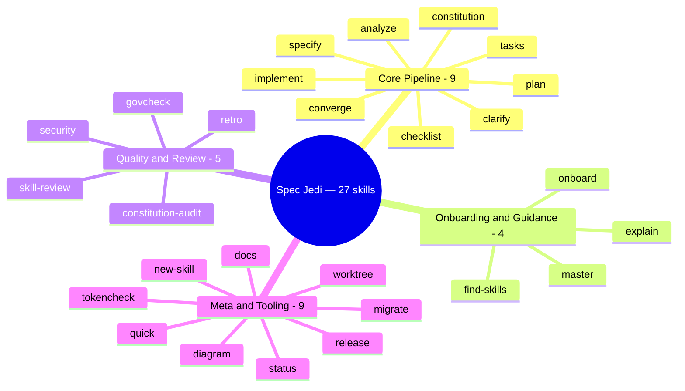
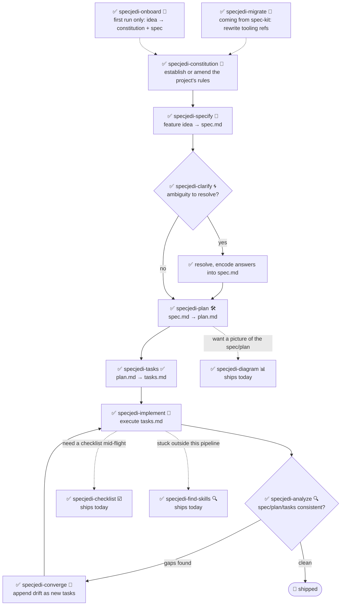

# Quickstart Guide: The Full `specjedi-*` Skill Catalog and Walkthrough

The complete, step-by-step depth behind the README's condensed
["How Spec Jedi Implements SDD"](../README.md#how-spec-jedi-implements-sdd)
section: every shipped skill, the two diagrams showing how they fit
together, and the full 23-step walkthrough from zero to a shipped
feature. Read the README first if you haven't — this document assumes
you already know what SDD is and why Spec Jedi implements it the way it
does.

## Skills, by discipline

Twenty-seven skills deep at this point — trained not for combat, but for
Spec-Driven Development, across four disciplines:

**Ships today, install and use now:**

| Skill | What it does |
|---|---|
| `specjedi-onboard` 🌱 | First-run walkthrough for a brand-new project — produces a real first `constitution.md` and `spec.md` together, teaching each SDD concept exactly when it's needed. Steps aside instantly if onboarding already happened |
| `specjedi-constitution` 📜 | Establishes or amends a project's non-negotiable rules — the foundation every other `specjedi-*` skill checks against. See [spec](../specs/001-specjedi-pipeline/spec.md) |
| `specjedi-specify` 🎯 | Turns a feature idea — one sentence is enough — into a prioritized, independently-testable `spec.md`, marking real ambiguity instead of guessing |
| `specjedi-clarify` 🌀 | Scans a spec for real ambiguity and asks up to 5 prioritized questions — each with a Recommended answer so a beginner gets guidance and an expert can reply in one word — before you plan against a guess |
| `specjedi-plan` 🛠️ | Turns a clarified spec into a technical `plan.md` — scans the actual codebase for existing conventions first, so implementation never has to stop and search for one |
| `specjedi-tasks` ✅ | Breaks a plan into an ordered, dependency-aware `tasks.md` grouped by user story — sequences a failing test before its implementation task wherever the plan calls for code |
| `specjedi-implement` 🔨 | Executes `tasks.md` in dependency order, test-first where the plan calls for code — commits only through a feature branch and pull request, never directly to `main` |
| `specjedi-quick` ⚡ | The lightweight path for small, well-understood changes — one `quick.md` instead of `spec.md`+`research.md`+`plan.md`+`tasks.md`, straight to implementation. Quality gates (test-first, `specjedi-govcheck`, PR-only) never shorten, only planning ceremony does. Declines and redirects to `specjedi-specify` for anything bigger, ambiguous, or a new skill — see [Which path should I use?](#which-path-should-i-use) |
| `specjedi-analyze` 🔍 | Strictly read-only cross-check of `spec.md`/`plan.md`/`tasks.md` (and the constitution) for gaps, duplication, and contradictions — reports findings, never edits a file |
| `specjedi-checklist` ☑️ | Generates a custom checklist for a named focus area (security, accessibility, performance...) grounded entirely in this feature's own `spec.md`/`plan.md` — never generic boilerplate |
| `specjedi-converge` 🔁 | Detects drift between the actual codebase and `tasks.md` after manual changes, appending any gap as a new task instead of silently ignoring it — closes the loop back to `specjedi-implement` |
| `specjedi-find-skills` 🔍 | Suggests a specific, verified skill when your request touches a domain nothing installed covers well — never installs without asking first ([Principle XVII](../.specify/memory/constitution.md)) |
| `specjedi-explain` 🎓 | Explains any SDD concept or command, calibrated to how experienced you sound — total beginner through daily practitioner, never the same canned answer either way ([Principle XIX](../.specify/memory/constitution.md)) |
| `specjedi-migrate` 🔄 | Rewrites literal `/speckit-*` tooling references in your own constitution/spec/plan/tasks to their `specjedi-*` equivalents — never touches principle or requirement content, explicit request only |
| `specjedi-diagram` 📊 | Generates a render-verified Mermaid diagram — the right type inferred from content across the full Mermaid catalog (flowchart, sequence, ER, class, state, Gantt, timeline, user journey, kanban, mindmap, quadrant, pie, and more) — from an existing `spec.md`/`plan.md` — always a supplement to the source prose, never a replacement |
| `specjedi-status` 🧭 | Project-wide dashboard showing every feature's status, derived entirely from on-disk `spec.md`/`plan.md`/`tasks.md` artifacts — zero separately-maintained tracking system, never asserts "stalled" as a fact |
| `specjedi-retro` 🪞 | Strictly read-only retrospective comparing a completed feature's actual implementation against its `plan.md` — grounds any deviation's cause in real git history, never invents one, logs a durable dated entry |
| `specjedi-security` 🛡️ | Lightweight, proactive "did we think about X" prompt for auth/input validation/secrets/data-privacy gaps — self-invoked by `specjedi-plan`, never claims to be a full security review |
| `specjedi-docs` 📚 | Drafts a README skill-table row, Quickstart step, and `CHANGELOG.md` entry from a shipped feature's spec/plan — grounded in actual content, always shown for confirmation before writing |
| `specjedi-new-skill` 🌟 | Scaffolds a new `specjedi-*` skill's file structure — placeholders only, never invented content — following this project's own Skill Authoring Standard and baking in the Principle II research checklist |
| `specjedi-release` 🚀 | Wraps `scripts/suggest-release.sh` with Spec Jedi's own voice — narrates the last tag, suggested next version, and contributing commits; declines and names the manual command if asked to actually cut a release |
| `specjedi-skill-review` 🎓 | Strictly read-only audit of a `specjedi-*` skill's `SKILL.md` against the Skill Authoring Standard — checks section content, not just headings, cross-references the matching `plan.md` for legitimate exemptions, reports findings or a clean pass, never edits the reviewed file |
| `specjedi-tokencheck` 🎒 | Proactively checks whether `rtk` and `graphify` are installed, explains what's missing and its expected token savings, and offers an install walkthrough — self-invoked by `specjedi-onboard`'s first-run flow, also runs standalone; never installs anything without explicit confirmation |
| `specjedi-govcheck` ⚖️ | Strictly read-only per-PR/per-branch governance checklist against all 22 constitution principles — three-state report (N/A / Compliant / Non-Compliant), any conflict CRITICAL — self-invoked by `specjedi-implement` before opening a PR (never blocks it), also runs standalone against the current branch or a named PR |
| `specjedi-constitution-audit` ⚖️ | Strictly read-only whole-project constitution coverage audit — never a diff, unlike `specjedi-govcheck`'s per-PR scope — assesses all 22 Core Principles plus the two cross-cutting sections against the entire current project tree, cross-checking every claim in `references/principle-traceability.md` for drift in both directions |
| `specjedi-master` 🧙 | Proactive, project-aware advisor that reads what a project actually is — language, harness, domain, what's already installed — and suggests skills, agents, commands, and settings from aitmpl.com that would genuinely help; self-invoked by `specjedi-onboard` once a first constitution+spec exist, always asks explicit permission before installing anything |
| `specjedi-worktree` 🌳 | Mechanizes git-worktree-based parallel development — creates a real worktree for a named feature on demand, preferring a native harness relocation tool (e.g. Claude Code's `EnterWorktree`/`ExitWorktree`) and falling back to a project-local, `.gitignore`-verified `.worktrees/` directory otherwise. Self-invoked by `specjedi-specify`/`specjedi-quick` to proactively offer a worktree before real uncommitted work on another branch would collide; paired with a `specjedi-status` extension that unifies status reporting across every worktree in one report |

## Quickstart

Twenty-seven product skills, all live, the full `specjedi-*` pipeline
done, not partial. Never used an SDD tool before? Start at step 0 — it's
short.

### Which path should I use?

| Change size | Use | Produces |
|---|---|---|
| Small, well-understood — a typo, a one-file fix, a tightly-scoped tweak | `specjedi-quick` ⚡ | One `quick.md`, straight to shipped code |
| Anything bigger, ambiguous, touching more than one subsystem, or a new `specjedi-*` skill | The full pipeline (steps 3-11 below) | `spec.md` → `plan.md` → `tasks.md` → shipped code |

`specjedi-quick` doesn't just take a request's word for it, either — it
checks it against five explicit eligibility criteria before writing
anything. Doesn't fit on about a page of notes? It declines and hands
off to `specjedi-specify` instead of forcing a bad fit through. Both
paths run the exact same quality gates — test-first where there's code,
`specjedi-govcheck` before any PR opens. "Quick" shortens the planning
ceremony. It never shortens verification.

0. **Genuinely not sure what any of this means yet?** Good — just ask.
   "What is a spec and why would I need one," "what does this project
   actually do," whatever's actually confusing. `specjedi-explain` 🎓
   answers at whatever depth fits — total beginner or seasoned
   practitioner — and always names what to run next
   ([Principle XIX](../.specify/memory/constitution.md)).
1. Install it (see the README's [Installation](../README.md#installation)).
2. Brand-new project and no idea where to even start? `specjedi-onboard`
   🌱 walks from a one-sentence idea to a real first `constitution.md`
   and `spec.md`, explaining each concept only when it's actually
   relevant — no wall of documentation dumped up front. (It's really
   just orchestrating steps 3-4 below; skip straight there to drive each
   stage directly.)
3. Lay down the project's rules. Describe non-negotiables in plain
   language, and `specjedi-constitution` 📜 turns them into a versioned
   `.specify/memory/constitution.md` — the document every other
   `specjedi-*` skill checks its own work against.
4. Spec out a feature. A rough one-sentence idea is genuinely enough —
   `specjedi-specify` 🎯 turns it into a prioritized,
   independently-testable `spec.md`, and flags real ambiguity instead of
   quietly guessing past it.
5. Not convinced the spec is solid yet? `specjedi-clarify` 🌀 scans it
   for real gaps and asks up to 5 prioritized questions, each with a
   Recommended answer already attached — accept it in one word, or read
   the reasoning to think it through — before anything downstream gets
   planned against a guess.
6. Ready for the "how"? `specjedi-plan` 🛠️ scans the actual codebase for
   existing conventions first, then turns the clarified spec into a
   technical `plan.md` — so implementation never has to stop mid-build
   and go hunting for a pattern that already exists three files over.
   Touches auth, external input, secrets, or data handling?
   `specjedi-security` 🛡️ triggers on its own with a handful of targeted
   "did we think about X" questions — a nudge, not a full audit.
7. Ready to break it into actual work? `specjedi-tasks` ✅ turns the
   plan into an ordered, dependency-aware `tasks.md`, grouped by user
   story — a failing test lands before its implementation task, every
   time the plan calls for code.
8. Ready to build? `specjedi-implement` 🔨 works `tasks.md` in
   dependency order, test-first wherever the plan calls for code. Every
   commit lands on a feature branch and a pull request — `main` never
   sees a direct push.
9. Want a safety net at any point? `specjedi-analyze` 🔍 cross-checks
   `spec.md`, `plan.md`, and `tasks.md` (plus the constitution) for gaps,
   duplication, contradictions — strictly read-only, run it whenever, it
   never touches a file.
10. Need a review focused on one specific thing? `specjedi-checklist`
    ☑️ generates a checklist for whatever focus area you name —
    security, accessibility, performance, anything — grounded entirely
    in this feature's own spec/plan. No generic boilerplate items.
11. Changed code by hand since the last `tasks.md` update?
    `specjedi-converge` 🔁 scans the actual codebase, finds any
    capability with no matching task, and appends it as new work rather
    than letting the two silently drift apart. The pipeline's last
    stage — it closes the loop straight back to `specjedi-implement`.
12. Stuck on something outside this whole set? Just say so — "how do I
    do X," "is there a skill for X" — and `specjedi-find-skills` 🔍
    kicks in on its own, searches the wider agent-skills ecosystem, and
    points at one specific, verified skill. It never installs anything
    without asking first
    ([Principle VIII](../.specify/memory/constitution.md)).
13. Coming over from an existing spec-kit project? `specjedi-migrate`
    🔄 rewrites the project's own `/speckit-*` tooling references to
    their `specjedi-*` equivalents — it never touches a principle or a
    requirement, and it only runs when explicitly asked.
14. Rather have a picture than another wall of prose? `specjedi-diagram`
    📊 turns a spec or plan into a render-verified Mermaid diagram,
    picking whichever type the actual content calls for from Mermaid's
    full catalog (see
    [`references/mermaid-diagram-catalog.md`](mermaid-diagram-catalog.md))
    — always sitting alongside the source prose, never replacing it.
15. Juggling more than a feature or two? `specjedi-status` 🧭 gives a
    project-wide dashboard — specified, planned, in progress, complete —
    derived entirely from what's actually sitting on disk. No separate
    tracking system to fall out of sync with reality.
16. Just wrapped up a feature? `specjedi-retro` 🪞 compares what
    actually shipped against what `plan.md` promised, traces any
    deviation back to real git history — never invents a cause — and
    logs a durable entry, so the signal outlives one conversation.
17. Shipped something and it needs documenting? `specjedi-docs` 📚
    drafts the README row, the Quickstart step, and the `CHANGELOG.md`
    entry, grounded in the actual spec/plan — and always shows the
    draft before writing a word of it.
18. Extending Spec Jedi itself with a brand-new skill?
    `specjedi-new-skill` 🌟 scaffolds the whole file structure —
    `specs/`, the `SKILL.md` skeleton, every section a labeled
    placeholder — and never invents research findings or behavior. The
    actual thinking still has to happen by hand.
19. Wondering if a release is due? `specjedi-release` 🚀 narrates
    whatever `scripts/suggest-release.sh` already figured out — last
    tag, next version, the commits that got there — and if asked to
    actually cut one, it declines and hands over the exact manual
    command instead. It never tags or publishes anything itself.
20. Wrote or hand-edited a `specjedi-*` skill? `specjedi-skill-review`
    🎓 checks its `SKILL.md` against the Skill Authoring Standard —
    actual section content, not just whether the headings exist,
    cross-referenced against the matching `plan.md` for any legitimate
    exemption — and reports findings or a clean pass. It never touches
    the file itself.
21. `specjedi-onboard` already runs this once automatically on first
    use, but `specjedi-tokencheck` 🎒 works fine standalone too — checks
    whether `rtk` and `graphify` are installed, explains what's missing
    and roughly how many tokens it'd save, and offers to walk through
    installing it. Never without explicit confirmation.
22. `specjedi-implement` already runs this before every PR it opens,
    but `specjedi-govcheck` ⚖️ works standalone too — a per-branch or
    per-PR checklist against all 22 constitution principles, each one
    reported as not applicable, compliant, or non-compliant, with any
    real conflict marked CRITICAL. Strictly read-only — it never edits
    anything, and it never blocks a PR from opening on its own.

Per [Principle XIV](../.specify/memory/constitution.md), whatever just
ran should already be saying what comes next — that's not an accident,
and there genuinely shouldn't be a need to keep scrolling back up to
this list to find the way. Full chain: `specjedi-onboard` (first run
only) → `specjedi-constitution` → `specjedi-specify` →
`specjedi-clarify` → `specjedi-plan` → `specjedi-tasks` →
`specjedi-implement` → `specjedi-analyze` → `specjedi-checklist` →
`specjedi-converge`, looping back to `specjedi-implement` any time
`specjedi-converge` turns up drift worth working through.

### The pipeline, end to end

Onboarding through convergence, laid out as one picture — every stage
below is live, nothing dotted-in as a someday:

✅ = ships today. The full 9-stage `specjedi-*` pipeline is done, plus
`specjedi-onboard` sitting in front of it as the guided first-run entry
point.
