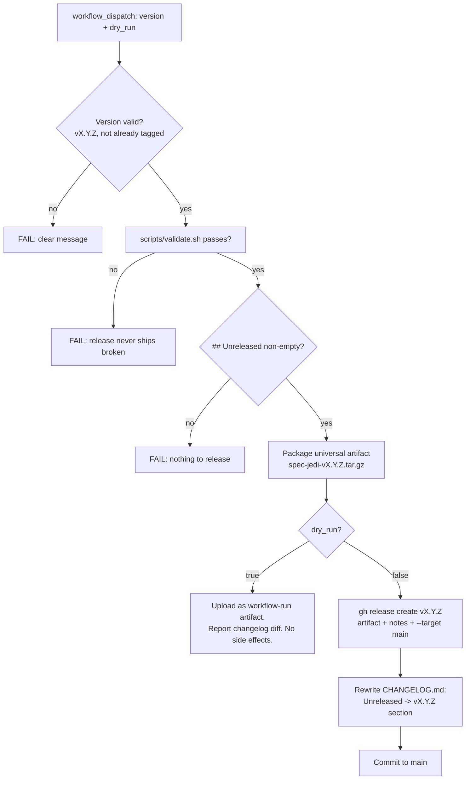

# Quickstart: Verifying the Release Packaging Workflow

**Feature**: 020-release-packaging

## Prerequisites

- `scripts/package-release.sh`/`.ps1` and `.github/workflows/release.yml` implemented

## The mechanism, visually



## Scenario 1: Local packaging script sanity check

```bash
rm -rf /tmp/release-package-test
bash scripts/package-release.sh v0.1.0-test /tmp/release-package-test
tar -tzf /tmp/release-package-test/spec-jedi-v0.1.0-test.tar.gz | head -30
```

**Expected outcome**: the archive lists every `.claude/skills/specjedi-*/`
directory, the four `.specify/templates/*.md` files, `scripts/install.sh`,
`scripts/install.ps1`, and `LICENSE` — zero `speckit-*` entries.

## Scenario 2: Packaged artifact installs identically to a full clone

```bash
mkdir -p /tmp/release-extract-test
tar -xzf /tmp/release-package-test/spec-jedi-v0.1.0-test.tar.gz -C /tmp/release-extract-test
cd /tmp/release-extract-test
rm -rf /tmp/from-artifact-install
bash scripts/install.sh /tmp/from-artifact-install --harness claude-code
find /tmp/from-artifact-install/.claude/skills -maxdepth 1 -name 'specjedi-*' -type d | wc -l
```

**Expected outcome**: same skill count (23) as a normal in-clone install.

## Scenario 3: Dry run produces zero durable side effects

```bash
gh workflow run release.yml -f version=v0.1.0-rehearsal -f dry_run=true
# after it completes:
git tag -l 'v0.1.0-rehearsal'      # expect: no output
gh release view v0.1.0-rehearsal 2>&1  # expect: "release not found"
git log origin/main -1 --format=%s     # expect: unchanged, no new commit
```

**Expected outcome**: every validation/packaging step ran (visible in the
workflow run's log/summary and its uploaded artifact), but no tag, no
release, no commit exist afterward.

## Scenario 4: Malformed or duplicate version fails fast

```bash
gh workflow run release.yml -f version=not-a-version -f dry_run=true
# expect: run fails immediately at the version-validation step
```

## Scenario 5: `validate.sh` failure blocks the release

Not reproducible without deliberately breaking `validate.sh` locally — the
requirement (FR-004) is proven by code review of the workflow's step
ordering (validation before packaging) rather than a live broken-state
run, the same honest-scoping approach used for structural CI proofs
throughout this session.

## Scenario 6: The real first cut (v0.1.0) — not part of this feature

Explicitly out of scope for this feature's own verification (spec.md
Assumptions) — a separate, deliberate `dry_run: false` maintainer action
taken after this feature ships and Scenario 3 has been rehearsed for
real.
